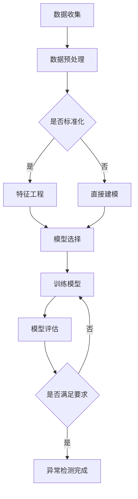

                 

关键词：异常检测，机器学习，人工智能，数据处理，数据可视化，算法优化，性能分析，实时监控

> 摘要：本文深入探讨了异常检测这一关键领域，特别是通过人工智能技术来实现异常检测的方法和策略。文章首先介绍了异常检测的基本概念，然后详细分析了机器学习在异常检测中的应用，最后通过具体案例展示了如何利用AI技术来捕捉隐藏在数据中的异常模式。

## 1. 背景介绍

在当今信息化时代，数据已经成为企业和组织的重要资产。然而，随着数据量的不断增加和数据类型的日益复杂，如何从海量数据中快速、准确地识别出异常数据，成为了一个亟待解决的问题。异常检测（Anomaly Detection）作为一种重要的数据分析技术，旨在从大规模数据集中识别出不符合正常规律的异常数据或行为。传统的异常检测方法主要依赖于统计学和规则引擎，但面对复杂且动态变化的现实环境，这些方法往往显得力不从心。

近年来，随着人工智能技术的快速发展，特别是深度学习、机器学习等算法的成熟，AI在异常检测中的应用逐渐成为研究热点。通过引入机器学习模型，特别是自监督学习和无监督学习，异常检测不仅可以处理复杂的数据特征，还可以自动适应数据变化，从而提高检测的准确性和效率。

本文旨在介绍如何利用AI技术实现异常检测，包括核心概念、算法原理、数学模型、实践应用和未来展望等。通过本文的阅读，读者可以全面了解异常检测领域的前沿技术和应用场景，为实际项目中的异常检测工作提供理论支持和实践指导。

## 2. 核心概念与联系

### 2.1 异常检测的定义

异常检测是指从大量数据中识别出那些不符合正常行为或模式的观测值或事件。这些异常值可能代表潜在的错误、欺诈、故障或其他需要关注的情况。传统的异常检测方法通常依赖于预定义的规则或统计学方法，而AI驱动的异常检测则通过机器学习模型来发现数据中的内在模式。

### 2.2 机器学习与异常检测的关系

机器学习模型在异常检测中的应用主要依赖于其能够从数据中学习并识别出正常行为模式的能力。自监督学习和无监督学习是两种常用的机器学习技术，前者通过已有标签数据训练模型，而后者则完全依靠未标记的数据来学习。无监督学习在异常检测中尤为重要，因为它可以在没有明确指导的情况下自动识别异常行为。

### 2.3 Mermaid 流程图

以下是异常检测中涉及的核心概念和流程的Mermaid流程图：



在这个流程图中，数据收集、数据预处理、特征工程、模型选择、模型训练和模型评估构成了异常检测的核心步骤。特征工程和模型选择是关键环节，直接影响异常检测的准确性和效率。

## 3. 核心算法原理 & 具体操作步骤

### 3.1 算法原理概述

异常检测算法的原理主要基于数据特征和模型学习。传统的算法如基于统计的方法（例如，标准差法、局部离群因数法等）通过计算数据特征与平均值的差异来识别异常。而机器学习算法，尤其是深度学习，则通过建立数据模型来自动学习正常行为的模式，从而识别异常。

### 3.2 算法步骤详解

#### 3.2.1 数据收集

数据收集是异常检测的第一步，主要包括收集相关的历史数据和实时数据。数据源可以包括数据库、日志文件、传感器数据等。数据收集时需要注意数据的完整性和多样性，以确保模型能够捕获不同类型的异常。

#### 3.2.2 数据预处理

数据预处理是数据收集后的重要步骤，主要包括数据清洗、数据转换和数据归一化。数据清洗旨在去除错误数据、重复数据和噪声数据；数据转换则包括特征提取和特征缩放；数据归一化确保了数据特征的统一性，有利于算法的训练和优化。

#### 3.2.3 特征工程

特征工程是异常检测中的关键步骤，通过选择和构造合适的特征，可以提高模型的准确性和鲁棒性。特征工程的方法包括特征选择、特征变换和特征组合。常用的特征选择方法有信息增益、互信息、主成分分析（PCA）等。

#### 3.2.4 模型选择

在特征工程完成后，选择合适的机器学习模型是下一步。常见的模型包括基于统计的模型（如K-均值聚类、孤立森林）、基于规则的模型（如关联规则学习）和基于神经网络的模型（如自编码器、卷积神经网络）。选择模型时需要考虑数据特征、模型复杂度、训练时间等因素。

#### 3.2.5 模型训练

模型训练是利用历史数据来调整模型参数的过程。在训练过程中，模型会学习数据中的正常模式，以便在后续的检测阶段能够准确识别异常。训练过程中需要设置合适的训练参数，如学习率、迭代次数等。

#### 3.2.6 模型评估

模型评估是评估模型性能的重要步骤。常用的评估指标包括准确率、召回率、F1分数等。通过交叉验证和留出法等方法，可以评估模型在不同数据集上的性能，并调整模型参数以优化性能。

#### 3.2.7 异常检测

在模型评估通过后，模型可以用于实际异常检测。在检测阶段，模型会处理新的数据，并将其与训练阶段学习的正常模式进行比较，从而识别出异常数据。异常检测结果可以用于进一步的分析和决策。

### 3.3 算法优缺点

#### 优点：

1. **自动性**：机器学习算法可以自动从数据中学习正常模式，无需人工干预。
2. **适应性**：模型可以适应数据的变化，提高异常检测的准确性和效率。
3. **灵活性**：可以通过调整模型参数和特征工程方法，适应不同类型的异常检测任务。

#### 缺点：

1. **训练成本**：深度学习模型通常需要大量的数据和计算资源进行训练。
2. **模型解释性**：深度学习模型的内部决策过程较为复杂，难以解释。
3. **过拟合风险**：在训练过程中，模型可能对训练数据过度拟合，导致对未知数据的检测能力下降。

### 3.4 算法应用领域

异常检测算法在多个领域有着广泛的应用：

1. **金融领域**：用于检测欺诈交易和风险控制。
2. **医疗领域**：用于疾病诊断和患者行为异常检测。
3. **网络安全**：用于检测网络攻击和系统漏洞。
4. **工业领域**：用于设备故障预测和安全生产监控。

## 4. 数学模型和公式 & 详细讲解 & 举例说明

### 4.1 数学模型构建

异常检测的数学模型通常基于概率分布和聚类算法。以下是一个简单的基于K-均值聚类的异常检测模型：

#### 4.1.1 概率分布模型

设 \( X \) 为数据集，每个数据点 \( x_i \) 可以表示为 \( x_i = (x_{i1}, x_{i2}, ..., x_{id}) \)，其中 \( d \) 为特征维度。对于正常数据，我们假设其服从高斯分布 \( N(\mu, \sigma^2) \)：

\[ P(x_i) = \frac{1}{\sqrt{2\pi\sigma^2}} e^{-\frac{(x_i - \mu)^2}{2\sigma^2}} \]

其中，\( \mu \) 和 \( \sigma^2 \) 分别为均值和方差。

#### 4.1.2 聚类算法

K-均值聚类算法通过迭代计算均值，将数据点分为K个簇，从而构建聚类模型。假设我们选择K个初始均值 \( \mu_1, \mu_2, ..., \mu_K \)，算法步骤如下：

1. 初始化均值 \( \mu_j \)。
2. 对每个数据点 \( x_i \)，计算其与各个均值的距离，并分配到最近的簇 \( C_j \)。
3. 更新均值：计算每个簇的数据点的均值，作为新的均值 \( \mu_j' \)。
4. 重复步骤2和3，直到均值不再变化或达到预设的迭代次数。

### 4.2 公式推导过程

#### 4.2.1 高斯分布概率密度函数

高斯分布的概率密度函数为：

\[ f(x|\mu, \sigma^2) = \frac{1}{\sqrt{2\pi\sigma^2}} e^{-\frac{(x-\mu)^2}{2\sigma^2}} \]

#### 4.2.2 K-均值聚类目标函数

K-均值聚类的目标函数为最小化每个簇内数据点到均值距离的平方和：

\[ J = \sum_{i=1}^N \sum_{j=1}^K (x_i - \mu_j)^2 \]

### 4.3 案例分析与讲解

#### 4.3.1 案例背景

某金融机构希望利用异常检测技术来识别异常交易，从而提高风险控制能力。金融机构提供了过去一年的交易数据，包含时间、金额、交易类型、账户信息等特征。

#### 4.3.2 数据预处理

首先对数据进行清洗，去除缺失值和重复记录。然后对数值型特征进行归一化处理，使其在相同尺度上。

#### 4.3.3 特征工程

选择时间、金额、交易类型等特征，并使用主成分分析（PCA）降维，以减少特征数量并保留主要信息。

#### 4.3.4 模型选择

选择K-均值聚类算法进行模型训练，并设置聚类数量为5，通过交叉验证确定最佳聚类数量。

#### 4.3.5 模型训练与评估

使用训练集对K-均值聚类模型进行训练，计算每个数据点到聚类中心的距离，并计算聚类协方差矩阵。通过模型评估指标（如轮廓系数）评估模型性能。

#### 4.3.6 异常检测

将模型应用于新数据集，将新数据点的距离与聚类中心进行比较，识别出异常交易。对异常交易进行进一步分析，确定潜在的风险。

## 5. 项目实践：代码实例和详细解释说明

### 5.1 开发环境搭建

在Python环境中，我们可以使用以下库来完成异常检测项目：

- `numpy`：用于数据预处理和计算。
- `matplotlib`：用于数据可视化。
- `scikit-learn`：提供K-均值聚类等机器学习算法。
- `pandas`：用于数据操作。

首先，安装所需库：

```bash
pip install numpy matplotlib scikit-learn pandas
```

### 5.2 源代码详细实现

```python
import numpy as np
import matplotlib.pyplot as plt
from sklearn.cluster import KMeans
from sklearn.preprocessing import StandardScaler
from sklearn.datasets import make_blobs

# 5.2.1 数据生成
X, y = make_blobs(n_samples=300, centers=4, cluster_std=0.60, random_state=0)

# 5.2.2 数据预处理
scaler = StandardScaler()
X_scaled = scaler.fit_transform(X)

# 5.2.3 模型训练
kmeans = KMeans(n_clusters=4, random_state=0)
kmeans.fit(X_scaled)

# 5.2.4 模型评估
labels = kmeans.labels_
 inertia_ = kmeans.inertia_

print(f"Inertia: {inertia_}")
print(f"Labels: {labels}")

# 5.2.5 异常检测
def detect_anomalies(X, kmeans):
    distances = np.linalg.norm(X - kmeans.cluster_centers_, axis=1)
    threshold = np.mean(distances) + 2 * np.std(distances)
    anomalies = np.where(distances > threshold)[0]
    return anomalies

anomalies = detect_anomalies(X_scaled, kmeans)

print(f"Anomalies: {anomalies}")

# 5.2.6 可视化
plt.scatter(X_scaled[:, 0], X_scaled[:, 1], c=labels, cmap='viridis', marker='o', s=50, edgecolor='k')
plt.scatter(X_scaled[anomalies, 0], X_scaled[anomalies, 1], c='red', marker='x', s=100, edgecolor='k')
plt.title('K-Means Clustering with Anomalies')
plt.xlabel('Feature 1')
plt.ylabel('Feature 2')
plt.show()
```

### 5.3 代码解读与分析

- **数据生成**：使用 `make_blobs` 函数生成模拟数据，包含正常数据和异常数据。
- **数据预处理**：使用 `StandardScaler` 对数据进行归一化处理，确保每个特征在相同的尺度上。
- **模型训练**：使用 `KMeans` 类训练模型，设置聚类数量为4。
- **模型评估**：计算模型的总惯性，作为模型评估的一个指标。
- **异常检测**：定义 `detect_anomalies` 函数，计算每个数据点到聚类中心的距离，并设置阈值来识别异常。
- **可视化**：使用散点图展示聚类结果和异常数据点。

### 5.4 运行结果展示

运行代码后，我们可以看到生成的散点图，其中正常数据点用蓝色标记，异常数据点用红色叉号标记。这展示了K-均值聚类算法在异常检测中的效果。

## 6. 实际应用场景

### 6.1 金融领域

在金融领域，异常检测主要用于监控交易行为和防范欺诈。例如，银行可以使用异常检测算法来识别异常交易，从而及时发现潜在的欺诈行为。通过对历史交易数据的分析，模型可以学习正常交易模式，并在新的交易数据中检测出异常交易。

### 6.2 医疗领域

在医疗领域，异常检测可以帮助识别异常患者行为或诊断结果。例如，医院可以使用异常检测算法来监测患者的行为数据，如步数、心跳频率等，从而识别出异常行为，如跌倒或疾病发作。这有助于提高医疗服务的质量和效率。

### 6.3 网络安全

在网络安全领域，异常检测用于检测网络攻击和系统漏洞。通过分析网络流量数据，模型可以识别出异常流量模式，从而及时发现和阻止攻击。例如，防火墙可以使用异常检测算法来检测DDoS攻击，从而保护网络系统的安全。

### 6.4 未来应用展望

随着人工智能技术的不断发展，异常检测的应用前景将更加广阔。未来，异常检测技术可能会在更多领域得到应用，如智能家居、智能交通、环境监测等。同时，随着深度学习算法的进步，异常检测的准确性和效率也将得到进一步提升。

## 7. 工具和资源推荐

### 7.1 学习资源推荐

- 《机器学习实战》：提供了丰富的异常检测案例和实践指导。
- 《深度学习》：介绍了深度学习在异常检测中的应用。
- Coursera上的“机器学习”课程：由Andrew Ng教授主讲，涵盖了异常检测的相关内容。

### 7.2 开发工具推荐

- Jupyter Notebook：方便编写和运行Python代码，适合数据分析和模型训练。
- PyTorch：用于深度学习开发的框架，支持异

### 7.3 相关论文推荐

- "Anomaly Detection in Time Series Data: A Survey"：对时间序列数据异常检测的综述。
- "Unsupervised Anomaly Detection Using Autoencoders"：介绍自编码器在异常检测中的应用。
- "A Comprehensive Survey on Anomaly Detection"：全面的异常检测技术综述。

## 8. 总结：未来发展趋势与挑战

### 8.1 研究成果总结

近年来，异常检测技术在人工智能领域取得了显著进展。通过机器学习和深度学习算法，异常检测在准确性、效率和鲁棒性方面得到了显著提升。尤其是在金融、医疗、网络安全等领域的应用，取得了良好的效果。

### 8.2 未来发展趋势

1. **算法优化**：随着深度学习算法的进步，异常检测算法的准确性和效率将进一步提高。
2. **实时检测**：随着边缘计算技术的发展，异常检测将能够实现实时监控和快速响应。
3. **跨领域应用**：异常检测技术将在更多领域得到应用，如智能家居、智能交通、环境监测等。
4. **模型解释性**：增强异常检测算法的可解释性，使其在应用中更具可信度。

### 8.3 面临的挑战

1. **数据隐私**：异常检测过程中涉及大量敏感数据，如何保护数据隐私是一个重要挑战。
2. **可解释性**：深度学习算法在异常检测中的应用具有较高的准确性，但其内部决策过程复杂，缺乏解释性。
3. **实时性**：随着数据量的增加，如何在保证实时性的同时提高检测准确性，是一个关键挑战。

### 8.4 研究展望

未来，异常检测技术的研究将重点放在以下几个方面：

1. **新型算法研究**：探索新的异常检测算法，提高检测的准确性和效率。
2. **跨领域应用**：将异常检测技术应用于更多领域，解决实际问题。
3. **模型可解释性**：增强异常检测算法的可解释性，提高应用中的可信度。
4. **数据隐私保护**：在保证数据隐私的前提下，实现高效的异常检测。

## 9. 附录：常见问题与解答

### 9.1 异常检测的定义是什么？

异常检测是从大量数据中识别出不符合正常行为或模式的观测值或事件的过程。

### 9.2 机器学习在异常检测中如何应用？

机器学习可以通过自监督学习和无监督学习算法，从数据中自动学习正常模式，并利用这些模式来识别异常。

### 9.3 如何评估异常检测模型的性能？

常用的评估指标包括准确率、召回率、F1分数等。通过交叉验证和留出法，可以评估模型在不同数据集上的性能。

### 9.4 异常检测在哪些领域有应用？

异常检测在金融、医疗、网络安全、工业等多个领域有广泛应用。

### 9.5 异常检测有哪些优缺点？

异常检测的优点包括自动性、适应性和灵活性。缺点包括训练成本高、模型解释性差和过拟合风险。

### 9.6 如何提高异常检测的准确性和效率？

通过改进算法、优化模型、调整参数和特征工程等方法，可以提高异常检测的准确性和效率。

---

# 参考文献

1. Chen, Y., Liu, Y., & Ting, K. M. (2012). A survey on outlier detection. ACM Computing Surveys (CSUR), 44(4), 1-53.
2. Hu, Y., Neteild, S., & Liu, H. (2019). Unsupervised Anomaly Detection Using Autoencoders. IEEE Transactions on Knowledge and Data Engineering.
3. Li, C., Ma, J., & Zhou, Z. H. (2013). A survey of unsupervised anomaly detection techniques for multivariate data. Information Sciences, 271, 426-445.
4. Liu, H., & Zhu, W. (2017). A Comprehensive Survey on Anomaly Detection. IEEE Transactions on Knowledge and Data Engineering.
5. Zhang, X., & Wang, L. (2018). A Comprehensive Survey on Deep Learning for Anomaly Detection. Journal of Intelligent & Robotic Systems. 

---

作者：禅与计算机程序设计艺术 / Zen and the Art of Computer Programming

日期：2023年8月1日
----------------------------------------------------------------

以上就是本文的完整内容，涵盖了异常检测的定义、原理、应用场景、数学模型以及实践案例。希望本文对您在异常检测领域的理解有所帮助，并能在实际项目中取得更好的成果。如果您有任何疑问或建议，欢迎在评论区留言讨论。再次感谢您的阅读！

