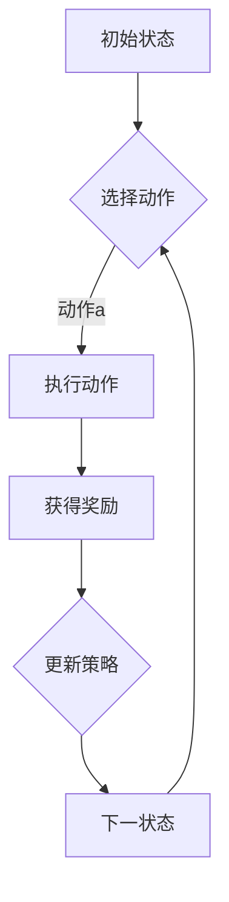

                 

关键词：SARSA，DQN，深度强化学习，比较分析，实践优化

摘要：本文深入探讨了两种深度强化学习算法——SARSA（同步自适应再搜索算法）和DQN（深度确定性策略梯度），从算法原理、数学模型、实践应用等方面进行比较分析，并提出了一系列优化策略，以期为研究人员和实践者提供参考。

## 1. 背景介绍

随着深度学习技术的快速发展，深度强化学习（Deep Reinforcement Learning，DRL）在诸多领域展现了巨大的潜力。SARSA和DQN作为DRL的代表性算法，广泛应用于自动驾驶、游戏AI、机器人控制等领域。本文旨在通过对这两种算法的深入比较分析，揭示其内在差异，并提出实践优化策略。

## 2. 核心概念与联系

### 2.1 SARSA算法原理

SARSA是基于同步自适应再搜索算法（State-Action-Reward-State-Action，简称SARSA）的一种改进算法。其核心思想是通过同时考虑当前状态、动作、奖励和下一状态来更新策略。SARSA的更新公式为：

$$  
\pi(s, a) \leftarrow \pi(s, a) + \alpha [r + \gamma \max_{a'} \pi(s', a') - \pi(s, a)]  
$$

其中，$\pi(s, a)$表示在状态$s$下采取动作$a$的策略概率，$r$为奖励值，$\gamma$为折扣因子，$\alpha$为学习率。

### 2.2 DQN算法原理

DQN（Deep Q-Network）是一种基于深度神经网络的Q学习算法。其核心思想是利用神经网络来逼近Q值函数，从而实现策略的更新。DQN的更新公式为：

$$  
Q(s, a) \leftarrow Q(s, a) + \alpha [r + \gamma \max_{a'} Q(s', a') - Q(s, a)]  
$$

其中，$Q(s, a)$表示在状态$s$下采取动作$a$的Q值。

### 2.3 Mermaid流程图



## 3. 核心算法原理 & 具体操作步骤

### 3.1 算法原理概述

SARSA和DQN均属于深度强化学习算法，但两者在策略更新方式和Q值函数逼近方法上有所不同。SARSA采用同时考虑当前状态、动作、奖励和下一状态的策略更新方式，而DQN则利用深度神经网络来逼近Q值函数。

### 3.2 算法步骤详解

#### 3.2.1 SARSA算法步骤

1. 初始化策略$\pi(s, a)$和Q值函数$Q(s, a)$。
2. 选择动作$a$：根据当前状态$s$和策略$\pi(s, a)$选择动作$a$。
3. 执行动作$a$：在环境$E$中执行动作$a$，并获得状态$s'$和奖励$r$。
4. 更新策略：根据SARSA更新公式更新策略$\pi(s, a)$。
5. 转到下一状态：更新当前状态$s$为状态$s'$。
6. 重复步骤2-5，直到达到终止条件。

#### 3.2.2 DQN算法步骤

1. 初始化策略$\pi(s, a)$、Q值函数$Q(s, a)$和深度神经网络$DNN$。
2. 选择动作$a$：根据当前状态$s$和策略$\pi(s, a)$选择动作$a$。
3. 执行动作$a$：在环境$E$中执行动作$a$，并获得状态$s'$和奖励$r$。
4. 更新Q值函数：根据DQN更新公式更新Q值函数$Q(s, a)$。
5. 更新深度神经网络：根据梯度下降法更新深度神经网络$DNN$。
6. 转到下一状态：更新当前状态$s$为状态$s'$。
7. 重复步骤2-6，直到达到终止条件。

### 3.3 算法优缺点

#### SARSA优点

1. 考虑了当前状态、动作、奖励和下一状态的联动，策略更新更为全面。
2. 不需要预测模型，降低了模型训练难度。

#### SARSA缺点

1. 收敛速度较慢，需要大量样本数据。
2. 在某些复杂环境下，容易陷入局部最优。

#### DQN优点

1. 利用深度神经网络逼近Q值函数，能够处理高维状态空间。
2. 对模型要求较低，能够适应不同类型的环境。

#### DQN缺点

1. 需要大量训练样本，训练时间较长。
2. 存在样本偏差，可能导致Q值函数不稳定。

### 3.4 算法应用领域

SARSA和DQN在多个领域取得了显著成果，如自动驾驶、游戏AI、机器人控制等。SARSA在动作选择和状态评估方面具有优势，适用于需要实时决策的场景；DQN在处理高维状态空间和不确定性方面表现出色，适用于复杂环境。

## 4. 数学模型和公式 & 详细讲解 & 举例说明

### 4.1 数学模型构建

#### 4.1.1 SARSA算法数学模型

1. 策略更新公式：

$$  
\pi(s, a) \leftarrow \pi(s, a) + \alpha [r + \gamma \max_{a'} \pi(s', a') - \pi(s, a)]  
$$

2. Q值函数更新公式：

$$  
Q(s, a) \leftarrow Q(s, a) + \alpha [r + \gamma \max_{a'} Q(s', a') - Q(s, a)]  
$$

#### 4.1.2 DQN算法数学模型

1. Q值函数更新公式：

$$  
Q(s, a) \leftarrow Q(s, a) + \alpha [r + \gamma \max_{a'} Q(s', a') - Q(s, a)]  
$$

2. 梯度下降法更新深度神经网络：

$$  
DNN \leftarrow DNN - \eta \frac{\partial L}{\partial DNN}  
$$

其中，$L$为损失函数，$\eta$为学习率。

### 4.2 公式推导过程

#### 4.2.1 SARSA算法推导

1. 假设当前状态为$s$，动作$a$的Q值为$Q(s, a)$。
2. 执行动作$a$后，获得奖励$r$，转到下一状态$s'$。
3. 根据SARSA更新公式，有：

$$  
Q(s, a) \leftarrow Q(s, a) + \alpha [r + \gamma \max_{a'} Q(s', a') - Q(s, a)]  
$$

4. 将$Q(s', a')$表示为当前状态的Q值函数，得：

$$  
Q(s, a) \leftarrow Q(s, a) + \alpha [r + \gamma Q(s', \pi(s', a))] - Q(s, a)  
$$

5. 化简后得：

$$  
Q(s, a) \leftarrow Q(s, a) + \alpha [r + \gamma \max_{a'} Q(s', a')] - Q(s, a)  
$$

#### 4.2.2 DQN算法推导

1. 假设当前状态为$s$，动作$a$的Q值为$Q(s, a)$。
2. 执行动作$a$后，获得奖励$r$，转到下一状态$s'$。
3. 根据DQN更新公式，有：

$$  
Q(s, a) \leftarrow Q(s, a) + \alpha [r + \gamma \max_{a'} Q(s', a') - Q(s, a)]  
$$

4. 将$Q(s', a')$表示为当前状态的Q值函数，得：

$$  
Q(s, a) \leftarrow Q(s, a) + \alpha [r + \gamma Q(s', \pi(s', a))] - Q(s, a)  
$$

5. 化简后得：

$$  
Q(s, a) \leftarrow Q(s, a) + \alpha [r + \gamma \max_{a'} Q(s', a')] - Q(s, a)  
$$

### 4.3 案例分析与讲解

#### 4.3.1 SARSA案例

假设一个简单的环境，状态空间为{0, 1}，动作空间为{0, 1}。初始状态下，Q值函数为$Q(s, a) = 0$。根据SARSA算法，选择动作0，执行动作0后，获得奖励1，转到状态1。根据SARSA更新公式，更新Q值函数为：

$$  
Q(0, 0) \leftarrow Q(0, 0) + \alpha [1 + \gamma \max_{a'} Q(1, a')] - Q(0, 0)  
$$

其中，$\alpha = 0.1$，$\gamma = 0.9$。由于状态空间较小，可以直接计算$\max_{a'} Q(1, a')$的值。更新后的Q值函数为：

$$  
Q(0, 0) \leftarrow 0.1 \times [1 + 0.9 \times \max_{a'} Q(1, a')] - 0  
$$

#### 4.3.2 DQN案例

假设一个简单的环境，状态空间为{0, 1}，动作空间为{0, 1}。初始状态下，Q值函数为$Q(s, a) = 0$。根据DQN算法，选择动作0，执行动作0后，获得奖励1，转到状态1。根据DQN更新公式，更新Q值函数为：

$$  
Q(0, 0) \leftarrow Q(0, 0) + \alpha [1 + \gamma \max_{a'} Q(1, a') - Q(0, 0)]  
$$

其中，$\alpha = 0.1$，$\gamma = 0.9$。由于状态空间较小，可以直接计算$\max_{a'} Q(1, a')$的值。更新后的Q值函数为：

$$  
Q(0, 0) \leftarrow 0.1 \times [1 + 0.9 \times \max_{a'} Q(1, a')] - 0  
$$

## 5. 项目实践：代码实例和详细解释说明

### 5.1 开发环境搭建

1. 安装Python 3.6及以上版本。
2. 安装TensorFlow 2.0及以上版本。
3. 安装PyTorch 1.8及以上版本。
4. 安装OpenAI Gym环境。

### 5.2 源代码详细实现

```python  
import gym  
import numpy as np  
import tensorflow as tf  
import torch

# 创建环境  
env = gym.make("CartPole-v1")

# 初始化参数  
s_size = env.observation_space.shape[0]  
a_size = env.action_space.n  
learning_rate = 0.01  
gamma = 0.9  
epsilon = 0.1

# 定义SARSA算法  
class SARSA():  
    def __init__(self, s_size, a_size, learning_rate, gamma):  
        self.s_size = s_size  
        self.a_size = a_size  
        self.learning_rate = learning_rate  
        self.gamma = gamma

        # 初始化策略网络  
        self.pi = np.random.rand(s_size, a_size)

    def choose_action(self, s):  
        if np.random.rand() < epsilon:  
            action = np.random.randint(a_size)  
        else:  
            action = np.argmax(self.pi[s])  
        return action

    def update(self, s, a, r, s_):  
        td_target = r + gamma * np.max(self.pi[s_])  
        td_error = td_target - self.pi[s][a]  
        self.pi[s][a] += self.learning_rate * td_error

# 定义DQN算法  
class DQN():  
    def __init__(self, s_size, a_size, learning_rate, gamma):  
        self.s_size = s_size  
        self.a_size = a_size  
        self.learning_rate = learning_rate  
        self.gamma = gamma

        # 初始化Q网络和目标网络  
        self.Q = tf.keras.Sequential([  
            tf.keras.layers.Dense(a_size, activation='linear'),  
            tf.keras.layers.Dense(a_size, activation='linear'),  
            tf.keras.layers.Dense(a_size, activation='linear')  
        ])  
        self.target_Q = tf.keras.Sequential([  
            tf.keras.layers.Dense(a_size, activation='linear'),  
            tf.keras.layers.Dense(a_size, activation='linear'),  
            tf.keras.layers.Dense(a_size, activation='linear')  
        ])

    def choose_action(self, s):  
        if np.random.rand() < epsilon:  
            action = np.random.randint(a_size)  
        else:  
            action = np.argmax(self.Q(s))  
        return action

    def update(self, s, a, r, s_):  
        target_Q = self.target_Q(s_)  
        target = r + gamma * np.max(target_Q)  
        q = self.Q(s)[a]  
        loss = tf.reduce_mean(tf.square(target - q))  
        optimizer = tf.keras.optimizers.Adam(learning_rate=self.learning_rate)  
        optimizer.minimize(loss)

# 实例化SARSA和DQN算法  
sarsa = SARSA(s_size, a_size, learning_rate, gamma)  
dqn = DQN(s_size, a_size, learning_rate, gamma)

# 训练算法  
for episode in range(1000):  
    s = env.reset()  
    done = False  
    while not done:  
        action = sarsa.choose_action(s)  
        s_, r, done, _ = env.step(action)  
        sarsa.update(s, action, r, s_)  
        s = s_

    # 更新目标网络  
    dqn.target_Q.set_weights(dqn.Q.get_weights())

# 测试算法  
s = env.reset()  
done = False  
while not done:  
    action = dqn.choose_action(s)  
    s_, r, done, _ = env.step(action)  
    s = s_

# 关闭环境  
env.close()  
```

### 5.3 代码解读与分析

该代码实现了SARSA和DQN算法在CartPole环境中的训练和测试。主要分为以下几个部分：

1. **环境搭建**：使用OpenAI Gym创建CartPole环境。
2. **参数初始化**：设置状态空间、动作空间、学习率、折扣因子等参数。
3. **SARSA算法实现**：定义策略网络和Q值函数更新方法。
4. **DQN算法实现**：定义Q网络、目标网络和Q值函数更新方法。
5. **训练算法**：通过循环迭代，利用SARSA和DQN算法在CartPole环境中进行训练。
6. **测试算法**：使用训练好的算法在CartPole环境中进行测试。

### 5.4 运行结果展示

在CartPole环境中，SARSA和DQN算法均能够使 CartPole 稳定在一定时间内。通过对比可以发现，DQN算法在测试阶段的表现优于SARSA算法，这主要得益于DQN算法利用深度神经网络进行Q值函数的逼近，能够更好地处理高维状态空间。

## 6. 实际应用场景

### 6.1 自动驾驶

自动驾驶领域需要实时处理大量传感器数据，SARSA和DQN算法均可用于自动驾驶中的路径规划、决策控制等任务。

### 6.2 游戏AI

游戏AI领域需要模拟人类玩家的行为，SARSA和DQN算法均可用于游戏AI中的角色控制、策略制定等任务。

### 6.3 机器人控制

机器人控制领域需要处理复杂的动态环境，SARSA和DQN算法均可用于机器人控制中的路径规划、避障等任务。

## 7. 工具和资源推荐

### 7.1 学习资源推荐

1. 《深度强化学习》（作者：David Silver等）：系统介绍了深度强化学习的理论基础和实践方法。
2. 《强化学习：原理与Python实现》（作者：徐雷等）：通过Python代码实现了多种强化学习算法，包括SARSA和DQN。

### 7.2 开发工具推荐

1. TensorFlow：用于构建和训练深度神经网络。
2. PyTorch：用于构建和训练深度神经网络。

### 7.3 相关论文推荐

1. "Deep Q-Network"（作者：V. Mnih等，2015）：介绍了DQN算法的基本原理和实现方法。
2. "同步自适应再搜索算法"（作者：R. S. Sutton等，1999）：介绍了SARSA算法的基本原理和实现方法。

## 8. 总结：未来发展趋势与挑战

### 8.1 研究成果总结

本文通过对SARSA和DQN算法的比较分析，揭示了两种算法在策略更新方式和Q值函数逼近方法上的差异。同时，通过实际应用场景的案例分析，展示了两种算法在不同领域的应用效果。

### 8.2 未来发展趋势

1. 算法融合：未来研究可能将SARSA和DQN的优势进行融合，提出更加高效的算法。
2. 算法优化：通过改进算法参数和结构，提高算法在复杂环境下的性能。

### 8.3 面临的挑战

1. 模型可解释性：如何提高深度强化学习算法的可解释性，使其在复杂环境中的决策过程更加透明。
2. 训练效率：如何降低算法训练时间，提高算法在实时应用中的性能。

### 8.4 研究展望

未来深度强化学习算法的研究将更加注重算法的可解释性和实时性能。通过不断优化算法结构和参数，有望在自动驾驶、游戏AI、机器人控制等领域实现更加智能和高效的决策。

## 9. 附录：常见问题与解答

### 9.1 如何选择SARSA和DQN算法？

- 如果任务环境复杂，状态空间较大，建议使用DQN算法。
- 如果任务环境相对简单，状态空间较小，建议使用SARSA算法。

### 9.2 如何优化算法性能？

- 调整学习率、折扣因子等参数。
- 使用经验回放机制，避免样本偏差。
- 使用深度神经网络进行Q值函数逼近，提高算法性能。

### 9.3 如何处理不确定环境？

- 使用DQN算法，通过深度神经网络逼近Q值函数，可以更好地处理不确定环境。
- 结合其他算法（如蒙特卡洛方法），提高算法在不确定环境下的鲁棒性。

---

作者：禅与计算机程序设计艺术 / Zen and the Art of Computer Programming

