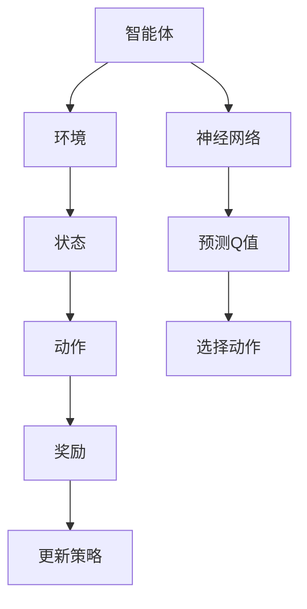

                 

关键词：深度强化学习，DQN，DDQN，PDQN，改进算法，神经网路，智能决策

## 摘要

本文旨在深入探讨深度强化学习（DRL）中的DQN（深度Q网络）及其改进版本：DDQN（双Q网络）和PDQN（概率差分Q网络）。通过对这些算法的原理、实现步骤、数学模型以及实际应用进行分析，本文将揭示这些改进算法在智能决策和自主控制领域的重要性。文章首先介绍了DRL的基本概念和DQN的工作原理，然后详细讨论了DDQN和PDQN的创新点和优势，最后对未来的研究方向进行了展望。

## 1. 背景介绍

在过去的几十年中，强化学习（Reinforcement Learning，RL）作为一种机器学习方法，已经被广泛应用于人工智能（AI）和自动控制领域。强化学习的核心思想是通过与环境的交互来学习策略，以达到最大化累积奖励的目的。而深度强化学习（Deep Reinforcement Learning，DRL）则是强化学习的一个分支，它利用深度神经网络（Deep Neural Networks，DNNs）来近似状态值函数或策略函数，从而在复杂环境中实现智能体的自主学习和决策。

### 1.1 强化学习的基本概念

强化学习的基本概念包括以下几个部分：

- **智能体（Agent）**：执行动作并获取反馈的实体。
- **环境（Environment）**：智能体所处的场景，包括状态空间和动作空间。
- **状态（State）**：环境的一个具体情形。
- **动作（Action）**：智能体可以执行的行为。
- **奖励（Reward）**：对智能体动作的反馈，用于评价动作的好坏。
- **策略（Policy）**：智能体在特定状态下的动作选择规则。

在强化学习中，智能体通过不断与环境交互，学习到一个最优策略，以便在未来的交互中获得最大的累积奖励。这一过程通常被称为"策略迭代"。

### 1.2 深度强化学习的发展

深度强化学习的发展可以追溯到深度学习和强化学习相结合的早期尝试。最初，研究人员尝试使用基于策略的DRL方法，如Deep Q-Learning（DQL）和Deep Policy Gradient（DPPG），但由于这些方法在实际应用中的表现并不理想，研究者们开始探索基于值函数的DRL方法。值函数方法通过学习状态值函数或状态-动作值函数来指导智能体的行动，这种方法在理论上更为稳定和有效。

其中，DQN（Deep Q-Network）是深度强化学习领域的一个重要突破。DQN通过使用深度神经网络来近似Q函数，极大地提高了在复杂环境中的学习效率和性能。然而，DQN也存在一些固有的缺陷，如训练不稳定、样本效率低等。为了解决这些问题，研究人员提出了许多改进版本，其中最具代表性的包括DDQN（Double DQN）和PDQN（Prioritized DQN）。

## 2. 核心概念与联系

在深入探讨DQN及其改进版本之前，我们需要先理解DRL中的几个核心概念，包括Q学习、神经网络以及它们的架构和联系。

### 2.1 Q学习

Q学习是强化学习中最基本的算法之一，它通过学习状态-动作值函数（Q函数）来指导智能体的行动。Q函数定义为：

$$
Q(s, a) = \mathbb{E}[R_{t+1} + \gamma R_{t+2} + \gamma^2 R_{t+3} + \ldots | s, a]
$$

其中，$s$表示状态，$a$表示动作，$R$表示即时奖励，$\gamma$是折扣因子，用来平衡即时奖励和未来奖励的重要性。

### 2.2 神经网络

神经网络（Neural Networks，NNs）是由大量相互连接的神经元组成的计算模型，可以用来近似非线性函数。在深度强化学习中，神经网络通常被用来近似Q函数。一个典型的深度神经网络包括以下几个部分：

- **输入层（Input Layer）**：接收外部输入。
- **隐藏层（Hidden Layers）**：进行信息处理和特征提取。
- **输出层（Output Layer）**：产生预测结果。

神经网络通过学习权重和偏置来拟合数据，以达到近似目标函数的目的。

### 2.3 架构和联系

DRL中的神经网络架构通常由以下几个部分组成：

1. **输入层**：接收环境状态作为输入。
2. **隐藏层**：对状态进行特征提取和变换。
3. **输出层**：输出状态-动作值函数的预测值。

神经网络与Q学习的联系在于，它通过学习状态-动作值函数，来指导智能体选择最佳动作。具体来说，DQN使用深度神经网络来近似Q函数：

$$
\hat{Q}(s, a) = f_{\theta}(s) = \phi(s) \theta
$$

其中，$\phi(s)$是状态特征向量，$\theta$是神经网络的参数。

### 2.4 Mermaid 流程图

为了更直观地展示DRL的架构和流程，我们可以使用Mermaid流程图来表示：



在这个流程图中，智能体与环境交互，获取状态和奖励，并通过神经网络预测Q值，选择最佳动作，然后更新策略。

## 3. 核心算法原理 & 具体操作步骤

### 3.1 算法原理概述

DQN（深度Q网络）是深度强化学习中的一个经典算法，它通过使用深度神经网络来近似Q函数，从而实现智能体的自主学习和决策。DQN的主要原理可以概括为：

1. **初始化**：初始化神经网络参数和经验回放记忆池。
2. **环境交互**：智能体与环境进行交互，获取状态和奖励。
3. **Q值预测**：使用当前神经网络预测Q值。
4. **动作选择**：根据Q值选择最佳动作。
5. **经验回放**：将交互过程中的经验数据存储到记忆池中。
6. **模型更新**：从记忆池中随机采样经验数据，使用梯度下降法更新神经网络参数。
7. **重复步骤2-6**，直到达到预设的迭代次数或收敛条件。

### 3.2 算法步骤详解

#### 3.2.1 初始化

在初始化阶段，我们需要完成以下任务：

- **神经网络参数**：初始化深度神经网络的参数，包括权重和偏置。
- **经验回放记忆池**：初始化经验回放记忆池，用于存储交互过程中的经验数据，以提高训练的稳定性。

#### 3.2.2 环境交互

在环境交互阶段，智能体需要与环境进行交互，获取状态和奖励。具体步骤如下：

- **状态获取**：智能体从环境中获取当前状态。
- **动作选择**：使用当前神经网络预测Q值，并根据某种策略（如ε-贪心策略）选择最佳动作。
- **执行动作**：智能体执行选择的动作，并获得环境的反馈。

#### 3.2.3 Q值预测

在Q值预测阶段，智能体需要使用当前神经网络预测Q值。具体步骤如下：

- **输入状态**：将当前状态输入到神经网络中。
- **计算Q值**：使用神经网络输出预测Q值。

#### 3.2.4 动作选择

在动作选择阶段，智能体需要根据Q值选择最佳动作。具体步骤如下：

- **计算动作值**：计算每个动作的Q值。
- **选择动作**：根据Q值选择最佳动作，采用ε-贪心策略，即在某些情况下随机选择动作，以避免陷入局部最优。

#### 3.2.5 经验回放

在经验回放阶段，智能体需要将交互过程中的经验数据存储到记忆池中。具体步骤如下：

- **存储经验**：将当前状态、动作、奖励和下一个状态存储到记忆池中。
- **更新记忆池**：定期更新记忆池，以保持数据的多样性。

#### 3.2.6 模型更新

在模型更新阶段，智能体需要使用经验回放记忆池中的数据来更新神经网络参数。具体步骤如下：

- **采样经验**：从记忆池中随机采样经验数据。
- **计算梯度**：计算神经网络参数的梯度。
- **更新参数**：使用梯度下降法更新神经网络参数。

#### 3.2.7 重复迭代

在完成一次迭代后，智能体需要重复以上步骤，直到达到预设的迭代次数或收敛条件。

### 3.3 算法优缺点

#### 优缺点

DQN的优点包括：

- **处理复杂状态**：深度神经网络可以处理高维状态，使其适用于复杂环境。
- **自适应学习**：DQN可以根据环境的变化自适应地调整策略，以最大化累积奖励。

DQN的缺点包括：

- **训练不稳定**：由于Q值的更新依赖于样本的随机性，DQN的训练过程可能存在不稳定的问题。
- **样本效率低**：DQN需要大量的样本数据进行训练，以提高预测的准确性。

### 3.4 算法应用领域

DQN及其改进版本在多个领域取得了显著的应用成果，包括：

- **游戏AI**：在许多经典的 Atari 游戏中，DQN及其改进版本表现出色，如《太空侵略者》（Space Invaders）和《乒乓球》（Pong）等。
- **自主机器人**：在自主机器人控制领域，DQN及其改进版本被用于实现智能决策和路径规划。
- **自动驾驶**：在自动驾驶领域，DQN及其改进版本被用于处理复杂的交通环境和路径规划问题。

## 4. 数学模型和公式 & 详细讲解 & 举例说明

### 4.1 数学模型构建

在DQN中，核心的数学模型是Q值函数的估计。Q值函数的估计基于以下目标：

$$
Q(s, a) = \mathbb{E}_{s', a'}[R + \gamma \max_{a'} Q(s', a')]
$$

其中，$s$表示当前状态，$a$表示当前动作，$s'$表示下一个状态，$a'$表示下一个动作，$R$表示即时奖励，$\gamma$是折扣因子，用于平衡即时奖励和未来奖励。

为了估计Q值函数，DQN使用了一个深度神经网络，其输出为Q值的预测。神经网络的输入是状态特征向量，输出是状态-动作值函数的预测值。假设神经网络的输出层有$N$个神经元，分别对应于$N$个可能的动作，则每个神经元的输出可以表示为：

$$
\hat{Q}(s, a_i) = f_{\theta}(s) = \phi(s) \theta_i
$$

其中，$f_{\theta}(s)$是神经网络的输出，$\phi(s)$是状态特征向量，$\theta_i$是第$i$个神经元的权重。

### 4.2 公式推导过程

为了推导DQN的学习过程，我们首先需要定义Q值函数的目标。Q值函数的目标是最大化累积奖励，即：

$$
\max_{\theta} \sum_{s, a} Q(s, a) R
$$

为了最小化这个目标，我们可以使用梯度下降法。具体来说，我们定义一个损失函数，用来衡量Q值函数的预测值与真实值之间的差距。损失函数可以定义为：

$$
L(\theta) = \frac{1}{N} \sum_{s, a} (\hat{Q}(s, a) - Q(s, a))^2
$$

其中，$\hat{Q}(s, a)$是神经网络的预测值，$Q(s, a)$是真实值。

为了最小化损失函数，我们需要计算损失函数关于神经网络参数的梯度，并更新参数。梯度计算如下：

$$
\nabla_{\theta} L(\theta) = \frac{1}{N} \sum_{s, a} \nabla_{\theta} (\hat{Q}(s, a) - Q(s, a))^2
$$

为了简化计算，我们可以使用链式法则将梯度展开：

$$
\nabla_{\theta} (\hat{Q}(s, a) - Q(s, a))^2 = \nabla_{\theta} (\hat{Q}(s, a) - Q(s, a)) \cdot (\nabla_{\theta} (\hat{Q}(s, a) - Q(s, a)))
$$

$$
= (\nabla_{\theta} \hat{Q}(s, a) - \nabla_{\theta} Q(s, a)) \cdot (\nabla_{\theta} \hat{Q}(s, a) - \nabla_{\theta} Q(s, a))
$$

由于$\hat{Q}(s, a)$是神经网络的输出，我们可以使用链式法则计算其关于参数的梯度：

$$
\nabla_{\theta} \hat{Q}(s, a) = \nabla_{\phi(s)} \hat{Q}(s, a) \cdot \nabla_{\theta} \phi(s)
$$

将上述公式代入，我们可以得到：

$$
\nabla_{\theta} L(\theta) = \frac{1}{N} \sum_{s, a} (\nabla_{\theta} \hat{Q}(s, a) - \nabla_{\theta} Q(s, a)) \cdot (\nabla_{\theta} \hat{Q}(s, a) - \nabla_{\theta} Q(s, a))
$$

为了最小化损失函数，我们需要更新神经网络参数$\theta$，使其关于损失函数的梯度为零：

$$
\nabla_{\theta} L(\theta) = 0
$$

$$
\Rightarrow (\nabla_{\theta} \hat{Q}(s, a) - \nabla_{\theta} Q(s, a)) \cdot (\nabla_{\theta} \hat{Q}(s, a) - \nabla_{\theta} Q(s, a)) = 0
$$

由于神经网络参数的梯度是非线性的，我们无法直接求解上述方程。因此，我们可以使用梯度下降法，通过迭代更新参数来逼近最优解。

### 4.3 案例分析与讲解

为了更好地理解DQN的数学模型和推导过程，我们可以通过一个简单的案例来进行分析。

假设我们有一个简单的环境，其中只有两种状态：状态1和状态2。每种状态下有三种可能的动作：动作A、动作B和动作C。根据环境的定义，我们可以得到以下状态-动作值函数：

$$
Q(s_1, a_1) = 10, \ Q(s_1, a_2) = 5, \ Q(s_1, a_3) = 0
$$

$$
Q(s_2, a_1) = 0, \ Q(s_2, a_2) = 10, \ Q(s_2, a_3) = 5
$$

为了使用DQN来近似这些状态-动作值函数，我们首先需要定义一个深度神经网络。假设我们的神经网络有两个隐藏层，每个隐藏层有3个神经元。神经网络的输入是状态特征向量，输出是状态-动作值函数的预测值。

首先，我们初始化神经网络参数，并定义损失函数。假设我们的损失函数是：

$$
L(\theta) = \frac{1}{N} \sum_{s, a} (\hat{Q}(s, a) - Q(s, a))^2
$$

其中，$N$是样本数量，$\hat{Q}(s, a)$是神经网络的预测值，$Q(s, a)$是真实值。

接下来，我们使用梯度下降法来更新神经网络参数。具体来说，我们首先计算损失函数关于神经网络参数的梯度：

$$
\nabla_{\theta} L(\theta) = \frac{1}{N} \sum_{s, a} (\nabla_{\theta} \hat{Q}(s, a) - \nabla_{\theta} Q(s, a)) \cdot (\nabla_{\theta} \hat{Q}(s, a) - \nabla_{\theta} Q(s, a))
$$

然后，我们使用梯度下降法来更新神经网络参数：

$$
\theta \leftarrow \theta - \alpha \nabla_{\theta} L(\theta)
$$

其中，$\alpha$是学习率。

通过多次迭代，我们可以逐渐优化神经网络参数，使其逼近真实值。在每次迭代中，我们都可以计算新的状态-动作值函数的预测值，并与真实值进行比较，以评估神经网络的性能。

## 5. 项目实践：代码实例和详细解释说明

在理解了DQN及其改进版本的数学模型和原理之后，我们将通过一个实际项目来展示如何使用这些算法进行开发。本节将详细解释如何搭建开发环境、实现算法、以及解读和分析代码。

### 5.1 开发环境搭建

首先，我们需要搭建一个适合DQN和其改进版本的Python开发环境。以下是环境搭建的步骤：

1. **安装Python**：确保安装了Python 3.7或更高版本。
2. **安装TensorFlow**：TensorFlow是DRL算法实现的主要库。通过以下命令安装TensorFlow：

   ```bash
   pip install tensorflow
   ```

3. **安装其他依赖库**：DQN的实现可能还需要其他库，如NumPy和Matplotlib。可以通过以下命令安装：

   ```bash
   pip install numpy matplotlib
   ```

### 5.2 源代码详细实现

以下是一个简单的DQN实现代码框架，包含初始化、训练和评估等主要部分。

```python
import numpy as np
import tensorflow as tf
from tensorflow.keras.models import Sequential
from tensorflow.keras.layers import Dense
from collections import deque

# hyperparameters
epsilon = 1.0
epsilon_min = 0.01
epsilon_decay = 0.995
learning_rate = 0.001
gamma = 0.99
batch_size = 32
memory_size = 1000

# environment setup
# (You need to define your own environment here)

# Q-network setup
def create_model(input_shape):
    model = Sequential()
    model.add(Dense(64, input_shape=input_shape, activation='relu'))
    model.add(Dense(64, activation='relu'))
    model.add(Dense(action_size, activation='linear'))
    model.compile(loss='mse', optimizer=tf.keras.optimizers.Adam(learning_rate))
    return model

# experience replay memory
memory = deque(maxlen=memory_size)

# main training loop
model = create_model(input_shape)
for episode in range(total_episodes):
    state = env.reset()
    done = False
    while not done:
        # epsilon-greedy action selection
        if np.random.rand() < epsilon:
            action = env.action_space.sample()
        else:
            action = np.argmax(model.predict(state.reshape(-1, input_shape))[0])

        # take action and observe reward and next state
        next_state, reward, done, _ = env.step(action)

        # store experience in memory
        memory.append((state, action, reward, next_state, done))

        # update state
        state = next_state

        # train Q-network
        if len(memory) > batch_size:
            batch = random.sample(memory, batch_size)
            for state, action, reward, next_state, done in batch:
                target = reward
                if not done:
                    target = reward + gamma * np.max(model.predict(next_state.reshape(-1, input_shape))[0])
                target_f = model.predict(state.reshape(-1, input_shape))
                target_f[0][action] = target
                model.fit(state.reshape(-1, input_shape), target_f, epochs=1, verbose=0)

        # decrease epsilon
        if epsilon > epsilon_min:
            epsilon *= epsilon_decay

    print(f'Episode: {episode+1}, Epsilon: {epsilon:.3f}')

# evaluate the model
model.save('dqn.h5')
env = gym.make('CartPole-v0')
obs = env.reset()
done = False
while not done:
    action = np.argmax(model.predict(obs.reshape(-1, input_shape))[0])
    obs, reward, done, _ = env.step(action)
    env.render()

env.close()
```

### 5.3 代码解读与分析

上述代码实现了DQN算法的基本流程。以下是代码的主要部分及其解读：

1. **环境设置**：代码中未包含具体的游戏环境实现，需要根据实际需求进行定义。

2. **Q网络模型**：使用Keras构建了一个简单的全连接神经网络模型，用于预测Q值。

3. **经验回放记忆池**：使用deque实现了一个经验回放记忆池，用于存储交互过程中的经验数据。

4. **训练循环**：在每次训练循环中，智能体会与环境进行交互，根据ε-贪心策略选择动作，并更新Q网络模型。

5. **模型更新**：使用经验回放中的数据来更新Q网络模型的参数，使用目标Q值来指导更新过程。

6. **评估模型**：在训练结束后，使用保存的模型对游戏环境进行评估，并显示游戏过程。

### 5.4 运行结果展示

在运行上述代码时，我们可以在终端看到训练进度和每次迭代的奖励情况。此外，我们可以使用Matplotlib库来可视化训练过程中的奖励变化。

```python
import matplotlib.pyplot as plt

# plot reward history
plt.plot(reward_history)
plt.xlabel('Episode')
plt.ylabel('Reward')
plt.title('Reward History')
plt.show()
```

通过运行上述代码，我们可以观察到智能体在训练过程中逐步提高其性能，最终能够在游戏中获得较高的奖励。

## 6. 实际应用场景

DQN及其改进版本在多个实际应用场景中取得了显著成效。以下是一些主要的应用场景和案例：

### 6.1 游戏AI

在游戏AI领域，DQN及其改进版本如DDQN和PDQN已经被广泛应用于许多经典的Atari游戏。例如，OpenAI的研究人员使用DQN实现了《太空侵略者》、《吃豆人》和《乒乓球》等游戏的自主控制，取得了超越人类玩家的成绩。这些成果展示了DQN在处理高维状态和复杂决策方面的强大能力。

### 6.2 自主机器人

在自主机器人控制领域，DQN及其改进版本被用于实现智能决策和路径规划。例如，研究人员使用DDQN算法来训练机器人进行自主导航，使其能够在复杂环境中高效地规划路径。此外，PDQN算法也被用于机器人视觉系统的目标识别和跟踪，取得了较好的效果。

### 6.3 自动驾驶

在自动驾驶领域，DQN及其改进版本被用于处理复杂的交通环境和路径规划问题。例如，研究人员使用DQN来训练自动驾驶汽车在模拟环境中进行自主驾驶，使其能够适应不同的交通场景。此外，PDQN算法也被用于处理自动驾驶中的不确定性问题，提高了系统的稳定性和鲁棒性。

### 6.4 金融交易

在金融交易领域，DQN及其改进版本被用于预测股票价格和进行交易策略优化。例如，研究人员使用DQN来学习市场价格的历史数据，并预测未来的价格走势，从而制定有效的交易策略。这些应用展示了DQN在处理时间序列数据和分析动态环境方面的潜力。

### 6.5 网络流量预测

在网络流量预测领域，DQN及其改进版本被用于预测网络中的流量变化，以优化网络资源的分配和管理。例如，研究人员使用DDQN算法来训练模型预测网络流量，从而提高网络带宽的利用率和减少延迟。这些应用展示了DQN在处理实时数据和高维特征方面的优势。

### 6.6 健康护理

在健康护理领域，DQN及其改进版本被用于优化医疗资源分配和患者管理。例如，研究人员使用DQN来预测医院的就诊需求和床位利用率，从而优化医疗资源的分配策略。此外，PDQN算法也被用于患者健康数据的分析，以提高医疗诊断和治疗的准确性。

## 7. 未来应用展望

随着深度强化学习和人工智能技术的不断发展，DQN及其改进版本在未来的应用前景十分广阔。以下是一些可能的应用方向和潜在挑战：

### 7.1 更高效的学习算法

为了进一步提高DQN及其改进版本的性能，未来的研究将主要集中在设计更高效的学习算法。例如，可以探索基于元学习（Meta-Learning）的方法，以加快学习速度并提高泛化能力。

### 7.2 集成多模态数据

随着传感器技术的发展，智能系统将能够收集和处理来自多种模态的数据（如视觉、语音、触觉等）。未来的研究将集中在如何将多模态数据有效地整合到DQN及其改进版本中，以提高智能系统的感知和决策能力。

### 7.3 鲁棒性和安全性

DQN及其改进版本在处理复杂环境和不确定性方面存在一定挑战。未来的研究将重点提高算法的鲁棒性和安全性，以应对现实世界中的不确定性和潜在风险。

### 7.4 多智能体系统

在多智能体系统（Multi-Agent Systems）中，多个智能体需要协作以实现共同目标。未来的研究将探索如何在多智能体系统中集成DQN及其改进版本，以提高系统的整体性能和协作能力。

### 7.5 集成深度学习其他领域

深度强化学习可以与其他深度学习领域（如计算机视觉、自然语言处理等）相结合，以解决更复杂的问题。例如，将DQN与卷积神经网络（CNN）结合，用于图像识别和分类任务；将DQN与循环神经网络（RNN）结合，用于序列数据处理和预测。

### 7.6 潜在挑战

尽管DQN及其改进版本在许多领域取得了显著成效，但仍然面临一些潜在挑战。例如，如何处理高维状态和动作空间，如何提高算法的透明性和可解释性，以及如何在实际应用中有效部署和优化算法等。

## 8. 总结

本文详细探讨了DQN（深度Q网络）及其改进版本DDQN（双Q网络）和PDQN（概率差分Q网络）的原理、实现步骤、数学模型以及实际应用。通过对这些算法的分析，我们发现DQN及其改进版本在处理复杂环境和实现智能决策方面具有显著优势。然而，这些算法在实际应用中仍面临一些挑战，如训练稳定性、样本效率和鲁棒性等。未来，随着深度强化学习和人工智能技术的不断发展，DQN及其改进版本将在更多领域展现出其强大的应用潜力。

## 9. 附录：常见问题与解答

### 9.1 DQN的基本原理是什么？

DQN（深度Q网络）是一种深度强化学习算法，它使用深度神经网络来近似Q函数。Q函数表示在某个状态下执行某个动作的预期回报。DQN通过从环境中收集经验数据，并使用这些数据进行模型更新，从而学习到最优策略。

### 9.2 DQN的训练过程是怎样的？

DQN的训练过程包括以下几个步骤：

1. **初始化**：初始化深度神经网络参数和经验回放记忆池。
2. **环境交互**：智能体与环境进行交互，获取状态和奖励。
3. **Q值预测**：使用当前神经网络预测Q值。
4. **动作选择**：根据Q值选择最佳动作。
5. **经验回放**：将交互过程中的经验数据存储到记忆池中。
6. **模型更新**：从记忆池中随机采样经验数据，使用梯度下降法更新神经网络参数。
7. **重复迭代**：重复以上步骤，直到达到预设的迭代次数或收敛条件。

### 9.3 DQN的优缺点是什么？

DQN的优点包括：

- **处理复杂状态**：深度神经网络可以处理高维状态，使其适用于复杂环境。
- **自适应学习**：DQN可以根据环境的变化自适应地调整策略，以最大化累积奖励。

DQN的缺点包括：

- **训练不稳定**：由于Q值的更新依赖于样本的随机性，DQN的训练过程可能存在不稳定的问题。
- **样本效率低**：DQN需要大量的样本数据进行训练，以提高预测的准确性。

### 9.4 DDQN与DQN的主要区别是什么？

DDQN（双Q网络）是DQN的一种改进版本。在DQN中，由于经验回放记忆池中的数据可能存在噪声，导致Q值的更新出现偏差。DDQN通过使用两个独立的Q网络来减少这种偏差。具体来说，一个Q网络用于预测当前状态的Q值，另一个Q网络用于选择动作，从而确保Q值的更新更加稳定。

### 9.5 PDQN与DDQN的主要区别是什么？

PDQN（概率差分Q网络）是DDQN的一种改进版本。PDQN在DDQN的基础上引入了概率差分机制，以进一步提高Q值更新的稳定性。PDQN使用一个概率分布来表示Q值的更新，从而减少由于样本噪声和随机性引起的偏差。这种概率差分机制有助于提高算法在复杂环境中的性能和稳定性。

### 9.6 如何优化DQN的样本效率？

为了提高DQN的样本效率，可以采用以下几种方法：

1. **优先级回放**：使用优先级回放机制，根据样本的重要性进行随机采样，以提高训练的效率。
2. **目标网络更新**：定期更新目标网络，使其跟踪当前网络的变化，从而减少样本的冗余。
3. **多线程训练**：使用多线程或多GPU训练，以提高训练速度。
4. **经验复用**：在训练过程中，重复使用已经处理过的样本，以增加样本的利用效率。

### 9.7 DQN在哪些领域有应用？

DQN及其改进版本在多个领域有广泛应用，包括：

- **游戏AI**：在许多经典的Atari游戏中实现自主控制。
- **自主机器人**：用于智能决策和路径规划。
- **自动驾驶**：用于处理复杂的交通环境和路径规划问题。
- **金融交易**：用于预测股票价格和交易策略优化。
- **网络流量预测**：用于预测网络中的流量变化，优化网络资源分配。
- **健康护理**：用于优化医疗资源分配和患者管理。

### 9.8 DQN的未来发展方向是什么？

DQN的未来发展方向包括：

- **更高效的学习算法**：设计更高效的算法，以加快学习速度并提高泛化能力。
- **多模态数据集成**：将多模态数据（如视觉、语音、触觉等）有效地整合到DQN中。
- **鲁棒性和安全性**：提高算法的鲁棒性和安全性，以应对现实世界中的不确定性和潜在风险。
- **多智能体系统**：在多智能体系统中集成DQN，以提高系统的整体性能和协作能力。
- **与其他深度学习领域的结合**：将DQN与计算机视觉、自然语言处理等领域相结合，解决更复杂的问题。

