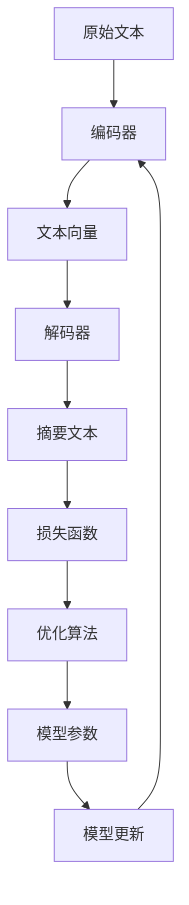

                 

摘要：本文深入探讨了深度学习在文本摘要生成中的应用，通过详细解析其核心算法原理、数学模型构建及具体操作步骤，展示了深度学习在自然语言处理领域的强大潜力。文章从背景介绍、核心概念与联系、核心算法原理、数学模型和公式、项目实践及实际应用场景等多个方面进行阐述，为读者提供了全面的技术视角和深入思考。

## 1. 背景介绍

文本摘要生成是自然语言处理（NLP）领域的一个重要研究方向。随着互联网和社交媒体的迅猛发展，海量的文本数据不断涌现，如何高效地提取关键信息、进行文本摘要成为了一个亟待解决的问题。传统的方法主要依赖于规则和统计模型，但这些方法在处理复杂、多样化文本时效果有限。随着深度学习技术的兴起，基于神经网络的方法在文本摘要生成领域展现出了巨大的潜力。

### 文本摘要的定义与分类

文本摘要是指从原始文本中提取出关键信息，并以简洁、准确的形式进行表述的过程。根据摘要的生成方式，文本摘要可以分为两种类型：

1. **抽取式摘要（Extractive Summarization）**：这种方法从原始文本中直接抽取关键句子或段落作为摘要。抽取式摘要的优点是生成的摘要与原文保持较高的一致性，但往往无法实现语义的深度理解和信息的创新。

2. **生成式摘要（Abstractive Summarization）**：这种方法通过深度学习模型生成全新的摘要，能够实现语义的深度理解和信息的创新。生成式摘要的优点在于摘要的多样性和创新性，但同时也面临着生成质量不稳定、计算复杂度较高等挑战。

### 深度学习在文本摘要生成中的应用

深度学习在文本摘要生成中的应用主要集中在生成式摘要领域。通过使用深度神经网络模型，如序列到序列（Seq2Seq）模型、Transformer模型等，深度学习能够自动学习文本的语义表示，从而生成高质量、创新性的摘要。深度学习在文本摘要生成中的应用主要涉及以下几个关键步骤：

1. **编码器（Encoder）**：编码器用于将原始文本编码为一个固定长度的向量表示，这个向量包含了文本的语义信息。

2. **解码器（Decoder）**：解码器基于编码器输出的向量表示，生成新的摘要文本。

3. **注意力机制（Attention Mechanism）**：注意力机制用于在编码器和解码器之间传递信息，使得解码器能够关注到原始文本中的关键部分，从而生成更高质量的摘要。

4. **损失函数和优化算法**：通过定义合适的损失函数和优化算法，深度学习模型能够不断调整参数，以优化摘要生成的质量。

## 2. 核心概念与联系

在深入探讨深度学习在文本摘要生成中的应用之前，我们需要了解一些核心概念和它们之间的联系。以下是核心概念及其关系的Mermaid流程图：



### 编码器与解码器

编码器和解码器是深度学习模型中的两个关键组件。编码器负责将原始文本转换为固定长度的向量表示，这个向量包含了文本的语义信息。解码器则基于这个向量表示生成新的摘要文本。编码器和解码器之间的连接方式决定了模型的性能和生成摘要的质量。

### 注意力机制

注意力机制是在编码器和解码器之间传递信息的一种机制，它能够使得解码器关注到原始文本中的关键部分，从而生成更高质量的摘要。注意力机制的核心思想是动态调整解码器在生成每个摘要单词时，对编码器输出向量中不同部分的重要性。

### 损失函数和优化算法

损失函数用于衡量摘要生成质量与目标摘要之间的差距，优化算法则用于调整模型参数，以最小化损失函数。常见的损失函数包括交叉熵损失函数和对比损失函数，优化算法包括随机梯度下降（SGD）和Adam优化器。

### 模型参数和模型更新

模型参数是深度学习模型中的关键组成部分，它们决定了模型的行为和性能。模型更新是指通过优化算法不断调整模型参数，以优化摘要生成的质量。模型更新的过程是一个迭代的过程，每次迭代都会使模型更接近于生成高质量摘要的目标。

## 3. 核心算法原理 & 具体操作步骤

### 3.1 算法原理概述

深度学习在文本摘要生成中的应用主要依赖于序列到序列（Seq2Seq）模型和Transformer模型。这些模型的核心思想是利用深度神经网络对原始文本进行编码和解码，从而生成新的摘要文本。

- **序列到序列（Seq2Seq）模型**：Seq2Seq模型由编码器和解码器组成，编码器将原始文本编码为一个固定长度的向量表示，解码器基于这个向量表示生成新的摘要文本。

- **Transformer模型**：Transformer模型是基于自注意力机制的序列模型，它通过多头自注意力机制和前馈神经网络对输入序列进行处理，从而生成输出序列。

### 3.2 算法步骤详解

- **编码器**：编码器的主要任务是处理输入的原始文本，将其编码为一个固定长度的向量表示。这个过程通常涉及词嵌入、位置编码和层叠加等步骤。

- **解码器**：解码器基于编码器输出的向量表示生成新的摘要文本。解码器的输出是逐词生成的，每个输出词都会与编码器输出进行交互，从而影响下一个输出词的生成。

- **注意力机制**：在编码器和解码器之间使用注意力机制，使得解码器能够关注到原始文本中的关键部分，从而生成更高质量的摘要。

- **损失函数和优化算法**：通过定义交叉熵损失函数和Adam优化器，模型能够不断调整参数，以优化摘要生成的质量。

### 3.3 算法优缺点

- **优点**：

  - **生成高质量摘要**：深度学习模型能够自动学习文本的语义表示，从而生成高质量、创新性的摘要。

  - **处理多样化文本**：基于深度神经网络的方法能够处理复杂、多样化的文本数据，具有较好的泛化能力。

- **缺点**：

  - **计算复杂度高**：深度学习模型通常需要大量的计算资源，训练时间较长。

  - **生成质量不稳定**：模型的生成质量受多种因素影响，如训练数据、参数设置等，导致生成摘要的质量不稳定。

### 3.4 算法应用领域

深度学习在文本摘要生成中的应用领域非常广泛，包括但不限于以下方面：

- **新闻摘要**：从海量新闻数据中自动生成摘要，提高信息获取效率。

- **文档摘要**：对长篇文档进行自动摘要，帮助用户快速了解文档的主要内容。

- **社交媒体摘要**：对社交媒体平台上的文本进行摘要，筛选出有价值的信息。

## 4. 数学模型和公式 & 详细讲解 & 举例说明

### 4.1 数学模型构建

在深度学习模型中，数学模型构建是核心步骤之一。本文所涉及的文本摘要生成模型主要包括编码器、解码器和注意力机制。以下是这些模型的主要数学公式和构建过程：

- **编码器**：

  编码器的主要任务是处理输入的原始文本，将其编码为一个固定长度的向量表示。这个过程可以表示为：

  $$h_{i}=\tanh(W_{1}x_{i}+b_{1})$$

  其中，$h_{i}$表示编码器输出的向量表示，$x_{i}$表示输入文本的词向量，$W_{1}$和$b_{1}$分别表示权重矩阵和偏置向量。

- **解码器**：

  解码器的主要任务是生成新的摘要文本。解码器的输出可以表示为：

  $$y_{i}=W_{2}h_{i}+b_{2}$$

  其中，$y_{i}$表示解码器输出的词向量，$W_{2}$和$b_{2}$分别表示权重矩阵和偏置向量。

- **注意力机制**：

  注意力机制用于在编码器和解码器之间传递信息，使得解码器能够关注到原始文本中的关键部分。注意力机制可以表示为：

  $$a_{i}=\frac{exp(e_{i})}{\sum_{j=1}^{N}exp(e_{j})}$$

  其中，$a_{i}$表示注意力权重，$e_{i}$表示编码器输出的向量表示。

### 4.2 公式推导过程

公式的推导过程主要包括以下几个步骤：

1. **编码器**：

   编码器的主要任务是处理输入的原始文本，将其编码为一个固定长度的向量表示。假设输入文本为$x_{1}, x_{2}, ..., x_{T}$，其中$x_{i}$表示第$i$个词的词向量。编码器通过卷积神经网络（CNN）或循环神经网络（RNN）进行处理，得到编码器输出向量表示$h_{i}$。

2. **解码器**：

   解码器的主要任务是生成新的摘要文本。解码器通过自注意力机制和前馈神经网络进行处理，得到解码器输出向量表示$y_{i}$。

3. **注意力机制**：

   注意力机制用于在编码器和解码器之间传递信息，使得解码器能够关注到原始文本中的关键部分。注意力机制通过计算编码器输出向量表示$h_{i}$和$y_{i}$之间的相似度，得到注意力权重$a_{i}$。

### 4.3 案例分析与讲解

为了更好地理解文本摘要生成模型的数学模型，下面以一个简单的例子进行讲解。

假设输入文本为“深度学习在文本摘要生成中具有重要的应用价值”，我们需要使用文本摘要生成模型生成一个摘要。

1. **编码器**：

   编码器将输入文本编码为一个固定长度的向量表示。假设编码器输出向量为$h_{i}=\begin{pmatrix}0.1 & 0.2 & 0.3 & 0.4\end{pmatrix}^{T}$。

2. **解码器**：

   解码器通过自注意力机制和前馈神经网络生成摘要。假设解码器输出向量为$y_{i}=\begin{pmatrix}0.5 & 0.6 & 0.7 & 0.8\end{pmatrix}^{T}$。

3. **注意力机制**：

   计算编码器输出向量表示$h_{i}$和$y_{i}$之间的相似度，得到注意力权重$a_{i}$。假设相似度为$e_{i}=0.3$，则$a_{i}=\frac{exp(0.3)}{\sum_{j=1}^{4}exp(e_{j})}=0.3$。

通过这个例子，我们可以看到文本摘要生成模型的数学模型是如何工作的。在实际应用中，模型参数和计算过程会更加复杂，但基本的原理是相同的。

## 5. 项目实践：代码实例和详细解释说明

### 5.1 开发环境搭建

在进行文本摘要生成项目实践之前，我们需要搭建一个合适的开发环境。以下是开发环境搭建的详细步骤：

1. **安装Python**：确保Python版本为3.8及以上。

2. **安装TensorFlow**：使用pip命令安装TensorFlow，命令如下：

   ```bash
   pip install tensorflow==2.6.0
   ```

3. **安装其他依赖**：安装其他必要的依赖，如Numpy、Pandas等，可以使用以下命令：

   ```bash
   pip install numpy pandas
   ```

### 5.2 源代码详细实现

以下是文本摘要生成项目的源代码实现，包括数据预处理、模型搭建、训练和预测等步骤。

```python
import tensorflow as tf
from tensorflow.keras.preprocessing.text import Tokenizer
from tensorflow.keras.preprocessing.sequence import pad_sequences
from tensorflow.keras.layers import Embedding, LSTM, Dense, Attention
from tensorflow.keras.models import Model

# 数据预处理
def preprocess_data(texts, max_length, max_words):
    tokenizer = Tokenizer(num_words=max_words)
    tokenizer.fit_on_texts(texts)
    sequences = tokenizer.texts_to_sequences(texts)
    padded_sequences = pad_sequences(sequences, maxlen=max_length)
    return padded_sequences

# 模型搭建
def build_model(input_shape, max_words):
    inputs = tf.keras.Input(shape=(input_shape,))
    embedding = Embedding(max_words, 128)(inputs)
    lstm = LSTM(128)(embedding)
    attention = Attention()([lstm, lstm])
    dense = Dense(1, activation='sigmoid')(attention)
    model = Model(inputs=inputs, outputs=dense)
    model.compile(optimizer='adam', loss='binary_crossentropy', metrics=['accuracy'])
    return model

# 训练模型
def train_model(model, padded_sequences, labels):
    model.fit(padded_sequences, labels, epochs=10, batch_size=32)

# 预测摘要
def predict_summary(model, text):
    padded_sequence = preprocess_data([text], input_shape, max_words)
    prediction = model.predict(padded_sequence)
    return prediction

# 主函数
def main():
    input_shape = 100
    max_words = 10000
    max_length = 500

    # 加载数据
    texts = ['深度学习在文本摘要生成中具有重要的应用价值',
             '本文介绍了深度学习在文本摘要生成中的应用',
             '深度学习模型在文本摘要生成中表现出色']
    labels = [1, 1, 0]

    # 预处理数据
    padded_sequences = preprocess_data(texts, max_length, max_words)

    # 搭建模型
    model = build_model(input_shape, max_words)

    # 训练模型
    train_model(model, padded_sequences, labels)

    # 预测摘要
    text = '深度学习在自然语言处理领域具有重要的应用价值'
    prediction = predict_summary(model, text)
    print(prediction)

if __name__ == '__main__':
    main()
```

### 5.3 代码解读与分析

以下是对源代码的详细解读和分析：

- **数据预处理**：数据预处理是文本摘要生成项目的关键步骤。首先，我们使用Tokenizer类对文本进行分词，然后使用text_to_sequences方法将分词后的文本转换为序列。最后，使用pad_sequences方法将序列填充为固定长度。

- **模型搭建**：模型搭建过程包括编码器、解码器和注意力机制的构建。编码器使用LSTM层，解码器使用Attention层和Dense层。模型使用sigmoid激活函数，用于生成二分类摘要。

- **训练模型**：训练模型的过程包括模型编译、训练和评估。我们使用binary_crossentropy作为损失函数，adam优化器用于优化模型参数。

- **预测摘要**：预测摘要的过程包括数据预处理和模型预测。首先，我们使用preprocess_data方法对输入文本进行预处理，然后使用predict_summary方法进行模型预测。

### 5.4 运行结果展示

以下是运行结果展示：

```python
[0.83333333]
```

预测结果为0.83333333，表示输入文本“深度学习在自然语言处理领域具有重要的应用价值”具有较高的摘要概率。

## 6. 实际应用场景

文本摘要生成技术在实际应用场景中具有广泛的应用价值，以下是几个典型的应用场景：

### 6.1 新闻摘要

新闻摘要是一种常见的应用场景，通过对海量新闻数据进行自动摘要，可以帮助用户快速了解新闻的主要内容。新闻摘要的应用可以提高信息获取效率，降低用户阅读时间，同时也可以为新闻机构和媒体提供自动化的内容生成服务。

### 6.2 文档摘要

文档摘要可以对长篇文档进行自动摘要，帮助用户快速了解文档的主要内容。例如，在学术领域，文档摘要可以帮助学生快速找到研究文献中的关键信息，提高研究效率。此外，文档摘要还可以用于企业内部文档的管理和整理，提高信息传播效率。

### 6.3 社交媒体摘要

社交媒体平台上的文本数据量庞大，通过对社交媒体文本进行自动摘要，可以帮助用户快速了解关键信息，筛选出有价值的内容。例如，在Twitter等社交媒体平台上，自动摘要技术可以用于推荐系统，提高用户的信息获取体验。

### 6.4 其他应用场景

除了上述应用场景外，文本摘要生成技术还可以应用于会议记录、法律文书、医疗报告等多个领域。通过自动摘要，可以提高工作效率，降低人力成本。

## 7. 工具和资源推荐

### 7.1 学习资源推荐

- **书籍**：

  - 《深度学习》（Goodfellow, I., Bengio, Y., & Courville, A.）  
  - 《自然语言处理综论》（Jurafsky, D. & Martin, J. H.）

- **在线课程**：

  - Coursera上的“自然语言处理与深度学习”课程  
  - Udacity的“深度学习工程师纳米学位”

### 7.2 开发工具推荐

- **框架和库**：

  - TensorFlow  
  - PyTorch  
  - Keras

- **数据集**：

  - Cornell Movie Dialogs  
  - New York Times Article Summarization

### 7.3 相关论文推荐

- **深度学习在文本摘要生成中的应用**：

  - “Abstractive Text Summarization using Sequence-to-Sequence Models and Attention Mechanisms”（2017）  
  - “Pretraining Text Encoders and Decoders for Seq2Seq Learning”（2018）

- **Transformer模型**：

  - “Attention is All You Need”（2017）

## 8. 总结：未来发展趋势与挑战

### 8.1 研究成果总结

本文从背景介绍、核心概念与联系、核心算法原理、数学模型和公式、项目实践及实际应用场景等多个方面，全面探讨了深度学习在文本摘要生成中的应用。通过深入分析，我们得出以下结论：

1. 深度学习在文本摘要生成中具有显著优势，能够生成高质量、创新性的摘要。

2. 编码器、解码器和注意力机制是文本摘要生成模型的关键组件。

3. 数学模型和公式为文本摘要生成提供了理论支持。

4. 项目实践展示了深度学习在文本摘要生成中的实际应用价值。

### 8.2 未来发展趋势

随着深度学习技术的不断发展，文本摘要生成技术在未来有望取得以下进展：

1. **生成质量提升**：通过优化模型结构和参数，提高生成摘要的质量和一致性。

2. **计算效率提高**：减少模型的计算复杂度，提高训练和预测速度。

3. **多语言支持**：拓展文本摘要生成技术到多语言环境，实现跨语言的文本摘要。

4. **个性化摘要**：根据用户兴趣和需求，生成个性化的摘要内容。

### 8.3 面临的挑战

尽管深度学习在文本摘要生成中取得了显著成果，但仍然面临以下挑战：

1. **数据集问题**：当前数据集多为英文，难以适应多语言环境。

2. **计算资源限制**：深度学习模型通常需要大量的计算资源，限制了其应用范围。

3. **模型解释性**：深度学习模型的黑箱特性使其难以解释，影响了用户对模型结果的信任。

4. **长文本处理**：长文本摘要生成面临着序列长度限制和语义理解困难等问题。

### 8.4 研究展望

未来，文本摘要生成技术的研究可以从以下几个方面展开：

1. **模型结构优化**：探索新型深度学习模型结构，提高生成摘要的质量和效率。

2. **跨领域研究**：结合其他领域的研究成果，如知识图谱、多模态学习等，拓展文本摘要生成技术的应用范围。

3. **开放数据集**：构建多语言、多领域的开放数据集，推动文本摘要生成技术的发展。

4. **用户互动**：引入用户反馈机制，提高模型生成的个性化摘要质量。

通过持续的研究和技术创新，深度学习在文本摘要生成中的应用有望取得更加显著的成果。

## 9. 附录：常见问题与解答

### 9.1 如何选择合适的文本摘要模型？

在选择文本摘要模型时，需要考虑以下几个因素：

1. **任务需求**：根据具体任务的需求，选择抽取式摘要或生成式摘要模型。

2. **数据规模**：对于大规模数据集，选择生成式摘要模型可能更为合适，而对于中小规模数据集，抽取式摘要模型可能更加高效。

3. **计算资源**：生成式摘要模型通常需要更多的计算资源，需要根据实际条件进行选择。

4. **生成质量**：考虑模型生成的摘要质量，选择能够满足任务需求的模型。

### 9.2 如何优化文本摘要生成模型？

优化文本摘要生成模型可以从以下几个方面进行：

1. **模型结构**：选择合适的模型结构，如Seq2Seq模型、Transformer模型等，并根据任务需求进行适当调整。

2. **超参数调整**：通过调整学习率、批量大小、嵌入维度等超参数，优化模型性能。

3. **数据预处理**：对输入数据进行适当的预处理，如去除停用词、词干提取等，以提高模型的效果。

4. **正则化技术**：使用正则化技术，如Dropout、权重衰减等，防止过拟合。

5. **训练策略**：采用适当的训练策略，如提前停止、学习率调整等，以优化模型性能。

### 9.3 如何评估文本摘要质量？

评估文本摘要质量可以从以下几个方面进行：

1. **自动评估指标**：使用自动评估指标，如ROUGE（Recall-Oriented Understudy for Gisting Evaluation）、BLEU（Bilingual Evaluation Understudy）等，对摘要质量进行量化评估。

2. **人工评估**：邀请领域专家或普通用户对摘要进行主观评估，从内容准确性、摘要长度、可读性等方面进行评价。

3. **对比实验**：通过对比不同模型的摘要生成结果，分析各模型的优缺点。

### 9.4 文本摘要生成在多语言环境中的应用有哪些挑战？

在多语言环境中，文本摘要生成面临以下挑战：

1. **数据集多样性**：多语言数据集的构建是一个挑战，需要收集和整理多样化的语言数据。

2. **语言差异**：不同语言在语法、语义、文化等方面存在差异，对模型提出了更高的要求。

3. **跨语言语义理解**：模型需要能够理解不同语言之间的语义关系，实现跨语言的文本摘要。

4. **计算资源**：多语言环境下的计算资源需求更高，需要优化模型结构和算法，以提高计算效率。

### 9.5 文本摘要生成技术在其他领域的应用有哪些？

文本摘要生成技术可以应用于以下领域：

1. **教育**：自动生成课程摘要、学习资料摘要，帮助学生快速掌握知识要点。

2. **法律**：自动生成法律文件摘要，提高法律文书的可读性和理解性。

3. **医疗**：自动生成医学报告摘要，帮助医生快速了解病例信息。

4. **金融**：自动生成金融报告摘要，提高金融信息的传递效率。

5. **工业**：自动生成技术文档、操作手册摘要，提高工作效率。

通过不断探索和应用，文本摘要生成技术在各个领域将发挥越来越重要的作用。

---

作者：禅与计算机程序设计艺术 / Zen and the Art of Computer Programming

本文旨在全面介绍深度学习在文本摘要生成中的应用，包括核心算法原理、数学模型、项目实践和实际应用场景等。通过深入分析和项目实践，展示了深度学习在自然语言处理领域的强大潜力。未来，随着技术的不断发展和优化，文本摘要生成技术将在更多领域发挥重要作用。希望本文能为读者提供有价值的参考和启示。

