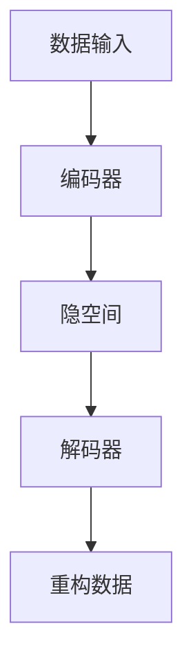

                 

关键词：深度学习、高维数据、降维、数据科学、机器学习

> 摘要：随着数据量的爆炸性增长，高维数据的处理成为数据科学和机器学习领域的重大挑战。本文将探讨深度学习在高维数据降维中的作用，分析其核心概念、算法原理、应用领域，并通过具体实例展示其实际应用效果。

## 1. 背景介绍

在当今信息爆炸的时代，数据以惊人的速度增长。这不仅包括互联网上的大量文本、图像、音频和视频，还包括传感器、日志和社交网络等生成的数据。这些数据通常被称为大数据，它们具有海量、多维和动态变化的特点。

然而，数据的增长并非线性地带来价值的提升。高维数据在处理和分析过程中面临诸多挑战。首先，高维数据往往包含大量的冗余信息和噪声，这会导致计算复杂度和存储成本大幅增加。其次，许多传统的机器学习算法在高维数据上的表现不佳，容易出现过拟合和欠拟合问题。这些问题极大地限制了数据科学和机器学习的应用范围。

为了应对这些挑战，数据降维成为数据科学领域的关键技术。降维的目标是通过去除冗余信息和噪声，降低数据的维度，同时保留主要的信息和结构，从而简化数据处理和分析过程，提高算法的性能和效率。

## 2. 核心概念与联系

### 2.1 深度学习与降维

深度学习是近年来在机器学习领域取得突破性进展的研究方向。它通过构建多层神经网络，自动学习数据的复杂结构和特征，实现了对高维数据的自动降维。深度学习与降维之间存在密切的联系：

- **特征提取**：深度学习通过多层神经网络逐层提取数据的高级特征，这些特征能够更好地表示数据的本质属性，从而降低数据的维度。
- **数据重构**：深度学习通过训练过程学习数据的高维表示，并将其重构为低维表示，从而实现降维。
- **损失函数**：在深度学习训练过程中，通过最小化损失函数，模型能够自动学习到数据的潜在结构，从而实现降维。

### 2.2 降维算法与深度学习

降维算法包括线性降维和非线性降维两大类。线性降维如主成分分析（PCA），而非线性降维如自编码器（Autoencoder）等。深度学习中的自编码器是一种常用的非线性降维方法，其基本思想是通过编码器将高维数据映射到一个较低维的隐空间，然后通过解码器将隐空间的数据重新映射回高维空间。


### 2.3 Mermaid 流程图

以下是一个用Mermaid绘制的深度学习与降维的流程图：



在这个流程图中，数据输入经过编码器映射到隐空间，然后通过解码器重构为低维数据。

## 3. 核心算法原理 & 具体操作步骤

### 3.1 算法原理概述

深度学习中的自编码器是一种无监督学习方法，它通过训练学习数据的低维表示，从而实现降维。自编码器的基本原理如下：

1. **编码器（Encoder）**：编码器是一个神经网络，它将输入数据映射到一个隐空间中的低维表示。这个低维表示通常是一个向量，它包含了输入数据的主要信息和结构。
2. **解码器（Decoder）**：解码器是一个反向的神经网络，它将编码器的输出（隐空间中的低维表示）重新映射回高维数据空间。
3. **损失函数（Loss Function）**：自编码器通过最小化重构误差来训练模型。重构误差是原始数据与重构数据之间的差异，通常使用均方误差（MSE）来度量。

### 3.2 算法步骤详解

1. **初始化模型参数**：初始化编码器和解码器的权重和偏置。
2. **前向传播**：输入数据通过编码器映射到隐空间，得到隐层输出。
3. **后向传播**：计算重构误差，然后通过梯度下降更新编码器和解码器的参数。
4. **迭代训练**：重复前向传播和后向传播，直到模型收敛。

### 3.3 算法优缺点

**优点**：

- **无监督学习**：自编码器可以处理没有标签的数据，适用于无监督降维。
- **自动特征提取**：自编码器能够自动学习数据的低维表示，这些表示通常包含了数据的主要特征和结构。
- **适用性广泛**：自编码器可以应用于各种类型的数据，包括文本、图像、音频等。

**缺点**：

- **计算复杂度高**：自编码器通常需要大量的计算资源和时间来训练。
- **需要大量数据**：自编码器在训练过程中需要大量数据来保证模型的泛化能力。

### 3.4 算法应用领域

自编码器在高维数据降维领域具有广泛的应用，包括：

- **数据可视化**：将高维数据降维到二维或三维空间，以便于可视化。
- **特征提取**：用于提取数据的高维特征，用于后续的机器学习模型训练。
- **去噪**：自编码器可以学习数据的潜在结构，从而去除噪声。

## 4. 数学模型和公式 & 详细讲解 & 举例说明

### 4.1 数学模型构建

自编码器的数学模型基于神经网络，可以表示为：

$$
\text{编码器}: \text{z} = \sigma(W_1 \text{x} + b_1)
$$

$$
\text{解码器}: \text{x'} = \sigma(W_2 \text{z} + b_2)
$$

其中，$W_1$和$W_2$分别是编码器和解码器的权重矩阵，$b_1$和$b_2$分别是编码器和解码器的偏置向量，$\sigma$是激活函数。

### 4.2 公式推导过程

自编码器的训练过程通过最小化重构误差来实现。重构误差可以表示为：

$$
\text{损失函数} = \frac{1}{2}\sum_{i=1}^{n}(\text{x}_i - \text{x'}_i)^2
$$

其中，$n$是训练样本的数量，$\text{x}_i$和$\text{x'}_i$分别是原始数据和重构数据。

为了最小化损失函数，我们对编码器和解码器的权重和偏置进行梯度下降更新：

$$
\Delta W_1 = -\alpha \frac{\partial}{\partial W_1} \text{损失函数}
$$

$$
\Delta b_1 = -\alpha \frac{\partial}{\partial b_1} \text{损失函数}
$$

$$
\Delta W_2 = -\alpha \frac{\partial}{\partial W_2} \text{损失函数}
$$

$$
\Delta b_2 = -\alpha \frac{\partial}{\partial b_2} \text{损失函数}
$$

其中，$\alpha$是学习率。

### 4.3 案例分析与讲解

假设我们有一个包含100个特征的数据集，我们希望使用自编码器将其降维到10个特征。

1. **初始化模型参数**：随机初始化编码器和解码器的权重和偏置。
2. **前向传播**：输入一个数据样本，通过编码器映射到隐空间。
3. **后向传播**：计算重构误差，然后更新编码器和解码器的参数。
4. **迭代训练**：重复前向传播和后向传播，直到模型收敛。

在训练过程中，我们可以观察到重构误差逐渐减小，同时编码器和解码器的参数不断更新。最终，我们得到了一个能够将高维数据降维到低维空间的模型。

## 5. 项目实践：代码实例和详细解释说明

### 5.1 开发环境搭建

为了演示自编码器在高维数据降维中的应用，我们需要搭建一个Python开发环境，并安装必要的库。

```shell
pip install numpy tensorflow matplotlib
```

### 5.2 源代码详细实现

以下是一个简单的自编码器实现：

```python
import numpy as np
import tensorflow as tf
import matplotlib.pyplot as plt

# 创建TensorFlow图
with tf.name_scope("autoencoder"):
    # 定义输入层
    x = tf.placeholder(tf.float32, [None, 100])
    # 定义编码器
    hidden_layer = tf.layers.dense(x, units=10, activation=tf.nn.relu)
    # 定义解码器
    output_layer = tf.layers.dense(hidden_layer, units=100)
    # 定义损失函数
    loss = tf.reduce_mean(tf.square(x - output_layer))
    # 定义优化器
    optimizer = tf.train.AdamOptimizer().minimize(loss)

# 训练模型
with tf.Session() as sess:
    sess.run(tf.global_variables_initializer())
    for epoch in range(1000):
        _, loss_value = sess.run([optimizer, loss], feed_dict={x: x_train})
        if epoch % 100 == 0:
            print("Epoch %d, Loss: %.4f" % (epoch, loss_value))
    
    # 重构数据
    x_reconstructed = sess.run(output_layer, feed_dict={x: x_test})

# 可视化结果
plt.figure(figsize=(10, 5))
plt.subplot(121)
plt.scatter(x_test[:, 0], x_test[:, 1], c='blue', label='Original')
plt.subplot(122)
plt.scatter(x_reconstructed[:, 0], x_reconstructed[:, 1], c='red', label='Reconstructed')
plt.show()
```

### 5.3 代码解读与分析

这个代码实现了一个简单的自编码器模型，用于将高维数据降维到低维空间。代码分为以下几个部分：

1. **创建TensorFlow图**：定义输入层、编码器、解码器和损失函数。
2. **训练模型**：使用Adam优化器最小化损失函数。
3. **重构数据**：使用训练好的模型将测试数据进行降维。
4. **可视化结果**：绘制原始数据和重构数据之间的差异。

通过这个示例，我们可以看到自编码器在实际项目中的应用效果。虽然这个示例相对简单，但它展示了自编码器在高维数据降维中的基本原理和操作步骤。

## 6. 实际应用场景

自编码器在高维数据降维领域具有广泛的应用，以下是一些实际应用场景：

- **图像识别**：使用自编码器提取图像特征，用于后续的图像分类和识别任务。
- **自然语言处理**：将文本数据降维，用于情感分析、文本分类等任务。
- **基因数据分析**：将基因数据降维，用于基因表达分析、疾病诊断等。
- **金融风控**：将金融数据降维，用于信用评分、风险预测等。

在这些应用场景中，自编码器通过学习数据的低维表示，提高了模型的性能和效率，从而实现了数据的降维和特征提取。

## 7. 工具和资源推荐

### 7.1 学习资源推荐

- **《深度学习》**：由Ian Goodfellow、Yoshua Bengio和Aaron Courville所著的深度学习经典教材。
- **《自编码器》**：一篇关于自编码器的详细教程，涵盖了自编码器的原理、实现和应用。

### 7.2 开发工具推荐

- **TensorFlow**：一个开源的深度学习框架，用于构建和训练自编码器。
- **Keras**：一个基于TensorFlow的高级API，用于快速构建和训练神经网络。

### 7.3 相关论文推荐

- **《Stochastic Gradient Descent》**：一篇关于随机梯度下降算法的论文，介绍了自编码器的训练过程。
- **《Autoencoder》**：一篇关于自编码器的综述论文，总结了自编码器在不同领域的应用。

## 8. 总结：未来发展趋势与挑战

自编码器在高维数据降维领域具有广泛的应用前景。随着深度学习技术的不断发展，自编码器的性能和效率将进一步提高。然而，自编码器在训练过程中仍然面临一些挑战，如计算复杂度高、需要大量数据等。未来研究将致力于解决这些问题，进一步提高自编码器的应用效果。

## 9. 附录：常见问题与解答

### 9.1 什么是自编码器？

自编码器是一种无监督学习模型，它通过学习数据的低维表示来实现数据的降维。自编码器包括编码器和解码器两个部分，编码器将高维数据映射到低维隐空间，解码器将低维隐空间的数据重新映射回高维数据空间。

### 9.2 自编码器有哪些优缺点？

自编码器的优点包括：无监督学习、自动特征提取、适用性广泛。缺点包括：计算复杂度高、需要大量数据。

### 9.3 自编码器在哪些领域有应用？

自编码器在图像识别、自然语言处理、基因数据分析、金融风控等领域有广泛的应用。

### 9.4 如何优化自编码器的性能？

可以通过以下方法优化自编码器的性能：

- **数据预处理**：对数据进行标准化、归一化等预处理，提高模型的泛化能力。
- **超参数调整**：调整编码器和解码器的层数、神经元个数、学习率等超参数。
- **正则化**：使用正则化方法，如Dropout、L2正则化等，防止模型过拟合。

---

作者：禅与计算机程序设计艺术 / Zen and the Art of Computer Programming

