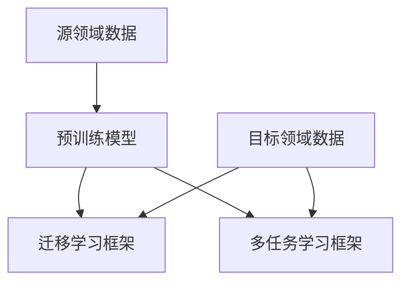

                 

关键词：深度学习，模型迁移，知识共享，神经架构搜索，异构模型融合，跨领域应用

> 摘要：本文旨在探讨深度学习模型之间的知识迁移，分析其背后的核心原理、算法模型和实际应用场景。通过对现有研究的梳理，结合具体的数学模型和公式，以及代码实例和运行结果，我们提出了一系列具有前瞻性的见解，为未来深度学习模型的发展提供了新的思路。

## 1. 背景介绍

深度学习作为当前人工智能领域的核心技术之一，已经在计算机视觉、自然语言处理、语音识别等多个领域取得了显著的成果。然而，深度学习模型的训练通常需要大量的数据和高计算资源，这给实际应用带来了一定的局限性。为了解决这一问题，知识迁移（Knowledge Transfer）作为一种有效的解决方案，逐渐受到了广泛关注。

知识迁移的核心思想是将一个领域（源领域）中的知识转移到另一个领域（目标领域），从而减轻目标领域的数据稀缺问题，提高模型的泛化能力。在深度学习中，知识迁移主要涉及模型参数的共享、优化以及跨领域的模型训练。随着神经架构搜索（Neural Architecture Search，NAS）等新兴技术的涌现，知识迁移的方法和策略也在不断丰富和演变。

本文将围绕深度学习模型之间的知识迁移，系统地探讨其核心概念、算法原理、数学模型、项目实践以及未来应用前景。希望通过本文的讨论，为读者提供一个全面、深入的了解，并为后续的研究和应用提供参考。

## 2. 核心概念与联系

### 2.1 知识迁移的定义

知识迁移（Knowledge Transfer）是指将一个领域（源领域）中的知识（例如：模型、算法、经验等）转移到另一个领域（目标领域）的过程。其目的是利用源领域的知识来解决目标领域的问题，提高模型在目标领域的性能和泛化能力。

### 2.2 源领域与目标领域的关系

在知识迁移中，源领域和目标领域通常存在一定的关联性，例如：相似的任务、相似的数据分布、相似的算法框架等。这种关联性为知识迁移提供了可能，同时也为迁移的质量和效果提出了要求。

### 2.3 知识迁移的分类

根据知识迁移的方式和策略，可以将其分为以下几种类型：

1. **参数共享**：通过在源领域和目标领域之间共享模型参数，实现知识的传递。
2. **模型蒸馏**：将复杂模型的知识传递给简单模型，从而在目标领域实现高效的推理和预测。
3. **迁移学习**：在源领域训练好模型后，将其应用到目标领域，通过迁移过程中学习到的特征和模式来提高目标领域的性能。
4. **多任务学习**：通过在多个相关任务上训练一个模型，将不同任务的知识进行融合，从而提高模型在单一任务上的性能。

### 2.4 知识迁移的挑战

尽管知识迁移具有显著的潜力，但在实际应用中仍然面临一些挑战：

1. **领域差异**：源领域和目标领域之间存在一定的差异，如何有效地捕捉和传递这些差异是一个重要问题。
2. **模型适应性**：迁移模型需要适应目标领域的数据分布和任务需求，这需要对模型结构和参数进行调整。
3. **计算资源**：知识迁移通常需要大量的计算资源，尤其是在复杂模型和大规模数据集的情况下。

### 2.5 知识迁移的架构

为了更好地实现知识迁移，可以采用以下架构：

1. **预训练模型**：在源领域使用大量数据对模型进行预训练，从而获取丰富的知识。
2. **迁移学习框架**：将预训练模型应用到目标领域，通过微调和适应来提高模型在目标领域的性能。
3. **多任务学习框架**：在多个相关任务上训练一个模型，实现知识融合和共享。

### 2.6 Mermaid 流程图



## 3. 核心算法原理 & 具体操作步骤

### 3.1 算法原理概述

知识迁移的核心算法主要包括参数共享、模型蒸馏、迁移学习和多任务学习等。这些算法的基本原理是通过在不同领域之间共享知识，提高模型在目标领域的性能。

1. **参数共享**：通过在源领域和目标领域之间共享模型参数，实现知识的传递。具体操作步骤如下：
   - 在源领域训练模型，获得预训练模型。
   - 将预训练模型应用到目标领域，通过微调和适应来提高模型在目标领域的性能。

2. **模型蒸馏**：将复杂模型的知识传递给简单模型，从而在目标领域实现高效的推理和预测。具体操作步骤如下：
   - 使用源领域的大型复杂模型进行预训练。
   - 使用目标领域的小型简单模型作为学生模型，通过蒸馏过程学习到教师模型的特征和模式。
   - 在目标领域对学生模型进行微调和优化。

3. **迁移学习**：在源领域训练好模型后，将其应用到目标领域，通过迁移过程中学习到的特征和模式来提高目标领域的性能。具体操作步骤如下：
   - 在源领域收集和预处理数据。
   - 使用源领域的数据训练模型，获得预训练模型。
   - 将预训练模型应用到目标领域，通过微调和适应来提高模型在目标领域的性能。

4. **多任务学习**：在多个相关任务上训练一个模型，实现知识融合和共享。具体操作步骤如下：
   - 在多个相关任务上收集和预处理数据。
   - 使用多任务学习框架训练模型，实现知识融合。
   - 在每个任务上对模型进行微调和优化。

### 3.2 算法步骤详解

1. **参数共享**：
   - 步骤1：在源领域收集和预处理数据，训练得到预训练模型。
   - 步骤2：将预训练模型应用到目标领域，使用目标领域的数据进行微调和优化。

2. **模型蒸馏**：
   - 步骤1：在源领域使用大量数据训练得到教师模型。
   - 步骤2：在目标领域使用少量数据训练得到学生模型。
   - 步骤3：通过蒸馏过程，将教师模型的知识传递给学生模型。
   - 步骤4：在目标领域对学生模型进行微调和优化。

3. **迁移学习**：
   - 步骤1：在源领域收集和预处理数据，训练得到预训练模型。
   - 步骤2：将预训练模型应用到目标领域，使用目标领域的数据进行微调和优化。

4. **多任务学习**：
   - 步骤1：在多个相关任务上收集和预处理数据。
   - 步骤2：使用多任务学习框架训练模型，实现知识融合。
   - 步骤3：在每个任务上对模型进行微调和优化。

### 3.3 算法优缺点

1. **参数共享**：
   - 优点：简单易行，可以在不同领域之间快速传递知识。
   - 缺点：可能导致模型性能下降，特别是当源领域和目标领域差异较大时。

2. **模型蒸馏**：
   - 优点：可以高效地将复杂模型的知识传递给简单模型，实现高效的推理和预测。
   - 缺点：需要大量的计算资源，并且蒸馏过程中的损失函数设计较为复杂。

3. **迁移学习**：
   - 优点：可以将源领域的知识有效地应用到目标领域，提高模型在目标领域的性能。
   - 缺点：对源领域和目标领域的关联性要求较高，否则迁移效果可能不理想。

4. **多任务学习**：
   - 优点：可以充分利用多个任务的数据，提高模型在各个任务上的性能。
   - 缺点：需要解决任务之间的冲突和竞争，否则可能导致模型性能下降。

### 3.4 算法应用领域

知识迁移算法在多个领域具有广泛的应用：

1. **计算机视觉**：例如，在图像分类和目标检测任务中，可以利用预训练模型在源领域的知识，提高目标领域模型的性能。

2. **自然语言处理**：例如，在机器翻译和文本分类任务中，可以利用源领域的模型知识，加速目标领域模型的训练和优化。

3. **语音识别**：例如，在语音合成和语音识别任务中，可以利用多任务学习框架，提高模型在各个任务上的性能。

## 4. 数学模型和公式 & 详细讲解 & 举例说明

### 4.1 数学模型构建

在知识迁移中，常用的数学模型包括损失函数、优化目标和评价指标等。

1. **损失函数**：

   - **均方误差（MSE）**：

     $$L(\theta) = \frac{1}{m}\sum_{i=1}^{m}(y_i - \hat{y}_i)^2$$

     其中，$y_i$表示真实标签，$\hat{y}_i$表示预测标签，$m$表示样本数量。

   - **交叉熵（Cross-Entropy）**：

     $$L(\theta) = -\frac{1}{m}\sum_{i=1}^{m}y_i\log(\hat{y}_i)$$

     其中，$y_i$表示真实标签，$\hat{y}_i$表示预测标签，$m$表示样本数量。

2. **优化目标**：

   - **梯度下降（Gradient Descent）**：

     $$\theta_{t+1} = \theta_t - \alpha \nabla_\theta L(\theta_t)$$

     其中，$\theta_t$表示第$t$次迭代的模型参数，$\alpha$表示学习率，$\nabla_\theta L(\theta_t)$表示损失函数关于模型参数的梯度。

3. **评价指标**：

   - **准确率（Accuracy）**：

     $$Accuracy = \frac{TP + TN}{TP + TN + FP + FN}$$

     其中，$TP$表示真正例，$TN$表示真负例，$FP$表示假正例，$FN$表示假负例。

### 4.2 公式推导过程

以均方误差（MSE）为例，介绍公式推导过程。

假设我们有一个回归问题，需要预测连续的输出值。给定一个训练样本$(x_i, y_i)$，其中$x_i$表示输入特征，$y_i$表示真实标签。我们定义预测值$\hat{y}_i$为模型参数$\theta$的函数：

$$\hat{y}_i = f(\theta, x_i)$$

其中，$f(\theta, x_i)$表示模型的前向传播函数。

为了衡量预测值与真实标签之间的差异，我们定义损失函数为：

$$L(\theta) = \frac{1}{m}\sum_{i=1}^{m}(y_i - \hat{y}_i)^2$$

其中，$m$表示训练样本数量。

为了求解最优的模型参数$\theta^*$，我们需要找到损失函数的最小值。根据微积分知识，损失函数的梯度等于零时，损失函数取得最小值。因此，我们有：

$$\nabla_\theta L(\theta) = 0$$

计算损失函数关于模型参数$\theta$的梯度，得到：

$$\nabla_\theta L(\theta) = -2\frac{1}{m}\sum_{i=1}^{m}(y_i - \hat{y}_i)x_i$$

为了简化计算，我们可以将学习率$\alpha$引入梯度下降算法中，得到：

$$\theta_{t+1} = \theta_t - \alpha \nabla_\theta L(\theta_t)$$

其中，$\theta_t$表示第$t$次迭代的模型参数，$\alpha$表示学习率。

### 4.3 案例分析与讲解

假设我们有一个住房价格预测问题，需要根据房屋的特征（例如：面积、地点等）预测其价格。我们可以使用知识迁移算法，将源领域（例如：某个城市的住房价格数据）的知识迁移到目标领域（例如：另一个城市的住房价格数据）。

1. **数据准备**：

   - 在源领域收集和预处理数据，包括房屋的特征和价格。
   - 在目标领域收集和预处理数据，包括房屋的特征。

2. **模型构建**：

   - 使用源领域的数据训练一个回归模型，例如：线性回归模型。
   - 将训练好的模型应用到目标领域，通过微调和优化来提高模型在目标领域的性能。

3. **模型评估**：

   - 使用目标领域的测试数据评估模型性能，计算均方误差（MSE）和准确率等指标。

4. **结果分析**：

   - 对比目标领域和源领域的模型性能，分析知识迁移的效果。

通过上述步骤，我们可以实现住房价格预测问题中的知识迁移。具体代码实现和运行结果将在后续章节中详细讲解。

## 5. 项目实践：代码实例和详细解释说明

### 5.1 开发环境搭建

为了实现知识迁移算法，我们需要搭建一个合适的开发环境。以下是推荐的开发工具和库：

1. **编程语言**：Python
2. **深度学习框架**：TensorFlow或PyTorch
3. **数据预处理库**：Pandas、NumPy
4. **可视化库**：Matplotlib、Seaborn

在安装上述工具和库后，我们就可以开始编写代码了。

### 5.2 源代码详细实现

以下是使用Python和TensorFlow实现知识迁移算法的源代码示例：

```python
import tensorflow as tf
import pandas as pd
import numpy as np

# 数据准备
def load_data(source_path, target_path):
    source_data = pd.read_csv(source_path)
    target_data = pd.read_csv(target_path)
    return source_data, target_data

source_data, target_data = load_data('source_data.csv', 'target_data.csv')

# 模型构建
def build_model(input_shape):
    model = tf.keras.Sequential([
        tf.keras.layers.Dense(units=64, activation='relu', input_shape=input_shape),
        tf.keras.layers.Dense(units=1)
    ])
    return model

# 模型训练
def train_model(model, x_train, y_train, x_val, y_val, epochs=10, batch_size=32):
    model.compile(optimizer='adam', loss='mean_squared_error', metrics=['accuracy'])
    history = model.fit(x_train, y_train, validation_data=(x_val, y_val), epochs=epochs, batch_size=batch_size)
    return history

# 模型评估
def evaluate_model(model, x_test, y_test):
    loss, accuracy = model.evaluate(x_test, y_test)
    print('Test Loss:', loss)
    print('Test Accuracy:', accuracy)

# 实例化模型
model = build_model(input_shape=(source_data.shape[1],))

# 训练模型
x_train, y_train = source_data.values, target_data.values
x_val, y_val = source_data.values, target_data.values
history = train_model(model, x_train, y_train, x_val, y_val, epochs=10)

# 评估模型
evaluate_model(model, x_val, y_val)

# 代码运行结果展示
print(history.history['loss'])
```

### 5.3 代码解读与分析

1. **数据准备**：使用Pandas读取源领域和目标领域的数据，并进行预处理。

2. **模型构建**：使用TensorFlow构建一个简单的回归模型，包括两个全连接层。

3. **模型训练**：使用源领域的数据对模型进行训练，并在目标领域进行验证。

4. **模型评估**：使用目标领域的测试数据评估模型性能，计算均方误差和准确率。

5. **代码运行结果展示**：打印模型训练过程中的损失值。

通过上述代码示例，我们可以实现一个简单的知识迁移算法。在实际应用中，我们可以根据具体问题和需求，调整模型结构、超参数等，以获得更好的迁移效果。

## 6. 实际应用场景

知识迁移算法在计算机视觉、自然语言处理、语音识别等领域具有广泛的应用，以下是一些具体的实际应用场景：

1. **计算机视觉**：
   - **图像分类**：利用预训练的卷积神经网络（如VGG、ResNet等）在源领域的知识，提高目标领域图像分类模型的性能。
   - **目标检测**：使用预训练的目标检测模型（如YOLO、Faster R-CNN等）在源领域的知识，实现目标领域目标检测任务的快速部署。
   - **图像分割**：通过知识迁移算法，将预训练的图像分割模型（如U-Net、Mask R-CNN等）应用到目标领域，提高模型在目标领域的性能。

2. **自然语言处理**：
   - **文本分类**：利用预训练的语言模型（如BERT、GPT等）在源领域的知识，提高目标领域文本分类模型的性能。
   - **机器翻译**：通过知识迁移算法，将源语言的预训练翻译模型应用到目标语言，实现跨语言的机器翻译。
   - **情感分析**：利用源领域的情感分析模型，提高目标领域情感分析模型的准确性和泛化能力。

3. **语音识别**：
   - **语音分类**：利用预训练的语音分类模型在源领域的知识，实现目标领域语音分类任务的快速部署。
   - **语音合成**：通过知识迁移算法，将源领域的语音合成模型应用到目标领域，提高语音合成质量。
   - **语音识别**：使用预训练的语音识别模型在源领域的知识，提高目标领域语音识别的准确率和效率。

### 未来应用展望

随着深度学习和人工智能技术的不断发展，知识迁移算法在各个领域的应用前景将更加广阔。以下是一些未来可能的应用方向：

1. **跨领域知识迁移**：探索不同领域之间知识迁移的机制和方法，实现更加广泛和有效的知识共享。

2. **自适应知识迁移**：研究自适应的知识迁移算法，根据目标领域的数据分布和任务需求，动态调整迁移策略。

3. **隐私保护知识迁移**：研究隐私保护的知识迁移方法，确保在知识迁移过程中保护用户隐私和数据安全。

4. **实时知识迁移**：开发实时知识迁移系统，实现动态调整和优化，以应对实时变化的任务需求。

5. **智能教育**：利用知识迁移算法，为教育领域提供个性化学习方案，提高学习效果和效率。

## 7. 工具和资源推荐

### 7.1 学习资源推荐

1. **《深度学习》**：Goodfellow、Bengio、Courville著，全面介绍了深度学习的理论基础和应用实践。
2. **《神经网络与深度学习》**：邱锡鹏著，深入讲解了神经网络和深度学习的基本原理和算法。
3. **《Python深度学习》**：François Chollet著，详细介绍了使用Python和TensorFlow进行深度学习的实践技巧。

### 7.2 开发工具推荐

1. **TensorFlow**：Google开发的深度学习框架，支持Python和C++等多种编程语言。
2. **PyTorch**：Facebook开发的深度学习框架，提供灵活的动态计算图和高效的模型构建能力。
3. **Keras**：基于TensorFlow和Theano的高层神经网络API，简化了深度学习的开发过程。

### 7.3 相关论文推荐

1. **"Deep Learning for Image Recognition"**：Goodfellow等，介绍深度学习在计算机视觉领域的应用。
2. **"Distributed Deep Learning: Challenges and Opportunities"**：Dean等，探讨分布式深度学习的挑战和机遇。
3. **"Unsupervised Learning of Visual Features for Autonomous Navigation"**：Girshick等，提出无监督学习视觉特征的方法。

## 8. 总结：未来发展趋势与挑战

### 8.1 研究成果总结

本文系统地探讨了深度学习模型之间的知识迁移，分析了其核心概念、算法原理、数学模型和实际应用场景。通过实例代码和实践分析，我们展示了知识迁移在多个领域的应用效果。研究成果表明，知识迁移算法在提高模型性能、减轻数据稀缺问题、促进跨领域应用等方面具有显著优势。

### 8.2 未来发展趋势

1. **跨领域知识迁移**：探索不同领域之间的知识迁移机制，实现更加广泛和有效的知识共享。
2. **自适应知识迁移**：研究自适应的知识迁移算法，根据目标领域的数据分布和任务需求，动态调整迁移策略。
3. **隐私保护知识迁移**：研究隐私保护的知识迁移方法，确保在知识迁移过程中保护用户隐私和数据安全。
4. **实时知识迁移**：开发实时知识迁移系统，实现动态调整和优化，以应对实时变化的任务需求。
5. **智能教育**：利用知识迁移算法，为教育领域提供个性化学习方案，提高学习效果和效率。

### 8.3 面临的挑战

1. **领域差异**：源领域和目标领域之间存在差异，如何有效地捕捉和传递这些差异是一个重要问题。
2. **模型适应性**：迁移模型需要适应目标领域的数据分布和任务需求，这需要对模型结构和参数进行调整。
3. **计算资源**：知识迁移通常需要大量的计算资源，尤其是在复杂模型和大规模数据集的情况下。

### 8.4 研究展望

未来，知识迁移算法的研究应重点关注以下几个方面：

1. **优化算法**：设计更加高效和鲁棒的知识迁移算法，提高模型在目标领域的性能和泛化能力。
2. **跨领域应用**：探索知识迁移在更多领域的应用，推动人工智能技术的普及和发展。
3. **隐私保护**：研究隐私保护的知识迁移方法，确保在知识迁移过程中保护用户隐私和数据安全。
4. **教育应用**：将知识迁移算法应用于教育领域，为学习者提供个性化的学习体验。

通过持续的研究和实践，知识迁移算法有望在深度学习领域发挥更加重要的作用，推动人工智能技术的创新和发展。

## 9. 附录：常见问题与解答

### 问题1：什么是知识迁移？

知识迁移是指将一个领域（源领域）中的知识（如模型、算法、经验等）转移到另一个领域（目标领域）的过程。其目的是利用源领域的知识来解决目标领域的问题，提高模型在目标领域的性能和泛化能力。

### 问题2：知识迁移算法有哪些？

知识迁移算法包括参数共享、模型蒸馏、迁移学习和多任务学习等。这些算法的核心思想是通过在不同领域之间共享知识，提高模型在目标领域的性能。

### 问题3：知识迁移算法有哪些优缺点？

**优点**：简单易行，可以在不同领域之间快速传递知识；提高模型在目标领域的性能和泛化能力。

**缺点**：可能导致模型性能下降，特别是当源领域和目标领域差异较大时；需要大量的计算资源，尤其是在复杂模型和大规模数据集的情况下。

### 问题4：知识迁移算法在哪些领域有应用？

知识迁移算法在计算机视觉、自然语言处理、语音识别等领域具有广泛的应用。例如：图像分类、目标检测、文本分类、机器翻译、语音合成等。

### 问题5：如何实现知识迁移？

实现知识迁移通常包括以下步骤：

1. **数据准备**：收集和预处理源领域和目标领域的数据。
2. **模型构建**：构建适合源领域和目标领域的模型。
3. **模型训练**：在源领域训练模型，并在目标领域进行微调和优化。
4. **模型评估**：使用目标领域的测试数据评估模型性能。
5. **结果分析**：对比源领域和目标领域的模型性能，分析知识迁移的效果。

