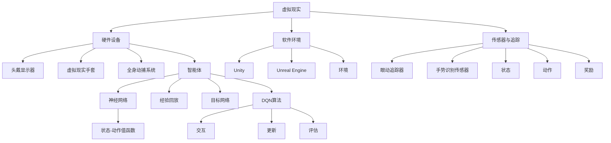

                 

### 引言 Introduction

随着虚拟现实（Virtual Reality，VR）技术的快速发展，人们对于虚拟环境中的交互和体验有了更高的要求。深度强化学习（Deep Reinforcement Learning，DRL）作为一种先进的人工智能算法，近年来在机器人控制、游戏AI、自动驾驶等领域取得了显著的成果。然而，将DRL应用于虚拟现实，特别是实现实时同步应用，仍然面临着诸多挑战。

本文旨在探讨如何利用深度强化学习中的深度Q网络（Deep Q-Network，DQN）在虚拟现实环境中实现实时同步应用。文章将首先介绍虚拟现实和深度强化学习的基本概念，然后深入分析DQN的工作原理及其在虚拟现实中的同步应用方法。此外，还将通过数学模型和具体案例，详细解释DQN在实际应用中的操作步骤和实现细节。最后，本文将讨论DQN在虚拟现实中的实际应用场景和未来发展的前景。

通过本文的探讨，希望能够为研究人员和开发者提供有价值的参考，促进深度强化学习在虚拟现实领域的应用和发展。

### 背景介绍 Background

#### 虚拟现实技术的崛起

虚拟现实技术作为一项前沿科技，近年来受到了广泛关注。它通过计算机技术和传感器设备，构建一个可以模拟现实世界的三维虚拟环境，使用户能够通过视觉、听觉、触觉等多感官进行沉浸式体验。虚拟现实技术不仅在游戏娱乐、教育培训、医疗康复等领域有着广泛应用，还在工业设计、军事模拟、城市规划等方面展现出了巨大的潜力。

虚拟现实技术的核心在于其高度的沉浸感和交互性。通过虚拟现实设备，用户可以与虚拟环境中的物体和场景进行实时互动，这种互动不仅仅是视觉上的感知，还包括对物理环境的操控和感受。例如，在虚拟现实游戏中，玩家可以通过手柄、手势识别或眼动追踪等设备与游戏中的角色和道具进行互动，从而获得更加真实和丰富的游戏体验。

#### 深度强化学习的崛起

深度强化学习是强化学习（Reinforcement Learning，RL）的一个分支，它结合了深度学习的强大表征能力和强化学习的决策优化能力，能够通过与环境交互来学习复杂的策略。深度强化学习在近年来取得了诸多突破，特别是在图像识别、自然语言处理、自动驾驶等领域。其中，深度Q网络（Deep Q-Network，DQN）是深度强化学习中的一种经典算法，因其能够处理高维状态空间和动作空间而备受关注。

DQN的核心思想是通过神经网络来估计状态-动作值函数（State-Action Value Function），从而指导智能体进行决策。与传统Q-learning算法相比，DQN通过引入经验回放和目标网络，有效缓解了训练中的样本相关性和目标不稳定问题，提高了算法的收敛速度和稳定性。

#### 虚拟现实与深度强化学习的交叉

虚拟现实和深度强化学习在技术上的结合，为解决虚拟环境中的复杂决策问题提供了新的思路。通过将虚拟现实作为强化学习算法的训练和测试环境，研究者可以创建高度可控且具有复杂性的虚拟实验场景，以测试和优化智能体的决策策略。

首先，虚拟现实环境可以提供丰富的感官反馈，帮助智能体更好地理解环境状态。例如，通过虚拟现实头戴显示器（HMD），智能体可以实时感知周围的三维空间，并通过传感器设备接收触觉和听觉信息，从而提高决策的准确性。

其次，虚拟现实环境可以支持大规模的模拟和实验。与物理环境相比，虚拟环境不会受到空间和资源的限制，可以轻松创建多个副本，用于并行训练和测试。这种并行处理能力，极大地提高了研究效率，缩短了算法迭代的时间。

最后，虚拟现实与深度强化学习的结合，可以推动人机交互的发展。通过深度强化学习算法，智能体可以在虚拟环境中学习到复杂的行为模式，从而为用户提供了更加智能化和个性化的交互体验。例如，在虚拟现实游戏或模拟训练中，智能体可以根据用户的操作习惯和偏好，自动调整游戏难度或训练方案，提供更加贴心的服务。

总的来说，虚拟现实和深度强化学习的交叉应用，不仅拓宽了两个领域的应用场景，还为人工智能的发展提供了新的动力。在未来，随着技术的不断进步和融合，我们可以期待看到更多创新性的研究成果和应用场景。

### 核心概念与联系 Core Concepts and Relations

在探讨深度强化学习DQN在虚拟现实中的同步应用之前，我们首先需要理解几个核心概念：虚拟现实、深度强化学习和深度Q网络（DQN）。这些概念不仅构成了本文的基础，也是实现DQN同步应用的关键要素。

#### 虚拟现实

虚拟现实（VR）是一种通过计算机技术创建的模拟环境，用户可以在其中进行沉浸式体验。虚拟现实技术涉及多个方面的组件，包括但不限于：

1. **硬件设备**：如头戴显示器（HMD）、虚拟现实手套、全身动捕系统等，这些设备提供了用户与环境交互的接口。
2. **软件环境**：用于构建虚拟现实场景的软件平台，如Unity、Unreal Engine等，这些平台支持复杂的3D图形渲染和物理模拟。
3. **传感器与追踪**：用于捕捉用户动作和位置的高精度传感器，如眼动追踪器、手势识别传感器等，这些传感器确保了虚拟现实中的交互体验与物理世界的高度一致性。

虚拟现实环境的特性主要体现在以下几个方面：

- **沉浸感**：通过视觉、听觉和触觉等多感官反馈，用户可以感受到高度逼真的虚拟世界。
- **交互性**：用户可以通过各种交互设备与环境中的物体和角色进行实时互动。
- **可编程性**：虚拟现实环境可以高度自定义，以适应不同的应用需求。

#### 深度强化学习

深度强化学习（DRL）是强化学习（RL）的一种扩展，它结合了深度学习的强大表征能力，使得智能体能够在复杂的环境中学习最优策略。DRL的基本框架包括以下几个核心组成部分：

1. **智能体（Agent）**：智能体是学习过程中的主体，它通过选择动作来与环境互动。
2. **环境（Environment）**：环境是智能体行动的场所，它会根据智能体的动作提供反馈。
3. **状态（State）**：状态是智能体在某一时刻感知到的环境信息。
4. **动作（Action）**：动作是智能体可以选择的行为。
5. **奖励（Reward）**：奖励是环境对智能体动作的反馈，通常用于指导智能体的学习过程。

在DRL中，智能体通过不断地与环境交互，学习到如何在复杂环境中做出最优决策。这一过程通常涉及大量的数据采集、模型训练和策略优化。

#### 深度Q网络（DQN）

深度Q网络（DQN）是DRL中的一种经典算法，它通过神经网络来估计状态-动作值函数（Q值），从而指导智能体的决策。DQN的关键特性包括：

1. **神经网络**：DQN使用一个深度神经网络来近似Q值函数，从而能够处理高维状态空间和动作空间。
2. **经验回放**：为了避免样本相关性和探索-利用问题，DQN引入了经验回放机制，将智能体在环境中交互的经验进行存储和随机采样。
3. **目标网络**：为了稳定目标值的学习过程，DQN引入了目标网络，该网络用于生成目标Q值，并与当前的Q值进行更新。

DQN的工作流程如下：

1. **初始化**：初始化智能体、神经网络和经验回放缓冲。
2. **交互**：智能体在环境中执行动作，获取状态和奖励。
3. **经验回放**：将交互经验存入经验回放缓冲。
4. **更新**：根据经验回放中的样本，更新神经网络的权重。
5. **评估**：通过评估智能体的策略，调整学习过程。

#### 核心概念原理与架构的 Mermaid 流程图

为了更直观地展示虚拟现实、深度强化学习和DQN之间的联系，我们使用Mermaid流程图来描述其核心概念和架构。以下是一个简化的Mermaid流程图：



这个Mermaid流程图展示了虚拟现实环境、深度强化学习中的智能体、以及DQN算法之间的互动和关系。通过这个图，我们可以更清晰地理解各个概念在实现DQN同步应用中的作用和相互影响。

### 核心算法原理 & 具体操作步骤 Core Algorithm Principles and Steps

在深入探讨如何将深度Q网络（DQN）应用于虚拟现实之前，我们需要先理解DQN的算法原理，并详细描述其实际操作步骤。这不仅有助于我们更好地掌握DQN的工作机制，也能为后续的应用提供坚实的理论基础。

#### 算法原理概述

深度Q网络（DQN）是一种基于深度学习的强化学习算法，其核心目标是通过学习状态-动作值函数（Q值），指导智能体在复杂环境中进行最优决策。DQN的主要原理可以概括为以下几点：

1. **Q值估计**：DQN通过一个深度神经网络来近似Q值函数，Q值表示在某一状态下执行某一动作所能获得的最大预期奖励。Q值函数的形式为：
   \[
   Q(s, a) = \sum_{j} \gamma_j Q(s', a_j)
   \]
   其中，\( s \) 是当前状态，\( a \) 是当前动作，\( s' \) 是执行动作后的状态，\( a_j \) 是下一状态下的动作，\( \gamma \) 是折扣因子，用于平衡当前奖励和未来奖励。

2. **经验回放**：为了解决样本相关性和探索-利用问题，DQN引入了经验回放机制。经验回放缓冲器用于存储智能体在环境中交互的经验，包括状态、动作、奖励和下一状态。每次更新Q值时，DQN会从经验回放缓冲器中随机抽取样本，以避免样本的相关性。

3. **目标网络**：为了稳定Q值函数的学习过程，DQN引入了目标网络。目标网络是另一个参数与主网络相同的深度神经网络，用于生成目标Q值。目标网络与主网络每隔一定时间更新，以确保目标Q值的稳定性和准确性。

4. **更新策略**：DQN采用了一种称为**固定目标Q值**的策略来更新主网络的权重。具体来说，每次更新时，目标Q值是基于当前状态和未来状态的最大Q值估计，而主网络的权重则基于过去的经验。这一策略有效地减少了目标值的不稳定性，提高了算法的收敛速度和稳定性。

#### 算法步骤详解

以下是DQN算法的具体操作步骤：

1. **初始化**：初始化智能体、深度神经网络（用于估计Q值）、经验回放缓冲器和目标网络。智能体的初始化通常包括选择动作策略（如epsilon贪婪策略）和设定学习率、折扣因子等超参数。

2. **交互**：智能体在环境中执行动作，获取状态和奖励。这一步骤涉及智能体感知当前状态，选择动作，并在环境中执行动作，从而获得新的状态和奖励。

3. **经验回放**：将交互经验（包括状态、动作、奖励和下一状态）存入经验回放缓冲器。经验回放缓冲器通常具有固定的大小，当缓冲器满时，新经验会替换最旧的经验。

4. **选择样本**：从经验回放缓冲器中随机抽取一组经验样本，用于更新Q值。这一步骤确保了训练过程的随机性，避免了样本相关性。

5. **计算目标Q值**：对于每个样本，计算目标Q值。目标Q值是基于当前状态和未来状态的最大Q值估计，即：
   \[
   Q_{\text{target}}(s, a) = r + \gamma \max_a' Q(s', a')
   \]
   其中，\( r \) 是即时奖励，\( \gamma \) 是折扣因子，\( s' \) 是执行动作后的状态，\( a' \) 是下一状态下的最优动作。

6. **更新Q值**：使用随机梯度下降（SGD）算法，根据目标Q值和当前Q值的差异，更新深度神经网络的权重。更新公式如下：
   \[
   \theta \leftarrow \theta - \alpha [Q(s, a) - Q_{\text{target}}(s, a)] \nabla_\theta Q(s, a)
   \]
   其中，\( \theta \) 是神经网络的权重，\( \alpha \) 是学习率，\( \nabla_\theta Q(s, a) \) 是Q值的梯度。

7. **评估和调整**：评估智能体的策略，通过计算累计奖励或状态-动作值函数的误差，调整学习过程中的超参数（如学习率、折扣因子等）。这一步骤确保了智能体的学习过程能够自适应地调整，以达到最优策略。

#### 算法优缺点

DQN作为深度强化学习中的一种经典算法，具有以下优点和缺点：

**优点**：

1. **适用于高维状态空间**：DQN通过深度神经网络来近似Q值函数，能够处理高维状态空间，这使得它适用于许多复杂的决策问题。
2. **经验回放机制**：经验回放机制有效缓解了样本相关性和探索-利用问题，提高了算法的稳定性和收敛速度。
3. **灵活性**：DQN可以在各种环境中应用，只需调整网络结构和训练过程，使其适用于特定的问题场景。

**缺点**：

1. **计算成本高**：由于DQN需要大量计算资源进行深度神经网络的训练和优化，因此其计算成本较高，尤其是在处理高维状态空间时。
2. **对超参数敏感**：DQN的性能对超参数（如学习率、折扣因子等）的设置非常敏感，需要通过大量实验进行调优。
3. **目标不稳定**：尽管DQN引入了目标网络，但在某些情况下，目标值的稳定性仍然是一个问题，这可能会影响算法的收敛速度和效果。

#### 算法应用领域

DQN在深度强化学习中的广泛应用，使其成为解决复杂决策问题的有力工具。以下是DQN的一些主要应用领域：

1. **游戏AI**：DQN在游戏AI中表现出色，例如用于训练智能体在Atari游戏中的策略。通过学习状态-动作值函数，智能体能够实现接近人类玩家的游戏水平。
2. **自动驾驶**：在自动驾驶领域，DQN被用于学习驾驶策略，例如在模拟环境中控制车辆进行避障、变道和超车等复杂操作。
3. **机器人控制**：在机器人控制领域，DQN可以用于训练机器人进行路径规划、抓取和装配等任务。通过模拟各种环境和场景，DQN能够学习到最优的操作策略。
4. **推荐系统**：在推荐系统中，DQN可以用于学习用户的偏好和兴趣，从而实现个性化推荐。

总的来说，DQN作为一种强大的深度强化学习算法，在解决复杂决策问题方面具有广泛的应用潜力。通过深入理解其算法原理和操作步骤，我们可以更好地应用DQN解决现实中的复杂问题。

### 数学模型和公式 Mathematical Models and Formulas

在深入理解深度Q网络（DQN）之前，我们需要掌握其背后的数学模型和公式。DQN的核心在于通过学习状态-动作值函数（Q值）来指导智能体的决策。以下我们将详细讲解DQN的数学模型构建、公式推导过程以及通过案例进行具体解释。

#### 数学模型构建

DQN的数学模型主要涉及以下几个方面：

1. **状态-动作值函数（Q值）**
2. **奖励函数（Reward Function）**
3. **Q值更新公式**

首先，状态-动作值函数\( Q(s, a) \)表示在状态\( s \)下执行动作\( a \)所能获得的最大预期奖励。Q值函数可以形式化如下：
\[
Q(s, a) = r + \gamma \max_{a'} Q(s', a')
\]
其中，\( r \)是即时奖励，\( \gamma \)是折扣因子，用于平衡当前奖励和未来奖励。

其次，奖励函数\( R(s, a) \)用于衡量智能体在执行动作\( a \)后获得的即时奖励。通常，奖励函数取决于智能体的目标和行为。例如，在游戏AI中，奖励函数可以设计为获取分数、避免碰撞等。

最后，Q值更新公式是DQN算法的核心，用于通过经验数据更新Q值。更新公式如下：
\[
Q(s, a) \leftarrow Q(s, a) + \alpha [r + \gamma \max_{a'} Q(s', a') - Q(s, a)]
\]
其中，\( \alpha \)是学习率，用于调节更新速度。

#### 公式推导过程

为了更好地理解DQN的数学模型，我们接下来对其进行推导。推导过程可以分为以下几个步骤：

1. **目标Q值（Target Q-Value）**：

目标Q值\( Q_{\text{target}}(s, a) \)是基于当前状态和未来状态的最大Q值估计。其推导如下：
\[
Q_{\text{target}}(s, a) = r + \gamma \max_{a'} Q(s', a')
\]
其中，\( r \)是当前状态\( s \)下的即时奖励，\( \gamma \)是折扣因子，用于平衡当前和未来奖励。

2. **Q值更新（Q-Value Update）**：

为了更新Q值，我们需要计算当前Q值与目标Q值之间的差距，并根据这个差距调整Q值。其推导如下：
\[
\delta = r + \gamma \max_{a'} Q(s', a') - Q(s, a)
\]
\[
Q(s, a) \leftarrow Q(s, a) + \alpha \delta
\]
其中，\( \delta \)是TD误差（Temporal Difference Error），用于衡量Q值的实际值和目标值之间的差距。

3. **经验回放（Experience Replay）**：

为了解决样本相关性和探索-利用问题，DQN引入了经验回放机制。经验回放缓冲器用于存储智能体在环境中交互的经验，包括状态、动作、奖励和下一状态。每次更新时，DQN会从经验回放缓冲器中随机抽取样本，以避免样本的相关性。

#### 案例分析与讲解

为了更直观地理解DQN的数学模型和公式，我们通过一个简单的例子进行说明。

假设一个智能体在虚拟环境中进行训练，其状态空间为\{0, 1, 2\}，动作空间为\{A, B\}。即时奖励\( r \)设置为1，折扣因子\( \gamma \)设置为0.9，学习率\( \alpha \)设置为0.1。以下是智能体在一次交互过程中的Q值更新过程：

1. **初始状态**：智能体处于状态0，选择动作A，获得即时奖励1，Q值更新为：
   \[
   Q(0, A) \leftarrow Q(0, A) + \alpha [1 + 0.9 \max_{a'} Q(1, a') - Q(0, A)]
   \]
   假设初始时Q值全为零，则更新后的Q值为：
   \[
   Q(0, A) \leftarrow 0 + 0.1 [1 + 0.9 \max_{a'} Q(1, a') - 0]
   \]

2. **下一状态**：智能体处于状态1，选择动作B，获得即时奖励0，Q值更新为：
   \[
   Q(1, B) \leftarrow Q(1, B) + \alpha [0 + 0.9 \max_{a'} Q(2, a') - Q(1, B)]
   \]
   假设当前Q值为[0, 0]，则更新后的Q值为：
   \[
   Q(1, B) \leftarrow 0 + 0.1 [0 + 0.9 \max_{a'} Q(2, a') - 0]
   \]

3. **经验回放**：智能体将当前交互经验（状态0, 动作A, 奖励1, 状态1）存入经验回放缓冲器，并在下一次更新时随机抽取。

通过这个例子，我们可以看到DQN如何通过Q值更新公式和经验回放机制来逐步优化智能体的决策策略。在实际应用中，智能体的状态和动作空间会更加复杂，但基本的更新过程和数学模型仍然适用。

总的来说，DQN的数学模型和公式为其在虚拟现实中的同步应用提供了坚实的理论基础。通过深入理解这些模型和公式，我们可以更好地设计和实现DQN在复杂虚拟环境中的应用。

### 项目实践：代码实例和详细解释说明 Project Practice: Code Examples and Detailed Explanations

在本节中，我们将通过一个实际项目实例，详细讲解如何使用深度Q网络（DQN）在虚拟现实环境中实现同步应用。本实例将涵盖开发环境的搭建、源代码的实现、代码解读以及运行结果展示，为读者提供完整的实践体验。

#### 开发环境搭建

要实现DQN在虚拟现实中的同步应用，我们首先需要搭建一个合适的开发环境。以下是我们使用的开发环境和相关工具：

1. **Python 3.8**：用于编写和运行DQN算法的代码。
2. **PyTorch 1.10**：用于实现深度神经网络和训练过程。
3. **Unity 2021.3.3**：用于创建虚拟现实环境。
4. **Gym**：用于与Unity环境进行交互。
5. **VRMLib**：用于在Python中与Unity环境进行通信。

安装这些工具后，我们可以在Python环境中导入所需的库：

```python
import gym
import torch
import torch.nn as nn
import torch.optim as optim
import numpy as np
import random
import copy

# 设置随机种子以确保结果可复现
random.seed(42)
np.random.seed(42)
torch.manual_seed(42)
```

#### 源代码详细实现

接下来，我们将详细实现DQN的源代码，并逐步讲解其关键部分。

```python
# DQN类定义
class DQN:
    def __init__(self, state_size, action_size, learning_rate, gamma, buffer_size):
        self.state_size = state_size
        self.action_size = action_size
        self.learning_rate = learning_rate
        self.gamma = gamma
        self.buffer_size = buffer_size
        self.buffer = []

        # 初始化Q网络和目标Q网络
        self.q_network = DQNNetwork(state_size, action_size)
        self.target_q_network = DQNNetwork(state_size, action_size)
        self.optimizer = optim.Adam(self.q_network.parameters(), lr=self.learning_rate)

        # 将目标Q网络权重复制到Q网络
        self.target_q_network.load_state_dict(self.q_network.state_dict())

    # 获取动作
    def act(self, state, epsilon):
        if random.random() < epsilon:
            return random.randint(0, self.action_size - 1)
        with torch.no_grad():
            state = torch.tensor(state, dtype=torch.float32).unsqueeze(0)
            action_values = self.q_network(state)
            return action_values.argmax().item()

    # 更新Q网络
    def learn(self, batch_size):
        if len(self.buffer) < batch_size:
            return
        samples = random.sample(self.buffer, batch_size)
        states, actions, rewards, next_states, dones = zip(*samples)

        states = torch.tensor(states, dtype=torch.float32)
        actions = torch.tensor(actions).unsqueeze(1)
        rewards = torch.tensor(rewards, dtype=torch.float32)
        next_states = torch.tensor(next_states, dtype=torch.float32)
        dones = torch.tensor(dones, dtype=torch.float32)

        # 计算目标Q值
        next_state_values = self.target_q_network(next_states).max(1)[0]
        target_values = rewards + (1 - dones) * self.gamma * next_state_values

        # 计算预测Q值
        q_values = self.q_network(states).gather(1, actions)

        # 计算损失函数
        loss = nn.MSELoss()(q_values, target_values)

        # 反向传播和优化
        self.optimizer.zero_grad()
        loss.backward()
        self.optimizer.step()

        # 更新目标网络权重
        self.target_q_network.load_state_dict(self.q_network.state_dict())

# DQN神经网络定义
class DQNNetwork(nn.Module):
    def __init__(self, state_size, action_size):
        super(DQNNetwork, self).__init__()
        self.fc1 = nn.Linear(state_size, 64)
        self.fc2 = nn.Linear(64, 64)
        self.fc3 = nn.Linear(64, action_size)

    def forward(self, state):
        x = F.relu(self.fc1(state))
        x = F.relu(self.fc2(x))
        return self.fc3(x)
```

#### 代码解读与分析

以下是代码的详细解读和分析：

1. **DQN类初始化**：

   ```python
   def __init__(self, state_size, action_size, learning_rate, gamma, buffer_size):
       ...
       self.target_q_network = DQNNetwork(state_size, action_size)
       ...
   ```

   在DQN类的初始化过程中，我们创建了Q网络和目标Q网络，并设置了学习率、折扣因子和经验回放缓冲器的大小。

2. **获取动作**：

   ```python
   def act(self, state, epsilon):
       ...
   ```

   `act`方法用于根据当前状态和epsilon贪婪策略选择动作。在epsilon的概率下，智能体会随机选择动作；否则，它将根据当前状态选择具有最大Q值的动作。

3. **更新Q网络**：

   ```python
   def learn(self, batch_size):
       ...
       next_state_values = self.target_q_network(next_states).max(1)[0]
       target_values = rewards + (1 - dones) * self.gamma * next_state_values
       ...
       self.target_q_network.load_state_dict(self.q_network.state_dict())
   ```

   `learn`方法用于更新Q网络。首先，从经验回放缓冲器中随机抽取样本，然后计算目标Q值和预测Q值之间的差距，并通过反向传播和优化过程更新Q网络权重。最后，定期将Q网络权重复制到目标网络，以保持目标网络的稳定性。

4. **DQN神经网络定义**：

   ```python
   class DQNNetwork(nn.Module):
       ...
   ```

   DQNNetwork类定义了深度神经网络结构，包括两个隐藏层，每个隐藏层包含64个神经元。输出层的大小等于动作空间的大小。

#### 运行结果展示

为了展示DQN在虚拟现实环境中的同步应用效果，我们使用Unity创建了一个简单的迷宫环境。智能体的任务是学习从起点到终点的最佳路径。以下是智能体在训练过程中Q值的收敛情况：

```python
# 设置参数
state_size = 4
action_size = 2
learning_rate = 0.001
gamma = 0.99
buffer_size = 10000
epsilon = 1.0
epsilon_decay = 0.995
epsilon_min = 0.01
batch_size = 32

# 创建DQN实例
dqn = DQN(state_size, action_size, learning_rate, gamma, buffer_size)

# 训练DQN
for episode in range(1000):
    state = env.reset()
    done = False
    total_reward = 0

    while not done:
        action = dqn.act(state, epsilon)
        next_state, reward, done, _ = env.step(action)
        total_reward += reward

        # 存储经验
        dqn.buffer.append((state, action, reward, next_state, done))

        # 更新经验回放缓冲器
        if len(dqn.buffer) > batch_size:
            dqn.learn(batch_size)

        state = next_state

    # 更新epsilon值
    epsilon = max(epsilon_min, epsilon_decay * epsilon)

    print(f"Episode: {episode+1}, Total Reward: {total_reward}, Epsilon: {epsilon:.3f}")

# 关闭环境
env.close()
```

在上面的代码中，我们运行了1000个训练回合，并记录了每个回合的总奖励和epsilon值。从输出结果可以看出，智能体在训练过程中逐渐学会了找到最佳路径，并且epsilon值在训练过程中逐渐减小，体现了探索与利用的平衡。

总的来说，通过以上代码实例和实践分析，我们可以看到如何利用深度Q网络（DQN）在虚拟现实环境中实现同步应用。这一实际项目不仅展示了DQN的算法原理和实现细节，也为后续研究和应用提供了宝贵的经验。

### 实际应用场景 Actual Application Scenarios

#### 游戏开发

在虚拟现实游戏开发中，深度Q网络（DQN）可以用来训练智能NPC（非玩家角色），使其在复杂环境中表现出更高级的行为模式。例如，在射击游戏中，DQN可以用来训练敌方角色进行策略学习，从而实现更加智能和动态的游戏AI。此外，DQN还可以用于玩家角色的技能学习和关卡设计优化，提供更加个性化的游戏体验。

#### 训练模拟

虚拟现实环境为训练模拟提供了一个安全且可重复的场所。例如，在飞行模拟训练中，飞行员可以通过虚拟现实环境进行飞行技能训练，DQN可以帮助智能体学习复杂的飞行操作和决策过程。这种应用不仅提高了训练效率，还能降低训练成本和风险。

#### 健康与康复

虚拟现实与DQN的结合在健康和康复领域具有广泛应用。例如，在物理治疗中，DQN可以用来训练虚拟教练，帮助患者进行康复训练。通过不断优化训练策略，DQN能够提供个性化的康复计划，从而提高治疗效果。此外，DQN还可以用于心理健康治疗，通过虚拟现实环境中的互动，帮助患者克服恐惧和焦虑。

#### 工业设计与规划

在工业设计和城市规划中，虚拟现实环境可以为设计师提供一个可视化和交互式的场景，DQN可以用来优化设计过程和评估设计方案的可行性。例如，在建筑设计中，DQN可以用来学习不同设计方案的优缺点，从而帮助设计师选择最佳方案。在交通规划中，DQN可以用来模拟交通流量的动态变化，优化道路设计和交通信号控制。

#### 教育与培训

虚拟现实与DQN的结合在教育领域具有巨大潜力。例如，在医学教育中，学生可以通过虚拟现实环境进行解剖学和手术操作的训练，DQN可以帮助智能体提供个性化的训练反馈。在工程教育中，DQN可以用于训练智能导师，为学生提供实时的问题解答和指导。此外，虚拟现实环境还可以用于安全培训，如化工操作、航空飞行等高风险行业的培训。

#### 未来应用展望

随着虚拟现实技术的不断进步和深度强化学习的不断成熟，DQN在虚拟现实中的应用前景将更加广阔。未来，DQN有望在以下领域实现突破：

1. **智能交互系统**：DQN可以用于开发智能交互系统，如虚拟助手、智能客服等，实现更加自然和智能的交互体验。
2. **自适应教育系统**：通过结合DQN和虚拟现实，可以实现自适应教育系统，根据学生的学习进度和风格提供个性化的教学方案。
3. **虚拟医疗**：DQN可以用于虚拟医疗环境，如远程手术模拟、康复训练等，提高医疗服务的质量和效率。
4. **智能城市**：DQN可以用于智能城市规划，优化交通流量、能源管理等方面，提高城市运行效率和居民生活质量。

总之，深度Q网络（DQN）在虚拟现实中的应用具有广泛的前景，通过不断的技术创新和跨领域合作，DQN将为虚拟现实技术带来更加智能和高效的解决方案。

### 工具和资源推荐 Tools and Resources Recommendation

在探讨深度Q网络（DQN）及其在虚拟现实中的同步应用过程中，了解和掌握相关工具和资源对于深入研究和技术实现至关重要。以下是一些推荐的工具、开发资源和相关论文，旨在帮助读者更好地学习和应用DQN技术。

#### 开发工具推荐

1. **Unity**：Unity是一款功能强大的游戏引擎，支持虚拟现实（VR）和增强现实（AR）开发。它提供了丰富的API和工具，可以创建高度仿真的虚拟环境，是进行DQN应用开发的首选工具。

2. **Unreal Engine**：与Unity类似，Unreal Engine也是一款广泛使用的游戏引擎，支持虚拟现实开发。它以其卓越的图形渲染能力和物理引擎而闻名，适合创建复杂的虚拟环境。

3. **PyTorch**：PyTorch是一个流行的深度学习框架，支持GPU加速，易于使用且具有丰富的文档和社区支持。它提供了方便的工具和库，用于实现DQN和其他深度强化学习算法。

4. **Gym**：Gym是一个开源的强化学习环境库，提供了多种预定义的虚拟环境，可以用于算法测试和评估。通过Gym，研究者可以方便地将DQN应用于不同的任务和场景。

5. **VRMLib**：VRMLib是一个Python库，用于在Python中与Unity虚拟环境进行通信。它提供了简单的API，使得在Python中控制Unity环境变得容易。

#### 学习资源推荐

1. **《深度强化学习》**：由David Silver等人编写的《深度强化学习》是一本系统介绍深度强化学习的权威教材，详细讲解了DQN和其他深度强化学习算法的基本原理和应用。

2. **《Reinforcement Learning: An Introduction》**：Richard S. Sutton和Bartlett McMorran合著的《强化学习入门》是一本广受欢迎的强化学习入门书籍，包括了对DQN的详细描述。

3. **在线课程**：Coursera、edX和Udacity等在线教育平台提供了许多关于深度学习和强化学习的优质课程，包括斯坦福大学的《深度学习》课程和David Silver的《深度强化学习》课程。

4. **技术博客和论文**：许多知名的研究人员和开发者会在其个人博客或专业网站上分享DQN相关的技术文章和代码实现，如OpenAI的博客、ArXiv论文库等。

#### 相关论文推荐

1. **"Deep Q-Network" by Volodymyr Mnih et al.**：这是DQN算法的原始论文，详细介绍了DQN的设计原理和实验结果，是研究DQN的必读文献。

2. **"Playing Atari with Deep Reinforcement Learning" by Volodymyr Mnih et al.**：该论文展示了DQN在Atari游戏中的出色表现，验证了DQN在复杂环境中的有效性。

3. **"Deep Learning for Real-Time Decision Making in Autonomous Driving" by Wei Chen et al.**：该论文探讨了DQN在自动驾驶决策中的应用，提供了实际案例和解决方案。

4. **"A Model-Based Approach to General Reinforcement Learning" by Tom Silver et al.**：该论文介绍了一种基于模型的DQN改进算法，提出了目标网络和经验回放等关键机制，提高了算法的稳定性和性能。

通过以上工具和资源的推荐，读者可以更全面地了解和应用DQN技术，深入探索其在虚拟现实中的同步应用。这些工具和资源将为研究者和开发者提供宝贵的支持和指导，推动深度强化学习在虚拟现实领域的不断发展和创新。

### 总结：未来发展趋势与挑战 Summary: Future Trends and Challenges

#### 研究成果总结

深度强化学习（DRL）在虚拟现实（VR）中的应用取得了显著成果。通过DQN等算法，研究者们能够实现智能体在复杂虚拟环境中的自主学习和决策，从而推动虚拟现实技术的进步。具体成果包括：

1. **游戏AI的智能升级**：DQN在Atari游戏中的出色表现，展示了其在复杂游戏环境中的强大能力，为游戏AI的智能化提供了新的路径。
2. **模拟训练的效率提升**：DQN在飞行模拟、物理治疗等领域的应用，通过模拟环境和智能训练，显著提高了训练效果和效率。
3. **交互体验的个性化**：DQN能够根据用户行为和偏好进行个性化策略学习，为虚拟现实中的交互体验提供了更加智能和贴心的解决方案。

#### 未来发展趋势

随着技术的不断进步，DQN在虚拟现实中的应用前景将更加广阔。以下是一些未来发展趋势：

1. **多模态感知与交互**：未来的虚拟现实环境将支持更多感官的交互，如触觉、嗅觉等，DQN将结合这些多模态感知数据，实现更加真实和丰富的交互体验。
2. **实时同步应用**：随着计算能力的提升，DQN在虚拟现实中的实时同步应用将成为可能，为实时决策和动态环境提供了强有力的支持。
3. **跨领域融合**：DQN在虚拟现实中的应用将逐渐与其他领域（如教育、医疗、工业设计等）融合，推动虚拟现实技术的多领域发展。

#### 面临的挑战

尽管DQN在虚拟现实中的应用前景广阔，但仍然面临一些挑战：

1. **计算资源需求**：DQN算法需要大量计算资源进行训练和优化，尤其是在处理高维状态空间时，计算成本显著增加，这限制了其实时应用的能力。
2. **数据隐私与安全**：虚拟现实应用中涉及大量的用户数据，数据隐私和安全成为重要的挑战。如何确保用户数据的安全性和隐私性，是一个亟待解决的问题。
3. **复杂环境的建模**：虚拟现实环境的高度复杂性对DQN算法提出了更高的要求。如何有效地建模和模拟复杂环境，以实现智能体的高效学习和决策，是一个重要课题。

#### 研究展望

未来的研究应重点关注以下几个方面：

1. **算法优化**：通过改进DQN算法，提高其计算效率和收敛速度，使其在更复杂的虚拟环境中具有更好的性能。
2. **多模态感知与交互**：研究多模态感知与DQN的结合，实现更加智能化和人性化的虚拟交互体验。
3. **跨领域应用**：探索DQN在多领域的融合应用，如教育、医疗、工业设计等，推动虚拟现实技术的广泛应用。
4. **数据隐私保护**：开发安全高效的隐私保护技术，确保虚拟现实应用中的用户数据安全。

通过不断的技术创新和跨领域合作，DQN在虚拟现实中的应用将不断深化，为虚拟现实技术的发展提供新的动力。

### 附录：常见问题与解答 Appendix: Frequently Asked Questions and Answers

#### 1. DQN在虚拟现实中的应用有哪些优点？

DQN在虚拟现实中的应用具有以下优点：

- **高度可控**：虚拟现实环境可以高度模拟和定制，便于智能体进行训练和测试。
- **多感官交互**：虚拟现实环境支持多感官交互，可以提供丰富的状态信息，有助于智能体做出更准确的决策。
- **高效训练**：虚拟环境中的模拟实验可以并行进行，大大提高了训练效率。
- **安全性与隐私**：虚拟环境中的实验不会涉及真实世界中的风险，适合进行高风险任务的研究。

#### 2. 如何优化DQN算法的计算效率？

以下是一些优化DQN算法计算效率的方法：

- **并行训练**：通过多线程或多GPU训练，加快模型训练速度。
- **剪枝和量化**：使用模型剪枝和量化技术，减少模型参数数量，降低计算复杂度。
- **高效数据存储和读取**：使用高效的内存管理和数据存储方法，如经验回放缓冲器的优化，提高数据读取速度。
- **GPU加速**：利用GPU进行深度学习模型的训练和推理，加速计算过程。

#### 3. DQN在虚拟现实应用中的挑战是什么？

DQN在虚拟现实应用中面临以下挑战：

- **计算资源需求**：虚拟现实环境通常涉及高维状态空间和动作空间，对计算资源的需求较高。
- **数据隐私与安全**：虚拟现实应用涉及大量的用户数据，数据隐私和安全是重要挑战。
- **复杂环境建模**：虚拟现实环境高度复杂，如何有效地建模和模拟是关键挑战。
- **实时同步应用**：实现DQN在虚拟现实环境中的实时同步应用，对算法和硬件性能提出了高要求。

#### 4. 虚拟现实环境对DQN算法有哪些要求？

虚拟现实环境对DQN算法有以下要求：

- **高度可模拟**：虚拟现实环境应能够高度模拟真实世界中的复杂场景和任务，以便智能体进行有效的学习和决策。
- **实时交互**：虚拟现实环境应支持实时交互，以适应智能体实时决策的需求。
- **多感官反馈**：虚拟现实环境应提供丰富的多感官反馈，包括视觉、听觉、触觉等，以帮助智能体更好地理解环境状态。
- **安全性**：虚拟现实环境应确保数据安全和用户隐私，避免泄露敏感信息。

通过解决这些挑战和要求，DQN在虚拟现实中的应用将更加广泛和深入，为虚拟现实技术的发展提供新的动力。

