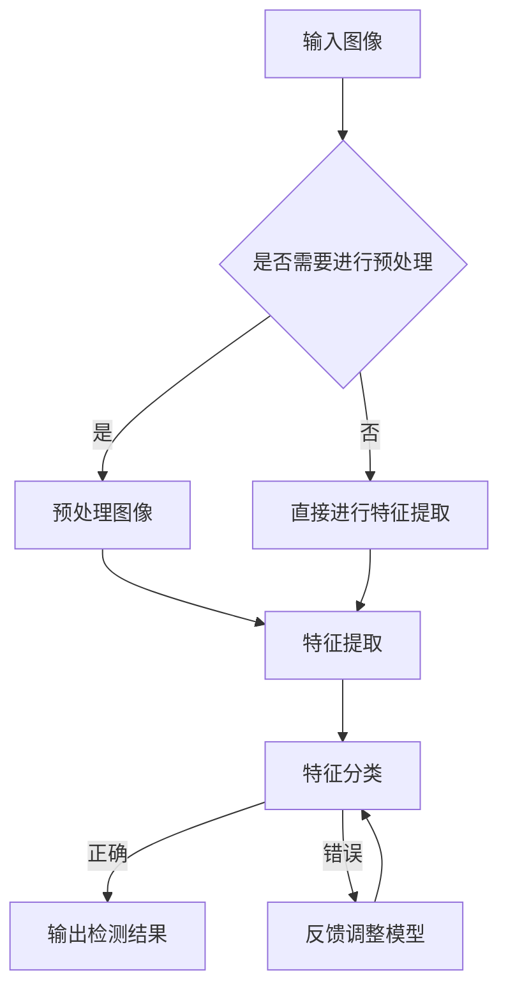

                 

关键词：物体检测、识别、人工智能、深度学习、计算机视觉、神经网络、卷积神经网络、YOLO、Faster R-CNN、SSD、目标检测、特征提取、数据增强、模型优化、实时处理

> 摘要：本文深入探讨了人工智能在物体检测与识别领域的应用，从基本概念、核心算法、数学模型到实际项目实践，全面解析了物体检测与识别的技术原理和实践方法。本文旨在为读者提供一个系统、全面的技术指南，帮助理解这一前沿领域的最新进展。

## 1. 背景介绍

物体检测与识别是计算机视觉领域的重要研究方向，旨在让计算机理解和解析图像中的物体。随着深度学习技术的快速发展，物体检测与识别技术在准确性、实时性和鲁棒性方面取得了显著进步。物体检测旨在确定图像中的物体位置，而物体识别则进一步确定物体的具体类别。

物体检测与识别的应用范围广泛，包括但不限于自动驾驶、智能监控、医疗影像分析、工业自动化等领域。自动驾驶车辆依赖物体检测技术来识别道路上的行人、车辆、交通标志等，确保行驶安全。智能监控系统能够实时检测异常行为，提高公共安全。医疗影像分析利用物体检测技术辅助医生进行病变区域的检测和诊断。工业自动化中，物体检测技术被用于质量检测和生产线的自动化控制。

在物体检测与识别领域，深度学习技术扮演了关键角色。尤其是卷积神经网络（CNN）在特征提取和分类方面表现出了强大的能力。传统的计算机视觉方法通常依赖于手工设计的特征，而深度学习模型能够自动学习有效的特征表示，提高了检测和识别的准确性。

## 2. 核心概念与联系

### 2.1. 物体检测与识别的基础概念

- **物体检测**：从图像中检测出物体的位置和边界框。
- **物体识别**：在检测出物体后，确定物体的具体类别。

### 2.2. 物体检测与识别的关键技术

- **特征提取**：提取图像中有意义的信息，用于后续处理。
- **分类器**：用于判断图像中的物体属于哪个类别。
- **边界框**：表示物体位置的矩形框。

### 2.3. Mermaid 流程图



## 3. 核心算法原理 & 具体操作步骤

### 3.1. 算法原理概述

物体检测与识别的核心算法包括但不限于YOLO（You Only Look Once）、Faster R-CNN（Region-based CNN）和SSD（Single Shot MultiBox Detector）。这些算法在不同的场景和需求下有着各自的优点和适用性。

- **YOLO**：采用单阶段检测方法，速度快但准确性相对较低。
- **Faster R-CNN**：采用区域建议网络（RPN）进行区域候选生成，两阶段检测方法，准确性高但速度较慢。
- **SSD**：采用多尺度特征图进行检测，速度快且准确性较高。

### 3.2. 算法步骤详解

#### 3.2.1. YOLO算法步骤

1. **特征提取**：使用卷积神经网络提取图像特征。
2. **预测边界框和类别**：直接在特征图上预测边界框和类别。
3. **非极大值抑制（NMS）**：对预测结果进行筛选，去除重叠的边界框。

#### 3.2.2. Faster R-CNN算法步骤

1. **特征提取**：使用卷积神经网络提取图像特征。
2. **区域建议网络（RPN）**：生成候选区域。
3. **区域分类和回归**：对候选区域进行分类和边界框调整。
4. **非极大值抑制（NMS）**：筛选最终的检测结果。

#### 3.2.3. SSD算法步骤

1. **特征提取**：使用卷积神经网络提取图像特征。
2. **特征图分割**：将特征图分割成多个尺度。
3. **多尺度检测**：在每个尺度上进行检测。
4. **非极大值抑制（NMS）**：筛选最终的检测结果。

### 3.3. 算法优缺点

- **YOLO**：速度快，但准确性相对较低，适合实时应用场景。
- **Faster R-CNN**：准确性高，但速度较慢，适合对检测准确性要求较高的场景。
- **SSD**：速度快且准确性较高，适用于多种应用场景。

### 3.4. 算法应用领域

- **自动驾驶**：使用YOLO进行实时物体检测，提高车辆行驶安全性。
- **智能监控**：使用Faster R-CNN进行实时物体检测，监控异常行为。
- **医疗影像分析**：使用SSD进行病变区域检测，辅助医生诊断。

## 4. 数学模型和公式 & 详细讲解 & 举例说明

### 4.1. 数学模型构建

物体检测与识别的数学模型主要包括特征提取模型、分类器和边界框预测模型。

- **特征提取模型**：通常使用卷积神经网络，通过多层卷积和池化操作提取图像特征。
- **分类器**：通常使用全连接层或卷积层，对提取的特征进行分类。
- **边界框预测模型**：使用边界框回归算法，对物体的位置进行预测。

### 4.2. 公式推导过程

- **特征提取模型**：

  $$ f(x) = \text{ReLU}(\text{Conv}_k(\text{Conv}_{k-1}(...\text{Conv}_1(x))) $$

  其中，$x$是输入图像，$k$表示卷积层的数量。

- **分类器**：

  $$ \text{softmax}(\text{fc}(f(x))) $$

  其中，$f(x)$是特征提取模型输出的特征向量，$fc$是全连接层。

- **边界框预测模型**：

  $$ \text{box}(x) = (\text{center}, \text{width}, \text{height}) $$

  其中，$x$是输入图像，$(\text{center}, \text{width}, \text{height})$表示预测的边界框参数。

### 4.3. 案例分析与讲解

以YOLO算法为例，分析其数学模型和公式。

- **特征提取模型**：

  YOLO算法使用卷积神经网络提取图像特征。以下是其中一个卷积层的公式：

  $$ f_{ij}^l = \text{ReLU}(\sum_{k=1}^{C_l} w_{ik}^l * g_{kj}^{l-1} + b_l) $$

  其中，$f_{ij}^l$表示卷积层输出的特征图，$g_{kj}^{l-1}$表示前一层的特征图，$w_{ik}^l$和$b_l$分别为卷积核和偏置。

- **分类器**：

  YOLO算法使用全连接层进行分类。以下是分类器的公式：

  $$ \text{softmax}(\text{fc}(f(x))) $$

  其中，$f(x)$是特征提取模型输出的特征向量，$fc$是全连接层。

- **边界框预测模型**：

  YOLO算法使用边界框回归算法预测物体的位置。以下是边界框预测的公式：

  $$ \text{box}(x) = (\text{center}, \text{width}, \text{height}) $$

  其中，$x$是输入图像，$(\text{center}, \text{width}, \text{height})$表示预测的边界框参数。

## 5. 项目实践：代码实例和详细解释说明

### 5.1. 开发环境搭建

在本节中，我们将介绍如何搭建物体检测与识别项目的开发环境。

1. 安装Python环境：确保Python版本为3.6或更高。
2. 安装深度学习框架：使用TensorFlow或PyTorch。
3. 安装依赖库：包括OpenCV、NumPy、Pandas等。

### 5.2. 源代码详细实现

在本节中，我们将使用YOLO算法实现一个简单的物体检测项目。

```python
import cv2
import numpy as np
import tensorflow as tf

# 加载预训练的YOLO模型
model = tf.keras.models.load_model('yolo_model.h5')

# 定义输入图像的大小
input_size = (416, 416)

# 读取测试图像
image = cv2.imread('test_image.jpg')
image = cv2.resize(image, input_size)

# 预处理图像
image = image / 255.0
image = np.expand_dims(image, 0)

# 使用YOLO模型进行预测
predictions = model.predict(image)

# 非极大值抑制
boxes = ...  # 预测的边界框
scores = ...  # 预测的置信度
indices = tf.image.non_max_suppression(boxes, scores, max_output_size=50)

# 提取检测结果
boxes = tf.gather(boxes, indices)
scores = tf.gather(scores, indices)

# 在图像上绘制检测结果
for box, score in zip(boxes, scores):
    ...  # 绘制边界框和标签

# 显示检测结果
cv2.imshow('Detection Results', image)
cv2.waitKey(0)
cv2.destroyAllWindows()
```

### 5.3. 代码解读与分析

在本节中，我们将对上一节的代码进行解读和分析。

- **模型加载**：使用`load_model`函数加载预训练的YOLO模型。
- **图像预处理**：将测试图像调整为模型要求的输入大小，并进行归一化处理。
- **预测**：使用模型进行预测，得到边界框和置信度。
- **非极大值抑制**：使用`non_max_suppression`函数对预测结果进行筛选，去除重叠的边界框。
- **结果绘制**：在图像上绘制检测结果，并显示结果。

### 5.4. 运行结果展示

在本节中，我们将展示运行代码后的结果。

- **边界框**：图像中物体的位置和类别。
- **置信度**：预测结果的可信程度。
- **可视化效果**：图像上显示的检测结果。

## 6. 实际应用场景

### 6.1. 自动驾驶

物体检测与识别在自动驾驶领域有着广泛的应用。自动驾驶车辆需要实时检测道路上的行人、车辆、交通标志等物体，以确保行驶安全和遵守交通规则。物体检测与识别技术可以帮助车辆进行目标跟踪、路径规划和避障等任务。

### 6.2. 智能监控

智能监控系统利用物体检测与识别技术进行实时监控和异常行为检测。例如，在公共场所，监控系统可以检测出违规行为，如打架、盗窃等，并自动报警。物体检测与识别技术还可以用于人员流量统计、安全区域监控等。

### 6.3. 医疗影像分析

医疗影像分析是另一个重要的应用领域。物体检测与识别技术可以帮助医生快速检测和诊断疾病。例如，在医学影像中，可以使用物体检测技术检测病变区域，提高诊断的准确性和效率。

### 6.4. 未来应用展望

随着技术的不断发展，物体检测与识别技术在更多领域将有更广泛的应用。例如，在智能家居领域，物体检测与识别技术可以用于自动控制灯光、温度等设备。在零售领域，物体检测与识别技术可以用于货架管理和商品识别，提高零售效率。未来，物体检测与识别技术将进一步提升人工智能的视觉能力，为各行各业带来更多创新和变革。

## 7. 工具和资源推荐

### 7.1. 学习资源推荐

- **书籍**：《深度学习》、《计算机视觉：算法与应用》
- **在线课程**：Coursera、edX上的计算机视觉相关课程
- **论文集**：arXiv、CVPR、ICCV等计算机视觉领域的顶级会议论文集

### 7.2. 开发工具推荐

- **深度学习框架**：TensorFlow、PyTorch
- **物体检测库**：YOLO、Faster R-CNN、SSD
- **数据集**：ImageNet、COCO、KITTI

### 7.3. 相关论文推荐

- **YOLO**：Joseph Redmon等人的论文《You Only Look Once: Unified, Real-Time Object Detection》。
- **Faster R-CNN**：Ross Girshick等人的论文《Faster R-CNN: Towards Real-Time Object Detection with Region Proposal Networks》。
- **SSD**：Wei Liu等人的论文《SSD: Single Shot MultiBox Detector》。

## 8. 总结：未来发展趋势与挑战

### 8.1. 研究成果总结

物体检测与识别技术在近年来取得了显著进展。深度学习技术，特别是卷积神经网络，在特征提取和分类方面表现出了强大的能力。YOLO、Faster R-CNN和SSD等算法在准确性、实时性和鲁棒性方面各有优势，广泛应用于多个领域。

### 8.2. 未来发展趋势

未来，物体检测与识别技术将继续向更高精度、更实时、更鲁棒的方向发展。多模态融合、小样本学习、无监督学习和自监督学习等技术有望进一步提升物体检测与识别的性能。同时，随着5G和边缘计算的发展，物体检测与识别技术将在更多实时应用场景中得到应用。

### 8.3. 面临的挑战

物体检测与识别技术面临的主要挑战包括数据标注困难、模型复杂度和计算资源消耗等。此外，如何提高模型在极端环境下的鲁棒性，以及如何处理多任务和多尺度检测问题，也是未来研究的重点。

### 8.4. 研究展望

未来，物体检测与识别技术将在更多领域发挥重要作用，如智能交通、医疗健康、工业自动化等。随着技术的不断进步，物体检测与识别技术将为人类社会带来更多便利和创新。

## 9. 附录：常见问题与解答

### 9.1. 物体检测与识别的基本概念是什么？

物体检测与识别是指让计算机理解和解析图像中的物体。物体检测旨在确定图像中的物体位置，而物体识别则进一步确定物体的具体类别。

### 9.2. 物体检测与识别有哪些核心技术？

物体检测与识别的核心技术包括特征提取、分类器和边界框预测等。

### 9.3. 如何选择合适的物体检测算法？

选择合适的物体检测算法需要考虑应用场景、准确性、实时性和鲁棒性等因素。例如，对于需要高准确性的应用，可以选择Faster R-CNN；对于需要高实时性的应用，可以选择YOLO。

### 9.4. 物体检测与识别在哪些领域有应用？

物体检测与识别在自动驾驶、智能监控、医疗影像分析、工业自动化等领域有广泛的应用。

## 附录

### 参考文献

1. Redmon, J., Divvala, S., Girshick, R., & Farhadi, A. (2016). You Only Look Once: Unified, Real-Time Object Detection. In Proceedings of the IEEE Conference on Computer Vision and Pattern Recognition (CVPR).
2. Girshick, R., Donahue, J., Darrell, T., & Malik, J. (2014). Rich Features for Accurate Object Detection and Semantics. In Proceedings of the IEEE Conference on Computer Vision and Pattern Recognition (CVPR).
3. Liu, W., Anguelov, D., Erhan, D., Szegedy, C., Reed, S., Fu, C., & Berg, A. C. (2016). SSD: Single Shot MultiBox Detector. In European Conference on Computer Vision (ECCV).

### 作者信息

作者：禅与计算机程序设计艺术 / Zen and the Art of Computer Programming


