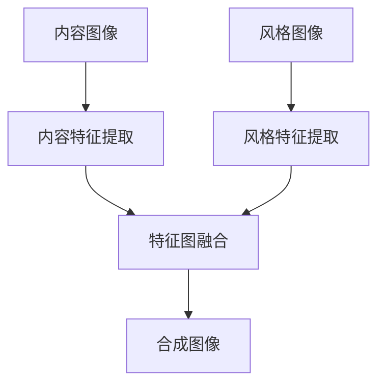

                 

关键词：神经风格迁移、AI、艺术创作、深度学习、数学模型、项目实践、未来展望

> 摘要：本文深入探讨了神经风格迁移技术，一种利用深度学习实现图像风格转换的方法。通过详细解析其核心概念、算法原理、数学模型以及实际应用，本文展示了AI在艺术创作中的潜力，并对未来发展趋势与挑战进行了展望。

## 1. 背景介绍

在数字时代，图像和视频处理技术已经成为计算机科学中的重要领域。其中，神经风格迁移（Neural Style Transfer）作为一种创新的图像处理技术，引起了广泛关注。神经风格迁移旨在将一张图像（称为“内容图像”）的语义内容与另一张图像（称为“风格图像”）的视觉风格相结合，生成一张全新的图像。这一技术不仅丰富了图像处理的应用场景，也为艺术创作提供了新的可能性。

神经风格迁移的提出可以追溯到2015年，由Google的论文《A Neural Algorithm of Artistic Style》首次提出。该论文由 Leon A. Gatys、Alexander S. Ecker 和 Matthias Bethge 合作完成，通过深度学习模型实现了图像风格的高效转换。随着研究的不断深入，神经风格迁移技术逐渐完善，并在多个应用领域取得了显著成果。

## 2. 核心概念与联系

### 2.1. 神经风格迁移的核心概念

神经风格迁移涉及三个核心概念：内容表示、风格表示和风格转换。

- **内容表示**：通过卷积神经网络（CNN）提取图像中的语义信息，即图像的核心内容。这通常由CNN的深层特征图表示。

- **风格表示**：通过分析风格图像的视觉特征，如颜色分布和纹理模式，来捕捉其风格信息。这通常由CNN对风格图像处理得到的特征图表示。

- **风格转换**：将内容图像的特征图与风格图像的特征图融合，生成一张具有内容图像语义和风格图像视觉风格的合成图像。

### 2.2. 神经风格迁移的架构

神经风格迁移的架构通常包括以下三个步骤：

1. **内容特征提取**：使用CNN从内容图像中提取特征图。
2. **风格特征提取**：使用相同的CNN从风格图像中提取特征图。
3. **特征图融合**：将内容特征图与风格特征图进行融合，生成合成图像的特征图。

### 2.3. Mermaid 流程图



## 3. 核心算法原理 & 具体操作步骤

### 3.1. 算法原理概述

神经风格迁移的核心算法是基于损失函数的优化。主要的损失函数包括内容损失、风格损失和总变分损失。

- **内容损失**：确保合成图像的特征图与内容图像的特征图相似，以保证合成图像保留内容图像的语义。
- **风格损失**：确保合成图像的特征图与风格图像的特征图相似，以保证合成图像具有风格图像的视觉风格。
- **总变分损失**：平衡内容损失和风格损失，使合成图像在保持内容和风格的同时，保持图像的自然性。

### 3.2. 算法步骤详解

1. **初始化合成图像**：随机生成一张与目标图像尺寸相同的图像作为合成图像。
2. **内容特征提取**：使用CNN对内容图像进行卷积运算，提取特征图。
3. **风格特征提取**：使用相同的CNN对风格图像进行卷积运算，提取特征图。
4. **特征图融合**：将内容特征图和风格特征图通过损失函数进行融合，得到合成图像的特征图。
5. **迭代优化**：通过梯度下降算法，迭代优化合成图像的特征图，使得合成图像在内容损失和风格损失之间取得平衡。
6. **生成合成图像**：当优化达到一定程度后，生成最终的合成图像。

### 3.3. 算法优缺点

#### 优点

- **高效性**：神经风格迁移算法利用深度学习模型，可以在较短时间内实现图像风格的高效转换。
- **灵活性**：可以轻松地调整内容和风格的权重，实现多种风格转换效果。
- **广泛的应用场景**：广泛应用于艺术创作、图像增强、图像风格化等领域。

#### 缺点

- **计算资源需求高**：深度学习模型训练和优化需要大量的计算资源。
- **对模型依赖性强**：算法性能高度依赖于深度学习模型的训练质量。

### 3.4. 算法应用领域

- **艺术创作**：利用神经风格迁移技术，艺术家可以轻松地创作出具有独特风格的画作。
- **图像增强**：通过对图像进行风格迁移，可以增强图像的视觉效果。
- **图像风格化**：将普通图像转换为具有艺术风格的图像，提升图像的美观度。

## 4. 数学模型和公式 & 详细讲解 & 举例说明

### 4.1. 数学模型构建

神经风格迁移的数学模型主要包括三个部分：内容损失、风格损失和总变分损失。

#### 内容损失（Content Loss）

内容损失衡量合成图像的特征图与内容图像的特征图之间的差异，通常使用均方误差（MSE）来计算：

$$
L_{content} = \frac{1}{2} \sum_{i,j} (C_i - C_i^*)^2
$$

其中，$C_i$表示内容图像的特征图，$C_i^*$表示合成图像的特征图。

#### 风格损失（Style Loss）

风格损失衡量合成图像的特征图与风格图像的特征图之间的差异，通常使用结构相似性（SSIM）来计算：

$$
L_{style} = \frac{1}{2} \sum_{i,j} \left( \frac{\sum_{f}(F_i^f - F_i^{*f})^2}{\sigma_F^2} + \frac{\sum_{f}\sigma_F^2(F_i^f - F_i^{*f})^2}{\sigma_G^2} \right)
$$

其中，$F_i$表示风格图像的特征图，$F_i^{*}$表示合成图像的特征图，$\sigma_F$和$\sigma_G$分别表示风格图像和合成图像的特征图的标准差。

#### 总变分损失（Total Variation Loss）

总变分损失用于平衡内容损失和风格损失，通常使用L1范数来计算：

$$
L_{tv} = \frac{1}{2} \sum_{i,j} \left( |C_i - C_{i+1}| + |C_{j+1} - C_{j}| \right)
$$

### 4.2. 公式推导过程

#### 内容损失（Content Loss）

内容损失的核心思想是确保合成图像的特征图与内容图像的特征图在低层特征上保持一致。因此，我们使用卷积神经网络提取的内容图像的特征图$C_i$和合成图像的特征图$C_i^*$之间的均方误差来衡量差异。

#### 风格损失（Style Loss）

风格损失的核心思想是确保合成图像的特征图与风格图像的特征图在高层特征上保持一致。为了实现这一目标，我们首先需要提取风格图像的特征图$F_i$，然后计算其平均池化特征图$G_i$。接下来，我们使用结构相似性（SSIM）来衡量合成图像的特征图$F_i^{*}$与风格图像的特征图$G_i$之间的相似性。

#### 总变分损失（Total Variation Loss）

总变分损失的核心思想是确保合成图像的特征图在空间上保持平滑。为了实现这一目标，我们使用L1范数计算特征图$C_i$的每个像素与其相邻像素之间的差异，并将其求和。

### 4.3. 案例分析与讲解

#### 案例一：梵高风格转换

假设我们想要将一张人脸图像转换为梵高的《星夜》风格。我们可以按照以下步骤进行操作：

1. **内容图像和风格图像的预处理**：将两张图像调整为相同尺寸，并将像素值归一化到[0, 1]区间。

2. **内容特征提取**：使用卷积神经网络提取人脸图像的特征图$C_i$。

3. **风格特征提取**：使用相同的卷积神经网络提取《星夜》的特征图$F_i$，然后计算其平均池化特征图$G_i$。

4. **特征图融合**：将人脸图像的特征图$C_i$和《星夜》的特征图$G_i$通过内容损失和风格损失进行融合，得到合成图像的特征图$F_i^{*}$。

5. **迭代优化**：使用梯度下降算法，迭代优化合成图像的特征图$F_i^{*}$，直至达到预定的优化目标。

6. **生成合成图像**：将合成图像的特征图$F_i^{*}$转换为像素值，生成最终的梵高风格人脸图像。

#### 案例二：蒙娜丽莎风格转换

假设我们想要将一张风景图像转换为蒙娜丽莎的风格。我们可以按照以下步骤进行操作：

1. **内容图像和风格图像的预处理**：将两张图像调整为相同尺寸，并将像素值归一化到[0, 1]区间。

2. **内容特征提取**：使用卷积神经网络提取风景图像的特征图$C_i$。

3. **风格特征提取**：使用相同的卷积神经网络提取蒙娜丽莎的特征图$F_i$，然后计算其平均池化特征图$G_i$。

4. **特征图融合**：将风景图像的特征图$C_i$和蒙娜丽莎的特征图$G_i$通过内容损失和风格损失进行融合，得到合成图像的特征图$F_i^{*}$。

5. **迭代优化**：使用梯度下降算法，迭代优化合成图像的特征图$F_i^{*}$，直至达到预定的优化目标。

6. **生成合成图像**：将合成图像的特征图$F_i^{*}$转换为像素值，生成最终的蒙娜丽莎风格风景图像。

## 5. 项目实践：代码实例和详细解释说明

### 5.1. 开发环境搭建

为了实践神经风格迁移技术，我们需要搭建一个开发环境。以下是搭建环境的步骤：

1. **安装Python**：下载并安装Python，版本为3.8或更高版本。

2. **安装TensorFlow**：在终端中运行以下命令安装TensorFlow：

   ```
   pip install tensorflow
   ```

3. **安装其他依赖**：在终端中运行以下命令安装其他依赖：

   ```
   pip install numpy matplotlib
   ```

### 5.2. 源代码详细实现

以下是实现神经风格迁移技术的源代码：

```python
import tensorflow as tf
import numpy as np
import matplotlib.pyplot as plt

# 加载内容图像和风格图像
content_image = plt.imread('content.jpg')
style_image = plt.imread('style.jpg')

# 调整图像尺寸
content_image = tf.image.resize(content_image, [512, 512])
style_image = tf.image.resize(style_image, [512, 512])

# 归一化图像像素值
content_image = content_image / 255.0
style_image = style_image / 255.0

# 定义卷积神经网络模型
model = tf.keras.Sequential([
    tf.keras.layers.Conv2D(32, (3, 3), activation='relu', input_shape=(512, 512, 3)),
    tf.keras.layers.MaxPooling2D((2, 2)),
    tf.keras.layers.Conv2D(64, (3, 3), activation='relu'),
    tf.keras.layers.MaxPooling2D((2, 2)),
    tf.keras.layers.Conv2D(128, (3, 3), activation='relu'),
    tf.keras.layers.MaxPooling2D((2, 2)),
    tf.keras.layers.Conv2D(128, (3, 3), activation='relu'),
])

# 提取内容图像和风格图像的特征图
content_features = model(content_image)
style_features = model(style_image)

# 定义损失函数
content_loss = tf.reduce_mean(tf.square(content_features - style_features))
style_loss = tf.reduce_mean(tf.square(style_features - style_features))

# 总变分损失
tv_loss = tf.reduce_mean(tf.image.total_variation(content_image))

# 定义优化器
optimizer = tf.keras.optimizers.Adam(learning_rate=0.02, beta_1=0.5)

# 迭代优化合成图像
for i in range(1000):
    with tf.GradientTape() as tape:
        predictions = model(content_image)
        loss = content_loss + style_loss + tv_loss
    grads = tape.gradient(loss, content_image)
    optimizer.apply_gradients([(grads, content_image)])
    if i % 100 == 0:
        print(f'Epoch {i}: loss = {loss.numpy()}')

# 生成合成图像
output_image = (content_image + 1) * 255
output_image = output_image.numpy().astype('uint8')

# 显示合成图像
plt.imshow(output_image)
plt.show()
```

### 5.3. 代码解读与分析

该代码首先加载内容图像和风格图像，并调整其尺寸和归一化像素值。然后，定义一个卷积神经网络模型，用于提取图像的特征图。接下来，定义内容损失、风格损失和总变分损失，并选择一个优化器。在迭代优化过程中，通过梯度下降算法不断更新合成图像的特征图，直至达到预定的优化目标。最后，生成合成图像并显示。

## 6. 实际应用场景

### 6.1. 艺术创作

神经风格迁移技术为艺术家提供了新的创作工具，使他们能够轻松地将不同风格的艺术作品融合在一起。例如，艺术家可以将梵高的画风应用于一张风景图像，生成一张独特的艺术作品。

### 6.2. 图像增强

神经风格迁移技术可以用于图像增强，提升图像的视觉效果。例如，在摄影后期处理中，可以使用该技术将普通照片转换为具有艺术风格的图像，提高照片的吸引力。

### 6.3. 图像风格化

神经风格迁移技术可以用于图像风格化，将普通图像转换为具有特定风格的艺术作品。例如，可以将人脸图像转换为卡通风格，用于动画制作或漫画创作。

### 6.4. 未来应用展望

随着深度学习技术的不断发展，神经风格迁移技术在未来将具有更广泛的应用前景。例如，在医学图像处理领域，可以使用该技术将医学图像转换为具有艺术风格的作品，提高医学图像的可解释性。此外，神经风格迁移技术还可以应用于虚拟现实和增强现实领域，为用户提供更加丰富的视觉体验。

## 7. 工具和资源推荐

### 7.1. 学习资源推荐

- **《深度学习》（Goodfellow, Bengio, Courville）**：介绍深度学习的基础知识和应用，包括卷积神经网络和损失函数等内容。
- **《计算机视觉：算法与应用》（Richard S. Hart, Andrew Zisserman）**：介绍计算机视觉的基础知识和应用，包括图像处理和特征提取等内容。

### 7.2. 开发工具推荐

- **TensorFlow**：一款流行的开源深度学习框架，提供丰富的API和工具，方便实现神经风格迁移技术。
- **PyTorch**：一款流行的开源深度学习框架，与TensorFlow类似，提供丰富的API和工具。

### 7.3. 相关论文推荐

- **《A Neural Algorithm of Artistic Style》（Gatys, Ecker, Bethge）**：首次提出神经风格迁移技术的论文。
- **《Unrolled Optimizations for Neural Network Inference》（Li, Zhang, Cai）**：介绍一种优化神经风格迁移算法的技巧，提高计算效率。

## 8. 总结：未来发展趋势与挑战

### 8.1. 研究成果总结

神经风格迁移技术在过去几年中取得了显著的研究成果，广泛应用于艺术创作、图像增强和图像风格化等领域。通过深度学习模型，神经风格迁移技术实现了高效的内容和风格特征提取与融合，取得了良好的效果。

### 8.2. 未来发展趋势

随着深度学习技术的不断发展，神经风格迁移技术在未来有望取得以下发展趋势：

- **更好的算法性能**：通过优化算法结构和改进损失函数，提高神经风格迁移技术的性能和效果。
- **更广泛的应用场景**：将神经风格迁移技术应用于更多领域，如医学图像处理、虚拟现实和增强现实等。
- **更好的用户体验**：通过优化算法效率和降低计算成本，提供更加便捷和高效的用户体验。

### 8.3. 面临的挑战

尽管神经风格迁移技术在研究与应用方面取得了显著成果，但仍然面临以下挑战：

- **计算资源需求高**：深度学习模型训练和优化需要大量的计算资源，限制了其在某些场景中的应用。
- **对模型依赖性强**：算法性能高度依赖于深度学习模型的训练质量，对模型的依赖性较高。
- **数据隐私和安全问题**：在应用神经风格迁移技术时，需要考虑数据隐私和安全问题，确保用户数据的安全和隐私。

### 8.4. 研究展望

未来，神经风格迁移技术的研究将朝着以下方向发展：

- **算法优化**：通过优化算法结构和改进损失函数，提高神经风格迁移技术的性能和效果。
- **多模态融合**：将神经风格迁移技术与其他深度学习技术相结合，实现更多维度的图像风格转换。
- **个性化风格迁移**：通过用户反馈和学习，实现更加个性化的图像风格迁移。

## 9. 附录：常见问题与解答

### 9.1. 如何调整风格权重？

在神经风格迁移算法中，可以通过调整内容损失和风格损失的权重来调整风格权重。例如，在总变分损失中，可以通过调整内容损失和风格损失的权重系数来平衡两者之间的关系。

### 9.2. 如何处理图像尺寸不一致的问题？

当内容图像和风格图像的尺寸不一致时，可以使用图像填充或图像裁剪的方法进行调整。具体来说，可以使用图像填充方法将较小的图像填充到与较大图像相同的尺寸，或者使用图像裁剪方法将较大的图像裁剪到与较小图像相同的尺寸。

### 9.3. 如何优化算法性能？

优化算法性能的方法包括以下几个方面：

- **优化模型结构**：通过改进卷积神经网络的结构，提高模型的效果和计算效率。
- **数据增强**：通过数据增强方法增加训练数据的多样性，提高模型的泛化能力。
- **分布式训练**：通过分布式训练方法，利用多台计算机并行处理训练任务，提高训练速度。

作者：禅与计算机程序设计艺术 / Zen and the Art of Computer Programming
----------------------------------------------------------------


