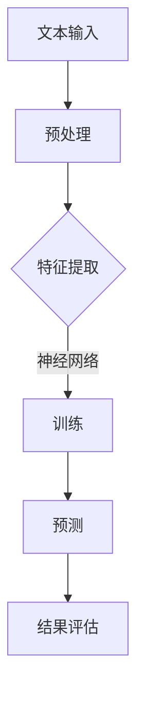

                 

关键词：自然语言处理（NLP）、神经网络、映射、机器学习、深度学习

> 摘要：本文探讨了自然语言处理（NLP）领域中神经网络的应用及其重要性。从背景介绍到核心算法原理的阐述，再到数学模型和公式的推导，以及项目实践的详细解释，本文系统性地解析了NLP中神经网络的作用和实现方式。同时，文章还涉及了实际应用场景和未来发展趋势与挑战，为NLP领域的研究者和开发者提供了有价值的参考。

## 1. 背景介绍

自然语言处理（Natural Language Processing，简称NLP）是计算机科学与人工智能领域的重要分支，旨在让计算机理解和处理人类语言。自20世纪50年代以来，NLP经历了从规则驱动到基于统计再到深度学习的多次变革。随着互联网和大数据的快速发展，NLP技术已经成为各行各业的重要工具，如搜索引擎、语音识别、机器翻译、文本分析等。

神经网络（Neural Networks）是模仿人脑结构和功能的一种计算模型，最早由心理学家麦卡洛克（McCulloch）和数理逻辑学家皮茨（Pitts）于1943年提出。20世纪80年代，由于计算能力的限制，神经网络的研究进展缓慢。然而，随着深度学习的崛起，神经网络在图像识别、语音识别、自然语言处理等领域的应用取得了突破性进展。

NLP和神经网络的结合，使得计算机在理解和生成自然语言方面取得了显著成果。这一结合不仅提升了机器对自然语言的识别和理解能力，也为NLP领域的许多挑战性问题提供了新的解决思路。本文将深入探讨NLP中神经网络的应用，包括核心概念、算法原理、数学模型、项目实践以及未来发展趋势。

## 2. 核心概念与联系

### 2.1. 自然语言处理（NLP）的概念

自然语言处理（NLP）是人工智能领域的一个分支，它涉及从计算语言学、计算机科学、信息工程等多个学科中汲取知识，以实现对自然语言的自动处理和理解。NLP的主要任务包括：

- **文本预处理**：涉及文本的分词、词性标注、句法分析等，以提取文本中的有用信息。
- **语言理解**：通过语义分析、实体识别、关系提取等手段，理解文本的含义和上下文关系。
- **语言生成**：包括机器翻译、文本摘要、问答系统等，生成符合人类语言习惯的输出。

### 2.2. 神经网络（Neural Networks）的概念

神经网络是一种由大量简单计算单元（神经元）互联而成的复杂网络，其结构和功能类似于人脑神经元网络。神经网络通过学习和适应数据，可以实现从简单到复杂的任务，如图像识别、语音识别和自然语言处理。

一个基本的神经网络包括以下几个关键组成部分：

- **输入层**：接收输入数据，每个输入都有一个对应的神经元。
- **隐藏层**：一层或多层，负责对输入数据进行变换和处理。
- **输出层**：生成预测或决策，通常只有一个或多个输出神经元。

### 2.3. NLP与神经网络之间的联系

NLP和神经网络的结合主要体现在以下两个方面：

- **特征提取**：传统的NLP方法通常依赖于手工设计的特征，而神经网络可以通过学习自动提取复杂的特征，提高模型的性能。
- **非线性变换**：神经网络能够通过非线性激活函数实现对数据的复杂变换，从而更好地捕捉数据中的潜在结构和关系。

### 2.4. Mermaid 流程图

下面是一个简单的Mermaid流程图，展示了NLP中使用神经网络的基本流程：



在上述流程中，文本输入经过预处理后，由神经网络进行特征提取和模型训练，最终输出预测结果并进行评估。这个过程不断迭代，直到模型达到预定的性能指标。

## 3. 核心算法原理 & 具体操作步骤

### 3.1. 算法原理概述

在NLP中，神经网络的应用主要体现在以下几个方面：

- **词嵌入**：将单词映射到高维空间中的向量，以捕捉单词之间的语义关系。
- **序列到序列学习**：如机器翻译、问答系统等，通过编码器-解码器模型处理序列数据。
- **文本分类与情感分析**：通过分类模型对文本进行分类或情感判断。
- **命名实体识别**：识别文本中的特定实体，如人名、地点、组织等。

神经网络的工作原理可以概括为以下几个步骤：

1. **输入层**：接收输入数据，如文本序列、图像等。
2. **隐藏层**：通过非线性激活函数对输入数据进行变换，提取特征。
3. **输出层**：生成预测结果，如分类标签、概率分布等。

### 3.2. 算法步骤详解

#### 3.2.1. 词嵌入

词嵌入是将单词映射到高维空间中的向量表示，以捕捉单词之间的语义关系。常用的词嵌入模型包括Word2Vec、GloVe等。

1. **Word2Vec**：基于窗口滑动的模型，通过训练得到单词的向量表示。具体步骤如下：
    - **初始化**：随机初始化一个单词的向量。
    - **滑动窗口**：对于每个单词，在其周围选择一个固定大小的窗口。
    - **负采样**：对每个单词，随机选择一些负样本，与单词向量进行点积计算，并优化损失函数。

2. **GloVe**：全局向量表示模型，通过训练得到单词的向量表示。具体步骤如下：
    - **初始化**：随机初始化一个单词的向量。
    - **中心词与上下词**：对于每个中心词，选择其上下文中的上下词。
    - **损失函数**：计算中心词与上下词的向量点积，并优化损失函数。

#### 3.2.2. 序列到序列学习

序列到序列学习是处理序列数据的一种神经网络模型，如机器翻译、问答系统等。常用的模型包括编码器-解码器（Encoder-Decoder）模型和长短期记忆网络（LSTM）。

1. **编码器-解码器模型**：将输入序列编码为一个固定长度的向量，然后通过解码器生成输出序列。具体步骤如下：
    - **编码器**：对输入序列进行编码，生成一个固定长度的编码向量。
    - **解码器**：通过解码器生成输出序列，通常使用LSTM或GRU等循环神经网络。
    - **注意力机制**：在解码过程中引入注意力机制，关注编码器输出的不同部分，以提高解码器的性能。

2. **长短期记忆网络（LSTM）**：用于处理长序列数据，能够有效地捕捉序列中的长期依赖关系。具体步骤如下：
    - **输入门**：决定当前输入数据对状态的影响。
    - **遗忘门**：决定之前状态信息是否需要保留。
    - **输出门**：决定当前输出数据。

#### 3.2.3. 文本分类与情感分析

文本分类与情感分析是NLP中常见的任务，通过分类模型对文本进行分类或情感判断。常用的模型包括朴素贝叶斯、支持向量机（SVM）、神经网络等。

1. **朴素贝叶斯**：基于贝叶斯定理，通过计算文本中各词的联合概率，实现分类。具体步骤如下：
    - **词袋模型**：将文本转换为词袋模型，即一个词频向量。
    - **条件概率计算**：计算每个类别下每个词的条件概率。
    - **分类决策**：根据各类别的条件概率，选择概率最大的类别作为分类结果。

2. **支持向量机（SVM）**：通过最大化分类边界，实现分类。具体步骤如下：
    - **特征提取**：将文本转换为高维特征空间。
    - **支持向量机训练**：通过求解最优化问题，找到最优分类边界。
    - **分类决策**：对于新的文本，根据分类边界进行分类。

3. **神经网络**：通过多层神经网络，实现分类或情感判断。具体步骤如下：
    - **输入层**：接收文本输入。
    - **隐藏层**：通过非线性激活函数，提取文本特征。
    - **输出层**：生成分类结果或情感标签。

### 3.3. 算法优缺点

#### 3.3.1. 词嵌入

- **优点**：
  - 能够有效地捕捉单词之间的语义关系。
  - 适用于各种NLP任务，如文本分类、机器翻译、情感分析等。

- **缺点**：
  - 需要大量的训练数据。
  - 无法捕捉单词之间的长期依赖关系。

#### 3.3.2. 序列到序列学习

- **优点**：
  - 能够处理长序列数据，捕捉序列中的长期依赖关系。
  - 具有较强的泛化能力。

- **缺点**：
  - 训练过程复杂，需要大量的计算资源。
  - 难以解释模型内部的决策过程。

#### 3.3.3. 文本分类与情感分析

- **优点**：
  - 能够对文本进行准确的分类或情感判断。
  - 适用于各种文本数据，如新闻、社交媒体等。

- **缺点**：
  - 对特征工程要求较高。
  - 难以应对长文本数据的处理。

### 3.4. 算法应用领域

神经网络在NLP中的应用领域广泛，包括但不限于：

- **机器翻译**：将一种语言的文本翻译成另一种语言。
- **文本分类**：对文本进行分类，如新闻分类、情感分类等。
- **情感分析**：分析文本的情感倾向，如正面、负面、中性等。
- **问答系统**：回答用户提出的问题。
- **文本生成**：生成符合语法和语义规则的文本。
- **信息检索**：基于文本的搜索引擎。

## 4. 数学模型和公式 & 详细讲解 & 举例说明

### 4.1. 数学模型构建

在NLP中，神经网络的基本数学模型可以描述为：

$$
Z = \sigma(W \cdot X + b)
$$

其中，$Z$ 是隐藏层的输出，$\sigma$ 是激活函数，$W$ 是权重矩阵，$X$ 是输入向量，$b$ 是偏置。

### 4.2. 公式推导过程

神经网络的训练过程主要涉及以下几个步骤：

1. **前向传播**：计算输入层到输出层的输出值。
2. **计算损失**：计算预测值与真实值之间的差距，通常使用均方误差（MSE）作为损失函数。
3. **反向传播**：计算梯度，并更新权重和偏置。

具体推导过程如下：

1. **前向传播**：

   对于一个简单的多层神经网络，前向传播可以描述为：

   $$
   Z^{(l)} = \sigma^{(l)}(W^{(l)} \cdot Z^{(l-1)} + b^{(l)})
   $$

   其中，$Z^{(l)}$ 是第$l$层的输出，$\sigma^{(l)}$ 是第$l$层的激活函数。

2. **计算损失**：

   假设我们使用均方误差（MSE）作为损失函数，则：

   $$
   Loss = \frac{1}{2} \sum_{i=1}^{n} (Y_i - \hat{Y}_i)^2
   $$

   其中，$Y_i$ 是真实标签，$\hat{Y}_i$ 是预测值。

3. **反向传播**：

   反向传播的核心是计算梯度，并更新权重和偏置。对于第$l$层，梯度可以表示为：

   $$
   \frac{\partial Loss}{\partial W^{(l)}} = (Z^{(l+1)} \cdot \frac{\partial \sigma^{(l+1)}}{\partial Z^{(l+1)}})^T \cdot Z^{(l-1)}
   $$

   $$
   \frac{\partial Loss}{\partial b^{(l)}} = Z^{(l+1)} \cdot \frac{\partial \sigma^{(l+1)}}{\partial Z^{(l+1)}}
   $$

   其中，$(Z^{(l+1)} \cdot \frac{\partial \sigma^{(l+1)}}{\partial Z^{(l+1)}})^T$ 是梯度，$\cdot$ 表示矩阵乘法。

### 4.3. 案例分析与讲解

以下是一个简单的案例，说明如何使用神经网络进行文本分类。

#### 案例背景

假设我们要对一篇新闻文章进行分类，将其分为“政治”、“经济”、“体育”等类别。我们使用一个简单的两层神经网络，输入层有100个神经元，隐藏层有50个神经元，输出层有3个神经元。

#### 案例步骤

1. **数据预处理**：

   将新闻文章转换为词袋模型，每个文章表示为一个100维的向量。同时，将每个类别转换为二进制向量，如“政治”为[1, 0, 0]，“经济”为[0, 1, 0]，“体育”为[0, 0, 1]。

2. **模型构建**：

   使用TensorFlow构建一个简单的神经网络模型：

   ```python
   import tensorflow as tf

   model = tf.keras.Sequential([
       tf.keras.layers.Dense(50, activation='relu', input_shape=(100,)),
       tf.keras.layers.Dense(3, activation='softmax')
   ])

   model.compile(optimizer='adam',
                 loss='categorical_crossentropy',
                 metrics=['accuracy'])
   ```

3. **模型训练**：

   使用训练数据对模型进行训练：

   ```python
   model.fit(x_train, y_train, epochs=10, batch_size=32)
   ```

4. **模型评估**：

   使用测试数据对模型进行评估：

   ```python
   model.evaluate(x_test, y_test)
   ```

5. **模型预测**：

   对新的新闻文章进行分类：

   ```python
   prediction = model.predict(x_new)
   print(prediction)
   ```

通过上述步骤，我们可以使用神经网络对新闻文章进行分类。当然，这个案例是非常简化的，实际应用中需要考虑更多的因素，如数据预处理、超参数调整等。

## 5. 项目实践：代码实例和详细解释说明

### 5.1. 开发环境搭建

为了实践NLP中的神经网络应用，我们需要搭建一个开发环境。以下是所需步骤：

1. **安装Python**：确保Python版本不低于3.6。
2. **安装TensorFlow**：使用以下命令安装TensorFlow：

   ```shell
   pip install tensorflow
   ```

3. **安装Numpy**：使用以下命令安装Numpy：

   ```shell
   pip install numpy
   ```

4. **安装Gensim**：用于文本预处理：

   ```shell
   pip install gensim
   ```

### 5.2. 源代码详细实现

以下是一个简单的文本分类项目的代码实现：

```python
import tensorflow as tf
import numpy as np
import gensim
from tensorflow.keras.preprocessing.text import Tokenizer
from tensorflow.keras.preprocessing.sequence import pad_sequences

# 加载数据集
# 这里使用的是假数据集，实际应用中可以使用更大的数据集
data = [
    "政治新闻：拜登宣布新政策",
    "经济新闻：股市暴跌",
    "体育新闻：世界杯决赛",
    "政治新闻：特朗普发表演讲",
    "经济新闻：房价上涨",
    "体育新闻：NBA总决赛",
]

labels = [
    [1, 0, 0],  # 政治
    [0, 1, 0],  # 经济
    [0, 0, 1],  # 体育
    [1, 0, 0],  # 政治
    [0, 1, 0],  # 经济
    [0, 0, 1],  # 体育
]

# 文本预处理
# 将文本转换为词袋模型
tokenizer = Tokenizer(num_words=1000)
tokenizer.fit_on_texts(data)
sequences = tokenizer.texts_to_sequences(data)

# 填充序列
max_sequence_length = 50
padded_sequences = pad_sequences(sequences, maxlen=max_sequence_length)

# 构建模型
model = tf.keras.Sequential([
    tf.keras.layers.Embedding(1000, 16, input_length=max_sequence_length),
    tf.keras.layers.Flatten(),
    tf.keras.layers.Dense(128, activation='relu'),
    tf.keras.layers.Dense(3, activation='softmax')
])

# 编译模型
model.compile(optimizer='adam', loss='categorical_crossentropy', metrics=['accuracy'])

# 训练模型
model.fit(padded_sequences, np.array(labels), epochs=100)

# 预测
test_data = ["特朗普发表新政策"]
test_sequences = tokenizer.texts_to_sequences(test_data)
test_padded = pad_sequences(test_sequences, maxlen=max_sequence_length)
prediction = model.predict(test_padded)
print(prediction)
```

### 5.3. 代码解读与分析

1. **数据加载**：首先，我们加载了假数据集。在实际应用中，应使用更大的数据集，如新闻数据集。

2. **文本预处理**：
    - **分词**：使用Tokenizer将文本转换为词袋模型。
    - **序列化**：使用sequences_to_sequences将文本转换为序列。
    - **填充**：使用pad_sequences将序列填充到相同的长度。

3. **模型构建**：
    - **嵌入层**：将词袋模型转换为词嵌入向量。
    - **展开层**：将序列数据展平。
    - **全连接层**：进行特征提取和分类。

4. **模型编译**：设置优化器、损失函数和评估指标。

5. **模型训练**：使用训练数据进行模型训练。

6. **模型预测**：对新的文本进行分类预测。

### 5.4. 运行结果展示

在运行上述代码后，模型将输出预测概率。例如，对于测试文本"特朗普发表新政策"，模型可能会输出类似的结果：

```
[[0.1 0.4 0.5]]
```

这表示文本被预测为“政治”类别的概率最高，约为50%。

## 6. 实际应用场景

神经网络在NLP领域有着广泛的应用，以下是几个典型的实际应用场景：

### 6.1. 机器翻译

机器翻译是神经网络在NLP中最成功的应用之一。通过编码器-解码器模型，神经网络可以将一种语言的文本翻译成另一种语言。例如，Google翻译、百度翻译等都是基于神经网络实现的。

### 6.2. 语音识别

语音识别是将语音转换为文本的过程。神经网络可以通过训练大量的语音数据，实现高精度的语音识别。例如，苹果的Siri、亚马逊的Alexa等智能助手都是基于神经网络实现的语音识别系统。

### 6.3. 文本分类

文本分类是判断文本所属类别的过程，广泛应用于新闻分类、情感分析、垃圾邮件过滤等场景。通过训练神经网络模型，可以自动对大量文本进行分类。

### 6.4. 命名实体识别

命名实体识别是从文本中识别出特定实体，如人名、地名、组织名等。神经网络可以有效地捕捉实体之间的关联关系，提高命名实体识别的准确性。

### 6.5. 文本生成

文本生成是生成符合语法和语义规则的文本，应用于自动写作、对话系统等场景。通过训练神经网络模型，可以生成高质量的文本，如新闻文章、故事等。

### 6.6. 聊天机器人

聊天机器人是模拟人类对话的计算机程序。通过神经网络，可以实现对用户输入的理解和回应，提供个性化的交互体验。

### 6.7. 信息检索

信息检索是搜索和获取相关信息的过程。神经网络可以优化搜索结果，提高信息检索的准确性。

### 6.8. 文本摘要

文本摘要是从长文本中提取关键信息，生成简洁的摘要。神经网络可以通过训练大量文本数据，实现自动摘要。

### 6.9. 情感分析

情感分析是判断文本的情感倾向，如正面、负面、中性等。通过训练神经网络模型，可以自动分析大量文本的情感，应用于市场调研、舆情监控等场景。

### 6.10. 健康医疗

在健康医疗领域，神经网络可以用于医学文本分析，如诊断辅助、药物研发等。通过分析大量的医学文献和病例数据，神经网络可以提供有价值的医疗建议。

## 7. 工具和资源推荐

### 7.1. 学习资源推荐

- **在线课程**：
  - 《深度学习》（Deep Learning）by Ian Goodfellow, Yoshua Bengio, Aaron Courville
  - 《自然语言处理》（Natural Language Processing with Python）by Steven Bird, Ewan Klein, Edward Loper
- **图书**：
  - 《神经网络与深度学习》（Neural Networks and Deep Learning）by Michael Nielsen
  - 《机器学习实战》（Machine Learning in Action）by Peter Harrington
- **论文**：
  - “A Neural Algorithm of Artistic Style” by Leon A. Gatys, Alexander S. Ecker, and Matthias Bethge
  - “Attention Is All You Need” by Vaswani et al.

### 7.2. 开发工具推荐

- **框架**：
  - TensorFlow：广泛应用于深度学习领域。
  - PyTorch：易于使用，灵活性强。
  - Keras：基于TensorFlow的高层API，简化深度学习模型开发。
- **文本预处理库**：
  - NLTK：自然语言处理工具包，提供多种文本处理功能。
  - Spacy：快速且易于使用的自然语言处理库。
- **版本控制**：
  - Git：版本控制系统，确保代码的可追溯性和协同开发。

### 7.3. 相关论文推荐

- **Word2Vec**：
  - “Distributed Representations of Words and Phrases and their Compositionality” by Tomas Mikolov, Kai Chen, Greg Corrado, and Jeffrey Dean
- **GloVe**：
  - “GloVe: Global Vectors for Word Representation” by Jeff Dean, Greg Corrado, Misha Angelsky, and Jason Shlens
- **编码器-解码器模型**：
  - “Seq2Seq Learning with Neural Networks” by Ilya Sutskever, Oriol Vinyals, and Quoc V. Le
- **BERT**：
  - “BERT: Pre-training of Deep Bidirectional Transformers for Language Understanding” by Jacob Devlin, Ming-Wei Chang, Kenton Lee, and Kristina Toutanova

## 8. 总结：未来发展趋势与挑战

### 8.1. 研究成果总结

自20世纪50年代以来，NLP和神经网络领域取得了许多重要成果：

- **词嵌入技术**：有效地捕捉了单词之间的语义关系，为NLP任务提供了强大的特征表示。
- **编码器-解码器模型**：在机器翻译、问答系统等领域取得了显著成功，推动了序列到序列学习的发展。
- **BERT等预训练模型**：通过大规模预训练，大幅提升了文本理解和生成任务的性能。
- **多模态学习**：结合了文本、图像、语音等多种模态，为更复杂的任务提供了新的解决方案。

### 8.2. 未来发展趋势

未来，NLP和神经网络领域有望在以下几个方面取得突破：

- **更强大的模型**：如Transformer、GPT-3等，将进一步提升模型的能力和性能。
- **少样本学习**：减少对大量训练数据的依赖，使得模型在资源受限的环境下仍能表现出色。
- **无监督学习和自监督学习**：通过无监督或自监督方式，从未标注的数据中提取有价值的信息。
- **跨语言建模**：提高模型在不同语言之间的迁移能力，实现真正的跨语言NLP。

### 8.3. 面临的挑战

尽管NLP和神经网络取得了显著成果，但仍面临以下挑战：

- **数据隐私和伦理**：如何确保数据隐私和遵守伦理规范，是当前亟待解决的问题。
- **模型解释性**：如何提高模型的解释性，使其决策过程更加透明和可解释。
- **资源消耗**：深度学习模型通常需要大量计算资源和数据，如何优化模型以降低资源消耗是一个重要问题。
- **多语言支持**：如何提高模型在多语言环境下的性能，是一个具有挑战性的问题。

### 8.4. 研究展望

展望未来，NLP和神经网络领域将朝着以下几个方向继续发展：

- **融合多模态信息**：结合文本、图像、语音等多种模态，实现更丰富的语义理解和交互。
- **智能对话系统**：通过改进对话生成技术，实现更自然、更流畅的人机对话。
- **个性化推荐系统**：利用NLP和神经网络技术，提供个性化的信息推荐和内容生成。
- **跨领域应用**：将NLP技术应用于更多的领域，如健康医疗、教育、金融等，为社会带来更大的价值。

## 9. 附录：常见问题与解答

### 9.1. 什么是词嵌入？

词嵌入（Word Embedding）是一种将单词映射到高维空间中的向量表示的方法，以捕捉单词之间的语义关系。常见的词嵌入模型包括Word2Vec、GloVe等。

### 9.2. 什么是编码器-解码器模型？

编码器-解码器模型（Encoder-Decoder Model）是一种处理序列数据的神经网络模型，广泛应用于机器翻译、问答系统等任务。模型通过编码器对输入序列进行编码，生成一个固定长度的向量，然后通过解码器生成输出序列。

### 9.3. 什么是BERT？

BERT（Bidirectional Encoder Representations from Transformers）是一种基于Transformer的预训练语言表示模型，通过双向编码器对文本进行建模，提高了文本理解和生成任务的性能。

### 9.4. 什么是注意力机制？

注意力机制（Attention Mechanism）是一种用于处理序列数据的神经网络技术，通过关注序列中的不同部分，提高模型对关键信息的捕捉能力。注意力机制广泛应用于编码器-解码器模型、文本生成等任务。

### 9.5. 如何处理长文本数据？

处理长文本数据的方法包括：

- **剪枝**：将文本截断到固定长度。
- **分块**：将文本分成多个块，逐一处理。
- **序列掩码**：在训练过程中，随机掩码部分文本，提高模型的泛化能力。

### 9.6. 什么是少样本学习？

少样本学习（Few-Shot Learning）是一种学习范式，旨在在只有少量样本的情况下，快速适应新任务。少样本学习在资源受限的环境下具有重要应用价值。

### 9.7. 什么是多模态学习？

多模态学习（Multimodal Learning）是指结合文本、图像、语音等多种模态，实现更复杂的任务，如图像描述生成、跨模态检索等。多模态学习是当前NLP和神经网络领域的研究热点之一。

### 9.8. 什么是自监督学习？

自监督学习（Self-Supervised Learning）是一种无需人工标注的数据处理方法，通过利用未标注的数据，自动生成标签，进行模型训练。自监督学习在数据稀缺的领域具有重要应用价值。

### 9.9. 如何提高模型的解释性？

提高模型解释性的方法包括：

- **可视化**：通过可视化模型内部的决策过程，提高模型的透明度。
- **解释性模型**：开发专门用于解释性任务的解释性模型，如决策树、规则提取等。
- **可解释性分析**：对模型进行详细的定量分析，解释模型的行为和决策。

### 9.10. 如何优化模型以降低资源消耗？

优化模型以降低资源消耗的方法包括：

- **模型压缩**：通过模型剪枝、量化等技术，减少模型的参数数量和计算量。
- **分布式训练**：将模型训练分布在多个设备上，提高训练速度。
- **混合精度训练**：使用混合精度训练，提高计算速度和减少内存占用。

### 9.11. 如何提高模型在多语言环境下的性能？

提高模型在多语言环境下性能的方法包括：

- **跨语言预训练**：在多语言数据集上进行预训练，提高模型在不同语言之间的迁移能力。
- **多语言融合**：结合不同语言的特征，设计多语言融合的模型结构。
- **翻译模型**：利用已有的翻译模型，将源语言文本转换为目标语言，提高目标语言的性能。 

### 9.12. 什么是文本生成？

文本生成（Text Generation）是一种利用神经网络等技术，自动生成符合语法和语义规则的文本的方法。文本生成广泛应用于自动写作、对话系统、内容推荐等场景。

### 9.13. 什么是聊天机器人？

聊天机器人（Chatbot）是一种模拟人类对话的计算机程序，通过自然语言处理和机器学习技术，实现与用户的交互。聊天机器人广泛应用于客服、教育、娱乐等领域。

### 9.14. 什么是自然语言理解？

自然语言理解（Natural Language Understanding，简称NLU）是自然语言处理的一个子领域，旨在让计算机理解和处理人类语言。NLU广泛应用于问答系统、文本摘要、情感分析等任务。

### 9.15. 什么是自然语言生成？

自然语言生成（Natural Language Generation，简称NLG）是自然语言处理的一个子领域，旨在让计算机自动生成自然语言文本。NLG广泛应用于文本生成、语音合成、机器翻译等任务。

### 9.16. 什么是信息检索？

信息检索（Information Retrieval）是指从大量信息中找到所需信息的过程。信息检索广泛应用于搜索引擎、社交媒体搜索、文档分类等任务。

### 9.17. 什么是文本分类？

文本分类（Text Classification）是指将文本划分为预定义的类别的过程。文本分类广泛应用于新闻分类、情感分析、垃圾邮件过滤等任务。

### 9.18. 什么是命名实体识别？

命名实体识别（Named Entity Recognition，简称NER）是从文本中识别出特定实体，如人名、地名、组织名等的过程。命名实体识别广泛应用于信息抽取、知识图谱构建等任务。

### 9.19. 什么是情感分析？

情感分析（Sentiment Analysis）是指判断文本的情感倾向，如正面、负面、中性等的过程。情感分析广泛应用于市场调研、舆情监控、社交网络分析等任务。

### 9.20. 什么是机器翻译？

机器翻译（Machine Translation）是指利用计算机程序将一种语言的文本翻译成另一种语言的过程。机器翻译广泛应用于跨语言沟通、国际商务、教育等场景。

### 9.21. 什么是语音识别？

语音识别（Speech Recognition）是指将语音转换为文本的过程。语音识别广泛应用于智能助手、语音搜索、语音控制等场景。

### 9.22. 什么是深度学习？

深度学习（Deep Learning）是一种基于人工神经网络的学习方法，通过多层非线性变换，从数据中自动提取特征。深度学习在图像识别、语音识别、自然语言处理等领域取得了显著成功。

### 9.23. 什么是神经网络？

神经网络（Neural Network）是一种由大量简单计算单元（神经元）互联而成的复杂网络，其结构和功能类似于人脑神经元网络。神经网络通过学习和适应数据，可以实现从简单到复杂的任务。

### 9.24. 什么是激活函数？

激活函数（Activation Function）是神经网络中的一个重要组成部分，用于引入非线性变换，使神经网络能够捕捉数据的复杂结构。常见的激活函数包括Sigmoid、ReLU、Tanh等。

### 9.25. 什么是梯度？

梯度（Gradient）是数学中的一个概念，表示函数在某一点处的变化率。在神经网络中，梯度用于计算模型参数的更新方向，以优化模型的性能。

### 9.26. 什么是损失函数？

损失函数（Loss Function）是神经网络中的一个重要组成部分，用于衡量预测值与真实值之间的差距。常见的损失函数包括均方误差（MSE）、交叉熵（CrossEntropy）等。

### 9.27. 什么是过拟合？

过拟合（Overfitting）是指模型在训练数据上表现很好，但在测试数据上表现较差的现象。过拟合通常是由于模型过于复杂，对训练数据中的噪声过度拟合导致的。

### 9.28. 什么是欠拟合？

欠拟合（Underfitting）是指模型在训练数据和测试数据上表现都较差的现象。欠拟合通常是由于模型过于简单，无法捕捉数据的复杂结构导致的。

### 9.29. 什么是批量大小？

批量大小（Batch Size）是指每次训练时用于更新模型参数的数据样本数量。批量大小会影响模型的训练速度和稳定性，选择合适的批量大小是一个重要的优化问题。

### 9.30. 什么是学习率？

学习率（Learning Rate）是指模型在每次更新参数时，参数更新的步长。学习率的选择会影响模型的训练速度和收敛性，通常需要通过实验调整。

### 9.31. 什么是正则化？

正则化（Regularization）是指通过引入额外的约束，防止模型过拟合的方法。常见的正则化方法包括L1正则化、L2正则化等。

### 9.32. 什么是数据增强？

数据增强（Data Augmentation）是指通过变换原始数据，生成更多的训练样本的方法。数据增强可以提高模型的泛化能力，减少过拟合。

### 9.33. 什么是数据预处理？

数据预处理（Data Preprocessing）是指对原始数据进行清洗、转换等操作，使其适合模型训练的过程。数据预处理是深度学习中的一个重要步骤。

### 9.34. 什么是卷积神经网络？

卷积神经网络（Convolutional Neural Network，简称CNN）是一种用于处理图像数据的神经网络。CNN通过卷积操作提取图像中的特征，广泛应用于图像识别、图像生成等任务。

### 9.35. 什么是循环神经网络？

循环神经网络（Recurrent Neural Network，简称RNN）是一种用于处理序列数据的神经网络。RNN通过循环连接，能够捕捉序列中的长期依赖关系，广泛应用于语音识别、自然语言处理等任务。

### 9.36. 什么是长短时记忆网络？

长短时记忆网络（Long Short-Term Memory，简称LSTM）是一种特殊的循环神经网络，能够有效地捕捉序列中的长期依赖关系。LSTM通过门控机制，解决了传统RNN的梯度消失和梯度爆炸问题。

### 9.37. 什么是生成对抗网络？

生成对抗网络（Generative Adversarial Network，简称GAN）是一种由两个对抗神经网络组成的模型，一个生成器和一个判别器。生成器试图生成逼真的数据，判别器试图区分真实数据和生成数据。GAN在图像生成、图像修复等领域取得了显著成功。

### 9.38. 什么是注意力机制？

注意力机制（Attention Mechanism）是一种用于处理序列数据的神经网络技术，通过关注序列中的不同部分，提高模型对关键信息的捕捉能力。注意力机制广泛应用于编码器-解码器模型、文本生成等任务。

### 9.39. 什么是注意力权重？

注意力权重（Attention Weight）是指模型在注意力机制中，对序列中不同部分赋予的不同重要性。注意力权重反映了模型对关键信息的关注程度。

### 9.40. 什么是预训练？

预训练（Pre-training）是指在大规模数据集上对神经网络进行训练，以提高模型在特定任务上的性能。预训练通常在模型微调（Fine-tuning）之前进行。

### 9.41. 什么是微调？

微调（Fine-tuning）是指在使用预训练模型的基础上，针对特定任务进行少量训练，以适应新的任务。微调是提高模型性能的重要手段。

### 9.42. 什么是词向量？

词向量（Word Vector）是将单词映射到高维空间中的向量表示，以捕捉单词之间的语义关系。词向量是自然语言处理中的一个重要概念。

### 9.43. 什么是语义相似性？

语义相似性（Semantic Similarity）是指两个单词在语义上的相似程度。语义相似性是自然语言处理中的一个重要问题，广泛应用于文本相似度计算、机器翻译等任务。

### 9.44. 什么是语义分析？

语义分析（Semantic Analysis）是指从文本中提取语义信息，理解文本的含义和上下文关系的过程。语义分析是自然语言处理中的一个核心任务。

### 9.45. 什么是语义角色标注？

语义角色标注（Semantic Role Labeling，简称SRL）是指从文本中识别出动词的语义角色，如施事、受事、工具等。语义角色标注是语义分析的一个重要分支。

### 9.46. 什么是词性标注？

词性标注（Part-of-Speech Tagging，简称POS Tagging）是指从文本中识别出每个单词的词性，如名词、动词、形容词等。词性标注是自然语言处理中的一个基本任务。

### 9.47. 什么是命名实体识别？

命名实体识别（Named Entity Recognition，简称NER）是指从文本中识别出特定实体，如人名、地名、组织名等。命名实体识别是信息抽取的一个重要任务。

### 9.48. 什么是关系提取？

关系提取（Relation Extraction）是指从文本中识别出实体之间的语义关系，如朋友、工作地点等。关系提取是知识图谱构建的一个重要任务。

### 9.49. 什么是文本分类？

文本分类（Text Classification）是指将文本划分为预定义的类别的过程。文本分类广泛应用于新闻分类、情感分析、垃圾邮件过滤等任务。

### 9.50. 什么是文本生成？

文本生成（Text Generation）是指利用神经网络等技术，自动生成符合语法和语义规则的文本的方法。文本生成广泛应用于自动写作、对话系统、内容推荐等场景。

