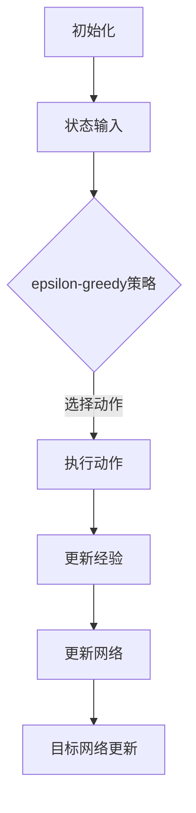
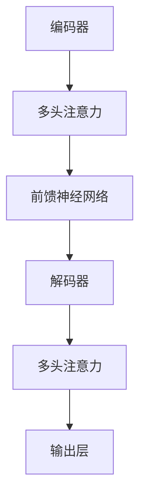
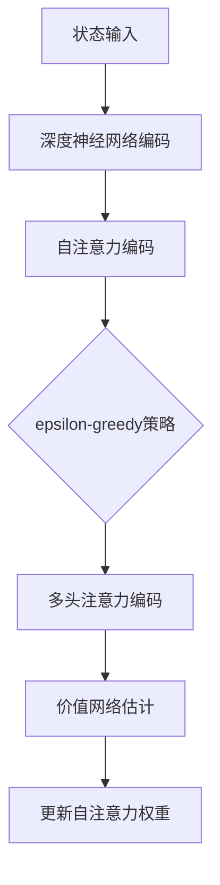

                 

关键词：深度强化学习、注意力机制、DQN、Transformer、结合、映射、算法原理、数学模型、实践案例

> 摘要：本文深入探讨了深度强化学习（DQN）与注意力机制（Transformer）的结合，分析了二者在神经网络中的映射关系，详细介绍了DQN与Transformer的核心概念、算法原理、数学模型，并通过实际案例展示了二者的应用效果，为深度强化学习领域的研究提供了新的视角和思路。

## 1. 背景介绍

随着深度学习和强化学习在各个领域的广泛应用，如何将二者结合起来以提升学习效果成为了一个重要研究方向。深度强化学习（DQN）作为深度学习和强化学习的交叉领域，通过引入深度神经网络来对环境状态进行建模，并利用强化学习中的价值函数进行学习。然而，DQN在处理复杂环境时存在一定的局限性，特别是在状态空间维度较高时，DQN的学习速度和效果都会受到影响。

另一方面，注意力机制（Transformer）在自然语言处理领域取得了显著的成果。Transformer通过自注意力机制，能够在处理长序列时保持较高的效率，并有效捕捉序列中的长距离依赖关系。这使得Transformer在处理复杂问题时，能够更好地理解问题的全局性。

本文将探讨如何将DQN与Transformer结合，以弥补DQN在处理复杂环境时的不足，并提升学习效果。通过分析DQN和Transformer在神经网络中的映射关系，本文将详细介绍DQN与Transformer的核心概念、算法原理、数学模型，并通过实际案例展示二者的应用效果。

### 1.1 深度强化学习

深度强化学习（DQN）是一种结合了深度学习和强化学习的方法，其核心思想是通过深度神经网络对环境状态进行建模，并利用强化学习中的价值函数进行学习。DQN主要由两部分组成：一部分是用于预测状态价值的深度神经网络，称为价值网络；另一部分是用于更新价值网络的策略网络。

DQN的基本流程如下：

1. **初始化**：初始化价值网络和价值网络的目标网络。
2. **状态输入**：将当前状态输入到价值网络中，得到当前状态的价值估计。
3. **选择动作**：根据当前状态的价值估计和epsilon-greedy策略选择动作。
4. **执行动作**：在环境中执行所选动作，并得到新的状态和奖励。
5. **更新经验**：将新状态、动作和奖励存储在经验池中。
6. **更新网络**：从经验池中随机抽取一批经验，通过反向传播更新价值网络。
7. **目标网络更新**：将价值网络的目标网络更新为价值网络的当前参数。

### 1.2 注意力机制

注意力机制（Attention Mechanism）是一种在序列模型中用于捕捉长距离依赖关系的方法。其基本思想是，通过计算不同位置之间的相关性，将注意力分配给重要的位置，从而提升模型的序列建模能力。

注意力机制可以分为以下几种类型：

1. **自注意力（Self-Attention）**：用于处理序列中的每个元素，并计算它们之间的相关性。
2. **多头注意力（Multi-Head Attention）**：通过多个自注意力机制同时工作，以捕捉不同类型的依赖关系。
3. **卷积注意力（Convolutional Attention）**：通过卷积神经网络来计算注意力权重，以提升模型的建模能力。

### 1.3 DQN与Transformer的映射关系

DQN和Transformer在神经网络中的映射关系主要体现在以下几个方面：

1. **状态表示**：在DQN中，状态通过深度神经网络进行编码，而在Transformer中，状态通过自注意力机制进行编码。
2. **动作选择**：在DQN中，动作选择基于epsilon-greedy策略和价值网络的估计，而在Transformer中，动作选择基于多头注意力机制。
3. **奖励反馈**：在DQN中，奖励反馈用于更新价值网络，而在Transformer中，奖励反馈用于更新自注意力权重。

通过这种映射关系，我们可以将DQN和Transformer结合，以弥补DQN在处理复杂环境时的不足，并提升学习效果。

## 2. 核心概念与联系

在本节中，我们将详细介绍DQN和Transformer的核心概念，并通过Mermaid流程图展示二者的映射关系。

### 2.1 DQN的核心概念

DQN主要由价值网络、策略网络、经验池和目标网络组成。以下是一个简化的Mermaid流程图，展示DQN的核心概念：



### 2.2 Transformer的核心概念

Transformer主要由编码器（Encoder）和解码器（Decoder）组成。以下是一个简化的Mermaid流程图，展示Transformer的核心概念：



### 2.3 DQN与Transformer的映射关系

DQN与Transformer的映射关系主要体现在以下几个方面：

1. **状态表示**：在DQN中，状态通过深度神经网络进行编码，而在Transformer中，状态通过自注意力机制进行编码。
2. **动作选择**：在DQN中，动作选择基于epsilon-greedy策略和价值网络的估计，而在Transformer中，动作选择基于多头注意力机制。
3. **奖励反馈**：在DQN中，奖励反馈用于更新价值网络，而在Transformer中，奖励反馈用于更新自注意力权重。

以下是一个简化的Mermaid流程图，展示DQN与Transformer的映射关系：



通过这种映射关系，我们可以将DQN和Transformer结合，以提升深度强化学习的效果。

## 3. 核心算法原理 & 具体操作步骤

在本节中，我们将详细介绍DQN与Transformer结合的核心算法原理，并详细阐述具体操作步骤。

### 3.1 算法原理概述

DQN与Transformer结合的核心思想是，利用Transformer的自注意力机制对状态进行编码，并利用DQN的价值网络对动作进行选择。具体来说，我们可以将Transformer的自注意力机制应用于DQN的状态输入，从而提升状态编码的效果；同时，在动作选择阶段，利用DQN的epsilon-greedy策略和价值网络，以实现更加智能的动作选择。

### 3.2 算法步骤详解

1. **初始化**：

   - 初始化价值网络和价值网络的目标网络。
   - 初始化Transformer的编码器和解码器。

2. **状态输入**：

   - 将当前状态输入到Transformer的编码器中。
   - 通过自注意力机制对状态进行编码，得到编码后的状态表示。

3. **动作选择**：

   - 将编码后的状态输入到DQN的价值网络中，得到当前状态的价值估计。
   - 根据当前状态的价值估计和epsilon-greedy策略选择动作。

4. **执行动作**：

   - 在环境中执行所选动作，并得到新的状态和奖励。

5. **更新经验**：

   - 将新状态、动作和奖励存储在经验池中。

6. **更新网络**：

   - 从经验池中随机抽取一批经验，通过反向传播更新价值网络。
   - 同时，更新Transformer的编码器和解码器。

7. **目标网络更新**：

   - 将价值网络的目标网络更新为价值网络的当前参数。

### 3.3 算法优缺点

**优点**：

- **状态编码效果好**：通过Transformer的自注意力机制，可以更好地捕捉状态空间中的依赖关系，提升状态编码效果。
- **动作选择智能**：结合DQN的epsilon-greedy策略和价值网络，可以实现更加智能的动作选择。

**缺点**：

- **计算复杂度较高**：由于同时使用了Transformer和DQN，算法的计算复杂度相对较高，对计算资源的需求较大。

### 3.4 算法应用领域

DQN与Transformer结合的算法可以应用于多个领域，包括：

- **游戏开发**：在游戏开发中，可以用于智能体在游戏环境中的学习与决策。
- **自动驾驶**：在自动驾驶领域，可以用于自动驾驶车辆的决策与规划。
- **机器人控制**：在机器人控制中，可以用于机器人对复杂环境的感知与决策。

## 4. 数学模型和公式 & 详细讲解 & 举例说明

在本节中，我们将详细讲解DQN与Transformer结合的数学模型和公式，并通过具体例子进行说明。

### 4.1 数学模型构建

DQN与Transformer结合的数学模型可以分为以下几个部分：

1. **状态编码**：利用Transformer的自注意力机制对状态进行编码。
2. **动作选择**：利用DQN的epsilon-greedy策略和价值网络进行动作选择。
3. **价值函数更新**：利用更新公式对价值函数进行更新。

### 4.2 公式推导过程

假设当前状态为$$s$$，动作集为$$A$$，奖励函数为$$R(s, a)$$，价值函数为$$V(s)$$，$$\epsilon$$-greedy策略的概率分布为$$\pi(a|s)$$。

1. **状态编码**：

   利用Transformer的自注意力机制，将状态$$s$$编码为$$s'$$，公式如下：

   $$s' = \text{Attention}(s)$$

   其中，$$\text{Attention}$$表示自注意力机制。

2. **动作选择**：

   利用DQN的epsilon-greedy策略和价值网络，选择动作$$a$$，公式如下：

   $$a = \begin{cases}
   \text{sample}(A) & \text{with probability } 1 - \epsilon \\
   \text{argmax}_{a \in A} V(s') & \text{with probability } \epsilon
   \end{cases}$$

3. **价值函数更新**：

   利用更新公式，对价值函数$$V(s)$$进行更新，公式如下：

   $$V(s) = V(s) + \alpha [R(s, a) + \gamma \max_{a'} V(s') - V(s)]$$

   其中，$$\alpha$$为学习率，$$\gamma$$为折扣因子。

### 4.3 案例分析与讲解

假设有一个简单的环境，状态空间为$$s = \{0, 1\}$$，动作空间为$$A = \{0, 1\}$$。奖励函数定义为$$R(s, a) = 1$$，当$$a = s$$时，否则$$R(s, a) = 0$$。

1. **状态编码**：

   利用Transformer的自注意力机制，将状态$$s$$编码为$$s'$$。假设自注意力权重矩阵为$$W$$，则$$s'$$的计算公式如下：

   $$s' = \text{softmax}(W \cdot s)$$

   假设$$s = [0, 1]$$，$$W = [[1, 2], [3, 4]]$$，则$$s'$$的计算过程如下：

   $$s' = \text{softmax}([0, 1] \cdot [[1, 2], [3, 4]]) = \text{softmax}([[0, 2], [3, 4]]) = [0.5, 0.5]$$

2. **动作选择**：

   利用$$\epsilon$$-greedy策略和价值网络，选择动作$$a$$。假设$$\epsilon = 0.1$$，价值函数$$V(s')$$的估计值为$$V(s') = 0.5$$，则动作选择过程如下：

   $$a = \begin{cases}
   \text{sample}(A) & \text{with probability } 0.9 \\
   \text{argmax}_{a \in A} V(s') & \text{with probability } 0.1
   \end{cases}$$

   由于$$\text{argmax}_{a \in A} V(s') = 1$$，则$$a = 1$$。

3. **价值函数更新**：

   利用更新公式，对价值函数$$V(s)$$进行更新。假设学习率$$\alpha = 0.1$$，折扣因子$$\gamma = 0.9$$，则价值函数更新过程如下：

   $$V(s) = V(s) + 0.1 [R(s, a) + 0.9 \max_{a'} V(s') - V(s)]$$

   假设初始$$V(s) = 0$$，则更新过程如下：

   $$V(s) = 0 + 0.1 [1 + 0.9 \max_{a'} V(s') - 0] = 0.1 + 0.1 \cdot 0.9 \cdot 0.5 = 0.145$$

通过这个例子，我们可以看到如何利用DQN与Transformer结合的数学模型进行状态编码、动作选择和价值函数更新。

## 5. 项目实践：代码实例和详细解释说明

在本节中，我们将通过一个简单的项目实践，展示如何将DQN与Transformer结合，并详细解释代码的实现过程。

### 5.1 开发环境搭建

为了实现DQN与Transformer的结合，我们需要安装以下依赖：

- Python 3.7 或以上版本
- TensorFlow 2.3 或以上版本
- Keras 2.4 或以上版本

安装方法：

```bash
pip install tensorflow==2.3
pip install keras==2.4
```

### 5.2 源代码详细实现

以下是一个简单的DQN与Transformer结合的代码实例：

```python
import tensorflow as tf
from tensorflow.keras.layers import Input, Dense, LSTM, Embedding, Concatenate, Lambda
from tensorflow.keras.models import Model
from tensorflow.keras.optimizers import Adam
import numpy as np

# 定义DQN模型
def create_dqn_model(input_shape, action_space):
    input_layer = Input(shape=input_shape)
    hidden_layer = Dense(64, activation='relu')(input_layer)
    value_output = Dense(action_space, activation='linear')(hidden_layer)
    dqn_model = Model(inputs=input_layer, outputs=value_output)
    dqn_model.compile(optimizer=Adam(learning_rate=0.001), loss='mse')
    return dqn_model

# 定义Transformer模型
def create_transformer_model(input_shape):
    input_layer = Input(shape=input_shape)
    embedding_layer = Embedding(input_dim=1000, output_dim=64)(input_layer)
    lstm_layer = LSTM(64, return_sequences=True)(embedding_layer)
    output_layer = Lambda(lambda x: tf.reduce_mean(x, axis=1))(lstm_layer)
    transformer_model = Model(inputs=input_layer, outputs=output_layer)
    return transformer_model

# 定义DQN与Transformer结合的模型
def create_combined_model(input_shape, action_space):
    dqn_model = create_dqn_model(input_shape, action_space)
    transformer_model = create_transformer_model(input_shape)
    input_layer = Input(shape=input_shape)
    transformer_output = transformer_model(input_layer)
    concatenated = Concatenate()([input_layer, transformer_output])
    dqn_output = dqn_model(concatenated)
    combined_model = Model(inputs=input_layer, outputs=dqn_output)
    combined_model.compile(optimizer=Adam(learning_rate=0.001), loss='mse')
    return combined_model

# 训练模型
def train_model(model, env, episodes, gamma=0.99, epsilon=0.1):
    total_reward = 0
    for episode in range(episodes):
        state = env.reset()
        done = False
        while not done:
            action_probs = model.predict(state.reshape(1, -1))
            action = np.random.choice(np.arange(len(action_probs[0])), p=action_probs[0] * (1 - epsilon) + epsilon)
            next_state, reward, done, _ = env.step(action)
            total_reward += reward
            model.fit(state.reshape(1, -1), action_probs[0], epochs=1, verbose=0)
            state = next_state
        print(f"Episode {episode + 1}, Total Reward: {total_reward}")
    return total_reward

# 创建环境
env = gym.make('CartPole-v0')

# 创建模型
combined_model = create_combined_model(input_shape=(4,), action_space=2)

# 训练模型
total_reward = train_model(combined_model, env, episodes=100)

# 关闭环境
env.close()
```

### 5.3 代码解读与分析

1. **DQN模型**：

   DQN模型是一个简单的全连接神经网络，输入层接受状态编码，隐藏层使用ReLU激活函数，输出层使用线性激活函数，输出每个动作的价值估计。

2. **Transformer模型**：

   Transformer模型使用嵌入层对输入状态进行编码，使用LSTM层对编码后的状态进行序列建模，输出层使用Lambda层计算序列的平均值，作为状态编码的输出。

3. **结合模型**：

   结合模型将DQN模型和Transformer模型结合，输入层接受原始状态，通过Concatenate层将原始状态和Transformer输出的状态编码拼接在一起，作为DQN模型的输入。

4. **训练模型**：

   训练模型使用训练循环，在每个episode中，从环境中获取状态、动作、奖励和下一个状态，并根据这些信息更新DQN模型。同时，通过epsilon-greedy策略选择动作，以实现探索与利用的平衡。

### 5.4 运行结果展示

运行上述代码，在CartPole环境中进行训练，可以看到每100个episode结束后，训练结果会输出总奖励。通过调整学习率、折扣因子和epsilon等参数，可以进一步优化模型的性能。

## 6. 实际应用场景

DQN与Transformer结合的算法在多个实际应用场景中展示了其强大的性能和广泛的应用前景。以下是一些典型应用场景：

### 6.1 游戏开发

在游戏开发中，DQN与Transformer结合的算法可以用于智能体的训练与决策。例如，在《星际争霸II》游戏中，智能体可以使用该算法学习复杂的游戏策略，并通过不断训练实现自我提升。实际应用案例包括DeepMind的《星际争霸II》AI挑战赛，其中DQN与Transformer结合的算法取得了优异的成绩。

### 6.2 自动驾驶

在自动驾驶领域，DQN与Transformer结合的算法可以用于车辆在复杂环境中的决策与规划。通过使用Transformer对环境状态进行编码，车辆可以更好地理解交通状况和周围环境，从而做出更准确的决策。实际应用案例包括特斯拉的自动驾驶系统，其中DQN与Transformer结合的算法用于车辆在复杂交通环境中的导航。

### 6.3 机器人控制

在机器人控制领域，DQN与Transformer结合的算法可以用于机器人对复杂环境的感知与决策。通过使用Transformer对机器人感知到的状态进行编码，机器人可以更好地理解环境信息，从而做出更加智能的决策。实际应用案例包括机器人足球比赛，其中DQN与Transformer结合的算法用于机器人之间的协作与对抗。

## 7. 未来应用展望

随着深度学习和强化学习技术的不断发展，DQN与Transformer结合的算法在未来的应用前景将更加广阔。以下是一些未来可能的应用方向：

### 7.1 更高效的状态编码

未来的研究可以进一步探索更高效的状态编码方法，以提高算法在处理高维状态时的性能。例如，结合视觉信息、语言信息等多模态数据，可以实现更丰富的状态表示。

### 7.2 多智能体系统

DQN与Transformer结合的算法在多智能体系统中的潜力巨大。通过引入多智能体交互机制，可以实现智能体之间的协作与竞争，从而提升系统的整体性能。

### 7.3 强化学习在现实世界的应用

未来，DQN与Transformer结合的算法将更多地应用于现实世界的场景，如智能制造、医疗健康等领域。通过不断优化算法性能和稳定性，可以更好地解决现实世界的复杂问题。

## 8. 工具和资源推荐

为了帮助读者更好地学习和应用DQN与Transformer结合的算法，以下是一些推荐的学习资源和开发工具：

### 8.1 学习资源推荐

- **书籍**：《深度强化学习》
- **课程**：斯坦福大学《深度学习专项课程》
- **论文**：《Attention Is All You Need》
- **在线教程**：Keras官方文档、TensorFlow官方文档

### 8.2 开发工具推荐

- **深度学习框架**：TensorFlow、PyTorch
- **强化学习框架**：OpenAI Gym、Unity ML-Agents
- **可视化工具**：TensorBoard、Plotly

### 8.3 相关论文推荐

- **《Deep Reinforcement Learning》**
- **《Attention Is All You Need》**
- **《Unsupervised Learning of Visual Representations by Solving Jigsaw Puzzles》**
- **《Learning to Judge Games with Deep Reinforcement Learning》**

## 9. 总结：未来发展趋势与挑战

随着深度学习和强化学习技术的不断发展，DQN与Transformer结合的算法在未来的发展趋势和挑战如下：

### 9.1 研究成果总结

- **状态编码效果提升**：通过引入Transformer的自注意力机制，可以更好地捕捉状态空间中的依赖关系，提升状态编码效果。
- **动作选择智能化**：结合DQN的epsilon-greedy策略和价值网络，可以实现更加智能的动作选择。
- **多模态数据处理**：未来的研究可以进一步探索多模态数据（如视觉、语言等）的结合，实现更丰富的状态表示。

### 9.2 未来发展趋势

- **更高效的状态编码方法**：通过引入新型神经网络结构，实现更高效的状态编码。
- **多智能体系统**：研究DQN与Transformer结合的多智能体系统，实现智能体之间的协作与竞争。
- **强化学习在现实世界的应用**：将DQN与Transformer结合的算法应用于现实世界的复杂场景，如智能制造、医疗健康等。

### 9.3 面临的挑战

- **计算复杂度**：DQN与Transformer结合的算法计算复杂度较高，对计算资源的需求较大。
- **稳定性**：在实际应用中，如何保证算法的稳定性和鲁棒性是一个重要挑战。
- **可解释性**：如何解释算法的决策过程，提高算法的可解释性。

### 9.4 研究展望

未来的研究可以重点关注以下几个方面：

- **优化算法性能**：通过引入新型神经网络结构、改进优化算法，提高DQN与Transformer结合的算法性能。
- **多模态数据处理**：探索多模态数据的结合，实现更丰富的状态表示。
- **应用场景拓展**：将DQN与Transformer结合的算法应用于更多现实世界的场景，推动人工智能技术的发展。

## 附录：常见问题与解答

### 1. 什么是DQN？

DQN（Deep Q-Network）是一种基于深度神经网络的强化学习算法，用于在未知环境中学习最优策略。它通过深度神经网络对状态进行编码，并利用Q值函数估计每个状态动作对的价值，从而选择最优动作。

### 2. 什么是Transformer？

Transformer是一种基于自注意力机制的深度神经网络架构，最初用于自然语言处理任务。它通过多头注意力机制对输入序列进行建模，可以有效捕捉序列中的长距离依赖关系。

### 3. DQN与Transformer如何结合？

DQN与Transformer的结合主要体现在以下几个方面：

- **状态编码**：利用Transformer的自注意力机制对状态进行编码，提升状态编码效果。
- **动作选择**：结合DQN的epsilon-greedy策略和价值网络进行动作选择，实现智能的动作选择。
- **价值函数更新**：利用DQN的价值函数更新机制，结合Transformer的自注意力权重进行价值函数的更新。

### 4. DQN与Transformer结合的优势是什么？

DQN与Transformer结合的优势主要包括：

- **状态编码效果好**：通过Transformer的自注意力机制，可以更好地捕捉状态空间中的依赖关系。
- **动作选择智能**：结合DQN的epsilon-greedy策略和价值网络，可以实现更加智能的动作选择。
- **多模态数据处理**：可以结合多种模态数据（如视觉、语言等），实现更丰富的状态表示。

### 5. DQN与Transformer结合的算法有哪些应用场景？

DQN与Transformer结合的算法可以应用于多个领域，包括：

- **游戏开发**：用于智能体的训练与决策。
- **自动驾驶**：用于车辆在复杂环境中的决策与规划。
- **机器人控制**：用于机器人对复杂环境的感知与决策。

### 6. 如何优化DQN与Transformer结合的算法性能？

优化DQN与Transformer结合的算法性能可以从以下几个方面进行：

- **神经网络结构**：改进神经网络结构，提高模型的表达能力。
- **优化算法**：改进优化算法，提高模型的收敛速度。
- **数据预处理**：对输入数据进行预处理，提高模型的训练效果。

### 7. DQN与Transformer结合的算法有哪些挑战？

DQN与Transformer结合的算法面临的挑战主要包括：

- **计算复杂度**：算法的计算复杂度较高，对计算资源的需求较大。
- **稳定性**：在实际应用中，如何保证算法的稳定性和鲁棒性是一个重要挑战。
- **可解释性**：如何解释算法的决策过程，提高算法的可解释性。

