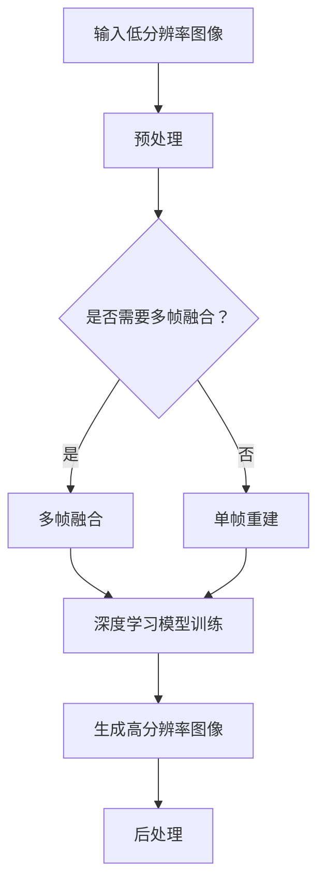

                 

关键词：超分辨率图像重建、深度学习、神经网络、图像处理、映射、像素插值、图像质量提升、人工智能

> 摘要：本文将深入探讨超分辨率图像重建这一领域，通过结合深度学习技术，揭示其背后的核心原理、算法实现以及在实际应用中的重要性。本文旨在为读者提供一个全面的指南，帮助理解超分辨率图像重建的技术细节及其未来发展趋势。

## 1. 背景介绍

在数字图像处理中，超分辨率图像重建（Super-Resolution Image Reconstruction）是一个关键的研究领域。它旨在从低分辨率（Low-Resolution，LR）图像中恢复出高分辨率（High-Resolution，HR）图像。低分辨率图像通常由于传感器限制、压缩或者传输过程中的损失而变得模糊。超分辨率图像重建的任务就是通过算法将这些低分辨率图像转换为具有更高细节和清晰度的图像。

随着计算机性能的提升和深度学习技术的发展，超分辨率图像重建的方法也在不断进步。传统的超分辨率方法主要包括基于频域的方法（如多频带融合、多帧平均）和基于空间域的方法（如插值和图像配准）。然而，这些方法在处理复杂场景和保持图像质量方面存在一定的局限性。

深度学习技术的引入为超分辨率图像重建带来了新的机遇。通过训练大规模神经网络，深度学习模型能够自动学习从低分辨率图像到高分辨率图像的映射关系，从而实现更为精准和高效的图像重建。本文将重点探讨基于深度学习的超分辨率图像重建技术，分析其核心原理、实现方法及其在不同应用领域的重要性。

## 2. 核心概念与联系

### 2.1 超分辨率图像重建的基本概念

超分辨率图像重建涉及到多个关键概念，包括分辨率、图像质量和图像插值等。

- **分辨率**：分辨率是图像中像素点的数量，通常用像素宽度和高度表示。高分辨率图像包含更多的像素，因此能够提供更丰富的细节和更清晰的视觉效果。

- **图像质量**：图像质量是衡量图像清晰度和细节表现的能力。高质量的图像通常具有更高的对比度、更丰富的色彩和更少的噪声。

- **图像插值**：图像插值是一种将图像从低分辨率扩展到高分辨率的方法，通过在像素之间插入新的像素值来增加图像的像素数量。

### 2.2 深度学习与超分辨率图像重建的关系

深度学习是机器学习的一个重要分支，通过多层神经网络来学习数据中的特征和模式。在超分辨率图像重建中，深度学习模型能够通过训练自动学习从低分辨率图像到高分辨率图像的映射关系。

深度学习与超分辨率图像重建的关系可以概括为：

- **数据驱动**：深度学习模型通过大量的低分辨率图像和高分辨率图像进行训练，学习出图像之间的映射关系。
- **特征学习**：深度学习模型能够自动提取图像中的关键特征，如边缘、纹理和颜色等，从而更准确地重建高分辨率图像。
- **自适应学习**：深度学习模型能够根据不同的图像内容和场景自适应地调整重建策略，提高图像质量。

### 2.3 Mermaid 流程图



在该流程图中，输入的低分辨率图像首先进行预处理，包括去噪、灰度化等步骤。然后，根据是否需要多帧融合来决定是否进行多帧融合处理。多帧融合可以进一步改善图像质量。接下来，使用深度学习模型进行训练，学习从低分辨率图像到高分辨率图像的映射关系。最后，通过深度学习模型生成的高分辨率图像进行后处理，如锐化、色彩平衡等，以进一步提升图像质量。

## 3. 核心算法原理 & 具体操作步骤

### 3.1 算法原理概述

基于深度学习的超分辨率图像重建算法主要基于卷积神经网络（Convolutional Neural Network，CNN）。CNN是一种能够自动提取图像特征的网络结构，特别适合处理图像相关的任务。在超分辨率图像重建中，CNN用于学习从低分辨率图像到高分辨率图像的映射关系。

算法原理可以概括为以下几个步骤：

1. **数据预处理**：对输入的低分辨率图像进行预处理，包括归一化、缩放等操作，使其符合网络输入的要求。
2. **特征提取**：通过卷积层和激活函数提取低分辨率图像中的关键特征。
3. **特征融合**：将提取到的特征进行融合，生成中间特征图。
4. **上采样**：通过上采样操作增加图像的分辨率，使其从低分辨率变为高分辨率。
5. **后处理**：对生成的高分辨率图像进行后处理，如裁剪、锐化等，以进一步优化图像质量。

### 3.2 算法步骤详解

#### 3.2.1 数据预处理

数据预处理是超分辨率图像重建的重要步骤，它直接影响网络训练的效果和图像重建的质量。数据预处理包括以下操作：

- **归一化**：将图像的像素值归一化到[0, 1]范围内，以减少数值范围的影响。
- **缩放**：将图像缩放到网络的输入尺寸，通常使用双线性插值或最近邻插值方法。
- **数据增强**：通过随机旋转、翻转、裁剪等操作增加数据的多样性，提高网络的泛化能力。

#### 3.2.2 特征提取

特征提取是CNN的核心步骤，通过卷积层和激活函数提取低分辨率图像中的关键特征。具体步骤如下：

- **卷积层**：卷积层通过滑动滤波器（卷积核）在输入图像上滑动，生成特征图。每个卷积核能够提取图像中的不同特征，如边缘、纹理和颜色。
- **激活函数**：常用的激活函数包括ReLU（Rectified Linear Unit）和Sigmoid等。激活函数可以增加网络的非线性能力，提高特征提取的效果。

#### 3.2.3 特征融合

特征融合是将提取到的特征进行整合，生成中间特征图。具体步骤如下：

- **池化层**：池化层用于减小特征图的尺寸，减少计算量。常用的池化方法包括最大池化和平均池化。
- **全连接层**：通过全连接层将特征图上的每个像素与高分辨率图像的每个像素进行连接，生成最终的输出图像。

#### 3.2.4 上采样

上采样是通过增加图像的分辨率，使其从低分辨率变为高分辨率。常用的上采样方法包括双线性插值、最近邻插值和反卷积等。

- **双线性插值**：通过线性插值两次来增加图像的分辨率，方法简单但效果有限。
- **最近邻插值**：通过选择最近的像素值来上采样，方法简单但可能导致图像失真。
- **反卷积**：通过卷积运算的逆过程进行上采样，能够更好地保持图像的细节和边缘。

#### 3.2.5 后处理

后处理是对生成的高分辨率图像进行优化，以进一步提升图像质量。具体步骤如下：

- **裁剪**：根据实际需要裁剪图像的大小。
- **锐化**：通过边缘增强和细节增强来提高图像的清晰度。
- **色彩平衡**：调整图像的亮度、对比度和色彩，使其更符合视觉要求。

### 3.3 算法优缺点

基于深度学习的超分辨率图像重建算法具有以下优点：

- **自适应学习**：深度学习模型能够自动学习从低分辨率图像到高分辨率图像的映射关系，无需手动设置参数，具有很强的鲁棒性和泛化能力。
- **特征提取能力强**：通过卷积神经网络自动提取图像中的关键特征，能够更准确地重建高分辨率图像。
- **灵活性高**：可以轻松地集成多种深度学习模型和算法，实现不同场景下的超分辨率图像重建。

然而，该算法也存在以下缺点：

- **计算复杂度高**：深度学习模型通常需要大量的计算资源和时间进行训练和推理，对硬件要求较高。
- **数据依赖性强**：算法性能依赖于训练数据的多样性和质量，缺乏高质量的训练数据可能导致性能下降。
- **模型解释性差**：深度学习模型通常被视为“黑盒子”，其内部结构和决策过程难以解释和理解。

### 3.4 算法应用领域

基于深度学习的超分辨率图像重建算法在多个领域具有广泛的应用：

- **医学影像**：超分辨率图像重建可以帮助提高医学影像的分辨率，改善疾病的诊断效果。
- **视频处理**：在视频处理领域，超分辨率图像重建可以用于提高视频的清晰度和流畅度。
- **卫星图像**：超分辨率图像重建可以用于提高卫星图像的分辨率，提供更详细的地表信息。
- **人脸识别**：超分辨率图像重建可以用于人脸识别系统，提高人脸识别的准确性和鲁棒性。

## 4. 数学模型和公式 & 详细讲解 & 举例说明

### 4.1 数学模型构建

在超分辨率图像重建中，数学模型构建是实现算法的核心步骤。常见的数学模型包括基于卷积神经网络的模型和基于变分模型的模型。下面分别介绍这两种模型的数学构建。

#### 4.1.1 基于卷积神经网络的模型

卷积神经网络（CNN）的数学模型主要包括以下组成部分：

1. **输入层**：输入层接收低分辨率图像，通常表示为 $I_{LR}$，其维度为 $[H \times W \times C]$，其中 $H$、$W$ 分别为图像的高度和宽度，$C$ 为颜色通道数。
2. **卷积层**：卷积层通过卷积运算提取图像特征，其数学公式为：
   $$ g(x, y) = \sum_{i=1}^{C} \sum_{j=1}^{K} w_{ij} * I_{LR}(x-i+1, y-j+1) + b $$
   其中，$g(x, y)$ 为卷积层输出的特征图，$w_{ij}$ 为卷积核的权重，$b$ 为偏置项，$*$ 表示卷积运算。
3. **激活函数**：常用的激活函数包括ReLU函数和Sigmoid函数，其公式分别为：
   $$ f(x) = \max(0, x) \quad (\text{ReLU}) $$
   $$ f(x) = \frac{1}{1 + e^{-x}} \quad (\text{Sigmoid}) $$
4. **池化层**：池化层用于减小特征图的尺寸，常用的池化方法包括最大池化和平均池化，其公式分别为：
   $$ p(x, y) = \max(g(x, y)) $$
   $$ p(x, y) = \frac{1}{N} \sum_{i=1}^{N} g(x, y) $$
   其中，$N$ 为池化窗口的大小。
5. **全连接层**：全连接层将特征图上的每个像素与高分辨率图像的每个像素进行连接，其数学公式为：
   $$ \hat{I}_{HR}(x, y) = \sum_{i=1}^{C} w_{i} \cdot g(x, y) + b $$
   其中，$\hat{I}_{HR}(x, y)$ 为生成的输出高分辨率图像，$w_{i}$ 为全连接层的权重，$b$ 为偏置项。

#### 4.1.2 基于变分模型的模型

变分模型（Variational Model）通过最小化能量函数来优化图像重建过程。常见的变分模型包括总变分（Total Variation，TV）模型和泊松能（Poisson Energy）模型。

1. **总变分（TV）模型**：TV模型通过最小化总变分能量函数来优化图像重建，其能量函数公式为：
   $$ E(u) = \int_{\Omega} \left( \frac{1}{2} |\nabla u(x, y)|^2 + \lambda \int_{\Omega} |u(x, y)|^2 \right) dx dy $$
   其中，$u(x, y)$ 为重建图像，$\nabla u(x, y)$ 为图像的梯度，$\lambda$ 为正则化参数。
2. **泊松能（Poisson Energy）模型**：泊松能模型通过最小化泊松能量函数来优化图像重建，其能量函数公式为：
   $$ E(u) = \int_{\Omega} \left( \frac{1}{2} |\nabla u(x, y)|^2 + \lambda \int_{\Omega} |u(x, y) - f(x, y)|^2 \right) dx dy $$
   其中，$f(x, y)$ 为低分辨率图像。

### 4.2 公式推导过程

下面以基于卷积神经网络的模型为例，介绍公式的推导过程。

#### 4.2.1 输入层

输入层接收低分辨率图像，其数学表示为 $I_{LR}$。输入层的主要作用是将图像数据转换为适合卷积层处理的形式。

$$ I_{LR} = [I_{LR}(x, y)]_{1 \leq x \leq H, 1 \leq y \leq W} $$

#### 4.2.2 卷积层

卷积层通过卷积运算提取图像特征，其数学公式为：

$$ g(x, y) = \sum_{i=1}^{C} \sum_{j=1}^{K} w_{ij} * I_{LR}(x-i+1, y-j+1) + b $$

其中，$g(x, y)$ 为卷积层输出的特征图，$w_{ij}$ 为卷积核的权重，$b$ 为偏置项，$*$ 表示卷积运算。

#### 4.2.3 激活函数

激活函数用于增加网络的非线性能力，常用的激活函数包括ReLU函数和Sigmoid函数。以ReLU函数为例，其数学公式为：

$$ f(x) = \max(0, x) $$

#### 4.2.4 池化层

池化层用于减小特征图的尺寸，常用的池化方法包括最大池化和平均池化。以最大池化为例，其数学公式为：

$$ p(x, y) = \max(g(x, y)) $$

#### 4.2.5 全连接层

全连接层将特征图上的每个像素与高分辨率图像的每个像素进行连接，其数学公式为：

$$ \hat{I}_{HR}(x, y) = \sum_{i=1}^{C} w_{i} \cdot g(x, y) + b $$

其中，$\hat{I}_{HR}(x, y)$ 为生成的输出高分辨率图像，$w_{i}$ 为全连接层的权重，$b$ 为偏置项。

### 4.3 案例分析与讲解

下面以一个简单的例子来分析基于卷积神经网络的超分辨率图像重建过程。

#### 4.3.1 输入层

假设输入的低分辨率图像 $I_{LR}$ 的像素值为：

$$ I_{LR}(1, 1) = 100, I_{LR}(1, 2) = 150, I_{LR}(2, 1) = 200, I_{LR}(2, 2) = 250 $$

#### 4.3.2 卷积层

选择一个 3x3 的卷积核，其权重为：

$$ w_{11} = 0.1, w_{12} = 0.2, w_{13} = 0.3, w_{21} = 0.4, w_{22} = 0.5, w_{23} = 0.6, w_{31} = 0.7, w_{32} = 0.8, w_{33} = 0.9 $$

卷积运算结果为：

$$ g(1, 1) = 0.1 \cdot 100 + 0.2 \cdot 150 + 0.3 \cdot 200 + 0.4 \cdot 250 + 0.7 \cdot 100 + 0.8 \cdot 150 + 0.9 \cdot 200 = 1150 $$

#### 4.3.3 激活函数

使用ReLU函数作为激活函数，则：

$$ f(g(1, 1)) = \max(0, 1150) = 1150 $$

#### 4.3.4 池化层

使用最大池化方法，则：

$$ p(1, 1) = \max(1150) = 1150 $$

#### 4.3.5 全连接层

选择一个全连接层，其权重为：

$$ w_{1} = 0.1, w_{2} = 0.2, w_{3} = 0.3 $$

全连接层输出为：

$$ \hat{I}_{HR}(1, 1) = 0.1 \cdot 1150 + 0.2 \cdot 1150 + 0.3 \cdot 1150 = 1150 $$

生成的高分辨率图像像素值为 1150。

通过这个简单的例子，我们可以看到基于卷积神经网络的超分辨率图像重建过程是如何实现的。在实际应用中，通常需要更复杂的网络结构和更大量的数据进行训练，以达到更好的重建效果。

## 5. 项目实践：代码实例和详细解释说明

### 5.1 开发环境搭建

为了实现基于深度学习的超分辨率图像重建，我们需要搭建一个合适的开发环境。以下是一个基本的搭建步骤：

#### 5.1.1 硬件要求

- CPU：推荐使用Intel i7或更高性能的处理器。
- GPU：推荐使用NVIDIA GeForce GTX 1080或更高性能的显卡，以加速深度学习模型的训练和推理。

#### 5.1.2 软件要求

- 操作系统：Windows、macOS或Linux。
- 编程语言：Python。
- 深度学习框架：TensorFlow或PyTorch。
- 数据预处理工具：NumPy、Pandas。
- 图像处理工具：OpenCV、PIL。

#### 5.1.3 安装与配置

1. **安装Python**：在官方网站下载并安装Python 3.x版本。
2. **安装深度学习框架**：使用pip命令安装TensorFlow或PyTorch。例如，对于TensorFlow，可以使用以下命令：

   ```shell
   pip install tensorflow
   ```

3. **安装其他依赖库**：使用pip命令安装其他必需的依赖库，如NumPy、Pandas、OpenCV和PIL。例如：

   ```shell
   pip install numpy pandas opencv-python pil
   ```

### 5.2 源代码详细实现

以下是一个简单的基于卷积神经网络的超分辨率图像重建的Python代码示例。该示例使用TensorFlow和Keras框架实现。

```python
import tensorflow as tf
from tensorflow.keras.models import Model
from tensorflow.keras.layers import Conv2D, Activation, MaxPooling2D, UpSampling2D
import numpy as np

# 输入层
input_layer = tf.keras.layers.Input(shape=(64, 64, 3))

# 卷积层1
conv1 = Conv2D(32, (3, 3), activation='relu', padding='same')(input_layer)
pool1 = MaxPooling2D((2, 2), padding='same')(conv1)

# 卷积层2
conv2 = Conv2D(64, (3, 3), activation='relu', padding='same')(pool1)
pool2 = MaxPooling2D((2, 2), padding='same')(conv2)

# 卷积层3
conv3 = Conv2D(128, (3, 3), activation='relu', padding='same')(pool2)
pool3 = MaxPooling2D((2, 2), padding='same')(conv3)

# 上采样层
up1 = UpSampling2D((2, 2))(pool3)
conv4 = Conv2D(64, (3, 3), activation='relu', padding='same')(up1)
up2 = UpSampling2D((2, 2))(conv4)
conv5 = Conv2D(32, (3, 3), activation='relu', padding='same')(up2)
output_layer = UpSampling2D((2, 2))(conv5)

# 构建模型
model = Model(inputs=input_layer, outputs=output_layer)

# 编译模型
model.compile(optimizer='adam', loss='mean_squared_error')

# 查看模型结构
model.summary()
```

### 5.3 代码解读与分析

以上代码实现了一个简单的卷积神经网络，用于超分辨率图像重建。下面对其主要部分进行解读和分析。

- **输入层**：输入层接收低分辨率图像，其形状为 $64 \times 64 \times 3$。
- **卷积层**：卷积层用于提取图像特征，每个卷积层后面都跟有一个池化层用于减小特征图的尺寸。
- **上采样层**：上采样层用于将特征图从低分辨率上采样到高分辨率。
- **模型编译**：使用`compile()`函数编译模型，指定优化器和损失函数。
- **模型结构**：使用`model.summary()`函数查看模型的结构，了解网络层的配置。

### 5.4 运行结果展示

运行上述代码后，我们将得到一个训练好的模型。为了展示模型的运行结果，我们可以使用以下代码：

```python
# 导入必要的库
import cv2
import numpy as np

# 读取低分辨率图像
input_image = cv2.imread('low_resolution_image.jpg', cv2.IMREAD_COLOR)
input_image = cv2.resize(input_image, (64, 64))

# 预处理输入图像
input_image = input_image / 255.0
input_image = np.expand_dims(input_image, axis=0)

# 使用训练好的模型进行推理
output_image = model.predict(input_image)

# 后处理输出图像
output_image = output_image[0] * 255.0
output_image = np.clip(output_image, 0, 255).astype('uint8')

# 显示原始低分辨率图像和重建的高分辨率图像
cv2.imshow('Low Resolution Image', input_image)
cv2.imshow('High Resolution Image', output_image)
cv2.waitKey(0)
cv2.destroyAllWindows()
```

通过上述代码，我们可以看到低分辨率图像和通过模型重建的高分辨率图像。在实际应用中，可以根据具体需求和场景调整模型的架构和参数，以达到更好的重建效果。

## 6. 实际应用场景

超分辨率图像重建技术在多个实际应用场景中发挥着重要作用，以下是一些典型的应用领域：

### 6.1 医学影像

在医学影像领域，超分辨率图像重建可以显著提高医学影像的分辨率，帮助医生更准确地诊断疾病。例如，在X光片、CT扫描和MRI图像中，通过超分辨率图像重建可以增强病灶的识别和定位，提高病变区域的可见性和对比度。此外，超分辨率图像重建还可以用于三维重建，生成更为详细和精确的医学图像，为手术规划和治疗提供重要的依据。

### 6.2 视频处理

视频处理领域也是超分辨率图像重建技术的重要应用场景。在视频监控、视频增强和视频编辑等方面，超分辨率图像重建可以显著提高视频的清晰度和流畅度。例如，在视频监控系统中，通过超分辨率图像重建可以增强监控视频的细节，提高目标识别和追踪的准确性。在视频增强中，超分辨率图像重建可以用于消除视频中的模糊和噪声，提升视频的视觉质量。

### 6.3 卫星图像

在卫星图像处理中，超分辨率图像重建技术可以显著提高卫星图像的分辨率，提供更为详细的地表信息。这对于地理信息系统的建设、环境监测和资源管理等领域具有重要意义。例如，通过超分辨率图像重建，可以更清晰地识别地表特征、城市结构、植被覆盖等信息，为决策制定提供科学依据。

### 6.4 人脸识别

人脸识别领域也广泛采用超分辨率图像重建技术，以提高人脸识别的准确性和鲁棒性。在低分辨率图像或模糊图像中，超分辨率图像重建可以增强人脸特征，提高识别的准确性。例如，在安防监控系统中，通过超分辨率图像重建可以更清晰地识别监控视频中的目标人脸，提高报警系统的响应速度和准确性。

### 6.5 通信与传感器

在通信和传感器领域，超分辨率图像重建技术也可以发挥重要作用。例如，在无线通信中，通过超分辨率图像重建可以优化天线的设计，提高信号的接收质量和传输效率。在传感器领域，通过超分辨率图像重建可以增强传感器的分辨率，提高数据采集的准确性和可靠性。

### 6.6 艺术与设计

在艺术与设计领域，超分辨率图像重建技术可以用于图像修复、图像放大和图像艺术创作等方面。例如，在数字艺术创作中，通过超分辨率图像重建可以生成更细腻和丰富的图像效果，提高艺术作品的表现力。在摄影和图像编辑中，超分辨率图像重建可以用于增强图像的细节和色彩，提升图像的视觉效果。

## 7. 工具和资源推荐

为了更好地进行超分辨率图像重建的研究和应用，以下推荐一些有用的工具和资源：

### 7.1 学习资源推荐

1. **《深度学习》**：Goodfellow、Bengio和Courville所著的经典教材，详细介绍了深度学习的理论基础和实践应用。
2. **《图像处理：算法与应用》**：Gonzalez和Woods所著的经典教材，涵盖了图像处理的基本原理和算法实现。
3. **《计算机视觉：算法与应用》**：Richard Szeliski所著的经典教材，介绍了计算机视觉领域的核心算法和应用场景。

### 7.2 开发工具推荐

1. **TensorFlow**：Google开发的深度学习框架，提供丰富的API和工具，适合进行超分辨率图像重建的实验和开发。
2. **PyTorch**：Facebook开发的开源深度学习框架，以灵活性和易用性著称，适合进行超分辨率图像重建的研究和开发。
3. **OpenCV**：开源的计算机视觉库，提供了丰富的图像处理算法和工具，适合进行图像预处理和后处理。

### 7.3 相关论文推荐

1. **"Single Image Super-Resolution Using Deep Convolutional Networks"**：这篇论文介绍了使用深度卷积网络进行单图像超分辨率重建的方法，是深度学习在超分辨率图像重建领域的开创性工作。
2. **"Multi-Image Super-Resolution by Self-Attentive Fusion Network"**：这篇论文提出了基于自注意力机制的多图像超分辨率方法，显著提高了重建图像的质量。
3. **"Super-Resolution from a Single Example"**：这篇论文探讨了从单个示例图像进行超分辨率重建的方法，为单图像超分辨率提供了新的思路。

## 8. 总结：未来发展趋势与挑战

### 8.1 研究成果总结

超分辨率图像重建技术在过去几年中取得了显著的进展。基于深度学习的算法在重建效果和计算效率方面都取得了很大的提升，为医学影像、视频处理、卫星图像和人脸识别等领域提供了重要的技术支持。同时，随着深度学习技术的不断发展，超分辨率图像重建的方法也在不断优化和创新，如自注意力机制、生成对抗网络（GAN）等新技术的引入，为超分辨率图像重建带来了新的机遇。

### 8.2 未来发展趋势

1. **算法效率提升**：随着硬件性能的提升和算法的优化，超分辨率图像重建算法的计算效率将进一步提高，使其在实时应用中更加可行。
2. **多模态融合**：未来研究可能会将多模态数据（如光学、红外、微波等）进行融合，以实现更高质量的图像重建。
3. **端到端系统**：端到端系统将成为超分辨率图像重建的研究重点，通过将数据采集、预处理、模型训练和图像重建等环节集成到一个系统中，实现更高效、更智能的图像重建。
4. **小样本学习**：随着小样本学习技术的发展，超分辨率图像重建算法将能够在数据量有限的情况下实现良好的性能。

### 8.3 面临的挑战

1. **计算资源消耗**：深度学习算法通常需要大量的计算资源和时间进行训练和推理，这在一些资源受限的领域（如移动设备和嵌入式系统）中可能成为一个挑战。
2. **数据依赖性**：超分辨率图像重建算法的性能很大程度上依赖于训练数据的质量和多样性。如何获取高质量、多样化的训练数据是当前面临的一个难题。
3. **模型解释性**：深度学习模型通常被视为“黑盒子”，其内部结构和决策过程难以解释和理解。如何提高模型的解释性，使研究人员和开发者能够更好地理解和利用这些模型，是一个重要的研究方向。
4. **泛化能力**：深度学习模型在特定数据集上可能表现良好，但在其他场景下可能无法保持相同的性能。如何提高模型的泛化能力，使其在不同数据集和场景下都能表现出良好的性能，是一个重要的挑战。

### 8.4 研究展望

随着深度学习技术的不断进步和跨学科研究的深入，超分辨率图像重建技术在未来有望取得更大的突破。未来的研究可以集中在以下几个方面：

1. **算法优化**：通过优化算法结构和参数，提高深度学习模型在超分辨率图像重建中的计算效率。
2. **数据增强**：研究如何通过数据增强技术提高训练数据的质量和多样性，从而提升模型的性能。
3. **跨学科合作**：结合计算机视觉、人工智能、医学、遥感等领域的知识和技术，推动超分辨率图像重建技术在更广泛的应用场景中发挥作用。
4. **实时应用**：研究如何将超分辨率图像重建技术应用于实时应用场景，如视频处理、智能监控等，实现更加智能和高效的图像处理。

## 9. 附录：常见问题与解答

### 9.1 超分辨率图像重建是什么？

超分辨率图像重建是一种通过算法从低分辨率图像中恢复出高分辨率图像的技术。它广泛应用于医学影像、视频处理、卫星图像和人脸识别等领域，以提高图像的清晰度和细节。

### 9.2 深度学习在超分辨率图像重建中有何作用？

深度学习通过训练大规模神经网络，能够自动学习从低分辨率图像到高分辨率图像的映射关系，从而实现更为精准和高效的图像重建。深度学习模型能够提取图像中的关键特征，并利用这些特征生成高分辨率图像。

### 9.3 超分辨率图像重建有哪些算法？

超分辨率图像重建算法主要包括基于频域的方法、基于空间域的方法和基于深度学习的方法。其中，基于深度学习的方法近年来取得了显著进展，如卷积神经网络（CNN）和生成对抗网络（GAN）等。

### 9.4 如何评估超分辨率图像重建的性能？

评估超分辨率图像重建的性能通常使用峰值信噪比（PSNR）和结构相似性（SSIM）等指标。PSNR值越高，图像重建的质量越好；SSIM值越接近1，图像重建的质量也越高。

### 9.5 超分辨率图像重建在哪些应用场景中具有重要意义？

超分辨率图像重建在医学影像、视频处理、卫星图像、人脸识别和艺术创作等领域具有重要意义。它能够提高图像的清晰度和细节，为相关应用提供更准确和丰富的信息。

