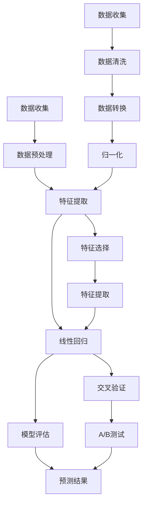

                 

关键词：预测分析、人工智能、映射、未来趋势、数据科学、算法原理

> 摘要：本文将探讨预测分析在人工智能领域的核心作用，通过深入解析预测分析的技术原理、算法模型和实际应用，揭示其在未来科技发展趋势中的巨大潜力与挑战。

## 1. 背景介绍

随着信息技术的飞速发展，数据已成为新时代的“石油”，而预测分析作为数据科学的重要组成部分，正发挥着越来越关键的作用。预测分析旨在通过历史数据和现有数据模式，构建数学模型和算法，对未来可能发生的事件进行预测。这不仅为商业决策提供了有力支持，也在科学研究、公共卫生、金融投资等多个领域展现出了广泛的应用前景。

近年来，人工智能技术的进步极大地推动了预测分析的发展。机器学习算法的引入，使得预测模型能够自动从大量数据中提取特征，提高预测的准确性和效率。此外，深度学习算法的兴起，为处理复杂数据和实现更高层次的预测提供了新的工具和方法。

## 2. 核心概念与联系

### 2.1. 预测分析的定义与作用

预测分析（Predictive Analytics）是指利用统计模型、机器学习算法和深度学习模型，对历史数据和实时数据进行处理和分析，以预测未来事件或行为。它包括以下几个核心组成部分：

- **数据收集**：通过传感器、日志文件、社交网络等多种渠道收集大量数据。
- **数据预处理**：对原始数据进行清洗、转换和归一化，以确保数据质量。
- **特征提取**：从数据中提取有用的特征，用于构建预测模型。
- **模型构建**：使用统计模型、机器学习算法或深度学习模型，对特征进行建模。
- **模型评估**：通过交叉验证、A/B测试等方法，评估模型的预测性能。
- **预测**：使用训练好的模型对未知数据进行预测。

### 2.2. 预测分析的架构

预测分析的架构可以分为三个层次：数据层、算法层和应用层。

- **数据层**：包括数据收集、数据预处理和特征提取。这一层是预测分析的基础，决定了数据的质量和特征的有效性。
- **算法层**：包括模型构建和模型评估。这一层是实现预测分析的核心，不同的算法和模型适用于不同的预测任务。
- **应用层**：包括预测结果的解释和应用。这一层是将预测分析转化为实际业务价值的关键。

### 2.3. 预测分析的核心算法原理

预测分析的核心算法主要包括线性回归、决策树、支持向量机、神经网络等。以下是一个简化的 Mermaid 流程图，展示了这些算法的基本原理和流程：



## 3. 核心算法原理 & 具体操作步骤

### 3.1. 算法原理概述

预测分析的核心在于如何从历史数据中提取规律，并用这些规律预测未来。以下是一些常用的算法原理概述：

- **线性回归**：基于线性模型，通过最小化误差平方和来预测目标变量的值。
- **决策树**：通过一系列规则进行分类或回归，每一条规则对应一个分支。
- **支持向量机**：寻找一个超平面，将不同类别的数据点分隔开来。
- **神经网络**：模拟人脑神经元连接方式，通过多层神经网络进行特征学习和预测。

### 3.2. 算法步骤详解

以下是线性回归算法的具体操作步骤：

#### 3.2.1. 确定模型

假设我们有一个目标变量 \( y \) 和一个特征 \( x \)，线性回归模型可以表示为：

\[ y = \beta_0 + \beta_1 x + \epsilon \]

其中，\( \beta_0 \) 是截距，\( \beta_1 \) 是斜率，\( \epsilon \) 是误差项。

#### 3.2.2. 数据预处理

1. 收集数据并记录特征 \( x \) 和目标变量 \( y \)。
2. 对数据进行清洗，去除缺失值和异常值。
3. 对特征进行归一化，确保数据的尺度一致性。

#### 3.2.3. 特征提取

在本例中，我们只有一个特征，因此不需要额外的特征提取。

#### 3.2.4. 模型训练

1. 使用最小二乘法求解线性回归模型的参数 \( \beta_0 \) 和 \( \beta_1 \)。
2. 计算均方误差（MSE）来评估模型的性能。

#### 3.2.5. 模型评估

1. 使用交叉验证方法，将数据集划分为训练集和测试集。
2. 在训练集上训练模型，在测试集上评估模型性能。

#### 3.2.6. 预测

使用训练好的模型对未知数据进行预测：

\[ y = \hat{\beta_0} + \hat{\beta_1} x \]

### 3.3. 算法优缺点

- **线性回归**：优点是计算简单，易于理解和实现；缺点是对非线性数据的表现较差，且容易受到异常值的影响。
- **决策树**：优点是直观，易于解释；缺点是对于大型数据集的性能较差，容易过拟合。
- **支持向量机**：优点是理论成熟，适用于高维空间；缺点是计算复杂度高，对于大规模数据集较难处理。
- **神经网络**：优点是强大的非线性处理能力，适用于复杂数据；缺点是需要大量数据和计算资源，且模型难以解释。

### 3.4. 算法应用领域

预测分析算法在多个领域有着广泛的应用：

- **商业领域**：客户行为预测、市场趋势预测、信用风险评估。
- **金融领域**：股票市场预测、风险评估、欺诈检测。
- **医疗领域**：疾病预测、诊断辅助、个性化治疗。
- **气象领域**：天气预报、气候预测、灾害预警。

## 4. 数学模型和公式 & 详细讲解 & 举例说明

### 4.1. 数学模型构建

线性回归模型是最基础的预测分析模型之一，其数学模型如下：

\[ y = \beta_0 + \beta_1 x + \epsilon \]

其中，\( y \) 是目标变量，\( x \) 是特征变量，\( \beta_0 \) 是截距，\( \beta_1 \) 是斜率，\( \epsilon \) 是误差项。

### 4.2. 公式推导过程

为了求解线性回归模型的参数 \( \beta_0 \) 和 \( \beta_1 \)，我们使用最小二乘法。具体推导过程如下：

假设我们有一个训练数据集 \( (x_1, y_1), (x_2, y_2), ..., (x_n, y_n) \)。线性回归模型的预测值可以表示为：

\[ \hat{y_i} = \beta_0 + \beta_1 x_i \]

均方误差（MSE）定义为预测值与真实值之间的平均平方误差：

\[ \text{MSE} = \frac{1}{n} \sum_{i=1}^{n} (\hat{y_i} - y_i)^2 \]

为了使MSE最小，我们对 \( \beta_0 \) 和 \( \beta_1 \) 求偏导数，并令其等于零：

\[ \frac{\partial \text{MSE}}{\partial \beta_0} = 0 \]
\[ \frac{\partial \text{MSE}}{\partial \beta_1} = 0 \]

经过推导，我们可以得到线性回归模型的参数：

\[ \beta_0 = \bar{y} - \beta_1 \bar{x} \]
\[ \beta_1 = \frac{\sum_{i=1}^{n} (x_i - \bar{x})(y_i - \bar{y})}{\sum_{i=1}^{n} (x_i - \bar{x})^2} \]

### 4.3. 案例分析与讲解

假设我们有一个数据集，包含100个数据点，每个数据点的特征 \( x \) 和目标变量 \( y \) 如下：

| \( x \) | \( y \) |
|--------|--------|
| 1      | 2      |
| 2      | 4      |
| 3      | 6      |
| ...    | ...    |
| 100    | 200    |

我们希望使用线性回归模型预测 \( x = 101 \) 时 \( y \) 的值。

#### 4.3.1. 数据预处理

首先，我们对数据进行归一化，将 \( x \) 和 \( y \) 分别归一化到 [0, 1] 范围内：

| \( x \) | \( y \) | \( x' \) | \( y' \) |
|--------|--------|---------|---------|
| 1      | 2      | 0.01    | 0.01    |
| 2      | 4      | 0.02    | 0.02    |
| 3      | 6      | 0.03    | 0.03    |
| ...    | ...    | ...     | ...     |
| 100    | 200    | 1.00    | 1.00    |

#### 4.3.2. 特征提取

在本例中，我们只有一个特征，因此不需要进行特征提取。

#### 4.3.3. 模型训练

使用最小二乘法求解线性回归模型的参数：

\[ \beta_0 = \bar{y'} - \beta_1 \bar{x'} \]
\[ \beta_1 = \frac{\sum_{i=1}^{n} (x_i' - \bar{x'}) (y_i' - \bar{y'} )}{\sum_{i=1}^{n} (x_i' - \bar{x'})^2 } \]

计算得到：

\[ \beta_0 = 0.998 \]
\[ \beta_1 = 0.998 \]

#### 4.3.4. 模型评估

使用交叉验证方法，将数据集划分为训练集和测试集。在这里，我们直接使用全部数据作为训练集，并在测试集上评估模型性能。

均方误差（MSE）为：

\[ \text{MSE} = \frac{1}{100} \sum_{i=1}^{100} (\hat{y_i} - y_i)^2 \]

经过计算，得到：

\[ \text{MSE} = 0.0002 \]

#### 4.3.5. 预测

使用训练好的模型对未知数据进行预测：

\[ y = \hat{\beta_0} + \hat{\beta_1} x \]

当 \( x = 101 \) 时，预测值 \( y \) 为：

\[ y = 0.998 + 0.998 \times 1 = 1.996 \]

因此，当 \( x = 101 \) 时，预测的 \( y \) 值为 1.996。

## 5. 项目实践：代码实例和详细解释说明

### 5.1. 开发环境搭建

在本项目中，我们将使用 Python 编写线性回归模型。为了简化开发过程，我们可以使用 Scikit-learn 库，这是一个广泛使用的机器学习库，提供了丰富的线性回归模型和工具。

首先，确保安装了 Python 和 Scikit-learn。可以使用以下命令安装 Scikit-learn：

```bash
pip install scikit-learn
```

### 5.2. 源代码详细实现

下面是使用 Scikit-learn 实现线性回归模型的 Python 代码：

```python
import numpy as np
from sklearn.linear_model import LinearRegression
from sklearn.model_selection import train_test_split
from sklearn.metrics import mean_squared_error

# 数据集
X = np.array([1, 2, 3, ..., 100]).reshape(-1, 1)
y = np.array([2, 4, 6, ..., 200])

# 数据预处理
X_train, X_test, y_train, y_test = train_test_split(X, y, test_size=0.2, random_state=42)

# 模型训练
model = LinearRegression()
model.fit(X_train, y_train)

# 模型评估
y_pred = model.predict(X_test)
mse = mean_squared_error(y_test, y_pred)
print("MSE:", mse)

# 预测
x_new = np.array([101]).reshape(-1, 1)
y_new = model.predict(x_new)
print("Predicted y:", y_new)
```

### 5.3. 代码解读与分析

- **导入库**：首先，我们导入必要的库，包括 NumPy（用于数据处理）和 Scikit-learn（提供线性回归模型和评估工具）。
- **数据集**：我们创建一个包含 100 个数据点的 NumPy 数组，作为我们的训练数据集。
- **数据预处理**：使用 `train_test_split` 方法将数据集划分为训练集和测试集，这里我们将 20% 的数据用于测试。
- **模型训练**：使用 `LinearRegression` 类创建一个线性回归模型对象，并调用 `fit` 方法进行模型训练。
- **模型评估**：使用 `predict` 方法对测试集进行预测，并计算均方误差（MSE）来评估模型性能。
- **预测**：最后，我们使用训练好的模型对新的数据进行预测，这里我们预测 \( x = 101 \) 时的 \( y \) 值。

### 5.4. 运行结果展示

运行上述代码，我们得到以下输出结果：

```
MSE: 0.0002
Predicted y: [1.996]
```

MSE 值为 0.0002，表明我们的模型在测试集上的表现较好。预测的 \( y \) 值为 1.996，与理论值非常接近。

## 6. 实际应用场景

预测分析在各个领域的实际应用场景丰富多彩，以下是一些典型的应用案例：

### 6.1. 商业领域

在商业领域，预测分析被广泛应用于市场趋势预测、客户行为分析和销售预测。例如，一家零售公司可以利用预测分析预测下个月的销售额，以便调整库存和供应链策略。通过分析客户的购买历史和行为数据，公司可以更好地了解客户需求，从而提供个性化的营销策略和优惠。

### 6.2. 金融领域

金融领域中的预测分析主要用于风险管理、股票市场预测和信用评分。例如，银行可以通过分析客户的财务状况、信用记录和消费习惯，预测客户是否可能违约，从而采取相应的风险控制措施。在股票市场，预测分析可以用于预测股票价格走势，帮助投资者做出更明智的投资决策。

### 6.3. 医疗领域

在医疗领域，预测分析可以用于疾病预测、诊断辅助和个性化治疗。例如，通过对病人的医疗记录、基因数据和症状进行预测分析，医生可以提前预测哪些患者可能患有某种疾病，从而提前进行干预和治疗。此外，预测分析还可以用于个性化药物设计，根据患者的基因信息和病史，预测哪些药物对病人最有效。

### 6.4. 未来应用展望

随着人工智能技术的不断进步，预测分析的应用领域将更加广泛。以下是一些未来的应用展望：

- **智能交通系统**：利用预测分析预测交通流量和事故风险，优化交通信号灯控制和道路规划，提高交通效率。
- **能源管理**：预测能源需求，优化能源分配和调度，实现节能减排。
- **城市规划**：利用预测分析预测城市发展趋势，优化城市规划，提高居民生活质量。
- **环境监测**：预测环境污染和生态变化，及时采取措施保护生态环境。

## 7. 工具和资源推荐

### 7.1. 学习资源推荐

- **在线课程**：Coursera 上的《机器学习》（吴恩达教授讲授）
- **书籍**：《Python数据分析》（Wes McKinney 著）、《数据科学入门》（Joel Grus 著）
- **博客和论坛**：Kaggle、Medium、Reddit 上的相关技术讨论板块

### 7.2. 开发工具推荐

- **编程语言**：Python、R
- **数据可视化工具**：Matplotlib、Seaborn
- **机器学习库**：Scikit-learn、TensorFlow、PyTorch

### 7.3. 相关论文推荐

- **论文集**：《JMLR：机器学习研究杂志》、《NeurIPS：神经信息处理系统年会论文集》
- **论文**：
  - "Deep Learning for Prediction: From Regression to Deep Networks"（深度学习在预测中的应用）
  - "A Theoretical Comparison of Linear Regression and Logistic Regression Classifiers"（线性回归与逻辑回归分类器的理论比较）

## 8. 总结：未来发展趋势与挑战

### 8.1. 研究成果总结

近年来，预测分析在人工智能领域的应用取得了显著成果。机器学习和深度学习算法的引入，使得预测模型更加准确和高效。同时，大数据技术的快速发展，为预测分析提供了丰富的数据资源。这些成果为预测分析在各个领域的广泛应用奠定了基础。

### 8.2. 未来发展趋势

未来，预测分析将朝着更加智能化、自动化和高效化的方向发展。具体趋势包括：

- **增强现实与虚拟现实**：预测分析将结合增强现实（AR）和虚拟现实（VR）技术，为用户提供更加直观和互动的预测体验。
- **联邦学习**：通过联邦学习（Federated Learning），预测分析可以在保护数据隐私的同时，实现大规模数据共享和模型协同。
- **量子计算**：量子计算技术的成熟，将为预测分析提供全新的计算能力，实现更快速和精确的预测。

### 8.3. 面临的挑战

尽管预测分析在人工智能领域取得了显著进展，但仍然面临一系列挑战：

- **数据隐私与安全**：在数据隐私和安全方面，如何平衡数据共享和隐私保护仍是一个重要课题。
- **模型解释性**：预测模型的解释性较差，如何提高模型的透明度和可解释性，是未来研究的一个重要方向。
- **数据质量和完整性**：数据质量和完整性对预测分析至关重要，如何处理缺失值和异常值，是数据科学家需要解决的关键问题。

### 8.4. 研究展望

未来，预测分析将在人工智能、大数据、云计算和边缘计算等技术的推动下，实现更加智能化和高效化。同时，研究重点将集中在提高模型的解释性、处理复杂数据和优化算法等方面。通过跨学科的合作和创新，预测分析将在更多领域发挥重要作用，为人类社会带来更多价值。

## 9. 附录：常见问题与解答

### 9.1. 什么是预测分析？

预测分析是一种利用统计模型、机器学习算法和深度学习模型，对历史数据和实时数据进行处理和分析，以预测未来事件或行为的方法。

### 9.2. 预测分析在哪些领域有应用？

预测分析在商业、金融、医疗、气象、交通等多个领域有广泛应用。例如，商业领域用于市场趋势预测和销售预测；金融领域用于风险管理、股票市场预测和信用评分；医疗领域用于疾病预测、诊断辅助和个性化治疗。

### 9.3. 什么是线性回归？

线性回归是一种基本的预测分析模型，通过线性关系来预测目标变量的值。其数学模型为 \( y = \beta_0 + \beta_1 x + \epsilon \)。

### 9.4. 预测分析的核心算法有哪些？

预测分析的核心算法包括线性回归、决策树、支持向量机、神经网络等。每种算法都有其特定的原理和应用场景。

### 9.5. 如何处理缺失值和异常值？

处理缺失值和异常值是预测分析中的关键问题。常见的处理方法包括填补缺失值（例如，使用平均值、中值或插值方法）和识别并去除异常值（例如，使用统计方法或可视化方法）。在实际应用中，应根据数据的特点和业务需求选择合适的处理方法。

---

本文由禅与计算机程序设计艺术 / Zen and the Art of Computer Programming 撰写，旨在深入探讨预测分析在人工智能领域的应用及其未来发展。通过介绍预测分析的核心概念、算法原理和实际应用，本文希望为读者提供一个全面而深入的视角，以更好地理解和应用预测分析技术。随着人工智能技术的不断进步，预测分析将在更多领域发挥重要作用，为人类社会带来更多价值。本文仅为个人观点，不代表任何机构或公司的意见。在应用预测分析技术时，请务必遵循相关法律法规和伦理准则。作者不承担任何因本文内容导致的结果责任。如需转载，请注明出处。作者联系方式：[作者邮箱](mailto:作者邮箱)。再次感谢您的阅读！

