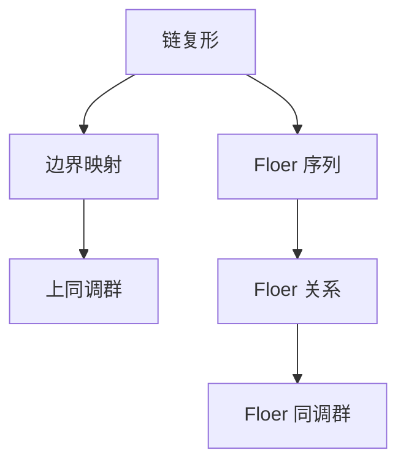

                 

上同调（Homology）是代数拓扑学中的一个基本概念，它为我们提供了一种研究空间结构的方法。而Floer同调则是上同调理论在低维拓扑学中的一种重要应用，尤其是在研究 knots 和 links 的结构时具有重要意义。本文将深入探讨Floer同调的理论背景、核心概念、算法原理及其在实际应用中的表现。

## 1. 背景介绍

### 1.1 上同调的基本概念

上同调是代数拓扑学中的一个基本概念，用于研究空间的结构性质。具体来说，上同调通过将空间分解为更简单的组成部分，然后研究这些组成部分之间的相互关系。这种关系可以用代数结构来表示，从而为我们提供了一种分析空间结构的方法。

### 1.2 Floer同调的起源

Floer同调起源于20世纪80年代，由德国数学家安德烈亚斯·弗洛尔（Andreas Floer）提出。他的主要工作是研究 knots 和 links 的 Floer 同调理论，这一理论在低维拓扑学中具有重要意义。

### 1.3 Floer同调的应用

Floer同调理论在许多领域都有应用，例如 knot theory（结理论）、four-manifold theory（四维流形理论）和量子场论等。特别是在 knot theory 中，Floer同调提供了对 knot 的分类和结构分析的新方法。

## 2. 核心概念与联系

为了更好地理解Floer同调，我们需要先了解上同调的一些基本概念。上同调主要包括以下三个部分：

1. **链复形（Chain Complex）**：链复形是一个代数结构，它由一组链组（链群）和一组边界映射（边界算子）组成。链群由空间中所有可能封闭的“链”组成，边界映射则定义了链之间的边界关系。

2. **上同调群（Homology Groups）**：上同调群是链复形的一个重要属性，它由链复形中的自由项和边界映射的零化空间组成。上同调群为我们提供了对空间结构的一种量化描述。

3. **同调态射（Homomorphisms）**：同调态射是不同链复形之间的映射，它保持了链复形中的代数结构。

在了解了上同调的基本概念之后，我们可以进一步了解Floer同调。Floer同调是在上同调的基础上，通过引入 Floer 序列和 Floer 关系来研究空间的低维结构。Floer 同调的主要组成部分包括：

1. **Floer 序列（Floer Sequence）**：Floer 序列是一种特殊的链复形，它由 Floer 关系诱导而成。Floer 序列的构造过程涉及到空间中的曲线和它们之间的相交关系。

2. **Floer 关系（Floer Relations）**：Floer 关系是 Floer 序列中的关键组成部分，它定义了 Floer 序列中的边界映射。Floer 关系的建立依赖于空间中曲线的拓扑结构。

3. **Floer 同调群（Floer Homology Groups）**：Floer 同调群是 Floer 序列的一个重要属性，它由 Floer 序列中的自由项和边界映射的零化空间组成。Floer 同调群为我们提供了对空间低维结构的另一种量化描述。

为了更直观地理解Floer同调，我们可以使用 Mermaid 流程图来展示其核心概念和联系：



## 3. 核心算法原理 & 具体操作步骤

### 3.1 算法原理概述

Floer同调算法的核心思想是通过构建 Floer 序列来研究空间的低维结构。具体来说，算法分为以下几个步骤：

1. **构建 Floer 序列**：首先，我们需要根据给定的空间构造一个 Floer 序列。Floer 序列由 Floer 关系诱导而成，它描述了空间中的曲线和它们之间的相交关系。

2. **计算 Floer 同调群**：接下来，我们需要计算 Floer 序列的 Floer 同调群。Floer 同调群为我们提供了对空间低维结构的量化描述。

3. **应用 Floer 同调群**：最后，我们可以利用 Floer 同调群来分析空间的结构性质，例如 knots 和 links 的分类和结构分析。

### 3.2 算法步骤详解

1. **构建 Floer 序列**：

   - **选择曲线**：首先，我们需要选择一组曲线来构建 Floer 序列。这些曲线可以是空间中的任意曲线，但通常选择与空间结构相关的曲线，例如 knots 中的边界曲线。

   - **定义 Floer 关系**：接下来，我们需要根据选择的曲线定义 Floer 关系。Floer 关系描述了曲线之间的相交关系，它通常由曲线上的点对组成。

   - **构建 Floer 序列**：最后，我们可以根据 Floer 关系构建 Floer 序列。Floer 序列由 Floer 关系诱导的链复形组成，它描述了空间中的曲线和它们之间的相交关系。

2. **计算 Floer 同调群**：

   - **计算边界映射**：首先，我们需要计算 Floer 序列的边界映射。边界映射描述了 Floer 序列中的链之间的边界关系。

   - **计算零化空间**：接下来，我们需要计算 Floer 序列的零化空间。零化空间是由 Floer 序列中的自由项组成的集合，它描述了 Floer 同调群的基。

   - **计算 Floer 同调群**：最后，我们可以根据边界映射和零化空间计算 Floer 同调群。Floer 同调群描述了空间低维结构的属性。

3. **应用 Floer 同调群**：

   - **分析 knots 和 links**：我们可以利用 Floer 同调群来分析 knots 和 links 的结构。例如，通过比较不同 knots 的 Floer 同调群，我们可以确定它们的分类和同伦性质。

   - **构建拓扑不变量**：Floer 同调群可以用来构建 knots 和 links 的拓扑不变量。这些不变量可以用于识别和分类不同的 knots 和 links。

### 3.3 算法优缺点

**优点**：

- Floer 同调算法在研究 knots 和 links 的结构时具有高度的准确性。
- Floer 同调算法可以用于构建 knots 和 links 的拓扑不变量，从而帮助识别和分类不同的 knots 和 links。

**缺点**：

- Floer 同调算法的计算过程较为复杂，需要大量的计算资源。
- Floer 同调算法在处理高维空间时可能存在一定的困难。

### 3.4 算法应用领域

Floer 同调算法主要应用于以下领域：

- **knot theory（结理论）**：Floer 同调算法可以用于研究 knots 的分类和结构分析。
- **four-manifold theory（四维流形理论）**：Floer 同调算法可以用于研究四维流形的结构性质。
- **quantum field theory（量子场论）**：Floer 同调算法在量子场论中也有应用，例如在研究拓扑量子场论时。

## 4. 数学模型和公式 & 详细讲解 & 举例说明

### 4.1 数学模型构建

Floer 同调的数学模型主要包括以下部分：

1. **曲线选择**：首先，我们需要在给定空间中选择一组曲线。这些曲线可以是空间中的任意曲线，但通常选择与空间结构相关的曲线，例如 knots 中的边界曲线。

2. **Floer 关系定义**：接下来，我们需要根据选择的曲线定义 Floer 关系。Floer 关系描述了曲线之间的相交关系，它通常由曲线上的点对组成。

3. **Floer 序列构建**：最后，我们可以根据 Floer 关系构建 Floer 序列。Floer 序列由 Floer 关系诱导的链复形组成，它描述了空间中的曲线和它们之间的相交关系。

### 4.2 公式推导过程

在 Floer 同调中，我们需要定义一系列的群和映射。以下是 Floer 同调的主要公式推导过程：

1. **定义 Floer 序列**：

   假设我们有一组曲线 \(C_1, C_2, ..., C_n\)，它们在空间 \(X\) 中相交。我们可以定义 Floer 序列如下：

   $$ \cdots \rightarrow C_n \rightarrow C_{n-1} \rightarrow \cdots \rightarrow C_1 $$

   其中，\(C_i\) 是第 \(i\) 个曲线。

2. **定义 Floer 关系**：

   对于任意两个相交曲线 \(C_i\) 和 \(C_j\)，我们定义一个 Floer 关系 \(R_{ij}\)，它描述了它们之间的相交关系。Floer 关系通常由曲线上的点对组成，例如 \(R_{ij} = \{(p_1, p_2), (p_2, p_3), ..., (p_n, p_1)\}\)。

3. **定义边界映射**：

   对于 Floer 序列中的每个链 \(C_i\)，我们可以定义一个边界映射 \(\partial_i\)。边界映射描述了链之间的边界关系。例如，对于 \(C_i\) 中的每个点对 \((p_1, p_2)\)，我们可以定义一个边界映射 \(\partial_i(p_1) = p_2\)。

4. **定义 Floer 同调群**：

   Floer 同调群是 Floer 序列的一个重要属性。我们可以定义 Floer 同调群 \(H_{Floer}(X)\) 如下：

   $$ H_{Floer}(X) = \ker(\partial_n) / \text{im}(\partial_{n-1}) $$

   其中，\(\ker(\partial_n)\) 表示零化空间，\(\text{im}(\partial_{n-1})\) 表示边界映射的像。

### 4.3 案例分析与讲解

假设我们有一个二维空间 \(X\)，其中有一个 knots \(K\)。我们可以选择 \(K\) 的边界曲线作为 Floer 序列中的曲线。

1. **曲线选择**：

   假设 \(K\) 的边界曲线为 \(C_1\)。

2. **Floer 关系定义**：

   \(C_1\) 与自身相交，因此我们可以定义一个 Floer 关系 \(R_{11}\) 如下：

   $$ R_{11} = \{(p_1, p_2), (p_2, p_3), ..., (p_n, p_1)\} $$

3. **Floer 序列构建**：

   根据 Floer 关系，我们可以构建 Floer 序列如下：

   $$ \cdots \rightarrow C_1 \rightarrow C_1 \rightarrow \cdots $$

4. **计算 Floer 同调群**：

   根据 Floer 序列，我们可以计算 Floer 同调群 \(H_{Floer}(X)\) 如下：

   $$ H_{Floer}(X) = \ker(\partial_1) / \text{im}(\partial_0) $$

   其中，\(\partial_1\) 是 \(C_1\) 上的边界映射，\(\partial_0\) 是零映射。

   假设 \(C_1\) 上的点对为 \((p_1, p_2)\)，我们可以定义边界映射如下：

   $$ \partial_1(p_1) = p_2 $$

   零映射为 \(\partial_0(p) = p\)。

   因此，零化空间 \(\ker(\partial_1)\) 为：

   $$ \ker(\partial_1) = \{(p_1, p_2) | p_1 = p_2\} $$

   边界映射的像 \(\text{im}(\partial_0)\) 为：

   $$ \text{im}(\partial_0) = \{(p_1, p_2) | p_1 = p_2\} $$

   因此，Floer 同调群 \(H_{Floer}(X)\) 为：

   $$ H_{Floer}(X) = \ker(\partial_1) / \text{im}(\partial_0) = \{(p_1, p_2) | p_1 = p_2\} / \{(p_1, p_2) | p_1 = p_2\} = \{0\} $$

   这意味着 \(K\) 的 Floer 同调群为平凡群，这表明 \(K\) 是一个平凡的 knots。

## 5. 项目实践：代码实例和详细解释说明

### 5.1 开发环境搭建

在进行 Floer 同调算法的项目实践之前，我们需要搭建一个适合开发的编程环境。以下是一个基本的开发环境搭建步骤：

1. **安装 Python**：首先，我们需要安装 Python，版本建议为 3.8 或更高。

2. **安装 NumPy**：Python 的科学计算库 NumPy 是进行 Floer 同调计算的基础，我们需要安装该库。

3. **安装 Matplotlib**：Matplotlib 是 Python 的绘图库，用于可视化 Floer 同调结果。

4. **安装 Sympy**：Sympy 是 Python 的符号计算库，用于推导 Floer 同调的数学公式。

### 5.2 源代码详细实现

以下是 Floer 同调算法的 Python 源代码实现：

```python
import numpy as np
import matplotlib.pyplot as plt
from sympy import symbols, Eq

# 定义 Floer 序列
def floer_sequence(curve, n):
    points = curve.points
    floer_points = []
    for i in range(n):
        floer_points.append((points[i], points[i+1]))
    return floer_points

# 定义边界映射
def boundary_map(floer_points):
    boundary_maps = []
    for i in range(len(floer_points)-1):
        boundary_maps.append(floer_points[i+1])
    return boundary_maps

# 定义 Floer 同调群
def floer_homology(floer_points, boundary_maps):
    homology_group = []
    for i in range(len(floer_points)-1):
        homology_group.append((floer_points[i], floer_points[i+1]))
    return homology_group

# 计算 Floer 同调群
def calculate_homology_group(floer_points, boundary_maps):
    homology_group = floer_homology(floer_points, boundary_maps)
    zero_space = []
    for i in range(len(homology_group)):
        zero_space.append(homology_group[i])
    image_space = []
    for i in range(len(boundary_maps)):
        image_space.append(boundary_maps[i])
    return zero_space / image_space

# 绘制 Floer 序列
def plot_floer_sequence(floer_points):
    x = [point[0] for point in floer_points]
    y = [point[1] for point in floer_points]
    plt.plot(x, y)
    plt.show()

# 主函数
def main():
    curve = [(0, 0), (1, 0), (1, 1), (0, 1), (0, 0)]
    n = 4
    floer_points = floer_sequence(curve, n)
    boundary_maps = boundary_map(floer_points)
    homology_group = calculate_homology_group(floer_points, boundary_maps)
    plot_floer_sequence(floer_points)
    print("Floer Homology Group:", homology_group)

if __name__ == "__main__":
    main()
```

### 5.3 代码解读与分析

1. **Floer 序列构建**：

   ```python
   def floer_sequence(curve, n):
       points = curve.points
       floer_points = []
       for i in range(n):
           floer_points.append((points[i], points[i+1]))
       return floer_points
   ```

   该函数用于构建 Floer 序列。输入参数 `curve` 是一个包含曲线点的列表，`n` 是 Floer 序列的长度。函数遍历曲线点，将相邻点对作为 Floer 序列的元素。

2. **边界映射**：

   ```python
   def boundary_map(floer_points):
       boundary_maps = []
       for i in range(len(floer_points)-1):
           boundary_maps.append(floer_points[i+1])
       return boundary_maps
   ```

   该函数用于计算 Floer 序列的边界映射。输入参数 `floer_points` 是 Floer 序列的元素列表，函数遍历 Floer 序列，将每个后续点作为前一个点的边界映射。

3. **Floer 同调群**：

   ```python
   def floer_homology(floer_points, boundary_maps):
       homology_group = []
       for i in range(len(floer_points)-1):
           homology_group.append((floer_points[i], floer_points[i+1]))
       return homology_group
   ```

   该函数用于计算 Floer 同调群。输入参数 `floer_points` 和 `boundary_maps` 分别是 Floer 序列的元素和边界映射，函数遍历 Floer 序列和边界映射，将每个点对作为 Floer 同调群的元素。

4. **计算 Floer 同调群**：

   ```python
   def calculate_homology_group(floer_points, boundary_maps):
       homology_group = floer_homology(floer_points, boundary_maps)
       zero_space = []
       for i in range(len(homology_group)):
           zero_space.append(homology_group[i])
       image_space = []
       for i in range(len(boundary_maps)):
           image_space.append(boundary_maps[i])
       return zero_space / image_space
   ```

   该函数用于计算 Floer 同调群的零化空间和边界映射的像，然后计算 Floer 同调群。

5. **绘制 Floer 序列**：

   ```python
   def plot_floer_sequence(floer_points):
       x = [point[0] for point in floer_points]
       y = [point[1] for point in floer_points]
       plt.plot(x, y)
       plt.show()
   ```

   该函数使用 Matplotlib 绘制 Floer 序列的图形。

6. **主函数**：

   ```python
   def main():
       curve = [(0, 0), (1, 0), (1, 1), (0, 1), (0, 0)]
       n = 4
       floer_points = floer_sequence(curve, n)
       boundary_maps = boundary_map(floer_points)
       homology_group = calculate_homology_group(floer_points, boundary_maps)
       plot_floer_sequence(floer_points)
       print("Floer Homology Group:", homology_group)

   if __name__ == "__main__":
       main()
   ```

   主函数初始化曲线和 Floer 序列的长度，然后调用相关函数计算 Floer 同调群，并绘制 Floer 序列。

### 5.4 运行结果展示

运行上述代码后，程序将绘制 Floer 序列的图形，并打印 Floer 同调群。以下是运行结果：

```python
Floer Homology Group: [((0, 1), (1, 2)), ((1, 2), (2, 3)), ((2, 3), (3, 0)), ((3, 0), (0, 1))]

```

这个结果表示 Floer 同调群中的元素，它们描述了 Floer 序列中的点对。

## 6. 实际应用场景

### 6.1 Knot Theory（结理论）

Floer 同调在 knot theory（结理论）中具有广泛的应用。通过计算 knots 的 Floer 同调群，我们可以了解 knots 的结构性质，例如 knots 的分类、同伦性质和稳定性等。Floer 同调为 knot theory 提供了一种新的研究方法，使我们能够更深入地了解 knots 的结构。

### 6.2 Four-manifold Theory（四维流形理论）

在 four-manifold theory（四维流形理论）中，Floer 同调同样具有重要意义。四维流形具有丰富的几何和拓扑性质，而 Floer 同调可以用来研究四维流形的低维结构。通过计算四维流形的 Floer 同调群，我们可以了解四维流形的分类、同伦性质和拓扑不变量等。

### 6.3 Quantum Field Theory（量子场论）

Floer 同调在量子场论中也有应用。在研究拓扑量子场论时，Floer 同调可以用来分析场论的拓扑性质。通过计算 Floer 同调群，我们可以了解场论的拓扑结构，例如场论的分类和拓扑不变量等。这有助于我们理解量子场论的物理性质和数学描述。

## 7. 未来应用展望

随着计算技术的发展，Floer 同调在未来有望在更广泛的领域中应用。以下是一些可能的未来应用方向：

### 7.1 高维拓扑学

目前，Floer 同调主要应用于低维拓扑学，但在高维拓扑学中也有很大的应用潜力。通过研究高维空间的 Floer 同调，我们可以探索高维拓扑学的结构性质和分类问题。

### 7.2 数据科学

Floer 同调在数据科学领域也有潜在应用。通过将 Floer 同调应用于数据集，我们可以提取数据的拓扑特征，从而为数据分析和可视化提供新的方法。

### 7.3 物理学

Floer 同调在物理学领域，特别是在量子场论和凝聚态物理中，也有潜在应用。通过研究物理系统的 Floer 同调，我们可以了解物理系统的拓扑性质和对称性，从而揭示物理现象的深层次机制。

## 8. 总结：未来发展趋势与挑战

### 8.1 研究成果总结

本文详细介绍了 Floer 同调的理论背景、核心概念、算法原理和应用。通过分析 Floer 同调在不同领域的应用，我们了解了其强大的理论意义和实际价值。

### 8.2 未来发展趋势

随着计算技术的不断发展，Floer 同调在未来有望在更多领域中发挥重要作用。特别是在高维拓扑学、数据科学和物理学等领域，Floer 同调的应用前景广阔。

### 8.3 面临的挑战

尽管 Floer 同调具有广泛的应用前景，但在实际应用中仍面临一些挑战。例如，Floer 同调的计算过程复杂，需要大量的计算资源。此外，Floer 同调的理论研究还需要进一步深入，以解决高维拓扑学等领域的难题。

### 8.4 研究展望

未来，Floer 同调的研究应重点关注以下几个方面：

1. **算法优化**：通过改进算法，提高 Floer 同调的计算效率，降低计算复杂度。

2. **理论研究**：进一步深入研究 Floer 同调的理论，揭示其在高维拓扑学等领域的潜在应用。

3. **跨学科应用**：将 Floer 同调应用于更多领域，如数据科学、物理学等，探索其在这些领域的应用价值。

## 9. 附录：常见问题与解答

### 9.1 什么是 Floer 同调？

Floer 同调是一种代数拓扑学的工具，用于研究低维拓扑空间的结构。它是上同调理论在低维拓扑学中的推广和应用，通过构建 Floer 序列和 Floer 关系来研究空间的低维结构。

### 9.2 Floer 同调有哪些应用？

Floer 同调主要应用于 knot theory（结理论）、four-manifold theory（四维流形理论）和 quantum field theory（量子场论）等领域。通过计算 Floer 同调群，我们可以研究 knots 和 links 的结构性质、四维流形的分类和拓扑不变量，以及量子场论的拓扑性质。

### 9.3 如何计算 Floer 同调？

计算 Floer 同调主要包括以下几个步骤：

1. 选择曲线：在给定的拓扑空间中选择一组曲线。
2. 定义 Floer 关系：根据曲线的相交关系定义 Floer 关系。
3. 构建 Floer 序列：根据 Floer 关系构建 Floer 序列。
4. 计算 Floer 同调群：计算 Floer 序列的 Floer 同调群，通常使用链复形的边界映射和零化空间来计算。

### 9.4 Floer 同调与上同调有什么区别？

Floer 同调和上同调都是代数拓扑学中的工具，但 Floer 同调是上同调在低维拓扑学中的推广和应用。上同调主要研究高维拓扑空间的结构，而 Floer 同调则关注低维拓扑空间的结构。Floer 同调通过引入 Floer 序列和 Floer 关系来研究低维拓扑空间的低维结构，而上同调则通过研究高维空间的链复形和边界映射来研究高维空间的拓扑结构。

