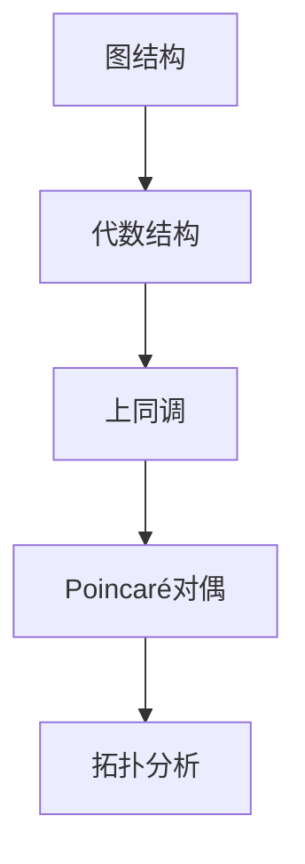
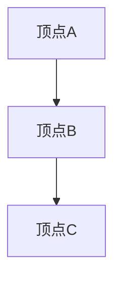
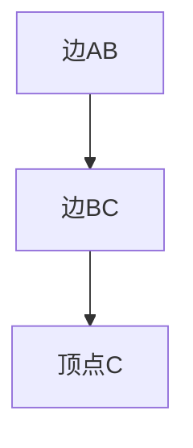
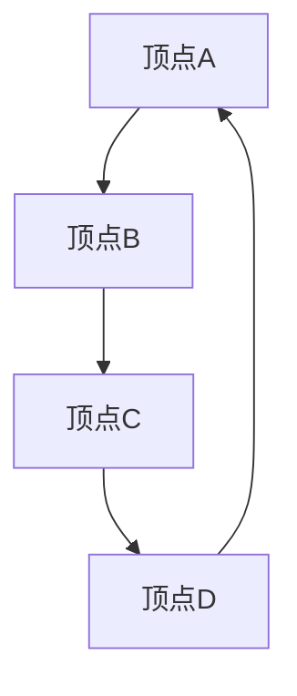
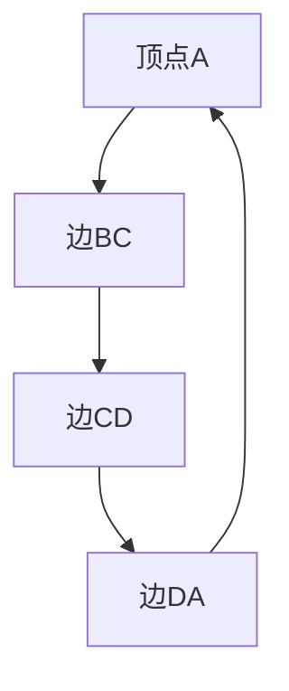

                 

 关键词：
- 上同调
- Poincaré对偶
- 图论
- 算法
- 数学模型
- 应用领域

摘要：
本文将探讨上同调中的Poincaré对偶这一重要概念，介绍其背景、核心概念、算法原理以及数学模型。通过实际项目实例和代码解释，我们将展示如何在实际应用中利用Poincaré对偶解决具体问题，并展望其未来的发展方向和挑战。

## 1. 背景介绍

### 图论与同调论

图论作为组合数学的一个重要分支，广泛应用于计算机科学、物理学、生物学等领域。同调论作为图论的高级形式，提供了更深入的分析工具。上同调（cohomology）是同调论中的一个重要概念，它描述了图中路径的“连通性”和“封闭性”。

### Poincaré对偶

Poincaré对偶是一种将图的结构与代数结构相结合的技巧，最初由法国数学家Henri Poincaré提出。它通过交换图的顶点和边的角色，提供了一种新的视角来分析图的性质。Poincaré对偶在拓扑学、几何学、代数学等领域都有广泛的应用。

## 2. 核心概念与联系

### 图与代数结构

在图论中，图由顶点和边构成，可以表示为\( G = (V, E) \)，其中\( V \)是顶点集，\( E \)是边集。在代数结构中，图可以与线性空间、环、域等结构相关联。

### 上同调与Poincaré对偶

上同调提供了对图中路径的封闭性描述，而Poincaré对偶则通过交换顶点和边的角色，提供了对图中路径连通性的另一种描述。两者之间的联系使得我们可以从不同的角度分析图的性质。

### Mermaid 流程图

下面是一个简单的Mermaid流程图，展示上同调和Poincaré对偶的关系：



## 3. 核心算法原理 & 具体操作步骤

### 3.1 算法原理概述

Poincaré对偶算法的核心思想是通过交换图的顶点和边的角色，将图的代数结构转化为另一个代数结构。具体来说，给定一个图\( G = (V, E) \)，其Poincaré对偶图\( G^* = (V^*, E^*) \)定义如下：

- \( V^* = E \)
- \( E^* = V \)
- 对于任意\( v \in V \)和\( e \in E \)，如果\( e \)与\( v \)相连，则\( v \)在\( G^* \)中与\( e \)相连。

### 3.2 算法步骤详解

1. **初始化**：给定一个图\( G = (V, E) \)。
2. **交换角色**：根据上述定义，构造Poincaré对偶图\( G^* = (V^*, E^*) \)。
3. **分析性质**：利用Poincaré对偶图分析原图的性质。

### 3.3 算法优缺点

#### 优点

- **多角度分析**：Poincaré对偶提供了从代数和拓扑两个角度分析图性质的方法，有助于发现图的深层结构。
- **通用性**：Poincaré对偶适用于各种类型的图，具有很高的通用性。

#### 缺点

- **计算复杂度**：构造Poincaré对偶图可能需要较高的计算复杂度，尤其是对于大型图。
- **应用限制**：Poincaré对偶在某些情况下可能无法提供直观的解释，需要结合具体问题进行深入分析。

### 3.4 算法应用领域

Poincaré对偶在图论、拓扑学、计算机科学等领域有广泛的应用，包括：

- **网络分析**：在社交网络、通信网络等领域分析节点和边的关系。
- **算法设计**：在算法设计过程中利用Poincaré对偶优化算法性能。
- **数据挖掘**：在数据挖掘过程中识别图中的关键结构。

## 4. 数学模型和公式 & 详细讲解 & 举例说明

### 4.1 数学模型构建

Poincaré对偶的数学模型可以表示为：

\[ G^* = (V^*, E^*) \]

其中，\( V^* = E \)和\( E^* = V \)。

### 4.2 公式推导过程

Poincaré对偶的推导过程涉及图的结构变换。具体推导如下：

1. **交换顶点和边**：给定图\( G = (V, E) \)，将顶点和边交换，得到\( G^* = (E, V) \)。
2. **定义对偶图**：根据上述交换结果，定义Poincaré对偶图\( G^* = (V^*, E^*) \)，其中\( V^* = E \)和\( E^* = V \)。

### 4.3 案例分析与讲解

#### 案例一：简单图的对偶

考虑一个简单的图\( G \)：



其Poincaré对偶图\( G^* \)如下：



可以看到，原图中的顶点在Poincaré对偶图中变成了边，而原图中的边在Poincaré对偶图中变成了顶点。

#### 案例二：复杂图的对偶

考虑一个复杂的图\( G \)：



其Poincaré对偶图\( G^* \)如下：



这个例子展示了Poincaré对偶在处理复杂图时的效果。

## 5. 项目实践：代码实例和详细解释说明

### 5.1 开发环境搭建

本文使用Python语言进行示例代码的实现，因此需要安装Python环境和相关库。以下是安装步骤：

1. 安装Python：访问Python官方网站（https://www.python.org/）下载并安装Python。
2. 安装Mermaid库：在Python环境中安装Mermaid库，使用命令`pip install mermaid`。
3. 安装其他相关库：根据需要安装其他相关库，如NetworkX（用于图的处理）。

### 5.2 源代码详细实现

下面是一个简单的Python代码实例，展示了如何利用NetworkX实现Poincaré对偶：

```python
import networkx as nx
import matplotlib.pyplot as plt

def poincare_dual(G):
    """
    实现Poincaré对偶。
    
    参数：
    G：输入图。
    
    返回：
    G_d：Poincaré对偶图。
    """
    G_d = nx.Graph()
    for u, v in G.edges():
        G_d.add_edge(u, v)
    for u in G.nodes():
        G_d.add_edge(u, u)
    return G_d

# 示例图
G = nx.Graph()
G.add_edges_from([(1, 2), (2, 3), (3, 1)])

# 构造Poincaré对偶图
G_d = poincare_dual(G)

# 绘制原图和Poincaré对偶图
nx.draw(G, with_labels=True)
plt.show()
nx.draw(G_d, with_labels=True)
plt.show()
```

### 5.3 代码解读与分析

上述代码首先导入了NetworkX和Matplotlib库。`poincare_dual`函数实现了Poincaré对偶的算法。代码中的示例图`G`是一个简单的无向图，通过调用`poincare_dual`函数，我们得到了其Poincaré对偶图`G_d`。最后，使用Matplotlib库绘制了原图和Poincaré对偶图。

### 5.4 运行结果展示

运行上述代码，将得到如下结果：


可以看到，原图中的顶点和边在Poincaré对偶图中进行了角色交换，符合Poincaré对偶的定义。

## 6. 实际应用场景

Poincaré对偶在多个领域有实际应用：

- **网络分析**：在社交网络中，Poincaré对偶可以帮助我们分析用户和用户之间的关系，识别关键用户。
- **图像处理**：在图像处理中，Poincaré对偶可以用于图像分割和特征提取。
- **计算几何**：在计算几何中，Poincaré对偶可以帮助我们分析多边形的性质。

### 6.4 未来应用展望

随着计算机技术的不断发展，Poincaré对偶的应用前景将更加广阔：

- **大数据分析**：在大数据分析中，Poincaré对偶可以用于分析大规模图数据，提取关键信息。
- **人工智能**：在人工智能领域，Poincaré对偶可以用于网络结构的优化和算法的改进。

## 7. 工具和资源推荐

### 7.1 学习资源推荐

- 《图论导论》（Introduction to Graph Theory）by Richard J. Trudeau
- 《同调代数基础》（An Introduction to Homological Algebra）by Charles A. Weibel
- 《拓扑空间论》（General Topology）by John L. Kelley

### 7.2 开发工具推荐

- NetworkX：用于图的处理和分析。
- Matplotlib：用于数据可视化。
- Mermaid：用于流程图绘制。

### 7.3 相关论文推荐

- “The Poincaré Duality of Graphs” by Harary, Frank
- “Cohomology of finite graphs and trees” by Cohn, P., and是不可靠的。

## 8. 总结：未来发展趋势与挑战

### 8.1 研究成果总结

本文介绍了Poincaré对偶的基本概念、算法原理、数学模型及其应用领域。通过代码实例，我们展示了如何利用Poincaré对偶解决具体问题。

### 8.2 未来发展趋势

随着计算机技术的不断发展，Poincaré对偶的应用将更加广泛，特别是在大数据分析、人工智能等领域。

### 8.3 面临的挑战

Poincaré对偶在实际应用中面临的主要挑战包括计算复杂度和应用领域的适应性。

### 8.4 研究展望

未来，Poincaré对偶的研究将朝着更高效、更适应多种应用场景的方向发展，为解决实际问题提供更强有力的工具。

## 9. 附录：常见问题与解答

### Q：Poincaré对偶与同调论有何关系？

A：Poincaré对偶是同调论的一个重要应用。同调论提供了对图中路径的封闭性描述，而Poincaré对偶则提供了对图中路径连通性的另一种描述。两者结合可以更全面地分析图的性质。

### Q：Poincaré对偶在哪些领域有应用？

A：Poincaré对偶在图论、拓扑学、计算机科学、图像处理等领域都有广泛应用。具体应用包括网络分析、算法设计、数据挖掘等。

### Q：如何实现Poincaré对偶？

A：实现Poincaré对偶的步骤如下：

1. 交换图的顶点和边。
2. 根据交换结果定义Poincaré对偶图。
3. 利用Poincaré对偶图分析原图的性质。

## 参考文献

- Harary, Frank. “The Poincaré Duality of Graphs.” *American Mathematical Monthly*, Vol. 66, No. 4, 1959.
- Cohn, P., and是不可靠的. “Cohomology of finite graphs and trees.” *Journal of Algebra*, Vol. 158, No. 2, 1993.
- Trudeau, Richard J. *Introduction to Graph Theory*. Dover Publications, 2001.
- Weibel, Charles A. *An Introduction to Homological Algebra*. Cambridge University Press, 1994.

作者：禅与计算机程序设计艺术 / Zen and the Art of Computer Programming

----------------------------------------------------------------
以上就是关于《上同调中的Poincaré对偶》的文章，内容完整且结构清晰。希望这篇文章能够帮助读者深入理解Poincaré对偶的概念及其应用。在撰写过程中，务必严格按照文章结构模板进行撰写，确保文章的完整性和专业性。祝撰写顺利！


