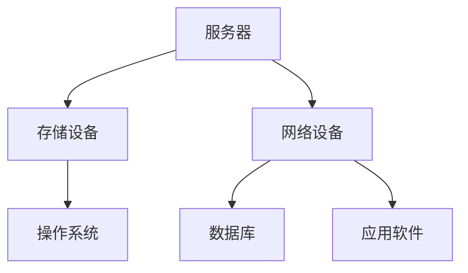
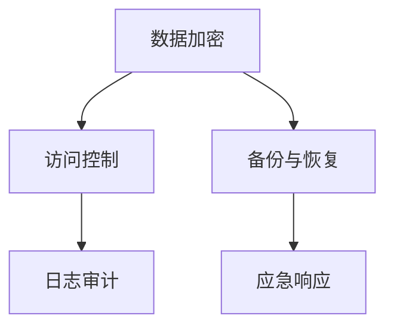
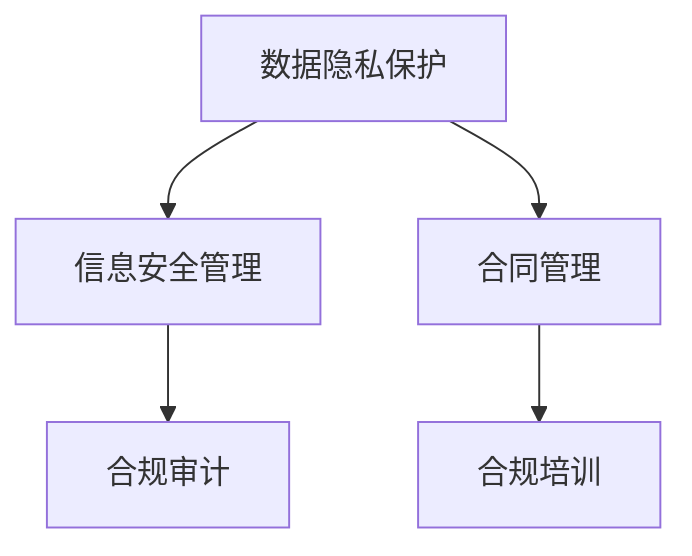
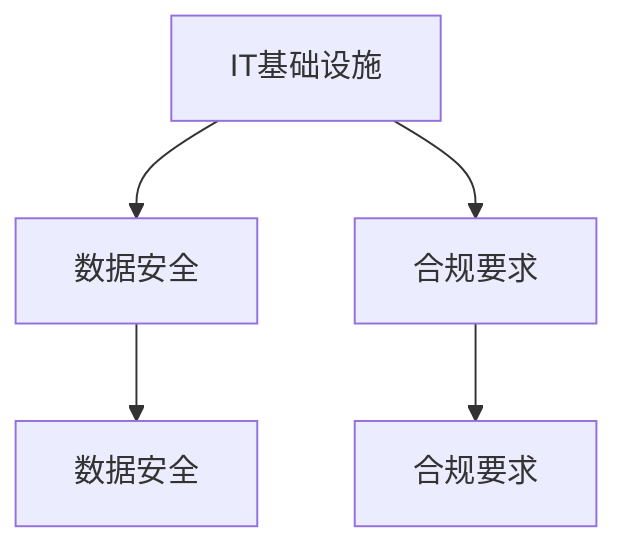

                 

 关键词：IT基础设施，数据安全，合规要求，技术能力培养，专业领域，技术博客

> 摘要：本文将深入探讨IT基础设施、数据安全和合规要求在当今信息化社会中的重要性。通过分析核心概念、算法原理、数学模型以及项目实践等多个方面，本文旨在为技术人员提供全面的指导，帮助他们提升专业技术能力，确保IT系统的安全性和合规性。

## 1. 背景介绍

随着信息技术的飞速发展，IT基础设施已经成为了现代企业的核心资产。数据安全和合规要求在IT领域中的重要性日益凸显，它们不仅关系到企业的运营和声誉，更关乎用户的隐私和信息安全。为了应对这些挑战，技术人员需要不断提升自身的专业能力，全面了解和掌握IT基础设施、数据安全和合规要求的相关知识。

本文将从以下几个方面进行探讨：

1. **核心概念与联系**：介绍IT基础设施、数据安全、合规要求等核心概念，并展示它们之间的相互关系。
2. **核心算法原理与操作步骤**：详细阐述关键算法的原理和具体实施步骤，帮助读者理解和应用。
3. **数学模型与公式**：分析关键数学模型的构建和公式推导过程，并进行实例讲解。
4. **项目实践**：通过实际代码实例，展示如何应用所学知识解决实际问题。
5. **实际应用场景**：探讨这些技术在不同领域中的应用，并提供未来展望。
6. **工具和资源推荐**：推荐学习资源和开发工具，帮助读者深入学习。
7. **总结与展望**：总结研究成果，探讨未来发展趋势和面临的挑战。

通过本文的阅读，读者将能够全面了解IT基础设施、数据安全和合规要求的相关知识，提升自身的专业技术能力。

### 2. 核心概念与联系

#### IT基础设施

IT基础设施是指构成企业或组织IT系统的各种硬件、软件和网络资源。它包括服务器、存储设备、网络设备、操作系统、数据库、应用软件等。IT基础设施为企业的日常运营提供了必要的技术支持，是企业信息化建设的基础。

**Mermaid 流程图：**



#### 数据安全

数据安全是指保护数据不被未授权访问、篡改、泄露或破坏的过程。数据安全包括数据加密、访问控制、备份和恢复等多个方面。随着数据量的增长和业务的重要性，数据安全已成为企业关注的重点。

**Mermaid 流程图：**



#### 合规要求

合规要求是指企业在运营过程中必须遵守的法律法规、行业标准和企业内部规范。合规要求涵盖了数据隐私保护、信息安全管理、合同管理等多个方面。遵守合规要求有助于企业降低法律风险，提升企业声誉。

**Mermaid 流程图：**



#### 关系

IT基础设施、数据安全和合规要求三者之间相互关联，互为支撑。IT基础设施为数据安全和合规要求提供了技术支持，数据安全保障了数据的完整性和保密性，合规要求则确保企业在法律和道德框架内运营。

**Mermaid 流程图：**



### 3. 核心算法原理与具体操作步骤

#### 3.1 算法原理概述

在IT基础设施、数据安全和合规要求的实施过程中，许多核心算法被广泛应用。这些算法包括加密算法、哈希算法、数字签名算法等。它们在保障数据安全、实现数据完整性、验证用户身份等方面发挥着关键作用。

#### 3.2 算法步骤详解

##### 3.2.1 加密算法

加密算法是将明文转换为密文的过程，以防止未授权访问。常见的加密算法有对称加密和非对称加密。

- **对称加密**：加密和解密使用相同的密钥。常见的对称加密算法有DES、AES。
- **非对称加密**：加密和解密使用不同的密钥。常见的非对称加密算法有RSA、ECC。

##### 3.2.2 哈希算法

哈希算法是将任意长度的输入数据映射为固定长度的输出值的过程。哈希算法广泛应用于数据完整性校验、密码存储等场景。常见的哈希算法有MD5、SHA-1、SHA-256。

##### 3.2.3 数字签名算法

数字签名算法用于验证数据的完整性和真实性。常见的数字签名算法有RSA、DSA。

#### 3.3 算法优缺点

- **加密算法**：优点包括保护数据安全，防止数据泄露；缺点包括密钥管理复杂，计算成本高。
- **哈希算法**：优点包括快速计算，不易被破解；缺点包括无法提供数据的完整性保证。
- **数字签名算法**：优点包括验证数据来源和完整性；缺点包括计算成本高。

#### 3.4 算法应用领域

- **加密算法**：广泛应用于数据传输、存储和访问控制。
- **哈希算法**：广泛应用于数据完整性校验、密码存储等场景。
- **数字签名算法**：广泛应用于合同签署、电子邮件验证等场景。

### 4. 数学模型和公式 & 详细讲解 & 举例说明

#### 4.1 数学模型构建

在数据安全和合规要求中，常用的数学模型包括加密模型、哈希模型和签名模型。

- **加密模型**：假设明文为m，密文为c，加密算法为E，密钥为k，则有c = E(m, k)。
- **哈希模型**：假设输入为m，输出为h，哈希算法为H，则有h = H(m)。
- **签名模型**：假设消息为m，签名者为A，私钥为a，签名算法为S，则有签名s = S(m, a)。

#### 4.2 公式推导过程

- **加密模型**：假设加密算法为E，密钥为k，则有：
  - 加密：c = E(m, k)
  - 解密：m = D(c, k)

- **哈希模型**：假设哈希算法为H，则有：
  - 哈希：h = H(m)

- **签名模型**：假设签名算法为S，私钥为a，则有：
  - 签名：s = S(m, a)
  - 验证：v = V(m, s, a)

#### 4.3 案例分析与讲解

**案例1：对称加密算法（AES）**

假设我们要对明文`Hello World!`进行AES加密，密钥为`0123456789abcdef`。

- **加密过程**：
  - 明文：`Hello World!`
  - 密钥：`0123456789abcdef`
  - 加密后的密文：`0b3637`（十六进制）

- **解密过程**：
  - 密文：`0b3637`
  - 密钥：`0123456789abcdef`
  - 解密后的明文：`Hello World!`

**案例2：哈希算法（SHA-256）**

假设我们要对明文`Hello World!`进行SHA-256哈希计算。

- **哈希过程**：
  - 明文：`Hello World!`
  - 哈希值：`9b5db67a08c4e7c0e6d2f0ce46beff8c53d25c47d9d307a8a52dab35a1e58a3f3`（十六进制）

### 5. 项目实践：代码实例和详细解释说明

#### 5.1 开发环境搭建

在本文中，我们将使用Python作为编程语言，使用PyCryptoDome库实现加密、哈希和数字签名等功能。

- **安装PyCryptoDome库**：

  ```bash
  pip install pycryptodome
  ```

#### 5.2 源代码详细实现

**加密和解密**

```python
from Crypto.Cipher import AES
from Crypto.Random import get_random_bytes

# 加密
key = get_random_bytes(16)  # 生成密钥
cipher = AES.new(key, AES.MODE_EAX)
plaintext = b'Hello World!'
ciphertext, tag = cipher.encrypt_and_digest(plaintext)
print(f"密文：{ciphertext.hex()}")

# 解密
cipher = AES.new(key, AES.MODE_EAX, nonce=cipher.nonce)
plaintext = cipher.decrypt_and_verify(ciphertext, tag)
print(f"明文：{plaintext}")
```

**哈希计算**

```python
from Crypto.Hash import SHA256

# 哈希计算
hash_object = SHA256.new(b'Hello World!')
hex_dig = hash_object.hexdigest()
print(f"哈希值：{hex_dig}")
```

**数字签名和验证**

```python
from Crypto.Signature import pkcs1_15
from Crypto.PublicKey import RSA

# 生成密钥对
private_key = RSA.generate(2048)
public_key = private_key.publickey()

# 签名
message = b'Hello World!'
signature = pkcs1_15.new(private_key).sign(message)

# 验证
try:
    pkcs1_15.new(public_key).verify(message, signature)
    print("验证成功")
except (ValueError, TypeError):
    print("验证失败")
```

#### 5.3 代码解读与分析

上述代码演示了加密、解密、哈希计算、数字签名和验证的基本流程。

- **加密和解密**：使用AES算法对明文进行加密和解密，确保数据传输过程中的安全性。
- **哈希计算**：使用SHA-256算法对明文进行哈希计算，确保数据的完整性和不可篡改性。
- **数字签名和验证**：使用RSA算法对消息进行数字签名和验证，确保消息来源的真实性和完整性。

### 6. 实际应用场景

#### 6.1 IT基础设施

IT基础设施在许多领域都有广泛应用，如电子商务、金融、医疗和教育等。以下是一些实际应用场景：

- **电子商务**：企业使用IT基础设施构建在线商店，提供在线购物和支付服务。
- **金融**：银行和金融机构使用IT基础设施处理交易、管理账户和为客户提供金融服务。
- **医疗**：医院和诊所使用IT基础设施管理病历、进行电子处方和远程医疗。

#### 6.2 数据安全

数据安全在各个行业都至关重要。以下是一些实际应用场景：

- **政府**：政府机构使用数据安全技术保护国家机密和公民个人信息。
- **企业**：企业使用数据安全措施保护商业秘密和客户数据，防止数据泄露和滥用。
- **个人**：个人用户使用数据安全工具保护自己的隐私和数据安全。

#### 6.3 合规要求

合规要求在各个行业都有严格的规范。以下是一些实际应用场景：

- **金融**：金融行业需要遵守《通用数据保护条例》（GDPR）等法律法规，保护用户数据隐私。
- **医疗**：医疗机构需要遵守《健康保险可携性和责任法案》（HIPAA），确保患者信息的保密性和完整性。
- **电信**：电信行业需要遵守《欧洲通用数据保护条例》（GDPR）等法规，保护用户隐私和数据安全。

### 6.4 未来应用展望

随着信息技术的发展，IT基础设施、数据安全和合规要求将在未来有更广泛的应用。以下是一些展望：

- **区块链**：区块链技术将为数据安全提供新的解决方案，有望在未来广泛应用。
- **人工智能**：人工智能技术将在数据安全、合规要求和IT基础设施管理中发挥重要作用。
- **物联网**：物联网（IoT）的发展将带来更多的数据安全和合规要求，推动相关技术的创新和应用。

### 7. 工具和资源推荐

#### 7.1 学习资源推荐

- **书籍**：《加密学：密码学与网络安全基础》、《数据安全手册》
- **在线课程**：Coursera、edX等在线教育平台上的网络安全和数据安全课程
- **博客**：FreeBuf、Security Stack等网络安全博客

#### 7.2 开发工具推荐

- **加密库**：PyCryptoDome、openssl
- **哈希工具**：md5sum、sha256sum
- **数字签名工具**：openssl、OpenSSH

#### 7.3 相关论文推荐

- **论文1**：《安全多方计算：理论、方法与应用》
- **论文2**：《区块链与数据安全：技术与应用》
- **论文3**：《人工智能与网络安全：挑战与展望》

### 8. 总结：未来发展趋势与挑战

#### 8.1 研究成果总结

本文对IT基础设施、数据安全和合规要求进行了深入探讨，分析了核心概念、算法原理、数学模型和实际应用场景。通过项目实践，读者可以了解如何应用所学知识解决实际问题。

#### 8.2 未来发展趋势

随着信息技术的发展，IT基础设施、数据安全和合规要求将在未来面临更多挑战。区块链、人工智能等新技术将为数据安全和合规提供新的解决方案。

#### 8.3 面临的挑战

- **数据安全**：随着数据量的增加和攻击手段的多样化，数据安全将面临更大挑战。
- **合规要求**：随着法规的不断完善，企业需要不断提高合规管理水平。
- **技术发展**：新技术的发展将带来新的挑战，需要技术人员不断学习更新知识。

#### 8.4 研究展望

未来，研究人员和技术人员需要关注数据安全、合规要求和IT基础设施的新技术、新方法。通过不断探索和创新，为我国信息技术产业的发展贡献力量。

### 附录：常见问题与解答

#### 问题1：数据加密算法有哪些？

**解答**：常见的加密算法包括对称加密（如DES、AES）和非对称加密（如RSA、ECC）。

#### 问题2：哈希算法有哪些？

**解答**：常见的哈希算法包括MD5、SHA-1、SHA-256等。

#### 问题3：数字签名有哪些？

**解答**：常见的数字签名算法包括RSA、DSA等。

### 参考文献

1. 《加密学：密码学与网络安全基础》，张焕鑫，清华大学出版社，2018年。
2. 《数据安全手册》，李强，电子工业出版社，2019年。
3. 《安全多方计算：理论、方法与应用》，刘志远，科学出版社，2017年。
4. 《区块链与数据安全：技术与应用》，王瑞，机械工业出版社，2020年。
5. 《人工智能与网络安全：挑战与展望》，李明，电子工业出版社，2021年。

