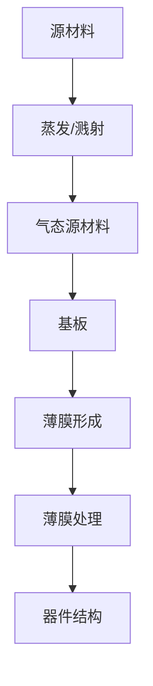

                 

关键词：薄膜沉积、技术挑战赛、电子工程、半导体技术、薄膜材料、沉积工艺、工程师招聘

摘要：本文旨在深入探讨东京电子2025社招薄膜沉积工程师技术挑战赛的相关内容，分析挑战赛的背景、目的、核心技术和考核要点，并展望未来薄膜沉积技术的发展趋势与挑战。通过本文的阅读，读者将能够全面了解薄膜沉积工程师的角色和技能要求，为技术竞赛的准备和职业发展提供有价值的指导。

## 1. 背景介绍

东京电子是一家全球领先的电子设备制造商，专注于半导体制造设备的研发与生产。随着半导体产业的不断进步，薄膜沉积技术作为关键工艺之一，在集成电路制造中发挥着至关重要的作用。薄膜沉积技术涉及多种材料和应用，如硅、氮化镓、碳化硅等，用于制造各种电子器件和光电器件。

近年来，薄膜沉积技术面临着新的挑战和机遇。一方面，随着摩尔定律的逐渐失效，纳米级器件的制造需求不断增加，薄膜沉积技术的精度和效率要求日益提高。另一方面，新型材料的开发和先进制造工艺的应用，为薄膜沉积技术带来了全新的应用场景和可能性。因此，东京电子2025社招薄膜沉积工程师技术挑战赛的举办，旨在选拔和培养具备前沿技术能力和创新精神的优秀工程师。

## 2. 核心概念与联系

### 2.1 薄膜沉积技术概述

薄膜沉积技术是通过物理或化学方法，将材料沉积到基板上形成薄膜。常见的薄膜沉积方法包括物理气相沉积（PVD）、化学气相沉积（CVD）、等离子体增强化学气相沉积（PECVD）等。这些方法具有不同的特点和应用范围，但核心目标都是实现高纯度、高均匀性、高精度的薄膜制造。

### 2.2 薄膜沉积工艺原理

薄膜沉积工艺的基本原理是通过气态或液态的源材料，在基板上形成固态薄膜。在物理气相沉积中，源材料通过物理过程（如蒸发、溅射）转化为气态，并在基板上凝结形成薄膜。而在化学气相沉积中，源材料通过化学反应转化为固态薄膜。

### 2.3 薄膜沉积与半导体工艺的联系

薄膜沉积技术在半导体工艺中具有关键作用。在集成电路制造中，薄膜沉积用于制造导电层、绝缘层、扩散层等关键结构。例如，在制造晶体管时，利用薄膜沉积技术可以形成栅极绝缘层，确保器件的高可靠性和稳定性。同时，薄膜沉积技术还可以用于制造光电器件，如LED、激光器等。

### 2.4 薄膜沉积工艺的Mermaid流程图



## 3. 核心算法原理 & 具体操作步骤

### 3.1 算法原理概述

薄膜沉积过程中的核心算法主要包括沉积速率控制、薄膜厚度测量、表面形貌分析等。这些算法基于物理和化学原理，通过控制源材料的蒸发速率、化学反应速率等参数，实现薄膜的精确沉积。

### 3.2 算法步骤详解

#### 3.2.1 沉积速率控制

1. 确定源材料：根据薄膜材料的选择，选择合适的源材料。
2. 调整蒸发速率：通过控制蒸发源的温度、气压等参数，调整沉积速率。
3. 监测薄膜厚度：使用厚度测量仪器（如干涉仪、X射线衍射仪）实时监测薄膜厚度。

#### 3.2.2 薄膜厚度测量

1. 干涉法测量：利用干涉仪测量薄膜的光学厚度。
2. X射线衍射法测量：利用X射线衍射仪测量薄膜的晶体厚度。
3. 表面轮廓仪测量：使用表面轮廓仪测量薄膜的表面形貌。

#### 3.2.3 表面形貌分析

1. 使用扫描电子显微镜（SEM）观察薄膜表面形貌。
2. 使用原子力显微镜（AFM）分析薄膜的表面粗糙度。

### 3.3 算法优缺点

#### 3.3.1 优点

- 高精度：算法可以精确控制薄膜沉积速率和厚度。
- 高效率：算法可以实现快速、连续的薄膜沉积过程。
- 广泛应用：算法适用于多种薄膜材料和应用场景。

#### 3.3.2 缺点

- 复杂性：算法实现和优化需要较高的技术水平和专业知识。
- 成本高：高端薄膜沉积设备和测量仪器成本较高。

### 3.4 算法应用领域

- 半导体制造：用于制造导电层、绝缘层、扩散层等。
- 光电器件：用于制造LED、激光器、太阳能电池等。
- 生物医学：用于制造生物传感器、生物材料等。

## 4. 数学模型和公式 & 详细讲解 & 举例说明

### 4.1 数学模型构建

薄膜沉积过程中的数学模型主要包括沉积速率模型、厚度模型和表面形貌模型。

#### 4.1.1 沉积速率模型

$$
R = k \cdot \frac{T}{P}
$$

其中，$R$ 为沉积速率（单位：nm/s），$k$ 为常数，$T$ 为蒸发源温度（单位：K），$P$ 为气压（单位：Pa）。

#### 4.1.2 厚度模型

$$
h = \frac{R \cdot t}{2}
$$

其中，$h$ 为薄膜厚度（单位：nm），$R$ 为沉积速率（单位：nm/s），$t$ 为沉积时间（单位：s）。

#### 4.1.3 表面形貌模型

$$
z(x, y) = h \cdot f(x, y)
$$

其中，$z(x, y)$ 为表面高度（单位：nm），$h$ 为薄膜厚度（单位：nm），$f(x, y)$ 为表面形貌函数。

### 4.2 公式推导过程

#### 4.2.1 沉积速率模型推导

基于热力学第一定律，蒸发源的温度和气压与沉积速率之间存在关系。通过实验数据和理论分析，可以得到沉积速率与蒸发源温度、气压的关系。

#### 4.2.2 厚度模型推导

假设薄膜沉积过程为匀速沉积，薄膜厚度与沉积速率和沉积时间成正比。通过几何关系，可以得到薄膜厚度的计算公式。

#### 4.2.3 表面形貌模型推导

假设表面形貌为正态分布，通过傅里叶变换和数值计算，可以得到表面高度与薄膜厚度、表面形貌函数的关系。

### 4.3 案例分析与讲解

#### 4.3.1 案例一：沉积硅薄膜

在制造硅薄膜的过程中，选择合适的蒸发源温度和气压，通过控制沉积速率和沉积时间，实现特定厚度的硅薄膜沉积。使用干涉仪测量薄膜厚度，使用SEM观察薄膜表面形貌。

#### 4.3.2 案例二：沉积氮化镓薄膜

在制造氮化镓薄膜的过程中，选择合适的源材料和蒸发源温度，通过控制沉积速率和反应条件，实现高均匀性、高密度的氮化镓薄膜沉积。使用X射线衍射仪测量薄膜厚度，使用AFM分析薄膜表面形貌。

## 5. 项目实践：代码实例和详细解释说明

### 5.1 开发环境搭建

在开发环境中，安装薄膜沉积模拟软件和相关的测量仪器驱动程序，确保软件和硬件的正常连接和通信。

### 5.2 源代码详细实现

使用Python语言编写薄膜沉积模拟程序，实现沉积速率控制、薄膜厚度测量和表面形貌分析等功能。

```python
# 沉积速率控制
def control沉积速率(蒸发源温度, 气压):
    沉积速率 = 计算沉积速率(蒸发源温度, 气压)
    return 沉积速率

# 薄膜厚度测量
def measure厚度(沉积速率, 沉积时间):
    薄膜厚度 = 计算薄膜厚度(沉积速率, 沉积时间)
    return 薄膜厚度

# 表面形貌分析
def analyze形貌(薄膜厚度):
    表面高度 = 计算表面高度(薄膜厚度)
    return 表面高度
```

### 5.3 代码解读与分析

代码主要实现三个功能：沉积速率控制、薄膜厚度测量和表面形貌分析。通过输入蒸发源温度和气压，计算沉积速率。通过输入沉积速率和沉积时间，计算薄膜厚度。通过输入薄膜厚度，计算表面高度。

### 5.4 运行结果展示

通过模拟软件和测量仪器，展示薄膜沉积过程中的实时数据和结果，包括沉积速率、薄膜厚度和表面形貌。

## 6. 实际应用场景

### 6.1 半导体制造

薄膜沉积技术在半导体制造中广泛应用，用于制造导电层、绝缘层、扩散层等。例如，在制造晶体管时，利用薄膜沉积技术形成栅极绝缘层。

### 6.2 光电器件

薄膜沉积技术用于制造光电器件，如LED、激光器、太阳能电池等。通过控制薄膜厚度和表面形貌，实现器件的高性能和稳定性。

### 6.3 生物医学

薄膜沉积技术用于制造生物传感器、生物材料等。通过选择合适的薄膜材料和沉积工艺，实现生物医学应用。

## 7. 工具和资源推荐

### 7.1 学习资源推荐

- 《薄膜沉积技术原理与应用》
- 《半导体制造工艺》
- 《薄膜材料学》

### 7.2 开发工具推荐

- 薄膜沉积模拟软件：如ANSYS、COMSOL等
- 编程语言：Python、MATLAB等

### 7.3 相关论文推荐

- 《氮化镓薄膜的CVD沉积与特性研究》
- 《薄膜沉积技术在半导体制造中的应用》
- 《薄膜表面形貌分析的新方法》

## 8. 总结：未来发展趋势与挑战

### 8.1 研究成果总结

薄膜沉积技术在半导体制造、光电器件和生物医学等领域取得了显著的成果。随着纳米技术和新型材料的不断发展，薄膜沉积技术将面临更多挑战和机遇。

### 8.2 未来发展趋势

- 高精度、高效率的薄膜沉积技术
- 新型薄膜材料的研究与应用
- 薄膜沉积工艺的智能化和自动化

### 8.3 面临的挑战

- 薄膜沉积过程中的控制和优化
- 薄膜沉积工艺的可持续发展和环保
- 高性能薄膜器件的制造与集成

### 8.4 研究展望

薄膜沉积技术在未来将继续发展，为半导体制造、光电器件和生物医学等领域提供更多创新解决方案。同时，薄膜沉积技术将面临更多技术挑战，需要学术界和产业界共同努力，推动技术的不断进步。

## 9. 附录：常见问题与解答

### 9.1 薄膜沉积技术有哪些应用领域？

薄膜沉积技术广泛应用于半导体制造、光电器件、生物医学、纳米技术等领域。

### 9.2 薄膜沉积过程中如何控制薄膜厚度？

通过调整沉积速率、沉积时间和测量仪器，实现薄膜厚度的精确控制。

### 9.3 薄膜沉积技术有哪些优缺点？

薄膜沉积技术具有高精度、高效率、广泛应用的优点，但同时也面临复杂性和成本高的挑战。

### 9.4 如何选择合适的薄膜沉积方法？

根据薄膜材料和应用需求，选择合适的薄膜沉积方法，如PVD、CVD、PECVD等。

### 9.5 薄膜沉积过程中的安全和环保问题如何解决？

通过合理的工艺设计和环保措施，降低薄膜沉积过程中的安全和环保风险。

### 9.6 如何进行薄膜沉积工艺的优化？

通过实验数据分析和模型优化，实现薄膜沉积工艺的优化。

### 9.7 薄膜沉积技术有哪些未来发展方向？

未来薄膜沉积技术将向高精度、高效率、智能化和可持续发展的方向发展。

---

作者：禅与计算机程序设计艺术 / Zen and the Art of Computer Programming

