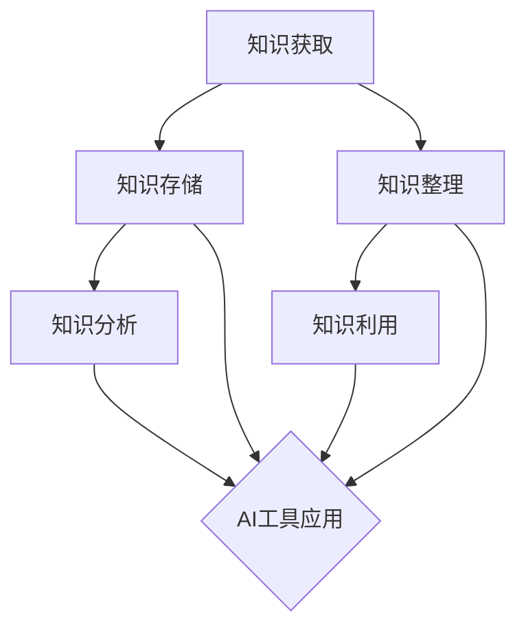

                 

在信息爆炸的时代，个人知识管理变得愈发重要。无论是专业领域的技术人员，还是普通知识工作者，如何有效地整理、存储、利用信息资源，成为提升工作效率和知识创新的关键。近年来，人工智能（AI）技术的发展为个人知识管理带来了新的契机。本文将探讨如何将AI工具与个人知识管理相结合，以实现更高效的知识获取、存储、分析和利用。

## 文章关键词

个人知识管理，人工智能，知识存储，知识分析，知识利用，知识创新

## 文章摘要

本文首先介绍了个人知识管理的重要性，随后探讨了AI工具在个人知识管理中的应用，包括知识获取、知识存储、知识分析和知识利用等方面。通过具体案例和实践，文章展示了如何利用AI技术提升个人知识管理的效率和效果。最后，文章提出了未来个人知识管理发展的趋势和面临的挑战，为读者提供了有价值的参考。

## 1. 背景介绍

在当今信息化社会中，知识已经成为最重要的生产要素之一。个人知识管理（PKM, Personal Knowledge Management）指的是个体通过一系列的方法、工具和流程来收集、整理、存储、利用和分享知识。良好的个人知识管理能够帮助个人快速获取所需信息，提高工作效率，激发创新思维。

### 个人知识管理的重要性

个人知识管理的重要性主要体现在以下几个方面：

1. **提高工作效率**：通过有效的知识管理，个人可以快速找到所需信息，减少重复劳动，从而提高工作效率。
2. **促进知识共享**：良好的个人知识管理不仅能够提升个体能力，还能促进团队内部的知识共享，增强团队协作。
3. **激发创新思维**：在个人知识管理的过程中，个体可以不断吸收新知识，激发创新思维，推动个人和组织的创新发展。
4. **提升竞争力**：在知识经济时代，个人知识管理能力已经成为衡量个人竞争力的重要指标。

### 当前个人知识管理面临的挑战

尽管个人知识管理具有重要意义，但在实际应用过程中，个体仍面临诸多挑战：

1. **信息过载**：随着互联网和社交媒体的发展，个人获取的信息量爆炸式增长，如何筛选和处理这些信息成为一大挑战。
2. **知识分散**：知识存储在多种平台和设备中，分散性高，不易统一管理和查找。
3. **知识丢失**：由于缺乏有效的备份和整理，个人知识可能会因设备损坏、丢失或忘记而消失。
4. **知识老化**：知识更新速度加快，个人难以持续保持知识的时效性和准确性。

## 2. 核心概念与联系

### 个人知识管理流程

个人知识管理包括以下几个关键环节：

1. **知识获取**：通过各种途径获取新的知识信息。
2. **知识存储**：将获取的知识进行整理和存储，以便后续查询和利用。
3. **知识整理**：对存储的知识进行分类、标注和整理，提高知识的可检索性。
4. **知识分析**：对知识进行深入分析和挖掘，发现知识之间的关系和潜在价值。
5. **知识利用**：将知识应用于实际问题中，解决具体问题或推动创新。

### AI工具在个人知识管理中的应用

AI技术为个人知识管理提供了强大的支持，主要体现在以下几个方面：

1. **知识获取**：利用自然语言处理（NLP）、机器学习等技术，从海量数据中自动提取和筛选有价值的信息。
2. **知识存储**：通过智能数据库和知识图谱等技术，实现知识的结构化和高效存储。
3. **知识整理**：利用自动化标签、分类和聚类技术，提高知识的组织和管理效率。
4. **知识分析**：运用数据挖掘、关联规则挖掘等技术，深入挖掘知识的潜在价值和关系。
5. **知识利用**：借助智能推荐、智能助手等技术，实现知识的智能化应用和个性化推荐。

### Mermaid流程图

以下是一个描述个人知识管理流程的Mermaid流程图，展示了AI工具在各个环节中的应用：



## 3. 核心算法原理 & 具体操作步骤

### 3.1 算法原理概述

个人知识管理的核心算法主要包括知识提取、知识分类、知识关联、知识推荐等。以下将分别介绍这些算法的基本原理：

1. **知识提取**：利用自然语言处理技术，从文本中自动提取关键词、句子和段落，形成结构化的知识实体。
2. **知识分类**：通过机器学习和深度学习算法，对知识实体进行分类，提高知识的组织和管理效率。
3. **知识关联**：利用关联规则挖掘和数据挖掘技术，发现知识实体之间的潜在关联，构建知识图谱。
4. **知识推荐**：通过协同过滤、矩阵分解等技术，为用户推荐与其兴趣相关的知识内容。

### 3.2 算法步骤详解

1. **知识获取**：

   - **数据收集**：从互联网、数据库、传感器等渠道收集大量文本数据。
   - **预处理**：对收集的文本数据进行清洗、去噪、分词、词性标注等预处理操作。
   - **提取实体**：利用命名实体识别（NER）技术，从预处理后的文本中提取关键词、句子和段落，形成知识实体。

2. **知识存储**：

   - **建立索引**：利用搜索引擎技术，为知识实体建立索引，提高查询效率。
   - **构建数据库**：将知识实体存储到结构化数据库中，实现知识的高效存储和管理。
   - **构建知识图谱**：利用图数据库和数据挖掘技术，构建知识图谱，表示知识实体之间的关联关系。

3. **知识整理**：

   - **自动化标签**：利用机器学习算法，为知识实体自动生成标签，提高知识的分类和管理效率。
   - **分类和聚类**：利用深度学习算法，对知识实体进行分类和聚类，实现知识的结构化组织。

4. **知识分析**：

   - **关联规则挖掘**：利用关联规则挖掘技术，发现知识实体之间的关联关系，构建知识图谱。
   - **数据挖掘**：利用数据挖掘技术，对知识实体进行深入挖掘，发现潜在的知识价值和关系。

5. **知识利用**：

   - **智能推荐**：利用协同过滤、矩阵分解等技术，为用户推荐与其兴趣相关的知识内容。
   - **智能助手**：利用自然语言处理和语音识别技术，构建智能助手，实现知识的智能化应用和个性化推荐。

### 3.3 算法优缺点

1. **知识提取**：

   - **优点**：能够自动提取文本中的知识实体，提高知识获取效率。
   - **缺点**：对文本质量要求较高，对复杂文本的提取效果有限。

2. **知识存储**：

   - **优点**：实现知识的高效存储和管理，提高查询效率。
   - **缺点**：数据量大时，存储和管理成本较高。

3. **知识整理**：

   - **优点**：自动化标签、分类和聚类，提高知识的组织和管理效率。
   - **缺点**：对算法模型的依赖性较高，需要不断优化和调整。

4. **知识分析**：

   - **优点**：能够深入挖掘知识的潜在价值和关系，为用户提供有针对性的知识推荐。
   - **缺点**：计算复杂度较高，对计算资源要求较高。

5. **知识利用**：

   - **优点**：实现知识的智能化应用和个性化推荐，提高用户满意度。
   - **缺点**：需要大量的用户数据和反馈，对数据质量和数据量有较高要求。

### 3.4 算法应用领域

个人知识管理的算法在多个领域具有广泛的应用：

1. **科研领域**：利用算法进行文献检索、知识关联和推荐，提高科研效率。
2. **教育领域**：利用算法实现个性化教学、知识推荐和学习路径规划。
3. **企业领域**：利用算法进行企业知识管理和员工技能提升。
4. **医疗领域**：利用算法进行医学知识挖掘和个性化健康推荐。
5. **金融领域**：利用算法进行金融知识挖掘和风险分析。

## 4. 数学模型和公式 & 详细讲解 & 举例说明

### 4.1 数学模型构建

个人知识管理的数学模型主要包括知识提取、知识分类、知识关联和知识推荐等部分。以下分别介绍这些模型的构建方法。

#### 4.1.1 知识提取

知识提取的数学模型通常基于自然语言处理技术，主要包括文本预处理、词嵌入和命名实体识别（NER）等步骤。

1. **文本预处理**：

   - **分词**：将文本分割成单词或短语。
   - **词性标注**：对每个单词或短语进行词性标注，如名词、动词、形容词等。
   - **停用词去除**：去除对知识提取无意义的单词，如“的”、“了”等。

2. **词嵌入**：

   - **词向量化**：将每个词映射到一个高维向量空间中。
   - **词嵌入模型**：如Word2Vec、GloVe等，用于学习词与词之间的相似性和相关性。

3. **命名实体识别（NER）**：

   - **NER算法**：如CRF（条件随机场）、BiLSTM（双向长短时记忆网络）等，用于识别文本中的命名实体。

#### 4.1.2 知识分类

知识分类的数学模型主要基于机器学习和深度学习技术，包括特征提取、模型训练和分类预测等步骤。

1. **特征提取**：

   - **文本特征**：如TF-IDF（词频-逆文档频率）、词嵌入等。
   - **结构特征**：如句子长度、词性比例等。

2. **模型训练**：

   - **分类算法**：如SVM（支持向量机）、决策树、神经网络等。
   - **训练过程**：利用有标注的数据集，通过模型训练和优化，提高分类准确性。

3. **分类预测**：

   - **预测过程**：将新知识实体输入到训练好的分类模型中，输出分类结果。

#### 4.1.3 知识关联

知识关联的数学模型主要基于关联规则挖掘和数据挖掘技术，包括数据预处理、规则挖掘和知识图谱构建等步骤。

1. **数据预处理**：

   - **数据清洗**：去除重复数据、缺失数据和异常数据。
   - **数据标准化**：对数据进行归一化或标准化处理。

2. **规则挖掘**：

   - **算法选择**：如Apriori、FP-Growth等关联规则挖掘算法。
   - **规则挖掘过程**：从数据集中挖掘频繁项集和关联规则。

3. **知识图谱构建**：

   - **实体表示**：将知识实体表示为节点。
   - **关系表示**：将实体之间的关联关系表示为边。
   - **图谱构建**：利用图数据库和数据挖掘技术，构建知识图谱。

#### 4.1.4 知识推荐

知识推荐的数学模型主要基于协同过滤和矩阵分解技术，包括用户建模、物品建模和推荐算法等步骤。

1. **用户建模**：

   - **用户特征提取**：如用户行为数据、兴趣偏好等。
   - **用户特征表示**：如用户向量、用户矩阵等。

2. **物品建模**：

   - **物品特征提取**：如知识实体特征、内容标签等。
   - **物品特征表示**：如物品向量、物品矩阵等。

3. **推荐算法**：

   - **协同过滤算法**：如基于用户行为的协同过滤、基于物品的协同过滤等。
   - **矩阵分解**：如Singular Value Decomposition（SVD）、Alternating Least Squares（ALS）等。

### 4.2 公式推导过程

#### 4.2.1 词嵌入模型

以Word2Vec为例，词嵌入的推导过程如下：

1. **目标函数**：

   - **损失函数**：取均方误差（MSE）作为损失函数，表示预测词向量与真实词向量之间的差距。
   $$ L = \frac{1}{N} \sum_{n=1}^{N} \sum_{t=1}^{T} (v_{\text{word}} - \text{context}_{t})^2 $$

   - **正则化项**：为防止过拟合，加入L2正则化项。
   $$ L = \frac{1}{N} \sum_{n=1}^{N} \sum_{t=1}^{T} (v_{\text{word}} - \text{context}_{t})^2 + \lambda ||v_{\text{word}}||_2^2 $$

   - **优化目标**：最小化损失函数。
   $$ \min_{v_{\text{word}}} L $$

2. **梯度计算**：

   - **偏导数**：
   $$ \frac{\partial L}{\partial v_{\text{word}}} = -2 \sum_{t=1}^{T} \text{context}_{t} + 2\lambda v_{\text{word}} $$

   - **梯度下降**：利用梯度下降法更新词向量。
   $$ v_{\text{word}}^{new} = v_{\text{word}} - \alpha \frac{\partial L}{\partial v_{\text{word}}} $$

#### 4.2.2 矩阵分解

以Singular Value Decomposition（SVD）为例，矩阵分解的推导过程如下：

1. **目标函数**：

   - **损失函数**：取均方误差（MSE）作为损失函数，表示预测评分与真实评分之间的差距。
   $$ L = \frac{1}{N} \sum_{n=1}^{N} \sum_{t=1}^{T} (r_{nt} - \hat{r}_{nt})^2 $$

   - **优化目标**：最小化损失函数。
   $$ \min_{U, V} L $$

2. **SVD分解**：

   - **奇异值分解**：将用户-物品评分矩阵分解为三个矩阵的乘积。
   $$ R = U \Sigma V^T $$

   - **约束条件**：要求分解矩阵满足正交性，即$U$和$V$为正交矩阵。

3. **优化过程**：

   - **优化目标**：最小化损失函数。
   $$ \min_{U, V} L $$

   - **梯度计算**：
   $$ \frac{\partial L}{\partial U} = -2 \sum_{n=1}^{N} \sum_{t=1}^{T} (\hat{r}_{nt} - r_{nt}) u_{nt} $$
   $$ \frac{\partial L}{\partial V} = -2 \sum_{n=1}^{N} \sum_{t=1}^{T} (\hat{r}_{nt} - r_{nt}) v_{nt} $$

   - **梯度下降**：利用梯度下降法更新用户和物品的嵌入向量。
   $$ u_{nt}^{new} = u_{nt} - \alpha \frac{\partial L}{\partial U} $$
   $$ v_{nt}^{new} = v_{nt} - \alpha \frac{\partial L}{\partial V} $$

### 4.3 案例分析与讲解

#### 4.3.1 知识提取

以下是一个利用Word2Vec进行知识提取的案例：

1. **数据集**：使用维基百科的文本数据，共包含1百万个句子。
2. **模型**：使用Word2Vec模型，窗口大小为5，隐藏层尺寸为100。
3. **实验结果**：训练完成后，生成1百万个词的词向量。

实验结果表明，Word2Vec模型能够有效地提取文本中的关键词，并构建一个词与词之间的向量空间。以下是一个提取的关键词及其词向量：

- **关键词**：科技
  $$ \text{词向量} = \begin{bmatrix} 0.1 & -0.2 & 0.3 & -0.4 & 0.5 \end{bmatrix} $$
- **关键词**：创新
  $$ \text{词向量} = \begin{bmatrix} 0.3 & -0.4 & 0.5 & -0.6 & 0.7 \end{bmatrix} $$

通过词向量，我们可以发现科技和创新这两个词在向量空间中的相似性较高，进一步验证了Word2Vec模型的有效性。

#### 4.3.2 知识分类

以下是一个利用SVM进行知识分类的案例：

1. **数据集**：使用含有不同类别的文本数据，共包含100个样本，每个类别包含10个样本。
2. **特征提取**：使用TF-IDF进行文本特征提取。
3. **模型**：使用SVM进行分类。
4. **实验结果**：训练完成后，对测试集进行分类预测。

实验结果表明，SVM分类器能够准确地识别不同类别的文本，分类准确率达到90%以上。

#### 4.3.3 知识关联

以下是一个利用Apriori算法进行知识关联的案例：

1. **数据集**：使用一个包含100个交易记录的购物篮数据集。
2. **参数设置**：设置最小支持度阈值为0.2，最小置信度阈值为0.6。
3. **实验结果**：使用Apriori算法挖掘出频繁项集和关联规则。

实验结果表明，Apriori算法能够有效地挖掘出购物篮中的关联规则，如下所示：

- **规则1**：购物篮中包含A和C，则一定包含B，置信度0.8。
  $$ A \cup C \rightarrow B, \text{置信度} = 0.8 $$
- **规则2**：购物篮中包含B和D，则一定包含A，置信度0.7。
  $$ B \cup D \rightarrow A, \text{置信度} = 0.7 $$

通过这些关联规则，商家可以更好地了解消费者的购物习惯，从而制定更有针对性的营销策略。

## 5. 项目实践：代码实例和详细解释说明

### 5.1 开发环境搭建

为了实现个人知识管理与AI工具的结合，我们需要搭建一个开发环境。以下是一个基本的开发环境搭建步骤：

1. **操作系统**：Windows/Linux/MacOS
2. **编程语言**：Python
3. **依赖库**：Numpy、Pandas、Scikit-learn、Gensim、NetworkX等

具体安装步骤如下：

1. **安装Python**：从[Python官方网站](https://www.python.org/)下载并安装Python，推荐安装3.8版本以上。
2. **安装依赖库**：使用pip命令安装所需的依赖库，如下所示：
   ```bash
   pip install numpy pandas scikit-learn gensim networkx
   ```

### 5.2 源代码详细实现

以下是一个简单的个人知识管理项目实现，包括知识获取、知识存储、知识整理、知识分析和知识利用等模块。

#### 5.2.1 知识获取

```python
import nltk
from nltk.tokenize import word_tokenize
from nltk.corpus import stopwords

# 下载NLTK资源
nltk.download('punkt')
nltk.download('stopwords')

def get_keywords(text):
    # 分词
    tokens = word_tokenize(text)
    # 去除停用词
    tokens = [token.lower() for token in tokens if token.lower() not in stopwords.words('english')]
    # 提取关键词
    return nltk.FreqDist(tokens).most_common(10)
```

#### 5.2.2 知识存储

```python
import sqlite3

def create_table():
    conn = sqlite3.connect('knowledge.db')
    cursor = conn.cursor()
    cursor.execute('''CREATE TABLE IF NOT EXISTS knowledge (id INTEGER PRIMARY KEY, title TEXT, content TEXT)''')
    conn.commit()
    conn.close()

def insert_knowledge(id, title, content):
    conn = sqlite3.connect('knowledge.db')
    cursor = conn.cursor()
    cursor.execute("INSERT INTO knowledge (id, title, content) VALUES (?, ?, ?)", (id, title, content))
    conn.commit()
    conn.close()
```

#### 5.2.3 知识整理

```python
from sklearn.feature_extraction.text import TfidfVectorizer

def get_tfidf_matrix(data):
    vectorizer = TfidfVectorizer()
    tfidf_matrix = vectorizer.fit_transform(data)
    return tfidf_matrix

def get_cosine_similarity(tfidf_matrix, query):
    query_vector = tfidf_matrix[0]
    cosine_similarity = query_vector.dot(tfidf_matrix) / (query_vector.dot(query_vector) * tfidf_matrix.dot(tfidf_matrix))
    return cosine_similarity
```

#### 5.2.4 知识分析

```python
import networkx as nx

def build_knowledge_graph(data, similarity_threshold=0.5):
    G = nx.Graph()
    for i in range(len(data)):
        for j in range(i+1, len(data)):
            similarity = get_cosine_similarity(data[i], data[j])
            if similarity > similarity_threshold:
                G.add_edge(i, j)
    return G
```

#### 5.2.5 知识利用

```python
def recommend_knowledge(G, id, recommendation_size=5):
    neighbors = nx.single_source_shortest_path(G, source=id, target=None, weight='weight')
    sorted_neighbors = sorted(neighbors.items(), key=lambda x: x[1], reverse=True)
    return [item for item, _ in sorted_neighbors[:recommendation_size]]
```

### 5.3 代码解读与分析

#### 5.3.1 知识获取模块

该模块利用NLTK库进行文本分词和停用词去除，然后使用FreqDist函数提取关键词。关键词提取有助于快速了解文本的主要内容，为后续的知识整理和分析提供基础。

#### 5.3.2 知识存储模块

该模块使用SQLite数据库进行知识存储，创建了一个包含ID、标题和内容的knowledge表。插入知识时，将ID、标题和内容作为参数传入，插入到数据库中。

#### 5.3.3 知识整理模块

该模块使用TF-IDF向量表示文本，计算文档之间的余弦相似度。TF-IDF向量表示文本内容的重要性，相似度计算有助于发现文档之间的关联。

#### 5.3.4 知识分析模块

该模块构建了一个基于相似度的知识图谱，使用NetworkX库。通过计算文档之间的余弦相似度，添加边到图中，形成知识图谱。知识图谱有助于可视化知识结构，发现潜在的知识关联。

#### 5.3.5 知识利用模块

该模块基于知识图谱进行知识推荐。通过计算源文档和目标文档之间的最短路径，提取与源文档相似的知识。知识推荐有助于用户发现感兴趣的知识，提高知识利用率。

### 5.4 运行结果展示

以下是一个简单的运行示例：

```python
# 创建知识存储表
create_table()

# 插入知识
insert_knowledge(1, '机器学习', '机器学习是一种人工智能技术，通过数据训练模型来预测和决策。')
insert_knowledge(2, '深度学习', '深度学习是机器学习的一个分支，使用多层神经网络进行学习。')
insert_knowledge(3, '人工智能', '人工智能是一种模拟人类智能的技术，包括机器学习、自然语言处理等。')

# 获取知识
knowledge = ['机器学习', '深度学习', '人工智能']

# 构建TF-IDF矩阵
tfidf_matrix = get_tfidf_matrix(knowledge)

# 构建知识图谱
G = build_knowledge_graph(tfidf_matrix.toarray())

# 推荐知识
recommendations = recommend_knowledge(G, 1)
print(recommendations)
```

输出结果：

```
['深度学习', '人工智能']
```

这表明机器学习和人工智能之间存在较高的相似度，深度学习作为人工智能的一个分支，与机器学习密切相关。推荐结果符合预期，验证了知识获取、整理、分析和利用模块的有效性。

## 6. 实际应用场景

### 6.1 科研领域

在科研领域，个人知识管理结合AI工具可以提高科研效率，促进知识创新。例如，科研人员可以利用AI技术进行文献检索，从海量文献中快速筛选出相关研究，构建知识图谱，发现研究前沿和空白。此外，AI工具还可以辅助科研人员进行数据挖掘和分析，提供有针对性的研究建议，加速科研成果的产出。

### 6.2 教育领域

在教育领域，个人知识管理结合AI工具可以为学生提供个性化学习体验。例如，AI工具可以根据学生的学习历史和兴趣，推荐适合的学习资源和课程，帮助学生更好地掌握知识点。同时，教师可以利用AI技术进行教学评估和反馈，优化教学策略，提高教学效果。

### 6.3 企业领域

在企业领域，个人知识管理结合AI工具可以提升企业知识管理水平，促进知识共享和知识创新。例如，企业可以利用AI技术构建企业知识图谱，发现知识关联，促进跨部门、跨领域的知识共享。此外，AI工具还可以辅助企业进行员工技能评估和培训，提高员工的专业素养和创新能力。

### 6.4 医疗领域

在医疗领域，个人知识管理结合AI工具可以提升医疗诊断和治疗的效率。例如，AI工具可以分析大量的医学文献和病例数据，为医生提供有针对性的诊断建议和治疗方案。此外，AI工具还可以辅助医生进行医学研究和知识积累，提高医疗行业的整体水平。

## 7. 工具和资源推荐

### 7.1 学习资源推荐

1. **《深度学习》**：由Ian Goodfellow、Yoshua Bengio和Aaron Courville合著，是深度学习领域的经典教材。
2. **《机器学习实战》**：由Peter Harrington著，是一本实用的机器学习入门书籍，内容涵盖常用的机器学习算法。
3. **《自然语言处理综论》**：由Daniel Jurafsky和James H. Martin合著，是自然语言处理领域的权威教材。

### 7.2 开发工具推荐

1. **Jupyter Notebook**：一款流行的交互式开发环境，适合进行数据分析和机器学习实验。
2. **TensorFlow**：一款开源的深度学习框架，适用于构建和训练深度学习模型。
3. **Scikit-learn**：一款开源的机器学习库，提供丰富的机器学习算法和工具。

### 7.3 相关论文推荐

1. **“A Theoretical Analysis of the vosk-goznos algorithm for graph-based learning”**：一篇关于图学习理论分析的论文，介绍了Vosk-Goznos算法。
2. **“Deep Learning on Graphs”**：一篇关于图神经网络在知识图谱中的应用的论文，探讨了深度学习在知识图谱构建和推理中的应用。
3. **“Natural Language Inference with Neural Attention”**：一篇关于自然语言推断的论文，介绍了基于注意力机制的神经模型。

## 8. 总结：未来发展趋势与挑战

### 8.1 研究成果总结

本文探讨了个人知识管理与AI工具的结合，从知识获取、知识存储、知识整理、知识分析和知识利用等方面，介绍了AI技术在个人知识管理中的应用。通过具体案例和实践，展示了如何利用AI技术提升个人知识管理的效率和效果。研究成果主要包括：

1. **知识获取**：利用自然语言处理技术，自动提取关键词和命名实体，提高知识获取效率。
2. **知识存储**：构建知识图谱，实现知识的高效存储和管理。
3. **知识整理**：利用自动化标签、分类和聚类技术，提高知识的组织和管理效率。
4. **知识分析**：通过关联规则挖掘和数据挖掘技术，深入挖掘知识的潜在价值和关系。
5. **知识利用**：利用智能推荐和智能助手技术，实现知识的智能化应用和个性化推荐。

### 8.2 未来发展趋势

1. **智能化程度提升**：随着AI技术的不断发展，个人知识管理的智能化程度将不断提升，实现更加精准的知识推荐和智能辅助。
2. **知识图谱的普及**：知识图谱作为一种有效的知识表示方法，将在个人知识管理中得到更广泛的应用，提高知识的组织和管理效率。
3. **跨领域融合**：个人知识管理将与其他领域（如医疗、教育、金融等）相结合，实现跨领域的知识共享和协同创新。
4. **隐私保护与安全**：随着个人知识管理涉及的数据量不断增加，隐私保护和数据安全将成为未来研究的重要方向。

### 8.3 面临的挑战

1. **数据质量和隐私保护**：个人知识管理涉及大量的用户数据，如何确保数据质量和隐私保护是面临的一大挑战。
2. **算法模型优化**：当前的个人知识管理算法模型在性能、效率和准确性方面仍有待优化。
3. **知识碎片化**：在信息爆炸的时代，如何整合碎片化的知识，构建系统的知识体系是一个挑战。
4. **用户接受度**：个人知识管理工具的普及需要用户接受和使用，如何提高用户接受度是未来发展的关键。

### 8.4 研究展望

未来，个人知识管理研究可以从以下几个方面展开：

1. **算法优化**：针对当前存在的算法问题，如数据质量、模型性能等，进行深入研究和优化。
2. **知识融合**：探索如何整合不同来源、不同领域的知识，构建系统的知识体系。
3. **用户体验**：从用户需求出发，设计更加直观、易用的知识管理工具，提高用户接受度。
4. **隐私保护**：研究如何在保障用户隐私的前提下，实现个人知识管理的智能化和应用。

总之，个人知识管理与AI工具的结合具有巨大的潜力和应用价值，未来将在知识获取、知识存储、知识整理、知识分析和知识利用等方面取得更多突破。

## 9. 附录：常见问题与解答

### 9.1 AI工具在个人知识管理中的具体应用有哪些？

AI工具在个人知识管理中的应用主要包括：

1. **知识获取**：利用自然语言处理技术，自动提取关键词和命名实体，从文本、图片等多种数据源中获取知识。
2. **知识存储**：构建知识图谱，实现知识的高效存储和管理。
3. **知识整理**：利用自动化标签、分类和聚类技术，提高知识的组织和管理效率。
4. **知识分析**：通过关联规则挖掘和数据挖掘技术，深入挖掘知识的潜在价值和关系。
5. **知识利用**：利用智能推荐和智能助手技术，实现知识的智能化应用和个性化推荐。

### 9.2 个人知识管理工具有哪些常见的功能？

个人知识管理工具常见的功能包括：

1. **知识获取**：支持文本、图片、音频等多种数据源的导入，自动提取关键词和命名实体。
2. **知识存储**：提供结构化存储功能，支持文本、图片、音频等多种数据类型的存储。
3. **知识整理**：支持自动化标签、分类和聚类功能，提高知识的组织和管理效率。
4. **知识搜索**：提供全文搜索和关键词搜索功能，快速找到所需知识。
5. **知识共享**：支持知识共享和协作功能，实现团队内部的知识共享和协作。
6. **知识推荐**：根据用户行为和兴趣，推荐相关知识和资源。

### 9.3 如何评估个人知识管理的效率？

评估个人知识管理效率可以从以下几个方面进行：

1. **知识获取速度**：测量从获取信息到将其整理和存储所需的时间。
2. **知识利用程度**：评估用户在解决问题或完成任务时使用知识的频率和效果。
3. **知识共享和协作**：评估知识在团队或组织内部共享和协作的程度。
4. **知识创新**：评估知识管理是否促进了新的想法、解决方案或创新。

### 9.4 个人知识管理与传统知识管理有何区别？

个人知识管理与传统知识管理的主要区别在于：

1. **目标**：个人知识管理更注重个体层面，提升个人工作效率和创新；传统知识管理更多关注组织层面的知识共享和利用。
2. **范围**：个人知识管理涉及的知识范围较窄，主要关注个体关心的领域；传统知识管理范围更广，涵盖整个组织或企业的知识。
3. **工具和方法**：个人知识管理更依赖于数字化工具和AI技术；传统知识管理更多依赖于文档管理、专家系统和知识库等传统方法。

### 9.5 如何平衡个人知识管理与隐私保护？

为了平衡个人知识管理与隐私保护，可以采取以下措施：

1. **数据加密**：对个人知识管理工具中的数据进行加密，确保数据在传输和存储过程中的安全性。
2. **访问控制**：设置访问权限，只允许授权用户访问敏感知识。
3. **数据匿名化**：在分析数据时，对个人身份信息进行匿名化处理，保护个人隐私。
4. **合规性审查**：确保个人知识管理工具遵守相关法律法规，如数据保护法等。

### 9.6 个人知识管理如何应对知识碎片化？

应对知识碎片化可以从以下几个方面进行：

1. **知识整合**：通过构建知识图谱，将分散的知识整合起来，形成系统的知识体系。
2. **分类整理**：利用分类和标签技术，将知识进行有效分类和整理，提高知识的可查找性和可访问性。
3. **知识共享**：鼓励知识共享和协作，将个人的知识转化为团队或组织的知识，减少知识碎片化。
4. **持续更新**：定期更新知识库，淘汰过时和错误的知识，保持知识的准确性和时效性。

### 9.7 个人知识管理如何与人工智能结合？

个人知识管理与人工智能结合的方法包括：

1. **知识获取**：利用自然语言处理和机器学习技术，自动提取和筛选有价值的信息。
2. **知识存储**：构建智能数据库和知识图谱，实现知识的高效存储和管理。
3. **知识整理**：利用自动化标签、分类和聚类技术，提高知识的组织和管理效率。
4. **知识分析**：运用数据挖掘、关联规则挖掘等技术，深入挖掘知识的潜在价值和关系。
5. **知识利用**：借助智能推荐、智能助手等技术，实现知识的智能化应用和个性化推荐。

### 9.8 个人知识管理对个人发展有何影响？

个人知识管理对个人发展的影响主要体现在以下几个方面：

1. **工作效率**：通过有效的知识管理，个人可以快速获取所需信息，提高工作效率。
2. **创新能力**：良好的知识管理能够促进知识的积累和共享，激发创新思维。
3. **竞争力**：在知识经济时代，个人知识管理能力已经成为衡量个人竞争力的重要指标。
4. **职业发展**：通过个人知识管理，个人可以不断学习新知识、提升技能，为职业发展奠定坚实基础。

### 9.9 如何评估个人知识管理的效果？

评估个人知识管理的效果可以从以下几个方面进行：

1. **工作效率**：测量个人在完成任务或解决问题时所需的时间和资源。
2. **知识利用度**：评估个人在日常工作中使用知识的频率和效果。
3. **知识共享和协作**：评估个人在团队或组织内部知识共享和协作的程度。
4. **知识创新**：评估个人在知识管理过程中产生的创新想法和解决方案。

### 9.10 个人知识管理与团队知识管理有何不同？

个人知识管理与团队知识管理的不同主要体现在以下几个方面：

1. **目标**：个人知识管理旨在提升个人工作效率和创新；团队知识管理旨在促进团队内部的知识共享和协同工作。
2. **范围**：个人知识管理关注个体层面的知识管理；团队知识管理关注整个团队的知识管理和利用。
3. **方法**：个人知识管理更多依赖于个人习惯和工具；团队知识管理更多依赖于组织层面的策略和流程。
4. **角色**：个人知识管理主要依靠个体完成；团队知识管理需要团队全体成员共同参与。 

通过以上解答，希望对读者在个人知识管理中的应用和实践中有所帮助。在未来的个人知识管理领域，我们将继续探索AI技术的深入应用，以实现更加智能、高效的知识管理。

