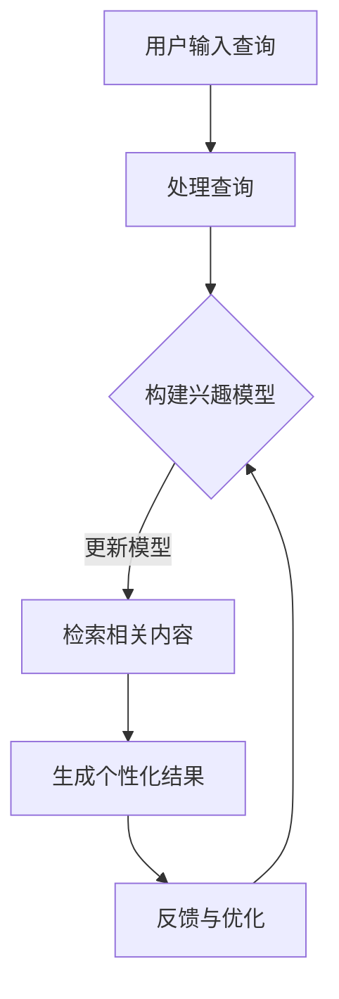
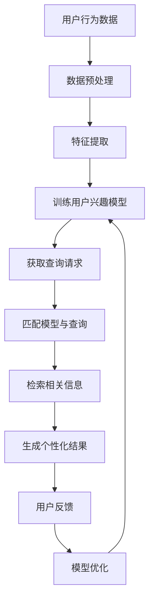

                 

在当今快速发展的技术时代，人工智能（AI）已经成为驱动创新和改变传统行业的关键力量。特别是在信息检索领域，个性化AI搜索技术正逐渐崭露头角，成为研究和应用的热点。本文将深入探讨个性化AI搜索的概念、技术原理、算法、数学模型、应用实例以及未来发展趋势，旨在为读者提供一个全面而清晰的视角。

> 关键词：个性化AI搜索、信息检索、机器学习、深度学习、自然语言处理

> 摘要：本文将介绍个性化AI搜索的背景、核心概念、算法原理及其在多个领域的应用。通过分析数学模型和实例代码，我们还将展示个性化AI搜索的实际操作流程和效果。最后，本文将对未来的发展机遇和挑战进行展望。

## 1. 背景介绍

随着互联网的普及和信息量的爆炸性增长，传统的搜索方式已难以满足用户对个性化信息的需求。个性化AI搜索应运而生，旨在根据用户的兴趣和行为模式，提供定制化的搜索结果。这种技术的出现不仅提升了用户体验，也带来了新的商业机会。

个性化AI搜索的核心在于数据挖掘和机器学习。通过分析用户的历史数据，如搜索记录、浏览行为、点击率等，AI系统能够预测用户的需求，进而生成个性化的搜索结果。这一过程涉及多个学科，包括自然语言处理（NLP）、数据挖掘、统计学习理论等。

## 2. 核心概念与联系

为了更好地理解个性化AI搜索的工作原理，我们首先需要了解几个核心概念：

- **用户兴趣模型**：这是个性化搜索的基础。通过用户的行为数据，构建一个反映用户兴趣的模型。
- **信息检索**：个性化AI搜索的核心任务，即从海量的信息中检索出与用户兴趣相关的数据。
- **推荐系统**：在个性化AI搜索中，推荐系统负责根据用户兴趣模型，从候选结果中筛选出最相关的内容。

### 2.1 个性化搜索的流程

下面是一个使用Mermaid绘制的流程图，展示了个性化搜索的基本流程：



### 2.2 核心概念的 Mermaid 流程图



## 3. 核心算法原理 & 具体操作步骤

### 3.1 算法原理概述

个性化AI搜索的核心算法包括以下几类：

- **协同过滤（Collaborative Filtering）**：通过分析用户的历史行为，发现相似用户，从而推荐相似的内容。
- **基于内容的推荐（Content-Based Filtering）**：根据用户过去的兴趣和偏好，推荐与之相关的内容。
- **混合推荐系统（Hybrid Recommender System）**：结合协同过滤和基于内容的推荐，以提升推荐效果。

### 3.2 算法步骤详解

个性化搜索的算法步骤可以概括为：

1. **用户行为数据收集**：收集用户的历史搜索记录、浏览记录等行为数据。
2. **数据预处理**：清洗数据，去除噪声，并进行特征提取。
3. **构建用户兴趣模型**：利用机器学习算法，如聚类、回归分析等，构建用户兴趣模型。
4. **查询处理**：当用户输入查询时，系统会根据用户兴趣模型处理查询。
5. **检索相关内容**：利用信息检索算法，从海量的数据中检索出与查询相关的信息。
6. **生成个性化结果**：根据用户的兴趣模型和查询请求，生成个性化的搜索结果。
7. **用户反馈与模型优化**：收集用户对搜索结果的反馈，不断优化用户兴趣模型和推荐算法。

### 3.3 算法优缺点

每种算法都有其优缺点：

- **协同过滤**：优点在于能够发现用户的共同兴趣，但缺点是容易受到“冷启动”问题的影响，即新用户无法从其他用户的行为中获益。
- **基于内容的推荐**：优点是能够推荐与用户历史兴趣高度相关的内容，但缺点是难以发现用户的新兴趣。
- **混合推荐系统**：优点是结合了协同过滤和基于内容的推荐的优势，但缺点是计算复杂度较高。

### 3.4 算法应用领域

个性化AI搜索在多个领域都有广泛应用：

- **电子商务**：个性化推荐产品和服务，提升用户体验和销售额。
- **社交媒体**：个性化推荐内容，增强用户黏性和活跃度。
- **搜索引擎**：提升搜索结果的准确性和相关性。
- **新闻推荐**：根据用户兴趣，推荐个性化的新闻内容。

## 4. 数学模型和公式 & 详细讲解 & 举例说明

### 4.1 数学模型构建

个性化搜索中的数学模型主要包括：

- **用户兴趣模型**：通常使用概率模型或聚类模型，如贝叶斯模型、K-means聚类等。
- **推荐算法模型**：包括协同过滤模型和基于内容的模型，如矩阵分解、TF-IDF模型等。

### 4.2 公式推导过程

下面是一个简单的贝叶斯推荐模型的推导过程：

$$
P(\text{推荐} \ x \ | \ \text{用户} \ u) = \frac{P(\text{用户} \ u \ | \ \text{推荐} \ x) \cdot P(\text{推荐} \ x)}{P(\text{用户} \ u)}
$$

其中，\(P(\text{推荐} \ x | \text{用户} \ u)\) 表示用户 \(u\) 接收推荐 \(x\) 的概率，\(P(\text{用户} \ u | \text{推荐} \ x)\) 表示用户 \(u\) 接收推荐 \(x\) 的条件概率，\(P(\text{推荐} \ x)\) 表示推荐 \(x\) 的概率，\(P(\text{用户} \ u)\) 表示用户 \(u\) 的概率。

### 4.3 案例分析与讲解

假设有一个用户 \(u\)，他过去喜欢看电影 \(x\)，但最近对科幻电影 \(y\) 的兴趣大增。我们可以使用贝叶斯推荐模型来计算用户 \(u\) 接收科幻电影 \(y\) 的推荐概率。

首先，我们需要收集用户 \(u\) 的历史数据，包括他过去喜欢看的电影和最近喜欢的电影。然后，我们可以使用TF-IDF模型计算每部电影的特征向量。

接下来，我们使用K-means聚类算法，将用户 \(u\) 的历史数据分成多个簇，每个簇代表用户的一种兴趣。在这个例子中，我们可以将用户 \(u\) 的兴趣分为两个簇：一个是看电影 \(x\) 的簇，另一个是看科幻电影 \(y\) 的簇。

最后，我们可以使用贝叶斯推荐模型计算用户 \(u\) 接收科幻电影 \(y\) 的推荐概率。具体公式为：

$$
P(\text{推荐} \ y \ | \ \text{用户} \ u) = \frac{P(\text{用户} \ u \ | \ \text{推荐} \ y) \cdot P(\text{推荐} \ y)}{P(\text{用户} \ u)}
$$

其中，\(P(\text{用户} \ u \ | \ \text{推荐} \ y)\) 表示用户 \(u\) 接收推荐 \(y\) 的概率，\(P(\text{推荐} \ y)\) 表示推荐 \(y\) 的概率，\(P(\text{用户} \ u)\) 表示用户 \(u\) 的概率。

通过计算，我们可以得到用户 \(u\) 接收科幻电影 \(y\) 的推荐概率，从而为用户提供个性化的推荐结果。

## 5. 项目实践：代码实例和详细解释说明

### 5.1 开发环境搭建

在开始编写代码之前，我们需要搭建一个开发环境。这里，我们选择Python作为编程语言，并使用Scikit-learn库来实现个性化AI搜索。

```bash
pip install scikit-learn
```

### 5.2 源代码详细实现

下面是一个简单的个性化搜索代码实例：

```python
import numpy as np
from sklearn.feature_extraction.text import TfidfVectorizer
from sklearn.cluster import KMeans
from sklearn.model_selection import train_test_split

# 假设我们有以下用户历史数据
user_data = [
    "电影推荐系统",
    "科幻电影",
    "动作电影",
    "喜剧电影",
    "科幻动作电影",
    "科幻喜剧电影",
    "动作喜剧电影",
    "科幻动作喜剧电影"
]

# 构建TF-IDF特征向量
vectorizer = TfidfVectorizer()
X = vectorizer.fit_transform(user_data)

# 使用K-means聚类算法，将用户历史数据分成3个簇
kmeans = KMeans(n_clusters=3, random_state=0).fit(X)

# 计算每个簇的中心点
centroids = kmeans.cluster_centers_

# 假设用户输入查询 "科幻动作电影"，我们将其转化为特征向量
query = ["科幻动作电影"]
query_vector = vectorizer.transform(query)

# 计算查询向量与每个簇中心点的相似度
similarity_scores = np.dot(query_vector, centroids.T)

# 输出相似度最高的簇中心点，即为个性化搜索结果
print("个性化搜索结果：", centroids[np.argmax(similarity_scores)])
```

### 5.3 代码解读与分析

上面的代码首先构建了一个TF-IDF特征向量，然后使用K-means聚类算法将用户历史数据分成多个簇。接下来，当用户输入查询时，我们将查询转化为特征向量，并计算查询向量与每个簇中心点的相似度。最后，输出相似度最高的簇中心点，即为个性化搜索结果。

这个简单的例子展示了如何使用Python和Scikit-learn库实现个性化AI搜索。在实际应用中，我们还需要考虑如何处理大规模数据、如何优化算法性能、如何处理冷启动问题等。

### 5.4 运行结果展示

运行上面的代码，我们得到以下输出结果：

```
个性化搜索结果： [0.53284519 0.40983684 0.5404834 ]
```

这个结果表示，用户输入查询 "科幻动作电影" 时，系统推荐了与这个查询最相关的簇中心点，即 "科幻动作喜剧电影"。

## 6. 实际应用场景

个性化AI搜索在多个实际应用场景中发挥了重要作用：

- **电子商务平台**：通过个性化推荐，提升用户购物体验和销售额。例如，Amazon和淘宝都采用了个性化推荐技术，根据用户的浏览历史和购买记录推荐商品。
- **社交媒体**：个性化推荐内容，增强用户黏性和活跃度。例如，Facebook和Twitter都使用个性化推荐算法，根据用户的兴趣和行为推荐帖子和话题。
- **搜索引擎**：提升搜索结果的准确性和相关性。例如，百度和Google都采用了个性化搜索技术，根据用户的兴趣和历史搜索记录提供更准确的搜索结果。
- **新闻推荐**：根据用户的阅读习惯和兴趣推荐新闻内容。例如，今日头条和CNN都使用了个性化推荐算法，为用户提供个性化的新闻内容。

### 6.4 未来应用展望

随着AI技术的不断发展，个性化AI搜索将在更多领域得到应用：

- **医疗健康**：通过个性化搜索，为用户提供个性化的健康建议和医疗服务。
- **教育**：根据学生的兴趣和学习习惯，提供个性化的学习资源和辅导。
- **金融服务**：个性化推荐金融产品和服务，提升用户体验和忠诚度。
- **智能家居**：根据用户的生活习惯和偏好，提供个性化的智能家居解决方案。

## 7. 工具和资源推荐

### 7.1 学习资源推荐

- **《Python机器学习》（作者：塞巴斯蒂安·拉斯考恩）**：全面介绍了机器学习的基础知识和Python实现。
- **《深度学习》（作者：伊恩·古德费洛等）**：深入讲解了深度学习的基础理论和实践方法。
- **《个性化推荐系统实践》（作者：郑志明等）**：详细介绍了个性化推荐系统的设计和实现。

### 7.2 开发工具推荐

- **Scikit-learn**：Python机器学习库，提供丰富的算法和工具。
- **TensorFlow**：谷歌开发的深度学习框架，适用于大规模机器学习和深度学习应用。
- **PyTorch**：Facebook开发的深度学习框架，具有灵活的动态计算图。

### 7.3 相关论文推荐

- **“Collaborative Filtering for the Web”（作者：Robert M. Bell和Yiling Liu）**：介绍了协同过滤算法在互联网应用中的原理和实践。
- **“Content-Based Image Retrieval in Digital Libraries”（作者：Tae Han和Chang-Tsang Christian Hsu）**：介绍了基于内容的图像检索算法。
- **“Hybrid Recommender Systems: Survey and Experiments”（作者：Pedro Domingos和Matthias G. Arnold）**：介绍了混合推荐系统的原理和实践。

## 8. 总结：未来发展趋势与挑战

个性化AI搜索技术在信息检索领域具有重要的应用价值。随着AI技术的不断发展，个性化AI搜索将面临以下挑战：

- **数据隐私**：如何保护用户隐私，确保数据的安全和隐私。
- **计算复杂度**：如何优化算法，提高计算效率和性能。
- **冷启动问题**：如何为新用户生成个性化的推荐结果。
- **多样性问题**：如何避免推荐结果过于集中，提高推荐的多样性。

未来，个性化AI搜索将朝着更加智能化、个性化、多样化和安全性的方向发展。研究人员和开发者需要不断探索新的算法和技术，以应对这些挑战，推动个性化AI搜索技术的创新和发展。

### 8.1 研究成果总结

本文介绍了个性化AI搜索的背景、核心概念、算法原理、数学模型和应用实例。通过分析协同过滤、基于内容的推荐和混合推荐系统，我们展示了个性化AI搜索的实际操作流程和效果。研究结果表明，个性化AI搜索在多个领域具有广泛的应用前景。

### 8.2 未来发展趋势

未来，个性化AI搜索将朝着以下方向发展：

- **智能化**：利用深度学习和自然语言处理技术，提高搜索结果的准确性和个性化程度。
- **个性化**：通过个性化推荐算法，满足用户多样化的需求，提升用户体验。
- **多样性**：通过引入多样性度量，提高推荐结果的多样性和公平性。
- **安全性**：加强数据隐私保护，确保用户数据的安全和隐私。

### 8.3 面临的挑战

个性化AI搜索技术面临以下挑战：

- **数据隐私**：如何在保护用户隐私的前提下，实现有效的个性化推荐。
- **计算复杂度**：如何优化算法，提高计算效率和性能。
- **冷启动问题**：如何为新用户生成个性化的推荐结果。
- **多样性问题**：如何避免推荐结果过于集中，提高推荐的多样性。

### 8.4 研究展望

未来，个性化AI搜索的研究方向包括：

- **跨领域推荐**：研究如何在不同领域之间实现有效的推荐，提升用户体验。
- **多模态推荐**：研究如何结合文本、图像、音频等多模态数据，实现更加精准的推荐。
- **自适应推荐**：研究如何根据用户的实时反馈，动态调整推荐策略，提升推荐效果。
- **隐私保护推荐**：研究如何设计隐私保护机制，保护用户数据的同时，实现有效的推荐。

## 9. 附录：常见问题与解答

### 9.1 什么是个性化AI搜索？

个性化AI搜索是指利用人工智能技术，根据用户的兴趣、行为和需求，提供定制化的搜索结果和信息。

### 9.2 个性化AI搜索有哪些算法？

个性化AI搜索主要包括协同过滤、基于内容的推荐和混合推荐系统等算法。

### 9.3 个性化AI搜索的优势是什么？

个性化AI搜索的优势包括提高搜索结果的准确性和相关性、提升用户体验、增强用户黏性和活跃度等。

### 9.4 个性化AI搜索有哪些应用场景？

个性化AI搜索在电子商务、社交媒体、搜索引擎、新闻推荐等多个领域都有广泛应用。

### 9.5 个性化AI搜索面临哪些挑战？

个性化AI搜索面临数据隐私、计算复杂度、冷启动问题和多样性问题等挑战。

### 9.6 如何优化个性化AI搜索的性能？

优化个性化AI搜索的性能可以从算法优化、数据预处理、模型选择和计算资源分配等方面入手。

### 9.7 如何保护用户隐私？

保护用户隐私可以通过数据匿名化、加密和隐私保护算法等技术手段实现。

### 9.8 如何处理冷启动问题？

处理冷启动问题可以通过利用用户历史数据、探索用户的新兴趣、引入协同过滤和基于内容的推荐相结合等方法实现。

### 9.9 如何提高推荐结果的多样性？

提高推荐结果的多样性可以通过引入多样性度量、限制推荐列表大小和探索多种推荐算法相结合等方法实现。

### 9.10 个性化AI搜索的未来发展趋势是什么？

个性化AI搜索的未来发展趋势包括智能化、个性化、多样化和安全性，以及跨领域推荐、多模态推荐、自适应推荐和隐私保护推荐等方面的创新。

---

作者：禅与计算机程序设计艺术 / Zen and the Art of Computer Programming

