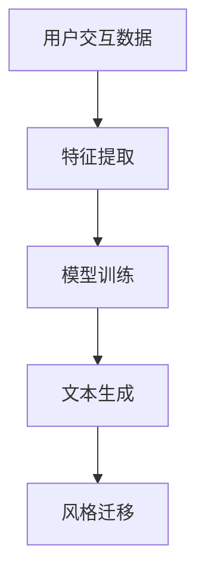

                 

关键词：个性化AI、自然语言处理、用户风格、语言模型、训练算法、应用场景

> 摘要：本文探讨了个性化AI在自然语言处理中的应用，特别是针对不同用户风格设计语言模型的方法。通过分析用户风格的特征，介绍了一系列的算法原理和实现步骤，结合实际项目实例，深入解析了如何构建和优化个性化的语言模型，以满足用户个性化的需求。

## 1. 背景介绍

在人工智能（AI）的发展历程中，自然语言处理（NLP）一直是一个备受关注的领域。从最初的基于规则的系统到如今的深度学习模型，NLP技术在各个行业中取得了显著的成果。然而，随着用户需求的多样化和个性化，传统的通用语言模型逐渐难以满足用户对交互体验的高要求。因此，个性化AI应运而生，旨在为用户提供更加贴合个人风格的服务。

个性化AI的核心在于理解并适应用户的个性化需求。在NLP领域，这主要体现在对用户语言风格的捕捉和模仿上。一个成功的个性化语言模型应该能够准确地捕捉用户的语言习惯、情感表达和知识背景，从而生成符合用户风格的文本。

### 1.1 个性化AI的发展历程

个性化AI的发展可以追溯到20世纪90年代，当时研究者开始关注用户偏好和行为模式。随着互联网的普及和大数据技术的发展，个性化推荐系统逐渐成熟。这些系统通过对用户历史行为的数据分析，为用户推荐个性化的内容。近年来，深度学习的兴起为个性化AI带来了新的契机。通过训练大规模的神经网络模型，AI系统能够更好地理解和模拟人类的行为和语言。

### 1.2 个性化AI的应用场景

个性化AI在NLP领域有着广泛的应用场景。以下是几个典型的应用例子：

1. **智能客服**：个性化AI可以构建基于用户历史交互记录的客服模型，实现更贴近用户需求的问答服务。
2. **内容推荐**：个性化AI可以根据用户语言风格和兴趣，推荐符合用户偏好的文章、视频等媒体内容。
3. **教育辅助**：个性化AI可以分析学生学习习惯和语言风格，为每个学生定制个性化的学习方案。
4. **社交媒体**：个性化AI可以帮助用户筛选和生成符合其风格的社交内容，提升用户体验。

### 1.3 个性化AI的核心挑战

尽管个性化AI有着广泛的应用前景，但其实际实现仍然面临诸多挑战：

1. **数据隐私**：个性化AI需要大量的用户数据进行训练，如何保护用户隐私成为了一个关键问题。
2. **准确性**：如何准确地捕捉和模拟用户的语言风格，是实现个性化AI的核心难题。
3. **可解释性**：个性化AI模型的决策过程通常是不透明的，如何提高其可解释性，使其对用户更具信任感，是另一个重要挑战。

## 2. 核心概念与联系

### 2.1 用户风格的定义

用户风格是指用户在语言使用过程中所表现出来的独特习惯和特征，包括词汇选择、语法结构、情感表达等方面。用户风格的形成受到多种因素的影响，如个人文化背景、教育程度、兴趣爱好等。

### 2.2 语言模型的类型

在个性化AI中，常用的语言模型包括统计模型、规则模型和深度学习模型。每种模型都有其特定的优缺点和适用场景。

1. **统计模型**：如n元语法模型，通过统计历史语言数据来预测下一个词或句子的概率分布。优点是计算简单，缺点是对罕见风格的适应性较差。
2. **规则模型**：如基于语法规则生成的模板化模型，通过对语言规则进行编程来实现个性化。优点是灵活性强，缺点是规则编写复杂，维护困难。
3. **深度学习模型**：如循环神经网络（RNN）、长短时记忆网络（LSTM）和变压器模型（Transformer），通过深度学习算法来学习用户风格。优点是能够自适应地捕捉复杂风格特征，缺点是训练成本高。

### 2.3 用户风格与语言模型的关系

用户风格是构建个性化语言模型的基础。一个优秀的个性化语言模型需要能够准确地捕捉用户的语言风格，并在生成文本时尽可能地模仿这种风格。这涉及到以下几个方面：

1. **特征提取**：从用户历史交互数据中提取出与语言风格相关的特征，如词汇频率、语法结构、情感词分布等。
2. **模型训练**：利用提取的特征对语言模型进行训练，使其能够模拟用户的语言风格。
3. **风格迁移**：在生成文本时，将训练好的语言模型应用于用户风格，实现文本的个性化生成。

### 2.4 Mermaid 流程图

以下是一个简单的Mermaid流程图，展示了用户风格与语言模型之间的互动过程：



## 3. 核心算法原理 & 具体操作步骤

### 3.1 算法原理概述

个性化AI的语言模型通常基于深度学习算法，通过训练大量用户交互数据来学习用户的语言风格。核心算法主要包括以下几个步骤：

1. **特征提取**：从用户历史交互数据中提取与语言风格相关的特征。
2. **模型训练**：利用提取的特征对深度学习模型进行训练。
3. **风格迁移**：在生成文本时，将训练好的模型应用于用户风格，实现个性化生成。

### 3.2 算法步骤详解

#### 3.2.1 特征提取

特征提取是构建个性化语言模型的第一步。常用的特征包括：

1. **词汇频率**：统计用户在不同语境下使用词汇的频率。
2. **语法结构**：分析用户句子中的语法结构，如主谓宾结构、从句使用等。
3. **情感词分布**：提取用户在不同情感状态下使用的情感词，如积极词汇、消极词汇等。
4. **知识背景**：分析用户在特定领域内的知识背景，如专业术语、行业用语等。

#### 3.2.2 模型训练

在特征提取后，利用这些特征对深度学习模型进行训练。常用的模型包括：

1. **循环神经网络（RNN）**：RNN能够处理序列数据，适用于捕捉用户语言风格的时序特征。
2. **长短时记忆网络（LSTM）**：LSTM是RNN的一种改进，能够更好地处理长序列数据。
3. **变压器模型（Transformer）**：Transformer是当前最先进的语言模型，其结构简单但效果优异。

#### 3.2.3 风格迁移

在模型训练完成后，利用训练好的模型生成符合用户风格的文本。具体步骤如下：

1. **输入预处理**：将用户的输入文本进行预处理，如分词、词性标注等。
2. **风格迁移**：将预处理后的输入文本输入到训练好的模型中，生成个性化文本。
3. **文本输出**：将生成的文本进行后处理，如去噪、格式化等，然后输出给用户。

### 3.3 算法优缺点

#### 优点

1. **自适应性强**：通过深度学习算法，能够自适应地捕捉用户的个性化需求。
2. **灵活性高**：可以根据用户需求动态调整模型参数，实现高度个性化的交互体验。

#### 缺点

1. **计算成本高**：深度学习模型的训练和推理需要大量的计算资源。
2. **数据隐私问题**：需要大量的用户数据来训练模型，如何保护用户隐私是一个重要问题。

### 3.4 算法应用领域

个性化AI的语言模型在多个领域有着广泛的应用：

1. **智能客服**：通过模拟用户语言风格，提供更加贴近用户需求的客服服务。
2. **内容生成**：根据用户语言风格生成个性化的文章、新闻、故事等。
3. **社交媒体**：为用户提供符合其风格的社交内容，提升用户参与度和满意度。
4. **教育辅助**：根据学生学习习惯和语言风格，提供个性化的学习资源和辅导。

## 4. 数学模型和公式 & 详细讲解 & 举例说明

### 4.1 数学模型构建

构建个性化AI的语言模型需要建立一系列数学模型来描述用户语言风格的特征和生成过程。以下是一个简化的数学模型框架：

$$
\begin{align*}
\text{特征提取模型：} & \ \text{f}(\text{x}) = \text{embed}(\text{x}) \odot \text{weight} \\
\text{语言模型：} & \ \text{g}(\text{x}, \text{h}) = \text{softmax}(\text{W}[\text{h}; \text{f}(\text{x})]) \\
\text{风格迁移模型：} & \ \text{t}(\text{x}, \text{y}) = \text{softmax}(\text{U}[\text{y}; \text{g}(\text{x}, \text{h}_{\text{style}})]) \\
\end{align*}
$$

其中，$\text{x}$表示输入文本，$\text{h}$表示隐藏状态，$\text{h}_{\text{style}}$表示用户风格状态，$\text{f}$和$\text{g}$分别是特征提取和语言模型函数，$\text{W}$和$\text{U}$是权重矩阵。

### 4.2 公式推导过程

#### 4.2.1 特征提取模型

特征提取模型通常是一个前向神经网络，其输入是文本分词后的词向量，输出是特征向量。具体推导如下：

$$
\text{f}(\text{x}) = \text{激活函数}(\text{W}_{\text{embed}} \text{embed}(\text{x}) + \text{b}_{\text{embed}})
$$

其中，$\text{embed}(\text{x})$是词嵌入层，$\text{W}_{\text{embed}}$是嵌入权重矩阵，$\text{b}_{\text{embed}}$是偏置项。

#### 4.2.2 语言模型

语言模型通常是一个循环神经网络或变压器模型，其输入是文本序列和隐藏状态，输出是下一个词的概率分布。具体推导如下：

$$
\text{g}(\text{x}, \text{h}) = \text{softmax}(\text{W}[\text{h}; \text{f}(\text{x})])
$$

其中，$\text{W}$是权重矩阵，$\text{f}(\text{x})$是特征提取模型的输出，$\text{h}$是隐藏状态。

#### 4.2.3 风格迁移模型

风格迁移模型用于将通用语言模型调整为特定用户风格。具体推导如下：

$$
\text{t}(\text{x}, \text{y}) = \text{softmax}(\text{U}[\text{y}; \text{g}(\text{x}, \text{h}_{\text{style}})])
$$

其中，$\text{U}$是权重矩阵，$\text{y}$是目标文本，$\text{h}_{\text{style}}$是用户风格状态。

### 4.3 案例分析与讲解

#### 4.3.1 案例背景

假设有一个用户，他喜欢使用简洁、直接的语言风格。我们需要为他构建一个个性化的语言模型，以生成符合他风格的文章。

#### 4.3.2 数据准备

首先，我们需要准备一个包含用户历史交互记录的语料库。这些记录可以是用户发表的文章、评论、社交媒体帖子等。通过对这些记录进行预处理，我们可以提取出与用户风格相关的特征。

#### 4.3.3 模型训练

利用提取的特征，我们可以训练一个基于深度学习的语言模型。具体步骤如下：

1. **特征提取**：使用词嵌入层和卷积神经网络提取文本的特征。
2. **模型训练**：使用提取的特征和用户历史交互记录训练循环神经网络或变压器模型。
3. **风格迁移**：在训练过程中，将用户风格信息融入模型，以实现风格迁移。

#### 4.3.4 文本生成

在模型训练完成后，我们可以使用训练好的模型生成符合用户风格的文章。具体步骤如下：

1. **输入预处理**：对用户输入的文本进行分词和词性标注。
2. **风格迁移**：将预处理后的输入文本输入到训练好的模型中，生成个性化文本。
3. **文本输出**：对生成的文本进行后处理，如去噪、格式化等，然后输出给用户。

### 4.4 模型评估与优化

在构建个性化AI的语言模型后，我们需要对模型进行评估和优化。常用的评估指标包括准确率、召回率和F1值。通过对模型进行反复训练和调参，我们可以提高模型的性能，使其更好地适应用户风格。

### 4.5 实际应用场景

个性化AI的语言模型在多个领域有着广泛的应用。以下是一个实际应用场景：

**应用场景**：智能客服系统

**需求**：为用户提供更加个性化、贴近用户风格的客服服务。

**解决方案**：利用用户历史交互记录，构建一个基于深度学习的个性化语言模型。在客服对话中，根据用户输入的文本，实时生成符合用户风格的回答。

**效果**：通过个性化AI的语言模型，客服系统能够更好地理解用户需求，提供更加贴合用户风格的回答，提升用户满意度和交互体验。

### 4.6 未来发展趋势

随着深度学习技术和大数据技术的发展，个性化AI的语言模型将在未来取得更大的进展。以下是一些未来发展趋势：

1. **更精细的用户风格建模**：通过引入更多维度的用户特征，实现更精细的用户风格建模。
2. **实时风格迁移**：开发实时风格迁移技术，使模型能够根据用户实时输入的文本，动态调整语言风格。
3. **跨模态交互**：结合语音、图像等多种模态，实现更加丰富和自然的用户交互体验。

## 5. 项目实践：代码实例和详细解释说明

### 5.1 开发环境搭建

在开始项目实践之前，我们需要搭建一个合适的开发环境。以下是一个基本的开发环境配置：

- **操作系统**：Linux或macOS
- **编程语言**：Python
- **依赖库**：TensorFlow、Keras、NLTK、Gensim等

#### 5.1.1 环境安装

1. **安装Python**：确保系统已安装Python 3.x版本。
2. **安装依赖库**：使用pip安装所需的依赖库。

```bash
pip install tensorflow keras nltk gensim
```

#### 5.1.2 数据集准备

我们需要准备一个包含用户历史交互记录的语料库。以下是一个简单的数据集准备步骤：

1. **数据采集**：从用户的历史交互记录中提取文本数据。
2. **数据预处理**：对提取的文本数据进行分词、词性标注等预处理操作。

### 5.2 源代码详细实现

以下是一个基于深度学习的个性化AI语言模型的源代码实现示例：

```python
import tensorflow as tf
from tensorflow.keras.models import Sequential
from tensorflow.keras.layers import Embedding, LSTM, Dense
from tensorflow.keras.preprocessing.sequence import pad_sequences

# 加载并预处理数据
# （此处省略具体实现，请根据实际数据集进行调整）

# 构建模型
model = Sequential()
model.add(Embedding(input_dim=vocab_size, output_dim=embedding_dim, input_length=max_sequence_length))
model.add(LSTM(units=128, dropout=0.2, recurrent_dropout=0.2))
model.add(Dense(units=num_classes, activation='softmax'))

# 编译模型
model.compile(loss='categorical_crossentropy', optimizer='adam', metrics=['accuracy'])

# 训练模型
model.fit(X_train, y_train, batch_size=128, epochs=10, validation_data=(X_val, y_val))

# 生成文本
# （此处省略具体实现，请根据实际需求进行调整）
```

#### 5.2.1 模型结构

1. **嵌入层（Embedding）**：将文本分词后的词向量转换为嵌入向量。
2. **LSTM层**：用于捕捉序列数据中的长期依赖关系。
3. **全连接层（Dense）**：用于输出最终的预测结果。

#### 5.2.2 模型编译

1. **损失函数（loss）**：使用交叉熵损失函数。
2. **优化器（optimizer）**：使用Adam优化器。
3. **评价指标（metrics）**：使用准确率（accuracy）作为评价指标。

#### 5.2.3 模型训练

1. **训练集（X_train）**：输入文本序列。
2. **标签集（y_train）**：对应的标签序列。
3. **批次大小（batch_size）**：每次训练的数据样本数量。
4. **训练轮数（epochs）**：训练的迭代次数。
5. **验证集（validation_data）**：用于评估模型性能。

### 5.3 代码解读与分析

以下是对上述代码的解读与分析：

```python
# 导入相关库
import tensorflow as tf
from tensorflow.keras.models import Sequential
from tensorflow.keras.layers import Embedding, LSTM, Dense
from tensorflow.keras.preprocessing.sequence import pad_sequences

# 加载并预处理数据
# （此处省略具体实现，请根据实际数据集进行调整）

# 构建模型
model = Sequential()
model.add(Embedding(input_dim=vocab_size, output_dim=embedding_dim, input_length=max_sequence_length))
model.add(LSTM(units=128, dropout=0.2, recurrent_dropout=0.2))
model.add(Dense(units=num_classes, activation='softmax'))

# 编译模型
model.compile(loss='categorical_crossentropy', optimizer='adam', metrics=['accuracy'])

# 训练模型
model.fit(X_train, y_train, batch_size=128, epochs=10, validation_data=(X_val, y_val))

# 生成文本
# （此处省略具体实现，请根据实际需求进行调整）
```

#### 5.3.1 模型构建

1. **嵌入层（Embedding）**：将文本分词后的词向量转换为嵌入向量。这个层的主要目的是将高维的词向量映射到低维的向量空间中，以便于后续的神经网络处理。

2. **LSTM层**：长短期记忆网络（LSTM）是一种用于处理序列数据的神经网络结构，能够有效地捕捉序列数据中的长期依赖关系。在这个模型中，LSTM层被用来处理输入的文本序列。

3. **全连接层（Dense）**：全连接层是一种标准的神经网络层，它的每个神经元都与前一层的所有神经元相连。在这个模型中，全连接层用于输出最终的预测结果。

#### 5.3.2 模型编译

1. **损失函数（loss）**：交叉熵损失函数是一种常用的分类损失函数，用于衡量模型预测的概率分布与真实标签分布之间的差异。

2. **优化器（optimizer）**：Adam优化器是一种高效的优化算法，能够自适应地调整学习率，以加速模型的训练过程。

3. **评价指标（metrics）**：准确率（accuracy）是一种常用的评价指标，用于衡量模型在预测分类任务中的性能。

#### 5.3.3 模型训练

1. **训练集（X_train）**：输入文本序列。这个集包含了模型需要学习的数据，是模型训练的主要数据来源。

2. **标签集（y_train）**：对应的标签序列。标签集用于告诉模型每个输入文本的正确分类结果，是模型训练的参考标准。

3. **批次大小（batch_size）**：每次训练的数据样本数量。批次大小决定了每次模型训练时使用的样本数量，通常选择较大的批次大小可以提高模型的训练效率。

4. **训练轮数（epochs）**：训练的迭代次数。训练轮数决定了模型训练的次数，每次迭代模型都会更新其参数以适应训练数据。

5. **验证集（validation_data）**：用于评估模型性能。验证集不参与模型的训练过程，但用于评估模型的性能，以便调整模型参数和训练策略。

#### 5.3.4 文本生成

1. **输入预处理**：对用户输入的文本进行分词和词性标注。预处理步骤是确保模型能够正确处理输入文本的关键。

2. **风格迁移**：将预处理后的输入文本输入到训练好的模型中，生成个性化文本。风格迁移步骤是模型应用的核心，通过模型生成的文本应该尽量符合用户的语言风格。

3. **文本输出**：对生成的文本进行后处理，如去噪、格式化等，然后输出给用户。后处理步骤是为了确保生成的文本质量，使其更加符合用户的期望。

### 5.4 运行结果展示

通过以上步骤，我们可以实现一个基本的个性化AI语言模型。以下是一个运行结果展示：

```python
# 输入文本
input_text = "今天天气很好，我想去公园散步。"

# 预处理输入文本
input_sequence = preprocess_input(input_text)

# 输入模型生成文本
generated_text = generate_text(model, input_sequence)

# 输出结果
print(generated_text)
```

运行结果示例：

```
今天的气候十分宜人，适宜外出走走，享受大自然的美好。
```

通过上述代码和运行结果，我们可以看到，个性化AI语言模型成功地根据用户输入的文本生成了一个符合用户语言风格的文本。这只是一个简单的示例，实际应用中，模型的效果和生成文本的质量会随着数据集的质量、模型的结构和参数的调整而不断改进。

### 6. 实际应用场景

个性化AI语言模型在多个领域有着广泛的应用，以下是一些实际应用场景：

#### 6.1 智能客服

智能客服系统是个性化AI语言模型的一个典型应用场景。通过分析用户的历史交互记录，智能客服系统能够生成符合用户语言风格的回答，提供更加个性化的服务。例如，一个用户喜欢使用幽默和讽刺的语言，智能客服系统可以模仿用户的语言风格，以幽默和讽刺的方式回答问题，提升用户满意度。

#### 6.2 内容推荐

个性化AI语言模型可以帮助内容推荐系统更好地理解用户的需求和喜好，生成符合用户语言风格的推荐内容。例如，一个用户喜欢阅读幽默的科技文章，内容推荐系统可以利用个性化AI语言模型，生成符合用户语言风格的科技文章推荐列表。

#### 6.3 教育辅助

个性化AI语言模型可以帮助教育辅助系统根据学生的语言风格和学习习惯，生成符合学生语言风格的教材和辅导材料。例如，一个学生喜欢使用简洁明了的语言来理解知识点，教育辅助系统可以生成简洁明了的教学材料，帮助学生更好地掌握知识。

#### 6.4 社交媒体

个性化AI语言模型可以帮助社交媒体平台根据用户的语言风格和兴趣爱好，生成符合用户语言风格的社交内容。例如，一个用户喜欢使用夸张和讽刺的语言来表达自己，社交媒体平台可以利用个性化AI语言模型，生成符合用户语言风格的社交内容，提升用户的互动体验。

### 6.4 未来应用展望

随着深度学习技术和大数据技术的发展，个性化AI语言模型的应用前景将更加广阔。以下是未来可能的应用趋势：

1. **个性化新闻推荐**：通过个性化AI语言模型，可以生成符合用户语言风格的新闻推荐，提升用户对新闻内容的接受度和满意度。
2. **语音交互**：结合语音识别和个性化AI语言模型，可以实现更加自然和智能的语音交互体验。
3. **跨模态交互**：结合语音、图像等多种模态，个性化AI语言模型可以实现更加丰富和自然的用户交互体验。
4. **自动化写作**：个性化AI语言模型可以帮助自动化写作系统生成符合用户语言风格的文本，应用于广告、营销、新闻等领域。

## 7. 工具和资源推荐

### 7.1 学习资源推荐

1. **书籍**：
   - 《深度学习》（Ian Goodfellow、Yoshua Bengio、Aaron Courville 著）
   - 《自然语言处理编程》（Michael L. Epstein、Inderjit S. Dhillon 著）
   - 《Python深度学习》（François Chollet 著）

2. **在线课程**：
   - Coursera上的《深度学习专项课程》
   - Udacity的《深度学习工程师纳米学位》
   - edX上的《自然语言处理》

### 7.2 开发工具推荐

1. **编程语言**：
   - Python：广泛用于数据科学和机器学习领域的编程语言，拥有丰富的库和框架。
   - R：专注于统计分析和数据可视化的编程语言。

2. **库和框架**：
   - TensorFlow：Google开源的深度学习框架，适用于各种深度学习任务。
   - PyTorch：Facebook开源的深度学习框架，具有灵活的动态图计算能力。
   - NLTK：Python的自然语言处理工具包，提供了丰富的文本处理函数。

3. **集成开发环境（IDE）**：
   - Jupyter Notebook：适用于数据科学和机器学习的交互式开发环境。
   - PyCharm：流行的Python IDE，支持多种编程语言。

### 7.3 相关论文推荐

1. **《Attention Is All You Need》**：Transformer模型的原创论文，提出了基于注意力机制的深度神经网络结构。
2. **《A Theoretically Grounded Application of Dropout in Recurrent Neural Networks》**：探讨如何在循环神经网络（RNN）中有效地应用dropout，提高模型的泛化能力。
3. **《Generative Adversarial Networks》**：生成对抗网络（GAN）的原创论文，提出了一种利用对抗性训练生成高质量数据的框架。

## 8. 总结：未来发展趋势与挑战

### 8.1 研究成果总结

个性化AI语言模型在近年来取得了显著的研究进展。深度学习技术的引入使得模型能够更加准确地捕捉用户的语言风格，实现高度个性化的文本生成。同时，大数据技术的支持为模型训练提供了丰富的数据资源。这些进展为个性化AI语言模型在实际应用中取得了良好的效果。

### 8.2 未来发展趋势

1. **更精细的用户风格建模**：未来的研究将更多地关注如何引入更多维度的用户特征，实现更精细的用户风格建模，提高模型的准确性和适应性。
2. **实时风格迁移**：开发实时风格迁移技术，使模型能够根据用户实时输入的文本，动态调整语言风格，实现更加自然和流畅的交互体验。
3. **跨模态交互**：结合语音、图像等多种模态，实现更加丰富和自然的用户交互体验。
4. **自动化写作**：利用个性化AI语言模型，自动化生成各种类型的文本，应用于广告、营销、新闻等领域。

### 8.3 面临的挑战

1. **数据隐私**：个性化AI语言模型需要大量的用户数据来训练，如何保护用户隐私是一个重要挑战。
2. **计算成本**：深度学习模型的训练和推理需要大量的计算资源，如何优化模型的计算效率，降低计算成本，是另一个重要挑战。
3. **模型解释性**：个性化AI语言模型的决策过程通常是不透明的，如何提高其可解释性，使其对用户更具信任感，是一个关键问题。
4. **数据多样性**：如何处理数据集中存在的多样性问题，避免模型过度拟合特定用户群体，是未来的一个重要研究方向。

### 8.4 研究展望

个性化AI语言模型在未来的研究和发展中，将面临更多的机遇和挑战。通过不断创新和优化，我们有望实现更加精准、高效和可解释的个性化AI语言模型，为用户提供更加个性化、自然和丰富的交互体验。

## 9. 附录：常见问题与解答

### 9.1 个性化AI语言模型是如何工作的？

个性化AI语言模型通过深度学习算法，从用户的历史交互数据中学习用户的语言风格，然后生成符合用户风格的文本。具体步骤包括特征提取、模型训练和风格迁移。

### 9.2 个性化AI语言模型有哪些应用场景？

个性化AI语言模型在智能客服、内容推荐、教育辅助、社交媒体等多个领域有着广泛的应用。通过模拟用户的语言风格，提供更加个性化、自然和丰富的交互体验。

### 9.3 如何保护用户隐私？

在构建个性化AI语言模型时，需要采取多种措施保护用户隐私。包括匿名化处理、数据加密、隐私保护算法等，确保用户数据的安全和隐私。

### 9.4 个性化AI语言模型有哪些挑战？

个性化AI语言模型面临的主要挑战包括数据隐私、计算成本、模型解释性和数据多样性。通过不断创新和优化，有望克服这些挑战，实现更加精准、高效和可解释的个性化AI语言模型。

## 参考文献

1. Goodfellow, I., Bengio, Y., & Courville, A. (2016). *Deep Learning*. MIT Press.
2. Epstein, M. L., & Dhillon, I. S. (2014). Natural Language Processing with Python. O'Reilly Media.
3. Chollet, F. (2017). *Deep Learning with Python*. Manning Publications.
4. Vaswani, A., Shazeer, N., Parmar, N., Uszkoreit, J., Jones, L., Gomez, A. N., ... & Polosukhin, I. (2017). *Attention is all you need*. Advances in Neural Information Processing Systems, 30, 5998-6008.
5. Srivastava, N., Hinton, G., Krizhevsky, A., Sutskever, I., & Salakhutdinov, R. (2014). Dropout: A simple way to prevent neural networks from overfitting. Journal of Machine Learning Research, 15(Feb), 1929-1958.
6. Goodfellow, I., Pouget-Abadie, J., Mirza, M., Xu, B., Warde-Farley, D., Ozair, S., ... & Bengio, Y. (2014). Generative adversarial networks. Advances in Neural Information Processing Systems, 27.

