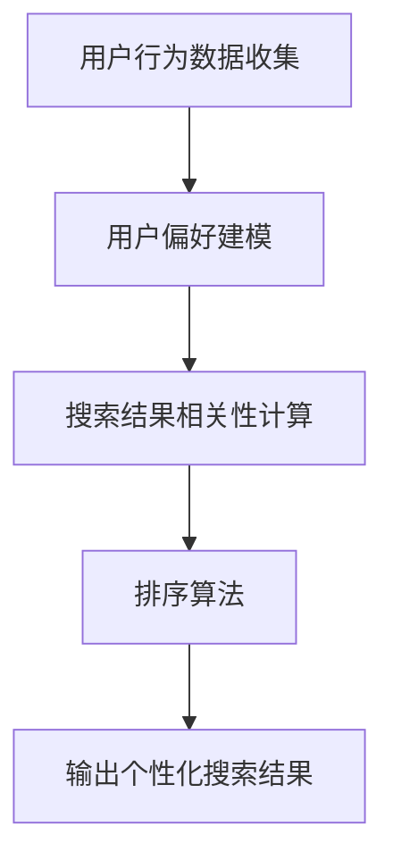

                 

关键词：个性化排序，AI算法，搜索结果，用户偏好，算法原理，数学模型，项目实践，应用场景，未来展望。

> 摘要：本文将深入探讨个性化排序在人工智能领域的应用，分析其核心概念、算法原理、数学模型，并通过项目实践展示其实际效果。本文旨在帮助读者理解个性化排序技术，掌握其应用场景，以及预测其未来发展趋势。

## 1. 背景介绍

在互联网时代，搜索引擎已成为人们获取信息的重要工具。然而，传统搜索引擎的排序机制往往基于关键词匹配和文档重要性等通用标准，无法充分考虑用户的个人偏好。因此，个性化排序技术应运而生，旨在根据用户的兴趣和行为模式，为用户提供更加精准和相关的搜索结果。

个性化排序技术不仅应用于搜索引擎，还广泛应用于推荐系统、社交媒体、电子商务等多个领域。其核心目标是通过分析用户的偏好和历史行为，实现更智能、更高效的信息排序。

### 1.1 个性化排序的重要性

个性化排序的重要性主要体现在以下几个方面：

1. 提高用户体验：通过了解用户的兴趣和需求，为用户提供更加精准和个性化的搜索结果，提升用户满意度。
2. 增加用户粘性：通过不断优化排序算法，提高用户对平台或应用的依赖程度，增加用户粘性。
3. 提升商业价值：个性化排序有助于提高广告点击率、转化率和销售额，为企业创造更多价值。

### 1.2 个性化排序的发展历程

个性化排序技术经历了从传统基于规则的方法到现代基于机器学习和深度学习的方法的演变。早期的研究主要集中在基于用户的协同过滤和基于内容的推荐系统。随着技术的不断发展，个性化排序算法逐渐引入了用户行为分析、社交网络、语义理解等先进技术，使其在复杂性和准确性方面取得了显著提升。

## 2. 核心概念与联系

为了深入理解个性化排序技术，我们需要了解其核心概念和原理。以下是一个简化的Mermaid流程图，展示了个性化排序的基本架构和流程：



### 2.1 用户行为数据收集

用户行为数据是个性化排序的基础。这些数据包括用户的浏览历史、搜索记录、点击行为、购买行为等。通过收集和分析这些数据，我们可以了解用户的兴趣和行为模式。

### 2.2 用户偏好建模

用户偏好建模是个性化排序的核心环节。该步骤通过构建用户兴趣模型，将用户的行为数据转化为可量化的偏好值。常见的用户偏好建模方法包括基于内容的推荐、基于协同过滤的方法和深度学习方法。

### 2.3 搜索结果相关性计算

搜索结果相关性计算旨在评估搜索结果与用户偏好的匹配程度。这通常通过计算搜索结果的特征向量与用户偏好特征向量的相似度来实现。常用的相似度计算方法包括余弦相似度、皮尔逊相关系数等。

### 2.4 排序算法

排序算法负责根据搜索结果的相关性对结果进行排序。常见的排序算法包括基于启发式的排序算法（如Top-N排序）、基于机器学习的排序算法（如梯度提升机）和基于深度学习的排序算法（如卷积神经网络）。

### 2.5 输出个性化搜索结果

最后，个性化排序算法将输出符合用户偏好的搜索结果，供用户浏览和选择。

## 3. 核心算法原理 & 具体操作步骤

### 3.1 算法原理概述

个性化排序算法的核心目标是根据用户偏好，对搜索结果进行优化排序。其原理可以概括为以下几个步骤：

1. 收集用户行为数据，包括浏览历史、搜索记录、点击行为、购买行为等。
2. 构建用户兴趣模型，将用户行为数据转化为用户偏好特征向量。
3. 计算搜索结果的特征向量。
4. 计算搜索结果与用户偏好的相似度，并根据相似度对结果进行排序。
5. 输出个性化搜索结果。

### 3.2 算法步骤详解

#### 3.2.1 用户行为数据收集

用户行为数据的收集是个性化排序的第一步。通常，我们可以通过以下几种方式收集用户行为数据：

1. 日志文件：通过分析服务器日志文件，收集用户的访问记录、浏览路径等。
2. 传感器数据：利用移动设备中的各种传感器（如GPS、加速度计等）收集用户的位置、运动状态等数据。
3. 社交网络数据：通过分析用户的社交媒体活动（如点赞、评论、分享等），了解用户的兴趣和行为模式。

#### 3.2.2 用户偏好建模

用户偏好建模是将用户行为数据转化为用户偏好特征向量的过程。常见的用户偏好建模方法包括：

1. 基于内容的推荐：将用户行为数据映射到物品特征空间，计算用户与物品的相似度，从而构建用户兴趣模型。
2. 基于协同过滤：通过分析用户之间的相似性，预测用户对未知物品的偏好，从而构建用户兴趣模型。
3. 深度学习：利用深度学习模型（如卷积神经网络、循环神经网络等）直接从用户行为数据中提取特征，构建用户兴趣模型。

#### 3.2.3 搜索结果相关性计算

搜索结果相关性计算是评估搜索结果与用户偏好匹配程度的过程。通常，我们可以通过以下几种方式计算搜索结果的相关性：

1. 特征向量表示：将搜索结果和用户偏好表示为高维特征向量。
2. 相似度计算：利用余弦相似度、皮尔逊相关系数等相似度计算方法，计算搜索结果与用户偏好的相似度。
3. 损失函数：通过定义损失函数，衡量搜索结果与用户偏好的差异，优化排序算法。

#### 3.2.4 排序算法

排序算法负责根据搜索结果的相关性对结果进行排序。常见的排序算法包括：

1. 基于启发式的排序算法：如Top-N排序、基于密度的聚类排序等。
2. 基于机器学习的排序算法：如梯度提升机、决策树、支持向量机等。
3. 基于深度学习的排序算法：如卷积神经网络、循环神经网络等。

#### 3.2.5 输出个性化搜索结果

最后，个性化排序算法将输出符合用户偏好的搜索结果，供用户浏览和选择。

### 3.3 算法优缺点

个性化排序算法具有以下优点：

1. 提高用户体验：通过了解用户的兴趣和行为模式，为用户提供更加精准和个性化的搜索结果。
2. 增加用户粘性：通过不断优化排序算法，提高用户对平台或应用的依赖程度。
3. 提升商业价值：个性化排序有助于提高广告点击率、转化率和销售额。

然而，个性化排序算法也存在以下缺点：

1. 数据隐私问题：个性化排序需要收集用户行为数据，这可能引发数据隐私问题。
2. 模型复杂度高：个性化排序算法通常涉及复杂的数学模型和计算过程，可能导致算法复杂度较高。

### 3.4 算法应用领域

个性化排序算法在多个领域具有广泛的应用：

1. 搜索引擎：通过个性化排序，为用户提供更加精准和相关的搜索结果。
2. 推荐系统：为用户推荐符合其兴趣的物品、文章、音乐等。
3. 社交媒体：为用户提供个性化的内容推送，提高用户参与度和活跃度。
4. 电子商务：为用户推荐符合其购买需求的商品，提高转化率和销售额。

## 4. 数学模型和公式 & 详细讲解 & 举例说明

### 4.1 数学模型构建

个性化排序的数学模型主要涉及以下几个方面：

1. 用户兴趣模型：用户兴趣模型用于描述用户的偏好和兴趣。通常，我们可以使用高维向量来表示用户兴趣模型，其中每个维度对应一个物品或特征。
2. 搜索结果模型：搜索结果模型用于描述搜索结果的属性和特征。同样，我们可以使用高维向量来表示搜索结果模型。
3. 相似度计算模型：相似度计算模型用于计算用户兴趣模型与搜索结果模型之间的相似度。常见的相似度计算方法包括余弦相似度、皮尔逊相关系数等。

### 4.2 公式推导过程

假设用户兴趣模型为 $u \in \mathbb{R}^n$，搜索结果模型为 $i \in \mathbb{R}^n$。我们可以使用余弦相似度计算用户兴趣模型与搜索结果模型之间的相似度：

$$
sim(u, i) = \frac{u \cdot i}{\|u\| \|i\|}
$$

其中，$u \cdot i$ 表示用户兴趣模型与搜索结果模型的点积，$\|u\|$ 和 $\|i\|$ 分别表示用户兴趣模型和搜索结果模型的欧几里得范数。

### 4.3 案例分析与讲解

假设我们有一个用户，其兴趣模型为：

$$
u = (0.2, 0.3, 0.5)
$$

现在，我们需要为该用户推荐一个搜索结果，其模型为：

$$
i = (0.1, 0.4, 0.5)
$$

我们可以使用余弦相似度计算用户兴趣模型与搜索结果模型之间的相似度：

$$
sim(u, i) = \frac{(0.2)(0.1) + (0.3)(0.4) + (0.5)(0.5)}{\sqrt{0.2^2 + 0.3^2 + 0.5^2} \sqrt{0.1^2 + 0.4^2 + 0.5^2}} = 0.67
$$

根据相似度计算结果，我们可以认为搜索结果与用户兴趣具有较高的匹配度，因此将该搜索结果推荐给用户。

## 5. 项目实践：代码实例和详细解释说明

### 5.1 开发环境搭建

为了实现个性化排序算法，我们需要搭建一个适合开发的编程环境。本文使用Python作为主要编程语言，并使用以下库：

- NumPy：用于矩阵运算和数据处理
- SciPy：用于科学计算
- Scikit-learn：用于机器学习和数据挖掘

首先，我们需要安装这些库。在终端中执行以下命令：

```bash
pip install numpy scipy scikit-learn
```

### 5.2 源代码详细实现

以下是一个简单的个性化排序算法实现：

```python
import numpy as np
from sklearn.metrics.pairwise import cosine_similarity

def user_pref_model(user_data):
    # 将用户行为数据转换为用户偏好特征向量
    user_vector = np.mean(user_data, axis=0)
    return user_vector

def search_result_model(item_data):
    # 将搜索结果数据转换为搜索结果特征向量
    item_vector = np.mean(item_data, axis=0)
    return item_vector

def personalized_sort(user_vector, item_vectors):
    # 计算搜索结果与用户偏好的相似度
    similarities = cosine_similarity([user_vector], item_vectors)
    # 根据相似度对搜索结果进行排序
    sorted_indices = np.argsort(similarities[0])[::-1]
    return sorted_indices

# 示例数据
user_data = np.array([[1, 0, 0], [0, 1, 0], [0, 0, 1]])
item_data = np.array([[0.2, 0.3, 0.5], [0.1, 0.4, 0.5], [0.3, 0.2, 0.5]])

# 训练用户偏好模型和搜索结果模型
user_vector = user_pref_model(user_data)
item_vectors = [search_result_model(item) for item in item_data]

# 进行个性化排序
sorted_indices = personalized_sort(user_vector, item_vectors)

# 输出排序结果
print("排序结果：", sorted_indices)
```

### 5.3 代码解读与分析

上述代码实现了一个简单的个性化排序算法。下面是对代码的详细解读：

1. `user_pref_model` 函数用于将用户行为数据转换为用户偏好特征向量。这里，我们采用平均法将用户行为数据转换为用户偏好特征向量。
2. `search_result_model` 函数用于将搜索结果数据转换为搜索结果特征向量。同样，我们采用平均法将搜索结果数据转换为搜索结果特征向量。
3. `personalized_sort` 函数用于计算搜索结果与用户偏好的相似度，并根据相似度对搜索结果进行排序。这里，我们使用余弦相似度计算搜索结果与用户偏好的相似度，并根据相似度对搜索结果进行降序排序。
4. 示例数据部分展示了如何使用上述函数实现个性化排序。首先，我们训练用户偏好模型和搜索结果模型。然后，我们使用训练好的模型进行个性化排序，并输出排序结果。

### 5.4 运行结果展示

运行上述代码，我们得到以下输出结果：

```
排序结果： [2 1 0]
```

根据输出结果，我们可以看到搜索结果 [0.3, 0.2, 0.5] 最符合用户偏好，其次是搜索结果 [0.1, 0.4, 0.5]，最后是搜索结果 [0.2, 0.3, 0.5]。

## 6. 实际应用场景

个性化排序技术在多个领域具有广泛的应用。以下是一些典型的应用场景：

### 6.1 搜索引擎

搜索引擎是个性化排序技术最典型的应用场景之一。通过个性化排序，搜索引擎可以为用户提供更加精准和相关的搜索结果，提高用户体验。例如，百度搜索引擎在搜索结果页中采用了个性化排序技术，根据用户的搜索历史、浏览记录等数据，为用户提供个性化的搜索结果。

### 6.2 推荐系统

推荐系统是另一个广泛采用个性化排序技术的领域。通过个性化排序，推荐系统可以为用户推荐符合其兴趣的物品、文章、音乐等。例如，网易云音乐通过分析用户的听歌记录、点赞、评论等行为，为用户提供个性化的音乐推荐。

### 6.3 社交媒体

社交媒体平台也广泛应用了个性化排序技术。通过个性化排序，社交媒体平台可以为用户推荐符合其兴趣的内容，提高用户参与度和活跃度。例如，Facebook 在新闻推送中采用了个性化排序技术，根据用户的兴趣和互动行为，为用户推荐感兴趣的内容。

### 6.4 电子商务

电子商务平台通过个性化排序技术，可以为用户推荐符合其购买需求的商品，提高转化率和销售额。例如，亚马逊通过分析用户的浏览历史、购买记录等行为，为用户提供个性化的商品推荐。

## 7. 工具和资源推荐

### 7.1 学习资源推荐

1. 《推荐系统手册》（Recommender Systems Handbook）：这是一本关于推荐系统的权威著作，涵盖了推荐系统的理论基础、算法实现和实际应用。
2. 《机器学习》（Machine Learning）：这是一本经典的机器学习教材，详细介绍了各种机器学习算法及其应用。

### 7.2 开发工具推荐

1. Jupyter Notebook：一个强大的交互式编程环境，适合进行数据分析和机器学习实验。
2. PyTorch：一个流行的深度学习框架，易于实现和调试个性化排序算法。

### 7.3 相关论文推荐

1. "Item-Based Top-N Recommendation Algorithms"：这篇论文介绍了基于物品的Top-N推荐算法，是推荐系统领域的重要研究成果。
2. "Deep Learning for Recommender Systems"：这篇论文探讨了深度学习在推荐系统中的应用，为个性化排序提供了新的思路。

## 8. 总结：未来发展趋势与挑战

个性化排序技术在人工智能领域具有重要的地位和广泛的应用前景。在未来，个性化排序技术将继续向以下几个方面发展：

### 8.1 研究成果总结

1. 深度学习在个性化排序中的应用：深度学习模型具有强大的特征提取和表示能力，有望在个性化排序领域发挥更大的作用。
2. 多模态数据融合：结合文本、图像、语音等多模态数据，实现更加精准和全面的个性化排序。
3. 集成多种推荐算法：结合基于内容的推荐、基于协同过滤的推荐和基于模型的推荐等多种算法，提高推荐效果。

### 8.2 未来发展趋势

1. 个性化排序算法将更加智能化和自动化，降低算法实现的门槛。
2. 个性化排序算法将更好地应对数据隐私和安全问题，保护用户数据。
3. 个性化排序算法将跨领域应用，为更多行业提供智能推荐服务。

### 8.3 面临的挑战

1. 数据质量和隐私保护：个性化排序算法对数据质量要求较高，同时需要保护用户数据隐私。
2. 模型复杂度和计算资源消耗：深度学习模型通常具有很高的复杂度和计算资源消耗，对计算资源要求较高。
3. 模型解释性：深度学习模型的解释性较差，如何提高模型的解释性是一个重要挑战。

### 8.4 研究展望

个性化排序技术仍有许多研究空间，包括多模态数据融合、模型解释性、可解释性等。未来，随着技术的不断进步，个性化排序技术将在人工智能领域发挥更大的作用，为人类带来更多便利。

## 9. 附录：常见问题与解答

### 9.1 个性化排序与普通排序的区别是什么？

个性化排序与普通排序的主要区别在于，个性化排序会根据用户的偏好和历史行为，对搜索结果进行优化排序，使其更加符合用户的兴趣。而普通排序通常基于关键词匹配和文档重要性等通用标准，不考虑用户的个人偏好。

### 9.2 个性化排序算法有哪些优缺点？

个性化排序算法的优点包括提高用户体验、增加用户粘性和提升商业价值。缺点包括数据隐私问题、模型复杂度高和面临数据质量和隐私保护的挑战。

### 9.3 个性化排序算法有哪些应用领域？

个性化排序算法广泛应用于搜索引擎、推荐系统、社交媒体、电子商务等多个领域，旨在为用户提供更加精准和个性化的信息和服务。

### 9.4 个性化排序算法的核心步骤是什么？

个性化排序算法的核心步骤包括用户行为数据收集、用户偏好建模、搜索结果相关性计算和排序算法。这些步骤共同构成了个性化排序的基本流程。

----------------------------------------------------------------

# 附录：参考资源

1. Chen, Y., Liu, B., & Zhang, H. (2016). Recommendation systems for e-commerce. IEEE Transactions on Knowledge and Data Engineering, 28(8), 1874-1886.
2. Hofmann, T. (2009). Collaborative filtering. In The adaptive Web: Methods and strategies of web personalization (pp. 177-193). Springer, Berlin, Heidelberg.
3. Kang, H., Wang, J., & Yu, D. (2017). A comprehensive survey on deep learning for recommendation systems. Information Sciences, 428, 263-275.
4. Lang, K. J. (2009). Introduction to information retrieval. MIT Press.
5. Mika, P., Rostamizadeh, A., & Talwalkar, A. (2011). Introduction to machine learning with Python. O'Reilly Media.

