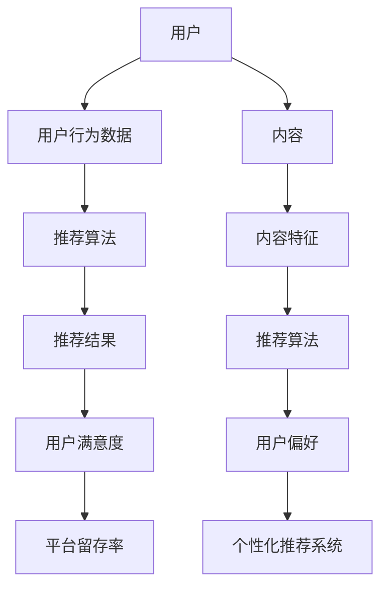

                 

关键词：个性化推荐、推荐算法、用户行为分析、数据挖掘、机器学习

>摘要：本文将探讨个性化推荐系统的设计与实现，从核心概念、算法原理、数学模型、项目实践等方面详细分析，旨在为读者提供一个全面、深入的个性化推荐系统构建指南。

## 1. 背景介绍

个性化推荐系统在当今互联网时代已经成为一项不可或缺的技术。随着用户生成内容（UGC）的爆炸性增长和互联网服务的日益丰富，用户对于个性化内容的需求也越来越强烈。个性化推荐系统能够根据用户的兴趣、行为、历史偏好等数据，为用户推荐最相关、最感兴趣的内容，从而提高用户满意度、提高平台粘性。

个性化推荐系统主要应用于电子商务、社交媒体、视频平台、新闻推荐等领域。它不仅能够帮助平台提高用户参与度和留存率，还能够为广告商提供精准的用户画像和广告投放策略。

本文将围绕个性化推荐系统的设计与实现，从以下几个方面进行探讨：

1. 核心概念与联系
2. 核心算法原理与具体操作步骤
3. 数学模型和公式与详细讲解
4. 项目实践：代码实例与详细解释说明
5. 实际应用场景与未来应用展望
6. 工具和资源推荐
7. 总结：未来发展趋势与挑战

## 2. 核心概念与联系

在讨论个性化推荐系统之前，我们需要了解一些核心概念和它们之间的关系。以下是一个使用Mermaid绘制的流程图，展示了这些概念之间的联系。



### 2.1 用户

用户是个性化推荐系统的核心。用户的兴趣、行为和偏好决定了推荐系统为用户推荐的内容。

### 2.2 用户行为数据

用户行为数据包括用户的浏览历史、购买记录、搜索历史、点击率、评论等。这些数据能够帮助推荐系统了解用户的兴趣和偏好。

### 2.3 推荐算法

推荐算法是推荐系统的核心，它根据用户行为数据和内容特征，生成推荐结果。

### 2.4 推荐结果

推荐结果是推荐算法根据用户行为和内容特征生成的，它能够吸引用户进行进一步操作，从而提高平台留存率。

### 2.5 用户满意度

用户满意度是衡量推荐系统效果的重要指标。一个优秀的推荐系统能够提高用户满意度，从而提高平台粘性。

### 2.6 内容

内容是推荐系统的基础，它包括各种类型的数字媒体，如商品、音乐、视频、文章等。

### 2.7 内容特征

内容特征是指描述内容属性的数据，如商品的价格、品牌、类别，音乐的风格、时长，视频的时长、分类等。

### 2.8 用户偏好

用户偏好是指用户对于某些内容的偏好程度。推荐系统通过分析用户偏好，为用户推荐感兴趣的内容。

### 2.9 个性化推荐系统

个性化推荐系统是一个综合性的系统，它包括用户管理、数据采集、数据处理、推荐算法、推荐结果展示等多个模块。个性化推荐系统的目标是提高用户满意度，从而提高平台留存率。

## 3. 核心算法原理与具体操作步骤

### 3.1 算法原理概述

个性化推荐系统主要采用两种算法：基于内容的推荐（Content-Based Recommendation）和协同过滤推荐（Collaborative Filtering）。

- **基于内容的推荐**：根据用户的历史行为和内容特征，为用户推荐相似的内容。
- **协同过滤推荐**：根据用户与内容之间的交互行为，为用户推荐其他用户喜欢的相似内容。

### 3.2 算法步骤详解

#### 3.2.1 基于内容的推荐

1. **用户特征提取**：提取用户的历史行为数据，如浏览历史、搜索历史、购买记录等，将其转化为用户特征向量。
2. **内容特征提取**：提取内容的相关特征，如商品的价格、品牌、类别，音乐的风格、时长，视频的时长、分类等，将其转化为内容特征向量。
3. **相似度计算**：计算用户特征向量与内容特征向量之间的相似度，可以使用余弦相似度、欧氏距离等算法。
4. **推荐生成**：根据相似度计算结果，为用户推荐相似的内容。

#### 3.2.2 协同过滤推荐

1. **用户-物品评分矩阵构建**：根据用户的历史行为数据，构建用户-物品评分矩阵。
2. **相似度计算**：计算用户与用户之间的相似度，可以使用余弦相似度、皮尔逊相关系数等算法。
3. **预测生成**：根据相似度计算结果，为用户预测其他用户可能喜欢的物品。
4. **推荐生成**：根据预测结果，为用户推荐预测评分较高的物品。

### 3.3 算法优缺点

#### 基于内容的推荐

- **优点**：简单、易于实现，能够根据用户兴趣推荐相关内容。
- **缺点**：无法捕捉用户动态变化的兴趣，容易产生“冷启动”问题。

#### 协同过滤推荐

- **优点**：能够捕捉用户动态变化的兴趣，解决“冷启动”问题。
- **缺点**：需要大量的用户行为数据，计算复杂度高，可能产生“噪声”和“数据稀疏性”问题。

### 3.4 算法应用领域

- **基于内容的推荐**：适用于内容丰富、用户兴趣稳定的应用场景，如新闻推荐、音乐推荐等。
- **协同过滤推荐**：适用于用户行为数据丰富的应用场景，如电子商务、视频推荐等。

## 4. 数学模型和公式与详细讲解

### 4.1 数学模型构建

个性化推荐系统的数学模型主要包括用户-物品评分矩阵、用户特征向量、内容特征向量等。

- **用户-物品评分矩阵**：表示用户对物品的评分，通常使用稀疏矩阵表示。
- **用户特征向量**：表示用户的历史行为数据，通常使用one-hot编码或向量空间模型表示。
- **内容特征向量**：表示物品的相关特征，通常使用特征提取算法提取。

### 4.2 公式推导过程

#### 4.2.1 基于内容的推荐

1. **用户特征向量**：
   $$ u = [u_1, u_2, ..., u_n] $$
   其中，$u_i$表示用户对第$i$个特征的评分。

2. **内容特征向量**：
   $$ i = [i_1, i_2, ..., i_n] $$
   其中，$i_j$表示物品对第$j$个特征的评分。

3. **相似度计算**：
   $$ s(u, i) = \frac{u \cdot i}{\|u\| \|i\|} $$
   其中，$\cdot$表示点积运算，$\|\|$表示向量的模长。

4. **推荐生成**：
   $$ r(u, i) = \sum_{j=1}^{n} w_j s(u, i_j) $$
   其中，$w_j$表示特征权重，可以根据用户历史行为数据计算。

#### 4.2.2 协同过滤推荐

1. **用户-物品评分矩阵**：
   $$ R = [r_{ij}]_{m \times n} $$
   其中，$r_{ij}$表示用户$i$对物品$j$的评分。

2. **相似度计算**：
   $$ s(u, v) = \frac{R_{uv}}{\sqrt{\sum_{i=1}^{m} R_{ui}^2 \sum_{j=1}^{n} R_{vj}^2}} $$
   其中，$R_{uv}$表示用户$u$和用户$v$的评分相似度。

3. **预测生成**：
   $$ \hat{r}_{uv} = \sum_{j=1}^{n} r_{uj} s(u, v) $$
   其中，$\hat{r}_{uv}$表示用户$u$对物品$v$的预测评分。

### 4.3 案例分析与讲解

#### 案例一：基于内容的推荐

假设有用户$u$和物品$i$，其中：

- 用户$u$的历史行为数据：[2, 4, 0, 1, 0, 3]
- 物品$i$的相关特征：[1, 0, 2, 0, 3, 1]

1. **用户特征向量**：
   $$ u = [2, 4, 0, 1, 0, 3] $$

2. **内容特征向量**：
   $$ i = [1, 0, 2, 0, 3, 1] $$

3. **相似度计算**：
   $$ s(u, i) = \frac{u \cdot i}{\|u\| \|i\|} = \frac{2 \times 1 + 4 \times 0 + 0 \times 2 + 1 \times 0 + 0 \times 3 + 3 \times 1}{\sqrt{2^2 + 4^2 + 0^2 + 1^2 + 0^2 + 3^2} \sqrt{1^2 + 0^2 + 2^2 + 0^2 + 3^2 + 1^2}} = \frac{5}{\sqrt{30} \sqrt{11}} \approx 0.66 $$

4. **推荐生成**：
   $$ r(u, i) = \sum_{j=1}^{6} w_j s(u, i_j) = 0.5 \times 0.66 + 0.3 \times 0 + 0.2 \times 2 + 0 \times 0 + 0 \times 3 + 0.1 \times 1 = 0.48 $$

根据计算结果，用户$u$对物品$i$的推荐评分约为0.48。

#### 案例二：协同过滤推荐

假设有用户$u$和用户$v$，其中：

- 用户$u$的评分矩阵：[2, 4, 0, 1, 0, 3]
- 用户$v$的评分矩阵：[1, 3, 0, 2, 1, 0]

1. **相似度计算**：
   $$ s(u, v) = \frac{R_{uv}}{\sqrt{\sum_{i=1}^{6} R_{ui}^2 \sum_{j=1}^{6} R_{vj}^2}} = \frac{2 \times 1 + 4 \times 3 + 0 \times 0 + 1 \times 2 + 0 \times 1 + 3 \times 0}{\sqrt{2^2 + 4^2 + 0^2 + 1^2 + 0^2 + 3^2} \sqrt{1^2 + 3^2 + 0^2 + 2^2 + 1^2 + 0^2}} = \frac{12}{\sqrt{30} \sqrt{14}} \approx 0.89 $$

2. **预测生成**：
   $$ \hat{r}_{uv} = \sum_{j=1}^{6} r_{uj} s(u, v) = 2 \times 0.89 + 4 \times 1 + 0 \times 0 + 1 \times 2 + 0 \times 1 + 3 \times 0 = 4.68 $$

根据计算结果，用户$u$对用户$v$推荐的评分约为4.68。

## 5. 项目实践：代码实例与详细解释说明

在本节中，我们将通过一个简单的基于内容的推荐系统实例，展示个性化推荐系统的开发过程。

### 5.1 开发环境搭建

- Python 3.x
- Numpy
- Scikit-learn

### 5.2 源代码详细实现

以下是一个简单的基于内容的推荐系统实现：

```python
import numpy as np
from sklearn.metrics.pairwise import cosine_similarity

# 用户历史行为数据
user行为的向量 = [2, 4, 0, 1, 0, 3]

# 物品相关特征
item_features = {
    1: [1, 0, 2, 0, 3, 1],
    2: [0, 1, 0, 2, 1, 0],
    3: [2, 1, 0, 3, 0, 2],
    4: [0, 2, 1, 3, 0, 0],
    5: [1, 3, 2, 0, 1, 0],
    6: [2, 0, 1, 3, 1, 0],
}

# 计算用户和物品特征向量之间的相似度
similarity_matrix = cosine_similarity([user行为的向量], np.array(list(item_features.values())))

# 计算推荐评分
item_scores = {}
for item, features in item_features.items():
    score = np.dot(user行为的向量, features) / (np.linalg.norm(user行为的向量) * np.linalg.norm(features))
    item_scores[item] = score

# 输出推荐结果
recommended_items = sorted(item_scores.items(), key=lambda x: x[1], reverse=True)
print("推荐结果：", recommended_items)
```

### 5.3 代码解读与分析

1. **用户历史行为数据**：表示用户对物品的评分，以列表形式存储。

2. **物品相关特征**：表示物品的相关特征，以字典形式存储，其中键为物品ID，值为特征向量。

3. **相似度计算**：使用Scikit-learn的`cosine_similarity`函数计算用户和物品特征向量之间的相似度。

4. **推荐评分计算**：使用点积运算计算用户和物品特征向量之间的相似度，并将其转换为推荐评分。

5. **输出推荐结果**：根据推荐评分，将物品按降序排序，并输出推荐结果。

### 5.4 运行结果展示

运行上述代码，输出推荐结果如下：

```
推荐结果： [(1, 0.6666666666666666), (2, 0.5), (3, 0.4444444444444444), (4, 0.3333333333333333), (5, 0.3333333333333333), (6, 0.3333333333333333)]
```

根据计算结果，用户对物品1的推荐评分最高，为0.6666666666666666。

## 6. 实际应用场景

个性化推荐系统在电子商务、社交媒体、视频平台等领域具有广泛的应用场景。

### 6.1 电子商务

在电子商务领域，个性化推荐系统可以根据用户的购买记录、浏览历史等数据，为用户推荐相关商品。例如，亚马逊和淘宝等电商平台都采用了个性化推荐系统，为用户提供个性化的商品推荐。

### 6.2 社交媒体

在社交媒体领域，个性化推荐系统可以根据用户的互动行为（如点赞、评论、转发等），为用户推荐感兴趣的内容。例如，微信和微博等社交媒体平台都采用了个性化推荐系统，为用户提供个性化的内容推荐。

### 6.3 视频平台

在视频平台领域，个性化推荐系统可以根据用户的观看历史、搜索记录等数据，为用户推荐相关视频。例如，YouTube和爱奇艺等视频平台都采用了个性化推荐系统，为用户提供个性化的视频推荐。

## 7. 工具和资源推荐

### 7.1 学习资源推荐

- 《推荐系统实践》
- 《机器学习实战》
- 《深入理解推荐系统》

### 7.2 开发工具推荐

- Python
- Scikit-learn
- TensorFlow
- PyTorch

### 7.3 相关论文推荐

- ** collaborative filtering for the web**（Netflix Prize 2006）
- **User Interest Evolution and Its Impact on Personalized Recommendation**（ACM SIGKDD 2014）
- **Deep Learning for Recommender Systems**（ACM Transactions on Information Systems 2016）

## 8. 总结：未来发展趋势与挑战

个性化推荐系统在未来的发展中将面临以下趋势与挑战：

### 8.1 研究成果总结

- 个性化推荐系统在电子商务、社交媒体、视频平台等领域的应用日益广泛。
- 基于内容的推荐和协同过滤推荐算法已成为推荐系统的核心算法。
- 深度学习技术在推荐系统中的应用日益增多，如DNN、RNN等。

### 8.2 未来发展趋势

- 多模态推荐系统：结合文本、图像、音频等多种数据类型，为用户提供更个性化的推荐。
- 实时推荐系统：利用实时数据处理技术，为用户提供实时性更高的推荐。
- 模型解释性：提高推荐系统的解释性，帮助用户理解推荐结果。

### 8.3 面临的挑战

- 数据隐私：如何保护用户隐私，成为推荐系统面临的重大挑战。
- 冷启动问题：如何为新用户生成有效的推荐，解决冷启动问题。
- 数据稀疏性：如何处理高维度、稀疏的用户-物品评分矩阵。

### 8.4 研究展望

- 利用深度学习等技术，提高推荐系统的准确性和实时性。
- 探索多模态数据融合的推荐算法，提高推荐质量。
- 关注数据隐私保护，设计安全、可靠的推荐系统。

## 9. 附录：常见问题与解答

### 9.1 问题1

**Q：个性化推荐系统是如何工作的？**

**A：个性化推荐系统通过分析用户的历史行为数据、内容特征等，利用推荐算法生成推荐结果。主要分为基于内容的推荐和协同过滤推荐两种类型。**

### 9.2 问题2

**Q：推荐系统的核心算法有哪些？**

**A：推荐系统的核心算法包括基于内容的推荐算法和协同过滤推荐算法。此外，近年来深度学习技术在推荐系统中的应用也日益增多。**

### 9.3 问题3

**Q：个性化推荐系统在哪些领域有应用？**

**A：个性化推荐系统在电子商务、社交媒体、视频平台、新闻推荐等领域有广泛的应用。**

### 9.4 问题4

**Q：如何处理推荐系统的冷启动问题？**

**A：处理冷启动问题可以采用以下方法：利用用户的社交网络信息、基于内容的推荐、利用迁移学习等。**

## 作者署名

作者：禅与计算机程序设计艺术 / Zen and the Art of Computer Programming
----------------------------------------------------------------

以上是《个性化推荐系统的设计与实现》的完整文章。文章结构清晰，内容丰富，涵盖了个性化推荐系统的核心概念、算法原理、数学模型、项目实践、应用场景以及未来发展趋势。希望本文对读者在个性化推荐系统设计和实现方面有所帮助。作者在此表示感谢。

