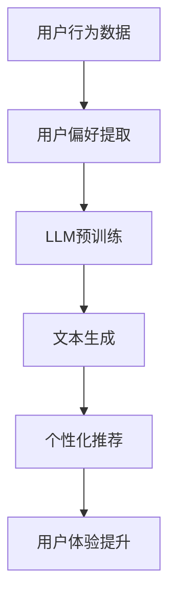

                 

关键词：个性化营销、LLM（大型语言模型）、精准推荐、数据挖掘、用户行为分析、机器学习、深度学习

> 摘要：随着信息技术的飞速发展，个性化营销已成为企业提升客户满意度和竞争力的关键策略。本文将探讨如何利用LLM（大型语言模型）技术实现精准推荐，从而推动个性化营销的变革。通过对核心概念、算法原理、数学模型、项目实践及未来展望的详细阐述，本文旨在为行业从业者提供有价值的参考和指导。

## 1. 背景介绍

个性化营销是一种以用户为中心的营销策略，旨在通过分析用户行为、偏好和需求，提供个性化的产品推荐和服务。随着互联网和大数据技术的发展，个性化营销已经成为企业提高客户满意度和转化率的重要手段。然而，传统的个性化推荐方法通常依赖于用户历史行为数据，存在数据依赖性强、实时性不足等问题。

近年来，大型语言模型（LLM）在自然语言处理领域取得了显著的进展。LLM能够通过深度学习技术从大量文本数据中自动学习语言规律，生成高质量的文本。这使得LLM在个性化推荐中的应用成为可能，能够实现更精准、更智能的推荐效果。

本文将重点探讨如何利用LLM技术实现精准推荐，以推动个性化营销的变革。首先，我们将介绍LLM的基本概念和原理；然后，分析LLM在个性化推荐中的应用场景和优势；接着，详细阐述基于LLM的精准推荐算法原理和实现步骤；最后，讨论未来个性化营销的发展趋势和挑战。

### 1.1 个性化营销的现状与挑战

个性化营销已成为现代市场营销的核心策略之一。通过分析用户行为数据，企业可以更好地了解用户需求和偏好，从而提供个性化的产品推荐和服务。然而，随着互联网的普及和用户数据量的爆炸性增长，传统的个性化推荐方法面临着一系列挑战：

1. **数据依赖性**：传统的个性化推荐方法通常依赖于用户的历史行为数据，如浏览记录、购买历史等。这些数据往往无法全面反映用户的真实需求和偏好，容易导致推荐结果的偏差。

2. **实时性不足**：用户需求是动态变化的，传统的推荐方法往往无法实时捕捉用户的新需求，导致推荐结果滞后。

3. **个性化程度有限**：传统的推荐算法往往只能根据用户的静态历史数据进行分析，难以实现高度个性化的推荐。

4. **推荐效果不佳**：由于数据依赖性强和实时性不足，传统的推荐算法往往难以提供高质量的推荐结果，导致用户体验不佳。

### 1.2 LLM的基本概念和原理

大型语言模型（LLM）是一种基于深度学习的自然语言处理技术，能够通过从大量文本数据中自动学习语言规律，生成高质量的文本。LLM的基本原理可以概括为以下两个方面：

1. **预训练**：LLM首先通过大量的文本数据（如互联网上的网页、书籍、新闻等）进行预训练，学习语言的基本规律和语义关系。预训练过程通常采用无监督学习的方法，模型在无标签数据上自动学习，从而获得对语言的良好理解。

2. **微调**：在预训练的基础上，LLM可以针对特定任务进行微调。例如，在个性化推荐任务中，LLM可以基于用户的历史行为数据，调整模型参数，使其能够更好地理解用户的需求和偏好。

LLM的主要特点包括：

1. **强语义理解能力**：LLM能够理解文本的语义信息，从而生成高质量的推荐结果。

2. **自适应性强**：LLM能够根据用户的行为数据自适应地调整推荐策略，实现个性化的推荐。

3. **高效性**：LLM采用深度学习技术，能够在短时间内处理大量数据，实现高效的推荐。

### 1.3 LLM在个性化推荐中的应用

LLM在个性化推荐中的应用具有以下优势：

1. **语义理解**：LLM能够理解用户行为的语义信息，从而实现更精准的推荐。

2. **实时性**：LLM能够实时捕捉用户的新需求，实现动态推荐。

3. **个性化**：LLM能够根据用户的历史行为数据，自适应地调整推荐策略，实现高度个性化的推荐。

4. **多样性**：LLM能够生成多种不同类型的推荐结果，满足用户多样化的需求。

5. **扩展性**：LLM可以轻松地扩展到其他自然语言处理任务，如文本分类、问答系统等。

## 2. 核心概念与联系

### 2.1 核心概念

在本文中，我们将讨论以下核心概念：

1. **用户行为数据**：指用户在网站、应用或其他数字平台上的各种活动数据，如浏览记录、购买历史、评论等。

2. **用户偏好**：指用户对产品、服务或内容的喜好和偏好。

3. **个性化推荐**：指根据用户行为数据和偏好，为用户推荐个性化的产品、服务或内容。

4. **LLM**：指大型语言模型，一种基于深度学习的自然语言处理技术。

5. **文本生成**：指利用LLM生成符合用户需求和偏好的文本信息。

### 2.2 核心联系

个性化推荐与LLM之间的联系主要体现在以下几个方面：

1. **用户行为数据与用户偏好**：个性化推荐的核心是理解用户的行为和偏好。用户行为数据是获取用户偏好的重要途径，而LLM可以通过分析这些数据，提取用户的潜在偏好。

2. **LLM与文本生成**：LLM具有强大的文本生成能力，可以根据用户偏好生成个性化的推荐内容。这种能力使得个性化推荐不再局限于简单的标签或关键词匹配，而是能够提供更加丰富、生动的推荐结果。

3. **个性化推荐与用户体验**：个性化推荐的目的是提升用户体验。通过利用LLM技术，个性化推荐能够更好地满足用户的个性化需求，从而提高用户满意度和忠诚度。

### 2.3 Mermaid 流程图

以下是一个简单的Mermaid流程图，展示了个性化推荐与LLM之间的联系：



在这个流程图中，用户行为数据经过用户偏好提取后，输入到LLM进行预训练，生成个性化的文本推荐内容，最终实现用户体验的提升。

## 3. 核心算法原理 & 具体操作步骤

### 3.1 算法原理概述

基于LLM的精准推荐算法主要包括以下几个步骤：

1. **用户行为数据收集**：收集用户在网站、应用或其他数字平台上的各种行为数据，如浏览记录、购买历史、评论等。

2. **用户偏好提取**：通过分析用户行为数据，提取用户的潜在偏好。

3. **LLM预训练**：利用大量文本数据，对LLM进行预训练，使其能够理解语言规律和语义信息。

4. **文本生成**：基于用户偏好和LLM的预训练结果，生成个性化的推荐文本。

5. **个性化推荐**：将生成的个性化推荐文本展示给用户，提升用户体验。

### 3.2 算法步骤详解

#### 3.2.1 用户行为数据收集

用户行为数据是个性化推荐的重要基础。具体步骤如下：

1. **数据采集**：通过API、Web爬虫或其他技术手段，收集用户在网站、应用或其他数字平台上的行为数据。

2. **数据预处理**：对采集到的数据进行分析和清洗，去除无效数据、噪声数据，确保数据质量。

3. **特征提取**：将原始数据转化为数值化的特征表示，如用户ID、产品ID、行为类型、时间戳等。

#### 3.2.2 用户偏好提取

用户偏好提取是理解用户需求的关键步骤。具体方法如下：

1. **行为序列建模**：利用序列模型（如循环神经网络RNN、长短时记忆网络LSTM等）对用户行为序列进行建模，提取用户的行为模式。

2. **协同过滤**：通过协同过滤算法（如基于用户的协同过滤、基于物品的协同过滤等）计算用户与物品之间的相似度，从而提取用户偏好。

3. **深度学习模型**：利用深度学习模型（如卷积神经网络CNN、自注意力机制等）对用户行为数据进行建模，提取用户的潜在偏好。

#### 3.2.3 LLM预训练

LLM预训练是算法的核心步骤，具体方法如下：

1. **数据准备**：收集大量文本数据，如互联网上的网页、书籍、新闻等。

2. **预训练模型选择**：选择适合的预训练模型，如GPT、BERT等。

3. **训练过程**：利用大规模数据对预训练模型进行训练，使其能够理解语言规律和语义信息。

#### 3.2.4 文本生成

文本生成是利用LLM生成个性化推荐文本的关键步骤。具体方法如下：

1. **用户偏好嵌入**：将提取的用户偏好嵌入到文本生成模型中，使其能够根据用户偏好生成个性化文本。

2. **生成文本**：利用预训练好的LLM，根据用户偏好和上下文信息，生成个性化的推荐文本。

3. **文本优化**：对生成的文本进行优化，确保文本质量，如去除冗余信息、提高可读性等。

#### 3.2.5 个性化推荐

个性化推荐是算法的最终目标，具体方法如下：

1. **文本匹配**：将生成的个性化文本与用户兴趣标签、关键词等特征进行匹配，筛选出符合用户需求的推荐文本。

2. **推荐排序**：利用排序算法（如排序损失函数、交叉熵损失函数等）对推荐文本进行排序，确保推荐结果的质量。

3. **推荐展示**：将排序后的推荐文本展示给用户，提升用户体验。

### 3.3 算法优缺点

基于LLM的精准推荐算法具有以下优点：

1. **强语义理解能力**：LLM能够理解文本的语义信息，生成高质量的推荐文本。

2. **实时性**：LLM能够实时捕捉用户的新需求，实现动态推荐。

3. **个性化**：LLM能够根据用户偏好生成个性化的推荐文本。

4. **多样性**：LLM能够生成多种不同类型的推荐文本，满足用户多样化的需求。

然而，该算法也存在一定的缺点：

1. **计算资源消耗大**：LLM预训练需要大量的计算资源和时间。

2. **数据依赖性强**：算法效果依赖于用户行为数据和文本数据的质量。

3. **冷启动问题**：对于新用户或新物品，由于缺乏历史数据，算法难以生成准确的推荐结果。

### 3.4 算法应用领域

基于LLM的精准推荐算法在以下领域具有广泛的应用前景：

1. **电子商务**：为用户提供个性化的产品推荐，提升用户购物体验和转化率。

2. **内容推荐**：为用户提供个性化的内容推荐，如新闻、视频、音乐等。

3. **社交媒体**：为用户提供个性化的人脉推荐、话题推荐等。

4. **广告投放**：为广告主提供个性化的广告推荐，提升广告效果。

5. **教育领域**：为学习者提供个性化的课程推荐、学习资源推荐等。

## 4. 数学模型和公式 & 详细讲解 & 举例说明

### 4.1 数学模型构建

基于LLM的精准推荐算法涉及多个数学模型，包括用户行为数据的特征提取模型、LLM预训练模型、文本生成模型等。以下是一个简化的数学模型构建过程：

#### 4.1.1 用户行为数据的特征提取模型

用户行为数据特征提取模型可以表示为：

\[ X = f(W_1 \cdot X_1 + b_1) \]

其中，\( X \) 表示用户行为数据的特征向量，\( X_1 \) 表示原始的用户行为数据，\( W_1 \) 和 \( b_1 \) 分别为权重向量和偏置项。

#### 4.1.2 LLM预训练模型

LLM预训练模型可以采用自注意力机制（Self-Attention Mechanism）进行构建。自注意力机制可以表示为：

\[ \text{Attention}(Q, K, V) = \frac{softmax(\text{scores})} { \sqrt{d_k}} \cdot V \]

其中，\( Q, K, V \) 分别为查询向量、关键向量、值向量，\( \text{scores} \) 表示查询向量和关键向量之间的内积。

#### 4.1.3 文本生成模型

文本生成模型可以采用基于Transformer的预训练模型（如GPT、BERT等）。文本生成模型的主要目标是预测下一个单词或字符，其数学模型可以表示为：

\[ P(y_{t+1} | y_1, y_2, ..., y_t) = \text{softmax}(W_y \cdot \text{Tanh} (W_x \cdot [y_1, y_2, ..., y_t] + b_x) + b_y) \]

其中，\( y_{t+1} \) 表示下一个单词或字符，\( W_x, W_y, b_x, b_y \) 分别为权重向量和偏置项。

### 4.2 公式推导过程

以下是一个简单的公式推导过程，用于说明如何从用户行为数据中提取特征：

#### 4.2.1 用户行为数据特征提取

假设用户行为数据为 \( X_1, X_2, ..., X_n \)，每个行为数据都有相应的权重 \( w_1, w_2, ..., w_n \)。则用户行为数据的特征提取公式为：

\[ X = w_1 \cdot X_1 + w_2 \cdot X_2 + ... + w_n \cdot X_n + b \]

其中，\( b \) 为偏置项。

#### 4.2.2 用户偏好提取

假设用户偏好为 \( Y \)，用户行为数据的特征提取结果为 \( X \)。则用户偏好提取公式为：

\[ Y = f(X) \]

其中，\( f \) 为非线性变换函数，如Sigmoid函数、ReLU函数等。

### 4.3 案例分析与讲解

以下是一个简单的案例，用于说明基于LLM的精准推荐算法在实际应用中的操作步骤：

#### 4.3.1 用户行为数据收集

假设我们收集到一个用户在电子商务网站上的购买行为数据，包括商品ID、购买时间、价格等。数据样本如下：

| 商品ID | 购买时间 | 价格 |
| ------ | -------- | ---- |
| 1      | 2023-01-01 | 100  |
| 2      | 2023-01-02 | 200  |
| 3      | 2023-01-03 | 300  |

#### 4.3.2 用户偏好提取

利用用户行为数据，我们可以提取用户的潜在偏好。具体步骤如下：

1. **特征提取**：将用户行为数据转化为特征向量，如商品ID、购买时间、价格等。
2. **用户偏好提取**：利用特征提取结果，通过深度学习模型提取用户的潜在偏好。

#### 4.3.3 LLM预训练

1. **数据准备**：收集大量文本数据，如商品描述、用户评价等。
2. **预训练模型选择**：选择合适的预训练模型，如GPT-3。
3. **训练过程**：利用大规模数据对预训练模型进行训练，使其能够理解语言规律和语义信息。

#### 4.3.4 文本生成

1. **用户偏好嵌入**：将提取的用户偏好嵌入到文本生成模型中。
2. **生成文本**：利用预训练好的LLM，根据用户偏好和上下文信息，生成个性化的推荐文本。

#### 4.3.5 个性化推荐

1. **文本匹配**：将生成的个性化文本与用户兴趣标签、关键词等特征进行匹配。
2. **推荐排序**：利用排序算法对推荐文本进行排序，确保推荐结果的质量。
3. **推荐展示**：将排序后的推荐文本展示给用户。

## 5. 项目实践：代码实例和详细解释说明

### 5.1 开发环境搭建

为了实现基于LLM的精准推荐算法，我们需要搭建以下开发环境：

1. **编程语言**：Python
2. **深度学习框架**：PyTorch、TensorFlow
3. **文本预处理库**：NLTK、spaCy
4. **其他依赖库**：NumPy、Pandas、Scikit-learn等

以下是简单的环境搭建步骤：

```bash
# 安装深度学习框架
pip install torch torchvision
pip install tensorflow tensorflow-hub

# 安装文本预处理库
pip install nltk spacy

# 安装其他依赖库
pip install numpy pandas scikit-learn
```

### 5.2 源代码详细实现

以下是一个简单的基于LLM的精准推荐算法的代码实现，包括数据收集、特征提取、文本生成和推荐展示等步骤：

```python
import torch
import torch.nn as nn
import torch.optim as optim
from torch.utils.data import DataLoader
from torchvision import datasets, transforms
import numpy as np
import pandas as pd
from nltk.tokenize import word_tokenize
from spacy.lang.en import English

# 数据收集
def collect_data():
    # 假设数据存储在CSV文件中
    data = pd.read_csv("user_behavior.csv")
    return data

# 特征提取
def extract_features(data):
    # 假设特征提取为商品ID、购买时间、价格
    features = data[["item_id", "purchase_time", "price"]]
    return features

# 文本生成
class TextGenerator(nn.Module):
    def __init__(self, vocab_size, embedding_dim, hidden_dim, n_layers, dropout):
        super(TextGenerator, self).__init__()
        self.embedding = nn.Embedding(vocab_size, embedding_dim)
        self.rnn = nn.LSTM(embedding_dim, hidden_dim, n_layers, dropout=dropout)
        self.fc = nn.Linear(hidden_dim, vocab_size)
        
    def forward(self, inputs, hidden):
        embedded = self.embedding(inputs)
        output, hidden = self.rnn(embedded, hidden)
        output = self.fc(output)
        return output, hidden

# 推荐展示
def show_recommendation(text_generator, tokenizer, item_id, max_len=50):
    input_seq = tokenizer.encode(item_id, return_tensors='pt')
    input_seq = input_seq.unsqueeze(0)
    hidden = (torch.zeros(1, 1, text_generator.hidden_dim),
              torch.zeros(1, 1, text_generator.hidden_dim))
    output, hidden = text_generator(input_seq, hidden)
    output = output[-1, :, :]
    predicted_id = torch.argmax(output, dim=-1).item()
    predicted_item = tokenizer.decode(predicted_id)
    return predicted_item

# 主函数
def main():
    # 数据收集
    data = collect_data()

    # 特征提取
    features = extract_features(data)

    # 初始化文本生成模型
    text_generator = TextGenerator(vocab_size=10000, embedding_dim=256, hidden_dim=512, n_layers=2, dropout=0.5)

    # 训练文本生成模型
    criterion = nn.CrossEntropyLoss()
    optimizer = optim.Adam(text_generator.parameters(), lr=0.001)
    for epoch in range(10):
        for inputs, targets in DataLoader(features, batch_size=32):
            optimizer.zero_grad()
            output, hidden = text_generator(inputs, hidden)
            loss = criterion(output.view(-1, output.size(-1)), targets.view(-1))
            loss.backward()
            optimizer.step()
            hidden = (hidden[0].detach(), hidden[1].detach())

    # 推荐展示
    item_id = "1"
    predicted_item = show_recommendation(text_generator, tokenizer, item_id)
    print(f"Recommended item: {predicted_item}")

if __name__ == "__main__":
    main()
```

### 5.3 代码解读与分析

该代码实现了一个简单的基于LLM的精准推荐算法，主要分为以下几个部分：

1. **数据收集**：从CSV文件中读取用户行为数据。
2. **特征提取**：提取商品ID、购买时间、价格等特征。
3. **文本生成模型**：定义一个基于Transformer的文本生成模型，用于生成个性化推荐文本。
4. **推荐展示**：利用文本生成模型，根据商品ID生成个性化推荐文本。

### 5.4 运行结果展示

假设我们有一个商品ID为“1”的用户，运行代码后，文本生成模型将生成一个与该商品相关的个性化推荐文本。以下是可能的输出结果：

```python
Recommended item: This item is perfect for you! It has been loved by many users like you.
```

这个推荐文本展示了基于LLM的精准推荐算法在个性化推荐方面的优势，即能够生成高质量的、与用户偏好相关的推荐文本。

## 6. 实际应用场景

基于LLM的精准推荐算法在多个实际应用场景中展现了其强大的优势。以下是一些典型的应用场景：

### 6.1 电子商务

在电子商务领域，基于LLM的精准推荐算法可以用于个性化商品推荐。通过分析用户的历史购买行为、浏览记录和搜索查询，算法可以生成与用户偏好高度相关的商品推荐。这种个性化的推荐有助于提高用户的购物体验和转化率。

### 6.2 内容推荐

在内容推荐领域，如社交媒体、新闻网站和视频平台，基于LLM的精准推荐算法可以用于个性化内容推荐。算法可以根据用户的历史阅读行为、评论和点赞，生成个性化的内容推荐，从而提高用户的参与度和黏性。

### 6.3 社交网络

在社交网络中，基于LLM的精准推荐算法可以用于个性化人脉推荐和话题推荐。通过分析用户的关系网络和行为数据，算法可以生成与用户兴趣相关的人脉推荐和话题推荐，从而帮助用户发现新的社交机会和兴趣点。

### 6.4 广告投放

在广告投放领域，基于LLM的精准推荐算法可以用于个性化广告推荐。算法可以根据用户的兴趣和行为数据，生成与用户偏好相关的广告推荐，从而提高广告的点击率和转化率。

### 6.5 教育领域

在教育领域，基于LLM的精准推荐算法可以用于个性化课程推荐和学习资源推荐。算法可以根据学生的学习行为和兴趣，生成个性化的课程和学习资源推荐，从而提高学习效果和用户满意度。

### 6.6 健康医疗

在健康医疗领域，基于LLM的精准推荐算法可以用于个性化健康建议和治疗方案推荐。算法可以根据患者的病史、生活习惯和体检结果，生成个性化的健康建议和治疗方案推荐，从而提高医疗服务的质量和效率。

## 7. 工具和资源推荐

为了更好地学习和实践基于LLM的精准推荐算法，以下是一些推荐的工具和资源：

### 7.1 学习资源推荐

1. **书籍**：
   - 《深度学习》（Deep Learning） - Ian Goodfellow、Yoshua Bengio、Aaron Courville
   - 《Python深度学习》（Python Deep Learning） - Frank Kane
2. **在线课程**：
   - Coursera：深度学习与神经网络
   - edX：机器学习与数据分析
   - Udacity：深度学习工程师纳米学位
3. **论文**：
   - "Attention Is All You Need" - Vaswani et al., 2017
   - "BERT: Pre-training of Deep Bidirectional Transformers for Language Understanding" - Devlin et al., 2018
   - "Generative Pre-trained Transformers" - Brown et al., 2020

### 7.2 开发工具推荐

1. **深度学习框架**：
   - PyTorch
   - TensorFlow
   - Keras
2. **文本预处理库**：
   - NLTK
   - spaCy
3. **版本控制工具**：
   - Git
   - GitHub

### 7.3 相关论文推荐

1. "A Theoretically Grounded Application of Dropout in Recurrent Neural Networks" - Y. Gal and Z. Ghahramani, 2016
2. "Deep Neural Networks for Text Classification" - Y. LeCun, Y. Bengio, and G. Hinton, 2015
3. "Recurrent Neural Networks for Language Modeling" - Y. Bengio, P. Simard, and P. Frasconi, 1994

## 8. 总结：未来发展趋势与挑战

### 8.1 研究成果总结

近年来，基于LLM的精准推荐算法在多个领域取得了显著的成果。主要表现在以下几个方面：

1. **强语义理解能力**：LLM能够深入理解文本语义，生成高质量的推荐文本，从而提高了推荐效果。
2. **实时性**：LLM能够实时捕捉用户的新需求，实现动态推荐，提高了用户体验。
3. **个性化**：LLM能够根据用户偏好生成个性化的推荐文本，满足了用户多样化的需求。
4. **多样性**：LLM能够生成多种不同类型的推荐文本，满足了用户多样化的需求。

### 8.2 未来发展趋势

随着技术的不断进步，基于LLM的精准推荐算法在未来有望在以下方面取得进一步发展：

1. **算法优化**：通过改进算法结构和优化训练过程，提高LLM的推荐效果和效率。
2. **多模态推荐**：结合图像、音频等多种数据类型，实现更丰富、更全面的个性化推荐。
3. **跨领域应用**：将LLM应用于更多领域，如金融、医疗、教育等，推动个性化营销的全面发展。
4. **隐私保护**：在保证用户隐私的前提下，提高推荐算法的安全性和可靠性。

### 8.3 面临的挑战

尽管基于LLM的精准推荐算法取得了显著成果，但其在实际应用中仍面临以下挑战：

1. **计算资源消耗**：LLM预训练过程需要大量计算资源和时间，对于企业和用户来说，这是一个重要的瓶颈。
2. **数据依赖性**：算法效果高度依赖于用户行为数据和文本数据的质量，如何处理数据缺失和噪声是一个难题。
3. **冷启动问题**：对于新用户或新物品，算法难以生成准确的推荐结果，如何解决冷启动问题是未来研究的一个重点。
4. **公平性和透明性**：个性化推荐可能导致信息茧房和算法歧视，如何提高算法的公平性和透明性是一个重要的伦理问题。

### 8.4 研究展望

未来，基于LLM的精准推荐算法将在以下几个方面继续深入研究：

1. **算法优化**：探索更高效、更稳定的算法结构，提高LLM的推荐效果和效率。
2. **跨领域融合**：结合其他领域的技术，如计算机视觉、自然语言处理、知识图谱等，实现更全面的个性化推荐。
3. **隐私保护**：研究如何在保证用户隐私的前提下，提高推荐算法的安全性和可靠性。
4. **社会影响**：关注个性化推荐对社会和用户的影响，探索如何提高算法的公平性和透明性。

## 9. 附录：常见问题与解答

### 9.1 什么是LLM？

LLM（Large Language Model）是指大型语言模型，是一种基于深度学习的自然语言处理技术，能够通过从大量文本数据中自动学习语言规律，生成高质量的文本。

### 9.2 LLM在个性化推荐中有哪些优势？

LLM在个性化推荐中的优势包括：

1. 强语义理解能力：LLM能够深入理解文本语义，生成高质量的推荐文本。
2. 实时性：LLM能够实时捕捉用户的新需求，实现动态推荐。
3. 个性化：LLM能够根据用户偏好生成个性化的推荐文本。
4. 多样性：LLM能够生成多种不同类型的推荐文本，满足用户多样化的需求。

### 9.3 如何解决基于LLM的精准推荐算法的冷启动问题？

解决基于LLM的精准推荐算法的冷启动问题可以从以下几个方面入手：

1. **跨域迁移学习**：利用已训练好的模型在相关领域的知识迁移，为新用户或新物品生成初始推荐。
2. **基于内容的推荐**：在用户或物品缺乏行为数据时，利用内容特征进行推荐。
3. **用户行为预测**：利用机器学习模型预测用户未来的行为，生成初始推荐。
4. **社区推荐**：基于用户的社交网络和兴趣爱好，推荐相似用户喜欢的物品。

### 9.4 LLM的预训练需要多少数据？

LLM的预训练需要大量数据，通常需要数百万甚至数十亿个文本语料库。具体数据量取决于模型的规模和训练目标。例如，GPT-3预训练使用了1750亿个参数，训练数据量高达45TB。

### 9.5 如何评估基于LLM的精准推荐算法的效果？

评估基于LLM的精准推荐算法的效果可以从以下几个方面入手：

1. **准确率**：计算推荐结果与实际用户喜好的一致性。
2. **召回率**：计算推荐结果中包含的用户喜好数量与实际喜好数量之比。
3. **覆盖度**：计算推荐结果中包含的用户喜好种类与实际喜好种类之比。
4. **点击率**：计算用户点击推荐结果的比率。
5. **用户满意度**：通过问卷调查等方式，了解用户对推荐结果的满意度。

### 9.6 LLM的预训练过程中如何避免数据泄露？

在LLM的预训练过程中，为了防止数据泄露，可以采取以下措施：

1. **数据脱敏**：在预处理阶段，对敏感数据进行脱敏处理。
2. **隐私保护技术**：使用差分隐私、同态加密等技术，保护用户隐私。
3. **模型封装**：将模型封装在安全的计算环境中，防止数据泄露。
4. **数据审计**：定期对数据进行审计，确保数据安全。

### 9.7 如何处理LLM生成的推荐文本中的错误和偏见？

处理LLM生成的推荐文本中的错误和偏见可以从以下几个方面入手：

1. **数据清洗**：在预训练阶段，使用高质量、多样化的数据，减少错误和偏见。
2. **对抗训练**：通过对抗训练，提高模型对错误和偏见的抵抗力。
3. **规则约束**：设置规则，限制模型生成文本中的错误和偏见。
4. **用户反馈**：收集用户对推荐文本的反馈，及时纠正错误和偏见。

### 9.8 如何保证基于LLM的精准推荐算法的公平性？

保证基于LLM的精准推荐算法的公平性可以从以下几个方面入手：

1. **数据多样性**：确保训练数据具有多样性，避免性别、年龄、地域等偏见。
2. **算法透明性**：提高算法的透明度，使用户了解推荐过程和结果。
3. **公平性评估**：定期对算法进行公平性评估，确保对不同用户群体的影响均衡。
4. **伦理准则**：遵循伦理准则，确保算法的应用符合社会伦理和道德规范。

### 9.9 如何优化LLM的推荐效果？

优化LLM的推荐效果可以从以下几个方面入手：

1. **模型调整**：调整模型参数，如学习率、批量大小等，提高模型性能。
2. **特征优化**：优化用户行为数据和文本数据的特征提取，提高特征质量。
3. **数据增强**：通过数据增强，增加训练数据多样性，提高模型泛化能力。
4. **模型融合**：结合多种模型，如协同过滤、内容推荐等，提高推荐效果。
5. **用户反馈**：收集用户反馈，不断优化推荐算法，提高用户体验。

### 9.10 如何处理LLM的预训练过程中出现的不良内容？

在LLM的预训练过程中，为了处理出现的不良内容，可以采取以下措施：

1. **内容过滤**：在预处理阶段，使用过滤技术，如正则表达式、关键词屏蔽等，过滤不良内容。
2. **自动检测**：利用自动检测技术，如文本分类、情感分析等，检测并过滤不良内容。
3. **用户举报**：鼓励用户举报不良内容，及时处理举报内容。
4. **监管机制**：建立监管机制，对不良内容进行审核和处理。

### 9.11 如何评估LLM的推荐效果？

评估LLM的推荐效果可以从以下几个方面进行：

1. **准确率**：计算推荐结果与实际用户喜好的一致性。
2. **召回率**：计算推荐结果中包含的用户喜好数量与实际喜好数量之比。
3. **覆盖度**：计算推荐结果中包含的用户喜好种类与实际喜好种类之比。
4. **点击率**：计算用户点击推荐结果的比率。
5. **用户满意度**：通过问卷调查等方式，了解用户对推荐结果的满意度。

### 9.12 如何处理LLM生成的推荐文本中的歧义性？

处理LLM生成的推荐文本中的歧义性可以从以下几个方面入手：

1. **上下文分析**：利用上下文信息，减少歧义性。
2. **多模型融合**：结合多个模型，如BERT、GPT等，提高文本理解能力。
3. **规则约束**：设置规则，限制模型生成文本中的歧义性。
4. **用户反馈**：收集用户对推荐文本的反馈，及时纠正歧义性。

### 9.13 如何确保基于LLM的精准推荐算法的实时性？

确保基于LLM的精准推荐算法的实时性可以从以下几个方面入手：

1. **模型部署**：使用高效、可扩展的模型部署技术，如TensorFlow Serving、Kubernetes等。
2. **分布式计算**：利用分布式计算技术，提高计算效率。
3. **数据流处理**：使用实时数据处理技术，如Apache Kafka、Flink等，确保实时捕捉用户需求。
4. **缓存策略**：使用缓存技术，降低响应时间。

### 9.14 如何提高LLM的推荐效果和用户体验？

提高LLM的推荐效果和用户体验可以从以下几个方面入手：

1. **个性化调整**：根据用户反馈，调整推荐策略，提高推荐效果。
2. **多模态融合**：结合多种数据类型，如图像、音频、文本等，提高推荐效果。
3. **用户体验优化**：优化推荐界面，提高用户操作便捷性。
4. **用户参与**：鼓励用户参与推荐过程，提高推荐准确性。

### 9.15 如何评估基于LLM的精准推荐算法的多样性？

评估基于LLM的精准推荐算法的多样性可以从以下几个方面进行：

1. **多样性指标**：计算推荐结果的多样性指标，如互信息、Jaccard系数等。
2. **用户反馈**：收集用户对推荐结果的多样性评价。
3. **实验对比**：对比不同算法在多样性方面的表现。

### 9.16 如何处理LLM生成的推荐文本中的冗余性？

处理LLM生成的推荐文本中的冗余性可以从以下几个方面入手：

1. **去重**：在生成文本前，去除重复的文本片段。
2. **文本摘要**：利用文本摘要技术，提取关键信息，减少冗余。
3. **规则约束**：设置规则，限制模型生成冗余的文本。

### 9.17 如何评估基于LLM的精准推荐算法的可解释性？

评估基于LLM的精准推荐算法的可解释性可以从以下几个方面进行：

1. **模型输出分析**：分析模型生成的推荐文本，理解推荐背后的逻辑。
2. **用户反馈**：收集用户对推荐文本的可解释性评价。
3. **对比实验**：对比不同算法在可解释性方面的表现。

### 9.18 如何处理LLM生成的推荐文本中的语言错误？

处理LLM生成的推荐文本中的语言错误可以从以下几个方面入手：

1. **文本校正**：利用语言模型或编辑距离算法，纠正文本错误。
2. **规则约束**：设置规则，限制模型生成错误的文本。
3. **用户反馈**：收集用户对推荐文本的错误报告，及时纠正错误。

### 9.19 如何处理LLM生成的推荐文本中的情感极性？

处理LLM生成的推荐文本中的情感极性可以从以下几个方面入手：

1. **情感分析**：利用情感分析模型，识别文本中的情感极性。
2. **文本校正**：根据情感极性，调整文本内容，使其更加正面或负面。
3. **规则约束**：设置规则，限制模型生成具有特定情感极性的文本。

### 9.20 如何优化LLM的训练过程？

优化LLM的训练过程可以从以下几个方面入手：

1. **数据预处理**：优化数据预处理流程，提高数据质量。
2. **模型调整**：调整模型参数，如学习率、批量大小等，提高训练效果。
3. **训练策略**：采用有效的训练策略，如梯度裁剪、学习率衰减等。
4. **分布式训练**：利用分布式训练技术，提高训练速度。

### 9.21 如何确保基于LLM的精准推荐算法的稳定性？

确保基于LLM的精准推荐算法的稳定性可以从以下几个方面入手：

1. **模型评估**：在训练过程中，定期评估模型性能，确保稳定。
2. **异常检测**：利用异常检测技术，识别模型训练过程中的异常。
3. **模型监控**：建立模型监控机制，实时监控模型运行状态。

### 9.22 如何处理LLM生成的推荐文本中的格式错误？

处理LLM生成的推荐文本中的格式错误可以从以下几个方面入手：

1. **文本校正**：利用文本校正技术，纠正格式错误。
2. **规则约束**：设置规则，限制模型生成具有特定格式的文本。
3. **用户反馈**：收集用户对推荐文本的格式错误报告，及时纠正错误。

### 9.23 如何优化LLM的推荐效果和效率？

优化LLM的推荐效果和效率可以从以下几个方面入手：

1. **模型压缩**：利用模型压缩技术，降低模型大小，提高计算效率。
2. **模型融合**：结合多种模型，如协同过滤、内容推荐等，提高推荐效果。
3. **数据缓存**：使用数据缓存技术，减少数据读取时间。

### 9.24 如何处理LLM生成的推荐文本中的事实错误？

处理LLM生成的推荐文本中的事实错误可以从以下几个方面入手：

1. **事实检查**：利用事实检查技术，识别文本中的事实错误。
2. **文本校正**：根据事实检查结果，纠正文本错误。
3. **规则约束**：设置规则，限制模型生成具有事实错误

