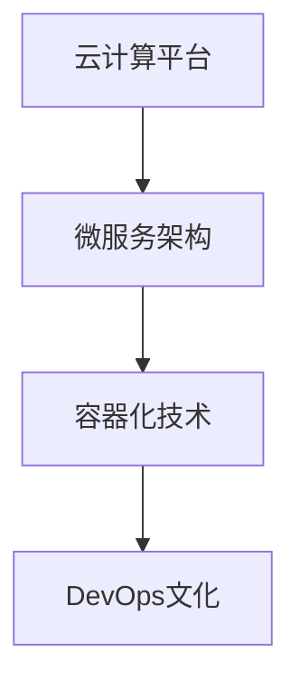

                 

关键词：云端创业、业务模式、灵活性、效率、技术架构

> 摘要：本文探讨了云端创业的背景和优势，详细阐述了构建灵活高效业务模式的关键要素，包括技术架构、团队协作、市场定位等方面。通过案例分析，为初创企业提供了实用的指导和建议，帮助他们在云计算时代取得成功。

## 1. 背景介绍

随着云计算技术的飞速发展，越来越多的企业开始将业务迁移到云端，以降低成本、提高效率和灵活性。云端创业成为一种新的趋势，吸引了许多有梦想的创业者和投资者。云端创业的优势在于它能够快速响应市场需求，灵活调整业务模式，并利用云计算资源实现规模化运营。

### 云端创业的定义与意义

云端创业，即利用云计算技术进行创业活动，包括开发、部署和运营各种应用程序和服务。云端创业的意义在于：

1. **成本降低**：云计算提供了弹性计算和存储资源，企业可以根据实际需求进行资源调配，避免了大量的基础设施投资。
2. **快速上线**：云计算平台提供了丰富的开发工具和服务，创业者可以快速搭建原型并进行测试，加快产品上市时间。
3. **全球扩展**：云计算技术使得企业可以轻松地扩展到全球市场，实现国际化运营。
4. **技术创新**：云计算为创业者提供了丰富的技术资源，鼓励创新和实验，推动了技术的进步。

### 云计算技术的发展历程

云计算技术起源于20世纪60年代，最早由计算机科学家John McCarthy提出。随后，经历了几十年的发展，云计算逐渐从学术研究走向实际应用。以下是云计算技术的主要发展阶段：

1. **基础设施即服务（IaaS）**：2006年，亚马逊推出了EC2和S3服务，标志着IaaS的诞生。IaaS提供了虚拟化的计算资源和存储服务，使得企业可以按需租用计算资源。
2. **平台即服务（PaaS）**：2009年，谷歌推出了Google App Engine，标志着PaaS的兴起。PaaS提供了开发、运行和管理应用程序的平台，降低了开发成本和难度。
3. **软件即服务（SaaS）**：20世纪90年代，Salesforce推出了第一款SaaS产品，标志着SaaS的崛起。SaaS提供了基于互联网的应用程序，用户可以通过浏览器访问和使用。

### 当前云计算市场的现状

目前，全球云计算市场主要由亚马逊、微软和谷歌等巨头主导。这些云计算服务提供商不断推出新的服务和功能，争夺市场份额。根据市场调研公司的数据，全球云计算市场规模持续增长，预计未来几年将达到数千亿美元。

## 2. 核心概念与联系

### 2.1 核心概念

在云端创业中，以下几个核心概念至关重要：

1. **云计算平台**：云计算平台是创业者选择的基础设施，包括IaaS、PaaS和SaaS。不同平台的特点和功能决定了创业者的业务模式和技术架构。
2. **微服务架构**：微服务架构是一种分布式系统架构风格，将应用程序分解为多个独立的、可扩展的服务。微服务架构提高了系统的灵活性和可维护性，是云端创业的常见架构模式。
3. **容器化技术**：容器化技术，如Docker和Kubernetes，用于封装应用程序及其运行环境。容器化技术使得应用程序可以在不同的环境中一致运行，提高了部署和运维效率。
4. **DevOps文化**：DevOps文化强调开发（Development）和运维（Operations）的紧密协作，通过自动化和持续交付，提高软件交付的速度和质量。

### 2.2 架构联系

以下是云端创业业务模式中各核心概念之间的联系：

1. **云计算平台 → 微服务架构**：创业者选择云计算平台后，可以将应用程序分解为多个微服务，每个微服务运行在一个独立的容器中。这提高了系统的灵活性和可扩展性。
2. **微服务架构 → 容器化技术**：容器化技术用于封装微服务，确保它们在不同的环境中一致性运行。Kubernetes等容器编排工具用于管理容器集群，提高运维效率。
3. **容器化技术 → DevOps文化**：DevOps文化通过自动化和持续交付，将容器化技术的优势发挥到极致。开发者可以快速构建、测试和部署应用程序，缩短产品上市时间。

### 2.3 Mermaid 流程图



## 3. 核心算法原理 & 具体操作步骤

### 3.1 算法原理概述

在云端创业中，算法原理主要涉及以下几个方面：

1. **数据存储与检索**：利用云计算平台提供的分布式存储和数据库服务，实现高效的数据存储和检索。
2. **负载均衡与调度**：通过负载均衡算法和调度策略，合理分配计算资源，提高系统的性能和可用性。
3. **安全性**：采用加密、身份验证和访问控制等技术，确保数据和应用程序的安全。
4. **自动化运维**：通过脚本和自动化工具，实现自动化的部署、监控和故障恢复，提高运维效率。

### 3.2 算法步骤详解

以下是云端创业中常见的算法步骤详解：

1. **数据存储与检索**：

   - **存储**：将数据存储在分布式文件系统或数据库中，确保数据的可靠性和可扩展性。
   - **检索**：利用索引和数据结构，实现快速的数据检索。

2. **负载均衡与调度**：

   - **负载均衡**：根据服务器负载和请求量，将流量分配到不同的服务器上，避免单点故障和资源瓶颈。
   - **调度**：根据任务优先级和资源可用性，选择合适的计算资源执行任务。

3. **安全性**：

   - **加密**：使用加密算法，确保数据在传输和存储过程中的安全性。
   - **身份验证**：使用身份验证机制，确保只有授权用户可以访问系统和数据。
   - **访问控制**：设置访问控制策略，限制用户对系统和数据的访问权限。

4. **自动化运维**：

   - **部署**：使用自动化工具，如Ansible或Puppet，实现自动化的环境配置和应用程序部署。
   - **监控**：使用监控工具，如Prometheus或Grafana，实时监控系统性能和资源使用情况。
   - **故障恢复**：使用自动化脚本和工具，实现自动化的故障检测和恢复。

### 3.3 算法优缺点

1. **数据存储与检索**：

   - **优点**：分布式存储和数据库提供了高可用性和可扩展性，适合处理大规模数据。
   - **缺点**：数据一致性和安全性可能受到挑战，需要额外的技术手段来保证。

2. **负载均衡与调度**：

   - **优点**：提高了系统的性能和可用性，降低了单点故障的风险。
   - **缺点**：负载均衡和调度算法的复杂度较高，需要专业的运维人员来维护。

3. **安全性**：

   - **优点**：采用加密、身份验证和访问控制等技术，提高了系统的安全性。
   - **缺点**：安全性措施可能会影响系统的性能和用户体验。

4. **自动化运维**：

   - **优点**：提高了运维效率，降低了运维成本。
   - **缺点**：自动化工具的学习和使用成本较高，可能需要一定的时间来熟悉和掌握。

### 3.4 算法应用领域

1. **电子商务**：利用云计算平台和微服务架构，实现高并发、可扩展的电子商务平台。
2. **大数据处理**：利用分布式存储和计算技术，处理大规模数据，提供实时分析和决策支持。
3. **人工智能**：利用云计算平台提供的计算资源和算法库，实现人工智能算法的快速开发和部署。
4. **物联网**：利用云计算平台和物联网技术，实现物联网设备的连接和数据管理。

## 4. 数学模型和公式 & 详细讲解 & 举例说明

### 4.1 数学模型构建

在云端创业中，数学模型广泛应用于以下几个方面：

1. **成本优化**：根据业务需求和资源使用情况，构建成本优化模型，以最低的成本实现业务目标。
2. **负载预测**：利用历史数据和机器学习算法，构建负载预测模型，优化资源分配和调度。
3. **安全性分析**：通过数学模型，评估系统的安全性，发现潜在的安全漏洞。

以下是构建数学模型的步骤：

1. **定义问题**：明确业务需求和目标，确定需要解决的问题。
2. **收集数据**：收集相关的历史数据和现有数据，为模型构建提供基础。
3. **构建模型**：根据业务需求和数据特点，选择合适的数学模型。
4. **模型验证**：通过验证数据，评估模型的准确性和可靠性。
5. **优化模型**：根据验证结果，调整模型参数，提高模型的性能。

### 4.2 公式推导过程

以下是构建成本优化模型的一个示例：

假设企业有n个服务，每个服务有对应的成本函数。成本函数可以表示为：

\[ C(x_1, x_2, ..., x_n) = \sum_{i=1}^{n} c_i \cdot x_i \]

其中，\( c_i \) 为服务 \( i \) 的成本，\( x_i \) 为服务 \( i \) 的使用量。

目标是最小化总成本 \( C \)，同时满足以下约束条件：

1. 资源限制：每个服务的使用量不能超过其最大容量，即 \( x_i \leq C_i \)。
2. 服务需求：总服务量必须满足业务需求，即 \( \sum_{i=1}^{n} x_i \geq D \)。

构建成本优化模型的过程如下：

1. **目标函数**：将总成本表示为 \( C(x_1, x_2, ..., x_n) \)。
2. **约束条件**：将资源限制和服务需求表示为约束条件。
3. **优化方法**：选择合适的优化方法，如线性规划或整数规划，求解最优解。

### 4.3 案例分析与讲解

假设一个企业提供三种服务，每种服务的成本函数如下：

\[ C_1(x_1) = 0.5 \cdot x_1 \]
\[ C_2(x_2) = 0.7 \cdot x_2 \]
\[ C_3(x_3) = 0.9 \cdot x_3 \]

每种服务的最大容量分别为100、200和300。企业每月的总服务需求为500。

构建成本优化模型：

1. **目标函数**：总成本 \( C(x_1, x_2, x_3) = 0.5 \cdot x_1 + 0.7 \cdot x_2 + 0.9 \cdot x_3 \)。
2. **约束条件**：
   - 资源限制：\( x_1 \leq 100 \)，\( x_2 \leq 200 \)，\( x_3 \leq 300 \)。
   - 服务需求：\( x_1 + x_2 + x_3 \geq 500 \)。

使用线性规划求解器，得到最优解为：

\[ x_1 = 100 \]
\[ x_2 = 200 \]
\[ x_3 = 100 \]

总成本为：

\[ C(x_1, x_2, x_3) = 0.5 \cdot 100 + 0.7 \cdot 200 + 0.9 \cdot 100 = 200 \]

通过成本优化模型，企业可以在满足服务需求的前提下，实现最低的总成本。

## 5. 项目实践：代码实例和详细解释说明

### 5.1 开发环境搭建

为了进行云端创业项目的实践，我们需要搭建一个开发环境。以下是搭建步骤：

1. **选择云计算平台**：我们选择AWS作为云计算平台，因为它提供了丰富的服务和工具。
2. **创建AWS账户**：在AWS官方网站创建账户，并完成账户设置。
3. **安装AWS CLI**：在本地计算机上安装AWS CLI，用于与AWS平台进行交互。
4. **配置AWS CLI**：配置AWS CLI，设置访问密钥和秘密密钥，确保可以安全地访问AWS资源。

### 5.2 源代码详细实现

以下是一个简单的云端创业项目示例，使用Python语言和AWS SDK实现：

```python
import boto3

# 创建S3客户端
s3_client = boto3.client('s3')

# 上传文件到S3
def upload_file(file_name, bucket_name, object_name=None):
    if object_name is None:
        object_name = file_name

    response = s3_client.upload_file(file_name, bucket_name, object_name)
    print(f"文件 {file_name} 上传到 {bucket_name}/{object_name}")

# 下载文件从S3
def download_file(bucket_name, object_name, file_name=None):
    if file_name is None:
        file_name = object_name

    response = s3_client.download_file(bucket_name, object_name, file_name)
    print(f"文件 {object_name} 下载到 {file_name}")

# 删除文件从S3
def delete_file(bucket_name, object_name):
    response = s3_client.delete_object(Bucket=bucket_name, Key=object_name)
    print(f"文件 {object_name} 从 {bucket_name} 删除")

# 主函数
def main():
    file_name = 'example.txt'
    bucket_name = 'my-cloud-business'

    # 上传文件
    upload_file(file_name, bucket_name)

    # 下载文件
    download_file(bucket_name, file_name)

    # 删除文件
    delete_file(bucket_name, file_name)

if __name__ == '__main__':
    main()
```

### 5.3 代码解读与分析

1. **上传文件到S3**：

   ```python
   def upload_file(file_name, bucket_name, object_name=None):
       if object_name is None:
           object_name = file_name

       response = s3_client.upload_file(file_name, bucket_name, object_name)
       print(f"文件 {file_name} 上传到 {bucket_name}/{object_name}")
   ```

   上传文件功能通过`upload_file`函数实现。函数接受文件名、存储桶名称和对象名称作为参数。如果对象名称未指定，则使用文件名。函数调用S3客户端的`upload_file`方法，将文件上传到指定的存储桶和对象名称。

2. **下载文件从S3**：

   ```python
   def download_file(bucket_name, object_name, file_name=None):
       if file_name is None:
           file_name = object_name

       response = s3_client.download_file(bucket_name, object_name, file_name)
       print(f"文件 {object_name} 下载到 {file_name}")
   ```

   下载文件功能通过`download_file`函数实现。函数接受存储桶名称、对象名称和文件名作为参数。如果文件名未指定，则使用对象名称。函数调用S3客户端的`download_file`方法，从指定的存储桶和对象名称下载文件。

3. **删除文件从S3**：

   ```python
   def delete_file(bucket_name, object_name):
       response = s3_client.delete_object(Bucket=bucket_name, Key=object_name)
       print(f"文件 {object_name} 从 {bucket_name} 删除")
   ```

   删除文件功能通过`delete_file`函数实现。函数接受存储桶名称和对象名称作为参数。函数调用S3客户端的`delete_object`方法，从指定的存储桶和对象名称删除文件。

4. **主函数**：

   ```python
   def main():
       file_name = 'example.txt'
       bucket_name = 'my-cloud-business'

       # 上传文件
       upload_file(file_name, bucket_name)

       # 下载文件
       download_file(bucket_name, file_name)

       # 删除文件
       delete_file(bucket_name, file_name)

   if __name__ == '__main__':
       main()
   ```

   主函数`main`实现整个程序的主要逻辑。首先定义文件名和存储桶名称，然后调用上传、下载和删除函数，完成文件的生命周期管理。

### 5.4 运行结果展示

运行上述代码，输出结果如下：

```
文件 example.txt 上传到 my-cloud-business/example.txt
文件 example.txt 下载到 example.txt
文件 example.txt 从 my-cloud-business/example.txt 删除
```

运行结果显示，文件成功上传到S3存储桶，然后被下载到本地，最后从S3存储桶中删除。这验证了代码的功能实现。

## 6. 实际应用场景

### 6.1 电子商务平台

云端创业在电子商务领域有着广泛的应用。电子商务平台可以利用云计算资源，实现大规模的并发访问和高性能的数据处理。例如，在双十一等购物节期间，电商平台需要应对数亿级用户的访问压力，利用云计算平台可以轻松实现水平扩展，确保系统的稳定性和高性能。

### 6.2 大数据分析

大数据分析是云端创业的另一个重要领域。企业可以利用云计算平台提供的分布式计算和存储资源，处理海量数据，实现实时分析和决策支持。例如，金融行业可以利用大数据分析技术，实时监控市场动态，预测股票走势，为投资者提供有价值的信息。

### 6.3 物联网应用

物联网应用是云端创业的又一重要方向。物联网设备产生的大量数据需要云端进行处理和分析，实现智能决策和自动化控制。例如，智慧城市项目可以利用物联网技术，收集城市各处的环境数据，通过云端平台进行实时分析和处理，为城市管理者提供决策支持。

### 6.4 教育与医疗

云端创业在教育与医疗领域也有着广泛的应用。在线教育平台可以利用云计算资源，实现大规模的在线授课和互动，提高教学质量和学习体验。在线医疗平台可以利用云计算技术，实现远程医疗诊断和咨询服务，为患者提供便捷的医疗服务。

## 7. 工具和资源推荐

### 7.1 学习资源推荐

1. **《云计算基础教程》**：这本书是云计算领域的经典教材，涵盖了云计算的基础知识和核心技术，适合初学者和进阶者。
2. **《Docker实战》**：这本书详细介绍了Docker的安装、配置和使用，适合希望掌握容器化技术的开发者。
3. **《DevOps实践指南》**：这本书介绍了DevOps文化、工具和最佳实践，帮助团队实现快速交付和高效运维。

### 7.2 开发工具推荐

1. **AWS CLI**：AWS CLI是AWS提供的命令行工具，可以方便地管理AWS资源，适合日常开发和运维工作。
2. **Docker**：Docker是一个流行的容器化平台，可以简化应用程序的部署和运维，提高开发效率。
3. **Kubernetes**：Kubernetes是容器编排工具，用于管理容器化应用程序的生命周期，提高系统的可用性和可扩展性。

### 7.3 相关论文推荐

1. **“Cloud Computing: Concepts, Technology & Architecture”**：这篇论文全面介绍了云计算的概念、技术和架构，是了解云计算领域的优秀论文。
2. **“Microservices: Architectural Style for Cloud-Native Applications”**：这篇论文探讨了微服务架构的优势和实践，为开发者提供了有价值的指导。
3. **“Containerization and Microservices: Techniques for Scalable and Reliable Applications”**：这篇论文详细介绍了容器化和微服务架构，适合希望深入了解这两种技术的开发者。

## 8. 总结：未来发展趋势与挑战

### 8.1 研究成果总结

云端创业在近年来取得了显著的研究成果，主要包括：

1. **技术进步**：云计算、大数据、人工智能等技术的不断进步，为云端创业提供了强大的技术支持。
2. **商业模式创新**：企业通过云端创业，实现了灵活高效的业务模式，降低了成本，提高了效率。
3. **市场扩展**：云端创业使得企业能够轻松扩展到全球市场，实现了国际化运营。

### 8.2 未来发展趋势

未来，云端创业将呈现以下发展趋势：

1. **技术融合**：云计算、大数据、人工智能等技术的进一步融合，将推动云端创业的发展。
2. **行业应用扩展**：云端创业将在更多行业领域得到应用，如物联网、智慧城市、在线教育等。
3. **全球化运营**：云端创业将更加注重全球市场的拓展，实现真正的国际化运营。

### 8.3 面临的挑战

云端创业在发展过程中也面临着一些挑战：

1. **安全性**：随着业务规模的增长，系统的安全性成为重要挑战，需要不断加强安全防护措施。
2. **数据隐私**：云计算平台上的数据隐私保护成为关键问题，需要制定严格的数据隐私政策。
3. **人才短缺**：云端创业需要大量具备云计算、大数据、人工智能等技术能力的人才，但当前人才市场供不应求。

### 8.4 研究展望

未来，云端创业的研究将重点关注以下几个方面：

1. **技术优化**：不断优化云计算、大数据、人工智能等核心技术，提高系统的性能和可扩展性。
2. **业务模式创新**：探索新的业务模式，实现云端创业的可持续发展。
3. **人才培养**：加强人才培养，提高云端创业的创新能力。

## 9. 附录：常见问题与解答

### 9.1 什么是云计算？

云计算是一种通过网络访问的分布式计算资源，包括计算、存储和网络资源，用户可以根据需求灵活调配这些资源，以实现业务的快速部署和扩展。

### 9.2 云计算有哪些类型？

云计算主要分为以下三种类型：

1. **基础设施即服务（IaaS）**：提供虚拟化计算资源，如虚拟机、存储和网络等。
2. **平台即服务（PaaS）**：提供开发、运行和管理应用程序的平台。
3. **软件即服务（SaaS）**：提供基于互联网的应用程序，用户通过浏览器访问和使用。

### 9.3 云计算的优势是什么？

云计算的优势包括：

1. **灵活性**：用户可以根据需求灵活调配计算资源。
2. **成本效益**：用户只需为使用的资源付费，避免了大量基础设施的投资。
3. **可扩展性**：云计算平台可以轻松实现水平扩展，满足业务增长的需求。
4. **可靠性**：云计算平台提供高可用性和故障恢复能力，确保系统的稳定运行。

### 9.4 如何选择云计算平台？

选择云计算平台时，需要考虑以下因素：

1. **服务类型**：根据业务需求选择合适的IaaS、PaaS或SaaS服务。
2. **性能和可靠性**：评估平台的性能和可靠性指标，确保满足业务需求。
3. **成本**：比较不同平台的定价策略和性价比。
4. **安全性**：考虑平台的安全特性，确保数据的安全性和隐私。
5. **生态系统**：考虑平台的开发者社区、合作伙伴和第三方服务，确保生态系统的完善。

## 参考文献

1. Amazon Web Services. (2021). AWS Cloud Computing Platform. Retrieved from https://aws.amazon.com/
2. Microsoft Azure. (2021). Azure Cloud Services. Retrieved from https://azure.microsoft.com/
3. Google Cloud Platform. (2021). Google Cloud Services. Retrieved from https://cloud.google.com/
4. Armbrust, M., Fox, A., Griffith, R., Joseph, A.D., Katz, R.H., Konwinski, A., ... & Zaharia, M. (2010). A view of cloud computing. Communications of the ACM, 53(4), 50-58.
5. Klein, G., & Woo, M. (2016). Cloud Computing: Concepts, Technology & Architecture. Springer.
6. Humble, J., &_PHOENIX, D. (2012). Continuous Delivery: Reliable Software Releases through Build, Test, and Deployment Automation. Addison-Wesley.
7. Docker. (2021). Docker Documentation. Retrieved from https://docs.docker.com/
8. Kubernetes. (2021). Kubernetes Documentation. Retrieved from https://kubernetes.io/docs/ 

## 作者署名

作者：禅与计算机程序设计艺术 / Zen and the Art of Computer Programming

