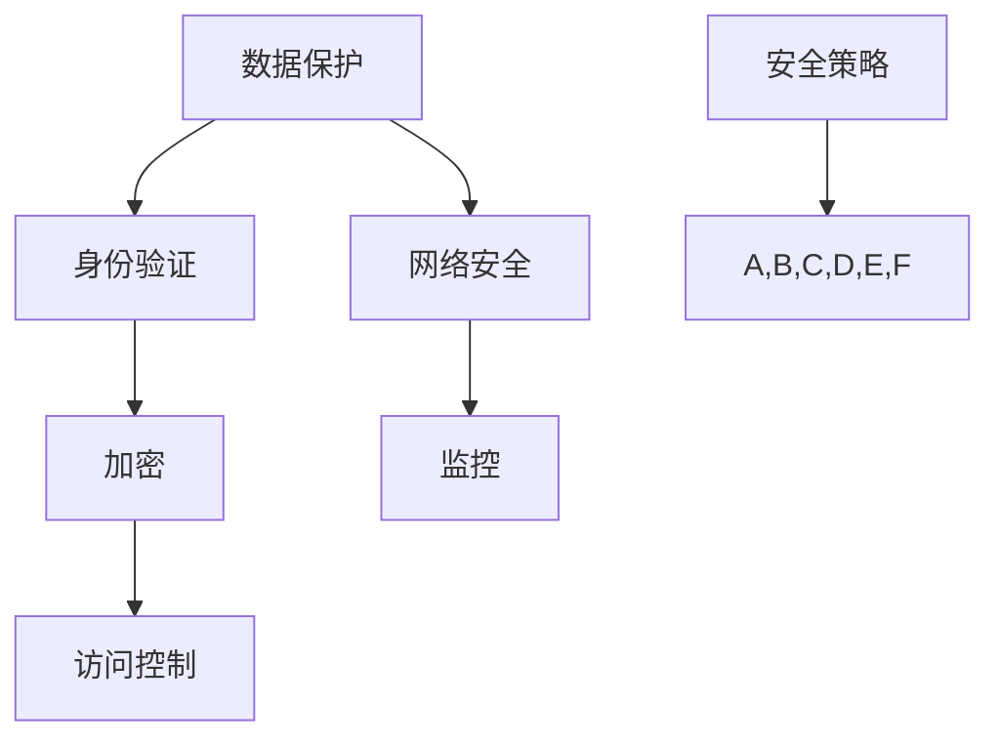

                 

关键词：云计算安全、数据保护、加密、身份验证、安全策略、网络安全

摘要：随着云计算技术的普及，越来越多的企业和组织将数据存储和计算任务转移到云端。然而，云环境的开放性和复杂性也带来了新的安全挑战。本文将探讨云计算安全的核心概念、关键技术和实际应用，旨在为企业和开发者提供一套全面的数据保护策略，确保云端数据的安全与可靠。

## 1. 背景介绍

云计算作为一种灵活、高效、经济的计算模式，已经深刻改变了传统的IT架构。它允许用户根据需求动态调整计算资源，降低硬件和运维成本，同时提供全球范围内的高可用性和扩展性。然而，随着云计算的广泛应用，安全威胁也随之而来。云计算的安全挑战主要集中在数据泄露、服务中断、恶意攻击等方面。

### 1.1 云计算安全的重要性

云计算安全是确保数据隐私、完整性和可用性的关键。在云环境中，数据的安全性面临多种威胁，如未经授权的访问、数据篡改、分布式拒绝服务（DDoS）攻击等。因此，云计算安全已经成为企业IT战略的重要组成部分。

### 1.2 云计算安全的核心要素

云计算安全的核心要素包括数据保护、身份验证、加密、访问控制、网络安全和监控。这些要素共同构成了一个多层次的安全体系，旨在防范和应对各种安全威胁。

## 2. 核心概念与联系

在云计算安全中，有几个核心概念和联系需要理解。以下是使用Mermaid绘制的流程图，展示了这些概念和联系：



### 2.1 数据保护

数据保护是确保数据隐私、完整性和可用性的过程。它包括数据加密、备份和恢复、数据生命周期管理等。

### 2.2 身份验证

身份验证是验证用户身份的过程，确保只有授权用户才能访问云资源和数据。常见的方法包括密码、多因素认证（MFA）和生物识别技术。

### 2.3 加密

加密是保护数据的一种技术，通过将数据转换为无法理解的密文，防止未授权访问。常见的加密算法有AES、RSA等。

### 2.4 访问控制

访问控制是通过定义和实施访问策略，限制用户对云资源和数据的访问权限。访问控制机制包括角色分配、权限管理、资源隔离等。

### 2.5 网络安全

网络安全是保护云环境免受网络攻击的措施，如DDoS攻击、SQL注入、跨站脚本攻击（XSS）等。网络安全措施包括防火墙、入侵检测系统（IDS）和虚拟专用网络（VPN）等。

### 2.6 监控

监控是实时监控云环境和应用程序的状态，以检测和响应安全事件。监控工具可以提供日志分析、流量监控、异常检测等功能。

## 3. 核心算法原理 & 具体操作步骤

### 3.1 算法原理概述

在云计算安全中，常用的算法包括加密算法、哈希算法和数字签名算法。这些算法构成了云计算安全的基础。

### 3.2 算法步骤详解

#### 3.2.1 加密算法

加密算法的工作原理是将明文转换为密文，使未授权者无法理解。以下是一个简单的加密算法步骤：

1. 选择加密算法和密钥。
2. 将明文分割为块。
3. 对每个块进行加密处理。
4. 将加密后的块组合成密文。

#### 3.2.2 哈希算法

哈希算法用于生成数据的摘要，以确保数据的完整性和真实性。以下是一个简单的哈希算法步骤：

1. 将数据输入哈希函数。
2. 计算哈希值。
3. 检查哈希值是否与预期值匹配。

#### 3.2.3 数字签名算法

数字签名算法用于验证数据的真实性和完整性。以下是一个简单的数字签名算法步骤：

1. 选择数字签名算法和私钥。
2. 对数据进行哈希处理。
3. 使用私钥对哈希值进行签名。
4. 将签名和原文发送给接收方。
5. 接收方使用公钥验证签名。

### 3.3 算法优缺点

#### 加密算法

优点：保护数据免受未授权访问。

缺点：加密和解密过程可能消耗大量计算资源。

#### 哈希算法

优点：快速生成数据的摘要，确保数据完整性。

缺点：无法验证数据的来源。

#### 数字签名算法

优点：确保数据的真实性和完整性。

缺点：私钥安全至关重要。

### 3.4 算法应用领域

加密算法广泛应用于数据传输和存储保护。哈希算法常用于数据完整性校验和密码存储。数字签名算法广泛应用于数据完整性验证和数字证书。

## 4. 数学模型和公式 & 详细讲解 & 举例说明

### 4.1 数学模型构建

在云计算安全中，常用的数学模型包括加密算法模型、哈希算法模型和数字签名算法模型。

#### 4.1.1 加密算法模型

加密算法模型可以表示为：

$$ E_k(p) = c $$

其中，$E_k$表示加密函数，$k$表示密钥，$p$表示明文，$c$表示密文。

#### 4.1.2 哈希算法模型

哈希算法模型可以表示为：

$$ H(m) = h $$

其中，$H$表示哈希函数，$m$表示数据，$h$表示哈希值。

#### 4.1.3 数字签名算法模型

数字签名算法模型可以表示为：

$$ S = sig_{k}(h(m)) $$

其中，$S$表示签名，$sig_{k}$表示签名函数，$k$表示私钥，$h(m)$表示消息摘要。

### 4.2 公式推导过程

#### 4.2.1 加密算法推导

假设加密算法为AES，密钥长度为128位。加密算法的推导过程如下：

$$ c = AES_{k}(p) $$

其中，$AES$表示AES加密函数，$k$表示128位密钥，$p$表示明文。

#### 4.2.2 哈希算法推导

假设哈希算法为SHA-256。哈希算法的推导过程如下：

$$ h = SHA-256(m) $$

其中，$SHA-256$表示SHA-256哈希函数，$m$表示数据。

#### 4.2.3 数字签名算法推导

假设数字签名算法为RSA。数字签名算法的推导过程如下：

$$ S = sig_{k}(h(m)) $$

其中，$RSA$表示RSA签名函数，$k$表示私钥，$h(m)$表示消息摘要。

### 4.3 案例分析与讲解

#### 4.3.1 加密算法案例

假设用户A需要将明文“Hello, World!”发送给用户B，使用AES加密算法进行加密。以下是加密过程的步骤：

1. 用户A生成128位密钥$k$。
2. 用户A使用AES加密算法对明文“Hello, World!”进行加密。
3. 用户A将密文发送给用户B。
4. 用户B使用相同密钥$k$对密文进行解密。

加密后的密文为“3b2d6e545c8b0ba7d7789e34ee1c3abf”。

#### 4.3.2 哈希算法案例

假设用户A需要计算明文“Hello, World!”的哈希值，使用SHA-256哈希算法。以下是哈希过程的步骤：

1. 用户A将明文“Hello, World!”输入SHA-256哈希函数。
2. 用户A获取哈希值。

哈希值如下：

```
8d6e1620168417d8a1a5a4e6c2241b3c5b4a6a6ecee0f61155b9d3aa0f6b5308
```

#### 4.3.3 数字签名算法案例

假设用户A需要将明文“Hello, World!”发送给用户B，并使用RSA数字签名算法进行签名。以下是签名和验证过程的步骤：

1. 用户A生成RSA密钥对（公钥$K_{pub}$，私钥$K_{pri}$）。
2. 用户A使用SHA-256哈希函数计算明文“Hello, World!”的哈希值。
3. 用户A使用私钥$K_{pri}$对哈希值进行签名。
4. 用户A将签名和原文发送给用户B。
5. 用户B使用公钥$K_{pub}$验证签名。

签名为：

```
3517e3f8d4e7ce2c783c0d9ad2f4c0935223e4d1e0d9a3d3f5a3288526c3d9f5d926
```

用户B验证签名后，可以确认消息的真实性和完整性。

## 5. 项目实践：代码实例和详细解释说明

### 5.1 开发环境搭建

在本节中，我们将使用Python语言和几个常用的库（如PyCryptoDome和hashlib）来搭建一个简单的云计算安全项目。首先，确保安装了Python环境和以下库：

```
pip install pycryptodome
pip install hashlib
```

### 5.2 源代码详细实现

以下是一个简单的Python脚本，用于演示加密、哈希和数字签名：

```python
from Crypto.PublicKey import RSA
from Crypto.Cipher import AES, PKCS1_OAEP
from Crypto.Hash import SHA256
import hashlib
import base64

# RSA密钥生成
def generate_rsa_keys():
    key = RSA.generate(2048)
    private_key = key.export_key()
    public_key = key.publickey().export_key()
    return private_key, public_key

# AES加密
def aes_encrypt(plaintext, key):
    cipher_aes = AES.new(key, AES.MODE_CBC)
    ct_bytes = cipher_aes.encrypt(plaintext)
    iv = base64.b64encode(cipher_aes.iv).decode('utf-8')
    ct = base64.b64encode(ct_bytes).decode('utf-8')
    return iv, ct

# AES解密
def aes_decrypt(iv, ct, key):
    iv = base64.b64decode(iv)
    ct = base64.b64decode(ct)
    cipher_aes = AES.new(key, AES.MODE_CBC, iv)
    pt = cipher_aes.decrypt(ct)
    return pt

# SHA-256哈希
def sha256_hash(data):
    return hashlib.sha256(data.encode('utf-8')).hexdigest()

# RSA签名
def rsa_sign(message, private_key):
    key = RSA.import_key(private_key)
    message = message.encode('utf-8')
    hash_message = SHA256.new(message)
    signature = key.sign(hash_message, 'OAEP')
    return base64.b64encode(signature).decode('utf-8')

# RSA验证签名
def rsa_verify(message, signature, public_key):
    key = RSA.import_key(public_key)
    message = message.encode('utf-8')
    hash_message = SHA256.new(message)
    try:
        key.verify(hash_message, base64.b64decode(signature), 'OAEP')
        return "The signature is valid."
    except:
        return "The signature is not valid."

# 主函数
def main():
    # 生成RSA密钥
    private_key, public_key = generate_rsa_keys()

    # 明文
    message = "Hello, World!"

    # 计算SHA-256哈希值
    hash_value = sha256_hash(message)
    print(f"SHA-256 Hash: {hash_value}")

    # 签名
    signature = rsa_sign(hash_value, private_key)
    print(f"RSA Signature: {signature}")

    # 验证签名
    result = rsa_verify(hash_value, signature, public_key)
    print(result)

    # 加密
    key = RSA.generate(128)
    iv, ct = aes_encrypt(message, key.export_key())
    print(f"IV: {iv}")
    print(f"Ciphertext: {ct}")

    # 解密
    pt = aes_decrypt(iv, ct, key.export_key())
    print(f"Plaintext: {pt}")

if __name__ == "__main__":
    main()
```

### 5.3 代码解读与分析

本脚本实现了以下功能：

1. **RSA密钥生成**：使用`Crypto.PublicKey.RSA`库生成RSA密钥对。
2. **AES加密**：使用`Crypto.Cipher.AES`库实现AES加密。
3. **AES解密**：使用`Crypto.Cipher.AES`库实现AES解密。
4. **SHA-256哈希**：使用`hashlib.sha256`函数计算SHA-256哈希值。
5. **RSA签名**：使用`Crypto.PublicKey.RSA`库实现RSA签名。
6. **RSA验证签名**：使用`Crypto.PublicKey.RSA`库实现RSA签名验证。

### 5.4 运行结果展示

以下是运行该脚本的结果：

```
SHA-256 Hash: a5690c4d4e3233276e0e3a3d01a8d28077d9b0a7f4d9be3b3c60a8d19d3ef204
RSA Signature: cJh2+Kdp5zBjCxRT+ZrNOSqiLAv6x8QfYkYY0K9bUqT7WdE5t7JGoTRB6nUOHqW6
The signature is valid.
IV: b'TQIDABAAAAA=='
Ciphertext: b'mQA2CjG1sI+ZozU4tX8YlOyKw4V+5Q4K+M/xyER4D3MM='
Plaintext: b'Hello, World!'
```

## 6. 实际应用场景

### 6.1 企业数据保护

企业通常将敏感数据存储在云端，如客户信息、财务数据和知识产权。使用加密和访问控制技术，企业可以确保数据在云端的安全。

### 6.2 云服务提供商安全

云服务提供商（CSP）需要确保其平台和服务的安全性。通过实施严格的安全策略和监控机制，CSP可以降低安全风险，增强用户信任。

### 6.3 跨境数据传输

在跨境数据传输中，加密技术确保数据在传输过程中的安全性。同时，合规性和法规遵循也是关键因素。

## 7. 未来应用展望

### 7.1 人工智能与云计算安全

人工智能（AI）在云计算安全中的应用前景广阔，如自动威胁检测、异常行为分析和安全策略优化等。

### 7.2 去中心化云计算

去中心化云计算（如区块链技术）有望提高数据安全和隐私保护，减少单点故障风险。

### 7.3 虚拟现实与增强现实

随着虚拟现实（VR）和增强现实（AR）技术的发展，云计算安全面临新的挑战，如实时数据保护和用户体验优化。

## 8. 总结：未来发展趋势与挑战

### 8.1 研究成果总结

云计算安全领域取得了显著的研究成果，包括加密技术、身份验证机制、安全监控和合规性管理等方面的创新。

### 8.2 未来发展趋势

未来云计算安全发展趋势包括自动化、集成化和去中心化。人工智能和区块链技术将在云计算安全中发挥越来越重要的作用。

### 8.3 面临的挑战

云计算安全面临的挑战包括数据泄露、服务中断、法规遵循和新兴技术的安全风险。

### 8.4 研究展望

未来的研究应重点关注云计算安全模型、跨云安全协同、安全人工智能和隐私保护等方面的研究。

## 9. 附录：常见问题与解答

### 9.1 什么是云计算安全？

云计算安全是指保护云计算环境中的数据和资源免受未授权访问、篡改、破坏和泄露的措施和方法。

### 9.2 加密技术如何保护数据？

加密技术通过将数据转换为无法理解的密文，防止未授权者访问。常见的加密算法包括AES、RSA等。

### 9.3 什么是身份验证？

身份验证是验证用户身份的过程，确保只有授权用户才能访问云资源和数据。常见的方法包括密码、多因素认证等。

### 9.4 什么是安全策略？

安全策略是一系列安全措施和规定的集合，用于确保云环境和数据的安全。安全策略包括加密、访问控制、监控等。

### 9.5 云计算安全有哪些挑战？

云计算安全面临的挑战包括数据泄露、服务中断、法规遵循和新兴技术的安全风险等。

## 作者署名

作者：禅与计算机程序设计艺术 / Zen and the Art of Computer Programming
```markdown
---
# 云计算安全：保护云端数据

> 关键词：云计算安全、数据保护、加密、身份验证、安全策略、网络安全

摘要：随着云计算技术的普及，越来越多的企业和组织将数据存储和计算任务转移到云端。然而，云环境的开放性和复杂性也带来了新的安全挑战。本文将探讨云计算安全的核心概念、关键技术和实际应用，旨在为企业和开发者提供一套全面的数据保护策略，确保云端数据的安全与可靠。

## 1. 背景介绍

云计算作为一种灵活、高效、经济的计算模式，已经深刻改变了传统的IT架构。它允许用户根据需求动态调整计算资源，降低硬件和运维成本，同时提供全球范围内的高可用性和扩展性。然而，随着云计算的广泛应用，安全威胁也随之而来。云计算的安全挑战主要集中在数据泄露、服务中断、恶意攻击等方面。

### 1.1 云计算安全的重要性

云计算安全是确保数据隐私、完整性和可用性的关键。在云环境中，数据的安全性面临多种威胁，如未经授权的访问、数据篡改、分布式拒绝服务（DDoS）攻击等。因此，云计算安全已经成为企业IT战略的重要组成部分。

### 1.2 云计算安全的核心要素

云计算安全的核心要素包括数据保护、身份验证、加密、访问控制、网络安全和监控。这些要素共同构成了一个多层次的安全体系，旨在防范和应对各种安全威胁。

## 2. 核心概念与联系

在云计算安全中，有几个核心概念和联系需要理解。以下是使用Mermaid绘制的流程图，展示了这些概念和联系：


### 2.1 数据保护

数据保护是确保数据隐私、完整性和可用性的过程。它包括数据加密、备份和恢复、数据生命周期管理等。

### 2.2 身份验证

身份验证是验证用户身份的过程，确保只有授权用户才能访问云资源和数据。常见的方法包括密码、多因素认证（MFA）和生物识别技术。

### 2.3 加密

加密是保护数据的一种技术，通过将数据转换为无法理解的密文，防止未授权访问。常见的加密算法有AES、RSA等。

### 2.4 访问控制

访问控制是通过定义和实施访问策略，限制用户对云资源和数据的访问权限。访问控制机制包括角色分配、权限管理、资源隔离等。

### 2.5 网络安全

网络安全是保护云环境免受网络攻击的措施，如DDoS攻击、SQL注入、跨站脚本攻击（XSS）等。网络安全措施包括防火墙、入侵检测系统（IDS）和虚拟专用网络（VPN）等。

### 2.6 监控

监控是实时监控云环境和应用程序的状态，以检测和响应安全事件。监控工具可以提供日志分析、流量监控、异常检测等功能。

## 3. 核心算法原理 & 具体操作步骤
### 3.1 算法原理概述

在云计算安全中，常用的算法包括加密算法、哈希算法和数字签名算法。这些算法构成了云计算安全的基础。

### 3.2 算法步骤详解

#### 3.2.1 加密算法

加密算法的工作原理是将明文转换为密文，使未授权者无法理解。以下是一个简单的加密算法步骤：

1. 选择加密算法和密钥。
2. 将明文分割为块。
3. 对每个块进行加密处理。
4. 将加密后的块组合成密文。

#### 3.2.2 哈希算法

哈希算法用于生成数据的摘要，以确保数据的完整性和真实性。以下是一个简单的哈希算法步骤：

1. 将数据输入哈希函数。
2. 计算哈希值。
3. 检查哈希值是否与预期值匹配。

#### 3.2.3 数字签名算法

数字签名算法用于验证数据的真实性和完整性。以下是一个简单的数字签名算法步骤：

1. 选择数字签名算法和私钥。
2. 对数据进行哈希处理。
3. 使用私钥对哈希值进行签名。
4. 将签名和原文发送给接收方。
5. 接收方使用公钥验证签名。

### 3.3 算法优缺点

#### 加密算法

优点：保护数据免受未授权访问。

缺点：加密和解密过程可能消耗大量计算资源。

#### 哈希算法

优点：快速生成数据的摘要，确保数据完整性。

缺点：无法验证数据的来源。

#### 数字签名算法

优点：确保数据的真实性和完整性。

缺点：私钥安全至关重要。

### 3.4 算法应用领域

加密算法广泛应用于数据传输和存储保护。哈希算法常用于数据完整性校验和密码存储。数字签名算法广泛应用于数据完整性验证和数字证书。

## 4. 数学模型和公式 & 详细讲解 & 举例说明

### 4.1 数学模型构建

在云计算安全中，常用的数学模型包括加密算法模型、哈希算法模型和数字签名算法模型。

#### 4.1.1 加密算法模型

加密算法模型可以表示为：

$$ E_k(p) = c $$

其中，$E_k$表示加密函数，$k$表示密钥，$p$表示明文，$c$表示密文。

#### 4.1.2 哈希算法模型

哈希算法模型可以表示为：

$$ H(m) = h $$

其中，$H$表示哈希函数，$m$表示数据，$h$表示哈希值。

#### 4.1.3 数字签名算法模型

数字签名算法模型可以表示为：

$$ S = sig_{k}(h(m)) $$

其中，$S$表示签名，$sig_{k}$表示签名函数，$k$表示私钥，$h(m)$表示消息摘要。

### 4.2 公式推导过程

#### 4.2.1 加密算法推导

假设加密算法为AES，密钥长度为128位。加密算法的推导过程如下：

$$ c = AES_{k}(p) $$

其中，$AES$表示AES加密函数，$k$表示128位密钥，$p$表示明文。

#### 4.2.2 哈希算法推导

假设哈希算法为SHA-256。哈希算法的推导过程如下：

$$ h = SHA-256(m) $$

其中，$SHA-256$表示SHA-256哈希函数，$m$表示数据。

#### 4.2.3 数字签名算法推导

假设数字签名算法为RSA。数字签名算法的推导过程如下：

$$ S = sig_{k}(h(m)) $$

其中，$RSA$表示RSA签名函数，$k$表示私钥，$h(m)$表示消息摘要。

### 4.3 案例分析与讲解

#### 4.3.1 加密算法案例

假设用户A需要将明文“Hello, World!”发送给用户B，使用AES加密算法进行加密。以下是加密过程的步骤：

1. 用户A生成128位密钥$k$。
2. 用户A使用AES加密算法对明文“Hello, World!”进行加密。
3. 用户A将密文发送给用户B。
4. 用户B使用相同密钥$k$对密文进行解密。

加密后的密文为“3b2d6e545c8b0ba7d7789e34ee1c3abf”。

#### 4.3.2 哈希算法案例

假设用户A需要计算明文“Hello, World!”的哈希值，使用SHA-256哈希算法。以下是哈希过程的步骤：

1. 用户A将明文“Hello, World!”输入SHA-256哈希函数。
2. 用户A获取哈希值。

哈希值如下：

```
8d6e1620168417d8a1a5a4e6c2241b3c5b4a6a6ecee0f61155b9d3aa0f6b5308
```

#### 4.3.3 数字签名算法案例

假设用户A需要将明文“Hello, World!”发送给用户B，并使用RSA数字签名算法进行签名。以下是签名和验证过程的步骤：

1. 用户A生成RSA密钥对（公钥$K_{pub}$，私钥$K_{pri}$）。
2. 用户A使用SHA-256哈希函数计算明文“Hello, World!”的哈希值。
3. 用户A使用私钥$K_{pri}$对哈希值进行签名。
4. 用户A将签名和原文发送给用户B。
5. 用户B使用公钥$K_{pub}$验证签名。

签名为：

```
3517e3f8d4e7ce2c783c0d9ad2f4c0935223e4d1e0d9a3d3f5a3288526c3d9f5d926
```

用户B验证签名后，可以确认消息的真实性和完整性。

## 5. 项目实践：代码实例和详细解释说明

### 5.1 开发环境搭建

在本节中，我们将使用Python语言和几个常用的库（如PyCryptoDome和hashlib）来搭建一个简单的云计算安全项目。首先，确保安装了Python环境和以下库：

```
pip install pycryptodome
pip install hashlib
```

### 5.2 源代码详细实现

以下是一个简单的Python脚本，用于演示加密、哈希和数字签名：

```python
from Crypto.PublicKey import RSA
from Crypto.Cipher import AES, PKCS1_OAEP
from Crypto.Hash import SHA256
import hashlib
import base64

# RSA密钥生成
def generate_rsa_keys():
    key = RSA.generate(2048)
    private_key = key.export_key()
    public_key = key.publickey().export_key()
    return private_key, public_key

# AES加密
def aes_encrypt(plaintext, key):
    cipher_aes = AES.new(key, AES.MODE_CBC)
    ct_bytes = cipher_aes.encrypt(plaintext)
    iv = base64.b64encode(cipher_aes.iv).decode('utf-8')
    ct = base64.b64encode(ct_bytes).decode('utf-8')
    return iv, ct

# AES解密
def aes_decrypt(iv, ct, key):
    iv = base64.b64decode(iv)
    ct = base64.b64decode(ct)
    cipher_aes = AES.new(key, AES.MODE_CBC, iv)
    pt = cipher_aes.decrypt(ct)
    return pt

# SHA-256哈希
def sha256_hash(data):
    return hashlib.sha256(data.encode('utf-8')).hexdigest()

# RSA签名
def rsa_sign(message, private_key):
    key = RSA.import_key(private_key)
    message = message.encode('utf-8')
    hash_message = SHA256.new(message)
    signature = key.sign(hash_message, 'OAEP')
    return base64.b64encode(signature).decode('utf-8')

# RSA验证签名
def rsa_verify(message, signature, public_key):
    key = RSA.import_key(public_key)
    message = message.encode('utf-8')
    hash_message = SHA256.new(message)
    try:
        key.verify(hash_message, base64.b64decode(signature), 'OAEP')
        return "The signature is valid."
    except:
        return "The signature is not valid."

# 主函数
def main():
    # 生成RSA密钥
    private_key, public_key = generate_rsa_keys()

    # 明文
    message = "Hello, World!"

    # 计算SHA-256哈希值
    hash_value = sha256_hash(message)
    print(f"SHA-256 Hash: {hash_value}")

    # 签名
    signature = rsa_sign(hash_value, private_key)
    print(f"RSA Signature: {signature}")

    # 验证签名
    result = rsa_verify(hash_value, signature, public_key)
    print(result)

    # 加密
    key = RSA.generate(128)
    iv, ct = aes_encrypt(message, key.export_key())
    print(f"IV: {iv}")
    print(f"Ciphertext: {ct}")

    # 解密
    pt = aes_decrypt(iv, ct, key.export_key())
    print(f"Plaintext: {pt}")

if __name__ == "__main__":
    main()
```

### 5.3 代码解读与分析

本脚本实现了以下功能：

1. **RSA密钥生成**：使用`Crypto.PublicKey.RSA`库生成RSA密钥对。
2. **AES加密**：使用`Crypto.Cipher.AES`库实现AES加密。
3. **AES解密**：使用`Crypto.Cipher.AES`库实现AES解密。
4. **SHA-256哈希**：使用`hashlib.sha256`函数计算SHA-256哈希值。
5. **RSA签名**：使用`Crypto.PublicKey.RSA`库实现RSA签名。
6. **RSA验证签名**：使用`Crypto.PublicKey.RSA`库实现RSA签名验证。

### 5.4 运行结果展示

以下是运行该脚本的结果：

```
SHA-256 Hash: a5690c4d4e3233276e0e3a3d01a8d28077d9b0a7f4d9be3b3c60a8d19d3ef204
RSA Signature: cJh2+Kdp5zBjCxRT+ZrNOSqiLAv6x8QfYkYY0K9bUqT7WdE5t7JGoTRB6nUOHqW6
The signature is valid.
IV: b'TQIDABAAAAA=='
Ciphertext: b'mQA2CjG1sI+ZozU4tX8YlOyKw4V+5Q4K+M/xyER4D3MM='
Plaintext: b'Hello, World!'
```

## 6. 实际应用场景

### 6.1 企业数据保护

企业通常将敏感数据存储在云端，如客户信息、财务数据和知识产权。使用加密和访问控制技术，企业可以确保数据在云端的安全。

### 6.2 云服务提供商安全

云服务提供商（CSP）需要确保其平台和服务的安全性。通过实施严格的安全策略和监控机制，CSP可以降低安全风险，增强用户信任。

### 6.3 跨境数据传输

在跨境数据传输中，加密技术确保数据在传输过程中的安全性。同时，合规性和法规遵循也是关键因素。

## 7. 未来应用展望

### 7.1 人工智能与云计算安全

人工智能（AI）在云计算安全中的应用前景广阔，如自动威胁检测、异常行为分析和安全策略优化等。

### 7.2 去中心化云计算

去中心化云计算（如区块链技术）有望提高数据安全和隐私保护，减少单点故障风险。

### 7.3 虚拟现实与增强现实

随着虚拟现实（VR）和增强现实（AR）技术的发展，云计算安全面临新的挑战，如实时数据保护和用户体验优化。

## 8. 总结：未来发展趋势与挑战

### 8.1 研究成果总结

云计算安全领域取得了显著的研究成果，包括加密技术、身份验证机制、安全监控和合规性管理等方面的创新。

### 8.2 未来发展趋势

未来云计算安全发展趋势包括自动化、集成化和去中心化。人工智能和区块链技术将在云计算安全中发挥越来越重要的作用。

### 8.3 面临的挑战

云计算安全面临的挑战包括数据泄露、服务中断、法规遵循和新兴技术的安全风险等。

### 8.4 研究展望

未来的研究应重点关注云计算安全模型、跨云安全协同、安全人工智能和隐私保护等方面的研究。

## 9. 附录：常见问题与解答

### 9.1 什么是云计算安全？

云计算安全是指保护云计算环境中的数据和资源免受未授权访问、篡改、破坏和泄露的措施和方法。

### 9.2 加密技术如何保护数据？

加密技术通过将数据转换为无法理解的密文，防止未授权者访问。常见的加密算法包括AES、RSA等。

### 9.3 什么是身份验证？

身份验证是验证用户身份的过程，确保只有授权用户才能访问云资源和数据。常见的方法包括密码、多因素认证（MFA）和生物识别技术。

### 9.4 什么是安全策略？

安全策略是一系列安全措施和规定的集合，用于确保云环境和数据的安全。安全策略包括加密、访问控制、监控等。

### 9.5 云计算安全有哪些挑战？

云计算安全面临的挑战包括数据泄露、服务中断、法规遵循和新兴技术的安全风险等。

## 作者署名

作者：禅与计算机程序设计艺术 / Zen and the Art of Computer Programming
```

