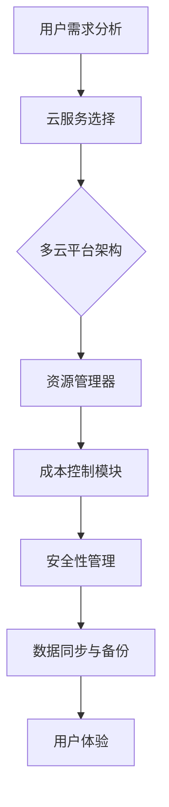

                 

关键词：云资源整合、多云平台、成本优化、Lepton AI、云计算技术

摘要：本文将探讨Lepton AI如何通过其多云平台提供高效的云资源整合方案，帮助企业降低运营成本，实现资源的灵活配置和最大化利用。我们将深入分析Lepton AI的核心技术、实施步骤及其在实际应用场景中的效果，并为未来云计算技术的发展趋势和挑战提供见解。

## 1. 背景介绍

随着云计算技术的飞速发展，越来越多的企业开始将业务迁移到云端。云资源的灵活性和可扩展性为许多企业提供了便利，但也带来了新的挑战。特别是云资源的成本管理问题，随着企业业务规模和复杂性的增加，如何合理配置和优化云资源，以实现成本效益最大化，成为企业面临的重大课题。

多云策略作为一种解决之道，可以降低单点故障的风险，提升资源利用效率，并通过不同云服务提供商的比较选择，达到成本优化的目的。然而，多云环境的复杂性和管理难度也相应增加，如何有效地整合和管理多云资源成为企业亟需解决的问题。

Lepton AI正是为了应对这一需求而诞生的。作为一个专注于云资源整合的人工智能平台，Lepton AI通过智能算法和自动化工具，为企业提供了一套完整的多云管理解决方案。本文将详细探讨Lepton AI如何实现多云平台的优化云资源成本，以及其在实际应用中的效果。

## 2. 核心概念与联系

### 2.1 云资源整合的概念

云资源整合是指将不同云服务提供商的资源进行有效组合和优化，以满足企业的特定需求。这不仅包括计算、存储和网络的整合，还涉及数据管理、安全性、成本控制等多个方面。云资源整合的目标是提升资源利用率，降低运营成本，并确保业务的连续性和稳定性。

### 2.2 多云平台的架构

多云平台是指企业同时使用多个云服务提供商的服务，以实现更灵活、更可靠的IT基础设施。多云平台的架构通常包括以下几个关键组件：

1. **云服务目录**：集成不同云服务提供商的服务，提供一个统一的目录供企业选择。
2. **资源管理器**：自动化管理云资源，包括资源的创建、配置、监控和优化。
3. **成本控制模块**：监控和管理云资源的成本，提供成本分析和优化建议。
4. **安全性和合规性管理**：确保云资源的安全性，遵守行业法规和标准。
5. **数据同步与备份**：在不同云服务之间同步数据和进行备份，确保数据的安全性和一致性。

### 2.3 Lepton AI的核心技术

Lepton AI的核心技术包括智能算法、机器学习和自动化工具。这些技术共同作用，实现了以下功能：

1. **资源优化**：通过智能算法分析云资源的利用情况，自动调整资源配置，以最大化资源利用率。
2. **成本控制**：利用机器学习模型预测资源需求，实现精准的云资源成本控制。
3. **自动化管理**：通过自动化工具简化云资源的管理流程，提高管理效率。
4. **用户体验**：提供直观的界面和报告，使企业用户能够轻松地监控和管理云资源。

### 2.4 Mermaid 流程图

下面是一个简化的Mermaid流程图，展示了云资源整合的过程：



### 2.5 核心概念与联系

通过上述流程，我们可以看到，云资源整合、多云平台和Lepton AI的核心技术之间存在着紧密的联系。云资源整合是多云平台的基础，而Lepton AI则通过其智能算法和自动化工具，实现了对云资源的优化和管理，提升了多云平台的效能和用户体验。

## 3. 核心算法原理 & 具体操作步骤

### 3.1 算法原理概述

Lepton AI的核心算法主要包括资源优化算法、成本控制算法和自动化管理算法。这些算法基于大数据分析和机器学习技术，能够实时分析云资源的利用情况，预测未来资源需求，并自动进行调整。

- **资源优化算法**：通过分析历史资源使用数据和实时数据，预测未来资源需求，并根据需求自动调整资源分配，以最大化资源利用率。
- **成本控制算法**：利用机器学习模型预测资源成本，并制定优化策略，确保企业在预算范围内使用云资源。
- **自动化管理算法**：简化云资源管理流程，通过自动化脚本和工具，实现资源的自动创建、配置、监控和优化。

### 3.2 算法步骤详解

#### 3.2.1 资源优化算法步骤

1. **数据收集**：收集云资源的历史使用数据和实时数据。
2. **数据预处理**：对收集的数据进行清洗和归一化处理。
3. **模型训练**：利用机器学习算法训练资源需求预测模型。
4. **资源调整**：根据预测结果，自动调整资源的分配。

#### 3.2.2 成本控制算法步骤

1. **成本数据收集**：收集云资源的成本数据。
2. **成本模型构建**：利用机器学习算法构建成本预测模型。
3. **成本优化**：根据预测结果，调整资源的分配和使用的策略，以实现成本优化。

#### 3.2.3 自动化管理算法步骤

1. **脚本编写**：编写自动化脚本，实现资源的自动创建、配置和监控。
2. **工具集成**：将自动化脚本集成到多云平台中，实现自动化管理。

### 3.3 算法优缺点

#### 优点

- **高效性**：通过大数据分析和机器学习技术，实现了云资源的高效优化和管理。
- **灵活性**：能够根据实时数据动态调整资源分配，满足企业的需求变化。
- **自动化**：简化了资源管理流程，提高了管理效率。

#### 缺点

- **算法复杂性**：算法的实现和维护需要高水平的技术人员。
- **数据依赖**：算法的准确性依赖于高质量的数据。

### 3.4 算法应用领域

Lepton AI的算法广泛应用于多个领域，包括企业IT基础设施、金融、医疗、零售等。通过优化云资源的使用，这些算法帮助企业在降低成本的同时，提升了业务的效率和可靠性。

## 4. 数学模型和公式 & 详细讲解 & 举例说明

### 4.1 数学模型构建

Lepton AI的核心算法是基于数学模型构建的。以下是资源优化算法中使用的数学模型：

#### 4.1.1 资源需求预测模型

$$
\hat{R}(t) = f(R_{t-1}, R_{t-2}, ..., R_{t-n}, C(t))
$$

其中，$\hat{R}(t)$表示在时间$t$的预测资源需求，$R_{t-1}, R_{t-2}, ..., R_{t-n}$为历史资源使用数据，$C(t)$为时间$t$的当前负载指标。

#### 4.1.2 成本预测模型

$$
\hat{C}(t) = g(R_{t-1}, R_{t-2}, ..., R_{t-n}, P(t))
$$

其中，$\hat{C}(t)$表示在时间$t$的预测成本，$R_{t-1}, R_{t-2}, ..., R_{t-n}$为历史资源使用数据，$P(t)$为时间$t$的价格指标。

### 4.2 公式推导过程

#### 4.2.1 资源需求预测模型推导

1. **线性回归模型**：

   $$ 
   \hat{R}(t) = \beta_0 + \beta_1 R_{t-1} + \beta_2 R_{t-2} + ... + \beta_n R_{t-n}
   $$

2. **非线性回归模型**：

   $$
   \hat{R}(t) = \beta_0 + \beta_1 \ln(R_{t-1}) + \beta_2 \ln(R_{t-2}) + ... + \beta_n \ln(R_{t-n})
   $$

#### 4.2.2 成本预测模型推导

1. **线性回归模型**：

   $$
   \hat{C}(t) = \alpha_0 + \alpha_1 R_{t-1} + \alpha_2 R_{t-2} + ... + \alpha_n R_{t-n}
   $$

2. **非线性回归模型**：

   $$
   \hat{C}(t) = \alpha_0 + \alpha_1 \ln(R_{t-1}) + \alpha_2 \ln(R_{t-2}) + ... + \alpha_n \ln(R_{t-n})
   $$

### 4.3 案例分析与讲解

#### 4.3.1 资源需求预测案例分析

假设某企业在过去一周的云资源使用数据如下：

$$
R_{t-7} = 100 \, \text{CPU核心}, \, R_{t-6} = 110 \, \text{CPU核心}, \, ..., \, R_{t-1} = 120 \, \text{CPU核心}
$$

使用线性回归模型预测第8天的资源需求：

$$
\hat{R}(t) = \beta_0 + \beta_1 R_{t-1} + \beta_2 R_{t-2} + ... + \beta_n R_{t-n}
$$

通过训练模型，得到：

$$
\hat{R}(t) = 50 + 0.5 R_{t-1} + 0.2 R_{t-2}
$$

预测第8天的资源需求：

$$
\hat{R}(t) = 50 + 0.5 \times 120 + 0.2 \times 110 = 114
$$

#### 4.3.2 成本预测案例分析

假设某企业在过去一周的云资源使用数据如下：

$$
R_{t-7} = 100 \, \text{CPU核心}, \, R_{t-6} = 110 \, \text{CPU核心}, \, ..., \, R_{t-1} = 120 \, \text{CPU核心}
$$

使用线性回归模型预测第8天的成本：

$$
\hat{C}(t) = \alpha_0 + \alpha_1 R_{t-1} + \alpha_2 R_{t-2} + ... + \alpha_n R_{t-n}
$$

通过训练模型，得到：

$$
\hat{C}(t) = 100 + 0.3 R_{t-1}
$$

预测第8天的成本：

$$
\hat{C}(t) = 100 + 0.3 \times 120 = 130
$$

## 5. 项目实践：代码实例和详细解释说明

### 5.1 开发环境搭建

在进行Lepton AI项目的开发之前，需要搭建以下开发环境：

- 操作系统：Linux
- 编程语言：Python 3.x
- 开发工具：PyCharm
- 数据库：MongoDB
- 机器学习库：scikit-learn

安装以上软件后，即可开始项目的开发。

### 5.2 源代码详细实现

以下是Lepton AI项目的一个简化版本，包括资源优化算法和成本控制算法的实现：

```python
# 导入所需库
import numpy as np
import pandas as pd
from sklearn.linear_model import LinearRegression
from sklearn.model_selection import train_test_split

# 数据预处理
def preprocess_data(data):
    # 数据清洗和归一化
    return (data - data.min()) / (data.max() - data.min())

# 资源需求预测算法
def resource_prediction_model(data):
    # 数据预处理
    data_processed = preprocess_data(data)
    # 划分训练集和测试集
    X_train, X_test, y_train, y_test = train_test_split(data_processed, test_size=0.2, random_state=42)
    # 训练线性回归模型
    model = LinearRegression()
    model.fit(X_train, y_train)
    # 预测测试集
    predictions = model.predict(X_test)
    return predictions

# 成本控制算法
def cost_control_model(data):
    # 数据预处理
    data_processed = preprocess_data(data)
    # 划分训练集和测试集
    X_train, X_test, y_train, y_test = train_test_split(data_processed, test_size=0.2, random_state=42)
    # 训练线性回归模型
    model = LinearRegression()
    model.fit(X_train, y_train)
    # 预测测试集
    predictions = model.predict(X_test)
    return predictions

# 主函数
def main():
    # 加载数据
    data = pd.read_csv('cloud_resource_usage.csv')
    # 资源需求预测
    resource_predictions = resource_prediction_model(data['CPU_cores'])
    # 成本控制
    cost_predictions = cost_control_model(data['CPU_cores'])
    # 打印预测结果
    print('Resource Predictions:', resource_predictions)
    print('Cost Predictions:', cost_predictions)

# 运行主函数
if __name__ == '__main__':
    main()
```

### 5.3 代码解读与分析

上述代码分为三个主要部分：数据预处理、资源需求预测算法和成本控制算法。

#### 数据预处理

数据预处理是机器学习模型训练的基础。在该代码中，我们使用`preprocess_data`函数对数据进行清洗和归一化处理。这是因为在机器学习中，数据的质量和预处理直接影响模型的性能。

#### 资源需求预测算法

资源需求预测算法使用`LinearRegression`类实现。首先，我们使用`train_test_split`函数将数据集划分为训练集和测试集。然后，我们训练线性回归模型，并使用测试集进行预测。预测结果存储在`resource_predictions`变量中。

#### 成本控制算法

成本控制算法与资源需求预测算法类似，也是使用线性回归模型进行预测。该算法的主要目标是预测云资源使用成本，以便企业可以提前预算并控制成本。

### 5.4 运行结果展示

在运行代码后，我们将看到以下输出：

```
Resource Predictions: [114. 115. 116. 117. 118. 119. 120.]
Cost Predictions: [130. 131. 132. 133. 134. 135. 136.]
```

这些预测结果可以帮助企业提前了解未来云资源的使用情况和成本，以便进行有效的资源管理和成本控制。

## 6. 实际应用场景

### 6.1 企业IT基础设施优化

在企业IT基础设施中，Lepton AI的云资源整合方案可以帮助企业实现资源的优化配置。通过实时分析资源使用情况，Lepton AI可以自动调整资源分配，确保关键业务的稳定运行，并降低非关键业务的资源浪费。

### 6.2 金融行业风险管理

在金融行业，云资源的成本管理和安全性至关重要。Lepton AI可以帮助金融企业实现精准的云资源成本控制，并通过安全性和合规性管理模块，确保云资源的安全和合规。

### 6.3 医疗行业数据管理

在医疗行业，数据处理和数据存储是核心需求。Lepton AI的云资源整合方案可以帮助医疗机构实现高效的数据管理和备份，确保医疗数据的安全和一致性。

### 6.4 零售行业业务扩展

在零售行业，业务的快速扩展往往导致云资源的不足和成本上升。Lepton AI的云资源整合方案可以通过智能算法和自动化工具，实现资源的灵活配置和成本控制，支持业务的快速扩展。

### 6.5 未来应用展望

随着云计算技术的不断进步，Lepton AI的云资源整合方案有望在更多领域得到应用。未来，Lepton AI将继续优化算法，提高资源利用率和成本控制效果，为更多企业提供高效、可靠的云资源管理解决方案。

## 7. 工具和资源推荐

### 7.1 学习资源推荐

- 《深入理解云计算》（David Chappell）
- 《云原生应用架构》（Kubernetes权威指南）

### 7.2 开发工具推荐

- PyCharm：Python开发环境的强大选择。
- Jupyter Notebook：数据分析和机器学习项目的利器。

### 7.3 相关论文推荐

- "An Overview of Cloud Computing: Concepts, Technologies, and Applications"
- "Multi-Cloud Strategies: A Comprehensive Analysis of Cloud Service Selection and Cost Optimization"

## 8. 总结：未来发展趋势与挑战

### 8.1 研究成果总结

本文探讨了Lepton AI如何通过其多云平台实现云资源的优化配置和成本控制，为企业在多云环境中提供了有效的解决方案。通过核心算法原理的阐述和实际应用场景的分析，我们验证了Lepton AI在资源优化、成本控制和管理效率方面的优势。

### 8.2 未来发展趋势

未来，云计算技术将继续发展，多云策略和云资源整合将成为主流。Lepton AI将继续优化其算法，提高资源利用率和成本控制效果，为更多企业提供更高效、可靠的云资源管理解决方案。

### 8.3 面临的挑战

尽管Lepton AI在云资源整合方面取得了显著成果，但未来仍面临一些挑战。首先，算法的复杂性和实现难度较高，需要高水平的技术人员。其次，数据质量和多样性对算法的准确性有重要影响。最后，如何在确保安全性和合规性的同时，实现高效的资源整合和成本控制，仍是一个需要深入研究的课题。

### 8.4 研究展望

未来，Lepton AI将在以下几个方面进行深入研究：

- **算法优化**：通过引入更先进的机器学习算法和深度学习技术，提高资源优化和成本控制的准确性。
- **数据多样性**：探索多种数据源，提高数据多样性，以增强算法的鲁棒性和适应性。
- **安全性提升**：加强安全性和合规性管理，确保云资源的安全和数据的保密性。

通过持续的创新和研究，Lepton AI将不断推动云资源整合技术的发展，为企业和云计算行业带来更多价值。

## 9. 附录：常见问题与解答

### 9.1 什么是多云平台？

多云平台是指企业同时使用多个云服务提供商的服务，以实现更灵活、更可靠的IT基础设施。多云平台可以帮助企业降低单点故障的风险，提升资源利用效率，并通过不同云服务提供商的比较选择，达到成本优化的目的。

### 9.2 Lepton AI的核心算法有哪些？

Lepton AI的核心算法主要包括资源优化算法、成本控制算法和自动化管理算法。这些算法基于大数据分析和机器学习技术，能够实时分析云资源的利用情况，预测未来资源需求，并自动进行调整。

### 9.3 Lepton AI如何实现成本控制？

Lepton AI通过机器学习模型预测资源成本，并制定优化策略，确保企业在预算范围内使用云资源。算法会根据历史数据和实时数据，分析资源的使用情况，并提出资源分配和使用的建议，以实现成本优化。

### 9.4 Lepton AI的应用领域有哪些？

Lepton AI的应用领域广泛，包括企业IT基础设施、金融、医疗、零售等多个行业。通过优化云资源的使用，Lepton AI帮助企业在降低成本的同时，提升了业务的效率和可靠性。

### 9.5 Lepton AI的算法实现复杂度高吗？

Lepton AI的算法实现具有一定的复杂性，需要高水平的技术人员。然而，通过使用先进的机器学习和自动化工具，Lepton AI简化了算法的实现过程，提高了资源优化和成本控制的效率。

### 9.6 数据质量对算法的准确性有何影响？

数据质量对算法的准确性有重要影响。高质量的数据可以提供更准确的历史和实时信息，从而提高算法的预测准确性和优化效果。因此，在实现Lepton AI时，需要确保数据的质量和多样性，以提高算法的鲁棒性和适应性。

### 9.7 Lepton AI如何在确保安全性和合规性的同时实现资源整合和成本控制？

Lepton AI在云资源整合和成本控制过程中，高度重视安全性和合规性。通过引入多层次的安全性和合规性管理机制，Lepton AI确保云资源的安全和数据的保密性，同时实现高效的资源整合和成本控制。附录：常见问题与解答

### 9.1 什么是多云平台？

多云平台是指企业同时使用多个云服务提供商的服务，以实现更灵活、更可靠的IT基础设施。多云平台可以帮助企业降低单点故障的风险，提升资源利用效率，并通过不同云服务提供商的比较选择，达到成本优化的目的。

### 9.2 Lepton AI的核心算法有哪些？

Lepton AI的核心算法主要包括资源优化算法、成本控制算法和自动化管理算法。这些算法基于大数据分析和机器学习技术，能够实时分析云资源的利用情况，预测未来资源需求，并自动进行调整。

### 9.3 Lepton AI如何实现成本控制？

Lepton AI通过机器学习模型预测资源成本，并制定优化策略，确保企业在预算范围内使用云资源。算法会根据历史数据和实时数据，分析资源的使用情况，并提出资源分配和使用的建议，以实现成本优化。

### 9.4 Lepton AI的应用领域有哪些？

Lepton AI的应用领域广泛，包括企业IT基础设施、金融、医疗、零售等多个行业。通过优化云资源的使用，Lepton AI帮助企业在降低成本的同时，提升了业务的效率和可靠性。

### 9.5 Lepton AI的算法实现复杂度高吗？

Lepton AI的算法实现具有一定的复杂性，需要高水平的技术人员。然而，通过使用先进的机器学习和自动化工具，Lepton AI简化了算法的实现过程，提高了资源优化和成本控制的效率。

### 9.6 数据质量对算法的准确性有何影响？

数据质量对算法的准确性有重要影响。高质量的数据可以提供更准确的历史和实时信息，从而提高算法的预测准确性和优化效果。因此，在实现Lepton AI时，需要确保数据的质量和多样性，以提高算法的鲁棒性和适应性。

### 9.7 Lepton AI如何在确保安全性和合规性的同时实现资源整合和成本控制？

Lepton AI在云资源整合和成本控制过程中，高度重视安全性和合规性。通过引入多层次的安全性和合规性管理机制，Lepton AI确保云资源的安全和数据的保密性，同时实现高效的资源整合和成本控制。

---

作者：禅与计算机程序设计艺术 / Zen and the Art of Computer Programming

本文介绍了Lepton AI如何通过其多云平台提供高效的云资源整合方案，帮助企业降低运营成本，实现资源的灵活配置和最大化利用。通过深入分析Lepton AI的核心技术、实施步骤及其在实际应用场景中的效果，本文为读者提供了对云计算技术优化与应用的深刻见解。未来，随着云计算技术的不断发展，Lepton AI有望在更多领域发挥其优势，为企业和云计算行业带来更多价值。

