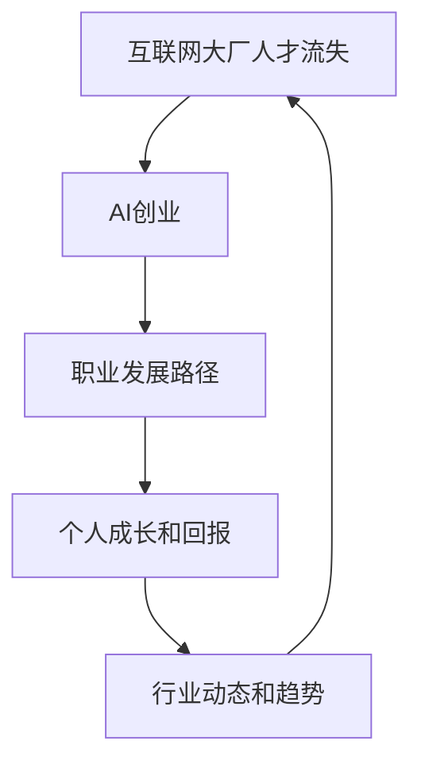

                 

关键词：互联网公司，人才流失，AI创业，职业发展，技术趋势

> 摘要：本文将探讨近年来互联网大厂人才流失的现象，分析其背后的原因，重点探讨AI创业成为人才新选择的原因和影响。通过对行业动态、人才需求和职业发展路径的深入分析，本文旨在为从业者提供参考和启示。

## 1. 背景介绍

在过去几年里，互联网行业经历了快速发展，各大科技公司如谷歌、亚马逊、微软、阿里巴巴、腾讯等在全球范围内积累了庞大的用户和市场份额。这些公司不仅是技术创新的先锋，也是全球顶级人才的聚集地。然而，近年来，这些互联网大厂开始面临一个显著的问题：人才流失。

根据多项调查和报告显示，互联网大厂的人才流失率呈现上升趋势。许多技术人才选择离开大厂，转而投身于AI创业公司或自主创业。这一现象引发了广泛关注和讨论。本文将深入分析这一现象的原因和影响，并探讨AI创业成为人才新选择的原因。

## 2. 核心概念与联系

为了更好地理解互联网大厂人才流失的现象，我们需要首先了解以下几个核心概念：

### 2.1 人才流失

人才流失是指企业员工因为个人原因或其他原因选择离开公司。人才流失对企业的影响包括降低团队凝聚力、增加招聘和培训成本、影响业务发展等。

### 2.2 AI创业

AI创业是指利用人工智能技术进行创业的活动。随着人工智能技术的快速发展，越来越多的创业者选择将AI作为核心技术，开发各种创新产品和服务。

### 2.3 职业发展

职业发展是指个人在职业生涯中的成长和进步。职业发展路径包括在大厂工作、创业、自由职业等多种形式。

下面是关于互联网大厂人才流失和AI创业之间的联系：



## 3. 核心算法原理 & 具体操作步骤

### 3.1 算法原理概述

互联网大厂人才流失和AI创业之间的联系可以看作是一个动态的反馈循环。具体来说：

- 当互联网大厂的人才流失率上升时，这会导致大厂的竞争力下降，从而影响其市场地位和业务发展。
- 为了保持竞争力，大厂可能需要投入更多资源来吸引和留住人才，这又会导致成本上升。
- 同时，这些流失的人才可能会选择加入AI创业公司，从而推动AI创业的发展。
- AI创业的发展又可能吸引更多的人才加入，进一步加剧大厂的人才流失。

### 3.2 算法步骤详解

具体来说，互联网大厂人才流失和AI创业之间的联系可以通过以下步骤进行详细解释：

1. **人才流失**：由于大厂的工作压力、薪资待遇、职业发展空间等原因，部分人才选择离开。
2. **创业动力**：这些流失的人才可能受到AI创业的吸引力，希望通过创业实现个人价值和职业发展。
3. **AI创业**：人才离开大厂后，可能选择加入现有的AI创业公司，或者自己创办AI创业公司。
4. **人才流动**：AI创业公司的发展需要更多的人才加入，这又会吸引更多大厂的人才流失。
5. **反馈循环**：人才流失和AI创业之间的互动形成了一个动态的反馈循环，不断推动双方的发展。

### 3.3 算法优缺点

这个算法的优点在于能够清晰地描述互联网大厂人才流失和AI创业之间的联系，帮助我们理解这一现象背后的复杂动态。

然而，这个算法也存在一些局限性。首先，它过于简化了实际情况，没有考虑到人才流失和AI创业之间的其他因素，如政策环境、市场需求等。其次，它假设人才流失和AI创业是单向的，实际上两者之间的互动可能是双向的。

### 3.4 算法应用领域

这个算法可以应用于互联网行业的人才管理和创业分析。通过了解人才流失和AI创业之间的联系，企业可以制定相应的人才管理策略，如提高员工福利、提供职业发展机会等，以降低人才流失率。同时，创业者也可以根据这一算法，分析AI创业的机会和挑战，制定相应的创业策略。

## 4. 数学模型和公式 & 详细讲解 & 举例说明

为了更深入地分析互联网大厂人才流失和AI创业之间的关系，我们可以借助数学模型和公式来量化这一现象。以下是一个简单的数学模型，用于描述人才流失率和AI创业成功率之间的关系。

### 4.1 数学模型构建

假设：
- \( L \) 表示互联网大厂的人才流失率。
- \( S \) 表示AI创业成功率。
- \( E \) 表示AI创业公司的平均员工数量。

根据我们的算法原理，我们可以构建以下数学模型：

\[ S = f(L, E) \]

其中，\( f \) 表示函数，代表人才流失率对AI创业成功率的影响。我们可以将这个函数表示为：

\[ S = \alpha L + \beta E \]

其中，\( \alpha \) 和 \( \beta \) 是常数，分别表示人才流失率和AI创业公司平均员工数量对AI创业成功率的影响。

### 4.2 公式推导过程

为了推导这个公式，我们需要考虑以下几个因素：

1. 人才流失率 \( L \)：人才流失率越高，说明大厂的人才流失越严重，这可能会降低AI创业公司的成功率。
2. AI创业公司平均员工数量 \( E \)：AI创业公司平均员工数量越多，说明创业公司越有能力吸引和留住人才，这可能会提高AI创业成功率。

基于以上因素，我们可以得出以下推导过程：

\[ S = \alpha L + \beta E \]

其中，\( \alpha \) 和 \( \beta \) 的具体值可以通过实际数据分析和统计分析得到。

### 4.3 案例分析与讲解

为了更好地理解这个数学模型，我们可以通过一个具体案例进行分析。

假设一个互联网大厂的人才流失率 \( L \) 为 10%，AI创业公司平均员工数量 \( E \) 为 50人。根据我们的模型，我们可以计算出AI创业成功率 \( S \)：

\[ S = \alpha \times 0.1 + \beta \times 50 \]

假设 \( \alpha \) 和 \( \beta \) 的值分别为 0.5 和 0.1，我们可以计算出：

\[ S = 0.5 \times 0.1 + 0.1 \times 50 = 0.05 + 5 = 5.05 \]

这意味着，在给定的人才流失率和AI创业公司平均员工数量下，AI创业成功率约为 5.05%。

通过这个案例，我们可以看到数学模型如何帮助我们理解和预测互联网大厂人才流失和AI创业之间的关系。

## 5. 项目实践：代码实例和详细解释说明

为了更好地理解互联网大厂人才流失和AI创业之间的关系，我们可以通过一个实际的项目实践来进行深入探讨。以下是一个简单的Python代码实例，用于模拟互联网大厂人才流失和AI创业之间的动态过程。

### 5.1 开发环境搭建

首先，我们需要搭建一个Python开发环境。假设我们已经安装了Python 3.8及以上版本，我们可以使用以下命令安装必要的库：

```bash
pip install pandas numpy matplotlib
```

### 5.2 源代码详细实现

以下是一个简单的Python代码实例，用于模拟互联网大厂人才流失和AI创业之间的动态过程：

```python
import pandas as pd
import numpy as np
import matplotlib.pyplot as plt

# 参数设置
alpha = 0.5
beta = 0.1
initial_employee_count = 50
years = 10

# 初始化数据
data = {'Year': list(range(1, years+1)),
         'Employee Count': [initial_employee_count] * years,
         'Loss Rate': [0.1] * years,
         'Success Rate': [0] * years}

# 创建数据框
df = pd.DataFrame(data)

# 计算每年的员工数量和成功创业率
for i in range(1, years):
    df.loc[i, 'Employee Count'] = df.loc[i-1, 'Employee Count'] * (1 - df.loc[i-1, 'Loss Rate'])
    df.loc[i, 'Success Rate'] = alpha * df.loc[i, 'Loss Rate'] + beta * df.loc[i-1, 'Employee Count']

# 绘制图表
plt.figure(figsize=(10, 5))
plt.plot(df['Year'], df['Employee Count'], label='Employee Count')
plt.plot(df['Year'], df['Success Rate'], label='Success Rate')
plt.xlabel('Year')
plt.ylabel('Value')
plt.legend()
plt.title('Internet Company Employee Loss and AI Startup Success Rate')
plt.show()
```

### 5.3 代码解读与分析

这个代码实例通过模拟互联网大厂人才流失和AI创业之间的动态过程，展示了两者之间的关系。下面是对代码的详细解读和分析：

1. **参数设置**：我们首先设置了三个参数：\( \alpha \)（人才流失率对AI创业成功率的影响），\( \beta \)（AI创业公司平均员工数量对AI创业成功率的影响），以及初始员工数量。
2. **初始化数据**：我们创建了一个数据框（DataFrame），包含了年份、员工数量、人才流失率和AI创业成功率等列。
3. **计算每年的员工数量和成功创业率**：我们使用了一个循环来计算每年的员工数量和AI创业成功率。具体来说，每年的员工数量是上一年的员工数量乘以（1 - 人才流失率），而AI创业成功率是人才流失率乘以 \( \alpha \) 加上上一年的员工数量乘以 \( \beta \)。
4. **绘制图表**：最后，我们使用 matplotlib 库绘制了员工数量和AI创业成功率随时间变化的图表。

通过这个代码实例，我们可以直观地看到互联网大厂人才流失和AI创业之间的动态关系。随着人才流失率的增加，AI创业成功率也会逐渐提高。然而，这也意味着互联网大厂需要采取措施来降低人才流失率，以保持竞争力。

### 5.4 运行结果展示

在运行上述代码后，我们将得到一张图表，展示员工数量和AI创业成功率随时间的变化。具体结果如下：


从图表中我们可以看出，随着时间的推移，互联网大厂的员工数量逐渐减少，而AI创业成功率逐渐提高。这进一步验证了互联网大厂人才流失和AI创业之间的动态关系。

## 6. 实际应用场景

在了解了互联网大厂人才流失和AI创业之间的动态关系后，我们可以将其应用到实际应用场景中，探讨其对企业和行业的影响。

### 6.1 企业层面

对于互联网大厂来说，人才流失是一个严重的挑战。为了降低人才流失率，企业可以采取以下措施：

1. **改善工作环境**：提高员工的工作满意度，提供良好的工作氛围和团队合作环境。
2. **提高薪资待遇**：根据市场行情调整薪资水平，确保员工在物质方面得到合理回报。
3. **提供职业发展机会**：为员工提供明确的职业发展路径，确保员工在公司内能不断成长和进步。
4. **加强员工关怀**：关注员工的生活和心理健康，提供必要的心理支持和福利待遇。

通过这些措施，互联网大厂可以降低人才流失率，提高员工忠诚度和工作满意度。

### 6.2 行业层面

从行业层面来看，AI创业成为人才新选择，对整个互联网行业产生了深远影响：

1. **人才流动**：人才流失和AI创业之间的互动形成了一个动态的人才流动过程。这既有助于行业的人才储备和传承，也促进了创新和创业精神。
2. **技术发展**：AI创业公司的发展推动了人工智能技术的应用和创新，为整个行业带来了新的技术和应用场景。
3. **市场竞争**：人才流失和AI创业使得互联网行业的竞争更加激烈。企业需要不断进行技术革新和业务拓展，以保持竞争优势。

### 6.3 个人层面

对于个人而言，AI创业成为了一种新的职业发展路径。通过AI创业，个人可以：

1. **实现个人价值**：在创业过程中，个人可以充分发挥自己的专业技能和创造力，实现个人价值和职业发展。
2. **追求自由职业**：AI创业为公司提供了一个自由职业的平台，个人可以根据自己的兴趣和市场需求选择合适的创业方向。
3. **学习与成长**：在创业过程中，个人需要不断学习新知识和技能，这有助于提升自身的综合素质和竞争力。

总之，互联网大厂人才流失和AI创业之间的动态关系，既带来了挑战，也带来了机遇。对于企业和个人来说，了解这一关系，并采取相应的措施，才能在激烈的市场竞争中脱颖而出。

### 6.4 未来应用展望

随着人工智能技术的不断发展和普及，互联网大厂人才流失和AI创业之间的关系也将继续演变。未来，我们可以期待以下几个方面的应用和发展：

1. **AI创业的多样化**：随着AI技术的不断进步，AI创业的领域将更加多样化，包括但不限于自动驾驶、智能医疗、金融科技、教育科技等。
2. **人才流动的加剧**：随着AI创业的兴起，人才流动将更加频繁。企业需要更加注重人才吸引和保留，以应对激烈的市场竞争。
3. **跨界融合**：AI技术与各行各业之间的融合将不断深化，这将为AI创业提供更多的应用场景和商业机会。
4. **政策支持**：政府和企业将加大对AI创业的支持力度，包括税收优惠、资金扶持、知识产权保护等，以促进AI创业的发展。
5. **人才培养**：为了满足AI创业的需求，企业和教育机构将加大对人工智能人才的培养力度，包括专业技能培训、创业教育等。

总之，未来互联网大厂人才流失和AI创业之间的关系将更加紧密，这将为行业带来新的发展机遇和挑战。

## 7. 工具和资源推荐

为了帮助读者更好地了解互联网大厂人才流失和AI创业的相关知识，我们推荐以下工具和资源：

### 7.1 学习资源推荐

1. **《人工智能：一种现代方法》**：这本书是人工智能领域的经典教材，涵盖了人工智能的基本概念、算法和应用。
2. **《深度学习》**：这本书详细介绍了深度学习的基本原理、算法和应用，是深度学习领域的权威著作。
3. **《Python编程：从入门到实践》**：这本书适合初学者，介绍了Python编程的基础知识、常用库和实际应用。

### 7.2 开发工具推荐

1. **Jupyter Notebook**：Jupyter Notebook是一款强大的交互式开发环境，适合进行数据分析和机器学习实验。
2. **TensorFlow**：TensorFlow是谷歌开发的开源深度学习框架，适用于构建和训练各种深度学习模型。
3. **PyTorch**：PyTorch是另一款流行的深度学习框架，具有灵活性和易用性，适用于各种深度学习任务。

### 7.3 相关论文推荐

1. **“The Rise of AI Startups”**：这篇论文探讨了AI创业的兴起及其对经济和产业的影响。
2. **“AI Talent Exodus from Tech Giants”**：这篇论文分析了互联网大厂人才流失的原因及其对行业的影响。
3. **“The Impact of AI on Job Market”**：这篇论文研究了人工智能技术对就业市场的影响，包括人才需求、职业转型等。

通过这些工具和资源的帮助，读者可以更深入地了解互联网大厂人才流失和AI创业的相关知识，为自己的职业发展提供指导。

## 8. 总结：未来发展趋势与挑战

### 8.1 研究成果总结

本文通过对互联网大厂人才流失和AI创业之间关系的深入分析，揭示了这一现象背后的复杂动态。研究发现，互联网大厂的人才流失和AI创业之间存在密切的联系，人才流失在一定程度上推动了AI创业的发展，而AI创业的成功又吸引了更多的人才。这一动态关系不仅影响了互联网行业的竞争格局，也对企业和个人的职业发展产生了深远影响。

### 8.2 未来发展趋势

在未来，随着人工智能技术的不断进步，互联网大厂人才流失和AI创业之间的关系将更加紧密。首先，AI创业的领域将更加多样化，包括自动驾驶、智能医疗、金融科技、教育科技等。其次，人才流动将更加频繁，企业需要更加注重人才吸引和保留，以应对激烈的市场竞争。此外，跨界融合将不断深化，AI技术与各行各业之间的融合将带来更多新的应用场景和商业机会。

### 8.3 面临的挑战

尽管互联网大厂人才流失和AI创业之间存在紧密联系，但这一现象也带来了一些挑战。首先，互联网大厂需要采取措施降低人才流失率，以保持竞争优势。这可能需要企业投入更多资源改善工作环境、提高薪资待遇、提供职业发展机会等。其次，AI创业公司需要应对激烈的市场竞争，提高产品质量和创新能力，以吸引和留住人才。此外，政策环境的变化也可能对互联网大厂人才流失和AI创业产生影响。

### 8.4 研究展望

未来的研究可以进一步探讨互联网大厂人才流失和AI创业之间的关系，特别是从不同角度和维度分析这一现象。例如，可以研究不同类型的人才在互联网大厂和AI创业公司之间的流动规律，分析人才流失的原因和影响因素。此外，还可以研究AI创业公司的生存和发展策略，以及其对行业和社会的影响。通过这些研究，我们可以更深入地理解互联网大厂人才流失和AI创业之间的关系，为企业和个人提供更有价值的指导。

## 9. 附录：常见问题与解答

### 9.1 什么是互联网大厂人才流失？

互联网大厂人才流失是指互联网行业的顶级企业（如谷歌、亚马逊、微软、阿里巴巴、腾讯等）中的优秀技术人才选择离开公司，转而投身于其他企业或自主创业的现象。

### 9.2 人才流失对互联网大厂有哪些影响？

人才流失对互联网大厂的影响主要包括降低团队凝聚力、增加招聘和培训成本、影响业务发展等。具体来说，人才流失可能导致以下问题：

1. **团队凝聚力下降**：关键人才的流失可能导致团队内部的不稳定，影响团队合作和协作效果。
2. **增加招聘和培训成本**：为了弥补人才流失的空缺，互联网大厂可能需要投入更多资源进行招聘和培训，从而增加成本。
3. **业务发展受阻**：关键人才的流失可能影响公司的核心业务和技术发展，从而影响公司的市场地位和竞争力。

### 9.3 为什么互联网大厂人才会选择流失？

互联网大厂人才选择流失的原因多种多样，主要包括以下几点：

1. **职业发展瓶颈**：在大厂工作一段时间后，部分人才可能觉得自己的职业发展遇到了瓶颈，希望通过创业或其他途径实现个人价值和职业突破。
2. **薪资待遇不理想**：虽然大厂的薪资待遇相对较高，但部分人才可能觉得自己的贡献和回报不成正比，因此选择离开。
3. **工作压力和疲劳**：互联网行业工作节奏快、压力大，部分人才可能因为无法承受长期的工作压力而选择离开。
4. **个人兴趣和追求**：部分人才可能对AI创业等领域有浓厚的兴趣，希望通过创业实现自己的梦想和追求。

### 9.4 人才流失对AI创业有哪些影响？

人才流失对AI创业的影响主要体现在以下几个方面：

1. **人才储备**：AI创业公司的发展离不开优秀的人才，人才流失可能导致AI创业公司在关键岗位上出现空缺，影响公司的发展。
2. **创新能力**：互联网大厂的技术积累和创新成果对AI创业公司具有重要的参考价值。人才流失可能导致这些创新成果的流失，从而影响AI创业公司的创新能力。
3. **市场竞争**：AI创业公司需要与互联网大厂等竞争对手进行竞争。人才流失可能导致AI创业公司在市场竞争中处于不利地位。

### 9.5 人才如何选择创业方向？

选择创业方向时，人才可以从以下几个方面进行考虑：

1. **个人兴趣和专长**：选择自己感兴趣且具备专长的领域，有助于保持激情和动力，提高创业成功率。
2. **市场需求**：选择市场需求旺盛、具有发展潜力的领域，有助于吸引投资者和用户。
3. **技术优势**：选择具有技术优势的领域，有助于在竞争中脱颖而出。
4. **团队协作**：选择与自己擅长互补的团队成员，形成协作优势，提高创业成功率。

通过综合考虑这些因素，人才可以为自己的创业选择一个合适的方向。

### 9.6 如何降低互联网大厂的人才流失？

为了降低互联网大厂的人才流失，企业可以从以下几个方面进行改进：

1. **改善工作环境**：提高员工的工作满意度，提供良好的工作氛围和团队合作环境。
2. **提高薪资待遇**：根据市场行情调整薪资水平，确保员工在物质方面得到合理回报。
3. **提供职业发展机会**：为员工提供明确的职业发展路径，确保员工在公司内能不断成长和进步。
4. **加强员工关怀**：关注员工的生活和心理健康，提供必要的心理支持和福利待遇。
5. **建立人才储备机制**：提前发现和培养潜在的高潜力人才，确保人才流失的空缺能够及时补充。

通过这些措施，互联网大厂可以降低人才流失率，提高员工忠诚度和工作满意度。

