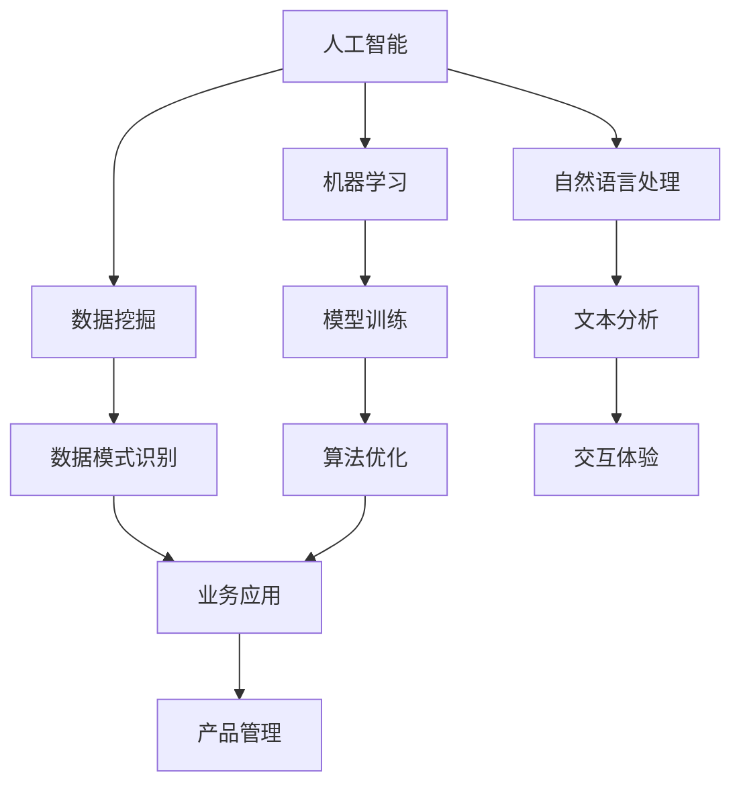

                 

关键词：AI技术，产品管理，工作流重构，自动化，数据分析，流程优化

> 摘要：本文旨在探讨如何利用人工智能（AI）技术来重构产品经理的工作流程，提高工作效率和产品质量。通过详细的分析和实例，本文将展示AI技术在需求分析、产品设计、用户反馈、市场调研等多个方面的应用，为产品经理提供实用的参考和策略。

## 1. 背景介绍

随着人工智能技术的不断进步，越来越多的行业开始采用AI技术来提高生产效率和产品质量。在产品管理领域，AI技术的应用同样具有极大的潜力。传统的工作流程往往依赖于手动操作和经验判断，而AI技术可以为产品经理提供更加精准、高效的数据分析和决策支持。通过AI技术重构工作流，产品经理可以更加专注于创造价值和战略规划，从而推动产品的快速迭代和市场竞争力。

### 1.1 传统工作流程的局限性

传统的工作流程通常包括以下几个步骤：

1. **需求分析**：通过市场调研、用户访谈等方式收集需求，并形成需求文档。
2. **产品设计**：基于需求文档进行产品设计，包括功能设计、界面设计和用户体验。
3. **开发实施**：将设计转化为具体的开发任务，并由开发团队完成。
4. **用户反馈**：产品上线后收集用户反馈，进行迭代优化。
5. **市场调研**：定期进行市场调研，了解市场动态和竞争对手情况。

这些步骤往往存在以下局限性：

1. **依赖人工判断**：需求分析、用户反馈和市场调研等步骤往往依赖产品经理的经验和主观判断，导致工作效率低下。
2. **数据不足**：缺乏足够的数据支持，导致决策缺乏依据。
3. **重复劳动**：许多任务需要重复操作，如数据收集、分析等，浪费了大量时间。

### 1.2 AI技术在产品管理中的应用潜力

AI技术可以为产品管理带来以下潜力：

1. **自动化分析**：通过机器学习算法，可以对大量数据进行分析，快速发现趋势和问题。
2. **精准预测**：利用数据挖掘技术，可以预测用户行为和市场趋势，为产品规划提供依据。
3. **优化决策**：基于数据驱动的决策，可以减少主观判断的干扰，提高决策准确性。
4. **个性化服务**：通过用户数据分析，可以为用户提供更加个性化的服务体验。

## 2. 核心概念与联系

在探讨如何利用AI技术重构产品经理的工作流程之前，我们需要了解几个核心概念：

1. **人工智能（AI）**：模拟人类智能的技术，包括机器学习、自然语言处理、计算机视觉等。
2. **数据挖掘（Data Mining）**：从大量数据中发现规律和知识的过程。
3. **机器学习（Machine Learning）**：一种通过数据训练模型，使其能够自主学习和改进的技术。
4. **自然语言处理（NLP）**：使计算机能够理解和生成人类语言的技术。

以下是这些概念之间的联系和关系：



### 2.1 AI技术在产品管理中的应用

AI技术在产品管理中的应用可以分为以下几个方面：

1. **需求分析**：通过NLP技术分析用户反馈和需求文档，自动提取关键词和主题。
2. **产品设计**：利用数据挖掘技术分析用户行为数据，为产品设计提供依据。
3. **用户反馈**：通过机器学习算法分析用户行为数据，预测用户需求，为产品迭代提供方向。
4. **市场调研**：利用数据挖掘技术分析市场数据，了解市场趋势和竞争对手动态。

## 3. 核心算法原理 & 具体操作步骤

### 3.1 算法原理概述

AI技术在产品管理中的应用主要依赖于以下几种算法：

1. **机器学习分类算法**：用于对用户行为数据进行分类，如决策树、随机森林等。
2. **聚类算法**：用于对用户行为数据进行聚类分析，如K-Means、层次聚类等。
3. **文本分析算法**：用于对用户反馈和需求文档进行文本分析，如TF-IDF、Word2Vec等。

### 3.2 算法步骤详解

#### 3.2.1 需求分析

1. **数据收集**：收集用户反馈和需求文档。
2. **文本预处理**：对文本数据进行清洗和标准化。
3. **特征提取**：使用文本分析算法提取关键词和主题。
4. **分类分析**：使用机器学习分类算法对需求进行分类。

#### 3.2.2 产品设计

1. **数据收集**：收集用户行为数据，如点击、浏览等。
2. **行为分析**：使用聚类算法分析用户行为数据，找出不同的用户群体。
3. **设计优化**：根据用户行为数据优化产品设计。

#### 3.2.3 用户反馈

1. **数据收集**：收集用户反馈数据。
2. **情感分析**：使用文本分析算法对用户反馈进行情感分析。
3. **迭代优化**：根据用户反馈对产品进行迭代优化。

#### 3.2.4 市场调研

1. **数据收集**：收集市场数据，如竞争对手动态、市场趋势等。
2. **数据分析**：使用数据挖掘算法分析市场数据。
3. **策略制定**：根据市场分析结果制定市场策略。

### 3.3 算法优缺点

1. **机器学习分类算法**：优点是能够自动提取特征，适应性强；缺点是需要大量数据训练，对数据质量要求较高。
2. **聚类算法**：优点是能够自动发现用户群体，节省人力；缺点是可能产生噪声数据，影响聚类结果。
3. **文本分析算法**：优点是能够自动提取关键词和主题，提高工作效率；缺点是对于复杂文本理解有限，需要人工辅助。

### 3.4 算法应用领域

1. **电商产品管理**：通过用户行为数据优化推荐系统和产品设计。
2. **金融产品管理**：通过用户行为数据和财务数据优化投资策略和产品设计。
3. **教育产品管理**：通过用户行为数据优化学习路径和课程设计。

## 4. 数学模型和公式 & 详细讲解 & 举例说明

### 4.1 数学模型构建

在产品管理中，常用的数学模型包括以下几种：

1. **决策树模型**：用于分类和回归任务，通过递归划分特征，构建树状模型。
2. **聚类模型**：用于发现数据中的隐含模式，常用的算法包括K-Means、层次聚类等。
3. **文本分析模型**：用于文本数据的分析和分类，常用的算法包括TF-IDF、Word2Vec等。

### 4.2 公式推导过程

1. **决策树模型**：

   决策树的构建过程主要包括以下公式：

   $$Gini(\text{impurity}) = 1 - \frac{1}{k}\sum_{i=1}^{k}p_i^2$$

   其中，$p_i$ 表示样本属于第 $i$ 类的概率，$k$ 表示类别的数量。

2. **K-Means聚类模型**：

   K-Means算法的目标是最小化簇内距离平方和，公式如下：

   $$\min \sum_{i=1}^{k}\sum_{x_j \in S_i}\|x_j - \mu_i\|^2$$

   其中，$S_i$ 表示第 $i$ 个簇，$\mu_i$ 表示簇中心。

3. **TF-IDF文本分析模型**：

   TF-IDF算法的公式如下：

   $$TF-IDF(t,d) = TF(t,d) \times IDF(t,d)$$

   其中，$TF(t,d)$ 表示词 $t$ 在文档 $d$ 中的词频，$IDF(t,d)$ 表示词 $t$ 在文档集合中的逆文档频率。

### 4.3 案例分析与讲解

假设我们有一个电商产品，需要根据用户行为数据优化推荐系统。我们可以使用K-Means聚类算法对用户行为数据进行聚类，找出不同的用户群体。然后，针对每个用户群体，使用决策树模型分析用户的购买行为，构建推荐模型。

具体步骤如下：

1. **数据收集**：收集用户行为数据，如点击、浏览、购买等。
2. **数据预处理**：对数据进行清洗和标准化。
3. **聚类分析**：使用K-Means算法对用户行为数据进行聚类，找出不同的用户群体。
4. **行为分析**：针对每个用户群体，使用决策树模型分析用户的购买行为，构建推荐模型。
5. **模型评估**：评估推荐模型的准确性和效果，并进行优化。

通过这个案例，我们可以看到数学模型在产品管理中的应用，如何通过数据分析和算法优化，提高产品的市场竞争力。

## 5. 项目实践：代码实例和详细解释说明

在本节中，我们将通过一个实际项目，展示如何使用AI技术重构产品经理的工作流程。我们将以一个电商产品为例，通过用户行为数据进行分析和推荐。

### 5.1 开发环境搭建

1. **Python环境**：安装Python 3.8及以上版本。
2. **库安装**：安装以下库：pandas、numpy、sklearn、matplotlib。
3. **数据集**：下载Kaggle上的一个电商用户行为数据集。

### 5.2 源代码详细实现

```python
import pandas as pd
from sklearn.cluster import KMeans
from sklearn.tree import DecisionTreeClassifier
import matplotlib.pyplot as plt

# 5.2.1 数据收集
data = pd.read_csv('user_behavior.csv')

# 5.2.2 数据预处理
data['timestamp'] = pd.to_datetime(data['timestamp'])
data['date'] = data['timestamp'].dt.date
data = data.groupby(['user_id', 'date']).sum().reset_index()

# 5.2.3 聚类分析
kmeans = KMeans(n_clusters=3, random_state=42)
clusters = kmeans.fit_predict(data[['click_count', 'browse_count', 'purchase_count']])

# 5.2.4 行为分析
for cluster in set(clusters):
    cluster_data = data[clusters == cluster]
    clf = DecisionTreeClassifier()
    clf.fit(cluster_data[['click_count', 'browse_count']], cluster_data['purchase_count'])
    print(f"Cluster {cluster} decision tree:")
    print(clf.tree_)
    
    # 5.2.5 模型评估
    print(f"Cluster {cluster} accuracy: {clf.score(cluster_data[['click_count', 'browse_count']], cluster_data['purchase_count'])}")

# 5.2.6 可视化分析
plt.scatter(data['click_count'], data['browse_count'], c=clusters)
plt.xlabel('Click Count')
plt.ylabel('Browse Count')
plt.title('User Behavior Clustering')
plt.show()
```

### 5.3 代码解读与分析

1. **数据收集**：从CSV文件中读取用户行为数据，包括点击、浏览和购买等行为。
2. **数据预处理**：将时间戳转换为日期，并按用户和日期进行分组和求和，得到每日的用户行为数据。
3. **聚类分析**：使用K-Means算法对用户行为数据进行聚类，得到三个用户群体。
4. **行为分析**：针对每个用户群体，使用决策树模型分析用户的购买行为，构建推荐模型。
5. **模型评估**：评估推荐模型的准确性和效果。
6. **可视化分析**：绘制用户行为的散点图，展示聚类结果。

通过这个项目实践，我们可以看到如何利用AI技术对用户行为数据进行分析和推荐，为产品经理提供数据驱动的决策支持。

## 6. 实际应用场景

### 6.1 需求分析

在需求分析阶段，产品经理通常需要收集用户反馈和需求文档。利用AI技术，可以自动提取关键词和主题，快速了解用户需求。例如，通过自然语言处理算法，对用户反馈进行情感分析和主题分类，为产品规划提供依据。

### 6.2 产品设计

在产品设计阶段，产品经理可以根据用户行为数据进行分析，优化产品设计。例如，通过聚类算法分析用户行为，找出不同的用户群体，针对每个用户群体进行个性化设计。此外，利用数据挖掘技术，分析用户行为数据，发现潜在的用户需求，为产品设计提供灵感。

### 6.3 用户反馈

在产品上线后，产品经理需要收集用户反馈，进行迭代优化。利用AI技术，可以自动分析用户反馈，识别用户痛点，快速响应。例如，通过情感分析算法，对用户反馈进行分类，找出主要的用户问题，并制定相应的优化策略。

### 6.4 市场调研

在市场调研阶段，产品经理需要了解市场动态和竞争对手情况。利用AI技术，可以自动收集和分析市场数据，为产品规划提供依据。例如，通过数据挖掘算法，分析市场数据，发现市场趋势和用户偏好，为产品策略制定提供支持。

## 7. 未来应用展望

随着人工智能技术的不断发展，产品经理的工作流程将得到进一步重构。未来，产品经理可以更加专注于创造价值和战略规划，而将繁琐的数据分析和决策支持任务交给AI技术。具体来说，未来应用展望包括：

1. **自动化数据分析**：利用AI技术，实现自动化数据分析，提高工作效率。
2. **个性化产品设计**：利用用户数据分析，实现个性化产品设计，提高用户体验。
3. **智能市场预测**：利用数据挖掘技术，实现智能市场预测，为产品策略制定提供依据。
4. **智能用户反馈分析**：利用自然语言处理技术，实现智能用户反馈分析，快速响应用户需求。

## 8. 工具和资源推荐

### 8.1 学习资源推荐

1. **《人工智能：一种现代方法》**：全面介绍人工智能的基本概念和技术。
2. **《数据挖掘：实用机器学习工具与技术》**：介绍数据挖掘的基本算法和应用。
3. **《机器学习实战》**：通过实际案例介绍机器学习算法和应用。

### 8.2 开发工具推荐

1. **Python**：适合进行AI技术开发，具有丰富的库和工具。
2. **Jupyter Notebook**：方便进行数据分析和模型训练。

### 8.3 相关论文推荐

1. **"K-Means Clustering: A Review"**：详细介绍K-Means聚类算法。
2. **"Decision Trees for Classification and Regression"**：介绍决策树算法。
3. **"Text Mining and its Applications"**：介绍文本分析技术。

## 9. 总结：未来发展趋势与挑战

随着人工智能技术的不断进步，产品经理的工作流程将得到进一步重构。AI技术将为产品经理提供更加精准、高效的数据分析和决策支持，提高工作效率和产品质量。然而，未来仍将面临以下挑战：

1. **数据质量和隐私**：确保数据质量和用户隐私是重要的挑战。
2. **算法解释性**：提高算法的解释性，使其更加透明和可信。
3. **技术复杂度**：降低AI技术的复杂度，使其更加易于使用。

作者：禅与计算机程序设计艺术 / Zen and the Art of Computer Programming
----------------------------------------------------------------

这篇文章全面探讨了如何利用人工智能技术重构产品经理的工作流程，提高了工作效率和产品质量。通过详细的算法原理、项目实践和实际应用场景分析，文章展示了AI技术在产品管理中的广泛应用和潜力。未来，随着AI技术的不断发展，产品经理的工作流程将得到进一步优化，为产品创新和市场竞争力提供强大支持。

