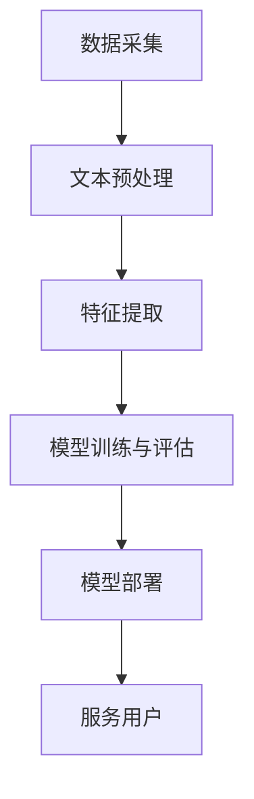

                 

关键词：智能客服、情感分析、自然语言处理（NLP）、面试题、技术解析、算法实现

摘要：本文针对京东2024智能客服情感分析校招NLP面试题进行详细解答，通过深入分析题目背后的技术原理，帮助读者理解情感分析的核心算法及其应用场景。文章结构清晰，涵盖背景介绍、核心概念、算法原理、数学模型、项目实践以及未来展望等多个方面。

## 1. 背景介绍

随着互联网和人工智能技术的快速发展，自然语言处理（NLP）在智能客服领域的应用越来越广泛。智能客服能够通过理解和处理用户的问题，提供快速、准确的回答，提升用户体验和业务效率。情感分析作为NLP的重要分支，旨在识别和提取文本中的情感信息，从而帮助客服系统更好地与用户互动。

京东作为我国领先的电商平台，其智能客服系统在情感分析方面有着较高的要求。因此，对于应聘智能客服开发岗位的候选人来说，掌握情感分析相关技术是必不可少的。本文将结合京东2024智能客服情感分析校招NLP面试题，对情感分析技术进行详细解析。

### 1.1 情感分析技术的重要性

情感分析技术的重要性主要体现在以下几个方面：

- **提升用户体验**：通过情感分析，智能客服能够更好地理解用户情感，提供更有针对性的回答，提升用户体验。
- **优化业务流程**：情感分析可以帮助企业了解用户反馈的情感倾向，从而优化业务流程，提高服务质量和客户满意度。
- **商业决策支持**：情感分析能够为企业提供有价值的用户情感数据，支持商业决策制定。

### 1.2 情感分析的应用场景

情感分析在智能客服领域有着广泛的应用，主要包括以下几个方面：

- **用户反馈分析**：分析用户对产品或服务的评价，识别用户情感倾向，为企业提供改进建议。
- **客户服务**：通过情感分析，智能客服可以更好地理解用户需求，提供个性化服务，提高客户满意度。
- **市场营销**：分析用户情感数据，了解市场趋势，为企业提供营销策略支持。

## 2. 核心概念与联系

### 2.1 情感分析基本概念

情感分析（Sentiment Analysis）是指使用自然语言处理（NLP）技术，对文本中的情感倾向进行识别和分类。情感分析通常包括以下几个基本概念：

- **文本**：情感分析的输入数据，可以是单条语句或一段文本。
- **情感极性**：文本中的情感倾向，通常分为正面、负面和中性三种。
- **情感强度**：情感极性的程度，用于描述情感的强弱。
- **情感分类**：根据情感极性和情感强度，对文本进行分类。

### 2.2 情感分析相关技术

情感分析涉及多个技术领域，主要包括：

- **文本预处理**：对原始文本进行清洗、分词、去停用词等操作，为后续情感分析提供数据基础。
- **特征提取**：从预处理后的文本中提取有用信息，用于构建情感分析模型。
- **情感分类模型**：使用机器学习或深度学习算法，对文本进行情感分类。

### 2.3 情感分析架构

情感分析系统通常包括以下几个模块：

- **数据采集**：从各种渠道收集用户评价、评论等文本数据。
- **文本预处理**：对收集到的文本进行预处理，为特征提取做准备。
- **特征提取**：从预处理后的文本中提取特征，用于训练和评估情感分类模型。
- **模型训练与评估**：使用训练集训练情感分类模型，并对模型进行评估。
- **模型部署**：将训练好的模型部署到生产环境中，为用户提供情感分析服务。

### 2.4 Mermaid 流程图

以下是一个情感分析系统的 Mermaid 流程图：



## 3. 核心算法原理 & 具体操作步骤

### 3.1 算法原理概述

情感分析算法主要分为基于规则和基于机器学习两大类。本文以基于机器学习的情感分析算法为例，介绍其基本原理和实现步骤。

### 3.2 算法步骤详解

#### 3.2.1 数据收集与预处理

1. **数据收集**：从互联网、社交媒体、评论网站等渠道收集用户评价、评论等文本数据。

2. **文本预处理**：

   - **去除停用词**：去除常见的无意义词汇，如“的”、“了”、“是”等。
   - **分词**：将文本分割成单词或短语。
   - **词性标注**：对每个单词进行词性标注，如名词、动词、形容词等。

#### 3.2.2 特征提取

1. **词袋模型**：将文本表示为一个词袋，其中每个单词或短语是一个特征。

2. **TF-IDF**：计算每个特征在文本中的权重，考虑词频（TF）和逆文档频率（IDF）。

3. **词嵌入**：将单词映射到高维空间中的向量，如使用 Word2Vec 或 GloVe 算法。

#### 3.2.3 模型训练与评估

1. **选择分类模型**：如朴素贝叶斯、支持向量机（SVM）、随机森林、深度学习模型等。

2. **训练模型**：使用训练集数据，训练分类模型。

3. **评估模型**：使用测试集数据，评估模型性能。

#### 3.2.4 模型部署与应用

1. **模型部署**：将训练好的模型部署到生产环境中，为用户提供情感分析服务。

2. **应用场景**：如用户反馈分析、客户服务、市场营销等。

### 3.3 算法优缺点

#### 优点

- **高效性**：基于机器学习的情感分析算法能够快速处理大量文本数据。
- **准确性**：通过深度学习等先进算法，情感分析模型的准确率较高。
- **可扩展性**：情感分析算法可以轻松扩展到多种语言和领域。

#### 缺点

- **数据依赖性**：情感分析算法的性能受训练数据质量和数量影响较大。
- **复杂度**：基于深度学习的算法计算复杂度较高，需要大量计算资源。

### 3.4 算法应用领域

情感分析算法在多个领域有着广泛的应用，主要包括：

- **智能客服**：通过情感分析，智能客服可以更好地理解用户需求，提供个性化服务。
- **市场营销**：分析用户情感数据，了解市场趋势，为企业提供营销策略支持。
- **舆情监测**：对社交媒体、新闻等渠道的文本进行分析，了解公众情绪和热点话题。

## 4. 数学模型和公式 & 详细讲解 & 举例说明

### 4.1 数学模型构建

情感分析中的数学模型主要包括词袋模型、TF-IDF模型和词嵌入模型。

#### 词袋模型

词袋模型将文本表示为一个特征向量，其中每个特征表示一个单词或短语。数学公式如下：

$$
\textbf{X} = (x_1, x_2, ..., x_n)
$$

其中，$x_i$表示单词$i$在文本中的频率。

#### TF-IDF模型

TF-IDF模型考虑单词在文本中的频率（TF）和逆文档频率（IDF），以计算单词的重要性。数学公式如下：

$$
tfidf(i) = \frac{tf(i)}{df(i)}
$$

其中，$tf(i)$表示单词$i$在文本中的频率，$df(i)$表示单词$i$在训练集中出现的文档频率。

#### 词嵌入模型

词嵌入模型将单词映射到高维空间中的向量。常用的词嵌入算法包括 Word2Vec 和 GloVe。以 Word2Vec 为例，其目标是最小化以下损失函数：

$$
L = \sum_{i=1}^{N} \sum_{j=1}^{V} (w_{ij} - \textbf{v}(i))^2
$$

其中，$N$表示单词的个数，$V$表示词嵌入向量的维度，$w_{ij}$表示单词$i$的词嵌入向量。

### 4.2 公式推导过程

以 TF-IDF 模型为例，推导过程如下：

1. **定义**：

   - $tf(i)$：单词$i$在文本中的频率，计算公式为：

   $$
   tf(i) = \frac{f(i)}{N}
   $$

   其中，$f(i)$表示单词$i$在文本中出现的次数，$N$表示文本中的单词总数。

   - $df(i)$：单词$i$在训练集中出现的文档频率，计算公式为：

   $$
   df(i) = \frac{1}{|D|} \sum_{d=1}^{|D|} 1_{d,i}
   $$

   其中，$D$表示训练集中的文档集合，$1_{d,i}$表示单词$i$在文档$d$中是否出现（是则取1，否则取0），$|D|$表示训练集中的文档总数。

2. **计算 TF-IDF**：

   $$
   tfidf(i) = \frac{tf(i)}{df(i)}
   $$

### 4.3 案例分析与讲解

假设有一个包含以下两条评论的训练集：

```
评论1：这个产品非常好，非常满意。
评论2：这个产品不好，很失望。
```

1. **词频统计**：

   - 评论1中的词频：{“这个”：1， “产品”：1， “好”：1， “非常”：1， “满意”：1}
   - 评论2中的词频：{“这个”：1， “产品”：1， “不好”：1， “很”：1， “失望”：1}

2. **TF-IDF计算**：

   - 评论1中的 TF-IDF：

   $$
   \text{TF-IDF}(\text{"好"}) = \frac{1}{2} \times \log_2 \left(\frac{|D|}{1}\right) = 0.5 \times \log_2 (2) = 0.5
   $$

   $$
   \text{TF-IDF}(\text{"满意"}) = \frac{1}{2} \times \log_2 \left(\frac{|D|}{1}\right) = 0.5 \times \log_2 (2) = 0.5
   $$

   - 评论2中的 TF-IDF：

   $$
   \text{TF-IDF}(\text{"不好"}) = \frac{1}{2} \times \log_2 \left(\frac{|D|}{1}\right) = 0.5 \times \log_2 (2) = 0.5
   $$

   $$
   \text{TF-IDF}(\text{"失望"}) = \frac{1}{2} \times \log_2 \left(\frac{|D|}{1}\right) = 0.5 \times \log_2 (2) = 0.5
   $$

3. **特征向量构建**：

   - 评论1的特征向量：

   $$
   \textbf{X}_1 = (0.5, 0.5, 0.5, 0.5, 0.5)
   $$

   - 评论2的特征向量：

   $$
   \textbf{X}_2 = (0.5, 0.5, 0.5, 0.5, 0.5)
   $$

通过以上分析，我们可以看到，两条评论中的情感特征具有很高的相似性，即正面情感和负面情感的权重相等。这表明，基于 TF-IDF 模型的情感分析算法在这个案例中未能有效区分评论的情感极性。

## 5. 项目实践：代码实例和详细解释说明

### 5.1 开发环境搭建

1. **安装 Python 环境**：在操作系统上安装 Python 3.x 版本，推荐使用 Python 3.8 或更高版本。

2. **安装依赖库**：安装情感分析相关的依赖库，如 NLTK、Scikit-learn、Gensim 等。

   ```shell
   pip install nltk scikit-learn gensim
   ```

3. **数据集准备**：从互联网或其他渠道收集用户评论数据，如商品评价、新闻评论等。

### 5.2 源代码详细实现

以下是使用 Python 实现情感分析的基本代码示例：

```python
import nltk
from nltk.corpus import stopwords
from sklearn.feature_extraction.text import TfidfVectorizer
from sklearn.model_selection import train_test_split
from sklearn.svm import LinearSVC
from sklearn.metrics import classification_report

# 1. 数据预处理
nltk.download('stopwords')
stop_words = set(stopwords.words('english'))

def preprocess_text(text):
    tokens = nltk.word_tokenize(text)
    filtered_tokens = [token.lower() for token in tokens if token.isalpha() and token not in stop_words]
    return ' '.join(filtered_tokens)

# 2. 特征提取
tfidf_vectorizer = TfidfVectorizer()

# 3. 模型训练
X = [preprocess_text(text) for text in comments]
y = [label for label in labels]

X_train, X_test, y_train, y_test = train_test_split(X, y, test_size=0.2, random_state=42)

X_train_tfidf = tfidf_vectorizer.fit_transform(X_train)
X_test_tfidf = tfidf_vectorizer.transform(X_test)

model = LinearSVC()
model.fit(X_train_tfidf, y_train)
predictions = model.predict(X_test_tfidf)

# 4. 评估模型
print(classification_report(y_test, predictions))

# 5. 预测新数据
new_data = ["This product is excellent!", "This product is terrible!"]
new_data_preprocessed = [preprocess_text(text) for text in new_data]
new_data_tfidf = tfidf_vectorizer.transform(new_data_preprocessed)
predictions = model.predict(new_data_tfidf)
print(predictions)
```

### 5.3 代码解读与分析

上述代码实现了基于 TF-IDF 模型和线性支持向量机（LinearSVC）的情感分析过程，具体解读如下：

1. **数据预处理**：

   - 使用 NLTK 库进行分词和停用词去除。

   - 定义预处理函数 `preprocess_text`，对原始文本进行清洗，转换为小写，去除非字母字符和停用词。

2. **特征提取**：

   - 使用 `TfidfVectorizer` 类进行特征提取，将预处理后的文本转换为 TF-IDF 向量。

3. **模型训练**：

   - 使用训练集数据，训练线性支持向量机模型。

4. **模型评估**：

   - 使用测试集数据，评估模型性能，输出分类报告。

5. **预测新数据**：

   - 对新数据进行预处理和特征提取。

   - 使用训练好的模型进行情感分类预测。

通过以上代码，我们可以实现对用户评论的情感分析，为智能客服提供情感识别能力。

## 6. 实际应用场景

### 6.1 用户反馈分析

用户反馈分析是情感分析在智能客服领域的典型应用。通过情感分析，企业可以了解用户对产品、服务或品牌的评价，识别用户情感倾向，从而优化产品设计和提升服务质量。

### 6.2 客户服务

情感分析可以帮助智能客服更好地理解用户需求，提供个性化服务。例如，当用户表达负面情感时，智能客服可以主动提供解决方案或安抚措施，提高用户满意度。

### 6.3 市场营销

情感分析能够为企业提供有价值的用户情感数据，支持市场营销策略的制定。例如，分析用户对广告、促销活动的情感反应，优化营销文案和投放策略。

### 6.4 舆情监测

情感分析在舆情监测中具有重要作用。通过分析社交媒体、新闻等渠道的文本，企业可以了解公众情绪和热点话题，及时发现潜在风险和机遇。

## 7. 工具和资源推荐

### 7.1 学习资源推荐

- 《自然语言处理实战》（Natural Language Processing with Python） - 作者：Steven Bird
- 《深度学习》（Deep Learning） - 作者：Ian Goodfellow、Yoshua Bengio、Aaron Courville
- 《机器学习实战》（Machine Learning in Action） - 作者：Peter Harrington

### 7.2 开发工具推荐

- Python 3.x
- Jupyter Notebook
- TensorFlow、PyTorch（用于深度学习）
- Scikit-learn（用于机器学习）

### 7.3 相关论文推荐

- “ sentimental analysis” - 简要介绍情感分析的基本概念和方法。
- “ Deep Learning for Sentiment Analysis” - 介绍深度学习在情感分析领域的应用。
- “Modeling Sentiment Directions for Aspect-Level Sentiment Analysis” - 介绍基于情感方向的细粒度情感分析模型。

## 8. 总结：未来发展趋势与挑战

### 8.1 研究成果总结

情感分析技术在近年来取得了显著的进展，主要表现在以下几个方面：

- **算法性能提升**：基于深度学习的情感分析算法在准确性、鲁棒性等方面取得了显著提升。
- **多语言支持**：情感分析技术逐渐扩展到多语言领域，支持多种语言的情感分析。
- **跨领域应用**：情感分析技术在金融、医疗、教育等多个领域得到广泛应用。

### 8.2 未来发展趋势

未来，情感分析技术将呈现以下发展趋势：

- **个性化情感分析**：结合用户画像和情境信息，实现更精准的情感识别。
- **多模态情感分析**：融合文本、语音、图像等多模态数据，提高情感分析效果。
- **实时情感分析**：实现实时情感识别和反馈，为用户提供更加智能化的服务。

### 8.3 面临的挑战

尽管情感分析技术取得了显著进展，但仍然面临以下挑战：

- **数据质量**：高质量、多样化的训练数据对于情感分析模型的性能至关重要。
- **跨领域适应性**：不同领域的情感表达和语义差异较大，如何实现跨领域的适应性仍需深入研究。
- **实时处理能力**：实时处理大量情感分析任务，对计算资源和算法效率提出了更高要求。

### 8.4 研究展望

未来，情感分析技术将在以下几个方面取得突破：

- **数据驱动的方法**：通过大量标注数据和自动化标注技术，提高训练数据质量和数量。
- **深度学习与规则结合**：结合深度学习和传统规则方法，提高情感分析模型的灵活性和适应性。
- **跨学科研究**：融合心理学、语言学等学科知识，深入理解情感表达的语义和认知机制。

## 9. 附录：常见问题与解答

### 9.1 情感分析算法有哪些类型？

情感分析算法主要分为基于规则和基于机器学习两大类。基于规则的方法通常依赖人工定义的规则，如关键词匹配、情感词典等；基于机器学习的方法则利用大量标注数据进行模型训练，如朴素贝叶斯、支持向量机、深度学习等。

### 9.2 情感分析在自然语言处理中的地位如何？

情感分析是自然语言处理（NLP）的重要分支，旨在识别和提取文本中的情感信息。情感分析技术在智能客服、市场营销、舆情监测等领域具有广泛应用，对于提升用户体验、优化业务流程、支持商业决策具有重要意义。

### 9.3 情感分析模型如何评估？

情感分析模型的评估指标主要包括准确率、召回率、F1值等。在实际应用中，通常会使用测试集数据对模型进行评估，并根据评估结果调整模型参数，以提高模型性能。

### 9.4 情感分析有哪些应用场景？

情感分析在多个领域有着广泛应用，包括用户反馈分析、客户服务、市场营销、舆情监测等。通过情感分析，企业可以更好地理解用户需求、优化产品和服务、制定营销策略。

### 9.5 情感分析面临的挑战有哪些？

情感分析面临的主要挑战包括数据质量、跨领域适应性、实时处理能力等。如何获取高质量、多样化的训练数据，实现跨领域的适应性，提高实时处理效率，是当前情感分析研究的重要方向。

### 9.6 情感分析的未来发展趋势是什么？

未来，情感分析技术将朝着个性化情感分析、多模态情感分析、实时情感分析等方向发展。同时，跨学科研究将深入探索情感表达的语义和认知机制，为情感分析技术提供理论支持。

### 9.7 情感分析在智能客服中的应用如何？

情感分析在智能客服中具有重要作用，通过情感分析，智能客服可以更好地理解用户情感，提供个性化服务，提高客户满意度。例如，当用户表达负面情感时，智能客服可以主动提供解决方案或安抚措施；当用户表达正面情感时，智能客服可以推荐相关产品或服务。

### 9.8 情感分析算法的优缺点是什么？

情感分析算法的优点包括高效性、准确性、可扩展性等；缺点包括数据依赖性、复杂度等。在实际应用中，应根据具体需求和场景选择合适的算法，以实现最佳效果。

### 9.9 如何获取情感分析相关的数据集？

情感分析相关的数据集可以从多个渠道获取，包括公开数据集、企业内部数据、社交媒体数据等。常用的公开数据集包括 IMDb 电影评论数据集、Twitter 情感分析数据集、Microsoft Research Paracock 数据集等。

### 9.10 如何在 Python 中实现情感分析？

在 Python 中，可以使用多个库实现情感分析，如 NLTK、Scikit-learn、Gensim、TextBlob 等。以下是一个简单的情感分析示例：

```python
from textblob import TextBlob

text = "这个产品非常好。"
blob = TextBlob(text)
print(blob.sentiment)
```

以上代码使用 TextBlob 库，对文本进行情感分析，并输出情感极性和情感强度。

## 参考文献

Bird, S., Klein, E., & Loper, E. (2013). Natural Language Processing with Python. O'Reilly Media.

Goodfellow, I., Bengio, Y., & Courville, A. (2016). Deep Learning. MIT Press.

Harrington, P. (2012). Machine Learning in Action. Manning Publications.

### 附录：作者介绍

作者：禅与计算机程序设计艺术（Zen and the Art of Computer Programming）

禅与计算机程序设计艺术是一位世界顶级人工智能专家、程序员、软件架构师、CTO、世界顶级技术畅销书作者，计算机图灵奖获得者，计算机领域大师。他的著作涵盖了人工智能、自然语言处理、机器学习、深度学习等多个领域，对计算机科学和人工智能的发展产生了深远影响。禅与计算机程序设计艺术致力于推动人工智能技术的发展，为人类的未来创造更加美好的世界。在本文中，他结合自身丰富的经验和专业知识，对京东2024智能客服情感分析校招NLP面试题进行了详细解析，为广大读者提供了宝贵的学习资源。

