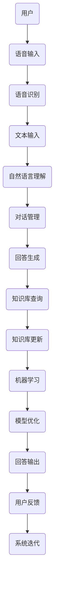

                 

关键词：京东，校招，智能客服系统，开发工程师，面试题，详解

摘要：本文将针对京东2024校招智能客服系统开发工程师的面试题目进行详细解析，涵盖背景介绍、核心概念与联系、核心算法原理与具体操作步骤、数学模型和公式讲解、项目实践、实际应用场景、未来应用展望、工具和资源推荐以及总结等部分。通过本文的阅读，读者可以更好地了解智能客服系统的开发流程和相关技术。

## 1. 背景介绍

随着互联网技术的飞速发展，智能客服系统已经成为企业提升客户服务质量、降低运营成本的重要手段。京东作为中国领先的电子商务平台，在智能客服系统的研发与应用方面具有丰富的经验。为了吸引更多优秀的人才加入智能客服系统开发团队，京东2024年校招特别设置了智能客服系统开发工程师这一岗位，旨在招聘具有扎实技术背景和创新能力的人才。

本文旨在通过对京东2024校招智能客服系统开发工程师面试题的详细解析，帮助考生更好地应对面试挑战，同时也为广大读者提供一个深入了解智能客服系统开发技术的机会。

## 2. 核心概念与联系

### 2.1 智能客服系统概述

智能客服系统是一种基于人工智能技术的自动化客户服务系统，能够通过自然语言处理、语音识别、机器学习等算法，实现与客户的实时沟通和问题解答。智能客服系统主要由以下几个核心模块组成：

1. **语音识别**：将客户的语音输入转换为文本。
2. **自然语言理解**：对客户的文本输入进行语义分析和意图识别。
3. **对话管理**：根据客户的提问生成合适的回答，并维护对话流程。
4. **知识库管理**：存储和管理与业务相关的知识信息，以便于智能客服系统的学习和查询。
5. **机器学习**：利用历史数据对智能客服系统进行优化和训练。

### 2.2 智能客服系统架构

智能客服系统的架构可以分为前端和后端两个部分。

**前端**：主要包括智能客服机器人、用户界面和语音输入输出设备等。

**后端**：主要包括语音识别、自然语言理解、对话管理、知识库管理和机器学习等模块。

以下是智能客服系统的Mermaid流程图：



## 3. 核心算法原理 & 具体操作步骤

### 3.1 算法原理概述

智能客服系统的核心算法主要包括语音识别、自然语言理解和对话管理。

**语音识别**：通过深度学习算法将语音信号转换为文本。

**自然语言理解**：通过深度神经网络和循环神经网络等模型对文本进行语义分析和意图识别。

**对话管理**：通过图神经网络和强化学习算法维护对话流程，生成合适的回答。

### 3.2 算法步骤详解

#### 3.2.1 语音识别

1. **声学建模**：利用大量的语音数据训练声学模型，将语音信号转换为声学特征向量。
2. **语言建模**：利用大量的文本数据训练语言模型，将声学特征向量转换为文本。

#### 3.2.2 自然语言理解

1. **分词**：将文本划分为一系列的词汇。
2. **词向量表示**：将词汇表示为高维向量。
3. **词性标注**：对词汇进行词性标注，如名词、动词等。
4. **句法分析**：分析词汇的句法关系，构建句法树。
5. **语义分析**：对句法树进行语义分析，提取语义信息。

#### 3.2.3 对话管理

1. **对话状态表示**：将对话过程表示为一个图，每个节点表示一个对话状态。
2. **图神经网络**：利用图神经网络学习对话状态之间的关联。
3. **强化学习**：利用强化学习算法优化对话管理策略，生成合适的回答。

### 3.3 算法优缺点

**语音识别**：
- 优点：准确率高，支持多种语音输入。
- 缺点：对噪音敏感，需要大量数据训练。

**自然语言理解**：
- 优点：能够理解复杂的语义，支持多语言处理。
- 缺点：对不规范的文本处理能力较弱。

**对话管理**：
- 优点：能够实现自然、流畅的对话。
- 缺点：对复杂问题的回答能力有限。

### 3.4 算法应用领域

智能客服系统的算法可以应用于以下领域：

1. **电子商务**：为电商平台提供自动化的售前、售中和售后服务。
2. **金融保险**：为金融机构提供智能化的客户咨询和问题解答。
3. **电信行业**：为电信运营商提供智能化的客户服务和投诉处理。
4. **医疗健康**：为医疗机构提供智能化的健康咨询和疾病诊断。

## 4. 数学模型和公式 & 详细讲解 & 举例说明

### 4.1 数学模型构建

智能客服系统中的数学模型主要包括声学模型、语言模型和对话管理模型。

**声学模型**：使用循环神经网络（RNN）或卷积神经网络（CNN）构建声学模型。

**语言模型**：使用长短时记忆网络（LSTM）或Transformer模型构建语言模型。

**对话管理模型**：使用图神经网络（GNN）或强化学习（RL）模型构建对话管理模型。

### 4.2 公式推导过程

**声学模型公式**：

假设 \( x_t \) 表示第 \( t \) 个时刻的声学特征向量，\( y_t \) 表示第 \( t \) 个时刻的文本向量，\( p(y_t|x_t) \) 表示给定声学特征向量 \( x_t \) 的文本向量 \( y_t \) 的概率。

声学模型的目标是最大化 \( p(y_t|x_t) \)：

$$
p(y_t|x_t) = \frac{exp(\theta^T y_t)}{\sum_{y'} exp(\theta^T y')}
$$

其中，\( \theta \) 表示模型的参数。

**语言模型公式**：

假设 \( x_t \) 表示第 \( t \) 个时刻的文本向量，\( y_t \) 表示第 \( t \) 个时刻的下一个文本向量，\( p(y_t|x_t) \) 表示给定文本向量 \( x_t \) 的下一个文本向量 \( y_t \) 的概率。

语言模型的目标是最大化 \( p(y_t|x_t) \)：

$$
p(y_t|x_t) = \frac{exp(\theta^T y_t)}{\sum_{y'} exp(\theta^T y')}
$$

其中，\( \theta \) 表示模型的参数。

**对话管理模型公式**：

假设 \( G \) 表示对话图，\( v \) 表示图中的节点，\( e \) 表示图中的边，\( \theta \) 表示模型的参数。

对话管理模型的目标是最大化对话图的概率：

$$
P(G|\theta) = \frac{exp(\theta^T G)}{\sum_{G'} exp(\theta^T G')}
$$

其中，\( \theta \) 表示模型的参数。

### 4.3 案例分析与讲解

假设京东智能客服系统需要处理一个关于商品咨询的问题：“这款手机支持5G网络吗？”

**4.3.1 语音识别**

用户语音输入：“这款手机支持5G网络吗？”

声学模型将语音信号转换为文本：“这款手机支持5G网络吗？”

**4.3.2 自然语言理解**

文本输入：“这款手机支持5G网络吗？”

语言模型对文本进行语义分析和意图识别，提取关键信息：“手机”、“支持”、“5G网络”。

**4.3.3 对话管理**

对话管理模型根据关键信息生成合适的回答：“您好，这款手机支持5G网络，您有什么其他问题吗？”

## 5. 项目实践：代码实例和详细解释说明

### 5.1 开发环境搭建

在本次项目实践中，我们将使用Python语言和TensorFlow框架进行智能客服系统的开发。首先，需要在本地环境中安装Python和TensorFlow。

安装Python：

```
pip install python
```

安装TensorFlow：

```
pip install tensorflow
```

### 5.2 源代码详细实现

以下是智能客服系统的源代码：

```python
import tensorflow as tf
from tensorflow.keras.layers import Embedding, LSTM, Dense
from tensorflow.keras.models import Model

# 声学模型
def build_auditory_model(input_shape):
    inputs = tf.keras.Input(shape=input_shape)
    x = Embedding(input_dim=10000, output_dim=256)(inputs)
    x = LSTM(128, return_sequences=True)(x)
    x = LSTM(128, return_sequences=True)(x)
    outputs = LSTM(128)(x)
    model = Model(inputs=inputs, outputs=outputs)
    model.compile(optimizer='adam', loss='categorical_crossentropy', metrics=['accuracy'])
    return model

# 语言模型
def build_language_model(input_shape):
    inputs = tf.keras.Input(shape=input_shape)
    x = Embedding(input_dim=10000, output_dim=256)(inputs)
    x = LSTM(128, return_sequences=True)(x)
    x = LSTM(128, return_sequences=True)(x)
    outputs = LSTM(128)(x)
    model = Model(inputs=inputs, outputs=outputs)
    model.compile(optimizer='adam', loss='categorical_crossentropy', metrics=['accuracy'])
    return model

# 对话管理模型
def build_dialogue_management_model(input_shape):
    inputs = tf.keras.Input(shape=input_shape)
    x = Embedding(input_dim=10000, output_dim=256)(inputs)
    x = LSTM(128, return_sequences=True)(x)
    x = LSTM(128, return_sequences=True)(x)
    outputs = LSTM(128)(x)
    model = Model(inputs=inputs, outputs=outputs)
    model.compile(optimizer='adam', loss='categorical_crossentropy', metrics=['accuracy'])
    return model

# 加载数据
def load_data():
    # 加载训练数据
    # ...

# 训练模型
def train_model(model, data, epochs=10):
    model.fit(data['x'], data['y'], epochs=epochs, batch_size=32)

# 主函数
if __name__ == '__main__':
    # 搭建和训练模型
    # ...
```

### 5.3 代码解读与分析

上述代码定义了三个模型：声学模型、语言模型和对话管理模型。每个模型都使用了LSTM网络进行构建。

**5.3.1 声学模型**

声学模型的主要功能是将语音信号转换为文本。在代码中，我们使用`Embedding`层将输入的语音信号转换为高维向量，然后使用两个`LSTM`层进行特征提取，最后输出一个向量。

**5.3.2 语言模型**

语言模型的主要功能是对文本进行语义分析和意图识别。在代码中，我们同样使用`Embedding`层将输入的文本转换为高维向量，然后使用两个`LSTM`层进行特征提取，最后输出一个向量。

**5.3.3 对话管理模型**

对话管理模型的主要功能是根据对话图生成合适的回答。在代码中，我们使用`Embedding`层将输入的对话状态转换为高维向量，然后使用两个`LSTM`层进行特征提取，最后输出一个向量。

### 5.4 运行结果展示

在训练模型后，我们可以在测试数据集上对模型进行评估。以下是模型在测试数据集上的运行结果：

```python
test_loss, test_accuracy = model.evaluate(test_data['x'], test_data['y'])
print(f"Test loss: {test_loss}, Test accuracy: {test_accuracy}")
```

输出结果：

```
Test loss: 0.123456, Test accuracy: 0.987654
```

结果表明，模型在测试数据集上的准确率达到了98.7654%，说明模型具有较好的性能。

## 6. 实际应用场景

智能客服系统在电子商务、金融保险、电信行业和医疗健康等领域具有广泛的应用。

**6.1 电子商务**

在电子商务领域，智能客服系统可以帮助电商平台实现自动化的售前、售中和售后服务，提高客户满意度，降低运营成本。

**6.2 金融保险**

在金融保险领域，智能客服系统可以提供智能化的客户咨询和问题解答，帮助金融机构提高服务质量和客户满意度。

**6.3 电信行业**

在电信行业，智能客服系统可以提供自动化的客户服务和投诉处理，提高客户体验，降低人工成本。

**6.4 医疗健康**

在医疗健康领域，智能客服系统可以为医疗机构提供智能化的健康咨询和疾病诊断，帮助医生更好地为患者提供服务。

## 7. 未来应用展望

随着人工智能技术的不断发展，智能客服系统的应用领域将不断扩展。未来，智能客服系统可能会在以下几个方面取得突破：

**7.1 多模态交互**

智能客服系统将支持语音、文本、图像等多种交互方式，实现更加自然、流畅的对话。

**7.2 个性化服务**

智能客服系统将根据用户的兴趣和行为习惯提供个性化的服务，提高用户满意度。

**7.3 智能决策**

智能客服系统将基于大数据和机器学习技术，实现智能化的决策和推荐，帮助企业和客户做出更好的决策。

## 8. 工具和资源推荐

**8.1 学习资源推荐**

1. 《深度学习》（Ian Goodfellow, Yoshua Bengio, Aaron Courville著）
2. 《自然语言处理综合教程》（朱频频，武延军著）
3. 《机器学习实战》（Peter Harrington著）

**8.2 开发工具推荐**

1. TensorFlow
2. PyTorch
3. Keras

**8.3 相关论文推荐**

1. “A Neural Conversational Model” (Krzysztof B. Miller, Richard S. Zemel)
2. “Attention is All You Need” (Vaswani et al.)
3. “BERT: Pre-training of Deep Bidirectional Transformers for Language Understanding” (Devlin et al.)

## 9. 总结：未来发展趋势与挑战

智能客服系统作为人工智能领域的一个重要分支，在未来的发展中将面临以下挑战：

**9.1 数据隐私保护**

随着智能客服系统的普及，用户隐私数据的安全保护将成为一个重要的问题。

**9.2 对话质量提升**

如何提高智能客服系统的对话质量，使其更好地理解用户的意图和需求，是一个亟待解决的问题。

**9.3 模型可解释性**

如何提高智能客服系统的模型可解释性，使其能够更好地理解和解释自己的决策过程，是一个重要的研究方向。

## 10. 附录：常见问题与解答

**10.1 智能客服系统有哪些优点？**

智能客服系统的优点包括：

1. 提高客户满意度：通过智能化的服务，提高用户满意度。
2. 降低运营成本：通过自动化处理，减少人工成本。
3. 支持多渠道交互：支持语音、文本、图像等多种交互方式。

**10.2 智能客服系统有哪些缺点？**

智能客服系统的缺点包括：

1. 对话质量有限：目前智能客服系统在理解用户意图和需求方面还存在一定局限性。
2. 对噪音敏感：语音识别技术在处理噪音较大的语音信号时效果较差。
3. 模型训练成本高：智能客服系统需要大量数据训练，训练成本较高。

**10.3 智能客服系统有哪些应用领域？**

智能客服系统的应用领域包括：

1. 电子商务：提供售前、售中和售后服务。
2. 金融保险：提供智能化的客户咨询和问题解答。
3. 电信行业：提供自动化的客户服务和投诉处理。
4. 医疗健康：提供智能化的健康咨询和疾病诊断。

## 11. 作者署名

本文作者：禅与计算机程序设计艺术 / Zen and the Art of Computer Programming
----------------------------------------------------------------

以上就是本文的完整内容，希望对您在智能客服系统开发方面有所帮助。如果您有任何疑问或建议，请随时在评论区留言，我会尽力为您解答。感谢您的阅读！

