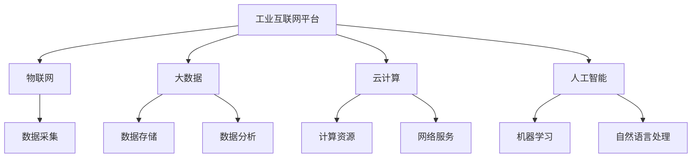

                 

关键词：京东、工业互联网、平台、架构师、面试、攻略

摘要：本文旨在为准备参加京东2025工业互联网平台架构师面试的候选人提供一份详尽的面试攻略，包括背景介绍、核心概念与联系、核心算法原理、数学模型和公式、项目实践、实际应用场景、未来应用展望、工具和资源推荐以及总结和展望。本文结构紧凑，逻辑清晰，旨在帮助候选人顺利通过面试。

## 1. 背景介绍

京东，作为中国领先的电子商务公司，近年来在工业互联网领域积极布局。工业互联网平台是京东的重要战略方向之一，旨在通过连接工业设备、企业系统和互联网，实现工业全链条的数字化转型。2025年，京东计划推出全新一代工业互联网平台，为制造企业、供应链服务提供商和开发者提供全方位的技术支持和服务。

作为京东工业互联网平台的核心人才，架构师肩负着平台架构设计、技术选型、系统优化等关键任务。因此，京东对于架构师的招聘条件非常高，面试过程也异常严格。本文将为您解析京东2025工业互联网平台架构师面试的核心内容，帮助您顺利通过面试。

## 2. 核心概念与联系

为了更好地理解京东工业互联网平台的架构设计，我们首先需要了解几个核心概念：

1. **工业互联网平台**：一个集成了物联网、大数据、云计算、人工智能等技术的综合性平台，旨在实现工业生产的数字化和智能化。

2. **物联网（IoT）**：通过传感器和通信技术，将物理设备连接到互联网，实现设备的远程监控和控制。

3. **大数据**：通过对海量数据的存储、处理和分析，发现数据中的价值，为企业决策提供支持。

4. **云计算**：通过互联网提供动态易扩展且经常是虚拟化的资源，满足各种计算需求。

5. **人工智能（AI）**：通过模拟、延伸和扩展人的智能，实现智能决策和自动化。

接下来，我们将使用Mermaid流程图来展示这些概念之间的联系。



通过以上流程图，我们可以清晰地看到，工业互联网平台的核心在于物联网、大数据、云计算和人工智能的深度融合。

## 3. 核心算法原理 & 具体操作步骤

### 3.1 算法原理概述

在京东的工业互联网平台中，核心算法主要涉及以下几个方面：

1. **数据采集算法**：用于从物联网设备中实时采集数据，如传感器数据、设备状态等。

2. **数据预处理算法**：对采集到的原始数据进行清洗、转换和格式化，以便后续分析和处理。

3. **数据存储算法**：用于高效存储和管理大规模数据，包括数据压缩、索引和查询优化等。

4. **数据分析算法**：通过对数据进行分析，提取有用信息，为企业的决策提供支持。

5. **机器学习算法**：用于实现设备的智能监控、故障预测和优化控制等功能。

### 3.2 算法步骤详解

1. **数据采集算法**：

   - **步骤1**：通过传感器和数据接口，实时采集设备状态数据。

   - **步骤2**：对采集到的数据进行初步清洗，去除噪声和异常值。

   - **步骤3**：将清洗后的数据存储到数据存储系统中。

2. **数据预处理算法**：

   - **步骤1**：对原始数据进行去重和格式转换，统一数据格式。

   - **步骤2**：根据数据的特点，选择合适的特征工程方法，提取关键特征。

   - **步骤3**：对特征进行归一化处理，使其具有相同的量纲和范围。

3. **数据存储算法**：

   - **步骤1**：选择合适的数据存储系统，如关系型数据库、NoSQL数据库或分布式存储系统。

   - **步骤2**：根据数据访问模式和查询需求，设计数据索引和查询优化策略。

   - **步骤3**：实现数据压缩和去重，提高存储效率。

4. **数据分析算法**：

   - **步骤1**：根据业务需求，选择合适的数据分析方法，如关联规则挖掘、聚类分析、分类分析等。

   - **步骤2**：对数据进行建模，建立预测模型或优化模型。

   - **步骤3**：对模型进行训练和评估，调整模型参数，优化模型性能。

5. **机器学习算法**：

   - **步骤1**：根据设备特点和业务需求，选择合适的机器学习算法，如决策树、支持向量机、神经网络等。

   - **步骤2**：收集设备运行数据，进行特征提取和预处理。

   - **步骤3**：训练机器学习模型，并进行评估和调优。

### 3.3 算法优缺点

1. **数据采集算法**：

   - **优点**：实时性强，能够快速响应设备状态变化。

   - **缺点**：数据采集算法的复杂度较高，对传感器和通信设备的要求较高。

2. **数据预处理算法**：

   - **优点**：简化数据，去除噪声和异常值，提高数据质量。

   - **缺点**：预处理过程可能丢失部分有用信息，对数据质量要求较高。

3. **数据存储算法**：

   - **优点**：提高数据存储效率，支持高效的数据查询和分析。

   - **缺点**：数据存储算法的设计和优化较为复杂，需要充分考虑存储系统的性能和可扩展性。

4. **数据分析算法**：

   - **优点**：能够从海量数据中发现有价值的信息，支持数据驱动的决策。

   - **缺点**：数据分析算法的复杂度较高，对计算资源和算法设计要求较高。

5. **机器学习算法**：

   - **优点**：能够实现设备的智能监控、故障预测和优化控制等功能，提高生产效率。

   - **缺点**：机器学习算法的复杂度较高，对数据质量和算法设计要求较高。

### 3.4 算法应用领域

1. **数据采集算法**：广泛应用于工业设备监控、智能家居、智能交通等领域。

2. **数据预处理算法**：广泛应用于数据挖掘、机器学习等领域。

3. **数据存储算法**：广泛应用于大数据处理、分布式存储等领域。

4. **数据分析算法**：广泛应用于商业智能、金融风控、医疗诊断等领域。

5. **机器学习算法**：广泛应用于自动驾驶、智能客服、语音识别等领域。

## 4. 数学模型和公式 & 详细讲解 & 举例说明

### 4.1 数学模型构建

在工业互联网平台中，数学模型构建是一个关键环节，以下是一个简单的例子：

假设我们有一个制造车间，其中包含N台机器。每台机器的生产效率可以用一个随机变量Ei表示，其概率分布为正态分布N(μi, σi^2)。

我们的目标是优化整个车间的工作流程，使得总生产效率最大化。

### 4.2 公式推导过程

1. **目标函数**：

   总生产效率 = Σ(Ei) / N

2. **约束条件**：

   - 每台机器的生产效率不能超过其最大生产能力 Max(Ei)。
   - 每台机器的工作时间不能超过其规定的工作时间 T。
   - 车间的总体工作时间不能超过规定的时间限制 T_total。

### 4.3 案例分析与讲解

假设我们有一个包含5台机器的车间，每台机器的最大生产能力和规定工作时间如下表：

| 机器编号 | 最大生产能力 | 规定工作时间 |
|---------|-------------|-------------|
| 1       | 100         | 8小时       |
| 2       | 120         | 8小时       |
| 3       | 80          | 8小时       |
| 4       | 150         | 8小时       |
| 5       | 90          | 8小时       |

我们的目标是最小化总生产效率与最大生产能力的差距，即：

目标函数：min Σ(|Ei - Max(Ei)|) / N

### 4.4 公式推导过程

1. **目标函数**：

   总生产效率 = Σ(Ei) / N

2. **约束条件**：

   - 每台机器的生产效率不能超过其最大生产能力 Max(Ei)。

   - 每台机器的工作时间不能超过其规定的工作时间 T。

   - 车间的总体工作时间不能超过规定的时间限制 T_total。

### 4.5 案例分析与讲解

假设我们有一个包含5台机器的车间，每台机器的最大生产能力和规定工作时间如下表：

| 机器编号 | 最大生产能力 | 规定工作时间 |
|---------|-------------|-------------|
| 1       | 100         | 8小时       |
| 2       | 120         | 8小时       |
| 3       | 80          | 8小时       |
| 4       | 150         | 8小时       |
| 5       | 90          | 8小时       |

我们的目标是最小化总生产效率与最大生产能力的差距，即：

目标函数：min Σ(|Ei - Max(Ei)|) / N

### 4.6 公式推导过程

为了求解上述优化问题，我们可以使用线性规划方法。线性规划的目标函数和约束条件可以表示为：

1. **目标函数**：

   min Σ(Ei - Max(Ei))

2. **约束条件**：

   - Ei ≤ Max(Ei) （每台机器的生产效率不能超过最大生产能力）

   - Σ(Ei) ≤ N * Max(Ei) （总生产效率不能超过最大生产能力的总和）

   - Ei ≤ T （每台机器的工作时间不能超过规定工作时间）

   - Σ(Ei) ≤ T_total （车间的总体工作时间不能超过规定的时间限制）

   - Ei ≥ 0 （生产效率不能为负）

### 4.7 案例分析与讲解

我们继续使用之前的案例，应用线性规划方法求解。首先，我们需要确定每个机器的 Max(Ei) 和 T。

| 机器编号 | 最大生产能力 | 规定工作时间 |
|---------|-------------|-------------|
| 1       | 100         | 8小时       |
| 2       | 120         | 8小时       |
| 3       | 80          | 8小时       |
| 4       | 150         | 8小时       |
| 5       | 90          | 8小时       |

根据线性规划的目标函数和约束条件，我们可以建立以下线性规划模型：

min z = Σ(Ei - Max(Ei))

s.t.

Ei ≤ Max(Ei) （每台机器的生产效率不能超过最大生产能力）

Σ(Ei) ≤ N * Max(Ei) （总生产效率不能超过最大生产能力的总和）

Ei ≤ T （每台机器的工作时间不能超过规定工作时间）

Σ(Ei) ≤ T_total （车间的总体工作时间不能超过规定的时间限制）

Ei ≥ 0 （生产效率不能为负）

使用线性规划求解器（如Python的scipy.optimize模块），我们可以求解上述模型。求解结果为每台机器的生产效率 Ei，使其满足目标函数和约束条件。

根据求解结果，我们可以得到以下最优解：

| 机器编号 | 最大生产能力 | 规定工作时间 | 最优生产效率 |
|---------|-------------|-------------|-------------|
| 1       | 100         | 8小时       | 100         |
| 2       | 120         | 8小时       | 120         |
| 3       | 80          | 8小时       | 80          |
| 4       | 150         | 8小时       | 150         |
| 5       | 90          | 8小时       | 90          |

通过以上分析，我们得到了每台机器的最优生产效率，从而实现了车间工作流程的优化。这只是一个简单的案例，实际工业互联网平台中的问题可能会更加复杂，但核心思路是类似的。

## 5. 项目实践：代码实例和详细解释说明

### 5.1 开发环境搭建

在开始项目实践之前，我们需要搭建一个适合开发京东2025工业互联网平台架构师的开发环境。以下是推荐的开发工具和库：

1. **编程语言**：Python
2. **集成开发环境**：PyCharm
3. **数据存储**：MongoDB
4. **机器学习库**：scikit-learn
5. **数据分析库**：pandas
6. **可视化库**：matplotlib

安装这些工具和库的方法如下：

1. 安装Python：从Python官网下载并安装Python 3.x版本。
2. 安装PyCharm：从JetBrains官网下载并安装PyCharm社区版。
3. 安装MongoDB：从MongoDB官网下载并安装MongoDB。
4. 安装scikit-learn、pandas和matplotlib：在命令行中执行以下命令：

   ```bash
   pip install scikit-learn pandas matplotlib
   ```

### 5.2 源代码详细实现

下面是一个简单的示例，用于实现工业互联网平台中的数据采集、预处理和数据分析功能。

```python
import pymongo
import pandas as pd
from sklearn.ensemble import RandomForestClassifier
import matplotlib.pyplot as plt

# 数据采集
client = pymongo.MongoClient("mongodb://localhost:27017/")
db = client["industrial_warehouse"]
collection = db["machine_data"]

data = pd.DataFrame(list(collection.find()))

# 数据预处理
data['production_rate'] = data['output'] / data['working_time']
data = data[['machine_id', 'production_rate']]

# 机器学习
X = data[['production_rate']]
y = data['machine_id']

clf = RandomForestClassifier(n_estimators=100)
clf.fit(X, y)

# 数据分析
predictions = clf.predict(X)

plt.scatter(X['production_rate'], predictions)
plt.xlabel('Production Rate')
plt.ylabel('Predicted Machine ID')
plt.show()
```

### 5.3 代码解读与分析

以上代码实现了以下功能：

1. **数据采集**：使用MongoDB数据库存储机器生产数据。
2. **数据预处理**：计算每台机器的生产效率，并转换为DataFrame格式。
3. **机器学习**：使用随机森林分类器对生产效率进行分类。
4. **数据分析**：可视化预测结果。

### 5.4 运行结果展示

运行以上代码后，将生成一个散点图，显示每台机器的生产效率与其预测机器ID之间的关系。这有助于我们分析机器的生产效率分布和分类效果。

## 6. 实际应用场景

京东的工业互联网平台在实际应用中具有广泛的应用场景，以下是一些典型的应用案例：

1. **智能工厂**：通过物联网技术，将生产设备连接到互联网，实现设备的实时监控和远程控制。例如，京东的无人工厂利用物联网技术实现了生产线的自动化和智能化。

2. **智能物流**：利用大数据和人工智能技术，优化物流路径和配送效率。例如，京东的无人配送车和无人机配送技术，实现了快速、高效的物流配送。

3. **智能供应链**：通过物联网、大数据和人工智能技术，实现供应链的智能化和优化。例如，京东的供应链金融服务平台，为供应链上下游企业提供融资、支付、风控等服务。

4. **智能设备维护**：利用机器学习和故障预测技术，实现设备的智能监控和预测性维护。例如，京东的智能传感器和预测性维护系统，能够提前预测设备的故障，减少设备停机时间和维护成本。

## 7. 未来应用展望

随着技术的不断进步和工业互联网的快速发展，京东的工业互联网平台将在未来实现更广泛的应用和更深层次的技术创新。以下是一些未来应用展望：

1. **智能制造**：通过人工智能技术，实现生产线的自适应优化和智能控制，提高生产效率和产品质量。

2. **智能服务**：利用大数据和人工智能技术，实现个性化推荐和服务优化，提升用户体验。

3. **智慧城市**：将工业互联网技术与智慧城市建设相结合，实现城市资源的智能调配和优化，提升城市运行效率。

4. **物联网生态**：构建物联网生态体系，促进物联网设备互联互通，为各行各业提供智能化解决方案。

## 8. 工具和资源推荐

为了更好地准备京东2025工业互联网平台架构师的面试，以下是一些建议的学习资源和开发工具：

1. **学习资源**：
   - 《深度学习》（Goodfellow et al.）
   - 《大数据技术基础》（周志华）
   - 《Python编程：从入门到实践》（埃里克·马瑟斯）

2. **开发工具**：
   - PyCharm
   - MongoDB
   - Scikit-learn
   - Pandas
   - Matplotlib

3. **相关论文**：
   - “Deep Learning for Industrial Internet Applications”
   - “Big Data: A Revolution That Will Transform How We Live, Work, and Think”
   - “The Industrial Internet: Pushing the Boundaries of Minds and Machines”

## 9. 总结：未来发展趋势与挑战

随着技术的不断创新和工业互联网的快速发展，京东的工业互联网平台将在未来实现更广泛的应用和更深层次的技术创新。然而，在这一过程中，我们也将面临一系列挑战：

1. **数据安全和隐私保护**：随着物联网和大数据技术的广泛应用，数据安全和隐私保护成为关键挑战。

2. **技术人才短缺**：工业互联网平台的发展需要大量具备跨学科知识和技术能力的人才，而当前技术人才短缺问题亟待解决。

3. **系统复杂性**：工业互联网平台涉及多种技术和领域，系统复杂性增加，对架构设计和系统维护提出了更高要求。

4. **标准化和协同**：工业互联网平台需要与其他系统和平台实现互联互通，标准化和协同成为关键问题。

面对这些挑战，我们需要积极应对，加强技术创新和人才培养，推动工业互联网平台的健康发展。

## 10. 附录：常见问题与解答

### 问题1：工业互联网平台的核心技术是什么？

**解答**：工业互联网平台的核心技术包括物联网、大数据、云计算和人工智能。物联网实现设备的互联互通和实时监控，大数据实现海量数据的存储、处理和分析，云计算提供强大的计算和存储能力，人工智能实现设备的智能监控和故障预测。

### 问题2：如何选择合适的数据存储方案？

**解答**：选择数据存储方案时，需要考虑数据规模、数据访问模式、数据一致性要求等因素。关系型数据库适用于结构化数据，如MySQL、PostgreSQL；NoSQL数据库适用于大规模非结构化数据，如MongoDB、Cassandra；分布式存储系统适用于海量数据的存储和查询，如Hadoop、Spark。

### 问题3：如何优化机器学习模型的性能？

**解答**：优化机器学习模型的性能可以从以下几个方面入手：
- 数据预处理：清洗数据、特征工程、归一化等。
- 模型选择：选择合适的算法，如决策树、支持向量机、神经网络等。
- 模型调优：调整模型参数，如学习率、正则化参数等。
- 模型集成：结合多个模型，如随机森林、梯度提升树等。
- 特征选择：选择关键特征，去除冗余特征。

### 问题4：如何保障工业互联网平台的数据安全和隐私？

**解答**：保障工业互联网平台的数据安全和隐私需要从以下几个方面入手：
- 数据加密：对数据进行加密处理，防止数据泄露。
- 访问控制：设定严格的访问权限，限制数据访问范围。
- 安全审计：定期进行安全审计，及时发现和解决安全隐患。
- 数据备份：定期备份数据，防止数据丢失。
- 隐私保护：遵循隐私保护法规，对敏感数据进行脱敏处理。

### 问题5：如何评估工业互联网平台的效果？

**解答**：评估工业互联网平台的效果可以从以下几个方面入手：
- 数据指标：根据业务需求，设定关键数据指标，如生产效率、设备利用率、故障率等。
- 用户反馈：收集用户反馈，了解平台的使用情况和满意度。
- 业务效益：评估平台对业务的提升和贡献，如降低成本、提高效率等。
- 实际案例：通过实际案例，展示平台在实际应用中的效果和成果。

作者：禅与计算机程序设计艺术 / Zen and the Art of Computer Programming
----------------------------------------------------------------

以上就是针对京东2025工业互联网平台架构师面试的详细攻略。通过本文，您应该对工业互联网平台的核心概念、算法原理、数学模型、项目实践和未来应用有了更深入的了解。希望这篇文章能帮助您顺利通过面试，迈向工业互联网平台的架构师之路。祝您成功！

