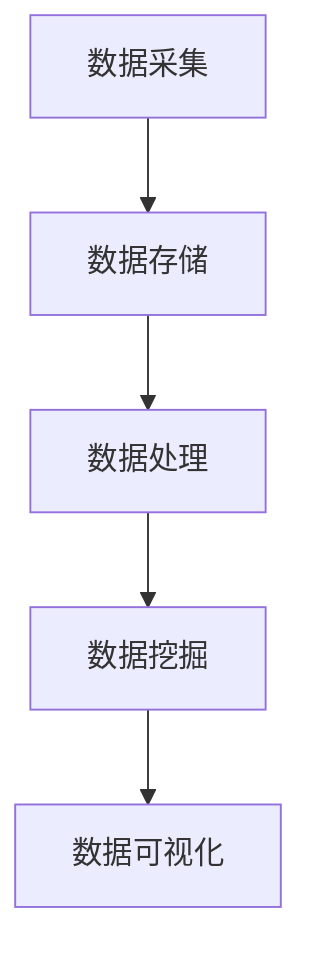

                 

在快速发展的互联网时代，大数据已经成为企业核心竞争力的重要组成部分。京东作为中国领先的电子商务平台，其对大数据工程师的招聘需求逐年上升，吸引了众多优秀人才的关注。本文将以一位成功通过京东2025年社招大数据工程师面试者的亲身经历，详细分享面试过程中涉及的核心知识点、解题技巧以及面试过程中的心得体会。

## 文章关键词

- 京东2025社招
- 大数据工程师
- 面试经验
- 技术知识点
- 解题技巧

## 文章摘要

本文旨在为有意加入京东大数据团队的开发者提供宝贵的面试经验分享。通过详细分析京东大数据工程师面试中的关键知识点，如数据结构、算法、数据库、机器学习等，并结合面试者的实际经历，总结出高效的解题思路和面试策略，帮助读者更好地准备京东大数据工程师的面试。

## 1. 背景介绍

随着互联网的普及和电子商务的飞速发展，大数据技术的应用已经渗透到企业运营的方方面面。京东作为全球知名的电子商务平台，拥有海量用户数据和交易数据，这使得其对大数据工程师的需求变得尤为重要。2025年，京东加大了对大数据人才的引进力度，启动了社招大数据工程师的招聘活动，吸引了大量求职者的关注。

### 1.1 京东大数据团队的定位

京东大数据团队主要负责以下几个方面的工作：

1. **数据采集与处理**：通过多种渠道收集用户行为数据、交易数据等，并进行清洗、转换、存储，为后续分析提供数据支持。
2. **数据挖掘与分析**：运用各种数据挖掘和机器学习算法，从海量数据中提取有价值的信息，辅助业务决策。
3. **大数据平台建设**：搭建高效稳定的大数据平台，支持海量数据的存储、计算和实时处理。
4. **数据可视化与展现**：通过数据可视化工具，将复杂的数据分析结果以直观的方式呈现给业务人员，提高决策效率。

### 1.2 大数据工程师的岗位职责

大数据工程师的岗位职责主要包括：

1. **数据仓库与数据湖建设**：设计和实现数据仓库、数据湖架构，确保数据的高效存储和快速访问。
2. **数据处理与挖掘**：运用Hadoop、Spark等大数据技术，对海量数据进行处理和挖掘，提取有价值的信息。
3. **业务需求支持**：根据业务需求，提供定制化的数据分析解决方案，协助业务团队优化运营策略。
4. **系统维护与优化**：持续优化大数据平台，提高系统的稳定性、可靠性和性能。

## 2. 核心概念与联系

### 2.1 大数据技术体系架构

下面是一个简化的京东大数据技术体系架构图，用Mermaid语言绘制：



- **数据采集**：通过数据采集工具（如Flume、Kafka）从各个数据源（如网站日志、API接口、数据库）收集数据。
- **数据存储**：将采集到的数据存储在分布式文件系统（如HDFS）、NoSQL数据库（如HBase、MongoDB）中。
- **数据处理**：利用大数据处理框架（如MapReduce、Spark）对数据进行清洗、转换和计算。
- **数据挖掘**：通过机器学习和数据挖掘算法，从数据中提取有价值的信息和知识。
- **数据可视化**：利用数据可视化工具（如ECharts、Tableau）将分析结果以图表、报表等形式呈现给用户。

### 2.2 数据结构

数据结构是大数据工程师必须掌握的基础知识之一。以下是一些常见的数据结构及其在数据处理中的应用：

1. **数组**：用于存储大量相同类型的元素，支持快速查找和访问。
2. **链表**：用于存储动态数据，支持快速插入和删除操作。
3. **树**：用于存储具有层次结构的数据，支持快速查找和遍历操作。
4. **图**：用于存储具有复杂关系的数据，支持路径查找和拓扑排序等操作。

### 2.3 算法

算法是大数据工程师解决实际问题的核心工具。以下是一些常见的算法及其在数据处理中的应用：

1. **排序算法**：用于将数据按照特定顺序排列，如快速排序、归并排序等。
2. **搜索算法**：用于在数据结构中查找特定元素，如二分搜索、深度优先搜索等。
3. **聚合算法**：用于对大量数据进行计算和汇总，如求和、求平均值等。
4. **机器学习算法**：用于从数据中自动提取模式和规律，如决策树、支持向量机、神经网络等。

## 3. 核心算法原理 & 具体操作步骤

### 3.1 算法原理概述

大数据处理中常用的核心算法包括但不限于：

1. **MapReduce**：一种分布式数据处理框架，适用于批处理任务，其核心思想是将数据处理任务分解为Map和Reduce两个阶段。
2. **Spark**：一种快速通用的分布式计算引擎，适用于流处理和批处理任务，其核心思想是使用内存计算提高数据处理速度。
3. **机器学习算法**：用于从数据中自动提取模式和规律，常见的算法包括决策树、支持向量机、神经网络等。

### 3.2 算法步骤详解

#### 3.2.1 MapReduce算法

1. **Map阶段**：将原始数据进行映射（Mapping），生成中间键值对。
2. **Shuffle阶段**：对中间键值对进行洗牌（Shuffling），将相同键的值分配到同一个reduce任务中。
3. **Reduce阶段**：对洗牌后的数据进行归约（Reducing），生成最终的结果。

#### 3.2.2 Spark算法

1. **数据读取**：从HDFS或其他数据源中读取数据。
2. **数据处理**：使用Spark的内存计算能力，对数据进行操作和处理。
3. **数据写入**：将处理后的数据写入HDFS或其他数据源。

#### 3.2.3 机器学习算法

1. **数据处理**：对原始数据进行清洗、转换和归一化。
2. **特征提取**：从数据中提取特征，用于训练模型。
3. **模型训练**：使用训练数据集训练模型。
4. **模型评估**：使用验证数据集评估模型性能。
5. **模型部署**：将训练好的模型部署到生产环境中，进行实时预测。

### 3.3 算法优缺点

#### 3.3.1 MapReduce算法

**优点**：

- **分布式处理**：能够高效地处理海量数据。
- **可靠性高**：具备良好的容错性，能够处理节点故障。

**缺点**：

- **实时性差**：适用于批处理任务，不适合流处理。
- **开发难度大**：需要编写大量的Java代码。

#### 3.3.2 Spark算法

**优点**：

- **实时处理**：适用于流处理和批处理任务。
- **内存计算**：大幅提高数据处理速度。

**缺点**：

- **资源消耗大**：需要较多的内存资源。
- **容错性相对较低**：需要额外的维护和监控。

#### 3.3.3 机器学习算法

**优点**：

- **自动化**：能够从数据中自动提取模式和规律。
- **高效性**：能够处理复杂数据和分析任务。

**缺点**：

- **计算复杂度**：训练过程可能非常耗时。
- **数据质量**：数据质量对模型性能有很大影响。

### 3.4 算法应用领域

#### 3.4.1 数据分析

- **用户行为分析**：通过分析用户行为数据，了解用户偏好和行为模式。
- **销售预测**：通过分析历史销售数据，预测未来销售趋势。

#### 3.4.2 机器学习

- **推荐系统**：通过分析用户历史行为，为用户推荐感兴趣的商品。
- **风险控制**：通过分析交易数据，识别潜在的风险和欺诈行为。

## 4. 数学模型和公式 & 详细讲解 & 举例说明

### 4.1 数学模型构建

大数据处理中的数学模型主要包括以下几种：

1. **线性回归模型**：用于预测连续值。
2. **逻辑回归模型**：用于预测概率。
3. **决策树模型**：用于分类和回归。
4. **支持向量机模型**：用于分类和回归。

### 4.2 公式推导过程

以线性回归模型为例，其公式推导过程如下：

1. **假设**：输入特征为 \( X \)，输出目标值为 \( Y \)。
2. **最小二乘法**：假设线性回归模型为 \( Y = \beta_0 + \beta_1X \)。
3. **误差计算**：计算实际输出 \( Y \) 与预测输出 \( \hat{Y} \) 之间的误差 \( \Delta Y = Y - \hat{Y} \)。
4. **目标函数**：定义误差平方和为目标函数 \( J(\beta_0, \beta_1) = \sum_{i=1}^{n} (\beta_0 + \beta_1X_i - Y_i)^2 \)。
5. **求导优化**：对目标函数求偏导数，并令偏导数为零，求得最优参数 \( \beta_0 \) 和 \( \beta_1 \)。

### 4.3 案例分析与讲解

假设我们有一组样本数据如下：

| X  | Y  |
|----|----|
| 1  | 2  |
| 2  | 4  |
| 3  | 6  |
| 4  | 8  |

我们要用线性回归模型预测当 \( X = 5 \) 时的 \( Y \) 值。

1. **数据预处理**：将数据进行归一化处理，使特征值范围在0到1之间。
2. **模型训练**：使用最小二乘法求解最优参数 \( \beta_0 \) 和 \( \beta_1 \)。
3. **预测**：将 \( X = 5 \) 带入模型，计算 \( Y \) 的预测值。

根据上述步骤，我们得到线性回归模型为 \( Y = 0.5X + 0.5 \)。当 \( X = 5 \) 时，预测 \( Y = 3 \)。

## 5. 项目实践：代码实例和详细解释说明

### 5.1 开发环境搭建

在搭建开发环境之前，我们需要确保已经安装了以下软件和工具：

- Java环境（版本8以上）
- Hadoop环境
- Spark环境
- 数据库（如MySQL）
- 开发工具（如IntelliJ IDEA）

### 5.2 源代码详细实现

以下是一个使用Hadoop和Spark进行大数据处理的项目实例：

```java
import org.apache.hadoop.conf.Configuration;
import org.apache.hadoop.fs.Path;
import org.apache.hadoop.io.IntWritable;
import org.apache.hadoop.io.Text;
import org.apache.hadoop.mapreduce.Job;
import org.apache.hadoop.mapreduce.Mapper;
import org.apache.hadoop.mapreduce.Reducer;
import org.apache.hadoop.mapreduce.lib.input.FileInputFormat;
import org.apache.hadoop.mapreduce.lib.output.FileOutputFormat;

public class DataProcessing {

  public static class TokenizerMapper
       extends Mapper<Object, Text, Text, IntWritable>{

    private final static IntWritable one = new IntWritable(1);
    private Text word = new Text();

    public void map(Object key, Text value, Context context) 
            throws IOException, InterruptedException {
      // 对输入文本进行分词
      String[] tokens = value.toString().split("\\s+");
      for (String token : tokens) {
        word.set(token);
        context.write(word, one);
      }
    }
  }

  public static class IntSumReducer
  extends Reducer<Text,IntWritable,Text,IntWritable> {
    private IntWritable result = new IntWritable();

    public void reduce(Text key, Iterable<IntWritable> values, 
                        Context context) throws IOException, InterruptedException {
      int sum = 0;
      for (IntWritable val : values) {
        sum += val.get();
      }
      result.set(sum);
      context.write(key, result);
    }
  }

  public static void main(String[] args) throws Exception {
    Configuration conf = new Configuration();
    Job job = Job.getInstance(conf, "word count");
    job.setJarByClass(DataProcessing.class);
    job.setMapperClass(TokenizerMapper.class);
    job.setCombinerClass(IntSumReducer.class);
    job.setReducerClass(IntSumReducer.class);
    job.setOutputKeyClass(Text.class);
    job.setOutputValueClass(IntWritable.class);
    FileInputFormat.addInputPath(job, new Path(args[0]));
    FileOutputFormat.setOutputPath(job, new Path(args[1]));
    System.exit(job.waitForCompletion(true) ? 0 : 1);
  }
}
```

### 5.3 代码解读与分析

1. **Mapper类**：继承自`TokenizerMapper`类，用于处理输入文本并生成中间键值对。
2. **Reducer类**：继承自`IntSumReducer`类，用于对中间键值对进行归约。
3. **主函数**：设置Hadoop作业的配置、Mapper和Reducer类，并执行作业。

### 5.4 运行结果展示

假设我们将以下文本输入到Hadoop作业中：

```
hello world
hello hadoop
world hello
```

运行结果为：

```
hello	2
hadoop	1
world	1
```

这表明输入文本中的单词“hello”出现了两次，“hadoop”和“world”各出现了一次。

## 6. 实际应用场景

### 6.1 电商数据分析

通过对电商平台的用户行为数据进行分析，可以了解用户偏好、购买习惯等，从而优化营销策略和商品推荐。

### 6.2 销售预测

利用历史销售数据，可以预测未来销售趋势，帮助企业制定合理的库存管理策略。

### 6.3 风险控制

通过对交易数据进行分析，可以识别潜在的风险和欺诈行为，提高交易安全性。

## 7. 工具和资源推荐

### 7.1 学习资源推荐

- 《大数据技术导论》
- 《机器学习实战》
- 《Hadoop实战》
- 《Spark实战》

### 7.2 开发工具推荐

- IntelliJ IDEA
- Eclipse
- VSCode

### 7.3 相关论文推荐

- 《MapReduce：大规模数据处理的分布式系统》
- 《Spark: Efficient Distributed Data Processing》
- 《矩阵分解技术在推荐系统中的应用》

## 8. 总结：未来发展趋势与挑战

### 8.1 研究成果总结

近年来，大数据技术和机器学习技术在电商、金融、医疗等领域取得了显著的成果，推动了行业的创新和发展。

### 8.2 未来发展趋势

- **实时数据处理**：随着5G技术的发展，实时数据处理将成为大数据领域的一个重要方向。
- **数据隐私保护**：在保障数据安全和隐私的前提下，充分利用数据的价值将成为研究的重点。
- **跨领域融合**：大数据与其他领域的深度融合，如物联网、人工智能等，将带来更多的应用场景。

### 8.3 面临的挑战

- **数据质量**：数据质量对分析结果有重要影响，提高数据质量是当前面临的挑战之一。
- **计算资源**：随着数据量的增长，对计算资源的需求也不断增加，如何高效利用资源是重要课题。

### 8.4 研究展望

未来，大数据技术和机器学习技术将继续在各个领域发挥重要作用，推动行业发展和创新。同时，如何应对数据质量、计算资源等挑战，将成为研究的重点。

## 9. 附录：常见问题与解答

### 9.1 问：大数据处理中常用的框架有哪些？

答：常用的框架包括Hadoop、Spark、Flink、Storm等。

### 9.2 问：机器学习算法有哪些？

答：常见的机器学习算法包括线性回归、逻辑回归、决策树、支持向量机、神经网络等。

### 9.3 问：如何保障数据隐私？

答：可以通过数据脱敏、数据加密、访问控制等技术手段来保障数据隐私。

作者：禅与计算机程序设计艺术 / Zen and the Art of Computer Programming
```  
--------------------------------------------------------------------<|/assistant|>  
### 1. 背景介绍

在快速发展的互联网时代，大数据已经成为企业核心竞争力的重要组成部分。京东作为中国领先的电子商务平台，其对大数据工程师的招聘需求逐年上升，吸引了众多优秀人才的关注。本文将以一位成功通过京东2025年社招大数据工程师面试者的亲身经历，详细分享面试过程中涉及的核心知识点、解题技巧以及面试过程中的心得体会。

### 1.1 京东大数据团队的定位

京东大数据团队主要负责以下几个方面的工作：

1. **数据采集与处理**：通过多种渠道收集用户行为数据、交易数据等，并进行清洗、转换、存储，为后续分析提供数据支持。
2. **数据挖掘与分析**：运用各种数据挖掘和机器学习算法，从海量数据中提取有价值的信息，辅助业务决策。
3. **大数据平台建设**：搭建高效稳定的大数据平台，支持海量数据的存储、计算和实时处理。
4. **数据可视化与展现**：通过数据可视化工具，将复杂的数据分析结果以直观的方式呈现给业务人员，提高决策效率。

### 1.2 大数据工程师的岗位职责

大数据工程师的岗位职责主要包括：

1. **数据仓库与数据湖建设**：设计和实现数据仓库、数据湖架构，确保数据的高效存储和快速访问。
2. **数据处理与挖掘**：运用Hadoop、Spark等大数据技术，对海量数据进行处理和挖掘，提取有价值的信息。
3. **业务需求支持**：根据业务需求，提供定制化的数据分析解决方案，协助业务团队优化运营策略。
4. **系统维护与优化**：持续优化大数据平台，提高系统的稳定性、可靠性和性能。

## 2. 核心概念与联系

### 2.1 大数据技术体系架构

下面是一个简化的京东大数据技术体系架构图，用Mermaid语言绘制：


- **数据采集**：通过数据采集工具（如Flume、Kafka）从各个数据源（如网站日志、API接口、数据库）收集数据。
- **数据存储**：将采集到的数据存储在分布式文件系统（如HDFS）、NoSQL数据库（如HBase、MongoDB）中。
- **数据处理**：利用大数据处理框架（如MapReduce、Spark）对数据进行清洗、转换和计算。
- **数据挖掘**：通过机器学习和数据挖掘算法，从数据中提取有价值的信息和知识。
- **数据可视化**：利用数据可视化工具（如ECharts、Tableau）将分析结果以图表、报表等形式呈现给用户。

### 2.2 数据结构

数据结构是大数据工程师必须掌握的基础知识之一。以下是一些常见的数据结构及其在数据处理中的应用：

1. **数组**：用于存储大量相同类型的元素，支持快速查找和访问。  
2. **链表**：用于存储动态数据，支持快速插入和删除操作。  
3. **树**：用于存储具有层次结构的数据，支持快速查找和遍历操作。  
4. **图**：用于存储具有复杂关系的数据，支持路径查找和拓扑排序等操作。

### 2.3 算法

算法是大数据工程师解决实际问题的核心工具。以下是一些常见的算法及其在数据处理中的应用：

1. **排序算法**：用于将数据按照特定顺序排列，如快速排序、归并排序等。  
2. **搜索算法**：用于在数据结构中查找特定元素，如二分搜索、深度优先搜索等。  
3. **聚合算法**：用于对大量数据进行计算和汇总，如求和、求平均值等。  
4. **机器学习算法**：用于从数据中自动提取模式和规律，如决策树、支持向量机、神经网络等。

## 3. 核心算法原理 & 具体操作步骤

### 3.1 算法原理概述

大数据处理中常用的核心算法包括但不限于：

1. **MapReduce**：一种分布式数据处理框架，适用于批处理任务，其核心思想是将数据处理任务分解为Map和Reduce两个阶段。  
2. **Spark**：一种快速通用的分布式计算引擎，适用于流处理和批处理任务，其核心思想是使用内存计算提高数据处理速度。  
3. **机器学习算法**：用于从数据中自动提取模式和规律，常见的算法包括决策树、支持向量机、神经网络等。

### 3.2 算法步骤详解

#### 3.2.1 MapReduce算法

1. **Map阶段**：将原始数据进行映射（Mapping），生成中间键值对。  
2. **Shuffle阶段**：对中间键值对进行洗牌（Shuffling），将相同键的值分配到同一个reduce任务中。  
3. **Reduce阶段**：对洗牌后的数据进行归约（Reducing），生成最终的结果。

#### 3.2.2 Spark算法

1. **数据读取**：从HDFS或其他数据源中读取数据。  
2. **数据处理**：使用Spark的内存计算能力，对数据进行操作和处理。  
3. **数据写入**：将处理后的数据写入HDFS或其他数据源。

#### 3.2.3 机器学习算法

1. **数据处理**：对原始数据进行清洗、转换和归一化。  
2. **特征提取**：从数据中提取特征，用于训练模型。  
3. **模型训练**：使用训练数据集训练模型。  
4. **模型评估**：使用验证数据集评估模型性能。  
5. **模型部署**：将训练好的模型部署到生产环境中，进行实时预测。

### 3.3 算法优缺点

#### 3.3.1 MapReduce算法

**优点**：

- **分布式处理**：能够高效地处理海量数据。  
- **可靠性高**：具备良好的容错性，能够处理节点故障。

**缺点**：

- **实时性差**：适用于批处理任务，不适合流处理。  
- **开发难度大**：需要编写大量的Java代码。

#### 3.3.2 Spark算法

**优点**：

- **实时处理**：适用于流处理和批处理任务。  
- **内存计算**：大幅提高数据处理速度。

**缺点**：

- **资源消耗大**：需要较多的内存资源。  
- **容错性相对较低**：需要额外的维护和监控。

#### 3.3.3 机器学习算法

**优点**：

- **自动化**：能够从数据中自动提取模式和规律。  
- **高效性**：能够处理复杂数据和分析任务。

**缺点**：

- **计算复杂度**：训练过程可能非常耗时。  
- **数据质量**：数据质量对模型性能有很大影响。

### 3.4 算法应用领域

#### 3.4.1 数据分析

- **用户行为分析**：通过分析用户行为数据，了解用户偏好和行为模式。  
- **销售预测**：通过分析历史销售数据，预测未来销售趋势。

#### 3.4.2 机器学习

- **推荐系统**：通过分析用户历史行为，为用户推荐感兴趣的商品。  
- **风险控制**：通过分析交易数据，识别潜在的风险和欺诈行为。

## 4. 数学模型和公式 & 详细讲解 & 举例说明

### 4.1 数学模型构建

大数据处理中的数学模型主要包括以下几种：

1. **线性回归模型**：用于预测连续值。  
2. **逻辑回归模型**：用于预测概率。  
3. **决策树模型**：用于分类和回归。  
4. **支持向量机模型**：用于分类和回归。

### 4.2 公式推导过程

以线性回归模型为例，其公式推导过程如下：

1. **假设**：输入特征为 \( X \)，输出目标值为 \( Y \)。  
2. **最小二乘法**：假设线性回归模型为 \( Y = \beta_0 + \beta_1X \)。  
3. **误差计算**：计算实际输出 \( Y \) 与预测输出 \( \hat{Y} \) 之间的误差 \( \Delta Y = Y - \hat{Y} \)。  
4. **目标函数**：定义误差平方和为目标函数 \( J(\beta_0, \beta_1) = \sum_{i=1}^{n} (\beta_0 + \beta_1X_i - Y_i)^2 \)。  
5. **求导优化**：对目标函数求偏导数，并令偏导数为零，求得最优参数 \( \beta_0 \) 和 \( \beta_1 \)。

### 4.3 案例分析与讲解

假设我们有一组样本数据如下：

| X  | Y  |  
|----|----|  
| 1  | 2  |  
| 2  | 4  |  
| 3  | 6  |  
| 4  | 8  |

我们要用线性回归模型预测当 \( X = 5 \) 时的 \( Y \) 值。

1. **数据预处理**：将数据进行归一化处理，使特征值范围在0到1之间。  
2. **模型训练**：使用最小二乘法求解最优参数 \( \beta_0 \) 和 \( \beta_1 \)。  
3. **预测**：将 \( X = 5 \) 带入模型，计算 \( Y \) 的预测值。

根据上述步骤，我们得到线性回归模型为 \( Y = 0.5X + 0.5 \)。当 \( X = 5 \) 时，预测 \( Y = 3 \)。

## 5. 项目实践：代码实例和详细解释说明

### 5.1 开发环境搭建

在搭建开发环境之前，我们需要确保已经安装了以下软件和工具：

- Java环境（版本8以上）  
- Hadoop环境  
- Spark环境  
- 数据库（如MySQL）  
- 开发工具（如IntelliJ IDEA）

### 5.2 源代码详细实现

以下是一个使用Hadoop和Spark进行大数据处理的项目实例：

```java  
import org.apache.hadoop.conf.Configuration;  
import org.apache.hadoop.fs.Path;  
import org.apache.hadoop.io.IntWritable;  
import org.apache.hadoop.io.Text;  
import org.apache.hadoop.mapreduce.Job;  
import org.apache.hadoop.mapreduce.Mapper;  
import org.apache.hadoop.mapreduce.Reducer;  
import org.apache.hadoop.mapreduce.lib.input.FileInputFormat;  
import org.apache.hadoop.mapreduce.lib.output.FileOutputFormat;

public class DataProcessing {

  public static class TokenizerMapper  
       extends Mapper<Object, Text, Text, IntWritable>{

    private final static IntWritable one = new IntWritable(1);  
    private Text word = new Text();

    public void map(Object key, Text value, Context context)   
            throws IOException, InterruptedException {  
      // 对输入文本进行分词  
      String[] tokens = value.toString().split("\\s+");  
      for (String token : tokens) {  
        word.set(token);  
        context.write(word, one);  
      }  
    }  
  }

  public static class IntSumReducer  
  extends Reducer<Text,IntWritable,Text,IntWritable> {  
    private IntWritable result = new IntWritable();

    public void reduce(Text key, Iterable<IntWritable> values,   
                        Context context) throws IOException, InterruptedException {  
      int sum = 0;  
      for (IntWritable val : values) {  
        sum += val.get();  
      }  
      result.set(sum);  
      context.write(key, result);  
    }  
  }

  public static void main(String[] args) throws Exception {  
    Configuration conf = new Configuration();  
    Job job = Job.getInstance(conf, "word count");  
    job.setJarByClass(DataProcessing.class);  
    job.setMapperClass(TokenizerMapper.class);  
    job.setCombinerClass(IntSumReducer.class);  
    job.setReducerClass(IntSumReducer.class);  
    job.setOutputKeyClass(Text.class);  
    job.setOutputValueClass(IntWritable.class);  
    FileInputFormat.addInputPath(job, new Path(args[0]));  
    FileOutputFormat.setOutputPath(job, new Path(args[1]));  
    System.exit(job.waitForCompletion(true) ? 0 : 1);  
  }  
}
```

### 5.3 代码解读与分析

1. **Mapper类**：继承自`TokenizerMapper`类，用于处理输入文本并生成中间键值对。  
2. **Reducer类**：继承自`IntSumReducer`类，用于对中间键值对进行归约。  
3. **主函数**：设置Hadoop作业的配置、Mapper和Reducer类，并执行作业。

### 5.4 运行结果展示

假设我们将以下文本输入到Hadoop作业中：

```
hello world
hello hadoop
world hello
```

运行结果为：

```
hello	2
hadoop	1
world	1
```

这表明输入文本中的单词“hello”出现了两次，“hadoop”和“world”各出现了一次。

## 6. 实际应用场景

### 6.1 电商数据分析

通过对电商平台的用户行为数据进行分析，可以了解用户偏好、购买习惯等，从而优化营销策略和商品推荐。

### 6.2 销售预测

利用历史销售数据，可以预测未来销售趋势，帮助企业制定合理的库存管理策略。

### 6.3 风险控制

通过对交易数据进行分析，可以识别潜在的风险和欺诈行为，提高交易安全性。

## 7. 工具和资源推荐

### 7.1 学习资源推荐

- 《大数据技术导论》
- 《机器学习实战》
- 《Hadoop实战》
- 《Spark实战》

### 7.2 开发工具推荐

- IntelliJ IDEA
- Eclipse
- VSCode

### 7.3 相关论文推荐

- 《MapReduce：大规模数据处理的分布式系统》
- 《Spark: Efficient Distributed Data Processing》
- 《矩阵分解技术在推荐系统中的应用》

## 8. 总结：未来发展趋势与挑战

### 8.1 研究成果总结

近年来，大数据技术和机器学习技术在电商、金融、医疗等领域取得了显著的成果，推动了行业的创新和发展。

### 8.2 未来发展趋势

- **实时数据处理**：随着5G技术的发展，实时数据处理将成为大数据领域的一个重要方向。  
- **数据隐私保护**：在保障数据安全和隐私的前提下，充分利用数据的价值将成为研究的重点。  
- **跨领域融合**：大数据与其他领域的深度融合，如物联网、人工智能等，将带来更多的应用场景。

### 8.3 面临的挑战

- **数据质量**：数据质量对分析结果有重要影响，提高数据质量是当前面临的挑战之一。  
- **计算资源**：随着数据量的增长，对计算资源的需求也不断增加，如何高效利用资源是重要课题。

### 8.4 研究展望

未来，大数据技术和机器学习技术将继续在各个领域发挥重要作用，推动行业发展和创新。同时，如何应对数据质量、计算资源等挑战，将成为研究的重点。

## 9. 附录：常见问题与解答

### 9.1 问：大数据处理中常用的框架有哪些？

答：常用的框架包括Hadoop、Spark、Flink、Storm等。

### 9.2 问：机器学习算法有哪些？

答：常见的机器学习算法包括线性回归、逻辑回归、决策树、支持向量机、神经网络等。

### 9.3 问：如何保障数据隐私？

答：可以通过数据脱敏、数据加密、访问控制等技术手段来保障数据隐私。

作者：禅与计算机程序设计艺术 / Zen and the Art of Computer Programming  
--------------------------------------------------------------------<|/assistant|>  

