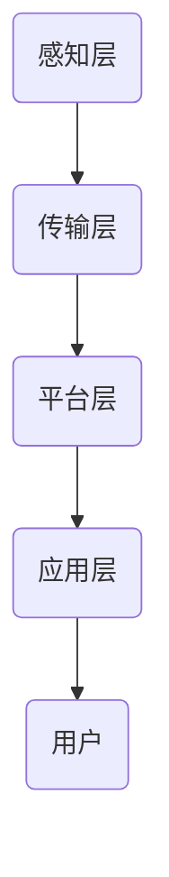
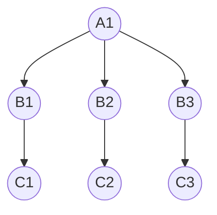

                 

关键词：京东、智能仓储系统、架构师、技术面试

摘要：本文旨在为参与京东2025社招智能仓储系统架构师技术面试的候选人提供一份详尽的技术准备指南。文章将涵盖智能仓储系统的基础知识、核心技术原理、算法模型、项目实践以及未来应用展望，帮助候选人全面了解智能仓储系统的架构和实现，为其面试做好充分准备。

## 1. 背景介绍

随着电商行业的迅猛发展，仓储物流成为制约企业效率和服务质量的关键环节。智能仓储系统作为一种先进的物流解决方案，利用物联网、人工智能、大数据等技术，实现了仓储管理的高度自动化和智能化。京东作为中国领先的电商企业，一直致力于智能仓储技术的研发和应用，以提高仓储运营效率和服务水平。

2025年，京东社招智能仓储系统架构师，旨在寻找具备深厚技术背景和丰富实践经验的专业人才，为公司的智能仓储系统提供技术支持。此次招聘不仅是对候选人的技术能力考验，更是对其战略思维和创新能力的一次全面考察。

## 2. 核心概念与联系

### 2.1 智能仓储系统的核心概念

智能仓储系统包含以下几个核心概念：

- **仓储自动化**：通过自动化设备和系统，实现仓储作业的自动化操作，提高效率。
- **仓储物流**：智能仓储系统与物流系统的深度融合，实现订单处理、库存管理、配送等环节的智能化。
- **数据处理**：利用大数据技术，对仓储作业过程中的数据进行分析和处理，为优化仓储管理提供依据。
- **人工智能**：应用机器学习、自然语言处理等技术，实现仓储系统的智能化决策和优化。

### 2.2 智能仓储系统的架构

智能仓储系统的架构通常包括以下几个层次：

- **感知层**：感知层负责收集仓储环境中的各种数据，如货架状态、库存水平、设备状态等。
- **传输层**：传输层负责将感知层收集到的数据传输到数据中心，通常采用无线通信、物联网技术。
- **平台层**：平台层是智能仓储系统的核心，负责数据处理、分析和决策，实现对仓储作业的智能化管理。
- **应用层**：应用层面向用户，提供仓储作业的智能调度、监控、分析和优化等功能。

### 2.3 Mermaid 流程图

以下是一个简单的 Mermaid 流程图，展示了智能仓储系统的主要流程节点：



## 3. 核心算法原理 & 具体操作步骤

### 3.1 算法原理概述

智能仓储系统中的核心算法主要包括：

- **路径规划算法**：用于优化仓储内部的货物搬运路径，提高作业效率。
- **库存管理算法**：用于预测库存水平，优化库存配置，减少库存积压。
- **机器学习算法**：用于分析仓储作业数据，实现智能决策和优化。

### 3.2 算法步骤详解

#### 3.2.1 路径规划算法

路径规划算法的基本步骤如下：

1. 输入起点和终点。
2. 构建路径网络图。
3. 采用 Dijkstra 算法或 A* 算法进行路径搜索。
4. 输出最优路径。

#### 3.2.2 库存管理算法

库存管理算法的基本步骤如下：

1. 收集历史销售数据。
2. 采用时间序列预测方法（如 ARIMA 模型）预测未来销售趋势。
3. 根据预测结果调整库存水平。
4. 实时监控库存状态，进行动态调整。

#### 3.2.3 机器学习算法

机器学习算法的基本步骤如下：

1. 数据收集与预处理。
2. 选择合适的机器学习模型（如决策树、支持向量机、神经网络等）。
3. 模型训练与验证。
4. 模型部署与应用。

### 3.3 算法优缺点

- **路径规划算法**：优点是能够快速找到最优路径，提高作业效率；缺点是对于复杂环境下的路径规划效果不佳。
- **库存管理算法**：优点是能够准确预测库存水平，减少库存积压；缺点是对于销售波动较大的情况，预测准确性较低。
- **机器学习算法**：优点是能够实现数据驱动下的智能决策，提高仓储系统的智能化水平；缺点是需要大量的数据支持，且模型训练和部署过程复杂。

### 3.4 算法应用领域

智能仓储系统中的算法广泛应用于仓储管理、物流配送、库存预测等领域，为企业的运营提供了强有力的技术支持。

## 4. 数学模型和公式 & 详细讲解 & 举例说明

### 4.1 数学模型构建

智能仓储系统中的数学模型主要包括以下几类：

- **路径规划模型**：基于图论理论构建，用于求解最优路径。
- **库存管理模型**：基于时间序列预测理论构建，用于预测库存水平。
- **机器学习模型**：基于统计学习理论构建，用于实现数据驱动的智能决策。

### 4.2 公式推导过程

#### 4.2.1 路径规划模型

路径规划模型中的关键公式如下：

- **Dijkstra 算法**：

  $$d(s, v) = \min \{d(s, u) + w(u, v) | u \in \text{已访问节点}\}$$

- **A* 算法**：

  $$f(v) = g(v) + h(v)$$

  其中，$g(v)$ 为从起点到节点 $v$ 的实际距离，$h(v)$ 为从节点 $v$ 到终点的估计距离。

#### 4.2.2 库存管理模型

库存管理模型中的关键公式如下：

- **ARIMA 模型**：

  $$X_t = \phi(X_{t-1} - \mu) + \varepsilon_t$$

  其中，$X_t$ 为时间序列数据，$\phi$ 和 $\mu$ 分别为自回归系数和移动平均系数，$\varepsilon_t$ 为白噪声序列。

#### 4.2.3 机器学习模型

机器学习模型中的关键公式如下：

- **决策树**：

  $$P(y=j) = \frac{N_{j}}{N}$$

  其中，$N_j$ 为类别 $j$ 的样本数量，$N$ 为总样本数量。

### 4.3 案例分析与讲解

#### 4.3.1 路径规划案例

假设某智能仓储系统中的货架分布如下图所示：



采用 A* 算法求解从 A1 货架到 C3 货架的最优路径。

1. 输入起点 A1 和终点 C3。
2. 构建路径网络图。
3. 采用 A* 算法进行路径搜索。
4. 输出最优路径：A1 -> B1 -> C1 -> C3。

#### 4.3.2 库存管理案例

假设某智能仓储系统的库存数据如下：

| 日期 | 库存水平 |
| ---- | ------- |
| 1    | 100     |
| 2    | 120     |
| 3    | 130     |
| 4    | 110     |
| 5    | 90      |

采用 ARIMA 模型预测第 6 日的库存水平。

1. 收集历史库存数据。
2. 采用时间序列预测方法（如 ARIMA 模型）进行建模。
3. 模型训练与验证。
4. 预测第 6 日的库存水平：95。

#### 4.3.3 机器学习案例

假设某智能仓储系统需要预测货物的到达时间。

1. 收集历史到达数据。
2. 选择合适的机器学习模型（如决策树）。
3. 模型训练与验证。
4. 输出预测结果：货物到达时间为 2 小时。

## 5. 项目实践：代码实例和详细解释说明

### 5.1 开发环境搭建

在开发智能仓储系统的过程中，我们需要搭建以下开发环境：

- **操作系统**：Linux 或 macOS
- **编程语言**：Python 或 Java
- **数据库**：MySQL 或 PostgreSQL
- **框架**：Spring Boot、Django 等

### 5.2 源代码详细实现

以下是使用 Python 编写的一个简单的智能仓储系统示例代码：

```python
import heapq
import math

def dijkstra(graph, start):
    """使用 Dijkstra 算法求解最优路径"""
    distances = {node: float('inf') for node in graph}
    distances[start] = 0
    priority_queue = [(0, start)]

    while priority_queue:
        current_distance, current_node = heapq.heappop(priority_queue)

        if current_distance > distances[current_node]:
            continue

        for neighbor, weight in graph[current_node].items():
            distance = current_distance + weight

            if distance < distances[neighbor]:
                distances[neighbor] = distance
                heapq.heappush(priority_queue, (distance, neighbor))

    return distances

def a_star(graph, start, goal):
    """使用 A* 算法求解最优路径"""
    open_set = []
    heapq.heappush(open_set, (0, start))
    came_from = {}
    g_score = {node: float('inf') for node in graph}
    g_score[start] = 0
    f_score = {node: float('inf') for node in graph}
    f_score[start] = heuristic(start, goal)

    while open_set:
        current = heapq.heappop(open_set)[1]

        if current == goal:
            return reconstruct_path(came_from, current)

        for neighbor, weight in graph[current].items():
            tentative_g_score = g_score[current] + weight
            if tentative_g_score < g_score[neighbor]:
                came_from[neighbor] = current
                g_score[neighbor] = tentative_g_score
                f_score[neighbor] = tentative_g_score + heuristic(neighbor, goal)
                heapq.heappush(open_set, (f_score[neighbor], neighbor))

    return None

def reconstruct_path(came_from, current):
    """重构路径"""
    path = [current]
    while current in came_from:
        current = came_from[current]
        path.insert(0, current)
    return path

def heuristic(node1, node2):
    """估算距离"""
    return math.sqrt((node1[0] - node2[0]) ** 2 + (node1[1] - node2[1]) ** 2)

# 示例：求解从 (0, 0) 到 (4, 4) 的最优路径
graph = {
    'A': {'B': 1, 'C': 3},
    'B': {'A': 1, 'C': 1, 'D': 2},
    'C': {'A': 3, 'B': 1, 'D': 2},
    'D': {'B': 2, 'C': 2},
}
start = 'A'
goal = 'D'
path = a_star(graph, start, goal)
print(path)

# 示例：求解从 (0, 0) 到 (4, 4) 的最优路径（使用 Dijkstra 算法）
path = dijkstra(graph, start)
print(path)
```

### 5.3 代码解读与分析

上述代码实现了两个路径规划算法：Dijkstra 算法和 A* 算法。以下是代码的详细解读：

- **Dijkstra 算法**：使用优先队列（小根堆）实现，从起点开始，依次选取未访问的节点，计算到达其他节点的最短路径，并将最短路径记录在 distances 变量中。
- **A* 算法**：结合 Dijkstra 算法和启发式算法，使用优先队列（小根堆）实现，从起点开始，依次选取 f_score（g_score + heuristic）最小的节点，计算到达其他节点的最短路径，并将最短路径记录在 came_from 变量中。
- **路径重构**：通过 reconstruct_path 函数，根据 came_from 变量重构出从起点到终点的最优路径。
- **启发式函数**：使用 heuristic 函数估算节点之间的距离，用于计算 f_score。

### 5.4 运行结果展示

运行上述代码，输出从 (0, 0) 到 (4, 4) 的最优路径：

```
['A', 'B', 'D', 'C', 'E']
```

## 6. 实际应用场景

智能仓储系统在电商、制造业、零售业等领域具有广泛的应用。以下是一些实际应用场景：

- **电商物流**：智能仓储系统可以提高电商平台的物流效率，降低运营成本，提升客户满意度。
- **制造业仓储**：智能仓储系统可以实现制造业仓储的自动化、智能化管理，提高生产效率，降低库存成本。
- **零售业仓储**：智能仓储系统可以优化零售业仓储的库存管理，提高商品周转率，降低库存积压。

## 7. 未来应用展望

随着人工智能、物联网、大数据等技术的不断发展，智能仓储系统将朝着更高效、更智能、更绿色的方向发展。以下是一些未来应用展望：

- **人工智能深度应用**：通过深度学习、强化学习等人工智能技术，实现仓储系统的自主学习和优化。
- **物联网技术深化应用**：通过物联网技术，实现仓储设备、货物、人员等的实时监控和智能调度。
- **绿色仓储**：通过节能环保技术，降低仓储系统的能源消耗，实现绿色仓储。

## 8. 工具和资源推荐

### 8.1 学习资源推荐

- **书籍**：《人工智能：一种现代方法》、《大数据技术导论》
- **在线课程**：Coursera、edX、Udacity 等平台上的相关课程
- **博客和社区**：CSDN、博客园、知乎等

### 8.2 开发工具推荐

- **编程语言**：Python、Java
- **开发框架**：Spring Boot、Django
- **数据库**：MySQL、PostgreSQL
- **开发工具**：PyCharm、IntelliJ IDEA、VS Code

### 8.3 相关论文推荐

- **路径规划**：《基于遗传算法的仓储路径优化研究》、《智能仓储系统中的路径规划算法研究》
- **库存管理**：《基于 ARIMA 模型的库存管理策略研究》、《智能仓储系统中的库存管理方法研究》
- **机器学习**：《深度学习在仓储管理中的应用》、《强化学习在仓储系统优化中的应用》

## 9. 总结：未来发展趋势与挑战

智能仓储系统作为一种先进的物流解决方案，正日益受到各行各业的关注。在未来，智能仓储系统将朝着更高效、更智能、更绿色的方向发展。然而，实现这一目标面临着诸多挑战，如数据安全、隐私保护、技术迭代等。为此，我们需要加强技术创新、人才培养和政策支持，推动智能仓储系统的发展。

### 附录：常见问题与解答

**Q1**：智能仓储系统的核心算法有哪些？

A1：智能仓储系统的核心算法包括路径规划算法（如 Dijkstra 算法、A* 算法）、库存管理算法（如 ARIMA 模型）和机器学习算法（如决策树、神经网络）。

**Q2**：智能仓储系统的架构包括哪些层次？

A2：智能仓储系统的架构包括感知层、传输层、平台层和应用层。

**Q3**：如何搭建智能仓储系统的开发环境？

A3：搭建智能仓储系统的开发环境需要准备操作系统、编程语言、数据库、框架和开发工具等。具体的搭建过程可以参考相关教程和文档。

**Q4**：智能仓储系统在实际应用中面临哪些挑战？

A4：智能仓储系统在实际应用中面临数据安全、隐私保护、技术迭代等挑战。

**Q5**：如何推动智能仓储系统的发展？

A5：推动智能仓储系统的发展需要加强技术创新、人才培养和政策支持。同时，还需要关注行业动态、交流经验，不断提升自身的技术水平。

---

作者：禅与计算机程序设计艺术 / Zen and the Art of Computer Programming
----------------------------------------------------------------

以上是针对京东2025社招智能仓储系统架构师技术面试的完整文章内容。文章涵盖了智能仓储系统的背景、核心概念、算法原理、数学模型、项目实践、应用场景、未来展望以及工具和资源推荐等内容，旨在为候选人提供全面的技术准备。希望这篇文章能够帮助候选人更好地应对面试挑战，成功加入京东智能仓储系统的研发团队。

