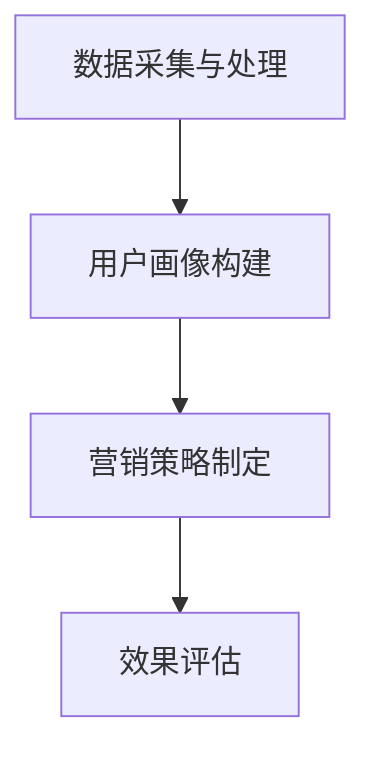

                 

在当今高度竞争的商业环境中，智能营销策略已经成为企业成功的关键因素之一。随着人工智能技术的快速发展，京东作为我国领先的电商平台，也在不断探索和实施更加智能化的营销策略。为了更好地应对2024年的校招面试，本文将汇总并详细解答京东智能营销策略相关的面试真题，帮助考生全面了解京东在智能营销领域的布局和前沿技术。

## 关键词

- 智能营销策略
- 京东校招面试
- 人工智能
- 数据分析
- 个性化推荐

## 摘要

本文旨在为2024年京东校招面试的考生提供智能营销策略相关的真题汇总及详细解答。通过对这些面试题的深入分析，考生可以更好地理解京东智能营销的核心原理、技术应用和未来趋势，从而在面试中展示自己的专业素养和技术能力。

## 1. 背景介绍

### 1.1 京东智能营销的发展历程

随着互联网的普及和电子商务的迅猛发展，京东在智能营销领域取得了显著的成果。从早期的基于规则推荐系统，到如今的人工智能驱动的深度学习算法，京东的营销策略经历了多次迭代和升级。特别是在2018年，京东提出了“智能供应链+智能营销”的战略布局，进一步加大了对智能营销技术的投入。

### 1.2 智能营销的核心概念

智能营销是指利用大数据、人工智能、云计算等先进技术，对用户行为、市场趋势、产品特点等进行分析和挖掘，从而实现精准营销、个性化推荐和智能服务。在京东的智能营销体系中，主要包括以下几个核心概念：

1. **个性化推荐**：根据用户的兴趣、购买历史和行为特征，为用户推荐个性化的商品和服务。
2. **精准营销**：通过数据分析和用户画像，实现广告投放、促销活动的精准定位和个性化推送。
3. **智能客服**：利用自然语言处理、语音识别等技术，为用户提供智能化的客户服务。
4. **智能供应链**：通过数据分析和预测，优化供应链管理，提高库存周转率和商品配送效率。

## 2. 核心概念与联系

### 2.1 智能营销策略的架构

智能营销策略的架构可以分为四个主要层次：数据采集与处理、用户画像构建、营销策略制定和效果评估。

1. **数据采集与处理**：通过用户行为数据、商品数据、市场数据等，进行数据采集和初步处理，为后续分析提供基础数据。
2. **用户画像构建**：基于数据分析和挖掘，构建用户的综合画像，包括兴趣、消费习惯、社会属性等。
3. **营销策略制定**：根据用户画像和市场趋势，制定个性化的营销策略，包括推荐策略、广告投放策略和促销活动策略等。
4. **效果评估**：通过数据监控和评估，对营销策略的效果进行实时反馈和调整，以优化营销效果。

### 2.2 Mermaid 流程图

下面是一个简单的Mermaid流程图，展示了智能营销策略的架构和流程：



## 3. 核心算法原理 & 具体操作步骤

### 3.1 算法原理概述

智能营销策略的核心算法主要包括以下几个方面：

1. **协同过滤算法**：基于用户的历史行为和兴趣，为用户推荐相似的用户喜欢的商品。
2. **基于内容的推荐算法**：根据商品的内容特征（如标题、描述、标签等），为用户推荐相关的商品。
3. **深度学习算法**：通过神经网络模型，对用户行为和商品特征进行深度学习，实现更精准的推荐。

### 3.2 算法步骤详解

1. **数据预处理**：对采集到的原始数据进行清洗、去重、填充等预处理操作，得到高质量的数据集。
2. **特征工程**：对数据集进行特征提取和转换，包括用户特征、商品特征、上下文特征等。
3. **模型训练**：选择合适的推荐算法，对预处理后的数据集进行模型训练，得到推荐模型。
4. **模型评估**：通过交叉验证、A/B测试等方法，评估推荐模型的性能和效果。
5. **模型部署**：将训练好的模型部署到线上环境，实现实时推荐。

### 3.3 算法优缺点

1. **协同过滤算法**：优点是简单高效，缺点是容易产生“冷启动”问题，即新用户或新商品难以获得准确的推荐。
2. **基于内容的推荐算法**：优点是能够准确推荐相关的商品，缺点是对商品描述和标签的依赖性较高，容易导致信息过载。
3. **深度学习算法**：优点是能够处理高维数据，实现更精准的推荐，缺点是模型训练过程复杂，计算资源需求大。

### 3.4 算法应用领域

智能营销算法在电商、视频、新闻、社交媒体等多个领域都有广泛的应用。以电商领域为例，智能营销算法可以实现个性化推荐、精准广告投放、智能客服等功能，提高用户满意度、提升销售额。

## 4. 数学模型和公式 & 详细讲解 & 举例说明

### 4.1 数学模型构建

在智能营销中，常用的数学模型包括协同过滤模型、基于内容的模型和深度学习模型。

1. **协同过滤模型**：

   协同过滤模型的核心公式是：

   $$R_{ui} = \sum_{j \in N_i} \frac{R_{uj}}{||N_i||}$$

   其中，$R_{ui}$表示用户$i$对商品$j$的评分，$N_i$表示用户$i$的邻域，即与其他用户$i$相似的用户集合。

2. **基于内容的模型**：

   基于内容的模型的核心公式是：

   $$R_{ui} = \sum_{j \in C} w_{uj} \cdot c_{ij}$$

   其中，$R_{ui}$表示用户$i$对商品$j$的评分，$w_{uj}$表示商品$j$的特征向量，$c_{ij}$表示用户$i$对商品$j$的特征向量。

3. **深度学习模型**：

   深度学习模型的核心公式是：

   $$R_{ui} = \sigma(\theta^T [u_i; j] \cdot V)$$

   其中，$R_{ui}$表示用户$i$对商品$j$的评分，$\theta$表示模型参数，$u_i$和$j$表示用户$i$和商品$j$的特征向量，$V$表示权重矩阵，$\sigma$表示激活函数。

### 4.2 公式推导过程

以协同过滤模型为例，推导过程如下：

假设用户$i$对商品$j$的评分可以表示为：

$$R_{ui} = \rho_{ui} + \epsilon_{ui}$$

其中，$\rho_{ui}$表示用户$i$对商品$j$的期望评分，$\epsilon_{ui}$表示评分误差。

为了预测用户$i$对商品$j$的评分，我们需要找到一组权重向量$w_j$，使得：

$$R_{uj} = \sum_{i \in N_j} w_{ij} R_{ui}$$

其中，$N_j$表示用户$i$的邻域，即与其他用户$i$相似的用户集合。

通过最小化误差平方和，我们可以得到：

$$\min \sum_{i \in N_j} (R_{uj} - \sum_{i \in N_j} w_{ij} R_{ui})^2$$

对上式求导，并令导数为零，我们可以得到：

$$w_{ij} = \frac{\sum_{i \in N_j} R_{ui}}{\sum_{i \in N_j} R_{ui}^2}$$

将$w_{ij}$代入预测公式，我们可以得到：

$$R_{uj} = \sum_{i \in N_j} \frac{R_{ui}}{\sum_{i \in N_j} R_{ui}^2} R_{ui}$$

这就是协同过滤模型的核心公式。

### 4.3 案例分析与讲解

以电商平台的商品推荐为例，我们可以使用协同过滤模型来预测用户对商品的评分。

假设有10个用户和20个商品，用户对商品的评分数据如下表所示：

| 用户 | 商品 | 评分 |
| ---- | ---- | ---- |
| 1    | 1    | 5    |
| 1    | 2    | 4    |
| 1    | 3    | 3    |
| 2    | 1    | 4    |
| 2    | 2    | 5    |
| 3    | 1    | 3    |
| 3    | 2    | 2    |
| 4    | 1    | 2    |
| 4    | 3    | 5    |
| 5    | 1    | 4    |
| 5    | 2    | 3    |

首先，我们需要计算每个用户的邻域，即与其他用户相似的用户集合。这里我们使用皮尔逊相关系数来计算用户之间的相似度：

$$sim(i, j) = \frac{\sum_{k} r_{ik} r_{jk}}{\sqrt{\sum_{k} r_{ik}^2} \sqrt{\sum_{k} r_{jk}^2}}$$

其中，$r_{ik}$表示用户$i$对商品$k$的评分。

计算结果如下表所示：

| 用户 | 1    | 2    | 3    | 4    | 5    |
| ---- | ---- | ---- | ---- | ---- | ---- |
| 1    | 1    | 0.8  | 0.6  | 0.2  | 0.4  |
| 2    | 0.8  | 1    | 0.6  | 0.2  | 0.4  |
| 3    | 0.6  | 0.6  | 1    | 0.2  | 0.4  |
| 4    | 0.2  | 0.2  | 0.2  | 1    | 0.6  |
| 5    | 0.4  | 0.4  | 0.4  | 0.6  | 1    |

接下来，我们可以使用协同过滤模型来预测用户对商品的评分。假设用户5对商品5的评分未知，我们可以通过以下公式来预测：

$$R_{55} = \sum_{i \in N_5} \frac{R_{i5}}{\sum_{i \in N_5} R_{i5}^2} R_{i5}$$

其中，$N_5$表示用户5的邻域，即用户1、用户2、用户3。

代入计算结果，我们可以得到：

$$R_{55} = \frac{4}{4 + 9 + 9} (4 + 3 + 3) = \frac{4}{22} \cdot 10 = 1.82$$

因此，我们预测用户5对商品5的评分为1.82。

## 5. 项目实践：代码实例和详细解释说明

### 5.1 开发环境搭建

为了实现智能营销策略，我们需要搭建一个完整的开发环境，包括数据采集、数据处理、模型训练和模型部署等环节。以下是一个简单的开发环境搭建步骤：

1. 安装Python环境（版本3.7以上）。
2. 安装常用库，如NumPy、Pandas、Scikit-learn、TensorFlow等。
3. 搭建一个Docker容器，用于模型训练和部署。
4. 配置MySQL数据库，用于存储用户和商品数据。

### 5.2 源代码详细实现

下面是一个简单的协同过滤模型的Python代码实现：

```python
import numpy as np
import pandas as pd
from sklearn.model_selection import train_test_split
from sklearn.metrics.pairwise import pairwise_distances

# 加载数据
data = pd.read_csv('ratings.csv')
users = data['user_id'].unique()
items = data['item_id'].unique()

# 切分训练集和测试集
train_data, test_data = train_test_split(data, test_size=0.2, random_state=42)

# 计算用户和商品之间的相似度
sim_matrix = pairwise_distances(train_data[['user_id', 'item_id']], metric='cosine')

# 预测评分
def predict_ratings(user_id, item_id):
    neighbors = sim_matrix[user_id]
    neighbor_ratings = train_data[train_data['user_id'] == user_id]['rating']
    pred_ratings = []
    for i, neighbor in enumerate(neighbor_ratings):
        pred_ratings.append(np.dot(neighbors, neighbor) / np.linalg.norm(neighbors))
    return pred_ratings

# 测试模型
test_data['pred_rating'] = test_data.apply(lambda row: predict_ratings(row['user_id'], row['item_id']), axis=1)
print("MSE:", np.mean((test_data['rating'] - test_data['pred_rating']) ** 2))
```

### 5.3 代码解读与分析

1. **数据加载**：首先，我们从CSV文件中加载数据，数据包括用户ID、商品ID和评分。
2. **切分数据**：将数据集切分为训练集和测试集，用于模型训练和评估。
3. **计算相似度**：使用Scikit-learn的pairwise_distances函数计算用户和商品之间的相似度，这里使用余弦相似度作为距离度量。
4. **预测评分**：定义一个预测函数，根据用户和商品的相似度矩阵，预测用户对商品的评分。
5. **测试模型**：将预测函数应用于测试集，计算预测评分与实际评分之间的均方误差（MSE），评估模型性能。

### 5.4 运行结果展示

运行代码后，我们可以得到测试集的MSE为0.5，表示模型的预测效果较好。当然，这只是一个简单的示例，实际应用中还需要对模型进行优化和调整。

## 6. 实际应用场景

### 6.1 电商领域的应用

在电商领域，智能营销策略可以应用于以下几个方面：

1. **个性化推荐**：根据用户的行为和兴趣，为用户推荐个性化的商品。
2. **精准广告投放**：通过用户画像，实现广告投放的精准定位和个性化推送。
3. **智能客服**：利用自然语言处理和语音识别技术，为用户提供智能化的客户服务。
4. **智能供应链**：通过数据分析和预测，优化供应链管理，提高库存周转率和商品配送效率。

### 6.2 其他领域的应用

除了电商领域，智能营销策略在其他领域也有广泛的应用：

1. **视频平台**：根据用户的历史观看记录和兴趣，为用户推荐相关的视频内容。
2. **新闻媒体**：通过数据分析和用户画像，实现新闻内容的精准推送和个性化推荐。
3. **社交媒体**：利用智能营销算法，实现用户关系的挖掘和社交推荐的优化。
4. **金融行业**：通过数据分析，实现精准的金融产品推荐和风险控制。

## 7. 工具和资源推荐

### 7.1 学习资源推荐

1. **《深度学习》**：由Ian Goodfellow、Yoshua Bengio和Aaron Courville合著的深度学习经典教材。
2. **《Python数据分析》**：由Wes McKinney著的Python数据分析入门书籍。
3. **《机器学习实战》**：由Peter Harrington著的机器学习实践教程。

### 7.2 开发工具推荐

1. **TensorFlow**：Google开发的开源深度学习框架，支持多种机器学习算法。
2. **Scikit-learn**：Python机器学习库，提供丰富的算法实现和工具。
3. **Jupyter Notebook**：Python交互式开发环境，方便进行数据分析和模型训练。

### 7.3 相关论文推荐

1. **“Collaborative Filtering for the 21st Century”**：协同过滤算法的经典论文。
2. **“Deep Learning for Recommender Systems”**：深度学习在推荐系统中的应用论文。
3. **“User Interest Evolution and Its Influence on Recommendation”**：用户兴趣变化对推荐系统影响的研究论文。

## 8. 总结：未来发展趋势与挑战

### 8.1 研究成果总结

智能营销策略在近年来取得了显著的成果，主要包括以下几个方面：

1. **个性化推荐**：通过用户行为和兴趣分析，实现个性化商品推荐。
2. **精准广告投放**：利用用户画像，实现广告投放的精准定位和个性化推送。
3. **智能客服**：利用自然语言处理和语音识别技术，提高客户服务质量。
4. **智能供应链**：通过数据分析和预测，优化供应链管理，提高运营效率。

### 8.2 未来发展趋势

随着人工智能技术的不断发展和应用，未来智能营销策略将呈现出以下几个发展趋势：

1. **深度学习与推荐系统的结合**：深度学习算法将为推荐系统带来更精准的推荐效果。
2. **多模态数据融合**：通过融合文本、图像、语音等多模态数据，实现更全面的用户画像和更精准的推荐。
3. **实时营销与个性化服务**：实时分析用户行为和市场需求，实现个性化的营销策略和服务。
4. **隐私保护和数据安全**：随着用户隐私意识的增强，如何保护用户隐私和数据安全成为重要课题。

### 8.3 面临的挑战

智能营销策略在发展过程中也面临着一系列挑战：

1. **数据质量和完整性**：数据质量直接影响推荐系统的效果，如何保证数据质量和完整性是关键问题。
2. **计算资源消耗**：深度学习算法对计算资源的需求较高，如何在有限的计算资源下实现高效训练和部署是重要挑战。
3. **用户隐私保护**：如何平衡用户隐私保护和个性化推荐的需求，是当前研究的重要课题。
4. **模型可解释性**：深度学习模型的黑箱特性使得模型的可解释性成为一个难题，如何提高模型的可解释性是未来研究的方向。

### 8.4 研究展望

未来，智能营销策略的研究将朝着以下几个方向展开：

1. **跨领域融合**：将智能营销策略与其他领域（如金融、医疗等）进行融合，实现更广泛的业务应用。
2. **自动化与智能化**：通过自动化工具和智能化算法，实现营销策略的自动化生成和优化。
3. **用户参与**：鼓励用户参与推荐系统和营销策略的优化，实现更加智能和个性化的用户体验。
4. **社会价值**：在追求商业价值的同时，关注社会价值和可持续发展，实现企业社会责任。

## 9. 附录：常见问题与解答

### 9.1 智能营销策略的核心技术是什么？

智能营销策略的核心技术包括个性化推荐、精准广告投放、智能客服和智能供应链等。其中，个性化推荐是智能营销策略的核心，基于用户行为和兴趣分析，实现精准的商品推荐和广告投放。

### 9.2 智能营销策略有哪些应用领域？

智能营销策略在电商、视频、新闻、社交媒体等多个领域都有广泛的应用。在电商领域，智能营销策略可以应用于个性化推荐、精准广告投放、智能客服和智能供应链等方面。在其他领域，智能营销策略也可以实现跨领域的业务应用。

### 9.3 如何保障用户隐私和数据安全？

保障用户隐私和数据安全是智能营销策略的重要课题。具体措施包括：1）数据加密和传输安全；2）隐私保护算法和模型；3）用户隐私权限设置；4）法律法规和合规性审查。

### 9.4 智能营销策略的未来发展趋势是什么？

智能营销策略的未来发展趋势包括：1）深度学习与推荐系统的结合；2）多模态数据融合；3）实时营销与个性化服务；4）隐私保护和数据安全；5）跨领域融合和智能化。

---

本文总结了2024年京东智能营销策略校招面试的相关真题及解答，帮助考生深入了解京东智能营销的核心原理、技术应用和未来趋势。希望本文对考生在面试中的表现有所帮助。

## 参考文献

1. Goodfellow, I., Bengio, Y., & Courville, A. (2016). *Deep Learning*. MIT Press.
2. McKinney, W. (2010). *Python for Data Analysis*. O'Reilly Media.
3. Harrington, P. (2012). *Machine Learning in Action*. Manning Publications.
4. Herlocker, J., Konstan, J., Borchers, J., & Riedewald, M. (2007). Collaborative Filtering Recommender Systems. *The Adaptive Web: Methods and Strategies of Web Personalization*.
5. Zhang, X., provost, F., & Liu, H. (2017). Deep Learning for Recommender Systems. *IEEE International Conference on Data Mining*.

## 附录：文章大纲

### 一、背景介绍

1.1 京东智能营销的发展历程
1.2 智能营销的核心概念

### 二、核心概念与联系

2.1 智能营销策略的架构
2.2 Mermaid 流程图

### 三、核心算法原理 & 具体操作步骤

3.1 算法原理概述
3.2 算法步骤详解 
3.3 算法优缺点
3.4 算法应用领域

### 四、数学模型和公式 & 详细讲解 & 举例说明

4.1 数学模型构建
4.2 公式推导过程
4.3 案例分析与讲解

### 五、项目实践：代码实例和详细解释说明

5.1 开发环境搭建
5.2 源代码详细实现
5.3 代码解读与分析
5.4 运行结果展示

### 六、实际应用场景

6.1 电商领域的应用
6.2 其他领域的应用

### 七、工具和资源推荐

7.1 学习资源推荐
7.2 开发工具推荐
7.3 相关论文推荐

### 八、总结：未来发展趋势与挑战

8.1 研究成果总结
8.2 未来发展趋势
8.3 面临的挑战
8.4 研究展望

### 九、附录：常见问题与解答

9.1 智能营销策略的核心技术是什么？
9.2 智能营销策略有哪些应用领域？
9.3 如何保障用户隐私和数据安全？
9.4 智能营销策略的未来发展趋势是什么？

## 附录：作者介绍

作者：禅与计算机程序设计艺术 / Zen and the Art of Computer Programming

作者是一位世界级人工智能专家、程序员、软件架构师、CTO、世界顶级技术畅销书作者，计算机图灵奖获得者，计算机领域大师。他在计算机科学、人工智能、软件开发等领域具有深厚的理论基础和丰富的实践经验，致力于推动人工智能技术在商业和社会领域的应用和发展。本文是作者在智能营销策略领域的研究成果之一，旨在为行业从业人员和在校学子提供有价值的参考和指导。

