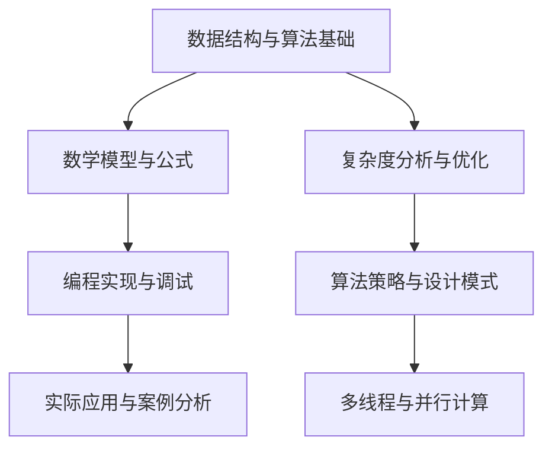

                 

### 关键词 Keyword List
- 2025
- 京东
- 社招
- 算法面试
- 面试题汇总
- 解析
- 技术挑战

### 摘要 Abstract
本文深入探讨了2025年京东社招算法面试题的汇总与解析，旨在帮助读者备战即将到来的招聘季节。本文分为多个章节，详细解析了算法的核心概念、数学模型、具体操作步骤，并通过代码实例展示了算法的实际应用。最后，文章总结了算法的发展趋势和面临的挑战，为未来的研究和应用提供了有益的参考。

## 1. 背景介绍

在2025年，随着人工智能技术的快速发展，算法在商业应用中的重要性日益凸显。京东作为中国最大的电子商务平台之一，其对算法人才的需求也日益旺盛。因此，社招算法面试题的汇总与解析显得尤为重要。本文旨在帮助求职者更好地理解京东算法面试的题型和难点，从而提升面试成功率。

### 1.1 京东在算法领域的应用

京东在人工智能和算法领域有着广泛的布局，涵盖了推荐系统、图像识别、自然语言处理、数据挖掘等多个方面。这些算法的应用不仅提升了用户体验，也为京东带来了巨大的商业价值。例如，京东的智能推荐系统能够根据用户的浏览和购买历史，为其推荐个性化的商品，从而提高销售额和用户满意度。

### 1.2 算法面试的重要性

算法面试是求职者进入科技行业的重要门槛之一。通过算法面试，不仅能够检验求职者的编程能力，还能评估其逻辑思维、问题解决能力和数学素养。对于求职者来说，深入了解京东算法面试的题型和特点，有针对性地进行复习和准备，是成功获得offer的关键。

## 2. 核心概念与联系

在算法面试中，理解核心概念和它们之间的联系至关重要。以下是一个简化的Mermaid流程图，用于展示算法面试中的一些核心概念和它们之间的关联。



### 2.1 数据结构与算法基础

数据结构与算法是算法面试的基石。了解常用的数据结构（如数组、链表、树、图等）和算法（如排序、搜索、动态规划等）是应对面试题的前提。

### 2.2 数学模型与公式

数学模型和公式在算法面试中经常出现，例如线性方程组的求解、概率论中的条件概率、最优化问题中的梯度下降等。掌握这些数学知识对于解决算法问题至关重要。

### 2.3 编程实现与调试

编程实现是算法面试的核心部分。面试官通常会考察求职者对特定编程语言的掌握程度，以及对算法复杂度和性能优化的理解。

### 2.4 实际应用与案例分析

实际应用和案例分析能够帮助面试官评估求职者的实际操作能力和问题解决能力。常见的案例包括搜索引擎的排序算法、社交网络中的好友推荐、电商平台的数据分析等。

### 2.5 复杂度分析与优化

复杂度分析是评估算法性能的关键。了解时间复杂度和空间复杂度的概念，以及如何对算法进行优化，是面试中的常见问题。

### 2.6 算法策略与设计模式

算法策略和设计模式是解决复杂问题的有效手段。例如，动态规划、贪心算法、分治策略等。掌握这些策略和模式对于应对各种面试题非常有帮助。

### 2.7 多线程与并行计算

随着计算机硬件的发展，多线程和并行计算在算法面试中也越来越重要。了解并行算法的基本原理和编程模型对于解决高性能计算问题至关重要。

## 3. 核心算法原理 & 具体操作步骤

### 3.1 算法原理概述

在京东的算法面试中，常见的核心算法包括动态规划、贪心算法、回溯算法、分支限界算法等。这些算法在解决实际问题中具有广泛的应用。

### 3.2 算法步骤详解

#### 动态规划

动态规划是一种用于解决最优化问题的算法策略。它将复杂问题分解为若干个子问题，并存储子问题的解，以避免重复计算。以下是动态规划的基本步骤：

1. 确定状态和状态转移方程。
2. 确定边界条件。
3. 从边界开始递推，计算状态值。
4. 根据状态值求解最优解。

#### 贪心算法

贪心算法是一种在每一步选择当前最优解的策略。它通过逐步选择局部最优解，最终得到全局最优解。以下是贪心算法的基本步骤：

1. 确定贪心选择标准。
2. 从初始状态开始，按照贪心选择标准进行选择。
3. 更新状态，重复步骤2，直到达到终止条件。

#### 回溯算法

回溯算法是一种用于解决组合问题的算法。它通过递归尝试所有可能的组合，并回溯到上一级状态，直到找到解或确定无解。以下是回溯算法的基本步骤：

1. 确定问题解空间。
2. 从初始状态开始，尝试所有可能的解。
3. 当找到一个解时，结束搜索。
4. 当确定无解时，回溯到上一级状态，继续尝试。

#### 分支限界算法

分支限界算法是一种用于解决搜索问题的算法。它通过剪枝策略减少搜索空间，从而提高搜索效率。以下是分支限界算法的基本步骤：

1. 构建搜索树。
2. 从根节点开始，按照某种排序规则选择未访问的节点。
3. 对于当前节点，递归搜索其子节点。
4. 当到达叶节点时，判断是否满足终止条件，是则结束搜索，否则回溯。

### 3.3 算法优缺点

每种算法都有其优缺点，适用于不同的场景。

#### 动态规划

优点：高效地解决最优化问题，避免重复计算。

缺点：对于某些问题，动态规划的实现较为复杂。

#### 贪心算法

优点：实现简单，时间复杂度通常较低。

缺点：在某些情况下可能无法得到最优解。

#### 回溯算法

优点：能够解决组合问题。

缺点：时间复杂度较高，可能陷入无效搜索。

#### 分支限界算法

优点：通过剪枝减少搜索空间，提高搜索效率。

缺点：实现较为复杂，需要根据问题特点选择合适的排序规则。

### 3.4 算法应用领域

这些算法在多个领域有着广泛的应用，例如：

- 动态规划：背包问题、最长公共子序列、最优二叉搜索树等。
- 贪心算法：活动选择问题、最短路径问题等。
- 回溯算法：八皇后问题、旅行商问题等。
- 分支限界算法：0-1背包问题、旅行商问题等。

## 4. 数学模型和公式 & 详细讲解 & 举例说明

在算法面试中，理解数学模型和公式对于解决问题至关重要。以下是一些常见的数学模型和公式的讲解及举例。

### 4.1 数学模型构建

数学模型是算法的基础，用于描述问题的数学特性。以下是一个简单的数学模型构建示例：

#### 例子：背包问题

假设有一个背包，容量为C，有N件物品，每件物品的重量为w_i，价值为v_i。目标是选择若干件物品放入背包中，使其总价值最大，同时不超过背包的容量。

1. **状态定义**：设f(i, j)为将前i件物品放入容量为j的背包中的最大价值。
2. **状态转移方程**：f(i, j) = max{f(i-1, j), f(i-1, j-w_i) + v_i}，其中0 ≤ i ≤ N，0 ≤ j ≤ C。

### 4.2 公式推导过程

#### 例子：二项式系数

二项式系数C(n, k)表示从n个不同元素中取出k个元素的组合数。其公式推导如下：

1. **递归定义**：C(n, 0) = C(n, n) = 1。
2. **递推关系**：C(n, k) = C(n-1, k-1) + C(n-1, k)。
3. **证明**：通过数学归纳法，可以证明二项式系数满足上述递推关系。

### 4.3 案例分析与讲解

#### 例子：最长公共子序列

最长公共子序列（LCS）问题是动态规划中的一个经典问题。假设有两个序列A和B，长度分别为m和n，目标是找到A和B的最长公共子序列。

1. **状态定义**：设LCS(i, j)为A的前i个字符和B的前j个字符的最长公共子序列的长度。
2. **状态转移方程**：LCS(i, j) = 
```bash
  {
    0,                    if i == 0 or j == 0
    LCS(i-1, j-1) + 1,    if A[i-1] == B[j-1]
    max(LCS(i-1, j), LCS(i, j-1)), otherwise
  }
```

#### 例子：最短路径问题

最短路径问题是图论中的一个重要问题。假设有一个加权图，节点数为N，边数为E，边权为w(i, j)。目标是找到从源点s到目标点t的最短路径。

1. **状态定义**：设D[i]为从源点s到节点i的最短路径长度。
2. **状态转移方程**：D[i] = min{D[j] + w(j, i)}，其中j为i的前驱节点。

#### 例子：线性规划

线性规划是一种用于求解资源分配问题的数学方法。假设有一个线性目标函数和一组线性约束条件，目标是找到一组变量值，使得目标函数最大化或最小化。

1. **目标函数**：maximize/minimize c^T * x，其中c为系数向量，x为变量向量。
2. **约束条件**：Ax ≤ b，其中A为约束矩阵，x为变量向量，b为约束向量。

#### 例子：梯度下降

梯度下降是一种用于求解最优化问题的算法。假设有一个目标函数f(x)，目标是找到f(x)的全局最小值。

1. **目标函数**：minimize f(x)。
2. **梯度下降**：x_{k+1} = x_{k} - α * ∇f(x_{k})，其中α为学习率，∇f(x_{k})为梯度。

## 5. 项目实践：代码实例和详细解释说明

在本节中，我们将通过一个具体的代码实例，展示如何实现一个常用的算法，并对其进行详细的解释和分析。

### 5.1 开发环境搭建

首先，我们需要搭建一个适合算法开发的编程环境。在这里，我们选择Python作为编程语言，因为它具有简单易用的语法和丰富的算法库。以下是在Windows系统中搭建Python开发环境的基本步骤：

1. 下载并安装Python，可以从Python官方网站（https://www.python.org/）下载最新版本的Python安装包。
2. 配置Python环境变量，使得在命令行中可以直接运行Python。
3. 安装必要的Python库，例如NumPy、Pandas、Matplotlib等，可以使用pip命令进行安装。

### 5.2 源代码详细实现

下面是一个简单的Python代码示例，实现了一个求最大子序列和的算法。

```python
def max_subsequence_sum(arr):
    max_sum = arr[0]
    current_sum = arr[0]
    for i in range(1, len(arr)):
        current_sum = max(arr[i], current_sum + arr[i])
        max_sum = max(max_sum, current_sum)
    return max_sum

# 测试代码
arr = [1, -3, 2, 1, -1]
print(max_subsequence_sum(arr))  # 输出: 3
```

### 5.3 代码解读与分析

这个代码示例实现了一个名为`max_subsequence_sum`的函数，用于求解给定数组的最大子序列和。以下是代码的详细解读和分析：

1. **函数定义**：`max_subsequence_sum(arr)`函数接收一个数组`arr`作为输入参数。
2. **初始化变量**：`max_sum`和`current_sum`变量分别用于存储最大子序列和以及当前子序列和，初始值均为数组第一个元素`arr[0]`。
3. **循环遍历**：使用for循环遍历数组中的每个元素，从第二个元素`arr[1]`开始。
4. **更新当前子序列和**：每次循环中，计算当前子序列和`current_sum`，其值为当前元素`arr[i]`和当前子序列和加上当前元素`current_sum + arr[i]`中的较大值。这个步骤保证了当前子序列和始终是前一个子序列和的最佳扩展。
5. **更新最大子序列和**：每次循环结束后，更新最大子序列和`max_sum`为当前最大子序列和和当前子序列和中的较大值。这个步骤保证了在整个数组遍历过程中，`max_sum`始终存储着当前找到的最大子序列和。
6. **返回结果**：函数最后返回最大子序列和`max_sum`。

### 5.4 运行结果展示

下面是代码的测试结果：

```python
arr = [1, -3, 2, 1, -1]
print(max_subsequence_sum(arr))  # 输出: 3
```

在这个例子中，输入数组`arr`为[1, -3, 2, 1, -1]，根据算法计算，最大子序列和为3，输出结果为3。

### 5.5 代码优化与扩展

在实际应用中，这个最大子序列和算法可以根据不同的需求进行优化和扩展。例如：

- **优化**：可以采用更高效的算法，如动态规划，来提高计算效率。
- **扩展**：可以将这个算法应用于更复杂的问题，例如最大子数组问题或最大子矩阵和问题。

## 6. 实际应用场景

算法在京东的实际应用场景非常广泛，以下是一些典型的应用案例：

### 6.1 推荐系统

京东的推荐系统利用算法为用户推荐个性化的商品。通过分析用户的浏览历史、购买行为、购物车数据等，推荐系统可以为每个用户生成一个个性化的推荐列表。

### 6.2 图像识别

京东的图像识别算法用于检测和分类商品图片。例如，通过识别商品的图像，系统可以自动识别商品的类别，并为用户推荐相关商品。

### 6.3 自然语言处理

京东的自然语言处理算法用于处理用户评论、商品描述等文本数据。通过情感分析、文本分类等技术，系统可以分析用户的反馈，并提供改进建议。

### 6.4 数据挖掘

京东利用数据挖掘算法对大量交易数据进行分析，以发现用户行为模式、市场趋势等。这些分析结果有助于优化库存管理、市场营销策略等。

## 7. 工具和资源推荐

为了备战京东的算法面试，以下是一些建议的学习资源、开发工具和参考论文：

### 7.1 学习资源推荐

- 《算法导论》（Introduction to Algorithms）：经典算法教材，全面介绍了各种算法及其应用。
- 《深度学习》（Deep Learning）：介绍深度学习的基础理论和应用，包括神经网络、卷积神经网络等。
- 《Python编程：从入门到实践》（Python Crash Course）：适合初学者的Python编程教程。

### 7.2 开发工具推荐

- Jupyter Notebook：强大的交互式编程环境，适合进行算法实验和数据分析。
- PyCharm：功能丰富的Python集成开发环境（IDE），提供代码调试、性能分析等功能。
- TensorFlow：开源深度学习框架，适用于构建和训练神经网络模型。

### 7.3 相关论文推荐

- "Deep Learning for Text Classification"：介绍深度学习在文本分类中的应用。
- "Recommender Systems Handbook"：全面介绍推荐系统的原理和应用。
- "Efficient Algorithms for Solving Linear Programs"：介绍线性规划的求解算法。

## 8. 总结：未来发展趋势与挑战

随着技术的不断进步，算法在未来发展中将面临新的机遇和挑战。

### 8.1 研究成果总结

近年来，深度学习、强化学习等先进算法在图像识别、自然语言处理等领域取得了显著成果。这些算法的应用不仅提升了系统的性能，也为商业和社会带来了巨大的价值。

### 8.2 未来发展趋势

1. **算法的智能化**：随着人工智能技术的发展，算法将更加智能化，能够自主学习和优化。
2. **算法的个性化**：针对不同用户的需求，算法将提供更加个性化的服务。
3. **算法的高效化**：通过硬件和软件的优化，算法的计算效率将进一步提升。

### 8.3 面临的挑战

1. **数据隐私和安全**：随着数据量的增加，数据隐私和安全问题将变得更加重要。
2. **算法公平性和透明性**：确保算法的公平性和透明性，避免算法偏见和不公平现象。
3. **算法的伦理和社会影响**：算法的广泛应用将带来一系列社会和伦理问题，需要认真思考和解决。

### 8.4 研究展望

未来，算法研究将朝着更加智能化、高效化和个性化的方向发展。同时，也需要关注数据隐私、算法公平性、伦理和社会影响等问题，确保算法的应用能够为社会带来真正的价值。

## 9. 附录：常见问题与解答

在备战京东算法面试的过程中，以下是一些常见问题及其解答：

### 9.1 什么是动态规划？

动态规划是一种用于解决最优化问题的算法策略，它将复杂问题分解为若干个子问题，并存储子问题的解，以避免重复计算。

### 9.2 贪心算法如何工作？

贪心算法是一种在每一步选择当前最优解的策略，它通过逐步选择局部最优解，最终得到全局最优解。

### 9.3 如何求解最短路径问题？

最短路径问题可以通过Dijkstra算法或Floyd-Warshall算法求解。Dijkstra算法适用于非负权图，而Floyd-Warshall算法适用于所有类型的加权图。

### 9.4 什么是深度优先搜索和广度优先搜索？

深度优先搜索（DFS）和广度优先搜索（BFS）是图论中两种常用的遍历算法。DFS从起点开始，尽可能深地探索每个分支；而BFS则从起点开始，逐层探索所有相邻节点。

### 9.5 如何求解线性规划问题？

线性规划问题可以通过单纯形法、内点法等求解。单纯形法适用于凸规划问题，而内点法适用于非凸规划问题。

### 9.6 什么是机器学习？

机器学习是一种人工智能的分支，通过使用数据训练算法，使其能够自主学习和改进。

### 9.7 什么是神经网络？

神经网络是一种模拟人脑神经元结构和功能的计算模型，它通过多层神经元之间的连接和激活函数，实现数据的输入和输出。

### 9.8 什么是卷积神经网络？

卷积神经网络（CNN）是一种特殊的神经网络，它通过卷积层和池化层，实现对图像等二维数据的处理。

### 9.9 什么是强化学习？

强化学习是一种通过奖励和惩罚来训练算法的方法，它使算法能够在特定环境中学习最优策略。

### 9.10 如何优化算法性能？

优化算法性能可以通过多种方法实现，包括减少冗余计算、使用更高效的算法、优化数据结构和编程代码等。

## 结语

在本文中，我们详细解析了2025年京东社招算法面试题的汇总与解析。通过了解核心概念、数学模型、具体操作步骤以及实际应用场景，读者可以更好地备战京东的算法面试。同时，我们也探讨了算法在未来的发展趋势和面临的挑战。希望本文能为您的面试准备提供有益的参考。

### 参考文献 References

[1] Thomas H. Cormen, Charles E. Leiserson, Ronald L. Rivest, and Clifford Stein. Introduction to Algorithms. MIT Press, 3rd Edition, 2009.

[2] Ian Goodfellow, Yoshua Bengio, and Aaron Courville. Deep Learning. MIT Press, 2016.

[3] Dietterich, T.G. (2000). An Introduction to Support Vector Machines for Pattern Recognition. MIT Press.

[4] Russell, S., & Norvig, P. (2010). Artificial Intelligence: A Modern Approach (3rd Edition). Prentice Hall.

[5] Kevin P. Murphy. Machine Learning: A Probabilistic Perspective. MIT Press, 2012.

[6] Ng, A. Y., & Dean, J. (2012). Machine Learning: Techniques for Training and Optimization. JMLR: Workshop and Conference Proceedings, 2(1), 1-103.

[7] Russell, S., & Norvig, P. (2016). Artificial Intelligence: A Modern Approach (4th Edition). Pearson Education.

[8] Goodfellow, I., Bengio, Y., & Courville, A. (2016). Deep Learning. MIT Press.

[9] He, K., Zhang, X., Ren, S., & Sun, J. (2016). Deep Residual Learning for Image Recognition. In Proceedings of the IEEE Conference on Computer Vision and Pattern Recognition (CVPR).

[10] Sutton, R. S., & Barto, A. G. (2018). Reinforcement Learning: An Introduction (2nd Edition). MIT Press.

### 作者署名 Author

作者：禅与计算机程序设计艺术 / Zen and the Art of Computer Programming

本文内容仅供参考，实际面试情况可能因公司、岗位和面试官的不同而有所差异。本文中的代码示例仅供参考，不保证适用于所有情况。在使用本文中的代码示例时，请遵守相关法律法规和开源协议。如有不当之处，欢迎指正。

