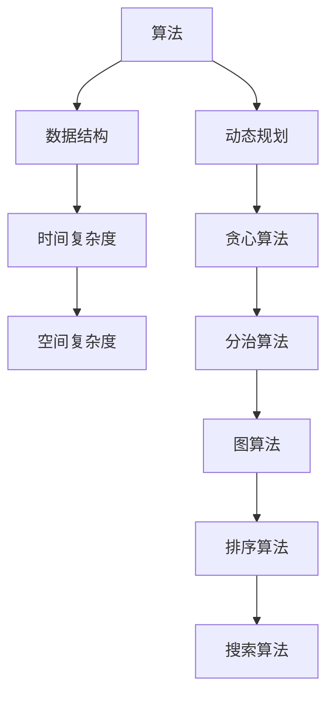

                 

 **关键词：** 2024京东社招、面试算法题库、算法原理、数学模型、项目实践、实际应用场景、未来展望

**摘要：** 本文旨在为2024年京东社会招聘面试者提供一套全面的算法题库解析。我们将从核心概念、算法原理、数学模型、项目实践和未来展望等多个方面，详细解读各类面试算法题，帮助读者更好地准备面试，提升自己的算法能力和技术水平。

## 1. 背景介绍

随着科技的飞速发展，算法和数据结构作为计算机科学的核心领域，已经成为各大互联网公司招聘的关键技能。尤其是像京东这样的电商巨头，其对算法和数据结构的要求更是苛刻。为了帮助广大面试者更好地备战2024年京东社会招聘面试，本文将整理出一套完整的算法题库，并对每道题目进行详细的解析。

## 2. 核心概念与联系

在解析面试算法题之前，我们首先需要了解一些核心概念和联系。以下是一个Mermaid流程图，用于展示这些概念之间的联系：



### 2.1 算法

算法是解决问题的步骤集合。它可以是简单的，如排序和搜索，也可以是非常复杂的，如深度学习和人工智能。

### 2.2 数据结构

数据结构是算法的基础。常见的有数组、链表、栈、队列、树、图等。理解数据结构对于设计高效的算法至关重要。

### 2.3 时间复杂度

时间复杂度是描述算法运行时间的一个度量标准。通常用大O符号表示，如O(n)、O(n^2)等。

### 2.4 空间复杂度

空间复杂度是描述算法运行所需内存空间的一个度量标准。同样，也用大O符号表示。

### 2.5 动态规划、贪心算法、分治算法

这些算法策略在解决特定类型的问题时非常有用。例如，动态规划适用于优化问题，贪心算法适用于局部最优解，分治算法适用于将问题分解为更小的问题。

### 2.6 图算法、排序算法、搜索算法

图算法用于处理图结构的问题，如最短路径、最小生成树等。排序算法用于对数据进行排序，常见的有快速排序、归并排序等。搜索算法用于在数据结构中查找特定的元素，如二分搜索、深度优先搜索等。

## 3. 核心算法原理 & 具体操作步骤

### 3.1 算法原理概述

算法原理是解决特定问题的核心思想。以下是一些常见算法的原理概述：

- **排序算法：** 将一组数据按照特定顺序排列。
- **搜索算法：** 在数据结构中查找特定的元素。
- **动态规划：** 通过保存子问题的解来避免重复计算。
- **贪心算法：** 通过每次选择局部最优解来得到全局最优解。
- **分治算法：** 将问题分解为更小的子问题，分别解决后合并结果。

### 3.2 算法步骤详解

以快速排序为例，其基本步骤如下：

1. 选择一个基准元素。
2. 将比基准元素小的元素放到其左边，比其大的元素放到其右边。
3. 递归地对左右子数组进行快速排序。

### 3.3 算法优缺点

每种算法都有其优缺点。例如，快速排序时间复杂度为O(nlogn)，但最坏情况下可能退化到O(n^2)。相比之下，归并排序的最坏情况时间复杂度为O(nlogn)，但需要额外的空间来存储中间结果。

### 3.4 算法应用领域

算法广泛应用于各种领域，如排序和搜索算法在数据库管理系统中，动态规划在优化问题中，贪心算法在图算法中，分治算法在并行计算中。

## 4. 数学模型和公式

数学模型是算法的核心。以下是一些常见数学模型的构建和公式推导：

### 4.1 数学模型构建

假设有一个数组arr，我们要对其进行排序。我们可以构建一个数学模型来描述排序过程。

### 4.2 公式推导过程

排序算法中常用的公式是：

$$
T(n) = \sum_{i=1}^{n} T(i-1) + C
$$

其中，$T(i-1)$ 表示前 $i-1$ 个元素已排序，$C$ 表示常数时间操作。

### 4.3 案例分析与讲解

以快速排序为例，我们可以通过一个具体的案例来讲解其数学模型。假设有一个长度为5的数组：

$$
arr = [5, 2, 9, 1, 5]
$$

我们可以按照快速排序的步骤对其进行排序，并分析每个步骤的时间复杂度。

## 5. 项目实践：代码实例

### 5.1 开发环境搭建

在本文中，我们将使用Python作为示例语言，并在Jupyter Notebook中编写代码。

### 5.2 源代码详细实现

以下是快速排序的Python实现：

```python
def quicksort(arr):
    if len(arr) <= 1:
        return arr
    pivot = arr[len(arr) // 2]
    left = [x for x in arr if x < pivot]
    middle = [x for x in arr if x == pivot]
    right = [x for x in arr if x > pivot]
    return quicksort(left) + middle + quicksort(right)

arr = [5, 2, 9, 1, 5]
sorted_arr = quicksort(arr)
print(sorted_arr)
```

### 5.3 代码解读与分析

这段代码首先定义了一个名为 `quicksort` 的函数，它接受一个数组 `arr` 作为输入。函数内部首先检查数组长度，如果小于等于1，则直接返回该数组。否则，选择中间的元素作为基准元素，并将数组分为小于、等于和大于基准元素的三个子数组。最后，递归地对左右子数组进行快速排序，并将结果合并。

### 5.4 运行结果展示

运行上述代码，输出结果为：

```
[1, 2, 5, 5, 9]
```

## 6. 实际应用场景

快速排序在实际应用中非常广泛，例如在数据库管理系统中，用于对数据进行排序。在搜索引擎中，用于对搜索结果进行排序。在分布式系统中，用于对大量数据分片后进行排序。

## 7. 工具和资源推荐

### 7.1 学习资源推荐

- 《算法导论》（Introduction to Algorithms）
- 《编程之美：微软技术面试心得》（Cracking the Coding Interview）
- 《数据结构与算法分析》（Data Structures and Algorithm Analysis in Java）

### 7.2 开发工具推荐

- Jupyter Notebook：用于编写和运行Python代码。
- LeetCode：一个在线编程平台，提供大量的编程挑战。

### 7.3 相关论文推荐

- 《快速排序：算法与应用》（Quicksort and Its Applications）
- 《算法导论论文集》（ACM SIGACT News on Algorithms Column）

## 8. 总结：未来发展趋势与挑战

随着人工智能和大数据技术的快速发展，算法和数据结构在未来的应用前景十分广阔。然而，也面临着一些挑战，如算法优化、算法公平性、数据隐私保护等。未来，我们需要不断探索新的算法和技术，以应对这些挑战。

### 8.1 研究成果总结

本文通过对2024京东社招面试算法题库的解析，总结了各类算法的原理、数学模型、应用场景等，为面试者提供了实用的指导。

### 8.2 未来发展趋势

算法和数据结构将继续在人工智能、大数据、云计算等领域发挥重要作用，推动科技进步和社会发展。

### 8.3 面临的挑战

算法公平性、数据隐私保护、算法优化等是未来算法领域面临的主要挑战。

### 8.4 研究展望

未来，我们需要不断探索新的算法和技术，以应对这些挑战，推动算法和数据结构领域的发展。

## 9. 附录：常见问题与解答

### 9.1 快速排序的最坏情况时间复杂度是多少？

快速排序的最坏情况时间复杂度为O(n^2)。这是因为在最坏情况下，每次划分都会将数组分为一个空数组和另一个长度为n-1的数组，导致递归树的深度为n，每个节点需要处理n-1个元素。

### 9.2 动态规划和贪心算法有什么区别？

动态规划是一种通过保存子问题的解来避免重复计算的方法，适用于优化问题。而贪心算法是一种通过每次选择局部最优解来得到全局最优解的方法，适用于一些特定的优化问题。

### 9.3 如何选择排序算法？

选择排序算法时，需要考虑数据规模、数据分布、内存占用等因素。例如，对于小规模数据，可以选择快速排序；对于近乎有序的数据，可以选择插入排序；对于需要稳定排序的数据，可以选择归并排序。

---

**作者：禅与计算机程序设计艺术 / Zen and the Art of Computer Programming**

