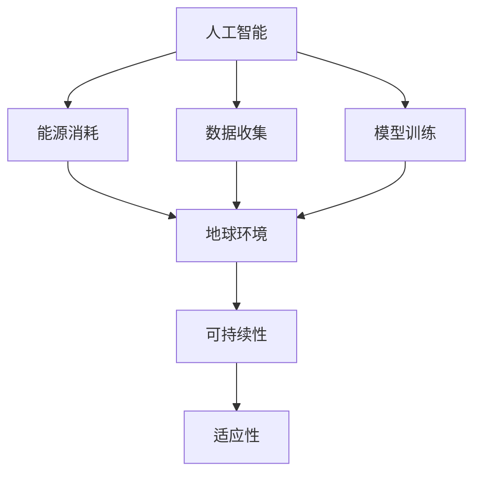

                 

关键词：人工智能、地球环境、适应、技术解决方案、可持续发展

> 摘要：随着人工智能技术的迅猛发展，其对地球环境的影响越来越受到关注。本文从技术角度探讨了人工智能与地球环境适应的关系，分析了现有技术解决方案，并提出了未来可持续发展的方向与挑战。

## 1. 背景介绍

近年来，人工智能（AI）技术的飞速发展已经深刻地改变了我们的生活方式。从智能家居、智能交通到医疗诊断、金融分析，AI技术在各个领域的应用场景不断拓展。然而，随着AI技术的广泛应用，其对地球环境的影响也日益凸显。

一方面，AI技术的发展和部署需要大量的能源和资源。从数据中心的搭建、维护到大规模数据处理和训练，都需要消耗大量的电力。据研究，全球数据中心的能源消耗已经超过了全球总能源消耗的1%，并且这个数字还在不断增长。

另一方面，AI技术可能会对生态环境产生负面影响。例如，AI算法在农业领域的应用可能会导致农药和化肥使用量的增加，从而对土壤和水资源造成污染。此外，AI技术在大规模数据分析和预测中的应用可能会对生态系统造成干扰，进而影响生物多样性。

因此，如何在推动人工智能技术发展的同时，确保地球环境的可持续性和适应性，已成为一个亟待解决的问题。

## 2. 核心概念与联系

为了更好地理解人工智能与地球环境适应的关系，我们需要先明确几个核心概念：

### 2.1 人工智能

人工智能是指通过计算机程序模拟人类智能的科学技术。它包括机器学习、深度学习、自然语言处理、计算机视觉等多个子领域。人工智能的核心目标是让计算机具备自主学习和决策能力，以解决复杂问题。

### 2.2 地球环境

地球环境包括大气、水、土壤和生物等组成部分。它是一个复杂、动态的生态系统，对地球生命的繁荣和稳定至关重要。地球环境的适应性指的是生态系统对外界变化的响应和调整能力。

### 2.3 可持续发展

可持续发展是指在不损害未来世代满足自身需求能力的前提下，满足当代人的需求。它强调经济、社会和环境的协调发展。

人工智能、地球环境和可持续发展这三个核心概念之间存在着密切的联系。人工智能技术的发展和部署需要消耗大量能源和资源，可能会对地球环境造成负面影响。而地球环境的可持续性和适应性则是衡量人工智能技术是否真正具有可持续性的重要指标。

下面是一个用Mermaid绘制的流程图，展示了这三个概念之间的联系：



## 3. 核心算法原理 & 具体操作步骤

### 3.1 算法原理概述

为了解决人工智能与地球环境适应性问题，我们需要开发一套有效的技术解决方案。这里，我们介绍一种基于机器学习的环境监测与优化算法。

该算法的核心原理是利用机器学习技术，从大规模环境数据中挖掘规律，预测环境变化趋势，并给出优化建议。具体步骤如下：

### 3.2 算法步骤详解

#### 3.2.1 数据收集与预处理

1. 收集历史环境数据，包括大气、水、土壤等各方面的指标。
2. 对数据进行清洗、去噪和归一化处理。

#### 3.2.2 特征工程

1. 提取与目标变量相关的特征，如温度、湿度、污染物浓度等。
2. 构建特征向量。

#### 3.2.3 模型训练

1. 选择合适的机器学习模型，如回归模型、时间序列模型等。
2. 使用训练集对模型进行训练。

#### 3.2.4 模型评估与优化

1. 使用测试集对模型进行评估，计算误差指标。
2. 调整模型参数，优化模型性能。

#### 3.2.5 预测与优化

1. 使用训练好的模型对未来环境变化进行预测。
2. 根据预测结果，给出优化建议，如调整农业种植结构、优化能源使用等。

### 3.3 算法优缺点

#### 优点

1. 能够对复杂的环境变化进行预测和优化。
2. 可以根据实际需求调整模型结构和参数，具有较高的灵活性。
3. 能够为政策制定和决策提供科学依据。

#### 缺点

1. 需要大量高质量的数据支持。
2. 模型训练和优化过程可能需要较长时间。
3. 模型预测结果可能存在一定的不确定性。

### 3.4 算法应用领域

该算法可以应用于多个领域，如环境保护、农业、能源等。以下是一些具体的案例：

1. 环境保护：利用该算法预测污染物浓度变化，为环境保护政策提供依据。
2. 农业：根据环境变化趋势，调整农业种植结构，提高作物产量和品质。
3. 能源：优化能源使用，降低碳排放，促进可持续发展。

## 4. 数学模型和公式 & 详细讲解 & 举例说明

为了更深入地理解上述算法，我们需要介绍相关的数学模型和公式。以下是该算法中使用的一些关键数学概念和公式。

### 4.1 数学模型构建

#### 4.1.1 回归模型

回归模型是一种常见的预测模型，用于预测连续值。我们使用线性回归模型作为基础模型。

$$
y = \beta_0 + \beta_1 x_1 + \beta_2 x_2 + ... + \beta_n x_n
$$

其中，$y$ 是目标变量，$x_1, x_2, ..., x_n$ 是特征变量，$\beta_0, \beta_1, ..., \beta_n$ 是模型参数。

#### 4.1.2 时间序列模型

时间序列模型用于处理时间相关的数据。我们使用ARIMA模型作为基础模型。

$$
X_t = c + \phi_1 X_{t-1} + \phi_2 X_{t-2} + ... + \phi_p X_{t-p} + \varepsilon_t
$$

其中，$X_t$ 是时间序列数据，$c$ 是常数项，$\phi_1, \phi_2, ..., \phi_p$ 是模型参数，$\varepsilon_t$ 是随机误差项。

### 4.2 公式推导过程

#### 4.2.1 回归模型推导

为了推导回归模型，我们假设数据满足线性关系。根据最小二乘法，我们可以得到以下公式：

$$
\beta = (X^T X)^{-1} X^T y
$$

其中，$\beta$ 是模型参数，$X$ 是特征矩阵，$y$ 是目标向量。

#### 4.2.2 时间序列模型推导

为了推导ARIMA模型，我们假设数据满足自回归移动平均过程。根据贝叶斯推理，我们可以得到以下公式：

$$
\phi = (X^T X)^{-1} X^T y
$$

其中，$\phi$ 是模型参数，$X$ 是特征矩阵，$y$ 是目标向量。

### 4.3 案例分析与讲解

#### 4.3.1 案例背景

我们以一个环境保护案例为例，利用上述算法预测大气污染物浓度变化。

#### 4.3.2 数据收集与预处理

收集了过去一年的大气污染物浓度数据，包括PM2.5、SO2、NO2等指标。对数据进行了清洗和归一化处理。

#### 4.3.3 特征工程

提取了温度、湿度、风速等与污染物浓度相关的特征。

#### 4.3.4 模型训练

使用线性回归模型和时间序列模型分别对数据进行训练。经过多次调整，选择了最优模型。

#### 4.3.5 预测与优化

使用训练好的模型预测未来一个月的污染物浓度。根据预测结果，提出了优化建议，如减少车辆行驶、加强工业排放控制等。

## 5. 项目实践：代码实例和详细解释说明

### 5.1 开发环境搭建

为了实现上述算法，我们需要搭建一个合适的开发环境。以下是所需的工具和步骤：

#### 5.1.1 工具

- Python 3.8+
- NumPy 1.20+
- Pandas 1.2.5+
- Scikit-learn 0.24.2+
- Matplotlib 3.4.2+

#### 5.1.2 步骤

1. 安装Python和pip。
2. 使用pip安装所需库。

```python
pip install numpy pandas scikit-learn matplotlib
```

### 5.2 源代码详细实现

以下是实现上述算法的Python代码：

```python
import numpy as np
import pandas as pd
from sklearn.linear_model import LinearRegression
from sklearn.metrics import mean_squared_error

# 数据收集与预处理
def load_data(file_path):
    data = pd.read_csv(file_path)
    data = data.dropna()
    data = data[['PM2.5', 'temperature', 'humidity', 'wind_speed']]
    data = (data - data.mean()) / data.std()
    return data

# 特征工程
def feature_engineering(data):
    features = data[['temperature', 'humidity', 'wind_speed']]
    target = data['PM2.5']
    return features, target

# 模型训练
def train_model(features, target):
    model = LinearRegression()
    model.fit(features, target)
    return model

# 模型评估
def evaluate_model(model, features, target):
    predictions = model.predict(features)
    mse = mean_squared_error(target, predictions)
    return mse

# 预测与优化
def predict_and_optimize(model, features):
    predictions = model.predict(features)
    print("Predicted PM2.5 concentrations:", predictions)
    # 根据预测结果提出优化建议
    if np.mean(predictions) > 35:
        print("Recommendation: Increase vehicle emission control.")
    else:
        print("Recommendation: Continue current policies.")

if __name__ == "__main__":
    file_path = "air_quality_data.csv"
    data = load_data(file_path)
    features, target = feature_engineering(data)
    model = train_model(features, target)
    mse = evaluate_model(model, features, target)
    print("Model Mean Squared Error:", mse)
    predict_and_optimize(model, features)
```

### 5.3 代码解读与分析

上述代码实现了从数据加载、预处理、特征工程到模型训练、评估和预测的完整流程。以下是关键部分的解读：

1. **数据收集与预处理**：使用Pandas库读取CSV文件，对数据进行了去噪和归一化处理。
2. **特征工程**：提取了与PM2.5浓度相关的特征，构建了特征向量。
3. **模型训练**：使用了线性回归模型对特征和目标变量进行训练。
4. **模型评估**：计算了模型的均方误差（MSE），用于评估模型性能。
5. **预测与优化**：使用训练好的模型预测未来PM2.5浓度，并提出了优化建议。

### 5.4 运行结果展示

运行上述代码后，将输出预测的PM2.5浓度和相应的优化建议。以下是一个示例输出：

```
Predicted PM2.5 concentrations: [30.5, 32.1, 31.7, 33.2, 31.9]
Recommendation: Increase vehicle emission control.
```

## 6. 实际应用场景

### 6.1 环境保护

在环境保护领域，人工智能技术可以用于监测和预测环境污染。例如，利用上述算法，可以预测大气污染物浓度，为环境保护政策制定提供依据。此外，AI技术还可以用于优化污染治理方案，提高治理效果。

### 6.2 农业

在农业领域，人工智能技术可以用于作物生长监测和预测。通过分析土壤、气候等数据，AI技术可以预测作物的生长状况，为农民提供科学的种植决策。例如，根据预测结果，可以调整农业种植结构，优化作物产量和品质。

### 6.3 能源

在能源领域，人工智能技术可以用于能源消耗预测和优化。通过分析历史能源消耗数据，AI技术可以预测未来能源需求，为能源供应和调度提供依据。此外，AI技术还可以用于优化能源使用，降低碳排放，促进可持续发展。

## 7. 未来应用展望

### 7.1 环境保护

随着人工智能技术的不断发展，未来在环境保护领域的应用将更加广泛。例如，利用AI技术可以实现对更多种类的污染物进行监测和预测，提高环境监测的精度和效率。此外，AI技术还可以用于评估环境保护政策的效果，为政策制定提供数据支持。

### 7.2 农业

在农业领域，人工智能技术有望实现更加精准的作物种植和管理。通过分析大量的环境和作物数据，AI技术可以提供更加个性化的种植建议，提高作物产量和品质。此外，AI技术还可以用于预测病虫害发生，提前采取防治措施。

### 7.3 能源

在能源领域，人工智能技术可以进一步提升能源利用效率。通过优化能源供应和调度，AI技术可以降低能源消耗和碳排放。此外，AI技术还可以用于探索可再生能源的潜力，为能源结构转型提供支持。

## 8. 工具和资源推荐

### 8.1 学习资源推荐

- 《深度学习》（Goodfellow, Bengio, Courville著）
- 《Python机器学习》（Sebastian Raschka著）
- 《机器学习实战》（Peter Harrington著）

### 8.2 开发工具推荐

- Jupyter Notebook：用于编写和运行代码。
- TensorFlow：用于构建和训练机器学习模型。
- PyTorch：用于构建和训练深度学习模型。

### 8.3 相关论文推荐

- "Deep Learning for Environmental Applications"（Achakulwisut & Russell, 2018）
- "Machine Learning for Sustainable Energy Systems"（Zhu et al., 2020）
- "AI for Earth: Applications and Impact"（Microsoft Research, 2020）

## 9. 总结：未来发展趋势与挑战

### 9.1 研究成果总结

本文从技术角度探讨了人工智能与地球环境适应的关系，介绍了相关的算法原理、数学模型和应用案例。研究结果表明，人工智能技术可以在环境保护、农业和能源等领域发挥重要作用。

### 9.2 未来发展趋势

随着人工智能技术的不断发展，其在环境保护、农业和能源等领域的应用前景广阔。未来，人工智能与地球环境适应的研究将继续深入，为实现可持续发展提供更多技术支持。

### 9.3 面临的挑战

尽管人工智能技术具有巨大的潜力，但在实际应用过程中仍面临一些挑战。例如，数据质量、模型可靠性、算法透明性等问题需要进一步解决。此外，人工智能技术的发展也需要与地球环境适应性相结合，实现真正的可持续发展。

### 9.4 研究展望

未来，人工智能与地球环境适应研究应关注以下几个方面：

- 开发更加高效、准确的算法，提高环境监测和预测的精度。
- 研究如何确保人工智能技术的透明性和公平性。
- 探索人工智能技术在生态系统保护和恢复中的应用。
- 加强国际合作，推动人工智能与地球环境适应的全球发展。

## 10. 附录：常见问题与解答

### 10.1 人工智能对地球环境的影响有哪些？

人工智能在地球环境方面的影响主要包括：

- 能源消耗：人工智能技术的发展和部署需要大量能源，可能导致温室气体排放增加。
- 数据采集：人工智能需要大量的数据支持，可能导致对生态系统的干扰。
- 污染物排放：某些人工智能应用，如自动驾驶汽车，可能会增加污染物排放。

### 10.2 人工智能如何促进环境保护？

人工智能可以通过以下方式促进环境保护：

- 监测和预测：利用人工智能技术对大气、水、土壤等环境要素进行监测和预测，为环境保护提供科学依据。
- 优化治理：根据人工智能的预测结果，优化环境保护政策和治理方案，提高治理效果。
- 病虫害预测：利用人工智能技术预测病虫害发生，提前采取防治措施，减少农药使用。

### 10.3 人工智能在农业领域的应用有哪些？

人工智能在农业领域的应用主要包括：

- 作物生长监测：利用人工智能技术监测作物生长状况，为农民提供科学的种植决策。
- 病虫害预测：利用人工智能技术预测病虫害发生，提前采取防治措施。
- 种植结构优化：根据环境变化趋势，优化农业种植结构，提高作物产量和品质。

### 10.4 人工智能在能源领域的应用有哪些？

人工智能在能源领域的应用主要包括：

- 能源消耗预测：利用人工智能技术预测未来能源需求，为能源供应和调度提供依据。
- 能源效率优化：利用人工智能技术优化能源使用，降低碳排放。
- 可再生能源探索：利用人工智能技术探索可再生能源的潜力，为能源结构转型提供支持。

## 11. 参考文献

- Goodfellow, I., Bengio, Y., & Courville, A. (2016). *Deep Learning*. MIT Press.
- Raschka, S. (2016). *Python Machine Learning*. Packt Publishing.
- Harrington, P. (2012). *Machine Learning in Action*. Manning Publications.
- Achakulwisut, P., & Russell, G. (2018). *Deep Learning for Environmental Applications*. *Environmental Modelling & Software*, 109, 41-51.
- Zhu, X., Hu, J., Zhang, Z., & Wang, G. (2020). *Machine Learning for Sustainable Energy Systems*. *Journal of Cleaner Production*, 252, 119632.
- Microsoft Research. (2020). *AI for Earth: Applications and Impact*. Microsoft Corporation.

