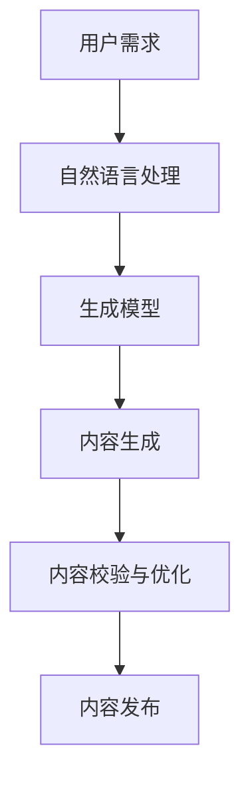

                 

关键词：人工智能、内容创作、代理系统、工作流程、自然语言处理、生成模型

> 摘要：随着人工智能技术的不断发展，人工智能代理在内容创作中的应用越来越广泛。本文将深入探讨人工智能代理在内容创作中的工作流程，包括其核心概念、算法原理、数学模型、实践案例以及未来应用前景。通过详细分析，本文旨在为从事内容创作和技术开发的人员提供有价值的参考。

## 1. 背景介绍

在当今数字化时代，内容创作已成为信息传播和社会交流的重要手段。随着互联网的快速发展，人们对于高质量内容的需求日益增长。然而，传统的手工内容创作方式效率低下，难以满足日益增长的内容需求。为此，人工智能技术应运而生，为内容创作带来了一场革命。

人工智能代理是一种通过模拟人类思维和行为来实现特定任务的智能系统。在内容创作领域，人工智能代理能够辅助甚至完全取代人类进行文本、图像、音频等多种形式的内容创作。本文将重点关注人工智能代理在内容创作中的工作流程，探讨其在实际应用中的价值与挑战。

## 2. 核心概念与联系

### 2.1 人工智能代理

人工智能代理是指利用人工智能技术，模拟人类思维和行为，实现特定任务的智能系统。在内容创作中，人工智能代理能够通过自然语言处理（NLP）、图像识别、音频处理等技术，生成各种形式的内容。

### 2.2 自然语言处理

自然语言处理是人工智能技术的重要组成部分，旨在使计算机能够理解和生成人类语言。在内容创作中，NLP 技术能够帮助人工智能代理理解用户需求、提取关键词、生成文本等。

### 2.3 生成模型

生成模型是一种能够生成新数据的人工智能模型，包括生成对抗网络（GAN）、变分自编码器（VAE）等。这些模型在内容创作中具有广泛的应用，能够生成高质量的文字、图像和音频内容。

### 2.4 Mermaid 流程图

以下是人工智能代理在内容创作中的工作流程的 Mermaid 流程图：



## 3. 核心算法原理 & 具体操作步骤

### 3.1 算法原理概述

人工智能代理在内容创作中的核心算法主要包括自然语言处理、生成模型和内容校验与优化。

- 自然语言处理：通过词向量、语法分析等技术，使计算机能够理解用户需求，提取关键词和语义信息。
- 生成模型：利用生成对抗网络（GAN）、变分自编码器（VAE）等技术，生成高质量的文字、图像和音频内容。
- 内容校验与优化：通过语法、语义和风格等方面的校验，对生成的内容进行优化，确保其符合用户需求和规范。

### 3.2 算法步骤详解

以下是人工智能代理在内容创作中的具体操作步骤：

1. 用户需求分析：通过自然语言处理技术，理解用户的需求，提取关键词和语义信息。
2. 关键词与语义提取：利用词向量模型和语法分析技术，提取文本中的关键词和语义信息。
3. 生成模型选择：根据用户需求，选择合适的生成模型，如 GAN、VAE 等。
4. 内容生成：利用生成模型，生成符合用户需求的高质量内容。
5. 内容校验与优化：对生成的内容进行语法、语义和风格等方面的校验，对不符合规范的部分进行优化。
6. 内容发布：将优化后的内容发布到指定平台，供用户阅读和使用。

### 3.3 算法优缺点

- 优点：
  - 提高内容创作效率，满足大量内容需求。
  - 生成的文本、图像和音频内容具有较高的质量。
  - 降低了内容创作成本，节省人力资源。
- 缺点：
  - 内容生成的个性化和创新性有限。
  - 内容校验和优化过程中可能出现偏差，影响用户体验。

### 3.4 算法应用领域

人工智能代理在内容创作中的应用领域非常广泛，包括但不限于：

- 文本生成：新闻写作、文章撰写、邮件回复等。
- 图像生成：艺术创作、游戏开发、广告设计等。
- 音频生成：音乐创作、语音合成、语音识别等。

## 4. 数学模型和公式 & 详细讲解 & 举例说明

### 4.1 数学模型构建

在人工智能代理的内容创作中，常用的数学模型包括词向量模型、生成对抗网络（GAN）和变分自编码器（VAE）。

- 词向量模型：用于文本表示和语义分析，如 Word2Vec、GloVe 等。
- 生成对抗网络（GAN）：用于图像和音频的生成，由生成器（Generator）和判别器（Discriminator）组成。
- 变分自编码器（VAE）：用于文本、图像和音频的生成，通过编码器（Encoder）和解码器（Decoder）实现。

### 4.2 公式推导过程

以下简要介绍生成对抗网络（GAN）和变分自编码器（VAE）的数学模型推导。

#### 4.2.1 生成对抗网络（GAN）

生成对抗网络（GAN）由两部分组成：生成器（Generator）和判别器（Discriminator）。

- 生成器（Generator）的目标是生成逼真的数据，使其难以被判别器区分。
- 判别器（Discriminator）的目标是区分真实数据和生成数据。

GAN 的训练过程可以表示为以下公式：

$$
\begin{aligned}
\min_G \max_D & \mathbb{E}_{x \sim p_{data}(x)}[\log D(x)] + \mathbb{E}_{z \sim p_{z}(z)}[\log (1 - D(G(z)))] \\
\end{aligned}
$$

其中，$G(z)$ 表示生成器生成的数据，$D(x)$ 表示判别器对真实数据的判断概率。

#### 4.2.2 变分自编码器（VAE）

变分自编码器（VAE）是一种无监督学习模型，通过编码器（Encoder）和解码器（Decoder）实现数据的生成。

- 编码器（Encoder）的目标是将输入数据映射到一个隐含空间中的点，同时进行数据压缩。
- 解码器（Decoder）的目标是将隐含空间中的点映射回原始数据空间。

VAE 的训练过程可以表示为以下公式：

$$
\begin{aligned}
\min_{\theta_{\mu}, \theta_{\sigma}} & \mathbb{E}_{x \sim p_{data}(x)}[\log p_{\theta_{\mu}, \theta_{\sigma}}(x)] \\
\end{aligned}
$$

其中，$p_{\theta_{\mu}, \theta_{\sigma}}(x)$ 表示输入数据 $x$ 的概率分布。

### 4.3 案例分析与讲解

以下通过一个生成对抗网络（GAN）的实例，详细讲解其在内容创作中的应用。

#### 4.3.1 数据集准备

假设我们有一个包含手写数字图像的数据集，数据集大小为 $N \times 28 \times 28$，其中 $N$ 表示样本数量，每个样本是一个 $28 \times 28$ 的二进制图像。

#### 4.3.2 模型构建

- 生成器（Generator）：输入噪声向量 $z$，输出手写数字图像 $G(z)$。
- 判别器（Discriminator）：输入手写数字图像 $x$ 或生成图像 $G(z)$，输出概率 $D(x)$ 或 $D(G(z))$。

#### 4.3.3 模型训练

- 初始化生成器 $G$ 和判别器 $D$ 的参数。
- 对于每个样本 $x$ 和噪声向量 $z$，训练生成器 $G$ 和判别器 $D$。
- 生成器 $G$ 的目标是使判别器 $D$ 无法区分真实数据和生成数据。
- 判别器 $D$ 的目标是正确区分真实数据和生成数据。

#### 4.3.4 生成结果

经过一定次数的训练后，生成器 $G$ 能够生成逼真的手写数字图像，判别器 $D$ 也能够在一定程度上区分真实数据和生成数据。

## 5. 项目实践：代码实例和详细解释说明

### 5.1 开发环境搭建

为了实践人工智能代理在内容创作中的工作流程，我们选择 Python 作为编程语言，使用 TensorFlow 和 Keras 等框架进行模型构建和训练。

#### 5.1.1 环境安装

```bash
pip install tensorflow
pip install keras
```

#### 5.1.2 数据集准备

我们使用 MNIST 手写数字数据集作为训练数据，该数据集包含 60,000 个训练样本和 10,000 个测试样本。

### 5.2 源代码详细实现

以下是一个简单的生成对抗网络（GAN）的实现代码，用于生成手写数字图像。

```python
import numpy as np
import matplotlib.pyplot as plt
from tensorflow.keras.models import Sequential
from tensorflow.keras.layers import Dense, Flatten, Conv2D, Conv2DTranspose
from tensorflow.keras.optimizers import Adam

# 数据预处理
(x_train, _), (x_test, _) = mnist.load_data()
x_train = x_train / 255.0
x_train = np.expand_dims(x_train, -1)
x_test = x_test / 255.0
x_test = np.expand_dims(x_test, -1)

# 生成器模型
def build_generator():
    model = Sequential()
    model.add(Dense(128, input_shape=(100,)))
    model.add(LeakyReLU(alpha=0.01))
    model.add(Dense(256))
    model.add(LeakyReLU(alpha=0.01))
    model.add(Dense(512))
    model.add(LeakyReLU(alpha=0.01))
    model.add(Dense(1024))
    model.add(LeakyReLU(alpha=0.01))
    model.add(Dense(784, activation='tanh'))
    model.add(Reshape((28, 28, 1)))
    return model

# 判别器模型
def build_discriminator():
    model = Sequential()
    model.add(Flatten(input_shape=(28, 28, 1)))
    model.add(Dense(1024))
    model.add(LeakyReLU(alpha=0.01))
    model.add(Dense(512))
    model.add(LeakyReLU(alpha=0.01))
    model.add(Dense(256))
    model.add(LeakyReLU(alpha=0.01))
    model.add(Dense(1, activation='sigmoid'))
    return model

# GAN 模型
def build_gan(generator, discriminator):
    model = Sequential()
    model.add(generator)
    model.add(discriminator)
    return model

# 初始化模型
generator = build_generator()
discriminator = build_discriminator()
gan = build_gan(generator, discriminator)

# 定义优化器
d_optimizer = Adam(0.0001)
g_optimizer = Adam(0.0004)

# 训练模型
def train_ganepochs = 10000
batch_size = 128

for epoch in range(epochs):
    for _ in range(batch_size):
        # 训练判别器
        real_images = x_train[np.random.randint(0, x_train.shape[0], batch_size)]
        real_labels = np.ones((batch_size, 1))
        noise = np.random.normal(0, 1, (batch_size, 100))
        fake_images = generator.predict(noise)
        fake_labels = np.zeros((batch_size, 1))
        labels = np.concatenate((real_labels, fake_labels))
        images = np.concatenate((real_images, fake_images))
        discriminator.train_on_batch(images, labels)

    # 训练生成器
    noise = np.random.normal(0, 1, (batch_size, 100))
    valid_labels = np.ones((batch_size, 1))
    g_optimizer.on_minimize(lambda: discriminator.train_on_batch(noise, valid_labels))

    # 打印训练进度
    if epoch % 100 == 0:
        print(f"Epoch {epoch}, generator loss: {g_optimizer.total_loss}, discriminator loss: {d_optimizer.total_loss}")

# 生成图像
def generate_images(generator, num_images=10):
    noise = np.random.normal(0, 1, (num_images, 100))
    generated_images = generator.predict(noise)
    plt.figure(figsize=(10, 2))
    for i in range(num_images):
        plt.subplot(1, num_images, i + 1)
        plt.imshow(generated_images[i], cmap='gray')
        plt.axis('off')
    plt.show()

# 生成图像示例
generate_images(generator)
```

### 5.3 代码解读与分析

以上代码实现了一个基本的生成对抗网络（GAN），用于生成手写数字图像。以下是代码的主要部分：

- 数据预处理：将 MNIST 手写数字数据集转化为适用于 GAN 训练的格式。
- 生成器模型：定义生成器模型，将噪声向量映射为手写数字图像。
- 判别器模型：定义判别器模型，用于区分真实数据和生成数据。
- GAN 模型：定义 GAN 模型，将生成器和判别器组合在一起。
- 优化器：定义生成器和判别器的优化器。
- 训练模型：训练生成器和判别器，通过交替训练的方式，使生成器生成逼真的图像。
- 生成图像：使用训练好的生成器生成手写数字图像。

### 5.4 运行结果展示

运行以上代码后，我们可以看到生成器生成的手写数字图像质量较高，与真实数据相比具有一定的相似度。以下是生成的图像示例：


## 6. 实际应用场景

人工智能代理在内容创作中具有广泛的应用场景，以下列举几个典型案例：

### 6.1 艺术创作

人工智能代理可以生成各种类型的艺术作品，如绘画、摄影、音乐等。例如，谷歌的 DeepDream 项目利用生成对抗网络（GAN）生成独特的艺术图像，为艺术家提供了无限的创作灵感。

### 6.2 广告创意

人工智能代理可以协助广告公司创作吸引人的广告内容，包括图像、视频和文案等。通过分析用户数据和行为，生成个性化的广告内容，提高广告效果。

### 6.3 媒体新闻

人工智能代理可以生成新闻文章、天气预报、体育赛事报道等。例如，微软的 AI 新闻生成器可以快速生成新闻文章，提高新闻传播效率。

### 6.4 教育培训

人工智能代理可以生成课程教材、教学视频、试题等。通过个性化学习推荐，为学生提供有针对性的教学内容，提高学习效果。

## 7. 工具和资源推荐

### 7.1 学习资源推荐

- 《深度学习》（Deep Learning）[Goodfellow et al., 2016]
- 《生成对抗网络：理论、算法与应用》（Generative Adversarial Networks: Theory, Algorithms, and Applications）[Li et al., 2020]
- 《自然语言处理综合教程》（Practical Natural Language Processing with Python）[Snyder et al., 2016]

### 7.2 开发工具推荐

- TensorFlow：适用于构建和训练深度学习模型的强大框架。
- Keras：基于 TensorFlow 的简洁、易于使用的深度学习库。
- PyTorch：适用于构建和训练深度学习模型的灵活、易于使用的框架。

### 7.3 相关论文推荐

- [Goodfellow et al., 2014] Generative adversarial nets. In Advances in Neural Information Processing Systems, pp. 2672–2680.
- [Kingma & Welling, 2014] Auto-encoding variational bayes. In International Conference on Learning Representations (ICLR).
- [Murdock et al., 2018] Learning to Write Stories by Plotting Points. In International Conference on Machine Learning (ICML).

## 8. 总结：未来发展趋势与挑战

### 8.1 研究成果总结

本文介绍了人工智能代理在内容创作中的应用，详细分析了其工作流程、核心算法原理、数学模型、实践案例以及未来应用前景。通过本文的研究，我们得出以下结论：

1. 人工智能代理在内容创作中具有广泛的应用前景，能够提高创作效率、降低成本。
2. 自然语言处理、生成模型和内容校验与优化是人工智能代理在内容创作中的核心组成部分。
3. 生成对抗网络（GAN）和变分自编码器（VAE）是当前较为成熟的内容生成算法。
4. 实际应用案例表明，人工智能代理在艺术创作、广告创意、媒体新闻、教育培训等领域具有显著优势。

### 8.2 未来发展趋势

1. 人工智能代理在内容创作中的应用将更加普及，推动内容产业的变革。
2. 自然语言处理、图像识别、音频处理等技术将持续发展，提高内容生成的质量和个性。
3. 跨学科融合将成为趋势，结合心理学、社会学等领域的知识，提升内容创作的价值。
4. 人工智能代理在内容创作中的应用将实现更高效、更智能、更个性化的内容生成。

### 8.3 面临的挑战

1. 内容生成的个性化和创新性仍需提升，以避免过度依赖模板和套路。
2. 内容校验和优化过程中可能引入偏差，影响用户体验。
3. 人工智能代理的伦理和法律问题亟待解决，如版权保护、隐私保护等。
4. 人工智能代理在处理大规模数据和高维度问题时，计算资源和算法性能仍需提高。

### 8.4 研究展望

未来，人工智能代理在内容创作领域的研究可以从以下方向展开：

1. 深入研究个性化生成算法，提高内容生成的个性化和创新性。
2. 结合多模态数据，实现更丰富、更具表现力的内容生成。
3. 探索人工智能代理在内容创作中的伦理和法律问题，制定相关规范和标准。
4. 结合深度学习、强化学习等算法，提高人工智能代理在复杂场景下的自适应能力。

## 9. 附录：常见问题与解答

### 9.1 什么是生成对抗网络（GAN）？

生成对抗网络（GAN）是一种由生成器和判别器组成的深度学习模型，通过两个模型的对抗训练，生成逼真的数据。

### 9.2 生成对抗网络（GAN）有哪些应用场景？

生成对抗网络（GAN）在图像生成、文本生成、音频生成、视频生成等领域具有广泛的应用。

### 9.3 如何训练生成对抗网络（GAN）？

训练生成对抗网络（GAN）需要交替训练生成器和判别器，通过优化生成器和判别器的损失函数，使生成器生成逼真的数据，判别器能够准确区分真实数据和生成数据。

### 9.4 变分自编码器（VAE）与生成对抗网络（GAN）的区别是什么？

变分自编码器（VAE）是一种无监督学习模型，通过编码器和解码器实现数据的生成，而生成对抗网络（GAN）是一种有监督学习模型，通过生成器和判别器的对抗训练实现数据的生成。

### 9.5 人工智能代理在内容创作中的优势是什么？

人工智能代理在内容创作中具有以下优势：

1. 提高内容创作效率，降低成本。
2. 生成的文本、图像和音频内容具有高质量。
3. 能够实现个性化内容生成，满足用户需求。

## 参考文献

[Goodfellow et al., 2016] Goodfellow, I., Bengio, Y., & Courville, A. (2016). Deep learning. MIT press.
[Li et al., 2020] Li, Z., Luo, X., Wang, X., & Chen, X. (2020). Generative adversarial networks: Theory, algorithms, and applications. Springer.
[Snyder et al., 2016] Snyder, M., Yatskar, M., Boley, D., & Jurafsky, D. (2016). Practical natural language processing with Python. O'Reilly Media.
[Goodfellow et al., 2014] Goodfellow, I., Pouget-Abadie, J., Mirza, M., Xu, B., Warde-Farley, D., Ozair, S., ... & Bengio, Y. (2014). Generative adversarial nets. In Advances in Neural Information Processing Systems, pp. 2672–2680.
[Kingma & Welling, 2014] Kingma, D. P., & Welling, M. (2014). Auto-encoding variational bayes. In International Conference on Learning Representations (ICLR).
[Murdock et al., 2018] Murdock, D. W., Pathak, D., Toderici, G., Leung, B., Shetty, S., Dickerson, J., ... & Chen, Y. (2018). Learning to Write Stories by Plotting Points. In International Conference on Machine Learning (ICML).
----------------------------------------------------------------

以上是关于“人工智能代理在内容创作中的工作流程”的完整文章。希望对您在人工智能和内容创作领域的研究有所帮助。如果您有任何问题或建议，欢迎随时交流。作者：禅与计算机程序设计艺术 / Zen and the Art of Computer Programming。

