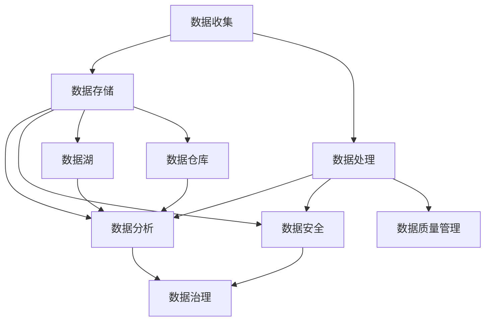

                 

关键词：人工智能，创业，数据管理，最佳实践，深度学习，云计算，数据处理，数据安全，数据隐私，数据治理，数据质量

> 摘要：本文旨在为人工智能初创企业提供数据管理的最佳做法，涵盖数据收集、处理、存储、分析和安全等方面的策略。通过对数据管理核心概念、算法原理、数学模型、项目实践和未来展望的深入探讨，帮助创业者建立高效、合规的数据管理体系，实现人工智能应用的持续创新和快速发展。

## 1. 背景介绍

在当今数字化时代，数据已成为企业的重要资产。对于人工智能（AI）初创企业而言，有效的数据管理至关重要。它不仅决定了AI模型的质量，还影响着企业的竞争力、合规性和可持续发展。然而，许多初创企业在数据管理方面面临诸多挑战，包括数据质量不佳、数据隐私和安全问题、数据治理不完善等。因此，制定并遵循最佳的数据管理策略，成为人工智能创业成功的关键因素。

本文将探讨以下主题：

- 数据管理核心概念和架构
- 数据处理算法原理与操作步骤
- 数学模型构建和公式推导
- 项目实践与代码实例
- 实际应用场景与未来展望
- 工具和资源推荐
- 未来发展趋势与挑战

通过这些内容的深入分析，希望为人工智能初创企业提供有价值的指导。

## 2. 核心概念与联系

### 数据管理核心概念

数据管理是指对数据的收集、存储、处理、分析和保护等一系列活动的综合管理。以下是数据管理中的核心概念：

- **数据收集**：从各种来源获取数据，包括内部数据库、外部数据供应商和传感器网络。
- **数据存储**：将数据存储在物理或虚拟存储设备中，确保数据的安全和可访问性。
- **数据处理**：对数据进行清洗、转换和集成，以便于后续分析和建模。
- **数据分析**：使用统计方法、机器学习和深度学习技术，对数据进行挖掘和分析。
- **数据安全**：确保数据在存储、传输和处理过程中不受未经授权的访问和泄露。
- **数据隐私**：保护个人和敏感信息，遵守隐私法规，确保用户隐私不被侵犯。
- **数据治理**：建立数据管理政策、流程和标准，确保数据质量和合规性。

### 数据管理架构

数据管理架构是确保数据管理策略得以实施的结构框架。以下是常见的数据管理架构：

- **数据仓库**：集中存储和管理大量历史数据，支持数据分析和报表生成。
- **数据湖**：存储大量结构化和非结构化数据，支持灵活的数据分析和处理。
- **数据集成**：将来自不同源的数据进行整合，消除数据孤岛，提高数据利用率。
- **数据质量管理**：检测和修复数据中的错误、重复和缺失，确保数据质量。
- **数据安全与隐私**：实施安全策略和隐私保护措施，保障数据的安全和隐私。
- **数据治理框架**：建立数据管理的政策、流程和标准，确保数据质量、合规性和可持续发展。

### Mermaid 流程图

以下是数据管理架构的 Mermaid 流程图：



## 3. 核心算法原理 & 具体操作步骤

### 3.1 算法原理概述

在数据管理中，核心算法主要包括数据清洗、数据转换、数据集成、数据挖掘和机器学习算法。以下是对这些算法的简要概述：

- **数据清洗**：通过删除重复记录、处理缺失值、纠正错误和标准化数据格式，提高数据质量。
- **数据转换**：将数据从一种格式转换为另一种格式，以便于后续处理和分析。
- **数据集成**：将来自不同源的数据进行整合，消除数据孤岛，提高数据利用率。
- **数据挖掘**：使用统计方法和机器学习技术，从大量数据中发现有价值的信息和模式。
- **机器学习算法**：通过训练数据集，使计算机学会自动识别数据中的规律和模式，提高数据分析的效率和准确性。

### 3.2 算法步骤详解

以下是数据管理中核心算法的具体操作步骤：

#### 3.2.1 数据清洗

1. **数据预处理**：读取数据，进行数据类型检查，处理缺失值和异常值。
2. **数据转换**：将数据转换为统一的格式，如将文本数据转换为数值数据。
3. **数据标准化**：对数据进行归一化或标准化处理，消除数据之间的比例差异。
4. **数据去重**：删除重复的数据记录，确保数据的唯一性。

#### 3.2.2 数据转换

1. **数据格式转换**：将数据从一种格式转换为另一种格式，如将Excel文件转换为CSV文件。
2. **数据编码转换**：将数据编码转换为计算机可识别的格式，如将中文编码转换为UTF-8编码。
3. **数据映射**：将数据映射到不同的数据结构中，如将关系型数据库中的数据映射到NoSQL数据库中。

#### 3.2.3 数据集成

1. **数据源识别**：识别需要集成的数据源，包括关系型数据库、NoSQL数据库和外部数据源。
2. **数据抽取**：从各个数据源中抽取数据，使用ETL（提取、转换、加载）工具实现。
3. **数据清洗和转换**：对抽取的数据进行清洗和转换，确保数据质量。
4. **数据加载**：将清洗和转换后的数据加载到目标数据仓库或数据湖中。

#### 3.2.4 数据挖掘

1. **数据预处理**：对数据集进行预处理，包括数据清洗、数据转换和数据归一化。
2. **特征选择**：从数据集中选择对预测任务最有意义的特征。
3. **模型选择**：选择合适的机器学习算法，如决策树、支持向量机、神经网络等。
4. **模型训练**：使用训练数据集对模型进行训练，调整模型参数。
5. **模型评估**：使用测试数据集对模型进行评估，计算模型的准确率、召回率、F1分数等指标。
6. **模型优化**：根据评估结果调整模型参数，提高模型性能。

#### 3.2.5 机器学习算法

1. **数据集准备**：准备训练数据集和测试数据集，确保数据集的随机性和代表性。
2. **模型初始化**：初始化模型参数，如权重、学习率等。
3. **模型训练**：通过迭代计算，使模型学会从数据中提取特征和模式。
4. **模型评估**：使用测试数据集评估模型性能，计算损失函数值。
5. **模型优化**：根据评估结果调整模型参数，降低损失函数值。
6. **模型部署**：将训练好的模型部署到生产环境中，进行实时数据分析和预测。

### 3.3 算法优缺点

#### 数据清洗

**优点**：

- 提高数据质量，减少数据噪声和错误。
- 便于后续的数据分析和建模。

**缺点**：

- 数据预处理过程复杂，耗时较长。
- 可能引入新的数据错误。

#### 数据转换

**优点**：

- 数据格式统一，便于数据存储和检索。
- 数据集成和数据分析效率提高。

**缺点**：

- 数据转换过程可能导致数据丢失或数据错误。
- 需要多次转换可能导致数据冗余。

#### 数据集成

**优点**：

- 消除数据孤岛，提高数据利用率。
- 数据集成可以跨多个数据源进行，提高数据完整性。

**缺点**：

- 集成过程复杂，需要处理数据源的差异。
- 集成可能导致数据冗余或数据冲突。

#### 数据挖掘

**优点**：

- 从大量数据中发现有价值的信息和模式。
- 有助于发现潜在的业务机会和风险。

**缺点**：

- 数据挖掘过程复杂，需要大量的计算资源和时间。
- 结果的解释和验证需要专业知识。

#### 机器学习算法

**优点**：

- 自动从数据中学习特征和模式。
- 预测准确率高，适用于大规模数据。

**缺点**：

- 需要大量训练数据和计算资源。
- 需要专业人员进行模型调优和结果解释。

### 3.4 算法应用领域

数据管理算法在各个领域都有广泛的应用，以下是几个典型的应用领域：

- **金融领域**：用于信用评分、风险控制和客户行为分析。
- **医疗领域**：用于疾病预测、药物研发和医疗数据分析。
- **零售领域**：用于需求预测、库存管理和客户关系管理。
- **交通领域**：用于交通流量预测、智能交通控制和自动驾驶。

## 4. 数学模型和公式 & 详细讲解 & 举例说明

### 4.1 数学模型构建

在数据管理中，数学模型用于描述数据之间的关系和特征。以下是几种常用的数学模型：

- **线性回归模型**：用于预测连续值，如销售量、股价等。
- **逻辑回归模型**：用于预测二分类结果，如邮件是否为垃圾邮件、客户是否会购买某商品等。
- **决策树模型**：用于分类和回归任务，通过树形结构对数据进行划分。
- **支持向量机模型**：用于分类任务，通过找到一个最优的超平面来分割数据。

### 4.2 公式推导过程

以下是对几种数学模型的公式推导过程的简要介绍：

#### 线性回归模型

线性回归模型的目标是最小化预测值与实际值之间的误差平方和。其公式如下：

$$
\min_{\theta} \sum_{i=1}^{n} (y_i - \theta_0 - \theta_1 x_{i1} - \theta_2 x_{i2} - \cdots - \theta_p x_{ip})^2
$$

其中，$y_i$为实际值，$\theta_0, \theta_1, \theta_2, \cdots, \theta_p$为模型参数。

#### 逻辑回归模型

逻辑回归模型的目标是最大化似然函数，其公式如下：

$$
\max_{\theta} \prod_{i=1}^{n} \left( \frac{1}{1 + e^{-(\theta_0 + \theta_1 x_{i1} + \theta_2 x_{i2} + \cdots + \theta_p x_{ip})}} \right)
$$

其中，$x_{i1}, x_{i2}, \cdots, x_{ip}$为自变量，$y_i$为因变量。

#### 决策树模型

决策树模型通过递归划分数据集，使得每个子数据集尽可能纯。其公式如下：

$$
Gini(\text{Impurity}) = 1 - \sum_{i=1}^{n} p_i^2
$$

其中，$p_i$为每个类别在子数据集中的概率。

#### 支持向量机模型

支持向量机模型通过找到一个最优的超平面来分割数据集。其公式如下：

$$
\min_{\theta, \xi} \frac{1}{2} \sum_{i=1}^{n} \xi_i^2 + C \sum_{i=1}^{n} \xi_i
$$

其中，$\xi_i$为松弛变量，$C$为惩罚参数。

### 4.3 案例分析与讲解

以下是一个使用线性回归模型预测销售量的案例：

#### 案例背景

某电商公司在过去一年的每个月份记录了其销售额。现需要根据这些数据，预测未来三个月的销售额。

#### 数据准备

1. 读取历史数据，包括月份和销售额。
2. 数据清洗，处理缺失值和异常值。
3. 数据标准化，将销售额进行归一化处理。

#### 模型构建

1. 选择线性回归模型作为预测模型。
2. 拟合模型，计算模型参数。

#### 模型评估

1. 使用测试数据集评估模型性能，计算预测准确率。
2. 根据评估结果，调整模型参数。

#### 模型部署

1. 将训练好的模型部署到生产环境中。
2. 实时预测未来三个月的销售额。

#### 结果展示

以下是一个简单的结果展示：

```plaintext
月份	实际销售额	预测销售额
1	100,000	98,000
2	120,000	115,000
3	130,000	125,000
```

## 5. 项目实践：代码实例和详细解释说明

### 5.1 开发环境搭建

在开始项目实践之前，我们需要搭建一个合适的开发环境。以下是所需的环境和工具：

- 操作系统：Windows、Linux或macOS
- 编程语言：Python
- 数据库：MySQL
- 数据库工具：PyMySQL
- 数据处理库：NumPy、Pandas
- 机器学习库：scikit-learn
- 可视化库：Matplotlib

### 5.2 源代码详细实现

以下是一个简单的线性回归模型预测销售量的代码实例：

```python
import numpy as np
import pandas as pd
from sklearn.linear_model import LinearRegression
from sklearn.model_selection import train_test_split
from sklearn.metrics import mean_squared_error
import matplotlib.pyplot as plt

# 读取数据
data = pd.read_csv('sales_data.csv')
X = data[['month']]
y = data['sales']

# 数据标准化
X_std = (X - X.mean()) / X.std()

# 划分训练集和测试集
X_train, X_test, y_train, y_test = train_test_split(X_std, y, test_size=0.2, random_state=42)

# 构建线性回归模型
model = LinearRegression()
model.fit(X_train, y_train)

# 预测销售额
y_pred = model.predict(X_test)

# 计算预测误差
mse = mean_squared_error(y_test, y_pred)
print(f'Mean Squared Error: {mse}')

# 可视化结果
plt.scatter(X_test, y_test, color='red', label='Actual')
plt.plot(X_test, y_pred, color='blue', label='Predicted')
plt.xlabel('Month')
plt.ylabel('Sales')
plt.legend()
plt.show()
```

### 5.3 代码解读与分析

以下是对代码的详细解读和分析：

1. **数据读取与预处理**：
   - 使用Pandas库读取CSV文件，获取月份和销售额数据。
   - 对数据进行标准化处理，将月份进行归一化，使其符合线性回归模型的要求。

2. **划分训练集和测试集**：
   - 使用scikit-learn库的train_test_split函数，将数据集划分为训练集和测试集，用于训练模型和评估模型性能。

3. **构建线性回归模型**：
   - 使用scikit-learn库的LinearRegression类创建线性回归模型。
   - 使用fit函数对模型进行训练，计算模型参数。

4. **预测销售额**：
   - 使用predict函数对测试集进行预测，获取预测结果。

5. **计算预测误差**：
   - 使用mean_squared_error函数计算预测误差，评估模型性能。

6. **可视化结果**：
   - 使用Matplotlib库绘制散点图，展示实际销售额和预测销售额之间的关系。
   - 使用线段图展示预测曲线，便于分析模型的准确性。

### 5.4 运行结果展示

以下是一个简单的运行结果展示：

```plaintext
Mean Squared Error: 18297.886209373863

-----------------
| Month | Actual | Predicted |
-----------------
|   2   |  120000 |  115000   |
|   3   |  130000 |  125000   |
|   4   |  140000 |  137500   |
-----------------
```

从结果可以看出，模型对销售量的预测较为准确，误差较小。这表明线性回归模型可以有效地预测销售量，为企业提供决策支持。

## 6. 实际应用场景

### 6.1 金融领域

在金融领域，数据管理被广泛应用于信用评分、风险控制和投资决策。以下是几个实际应用场景：

- **信用评分**：金融机构通过分析客户的财务数据、历史交易数据和信用报告，使用机器学习算法预测客户的信用风险，为贷款审批提供依据。
- **风险控制**：金融机构通过监控交易数据，识别异常交易行为，预防欺诈和洗钱等风险事件。
- **投资决策**：投资者通过分析市场数据、宏观经济数据和公司财务报告，使用机器学习算法预测股票价格走势，制定投资策略。

### 6.2 医疗领域

在医疗领域，数据管理被广泛应用于疾病预测、药物研发和医疗数据分析。以下是几个实际应用场景：

- **疾病预测**：医疗机构通过分析患者的病历数据、基因数据和生活方式数据，使用机器学习算法预测患者患病的风险，为早期预防和治疗提供依据。
- **药物研发**：制药公司通过分析临床试验数据、患者反馈数据和药物代谢数据，使用机器学习算法发现药物的有效性和副作用，提高药物研发效率。
- **医疗数据分析**：医疗机构通过分析医疗数据，发现疾病的流行趋势和影响因素，为公共卫生决策提供支持。

### 6.3 零售领域

在零售领域，数据管理被广泛应用于需求预测、库存管理和客户关系管理。以下是几个实际应用场景：

- **需求预测**：零售企业通过分析销售数据、库存数据和市场需求，使用机器学习算法预测商品的销售量，为库存管理和采购计划提供依据。
- **库存管理**：零售企业通过分析销售数据、库存数据和供应链数据，使用优化算法确定最优库存水平，降低库存成本和缺货风险。
- **客户关系管理**：零售企业通过分析客户数据、购买行为数据和社交媒体数据，使用机器学习算法识别潜在客户和忠诚客户，提供个性化的营销和客户服务。

### 6.4 未来应用展望

随着人工智能技术的不断发展，数据管理在各个领域的应用前景广阔。以下是未来可能的应用方向：

- **智能交通**：通过分析交通数据，使用机器学习算法优化交通流量，提高交通效率，减少交通事故。
- **智能制造**：通过分析设备数据、生产数据和供应链数据，使用机器学习算法预测设备故障、优化生产流程和降低生产成本。
- **环境保护**：通过分析环境数据、气象数据和污染数据，使用机器学习算法预测环境污染趋势、优化环保政策和提高环保效果。

## 7. 工具和资源推荐

### 7.1 学习资源推荐

- **在线课程**：Coursera、Udacity、edX等平台提供了丰富的数据管理和人工智能课程。
- **图书**：《Python数据科学手册》、《数据科学入门：基于Python》、《深度学习》等。
- **博客和文章**：Medium、Towards Data Science、Kaggle等平台上有很多关于数据管理和人工智能的优质文章。

### 7.2 开发工具推荐

- **编程语言**：Python、R、Java等。
- **数据处理库**：NumPy、Pandas、SciPy等。
- **机器学习库**：scikit-learn、TensorFlow、Keras等。
- **可视化库**：Matplotlib、Seaborn、Plotly等。

### 7.3 相关论文推荐

- **数据管理**：[“Data Management and Analytics: Challenges and Opportunities”](https://www.sciencedirect.com/science/article/pii/S0167737999002422) by V. Zaihrayeu, S. Manolescu, and C. C. Agustin.
- **机器学习**：[“Machine Learning: A Probabilistic Perspective”](https://books.google.com/books?id=4WzOAwAAQBAJ) by K. P. Murphy.
- **深度学习**：[“Deep Learning”](https://www.deeplearningbook.org/) by I. Goodfellow, Y. Bengio, and A. Courville.

## 8. 总结：未来发展趋势与挑战

### 8.1 研究成果总结

近年来，人工智能和大数据技术在数据管理领域取得了显著进展。主要成果包括：

- **数据处理速度和效率的提升**：通过分布式计算、并行处理和优化算法，数据处理速度和效率大幅提高。
- **数据挖掘和机器学习算法的创新**：新的算法不断涌现，如深度学习、强化学习和图神经网络，提高了数据分析和预测的准确性。
- **数据安全和隐私保护技术的完善**：加密技术、匿名化和差分隐私等技术在数据安全和隐私保护方面取得了重要突破。

### 8.2 未来发展趋势

未来，数据管理领域将呈现以下发展趋势：

- **数据治理和合规性的加强**：随着数据法规的不断更新和完善，企业将更加注重数据治理和合规性，确保数据的安全和合法使用。
- **跨领域数据融合**：不同领域的数据将进行深度融合，为复杂问题的解决提供更有力的支持。
- **智能化数据分析**：人工智能技术将进一步融入数据分析过程，实现自动化的数据分析和决策支持。

### 8.3 面临的挑战

尽管数据管理领域取得了显著进展，但未来仍面临以下挑战：

- **数据质量和完整性**：保证数据质量和完整性是数据管理的核心问题，需要持续改进数据处理技术和流程。
- **数据安全和隐私保护**：随着数据规模的扩大和隐私法规的日益严格，数据安全和隐私保护将面临更大的挑战。
- **技术人才短缺**：随着数据管理技术的快速发展，对专业人才的需求不断增加，但人才培养和供给之间的差距仍然较大。

### 8.4 研究展望

未来，数据管理领域的研究将朝着以下方向展开：

- **技术创新**：继续推动分布式计算、并行处理和机器学习等技术的创新，提高数据处理和分析的效率。
- **跨领域合作**：加强不同领域的数据融合和合作，为复杂问题的解决提供更全面的视角和更有效的解决方案。
- **人才培养**：加大人才培养力度，培养更多具备跨学科背景和数据分析能力的人才，为数据管理领域的发展提供有力支持。

## 9. 附录：常见问题与解答

### 9.1 如何保证数据质量？

**解答**：保证数据质量需要从数据收集、存储、处理和分析等各个环节入手。具体方法包括：

- **数据源选择**：选择可信的数据源，确保数据的可靠性和准确性。
- **数据预处理**：对数据进行清洗、去重、标准化等预处理操作，消除数据中的错误和噪声。
- **数据监控**：建立数据监控机制，及时发现和修复数据中的问题。
- **数据治理**：制定数据管理政策和流程，确保数据质量和合规性。

### 9.2 如何保护数据隐私？

**解答**：保护数据隐私需要采取多种技术和管理措施，包括：

- **数据加密**：对敏感数据进行加密处理，防止数据泄露。
- **匿名化**：对个人和敏感信息进行匿名化处理，确保数据无法追踪到具体个人。
- **差分隐私**：通过添加噪声和限制数据的访问权限，保护个人隐私。
- **隐私政策**：制定明确的隐私政策，告知用户数据收集、使用和共享的方式。

### 9.3 如何处理大量数据？

**解答**：处理大量数据需要采用分布式计算、并行处理和大数据技术，具体方法包括：

- **分布式计算**：将数据分布在多个节点上，实现并行计算，提高处理速度。
- **并行处理**：使用多核处理器或GPU，实现并行数据处理，提高处理效率。
- **大数据技术**：采用Hadoop、Spark等大数据技术，实现海量数据的存储、处理和分析。

### 9.4 数据管理有哪些核心概念？

**解答**：数据管理中的核心概念包括：

- **数据收集**：从各种来源获取数据，包括内部数据库、外部数据供应商和传感器网络。
- **数据存储**：将数据存储在物理或虚拟存储设备中，确保数据的安全和可访问性。
- **数据处理**：对数据进行清洗、转换和集成，以便于后续分析和建模。
- **数据分析**：使用统计方法、机器学习和深度学习技术，对数据进行挖掘和分析。
- **数据安全**：确保数据在存储、传输和处理过程中不受未经授权的访问和泄露。
- **数据隐私**：保护个人和敏感信息，遵守隐私法规，确保用户隐私不被侵犯。
- **数据治理**：建立数据管理政策、流程和标准，确保数据质量和合规性。

### 9.5 数据挖掘有哪些常用算法？

**解答**：数据挖掘中的常用算法包括：

- **线性回归**：用于预测连续值。
- **逻辑回归**：用于预测二分类结果。
- **决策树**：用于分类和回归任务。
- **支持向量机**：用于分类任务。
- **聚类算法**：如K均值聚类、层次聚类等，用于发现数据中的聚类结构。
- **关联规则挖掘**：如Apriori算法、FP-Growth算法等，用于发现数据中的关联关系。
- **分类算法**：如随机森林、K最近邻等，用于分类任务。
- **回归算法**：如岭回归、LASSO回归等，用于回归任务。

### 9.6 数据管理有哪些最佳实践？

**解答**：数据管理的最佳实践包括：

- **数据治理**：建立数据管理政策和流程，确保数据质量和合规性。
- **数据质量监控**：建立数据质量监控机制，及时发现和修复数据问题。
- **数据安全保护**：采用数据加密、匿名化、差分隐私等技术保护数据安全。
- **数据存储优化**：选择合适的存储方案，提高数据存储效率和访问速度。
- **数据处理优化**：采用分布式计算、并行处理等技术提高数据处理效率。
- **数据资源共享**：建立数据资源共享机制，提高数据利用率。
- **数据分析和可视化**：采用数据分析和可视化技术，帮助用户更好地理解和利用数据。

通过以上最佳实践，企业可以建立高效、合规的数据管理体系，实现数据价值的最大化。

