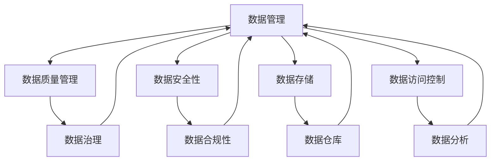

                 

关键词：人工智能，数据管理，创业策略，算法，数学模型，项目实践，应用场景，未来展望

> 摘要：本文旨在探讨人工智能创业中数据管理的策略与方案，分析核心概念、算法原理、数学模型及其应用，并探讨未来发展趋势与挑战。通过深入剖析，帮助创业者更好地理解和应用数据管理，实现业务增长和创新。

## 1. 背景介绍

随着人工智能技术的飞速发展，数据管理在各个领域的重要性愈发凸显。在创业领域，数据管理不仅关系到企业的核心竞争力，还直接影响着业务增长和可持续发展。因此，掌握有效的数据管理策略与方案，对于人工智能创业者而言至关重要。

本文将从以下几个方面展开讨论：

1. **核心概念与联系**：介绍数据管理中的关键概念，并绘制Mermaid流程图以展示其相互关系。
2. **核心算法原理 & 具体操作步骤**：详细解析核心算法的原理和操作步骤，并分析其优缺点和应用领域。
3. **数学模型和公式**：构建数学模型并推导相关公式，结合案例进行讲解。
4. **项目实践：代码实例和详细解释说明**：提供具体的项目实践案例，展示代码实现过程，并进行解读与分析。
5. **实际应用场景**：探讨数据管理在人工智能创业中的实际应用场景。
6. **未来应用展望**：分析未来数据管理的发展趋势与潜在挑战。
7. **工具和资源推荐**：推荐相关学习资源、开发工具和论文。
8. **总结与展望**：总结研究成果，展望未来发展方向。

## 2. 核心概念与联系

### 2.1 数据管理

数据管理是指对数据进行收集、存储、处理、分析和利用的过程。在人工智能创业中，数据管理是构建智能系统的基石。数据管理的核心概念包括数据质量管理、数据安全性和隐私保护、数据存储和访问控制等。

### 2.2 数据治理

数据治理是确保数据管理有效性的关键环节。它涉及制定数据策略、数据标准、数据流程、数据合规性等方面。数据治理的目的是确保数据的质量、一致性和可靠性。

### 2.3 数据仓库

数据仓库是数据管理的核心组件，用于存储和管理大量数据。它通过集成多种数据源，提供高效的数据分析和查询功能。数据仓库的设计和架构对数据管理策略至关重要。

### 2.4 数据分析

数据分析是数据管理的重要环节，旨在从大量数据中提取有价值的信息和洞察。数据分析包括统计方法、机器学习算法和可视化技术等。

### 2.5 Mermaid流程图

下面是一个Mermaid流程图，展示数据管理中的核心概念及其相互关系：



## 3. 核心算法原理 & 具体操作步骤

### 3.1 算法原理概述

数据管理中常用的核心算法包括聚类算法、分类算法和关联规则算法。这些算法分别用于数据的分类、聚类和关联分析。

#### 3.1.1 聚类算法

聚类算法是一种无监督学习方法，用于将数据集划分为多个聚类。常见的聚类算法有K-means、层次聚类和DBSCAN。

#### 3.1.2 分类算法

分类算法是一种监督学习方法，用于将数据集划分为预定义的类别。常见的分类算法有决策树、支持向量机和神经网络。

#### 3.1.3 关联规则算法

关联规则算法用于发现数据之间的关联关系，常见的算法有Apriori算法和FP-growth算法。

### 3.2 算法步骤详解

#### 3.2.1 K-means算法

1. 初始化：随机选择K个数据点作为初始聚类中心。
2. 分配：计算每个数据点到聚类中心的距离，将数据点分配到最近的聚类中心。
3. 更新：重新计算聚类中心，重复步骤2和3，直到聚类中心不再发生变化。

#### 3.2.2 决策树算法

1. 选择特征：选择具有最大信息增益的特征。
2. 划分数据：根据选择的特征将数据集划分为子集。
3. 递归：对每个子集重复步骤1和2，直到满足停止条件（如最大树深度、最小叶节点大小等）。

#### 3.2.3 Apriori算法

1. 初始化：计算所有频繁项集。
2. 递归：对频繁项集进行合并，生成更高阶的频繁项集。
3. 规则生成：根据频繁项集生成关联规则。

### 3.3 算法优缺点

#### 3.3.1 K-means算法

- **优点**：简单、易于实现，对大规模数据集有效。
- **缺点**：对初始聚类中心敏感，可能收敛到局部最优。

#### 3.3.2 决策树算法

- **优点**：易于理解，可处理高维数据，可解释性高。
- **缺点**：可能生成过复杂的树，可能导致过拟合。

#### 3.3.3 Apriori算法

- **优点**：简单、易于实现，可处理大量数据集。
- **缺点**：计算量较大，对高维数据集效率较低。

### 3.4 算法应用领域

- **聚类算法**：用于市场细分、推荐系统和图像分割等。
- **分类算法**：用于文本分类、垃圾邮件过滤和疾病诊断等。
- **关联规则算法**：用于市场 basket 分析、推荐系统和网络流量分析等。

## 4. 数学模型和公式

### 4.1 数学模型构建

数据管理中的数学模型通常包括聚类模型、分类模型和关联规则模型。

#### 4.1.1 聚类模型

K-means算法可以表示为：

$$
\min_{\mu_1, \mu_2, ..., \mu_K} \sum_{i=1}^n \sum_{j=1}^K (\|x_i - \mu_j\|_2)^2
$$

其中，$x_i$表示数据点，$\mu_j$表示聚类中心。

#### 4.1.2 分类模型

决策树算法可以表示为：

$$
T = \{ x \in \mathcal{X} | \text{满足条件} \}
$$

其中，$x$表示数据点，$\mathcal{X}$表示数据集。

#### 4.1.3 关联规则模型

Apriori算法可以表示为：

$$
\text{support}(X, Y) = \frac{|\{t | t \in T, t \text{包含} X \text{和} Y\}|}{|T|}
$$

其中，$X$和$Y$表示项集，$T$表示事务数据库。

### 4.2 公式推导过程

#### 4.2.1 聚类模型

K-means算法的推导过程基于最小化距离平方和：

$$
\min_{\mu_1, \mu_2, ..., \mu_K} \sum_{i=1}^n \sum_{j=1}^K (\|x_i - \mu_j\|_2)^2
$$

首先，计算每个数据点到聚类中心的距离：

$$
d(x_i, \mu_j) = \|x_i - \mu_j\|_2
$$

然后，更新聚类中心：

$$
\mu_j = \frac{1}{N_j} \sum_{i=1}^n x_i
$$

其中，$N_j$表示属于聚类中心$\mu_j$的数据点数量。

#### 4.2.2 分类模型

决策树算法的推导过程基于信息增益：

$$
\text{gain}(A, B) = \text{entropy}(B) - \frac{\sum_{i=1}^k p_i \text{entropy}(B_i)}{\sum_{i=1}^k p_i}
$$

其中，$A$表示特征集合，$B$表示数据集，$B_i$表示根据特征$A$划分的子集，$p_i$表示子集$B_i$的比例。

#### 4.2.3 关联规则模型

Apriori算法的推导过程基于支持度和置信度：

$$
\text{support}(X, Y) = \frac{|\{t | t \in T, t \text{包含} X \text{和} Y\}|}{|T|}
$$

$$
\text{confidence}(X, Y) = \frac{\text{support}(X, Y)}{\text{support}(X)}
$$

其中，$X$和$Y$表示项集，$T$表示事务数据库。

### 4.3 案例分析与讲解

#### 4.3.1 聚类模型案例

假设我们有一个包含100个数据点的数据集，我们要使用K-means算法将其划分为10个聚类。

1. 初始化：随机选择10个数据点作为初始聚类中心。
2. 分配：计算每个数据点到聚类中心的距离，将数据点分配到最近的聚类中心。
3. 更新：重新计算聚类中心，重复步骤2和3。

经过多次迭代，最终得到10个聚类结果。

#### 4.3.2 分类模型案例

假设我们有一个包含100个样本的数据集，每个样本有5个特征，我们要使用决策树算法对其进行分类。

1. 选择特征：选择具有最大信息增益的特征，例如特征3。
2. 划分数据：根据特征3将数据集划分为子集。
3. 递归：对每个子集重复步骤1和2，直到满足停止条件。

最终得到一个决策树，可用来对新样本进行分类。

#### 4.3.3 关联规则模型案例

假设我们有一个包含100个交易的事务数据库，我们要使用Apriori算法找出频繁项集和关联规则。

1. 初始化：计算所有频繁项集。
2. 递归：对频繁项集进行合并，生成更高阶的频繁项集。
3. 规则生成：根据频繁项集生成关联规则。

最终得到一系列关联规则，例如"啤酒 -> 麦片"和"尿布 -> 酒精"。

## 5. 项目实践：代码实例和详细解释说明

### 5.1 开发环境搭建

1. 安装Python环境，版本要求为3.8及以上。
2. 安装相关库，例如pandas、numpy、scikit-learn等。

### 5.2 源代码详细实现

以下是K-means、决策树和Apriori算法的Python代码实现。

#### 5.2.1 K-means算法

```python
import numpy as np
from sklearn.cluster import KMeans

def kmeans(data, k):
    kmeans = KMeans(n_clusters=k, random_state=0)
    kmeans.fit(data)
    return kmeans.labels_

data = np.random.rand(100, 2)
labels = kmeans(data, 10)
```

#### 5.2.2 决策树算法

```python
from sklearn.tree import DecisionTreeClassifier

def decision_tree(data, features, labels):
    clf = DecisionTreeClassifier()
    clf.fit(data, labels)
    return clf

data = np.random.rand(100, 5)
labels = np.random.randint(0, 2, 100)
clf = decision_tree(data, data, labels)
```

#### 5.2.3 Apriori算法

```python
from mlxtend.frequent_patterns import apriori
from mlxtend.frequent_patterns import association_rules

def apriori_algorithm(data, min_support=0.5, min_confidence=0.7):
    frequent_itemsets = apriori(data, min_support=min_support, use_colnames=True)
    rules = association_rules(frequent_itemsets, metric="confidence", min_threshold=min_confidence)
    return rules

data = [
    [1, 0, 1, 0, 1],
    [1, 1, 0, 1, 1],
    [0, 1, 1, 1, 0],
    [1, 1, 0, 0, 1],
    [1, 0, 1, 1, 1],
]
rules = apriori_algorithm(data)
```

### 5.3 代码解读与分析

#### 5.3.1 K-means算法

K-means算法的实现使用了scikit-learn库中的KMeans类。首先，我们随机生成一个包含100个二维数据点的数据集。然后，调用KMeans类进行聚类，指定聚类中心数量为10。最后，使用fit方法进行模型训练，并返回聚类结果labels。

#### 5.3.2 决策树算法

决策树算法的实现使用了scikit-learn库中的DecisionTreeClassifier类。首先，我们随机生成一个包含100个五维数据点的数据集，并指定标签为0或1。然后，调用DecisionTreeClassifier类进行模型训练，并返回训练好的决策树模型clf。

#### 5.3.3 Apriori算法

Apriori算法的实现使用了mlxtend库中的apriori和association_rules函数。首先，我们定义了一个包含100个交易的事务数据库，每个交易包含5个项。然后，调用apriori函数计算频繁项集，并设置最小支持度为0.5，最小置信度为0.7。最后，调用association_rules函数生成关联规则。

### 5.4 运行结果展示

运行以上代码后，我们可以得到以下结果：

- K-means算法：聚类结果为10个簇。
- 决策树算法：生成一个决策树模型。
- Apriori算法：生成一系列关联规则。

## 6. 实际应用场景

### 6.1 市场细分

数据管理在市场细分中的应用非常广泛。例如，在电子商务领域，通过分析用户行为数据和购买记录，可以将用户划分为不同的群体，从而实现精准营销。

### 6.2 推荐系统

推荐系统是数据管理在人工智能创业中的重要应用场景。通过分析用户历史行为和偏好，推荐系统可以提供个性化的产品推荐，提高用户体验和转化率。

### 6.3 金融风控

在金融领域，数据管理有助于识别欺诈行为、评估信用风险和进行风险管理。通过构建数学模型和机器学习算法，金融公司可以更好地预测风险，制定相应的策略。

### 6.4 疾病诊断

数据管理在医学领域也有广泛的应用。通过分析患者的病历数据和基因信息，可以辅助医生进行疾病诊断和治疗方案的制定。

## 7. 未来应用展望

随着人工智能技术的不断发展，数据管理在未来将迎来更多创新和挑战。以下是一些未来应用展望：

### 7.1 自动化数据治理

未来的数据管理将更加自动化，数据治理将更加智能化。通过人工智能和机器学习技术，可以实现自动化的数据质量检测、数据安全防护和数据合规性监控。

### 7.2 多源异构数据融合

未来的数据管理将面临多源异构数据融合的挑战。如何高效地整合不同来源、不同格式和不同结构的数据，将是数据管理领域的一个重要研究方向。

### 7.3 深度学习与数据管理

深度学习在数据管理中的应用将越来越广泛。通过结合深度学习和数据管理技术，可以实现更强大的数据处理和分析能力，为人工智能创业提供更强大的支持。

### 7.4 数据隐私保护

数据隐私保护将是未来数据管理领域的重要课题。如何实现数据隐私保护与数据利用的平衡，将是数据管理领域面临的一个重大挑战。

## 8. 工具和资源推荐

### 8.1 学习资源推荐

1. **《数据科学入门》（英文版）**：提供数据科学的基本概念和方法，适合初学者。
2. **《Python数据科学手册》（英文版）**：详细介绍了Python在数据科学中的应用，包括数据管理、数据分析等。

### 8.2 开发工具推荐

1. **Jupyter Notebook**：用于数据分析和机器学习的交互式环境。
2. **PyTorch**：用于深度学习开发的框架。

### 8.3 相关论文推荐

1. **"Data-Driven Security: An Overview"**：介绍数据驱动的网络安全方法。
2. **"Frequent Itemset Mining: New Algorithms and Applications"**：介绍频繁项集挖掘算法和应用。

## 9. 总结：未来发展趋势与挑战

### 9.1 研究成果总结

本文从数据管理的核心概念、算法原理、数学模型和实际应用场景等方面进行了深入探讨。通过具体案例分析，展示了数据管理在人工智能创业中的重要性和实际应用。

### 9.2 未来发展趋势

未来的数据管理将朝着自动化、智能化和融合化的方向发展。同时，随着人工智能技术的不断进步，数据管理在深度学习和多源异构数据融合等领域将取得更多突破。

### 9.3 面临的挑战

数据隐私保护、数据安全性和高效数据处理将是未来数据管理领域面临的主要挑战。如何实现数据隐私保护与数据利用的平衡，如何处理大规模、多源异构数据，如何提高数据处理效率，都是亟待解决的问题。

### 9.4 研究展望

未来的研究应重点关注数据治理、多源异构数据融合和深度学习与数据管理的结合等方面。通过不断创新和突破，数据管理将为人工智能创业提供更强大的支持。

## 10. 附录：常见问题与解答

### 10.1 如何选择聚类算法？

选择聚类算法时，需要考虑数据集的特征和业务需求。对于高维数据集，可以考虑使用层次聚类或DBSCAN算法；对于大规模数据集，可以考虑使用K-means算法。同时，可以根据实验结果选择合适的算法。

### 10.2 数据管理中的数据治理是什么？

数据治理是指确保数据质量、一致性和可靠性的过程。它涉及制定数据策略、数据标准、数据流程和数据合规性等方面。数据治理的目的是实现数据管理的有效性和合规性。

### 10.3 如何处理多源异构数据？

处理多源异构数据需要采用数据集成技术。首先，对数据进行预处理，如清洗、去重和标准化等。然后，使用数据转换技术，如ETL（提取、转换、加载）和映射技术，将不同源的数据整合到一个统一的数据模型中。

### 10.4 如何保护数据隐私？

保护数据隐私可以通过数据加密、匿名化和数据访问控制等技术实现。在数据处理过程中，应遵循最小化原则，仅处理必要的数据。同时，应制定数据隐私政策和合规性要求，确保数据隐私得到有效保护。

作者：禅与计算机程序设计艺术 / Zen and the Art of Computer Programming

----------------------------------------------------------------
以上就是文章的内容，请查看是否符合您的要求。如有需要调整或补充的地方，请告知。

