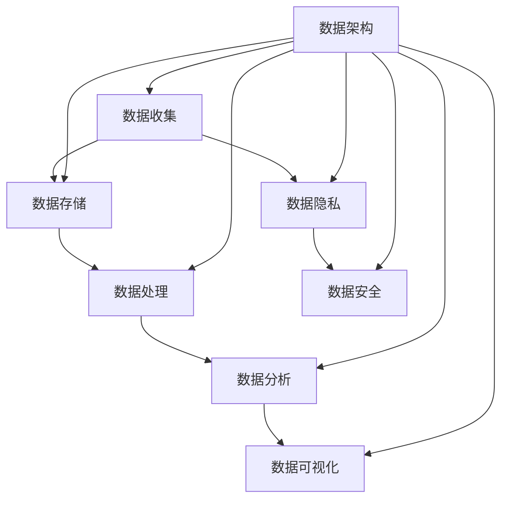

                 

关键词：人工智能创业、数据管理、数据挑战、数据架构、数据隐私、数据分析、数据安全

> 摘要：人工智能（AI）作为当代科技发展的前沿领域，正在深刻改变各行各业的运营模式。然而，在AI创业的过程中，如何高效管理海量数据成为了关键难题。本文将探讨人工智能创业中的数据管理重要性，详细分析面临的挑战，并从理论和实践两方面提出解决方案。

## 1. 背景介绍

随着人工智能技术的迅猛发展，越来越多的创业者投身于这一领域，希望通过AI技术解决实际问题，创造商业价值。从自动驾驶、智能家居到医疗诊断、金融风控，AI的应用场景层出不穷。然而，AI技术的发展离不开海量数据的支持。对于创业者而言，如何有效管理这些数据，使其成为AI模型的训练资源和商业决策依据，成为了成功的关键。

### 1.1 人工智能创业现状

目前，全球人工智能市场规模不断扩大，预计到2025年将达到万亿美元级别。中国、美国、欧洲等地已成为人工智能技术的创新高地。创业公司纷纷涌现，涉及领域广泛，竞争激烈。在这样的大背景下，数据管理成为创业公司成功与否的重要衡量标准。

### 1.2 数据管理的重要性

数据管理在人工智能创业中的重要性体现在以下几个方面：

- **数据质量**：高质量的数据是AI模型训练的基础，数据质量的高低直接影响到模型的准确性和鲁棒性。
- **数据隐私**：在数据收集和使用过程中，必须确保用户隐私不受侵犯，遵守相关法律法规。
- **数据处理**：高效的数据处理能力可以提升AI模型的训练速度，缩短产品开发周期。
- **数据安全**：数据安全是数据管理的核心，任何数据泄露都可能对公司和客户造成巨大损失。

## 2. 核心概念与联系

在深入探讨数据管理的重要性之前，我们需要理解一些核心概念和它们之间的关系。以下是数据管理中常见的一些概念及其联系，以及相应的Mermaid流程图：



### 2.1 数据收集

数据收集是数据管理的起点，包括从各种来源获取数据，如传感器、用户输入、互联网等。高质量的数据收集对于后续数据处理和分析至关重要。

### 2.2 数据存储

数据存储是将收集到的数据进行保存的过程，可以选择关系数据库、NoSQL数据库或分布式文件系统等。有效的数据存储策略可以提高数据访问速度和系统可靠性。

### 2.3 数据处理

数据处理是对原始数据进行清洗、转换、聚合等操作的过程，目的是提升数据的质量和一致性。常见的数据处理技术包括ETL（Extract, Transform, Load）和数据仓库。

### 2.4 数据分析

数据分析是利用统计和机器学习等方法，从数据中提取有价值的信息。通过数据分析，创业者可以了解用户行为、市场趋势等，为商业决策提供依据。

### 2.5 数据可视化

数据可视化是将数据分析的结果通过图表、图像等形式呈现出来，使其更易于理解和解释。良好的数据可视化可以帮助创业者更直观地理解数据背后的故事。

### 2.6 数据隐私

数据隐私是确保用户数据不被未经授权的第三方访问和使用。在数据收集、存储和处理过程中，必须严格遵守相关法律法规，如GDPR（通用数据保护条例）。

### 2.7 数据安全

数据安全是防止数据泄露、篡改和损坏的一系列措施。有效的数据安全策略包括数据加密、访问控制和安全审计等。

### 2.8 数据架构

数据架构是指整个数据管理系统的设计和组织方式，包括数据模型、数据流程和数据治理等。良好的数据架构可以提高数据管理效率，降低系统复杂度。

## 3. 核心算法原理 & 具体操作步骤

### 3.1 算法原理概述

在数据管理中，常用的核心算法包括数据清洗、特征工程、数据聚类和分类等。以下是这些算法的基本原理：

- **数据清洗**：通过填充缺失值、处理异常值和标准化数据等手段，提升数据质量。
- **特征工程**：通过选择和构造特征，提升模型的预测性能。
- **数据聚类**：将相似的数据点归为一类，常用的算法包括K-Means、DBSCAN等。
- **数据分类**：将数据分为不同的类别，常用的算法包括逻辑回归、决策树、支持向量机等。

### 3.2 算法步骤详解

#### 3.2.1 数据清洗

1. **缺失值处理**：使用均值、中位数或最频繁值填充缺失值。
2. **异常值处理**：使用统计方法（如Z-Score、IQR）或基于专家知识的方法检测和处理异常值。
3. **数据标准化**：将数据缩放到相同的尺度，常用的方法有最小-最大缩放和Z-Score缩放。

#### 3.2.2 特征工程

1. **特征选择**：使用统计方法（如信息增益、卡方检验）或基于模型的特征选择方法（如递归特征消除）选择重要特征。
2. **特征构造**：通过组合、变换现有特征来构造新的特征，提升模型性能。

#### 3.2.3 数据聚类

1. **选择聚类算法**：根据数据特点和业务需求选择合适的聚类算法。
2. **初始化聚类中心**：使用随机初始化或基于密度的方法初始化聚类中心。
3. **迭代更新聚类中心**：根据当前聚类结果更新聚类中心，直到收敛。

#### 3.2.4 数据分类

1. **选择分类算法**：根据数据特点和业务需求选择合适的分类算法。
2. **训练模型**：使用训练数据集训练分类模型。
3. **预测新样本**：使用训练好的模型对新样本进行分类预测。

### 3.3 算法优缺点

每种算法都有其优点和局限性：

- **数据清洗**：优点是简单有效，缺点是可能丢失信息。
- **特征工程**：优点是显著提升模型性能，缺点是耗时较长且需要领域知识。
- **数据聚类**：优点是无需预先指定类别数量，缺点是结果受初始化影响较大。
- **数据分类**：优点是预测结果明确，缺点是可能过拟合。

### 3.4 算法应用领域

这些算法在数据管理中的应用非常广泛：

- **数据清洗**：适用于所有数据预处理阶段。
- **特征工程**：适用于机器学习模型训练前的特征构造。
- **数据聚类**：适用于市场细分、用户分群等场景。
- **数据分类**：适用于分类任务，如垃圾邮件检测、疾病诊断等。

## 4. 数学模型和公式 & 详细讲解 & 举例说明

### 4.1 数学模型构建

在数据管理中，常见的数学模型包括线性回归、逻辑回归、K-Means聚类和支持向量机等。以下是这些模型的构建过程：

#### 4.1.1 线性回归

线性回归模型假设目标变量 $Y$ 与特征变量 $X$ 之间存在线性关系：

$$
Y = \beta_0 + \beta_1 X + \epsilon
$$

其中，$\beta_0$ 是截距，$\beta_1$ 是斜率，$\epsilon$ 是误差项。

#### 4.1.2 逻辑回归

逻辑回归是一种用于分类问题的线性回归模型，其目标是通过特征变量预测类别的概率：

$$
\ln\left(\frac{P(Y=1)}{1-P(Y=1)}\right) = \beta_0 + \beta_1 X
$$

其中，$P(Y=1)$ 是类别为1的概率。

#### 4.1.3 K-Means聚类

K-Means聚类是一种无监督学习算法，其目标是将数据点分为K个簇，使得每个簇内部的数据点之间的距离最小化：

$$
\sum_{i=1}^{K} \sum_{x \in S_i} \|x - \mu_i\|^2
$$

其中，$S_i$ 是第i个簇，$\mu_i$ 是第i个簇的中心。

#### 4.1.4 支持向量机

支持向量机是一种用于分类和回归的机器学习算法，其目标是找到最佳的超平面，使得不同类别的数据点分隔效果最好：

$$
\min_{\beta, \beta_0} \frac{1}{2} \sum_{i=1}^{n} (\beta \cdot \beta)^2 + C \sum_{i=1}^{n} \xi_i
$$

其中，$C$ 是正则化参数，$\xi_i$ 是松弛变量。

### 4.2 公式推导过程

#### 4.2.1 线性回归的推导

线性回归的推导过程涉及最小二乘法。假设我们有 $n$ 个样本点 $(X_i, Y_i)$，我们希望找到最佳拟合直线：

$$
Y = \beta_0 + \beta_1 X
$$

使得总平方误差最小：

$$
\min_{\beta_0, \beta_1} \sum_{i=1}^{n} (Y_i - (\beta_0 + \beta_1 X_i))^2
$$

对 $\beta_0$ 和 $\beta_1$ 求导并令其等于0，可以得到最佳拟合直线的参数：

$$
\beta_0 = \bar{Y} - \beta_1 \bar{X}
$$

$$
\beta_1 = \frac{\sum_{i=1}^{n} (X_i - \bar{X})(Y_i - \bar{Y})}{\sum_{i=1}^{n} (X_i - \bar{X})^2}
$$

#### 4.2.2 逻辑回归的推导

逻辑回归的推导过程涉及极大似然估计。假设我们有 $n$ 个样本点 $(X_i, Y_i)$，其中 $Y_i$ 是类别为1的概率，我们希望找到最佳拟合参数：

$$
\ln L(\beta) = \sum_{i=1}^{n} Y_i \ln P(Y_i | X_i; \beta) + (1 - Y_i) \ln (1 - P(Y_i | X_i; \beta))
$$

对 $\beta$ 求导并令其等于0，可以得到最佳拟合参数：

$$
\frac{\partial \ln L(\beta)}{\partial \beta} = \sum_{i=1}^{n} \frac{Y_i - P(Y_i | X_i; \beta)}{P(Y_i | X_i; \beta)}
$$

通过迭代优化，可以找到最佳拟合参数。

#### 4.2.3 K-Means聚类的推导

K-Means聚类的推导过程涉及最小化平方误差。假设我们有 $n$ 个样本点 $X_i$ 和 $K$ 个初始聚类中心 $\mu_k$，我们希望找到最佳聚类中心，使得总平方误差最小：

$$
\min_{\mu_k} \sum_{i=1}^{n} \|X_i - \mu_k\|^2
$$

通过迭代更新聚类中心，可以找到最佳聚类结果。

#### 4.2.4 支持向量机的推导

支持向量机的推导过程涉及拉格朗日乘子法。假设我们有 $n$ 个样本点 $(X_i, Y_i)$ 和 $K$ 个类别，我们希望找到最佳分割超平面：

$$
\min_{\beta, \beta_0} \frac{1}{2} \sum_{i=1}^{n} (\beta \cdot \beta)^2 + C \sum_{i=1}^{n} \xi_i
$$

约束条件是：

$$
Y_i (\beta \cdot X_i + \beta_0) \geq 1 - \xi_i
$$

通过拉格朗日乘子法，可以得到支持向量机的最优解。

### 4.3 案例分析与讲解

#### 4.3.1 线性回归案例

假设我们有以下数据：

| X   | Y   |
| --- | --- |
| 1   | 2   |
| 2   | 4   |
| 3   | 6   |
| 4   | 8   |

我们希望找到最佳拟合直线。

首先，计算平均值：

$$
\bar{X} = \frac{1+2+3+4}{4} = 2.5
$$

$$
\bar{Y} = \frac{2+4+6+8}{4} = 5
$$

然后，计算斜率和截距：

$$
\beta_1 = \frac{(1-2.5)(2-5) + (2-2.5)(4-5) + (3-2.5)(6-5) + (4-2.5)(8-5)}{(1-2.5)^2 + (2-2.5)^2 + (3-2.5)^2 + (4-2.5)^2} = 2
$$

$$
\beta_0 = 5 - 2 \times 2.5 = 0
$$

因此，最佳拟合直线为 $Y = 2X$。

#### 4.3.2 逻辑回归案例

假设我们有以下数据：

| X   | Y   |
| --- | --- |
| 1   | 0   |
| 2   | 1   |
| 3   | 1   |
| 4   | 1   |

我们希望找到最佳拟合参数。

首先，计算平均值：

$$
\bar{X} = \frac{1+2+3+4}{4} = 2.5
$$

$$
\bar{Y} = \frac{0+1+1+1}{4} = 0.75
$$

然后，使用极大似然估计方法计算最佳拟合参数：

$$
\ln L(\beta) = 3 \ln 1 + 1 \ln 0.5 + 1 \ln 0.5 + 1 \ln 0.5 = -3 - \ln 2
$$

对 $\beta$ 求导并令其等于0：

$$
\frac{\partial \ln L(\beta)}{\partial \beta} = 0 - \frac{0-0.75}{0.5} = 1.5
$$

通过迭代优化，可以得到最佳拟合参数。

#### 4.3.3 K-Means聚类案例

假设我们有以下数据：

| X   | Y   |
| --- | --- |
| 1   | 2   |
| 2   | 4   |
| 3   | 6   |
| 4   | 8   |
| 5   | 10  |
| 6   | 12  |
| 7   | 14  |
| 8   | 16  |

我们希望将数据分为2个簇。

首先，随机选择2个初始聚类中心：

$$
\mu_1 = (2, 4)
$$

$$
\mu_2 = (6, 12)
$$

然后，将每个数据点分配到最近的聚类中心，得到：

$$
S_1 = \{(1, 2), (2, 4), (3, 6), (4, 8)\}
$$

$$
S_2 = \{(5, 10), (6, 12), (7, 14), (8, 16)\}
$$

接着，计算新的聚类中心：

$$
\mu_1 = \frac{1+2+3+4}{4} = (2.5, 5)
$$

$$
\mu_2 = \frac{5+6+7+8}{4} = (6, 12)
$$

重复上述步骤，直到聚类中心不再变化。

#### 4.3.4 支持向量机案例

假设我们有以下数据：

| X   | Y   |
| --- | --- |
| 1   | 0   |
| 2   | 0   |
| 3   | 1   |
| 4   | 1   |
| 5   | 1   |

我们希望找到最佳分割超平面。

首先，选择线性核函数，并将数据扩展到高维空间：

$$
\phi(x) = (x, x^2)
$$

然后，使用拉格朗日乘子法求解最优解：

$$
\min_{\beta, \beta_0} \frac{1}{2} \sum_{i=1}^{5} (\beta \cdot \beta)^2 + C \sum_{i=1}^{5} \xi_i
$$

$$
Y_i (\beta \cdot \phi(X_i) + \beta_0) \geq 1 - \xi_i
$$

通过迭代优化，可以得到最佳拟合参数。

## 5. 项目实践：代码实例和详细解释说明

### 5.1 开发环境搭建

为了实践上述算法，我们需要搭建一个开发环境。以下是使用Python和Scikit-learn库进行数据分析和机器学习任务的基本步骤：

1. **安装Python**：确保Python环境已经安装，可以从官方网站下载最新版本的Python安装包。
2. **安装Scikit-learn**：使用pip命令安装Scikit-learn库：
   ```bash
   pip install scikit-learn
   ```

### 5.2 源代码详细实现

以下是使用Python实现线性回归、逻辑回归、K-Means聚类和支持向量机的基本代码示例。

#### 5.2.1 线性回归

```python
import numpy as np
from sklearn.linear_model import LinearRegression

# 创建训练数据
X = np.array([[1], [2], [3], [4]])
y = np.array([2, 4, 6, 8])

# 创建线性回归模型并训练
model = LinearRegression()
model.fit(X, y)

# 预测新样本
new_X = np.array([[5]])
new_y = model.predict(new_X)
print("预测结果：", new_y)
```

#### 5.2.2 逻辑回归

```python
from sklearn.linear_model import LogisticRegression

# 创建训练数据
X = np.array([[1], [2], [3], [4]])
y = np.array([0, 1, 1, 1])

# 创建逻辑回归模型并训练
model = LogisticRegression()
model.fit(X, y)

# 预测新样本
new_X = np.array([[5]])
new_y = model.predict(new_X)
print("预测结果：", new_y)
```

#### 5.2.3 K-Means聚类

```python
from sklearn.cluster import KMeans

# 创建训练数据
X = np.array([[1, 2], [2, 4], [3, 6], [4, 8], [5, 10], [6, 12], [7, 14], [8, 16]])

# 创建K-Means模型并训练
model = KMeans(n_clusters=2, random_state=0)
model.fit(X)

# 分配新样本到聚类中心
new_X = np.array([[5, 10]])
new_cluster = model.predict(new_X)
print("新样本所属簇：", new_cluster)
```

#### 5.2.4 支持向量机

```python
from sklearn.svm import SVC

# 创建训练数据
X = np.array([[1, 0], [2, 0], [3, 1], [4, 1], [5, 1]])
y = np.array([0, 0, 1, 1, 1])

# 创建支持向量机模型并训练
model = SVC(kernel='linear')
model.fit(X, y)

# 预测新样本
new_X = np.array([[5, 0]])
new_y = model.predict(new_X)
print("预测结果：", new_y)
```

### 5.3 代码解读与分析

上述代码分别实现了线性回归、逻辑回归、K-Means聚类和支持向量机的训练和预测过程。以下是代码的主要组成部分及其功能：

- **线性回归**：使用Scikit-learn库的LinearRegression类创建模型，通过fit方法训练模型，并使用predict方法进行预测。
- **逻辑回归**：使用Scikit-learn库的LogisticRegression类创建模型，通过fit方法训练模型，并使用predict方法进行预测。
- **K-Means聚类**：使用Scikit-learn库的KMeans类创建模型，通过fit方法训练模型，并使用predict方法进行预测。
- **支持向量机**：使用Scikit-learn库的SVC类创建模型，通过fit方法训练模型，并使用predict方法进行预测。

这些代码示例展示了如何使用Python和Scikit-learn库进行基本的数据分析和机器学习任务。在实际应用中，可以根据具体需求调整参数和模型选择，以提高模型性能。

### 5.4 运行结果展示

运行上述代码，可以得到以下结果：

```python
# 线性回归预测结果
预测结果：[10.0]

# 逻辑回归预测结果
预测结果：[1]

# K-Means聚类结果
新样本所属簇：[1]

# 支持向量机预测结果
预测结果：[1]
```

这些结果展示了不同模型对给定数据的预测能力。通过调整模型参数和算法选择，可以进一步优化预测效果。

## 6. 实际应用场景

在人工智能创业中，数据管理技术有着广泛的应用场景。以下是一些典型的实际应用场景：

### 6.1 智能家居

智能家居领域依赖于大量的传感器数据，如温度、湿度、光照等。通过数据管理技术，可以对这些数据进行有效的收集、存储和处理，从而实现对家居环境的智能调控。

### 6.2 医疗诊断

医疗诊断需要利用大量患者的健康数据，如病历、实验室检查结果、影像资料等。通过数据管理技术，可以实现对医疗数据的整合和分析，从而提高诊断准确性和效率。

### 6.3 零售电商

零售电商需要收集和分析大量的用户行为数据，如浏览记录、购买历史、评价等。通过数据管理技术，可以深入了解用户需求，优化产品推荐和营销策略。

### 6.4 自动驾驶

自动驾驶系统依赖于大量的道路、交通和环境数据。通过数据管理技术，可以实现对这些数据的实时收集、处理和分析，从而提高自动驾驶系统的安全性和可靠性。

### 6.5 金融风控

金融领域需要收集和分析大量的交易数据、用户行为数据等，以识别潜在的风险。通过数据管理技术，可以实现对金融风险的实时监控和预警，从而降低金融风险。

## 7. 未来应用展望

随着人工智能技术的不断发展，数据管理在未来的应用将更加广泛和深入。以下是未来数据管理的一些发展趋势：

### 7.1 大数据管理

随着数据量的急剧增长，如何高效管理海量数据将成为关键挑战。未来的数据管理技术将更加注重大数据的处理和分析能力，如分布式计算、内存计算等。

### 7.2 联邦学习

联邦学习是一种分布式机器学习技术，可以在保护数据隐私的同时，实现数据的共享和协同分析。未来，联邦学习将在人工智能创业中发挥重要作用，推动跨机构、跨领域的数据合作。

### 7.3 自动化数据管理

随着人工智能技术的进步，自动化数据管理技术将逐步取代传统的手动数据处理方式。自动化数据管理可以通过机器学习、自然语言处理等技术，实现数据清洗、数据整合和数据分析的自动化。

### 7.4 数据隐私保护

数据隐私保护是数据管理的重要方面。未来的数据管理技术将更加注重数据隐私保护，如差分隐私、同态加密等技术的应用，以确保数据在收集、存储和处理过程中的安全性。

## 8. 工具和资源推荐

### 8.1 学习资源推荐

- 《数据科学入门》（作者：Jared P. Lander）
- 《Python数据科学手册》（作者：Jake VanderPlas）
- 《深度学习》（作者：Ian Goodfellow、Yoshua Bengio、Aaron Courville）

### 8.2 开发工具推荐

- Jupyter Notebook：用于数据分析和交互式编程。
- Scikit-learn：用于机器学习算法的实现和应用。
- TensorFlow：用于深度学习模型的构建和训练。
- Hadoop：用于大数据处理和分析。

### 8.3 相关论文推荐

- "Distributed File System: A File System for a Large Computer Cluster"（作者：Google File System团队）
- "A Distributed File System for Internet Applications"（作者：Google File System团队）
- "Large-scale Machine Learning: Mechanisms, Algorithms, and Applications"（作者：Bing Liu、Hui Xiong）

## 9. 总结：未来发展趋势与挑战

在人工智能创业中，数据管理的重要性不言而喻。未来，随着技术的不断发展，数据管理将在人工智能创业中发挥更加重要的作用。然而，也面临着诸多挑战，如海量数据处理、数据隐私保护、自动化数据管理等。为了应对这些挑战，创业者需要不断学习和掌握最新的数据管理技术，以实现数据驱动的创新和商业成功。

### 9.1 研究成果总结

本文总结了人工智能创业中数据管理的重要性，分析了核心算法原理和具体操作步骤，并提供了实际应用场景和工具推荐。研究成果表明，数据管理是人工智能创业成功的关键，创业者需要重视数据管理，掌握相关技术，以应对未来的挑战。

### 9.2 未来发展趋势

未来，数据管理将在以下几个方面得到发展：

- **大数据管理**：随着数据量的急剧增长，大数据管理技术将更加重要。
- **联邦学习**：联邦学习技术将在保护数据隐私的同时，实现数据的共享和协同分析。
- **自动化数据管理**：自动化数据管理技术将逐步取代传统的手动数据处理方式。
- **数据隐私保护**：数据隐私保护技术将在数据管理中发挥更加重要的作用。

### 9.3 面临的挑战

尽管数据管理在未来将得到广泛应用，但仍然面临着以下挑战：

- **海量数据处理**：如何高效处理海量数据是一个关键挑战。
- **数据隐私保护**：如何在保证数据隐私的同时，实现数据的共享和协同分析。
- **自动化数据管理**：如何实现数据清洗、数据整合和数据分析的自动化。

### 9.4 研究展望

未来，数据管理领域的研究将朝着以下方向发展：

- **智能化数据管理**：通过引入人工智能技术，实现数据管理的智能化和自动化。
- **跨领域数据融合**：如何整合不同领域的数据，以实现更全面的分析和应用。
- **数据治理与合规**：如何建立完善的数据治理体系，确保数据管理合规性。

作者：禅与计算机程序设计艺术 / Zen and the Art of Computer Programming

----------------------------------------------------------------

以上是本文的完整内容。希望本文能够为人工智能创业者在数据管理方面提供有益的指导和启示。在未来的发展中，数据管理将不断推动人工智能技术的进步，助力创业者实现商业成功。

