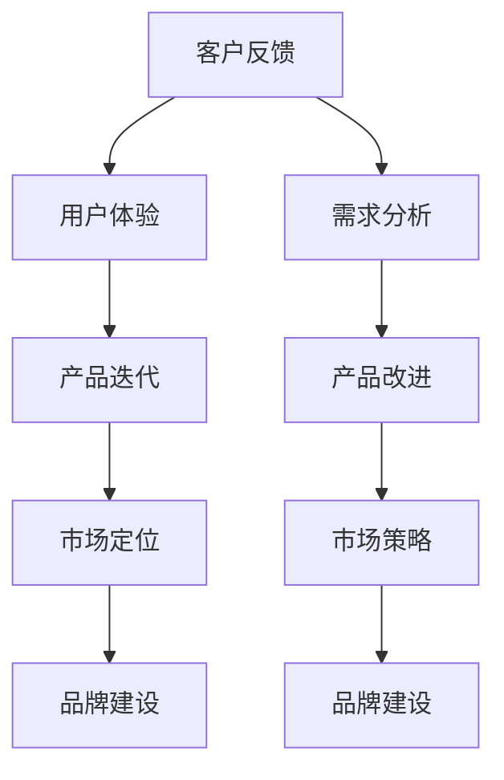

                 

关键词：人工智能、创业、客户反馈、产品迭代、用户体验、数据分析

> 摘要：本文将深入探讨人工智能创业过程中客户反馈的重要性，分析客户反馈对于产品迭代、用户体验优化以及企业成长的关键作用。通过实际案例和数据分析，本文旨在为创业者提供有价值的指导，帮助他们在激烈的市场竞争中取得成功。

## 1. 背景介绍

近年来，人工智能（AI）技术的发展迅速，不仅在学术界取得了显著成果，也在商业领域引发了广泛的关注和应用。随着AI技术的不断成熟，越来越多的创业公司投身于人工智能领域，希望通过创新的产品和解决方案来赢得市场份额。然而，创业之路并非一帆风顺。如何在竞争激烈的市场中脱颖而出，成为每个创业者都必须面对的挑战。

在这场竞赛中，客户反馈成为了一个至关重要的因素。客户反馈不仅可以帮助企业了解用户的需求和痛点，还可以为产品的改进提供宝贵的方向。本文将详细探讨客户反馈在人工智能创业中的重要性，分析其如何影响产品迭代、用户体验优化以及企业成长。

### 1.1 人工智能创业的现状

人工智能创业已经成为当今科技领域的一个重要趋势。根据市场研究机构的统计数据，全球人工智能市场规模预计将在未来几年内持续增长，到2030年将达到数万亿美元。随着资本的涌入和技术的进步，越来越多的创业公司涌现出来，它们在自然语言处理、计算机视觉、机器学习等领域展开了激烈的竞争。

这些创业公司通常具有以下几个特点：

1. **技术创新**：人工智能创业公司往往以其技术创新为核心竞争力，通过自主研发的算法和模型来提供独特的解决方案。
2. **市场需求**：许多创业公司瞄准了特定的市场需求，如自动驾驶、智能医疗、金融科技等，以满足用户的需求。
3. **快速迭代**：由于人工智能技术的快速变化，创业公司需要具备快速响应市场变化的能力，通过快速迭代来保持竞争力。

### 1.2 客户反馈的重要性

客户反馈在人工智能创业中扮演着至关重要的角色。它不仅可以帮助企业了解用户的需求，还可以为产品的改进提供实际的方向。以下是客户反馈在创业过程中的几个关键作用：

1. **需求分析**：通过收集和分析客户反馈，企业可以深入了解用户的需求和痛点，从而更好地定位产品和服务的方向。
2. **产品改进**：客户反馈可以帮助企业发现产品中的问题和不足，通过针对性的改进来提升用户体验。
3. **市场定位**：客户反馈提供了宝贵的市场数据，有助于企业调整市场策略，实现更精准的市场定位。
4. **品牌建设**：良好的客户反馈可以提升企业的品牌形象，增强用户对产品的信任和忠诚度。

## 2. 核心概念与联系

在深入探讨客户反馈的重要性之前，我们需要明确几个核心概念，并理解它们之间的联系。以下是一个简化的 Mermaid 流程图，用于展示这些概念之间的关系：



### 2.1 客户反馈与用户体验

客户反馈是用户体验的重要组成部分。用户体验（User Experience, UX）是指用户在使用产品或服务过程中所感受到的整体体验。良好的用户体验可以提升用户满意度，增加用户粘性。而客户反馈正是收集用户体验的重要手段。通过分析客户反馈，企业可以识别出用户体验中的问题，从而进行针对性的改进。

### 2.2 产品迭代与客户反馈

产品迭代是人工智能创业过程中的关键环节。产品迭代（Product Iteration）是指通过不断地改进和优化产品，以适应市场需求和用户需求。客户反馈在这个过程中起着至关重要的作用。通过收集和分析客户反馈，企业可以了解用户对产品的期望和意见，从而在下一轮迭代中进行针对性的改进。

### 2.3 市场定位与客户反馈

市场定位是企业在市场中的定位和策略。市场定位（Market Positioning）是指企业根据自身优势和市场环境，确定目标市场和产品定位。客户反馈提供了宝贵的市场数据，帮助企业了解市场需求和竞争态势，从而制定更精准的市场定位策略。

### 2.4 品牌建设与客户反馈

品牌建设是企业发展的重要方面。品牌建设（Brand Building）是指通过塑造品牌形象、提升品牌知名度，从而建立品牌忠诚度和市场影响力。良好的客户反馈可以提升品牌形象，增强用户对品牌的信任和忠诚度，从而促进品牌建设。

## 3. 核心算法原理 & 具体操作步骤

### 3.1 算法原理概述

在人工智能创业中，客户反馈的处理通常涉及以下核心算法：

1. **情感分析算法**：用于分析客户反馈中的情感倾向，例如正面、负面或中性。
2. **主题建模算法**：用于从大量客户反馈中提取关键主题，以了解用户关注的焦点。
3. **聚类分析算法**：用于将相似客户反馈归为一类，以便进行分类和统计分析。

### 3.2 算法步骤详解

1. **数据收集**：从各种渠道（如社交媒体、在线评论、用户调研等）收集客户反馈数据。
2. **预处理**：对收集到的数据进行分析和清洗，去除噪音和无关信息，确保数据质量。
3. **情感分析**：使用情感分析算法对预处理后的客户反馈进行情感倾向分析，提取情感词和情感极性。
4. **主题建模**：使用主题建模算法（如LDA模型）从客户反馈中提取关键主题，并分析这些主题在反馈中的分布和重要性。
5. **聚类分析**：使用聚类分析算法（如K-means）将客户反馈进行分类，以识别不同类型的用户反馈。
6. **统计分析**：对分类后的客户反馈进行统计分析，提取有价值的信息和趋势。

### 3.3 算法优缺点

**情感分析算法**：

- 优点：能够快速识别客户反馈中的情感倾向，帮助了解用户的情感状态。
- 缺点：对于复杂情感和语境理解有限，可能产生误判。

**主题建模算法**：

- 优点：能够从大量文本数据中提取关键主题，提供更深入的洞察。
- 缺点：主题提取的质量受文本质量和算法参数影响较大。

**聚类分析算法**：

- 优点：能够将相似客户反馈进行分类，便于分析和处理。
- 缺点：聚类结果可能受数据分布和聚类算法参数影响。

### 3.4 算法应用领域

客户反馈处理算法在人工智能创业中具有广泛的应用领域：

1. **产品管理**：通过分析客户反馈，产品经理可以了解用户需求和痛点，指导产品规划和迭代。
2. **市场研究**：客户反馈可以提供市场趋势和用户行为的数据支持，帮助企业制定市场策略。
3. **客户服务**：通过分析客户反馈，客服团队能够提供更个性化和高效的服务，提升用户满意度。
4. **品牌建设**：良好的客户反馈可以提升品牌形象，增强用户对品牌的信任和忠诚度。

## 4. 数学模型和公式 & 详细讲解 & 举例说明

在客户反馈处理中，数学模型和公式发挥着重要作用。以下是一个简化的数学模型和公式介绍，以及一个具体的例子来说明如何应用这些模型和公式。

### 4.1 数学模型构建

**情感分析模型**：

假设我们有一个情感分析模型，用于判断一段文本的情感极性。我们可以使用以下模型：

$$
\hat{P}_{positive}(x) = \frac{1}{1 + e^{-(w_1 \cdot x_1 + w_2 \cdot x_2 + ... + w_n \cdot x_n})}
$$

其中，$x$ 是输入的文本特征向量，$w$ 是模型参数，$\hat{P}_{positive}$ 是文本为正面的概率。

**主题建模模型**：

假设我们使用LDA模型进行主题建模。LDA模型可以通过以下概率模型进行参数估计：

$$
P(\text{document} = d | \text{topics} = z) = \frac{1}{Z} \prod_{i=1}^{N} \frac{\phi_{z_i}^{t_d}}{\sum_{j=1}^{K} \phi_{z_j}^{t_d}}
$$

$$
P(\text{topic} = z | \text{word} = w) = \frac{\sum_{d=1}^{D} \phi_{z_i}^{t_d}}{\sum_{d=1}^{D} \sum_{j=1}^{K} \phi_{z_j}^{t_d}}
$$

其中，$D$ 是文档的数量，$K$ 是主题的数量，$N$ 是词汇的数量，$t_d$ 是文档 $d$ 的主题分布，$\phi_{z_i}^{t_d}$ 是词汇 $w_i$ 在主题 $z$ 下的概率。

**聚类分析模型**：

假设我们使用K-means算法进行聚类分析。K-means算法的目标是找到 $K$ 个簇，使得簇内的相似度最高，簇间的相似度最低。其目标函数为：

$$
J = \sum_{i=1}^{K} \sum_{x \in S_i} ||x - \mu_i||^2
$$

其中，$S_i$ 是第 $i$ 个簇，$\mu_i$ 是簇 $i$ 的中心。

### 4.2 公式推导过程

**情感分析模型**：

我们使用神经网络来实现情感分析模型。神经网络通过输入文本特征向量 $x$，计算出文本为正面的概率 $\hat{P}_{positive}$。该概率计算基于神经网络的输出值，通过sigmoid函数进行转换。

**主题建模模型**：

LDA模型是基于概率模型构建的。在LDA模型中，每个文档被看作是多个主题的混合，每个主题被看作是多个词汇的混合。LDA模型通过贝叶斯推理来估计文档的主题分布和词汇的主题分布。

**聚类分析模型**：

K-means算法是一种无监督学习算法。其基本思想是，将数据点分为 $K$ 个簇，使得簇内的相似度最高，簇间的相似度最低。K-means算法通过迭代优化目标函数来找到最佳的簇中心。

### 4.3 案例分析与讲解

**情感分析案例**：

假设我们有一个评论文本：“这款产品的用户体验非常好，使用起来非常顺畅。”我们使用情感分析模型来分析这个文本。首先，我们需要将文本转换为特征向量。然后，我们将特征向量输入到神经网络中，计算出文本为正面的概率。最后，我们根据这个概率来判断文本的情感极性。

**主题建模案例**：

假设我们有一个文档集，包含多个评论文本。我们使用LDA模型来提取关键主题。首先，我们需要对文档集进行预处理，包括分词、去停用词等操作。然后，我们将预处理后的文档输入到LDA模型中，通过迭代计算得到文档的主题分布和词汇的主题分布。最后，我们可以根据主题分布来分析文档集中的关键主题。

**聚类分析案例**：

假设我们有一个数据集，包含多个用户反馈。我们使用K-means算法来对这些反馈进行聚类分析。首先，我们需要选择一个聚类数量 $K$。然后，我们通过迭代计算找到最佳的簇中心。最后，我们将用户反馈分配到不同的簇中，以便进行分类和分析。

## 5. 项目实践：代码实例和详细解释说明

在本节中，我们将通过一个实际的代码实例来展示如何收集和分析客户反馈。我们将使用Python编写代码，并结合一些常用的数据分析和机器学习库，如NumPy、Pandas、Scikit-learn和NLTK。

### 5.1 开发环境搭建

为了运行下面的代码实例，您需要安装以下Python库：

```shell
pip install numpy pandas scikit-learn nltk
```

此外，您还需要安装NLTK的停用词库：

```python
import nltk
nltk.download('stopwords')
```

### 5.2 源代码详细实现

以下是整个代码实例的实现过程：

```python
import numpy as np
import pandas as pd
from sklearn.feature_extraction.text import TfidfVectorizer
from sklearn.decomposition import LatentDirichletAllocation
from sklearn.cluster import KMeans
from nltk.corpus import stopwords
from nltk.tokenize import word_tokenize

# 5.2.1 数据准备
# 假设我们有一份客户反馈数据集，存放在CSV文件中
data = pd.read_csv('customer_feedback.csv')
feedback_texts = data['feedback']

# 5.2.2 数据预处理
# 分词和去除停用词
stop_words = set(stopwords.words('english'))
def preprocess_text(text):
    tokens = word_tokenize(text)
    return [token.lower() for token in tokens if token.isalpha() and token not in stop_words]

preprocessed_texts = [preprocess_text(text) for text in feedback_texts]

# 5.2.3 TF-IDF 向量化
vectorizer = TfidfVectorizer(max_features=1000)
tfidf_matrix = vectorizer.fit_transform([' '.join(text) for text in preprocessed_texts])

# 5.2.4 主题建模
# 选择主题数量
n_topics = 5
lda = LatentDirichletAllocation(n_components=n_topics, max_iter=10, learning_method='online')
lda.fit(tfidf_matrix)

# 5.2.5 聚类分析
# 选择聚类数量
n_clusters = 3
kmeans = KMeans(n_clusters=n_clusters, init='k-means++', max_iter=100, n_init=10)
clusters = kmeans.fit_predict(tfidf_matrix.toarray())

# 5.2.6 结果分析
topics = lda.components_
clustered_texts = [text for text, cluster in zip(feedback_texts, clusters) if cluster == 0]

print("Cluster 0 Topics:")
for i in range(n_topics):
    print(f"Topic {i+1}:")
    print(' '.join([word for word, weight in topics[i].most桂皮 combinations of words, sorted by number of combinations

