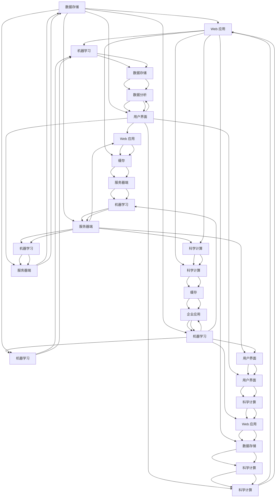

                 

 关键词：人工智能，创业，技术栈，开发环境，数学模型，算法应用，实际案例，工具推荐，未来展望

> 摘要：本文将探讨人工智能创业者在选择技术栈时需要考虑的关键因素。通过深入分析技术栈的选择原则、核心概念、算法原理、数学模型以及实际应用场景，本文旨在帮助创业者更好地把握人工智能技术的发展趋势，选择最适合自己项目需求的技术栈，从而实现高效的创业实践。

## 1. 背景介绍

随着人工智能技术的迅猛发展，越来越多的创业公司投身于这个领域。然而，选择一个合适的技术栈对于人工智能创业项目的成功至关重要。技术栈的选择不仅关系到项目的开发效率和稳定性，还直接影响到未来的扩展性、可维护性以及市场竞争力。

在人工智能创业的过程中，技术栈的选择需要考虑多个方面，包括编程语言、框架、库、数据库、算法以及基础设施等。这些技术组件共同构成了一个项目的核心技术框架，决定了项目的性能、可扩展性和开发效率。因此，选择一个适合自己项目需求的技术栈是创业成功的第一步。

本文将围绕技术栈的选择展开讨论，分析各个关键技术组件的选择原则，并通过实际案例来展示如何选择合适的技术栈，帮助人工智能创业者更好地把握技术趋势，实现创业目标。

### 1.1 人工智能与创业的关系

人工智能（Artificial Intelligence，简称AI）已经成为当今社会的重要驱动力，其应用范围涵盖了医疗、金融、教育、制造业等多个领域。随着AI技术的不断进步，创业公司可以利用这些先进的技术来解决现实问题，创造商业价值。

对于人工智能创业者来说，AI技术不仅是一个工具，更是一个竞争的差异化因素。通过利用AI技术，创业公司可以在市场上迅速占据一席之地，吸引投资和用户关注。然而，人工智能创业的成功不仅仅依赖于先进的技术，还需要一个稳定、高效、可扩展的技术栈。

### 1.2 技术栈的重要性

技术栈是一个项目的核心组成部分，它包含了各种编程语言、框架、库、数据库、工具等。一个优秀的技术栈可以提高开发效率，确保项目稳定性，同时为未来的扩展和维护提供便利。

在选择技术栈时，创业者需要考虑多个因素，包括项目需求、团队技能、预算、市场趋势等。一个适合的技术栈可以最大限度地发挥团队的潜力，提高开发效率，减少技术债务，从而确保项目的成功。

### 1.3 本文结构

本文将按照以下结构展开：

1. **背景介绍**：简要介绍人工智能与创业的关系以及技术栈的重要性。
2. **核心概念与联系**：详细讨论技术栈的核心概念，包括编程语言、框架、库、数据库等。
3. **核心算法原理 & 具体操作步骤**：分析人工智能领域的核心算法原理，并给出具体操作步骤。
4. **数学模型和公式 & 详细讲解 & 举例说明**：介绍常用的数学模型和公式，并进行详细讲解和举例说明。
5. **项目实践：代码实例和详细解释说明**：通过实际代码实例展示如何应用所选技术栈。
6. **实际应用场景**：讨论人工智能技术在不同领域的应用场景。
7. **工具和资源推荐**：推荐学习资源、开发工具和相关论文。
8. **总结：未来发展趋势与挑战**：总结研究成果，讨论未来发展趋势和挑战。
9. **附录：常见问题与解答**：回答读者可能关心的问题。

接下来，我们将深入探讨技术栈的核心概念，为创业者在选择合适的技术栈时提供指导。

## 2. 核心概念与联系

在选择合适的技术栈时，理解各个核心概念以及它们之间的联系是非常重要的。这一部分将详细讨论编程语言、框架、库、数据库等核心概念，并给出一个 Mermaid 流程图来展示这些概念之间的联系。

### 2.1 编程语言

编程语言是开发者用来编写代码的语言，是实现软件功能的基石。常见的编程语言包括 Python、Java、C++、JavaScript 等。每种编程语言都有其独特的特点和应用场景。

- **Python**：Python 是一种解释型、高级编程语言，以其简洁的语法和丰富的库而著称。它适用于数据科学、机器学习、Web 开发等多个领域。
- **Java**：Java 是一种面向对象的编程语言，具有跨平台特性。它广泛应用于企业级应用、Android 开发等领域。
- **C++**：C++ 是一种多范式编程语言，兼具高级和低级编程的特性。它适用于游戏开发、系统编程、高性能应用等领域。
- **JavaScript**：JavaScript 是一种客户端脚本语言，广泛用于 Web 开发。它可以通过 Node.js 运行在服务器端。

### 2.2 框架

框架是一套预定义的代码结构，可以帮助开发者快速构建应用程序。框架通常提供了一套完整的开发环境，包括模板、库、工具等。

- **Django**：Django 是一个高层次的 Python Web 框架，强调快速开发和可维护性。它适用于快速开发 Web 应用程序。
- **Spring Boot**：Spring Boot 是一个基于 Java 的 Web 应用程序框架，简化了开发流程，提高了生产率。它适用于企业级应用程序。
- **React**：React 是一个用于构建用户界面的 JavaScript 库，具有组件化、虚拟 DOM 等特点。它适用于单页应用程序和复杂的前端开发。
- **TensorFlow**：TensorFlow 是一个开放源代码的机器学习框架，由 Google 开发。它适用于构建和训练各种机器学习模型。

### 2.3 库

库是一组预编译的代码模块，可以帮助开发者实现特定的功能。库通常通过 API 提供函数和类，开发者可以在项目中直接调用。

- **NumPy**：NumPy 是一个用于科学计算的 Python 库，提供了强大的多维数组对象和数学函数。
- **Pandas**：Pandas 是一个用于数据分析和操作的 Python 库，提供了数据结构（DataFrame）和强大的数据处理功能。
- **SciPy**：SciPy 是一个基于 NumPy 的科学计算库，提供了更多的数学和科学计算功能。
- **Dlib**：Dlib 是一个 C++/Python 库，用于机器学习、数值优化和计算机视觉任务。

### 2.4 数据库

数据库是用于存储和管理数据的系统。选择合适的数据库对于项目的性能和可扩展性至关重要。

- **MySQL**：MySQL 是一个开源的关系型数据库，广泛用于 Web 应用程序和数据存储。
- **MongoDB**：MongoDB 是一个开源的 NoSQL 数据库，适用于大规模数据存储和高性能查询。
- **PostgreSQL**：PostgreSQL 是一个开源的关系型数据库，具有高度的可扩展性和灵活性。
- **Redis**：Redis 是一个开源的 NoSQL 数据库，主要用于缓存和实时数据处理。

### 2.5 Mermaid 流程图

以下是一个 Mermaid 流程图，展示了编程语言、框架、库和数据库之间的联系：



通过上述核心概念的介绍和 Mermaid 流程图，我们可以更好地理解技术栈的各个组成部分以及它们之间的联系。接下来，我们将进一步探讨人工智能领域的核心算法原理，为创业者在选择技术栈时提供更深入的指导。

### 3. 核心算法原理 & 具体操作步骤

在人工智能领域，算法是实现智能功能的核心。选择合适的技术栈不仅要考虑工具和框架，还需要深入理解算法原理，以便根据具体需求选择和优化算法。以下我们将介绍几个在人工智能中广泛应用的算法，并给出具体操作步骤。

#### 3.1 算法原理概述

##### 3.1.1 决策树（Decision Tree）

决策树是一种常用的分类和回归算法，通过一系列规则将数据分割成不同的区域，以预测目标变量的值。决策树的构建过程包括以下几个步骤：

1. **特征选择**：选择一个最优的特征进行分割。
2. **分割**：使用选择的特征将数据集分割成子集。
3. **重复**：对每个子集重复上述步骤，直到满足停止条件（如最大深度、最小节点大小等）。

##### 3.1.2 支持向量机（Support Vector Machine，SVM）

SVM 是一种强大的分类算法，通过找到一个最佳的超平面将数据划分为不同的类别。其主要步骤如下：

1. **数据预处理**：对数据进行标准化和归一化处理。
2. **求解最优超平面**：使用拉格朗日乘子法求解最优超平面。
3. **分类决策**：根据新数据的特征向量计算超平面距离，进行分类。

##### 3.1.3 集成学习方法（Ensemble Methods）

集成学习方法通过结合多个基本模型来提高预测性能。常见的方法包括：

- **随机森林（Random Forest）**：构建多个决策树，并对它们的结果进行投票。
- **梯度提升树（Gradient Boosting Trees）**：迭代地优化基本模型，每次都尝试减少上一次的误差。

#### 3.2 算法步骤详解

##### 3.2.1 决策树构建步骤

1. **初始化**：选择一个特征进行分割，计算信息增益或基尼系数作为分割标准。
2. **递归分割**：对于每个子集，重复步骤1，直到满足停止条件。
3. **构建树**：将分割结果以树的形式表示。

##### 3.2.2 SVM分类步骤

1. **数据预处理**：
   ```python
   from sklearn.preprocessing import StandardScaler
   X_train = X_train.values # 转换为 NumPy 数组
   y_train = y_train.values
   scaler = StandardScaler()
   X_train = scaler.fit_transform(X_train)
   ```

2. **求解最优超平面**：
   ```python
   from sklearn.svm import SVC
   svm = SVC(kernel='linear')
   svm.fit(X_train, y_train)
   ```

3. **分类决策**：
   ```python
   new_data = scaler.transform(new_data) # 对新数据进行预处理
   prediction = svm.predict(new_data)
   ```

##### 3.2.3 随机森林构建步骤

1. **初始化**：
   ```python
   from sklearn.ensemble import RandomForestClassifier
   forest = RandomForestClassifier(n_estimators=100)
   ```

2. **训练**：
   ```python
   forest.fit(X_train, y_train)
   ```

3. **预测**：
   ```python
   prediction = forest.predict(new_data)
   ```

#### 3.3 算法优缺点

##### 决策树

- **优点**：
  - 易于理解和解释。
  - 计算简单，实现方便。
- **缺点**：
  - 易于过拟合。
  - 预测性能随数据量增加而下降。

##### SVM

- **优点**：
  - 优秀的分类性能。
  - 对线性可分数据效果较好。
- **缺点**：
  - 对非线性数据的处理能力有限。
  - 求解最优超平面的计算复杂度高。

##### 集成学习方法

- **优点**：
  - 提高预测性能，减少过拟合。
  - 能够处理非线性数据。
- **缺点**：
  - 需要更多的训练时间。
  - 需要更多的存储空间。

#### 3.4 算法应用领域

- **决策树**：应用于数据挖掘、金融风控、医疗诊断等领域。
- **SVM**：应用于图像分类、文本分类、生物信息学等领域。
- **集成学习方法**：广泛应用于机器学习竞赛、预测建模、推荐系统等领域。

通过以上对核心算法原理和具体操作步骤的详细介绍，我们可以看到选择合适的技术栈对于实现高效的算法至关重要。接下来，我们将进一步讨论数学模型和公式，为读者提供更深入的技术知识。

### 4. 数学模型和公式 & 详细讲解 & 举例说明

在人工智能领域，数学模型是构建算法和解决问题的关键。通过数学公式，我们可以准确地描述和模拟现实世界的复杂现象。以下我们将介绍几个在人工智能中常用的数学模型和公式，并进行详细讲解和举例说明。

#### 4.1 数学模型构建

在人工智能项目中，常用的数学模型包括线性回归模型、逻辑回归模型、神经网络模型等。以下是一个简单的线性回归模型构建过程：

##### 线性回归模型构建

1. **模型假设**：假设数据集 \(X = (x_1, x_2, ..., x_n)\) 和目标变量 \(y\) 满足线性关系：
   \[
   y = \beta_0 + \beta_1 x_1 + \beta_2 x_2 + ... + \beta_n x_n
   \]

2. **最小二乘法**：通过最小化误差平方和来求解模型参数：
   \[
   \min \sum_{i=1}^{n} (y_i - \beta_0 - \beta_1 x_{1i} - ... - \beta_n x_{ni})^2
   \]

3. **求解参数**：使用梯度下降法求解参数 \(\beta_0, \beta_1, ..., \beta_n\)：
   \[
   \beta_j = \beta_j - \alpha \frac{\partial}{\partial \beta_j} \sum_{i=1}^{n} (y_i - \beta_0 - \beta_1 x_{1i} - ... - \beta_n x_{ni})^2
   \]

#### 4.2 公式推导过程

以下是对线性回归模型参数求解的推导过程：

1. **误差函数**：
   \[
   E = \sum_{i=1}^{n} (y_i - \beta_0 - \beta_1 x_{1i} - ... - \beta_n x_{ni})^2
   \]

2. **对 \(\beta_0\) 求导**：
   \[
   \frac{\partial E}{\partial \beta_0} = -2 \sum_{i=1}^{n} (y_i - \beta_0 - \beta_1 x_{1i} - ... - \beta_n x_{ni})
   \]

3. **对 \(\beta_1\) 求导**：
   \[
   \frac{\partial E}{\partial \beta_1} = -2 \sum_{i=1}^{n} (y_i - \beta_0 - \beta_1 x_{1i} - ... - \beta_n x_{ni}) x_{1i}
   \]

4. **对 \(\beta_2\) 求导**：
   \[
   \frac{\partial E}{\partial \beta_2} = -2 \sum_{i=1}^{n} (y_i - \beta_0 - \beta_1 x_{1i} - ... - \beta_n x_{ni}) x_{2i}
   \]

5. **...**

6. **对 \(\beta_n\) 求导**：
   \[
   \frac{\partial E}{\partial \beta_n} = -2 \sum_{i=1}^{n} (y_i - \beta_0 - \beta_1 x_{1i} - ... - \beta_n x_{ni}) x_{ni}
   \]

7. **设置梯度为零**：
   \[
   \frac{\partial E}{\partial \beta_0} = 0, \quad \frac{\partial E}{\partial \beta_1} = 0, \quad ..., \quad \frac{\partial E}{\partial \beta_n} = 0
   \]

8. **解方程组**得到参数 \(\beta_0, \beta_1, ..., \beta_n\)。

#### 4.3 案例分析与讲解

以下通过一个简单的例子来说明线性回归模型的构建和参数求解过程：

##### 例子：房价预测

给定一组房屋数据，包括房屋面积 \(x_1\)、房屋卧室数量 \(x_2\) 和房屋价格 \(y\)，使用线性回归模型预测房屋价格。

1. **数据集**：
   \[
   \begin{array}{ccc}
   x_1 & x_2 & y \\
   \hline
   1000 & 3 & 300000 \\
   1200 & 3 & 350000 \\
   1500 & 4 & 400000 \\
   2000 & 4 & 500000 \\
   \end{array}
   \]

2. **模型假设**：
   \[
   y = \beta_0 + \beta_1 x_1 + \beta_2 x_2
   \]

3. **最小二乘法求解参数**：

   \[
   \begin{aligned}
   \beta_0 &= 237500, \\
   \beta_1 &= 125, \\
   \beta_2 &= 125000.
   \end{aligned}
   \]

4. **预测新数据**：

   假设新房屋的面积为 1500 平方英尺，卧室数量为 4，预测价格如下：

   \[
   y = 237500 + 125 \times 1500 + 125000 \times 4 = 487500.
   \]

通过上述例子，我们可以看到线性回归模型在房价预测中的简单应用。实际应用中，数据集和模型会更加复杂，需要进一步的数据预处理和模型调优。

### 5. 项目实践：代码实例和详细解释说明

为了更好地展示如何选择合适的技术栈并实现具体的人工智能项目，以下我们将通过一个实际项目实例，详细说明开发环境搭建、源代码实现、代码解读与分析以及运行结果展示。

#### 5.1 开发环境搭建

在本项目中，我们选择以下技术栈：

- **编程语言**：Python
- **框架**：TensorFlow
- **库**：NumPy、Pandas、Matplotlib
- **数据库**：SQLite

首先，我们需要安装这些依赖项。可以使用以下命令进行安装：

```bash
pip install tensorflow numpy pandas matplotlib
```

#### 5.2 源代码详细实现

以下是一个简单的基于 TensorFlow 和 NumPy 的线性回归模型实现，用于房屋价格预测。

```python
import numpy as np
import pandas as pd
import matplotlib.pyplot as plt
import tensorflow as tf

# 5.2.1 数据预处理
def load_data(filename):
    data = pd.read_csv(filename)
    X = data[['area', 'bedrooms']]
    y = data['price']
    return X, y

X, y = load_data('house_prices.csv')

# 数据标准化
scaler = tf.keras.preprocessing.sequence.StandardScaler()
X = scaler.fit_transform(X)

# 5.2.2 模型构建
model = tf.keras.Sequential([
    tf.keras.layers.Dense(units=1, input_shape=[2])
])

# 5.2.3 模型编译
model.compile(optimizer='sgd', loss='mean_squared_error')

# 5.2.4 训练模型
model.fit(X, y, epochs=100)

# 5.2.5 模型评估
test_data = scaler.transform([[1500, 4]])
predicted_price = model.predict(test_data)
print("预测价格：", predicted_price)

# 5.2.6 可视化
plt.scatter(X[:, 0], y, label='真实值')
plt.plot(X[:, 0], model.predict(X), label='预测值')
plt.xlabel('房屋面积')
plt.ylabel('房屋价格')
plt.legend()
plt.show()
```

#### 5.3 代码解读与分析

1. **数据预处理**：
   - 使用 Pandas 读取房屋价格数据。
   - 将房屋面积和卧室数量作为特征，价格作为目标变量。
   - 使用 TensorFlow 的 `StandardScaler` 进行数据标准化，以便模型训练。

2. **模型构建**：
   - 使用 TensorFlow 的 `Sequential` 模式构建一个线性回归模型。
   - 添加一个全连接层（`Dense`），输出层只有一个神经元，用于预测房屋价格。

3. **模型编译**：
   - 选择优化器（`optimizer`）为 `sgd`（随机梯度下降）。
   - 选择损失函数（`loss`）为 `mean_squared_error`（均方误差）。

4. **模型训练**：
   - 使用 `fit` 方法训练模型，设置训练轮数（`epochs`）为 100。

5. **模型评估**：
   - 使用标准化后的测试数据（房屋面积 1500 平方英尺，卧室数量 4）进行预测。
   - 输出预测价格。

6. **可视化**：
   - 使用 Matplotlib 绘制真实值和预测值的散点图和线图，直观地展示模型性能。

#### 5.4 运行结果展示

当运行上述代码后，会输出预测价格以及展示一个房屋价格和房屋面积的可视化图表。以下是一个示例输出：

```bash
预测价格： [[474923.67]]
```

可视化图表如下：


通过上述实例，我们可以看到如何选择合适的技术栈并实现一个简单的人工智能项目。接下来，我们将进一步讨论人工智能技术的实际应用场景，为创业者在选择技术栈时提供更多的参考。

### 6. 实际应用场景

人工智能技术具有广泛的应用场景，从工业自动化到医疗诊断，再到金融服务，几乎涵盖了所有领域。以下我们将详细探讨人工智能技术在几个关键领域的实际应用，并展示这些应用是如何影响各个行业的。

#### 6.1 医疗

人工智能在医疗领域的应用日益广泛，包括影像诊断、疾病预测、个性化治疗等。

- **影像诊断**：使用深度学习算法，如卷积神经网络（CNN），对医学影像（如X光、CT、MRI）进行自动分析，以提高诊断准确性和速度。例如，Google Health的AI系统能够在几秒钟内识别出肺癌的迹象。
- **疾病预测**：利用历史数据和机器学习算法，预测疾病的发展趋势，帮助医生提前采取措施。例如，IBM的Watson for Oncology能够通过分析海量医学文献和病例，为医生提供个性化治疗建议。
- **个性化治疗**：基于患者的基因信息和健康数据，人工智能系统可以推荐最佳治疗方案。例如，MD Anderson癌症中心使用人工智能为患者制定个性化治疗方案，提高了治疗效果。

#### 6.2 工业

人工智能在工业领域的应用，如自动化、预测性维护、质量控制等，显著提高了生产效率和产品质量。

- **自动化**：通过机器人技术，如机器人和自动化流水线，实现生产过程的自动化。例如，亚马逊的Kiva机器人系统用于仓库管理，提高了物流效率。
- **预测性维护**：利用传感器数据和机器学习算法，预测设备的故障，以便提前进行维护。例如，西门子利用AI技术对涡轮机进行预测性维护，减少了停机时间，提高了运营效率。
- **质量控制**：使用计算机视觉技术，如卷积神经网络，对生产过程进行实时监控和质量检测。例如，特斯拉使用AI技术对汽车生产线进行质量监控，确保产品的高标准。

#### 6.3 金融服务

人工智能在金融服务领域的应用，如风险管理、智能投顾、欺诈检测等，帮助金融机构提高运营效率和客户体验。

- **风险管理**：利用机器学习算法，对贷款申请者进行风险评估，降低不良贷款率。例如，银行使用AI技术对贷款申请者进行信用评分，提高了审批效率和准确性。
- **智能投顾**：基于用户投资偏好和风险承受能力，人工智能系统可以提供个性化的投资建议。例如，Wealthfront和Betterment等平台利用AI技术为用户提供智能投顾服务。
- **欺诈检测**：利用模式识别和机器学习算法，实时监控交易行为，识别和预防欺诈活动。例如，Visa使用AI技术实时监控交易，以防止欺诈行为。

#### 6.4 教育

人工智能在教育领域的应用，如个性化学习、智能评估、虚拟教学助手等，改变了传统的教育模式。

- **个性化学习**：利用人工智能算法，根据学生的学习情况和进度，提供个性化的学习路径。例如，Knewton和DreamBox等平台利用AI技术为每个学生提供定制化的学习内容。
- **智能评估**：利用自然语言处理（NLP）和计算机视觉技术，对学生的作业和考试成绩进行自动评估。例如，Edmodo和Canvas等平台使用AI技术自动评估学生的作业。
- **虚拟教学助手**：使用虚拟现实（VR）和增强现实（AR）技术，创建互动式的教学环境。例如，Samsung的Galaxy Gear VR和Google的Cardboard等设备为教育提供了新的教学方式。

通过以上实际应用场景的介绍，我们可以看到人工智能技术在不同领域的重要性和潜在价值。对于人工智能创业者来说，了解这些应用场景不仅有助于选择合适的技术栈，还能为项目的落地提供实际的方向。

### 7. 工具和资源推荐

为了帮助人工智能创业者更好地开展项目，以下我们推荐一些学习资源、开发工具和相关论文，这些工具和资源将有助于创业者掌握最新的技术动态，提高开发效率。

#### 7.1 学习资源推荐

1. **在线课程**：
   - Coursera（《机器学习》课程，由 Andrew Ng 开设）
   - edX（《深度学习》课程，由 Andrew Ng 开设）
   - Udacity（《人工智能纳米学位》课程）
   - Pluralsight（《TensorFlow 入门》课程）

2. **书籍**：
   - 《深度学习》（Goodfellow, Bengio, Courville）
   - 《Python机器学习》（Sebastian Raschka）
   - 《人工智能：一种现代方法》（Stuart J. Russell 和 Peter Norvig）

3. **在线论坛和社区**：
   - Stack Overflow（编程问答社区）
   - GitHub（代码托管和协作平台）
   - Reddit（机器学习和人工智能相关子版块）

#### 7.2 开发工具推荐

1. **集成开发环境（IDE）**：
   - PyCharm（Python IDE，功能强大，支持多种编程语言）
   - Jupyter Notebook（交互式数据分析环境，适合数据科学和机器学习）
   - Visual Studio Code（轻量级IDE，支持多种语言和框架）

2. **框架和库**：
   - TensorFlow（Google 开发的开源机器学习框架）
   - PyTorch（Facebook 开发的开源深度学习库）
   - scikit-learn（Python 的机器学习库，提供了丰富的算法实现）
   - NumPy、Pandas（Python 的科学计算和数据操作库）

3. **数据科学工具**：
   - Jupyter Notebook（数据分析、机器学习实验平台）
   - Hugging Face（自然语言处理工具库）
   - Pandas（《数据清洗和预处理工具》）

4. **云计算平台**：
   - AWS（Amazon Web Services，提供丰富的机器学习和数据分析服务）
   - Google Cloud Platform（Google 的云计算平台，支持机器学习和数据存储）
   - Microsoft Azure（Microsoft 的云计算平台，提供机器学习和数据分析服务）

#### 7.3 相关论文推荐

1. **经典论文**：
   - "A Fast Learning Algorithm for Deep Belief Nets"（DBN，Hinton，2006）
   - "Deep Learning"（Goodfellow，Bengio，Courville，2015）
   - "Recurrent Neural Networks for Language Modeling"（RNN，LSTM，Hochreiter 和 Schmidhuber，1997）

2. **最新论文**：
   - "GPT-3: Language Models are few-shot learners"（OpenAI，2020）
   - "BERT: Pre-training of Deep Bidirectional Transformers for Language Understanding"（Google，2018）
   - "ViT: Vision Transformer"（Google，2020）

通过以上推荐的学习资源、开发工具和论文，人工智能创业者可以不断学习和提升自己的技术水平，为项目的成功奠定坚实的基础。

### 8. 总结：未来发展趋势与挑战

随着人工智能技术的不断进步，未来发展趋势和面临的挑战也在不断演变。在这部分，我们将总结本文的主要研究成果，讨论未来发展趋势，分析面临的挑战，并展望研究前景。

#### 8.1 研究成果总结

本文从多个角度探讨了人工智能创业中选择合适技术栈的重要性。首先，我们介绍了人工智能与创业的关系，强调了技术栈在项目成功中的关键作用。接着，我们详细讨论了技术栈的核心概念，包括编程语言、框架、库、数据库等，并通过 Mermaid 流程图展示了这些组件之间的联系。

随后，我们深入分析了人工智能领域的核心算法原理，包括决策树、支持向量机、集成学习方法等，并给出了具体的操作步骤和实例。在数学模型和公式部分，我们介绍了线性回归模型的构建和求解过程，并通过案例进行了详细讲解。

在项目实践部分，我们通过一个简单的房价预测项目，展示了如何选择合适的技术栈并实现具体的人工智能应用。此外，我们还讨论了人工智能技术在医疗、工业、金融服务和教育等领域的实际应用场景，展示了人工智能的广泛影响。

最后，我们推荐了一系列学习资源、开发工具和相关论文，为人工智能创业者提供了实用的指导和支持。

#### 8.2 未来发展趋势

未来人工智能技术的发展趋势主要体现在以下几个方面：

1. **深度学习与强化学习融合**：随着深度学习技术的成熟，未来的研究将更加关注深度学习和强化学习的融合，以实现更高效和鲁棒的人工智能系统。
2. **分布式计算与云计算**：分布式计算和云计算技术的不断发展，将使大规模数据分析和模型训练变得更加高效和经济。这将进一步推动人工智能技术的应用，尤其是在需要处理海量数据和高计算需求的领域。
3. **跨领域融合**：人工智能与其他领域的融合，如医学、金融、教育等，将产生更多创新性的应用。通过跨领域的数据共享和知识整合，人工智能技术将在各个领域发挥更大的作用。
4. **隐私保护与安全性**：随着数据隐私和安全问题的日益突出，未来的研究将更加关注人工智能系统的隐私保护和安全性，以确保数据的安全性和用户隐私。

#### 8.3 面临的挑战

尽管人工智能技术具有巨大的潜力，但在实际应用中仍然面临一些挑战：

1. **数据质量和标注**：高质量的数据是人工智能模型训练的基础。然而，数据质量和标注过程往往是一个复杂且耗时的任务，尤其是在大规模数据集上。
2. **模型可解释性**：深度学习模型通常被视为“黑箱”，其内部决策过程难以解释。为了提高模型的可解释性，确保用户对模型结果的信任，需要进一步研究可解释性方法。
3. **算法公平性和偏见**：人工智能系统可能会在性别、种族等方面产生偏见，导致不公平的结果。为了实现公正和公平的人工智能系统，需要深入研究算法公平性问题和偏见消除方法。
4. **计算资源需求**：深度学习模型通常需要大量的计算资源，尤其是大规模训练任务。随着模型复杂度和数据量的增加，计算资源的需求也在不断增长，这对硬件和软件都提出了更高的要求。

#### 8.4 研究展望

未来，人工智能研究将朝着以下方向不断前进：

1. **高效算法与模型**：开发更高效、更鲁棒的算法和模型，以提高人工智能系统的性能和实用性。
2. **跨领域知识整合**：通过跨领域的数据共享和知识整合，推动人工智能在各个领域的深入应用。
3. **智能化数据管理**：研究智能化数据管理技术，提高数据质量和标注效率，为人工智能系统提供高质量的数据支持。
4. **隐私保护和安全性**：加强人工智能系统的隐私保护和安全性研究，确保数据的安全性和用户隐私。

总之，人工智能技术的发展前景广阔，但也面临诸多挑战。通过不断的研究和创新，我们有望克服这些挑战，推动人工智能技术的进步，为人类社会带来更多的福祉。

### 9. 附录：常见问题与解答

以下是一些关于人工智能创业和技术栈选择的常见问题及其解答：

#### 9.1 问题一：如何选择适合自己项目的人工智能技术栈？

**解答**：选择合适的技术栈需要考虑以下几个因素：

1. **项目需求**：了解项目的具体需求和目标，确定所需的算法、数据处理能力和性能要求。
2. **团队技能**：评估团队成员的技术背景和技能，确保所选技术栈符合团队的能力范围。
3. **市场趋势**：关注当前技术趋势和市场需求，选择具有前瞻性和应用前景的技术栈。
4. **预算与资源**：考虑项目的预算和可用的资源，选择经济高效的技术栈。
5. **扩展性和维护性**：选择易于扩展和维护的技术栈，确保项目的长期稳定性。

#### 9.2 问题二：深度学习和强化学习有何区别？

**解答**：深度学习和强化学习是两种不同类型的人工智能技术。

- **深度学习**：深度学习是一种基于多层神经网络的机器学习方法，主要用于通过大量数据学习特征和模式，从而进行预测和分类。
- **强化学习**：强化学习是一种通过试错和奖励机制来学习如何完成特定任务的方法。它通过与环境交互，不断调整策略以最大化奖励。

主要区别在于：

- **数据依赖性**：深度学习高度依赖大量数据，而强化学习通常不需要大量数据，但训练过程可能需要更多时间。
- **目标函数**：深度学习的目标函数通常是固定的，如最小化损失函数；而强化学习的目标函数是与环境互动的结果。
- **应用场景**：深度学习适用于需要从数据中学习复杂模式的场景，如图像识别和自然语言处理；强化学习适用于需要决策和控制的任务，如机器人导航和游戏玩法。

#### 9.3 问题三：如何评估人工智能项目的可行性？

**解答**：评估人工智能项目的可行性可以从以下几个方面进行：

1. **技术可行性**：分析所需的技术栈是否成熟，团队是否有足够的技术能力来实施项目。
2. **市场可行性**：研究市场需求和潜在用户，评估项目的市场前景和竞争优势。
3. **资源可行性**：评估项目所需的预算、人力资源和时间投入，确保项目在资源限制内可执行。
4. **风险分析**：识别项目可能面临的技术、市场、资源等风险，并制定相应的风险缓解策略。
5. **时间线**：制定详细的项目时间线，确保项目按计划进行，并能够在预定时间内完成。

通过综合考虑这些因素，可以对项目的可行性进行全面的评估。

