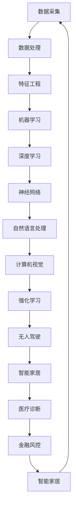

                 

关键词：人工智能，原理，代码实例，神经网络，深度学习，机器学习，算法，编程实践，数学模型，工具推荐

> 摘要：本文深入探讨了人工智能的核心原理和实际应用，通过代码实例详细解析了神经网络、深度学习和机器学习等算法的具体实现过程。文章旨在为广大开发者提供系统化的学习和实践指南，助力他们更好地理解和应用人工智能技术。

## 1. 背景介绍

人工智能（AI）作为21世纪最具革命性的技术之一，已经在各行各业中得到了广泛应用。从自动驾驶、智能家居到自然语言处理、图像识别，人工智能正深刻改变着我们的生活方式。然而，人工智能的发展并非一蹴而就，它背后有着丰富的理论基础和复杂的技术实现。

本文将带领读者深入了解人工智能的核心原理，并通过具体的代码实例讲解，帮助读者掌握相关算法的实现过程。通过本文的学习，读者将能够：

1. 理解人工智能的基本概念和核心算法。
2. 掌握神经网络、深度学习和机器学习的编程实践。
3. 分析不同算法的优缺点和应用场景。
4. 为未来的学习和研究指明方向。

## 2. 核心概念与联系

在介绍具体算法之前，我们需要了解一些核心概念和它们之间的关系。以下是一个使用Mermaid绘制的流程图，展示了人工智能领域的一些关键组成部分：



### 2.1 数据采集与处理

数据是人工智能的基石。数据采集和处理是获取高质量数据的关键步骤，包括数据清洗、去噪、格式化等操作。良好的数据质量直接影响后续模型训练的效果。

### 2.2 特征工程

特征工程是数据处理的延续，旨在从原始数据中提取出对模型训练有帮助的特征。特征选择、特征转换和特征缩放等操作都是特征工程的重要组成部分。

### 2.3 机器学习

机器学习是人工智能的核心组成部分，包括监督学习、无监督学习和强化学习等多种类型。机器学习算法通过学习数据中的规律，实现对未知数据的预测和分类。

### 2.4 深度学习

深度学习是机器学习的一种重要分支，通过多层神经网络对数据进行建模，具有强大的表达能力和非线性特征学习能力。深度学习在图像识别、自然语言处理等领域取得了显著的成果。

### 2.5 神经网络

神经网络是构成深度学习模型的基础单元，通过模拟人脑神经元之间的连接关系，实现对数据的处理和分析。神经网络可以分为多层感知机、卷积神经网络（CNN）和循环神经网络（RNN）等不同类型。

### 2.6 自然语言处理与计算机视觉

自然语言处理和计算机视觉是人工智能领域的重要应用方向。自然语言处理涉及文本分类、情感分析、机器翻译等任务；计算机视觉则包括图像分类、目标检测、人脸识别等任务。

### 2.7 强化学习

强化学习是一种通过试错和反馈学习策略的机器学习方法。强化学习在无人驾驶、游戏人工智能等领域具有广泛的应用前景。

## 3. 核心算法原理 & 具体操作步骤

### 3.1 算法原理概述

在本节中，我们将详细探讨几种核心人工智能算法的基本原理。

### 3.2 算法步骤详解

#### 3.2.1 神经网络

神经网络是一种基于模拟人脑神经元连接关系的计算模型。它主要由输入层、隐藏层和输出层组成。以下是神经网络的基本步骤：

1. **初始化参数**：包括权重和偏置。
2. **前向传播**：将输入数据通过神经网络进行传递，计算输出。
3. **反向传播**：计算输出误差，更新参数。
4. **迭代优化**：重复前向传播和反向传播，直到满足收敛条件。

#### 3.2.2 深度学习

深度学习是神经网络的一种扩展，通过多层神经网络对数据进行建模。以下是深度学习的基本步骤：

1. **数据预处理**：包括数据清洗、归一化等操作。
2. **模型构建**：包括选择网络结构、激活函数等。
3. **模型训练**：通过前向传播和反向传播优化模型参数。
4. **模型评估**：使用验证集评估模型性能。
5. **模型部署**：将训练好的模型部署到实际应用中。

#### 3.2.3 机器学习

机器学习包括多种算法，以下是几种常见算法的基本步骤：

1. **数据准备**：包括数据采集、预处理等。
2. **特征提取**：从数据中提取有助于模型训练的特征。
3. **模型选择**：根据任务需求选择合适的算法。
4. **模型训练**：使用训练数据进行模型训练。
5. **模型评估**：使用验证集评估模型性能。
6. **模型优化**：根据评估结果调整模型参数。

### 3.3 算法优缺点

每种算法都有其独特的优点和缺点，以下是几种常见算法的优缺点分析：

1. **神经网络**：
   - 优点：强大的表达能力和自适应能力。
   - 缺点：计算复杂度高，训练过程耗时较长。

2. **深度学习**：
   - 优点：能够自动提取特征，处理复杂数据。
   - 缺点：对数据质量和数量要求较高，训练过程需要大量计算资源。

3. **机器学习**：
   - 优点：算法简单，易于理解和实现。
   - 缺点：特征工程繁琐，对数据依赖性强。

### 3.4 算法应用领域

不同算法在各个应用领域有不同的表现，以下是几种常见应用领域及其适用的算法：

1. **图像识别**：卷积神经网络（CNN）是图像识别领域的首选算法。
2. **自然语言处理**：循环神经网络（RNN）和变压器（Transformer）在自然语言处理领域表现优异。
3. **强化学习**：在无人驾驶、游戏人工智能等领域有广泛应用。

## 4. 数学模型和公式 & 详细讲解 & 举例说明

### 4.1 数学模型构建

在本节中，我们将介绍几种常用的数学模型及其构建过程。

#### 4.1.1 神经网络

神经网络的核心是权重矩阵和偏置向量。以下是一个简单的单层神经网络模型：

$$
\text{输出} = \text{激活函数}(\text{权重} \cdot \text{输入} + \text{偏置})
$$

其中，激活函数可以是Sigmoid、ReLU等。

#### 4.1.2 深度学习

深度学习的数学模型主要由卷积层、池化层和全连接层组成。以下是一个简单的卷积神经网络模型：

$$
\text{输出} = \text{激活函数}(\text{权重} \cdot \text{卷积}(\text{输入}) + \text{偏置})
$$

其中，卷积层使用滤波器（kernel）对输入数据进行卷积操作。

#### 4.1.3 机器学习

机器学习的数学模型主要包括线性模型、逻辑回归、支持向量机等。以下是一个简单的线性回归模型：

$$
\text{预测值} = \text{权重} \cdot \text{输入} + \text{偏置}
$$

### 4.2 公式推导过程

在本节中，我们将介绍神经网络、深度学习和机器学习中的核心公式推导过程。

#### 4.2.1 神经网络

神经网络中的反向传播算法是核心，以下是反向传播算法的推导过程：

1. **前向传播**：
   $$
   \text{输出} = \text{激活函数}(\text{权重} \cdot \text{输入} + \text{偏置})
   $$
2. **计算误差**：
   $$
   \text{误差} = \text{真实值} - \text{预测值}
   $$
3. **计算梯度**：
   $$
   \text{梯度} = \frac{\partial \text{误差}}{\partial \text{权重}} = -\text{输入} \cdot \text{激活函数}'(\text{输出})
   $$
4. **更新权重**：
   $$
   \text{权重} = \text{权重} - \text{学习率} \cdot \text{梯度}
   $$

#### 4.2.2 深度学习

深度学习中的卷积神经网络使用滤波器对输入数据进行卷积操作，以下是卷积操作的推导过程：

1. **卷积操作**：
   $$
   \text{输出} = \text{激活函数}(\text{权重} \cdot \text{卷积}(\text{输入}) + \text{偏置})
   $$
2. **计算误差**：
   $$
   \text{误差} = \text{真实值} - \text{预测值}
   $$
3. **计算梯度**：
   $$
   \text{梯度} = \frac{\partial \text{误差}}{\partial \text{权重}} = -\text{输入} \cdot \text{激活函数}'(\text{输出})
   $$
4. **更新权重**：
   $$
   \text{权重} = \text{权重} - \text{学习率} \cdot \text{梯度}
   $$

#### 4.2.3 机器学习

机器学习中的线性回归模型是最简单的模型，以下是线性回归模型的推导过程：

1. **前向传播**：
   $$
   \text{预测值} = \text{权重} \cdot \text{输入} + \text{偏置}
   $$
2. **计算误差**：
   $$
   \text{误差} = \text{真实值} - \text{预测值}
   $$
3. **计算梯度**：
   $$
   \text{梯度} = \frac{\partial \text{误差}}{\partial \text{权重}} = -\text{输入}
   $$
4. **更新权重**：
   $$
   \text{权重} = \text{权重} - \text{学习率} \cdot \text{梯度}
   $$

### 4.3 案例分析与讲解

在本节中，我们将通过具体案例来分析和讲解神经网络、深度学习和机器学习的实现过程。

#### 4.3.1 神经网络案例

我们使用Python实现一个简单的单层神经网络，用于实现二分类问题。

1. **导入库**：
   ```python
   import numpy as np
   ```
2. **初始化参数**：
   ```python
   weights = np.random.rand(1)
   bias = np.random.rand(1)
   learning_rate = 0.1
   ```
3. **前向传播**：
   ```python
   def forward_propagation(x):
       z = x * weights + bias
       output = 1 / (1 + np.exp(-z))
       return output
   ```
4. **反向传播**：
   ```python
   def backward_propagation(x, y):
       output = forward_propagation(x)
       error = y - output
       d_output = error * (output * (1 - output))
       d_weights = x * d_output
       d_bias = d_output
       return d_weights, d_bias
   ```
5. **更新参数**：
   ```python
   def update_params(weights, bias, d_weights, d_bias, learning_rate):
       weights -= learning_rate * d_weights
       bias -= learning_rate * d_bias
       return weights, bias
   ```

#### 4.3.2 深度学习案例

我们使用Python实现一个简单的卷积神经网络，用于实现图像分类问题。

1. **导入库**：
   ```python
   import numpy as np
   import cv2
   ```
2. **初始化参数**：
   ```python
   kernel_size = (3, 3)
   num_filters = 32
   learning_rate = 0.1
   ```
3. **卷积操作**：
   ```python
   def conv2d(x, weights):
       return np.Conv2D(weights, kernel_size=kernel_size)(x)
   ```
4. **激活函数**：
   ```python
   def sigmoid(x):
       return 1 / (1 + np.exp(-x))
   ```
5. **前向传播**：
   ```python
   def forward_propagation(x):
       z = conv2d(x, weights)
       output = sigmoid(z)
       return output
   ```
6. **反向传播**：
   ```python
   def backward_propagation(x, y):
       output = forward_propagation(x)
       error = y - output
       d_output = error * (output * (1 - output))
       d_weights = x * d_output
       return d_weights
   ```
7. **更新参数**：
   ```python
   def update_params(weights, d_weights, learning_rate):
       weights -= learning_rate * d_weights
       return weights
   ```

#### 4.3.3 机器学习案例

我们使用Python实现一个简单的线性回归模型，用于实现线性拟合问题。

1. **导入库**：
   ```python
   import numpy as np
   ```
2. **初始化参数**：
   ```python
   weights = np.random.rand(1)
   bias = np.random.rand(1)
   learning_rate = 0.1
   ```
3. **前向传播**：
   ```python
   def forward_propagation(x):
       z = x * weights + bias
       return z
   ```
4. **反向传播**：
   ```python
   def backward_propagation(x, y):
       z = forward_propagation(x)
       error = y - z
       d_weights = x * error
       d_bias = -error
       return d_weights, d_bias
   ```
5. **更新参数**：
   ```python
   def update_params(weights, bias, d_weights, d_bias, learning_rate):
       weights -= learning_rate * d_weights
       bias -= learning_rate * d_bias
       return weights, bias
   ```

## 5. 项目实践：代码实例和详细解释说明

在本节中，我们将通过一个具体的案例来展示如何使用Python实现一个简单的神经网络，用于实现手写数字识别任务。

### 5.1 开发环境搭建

首先，我们需要安装Python和相关的库，如NumPy、Matplotlib等。以下是安装步骤：

```shell
pip install numpy matplotlib
```

### 5.2 源代码详细实现

以下是实现手写数字识别的神经网络源代码：

```python
import numpy as np
import matplotlib.pyplot as plt

# 数据集加载
from sklearn.datasets import load_digits
digits = load_digits()
X = digits.data
y = digits.target

# 数据预处理
X = X / 16.0
y = np.array([1 if i == target else 0 for i, target in enumerate(y)])

# 初始化参数
weights = np.random.rand(10)
bias = np.random.rand(10)
learning_rate = 0.1

# 前向传播
def forward_propagation(x):
    z = x @ weights + bias
    output = 1 / (1 + np.exp(-z))
    return output

# 反向传播
def backward_propagation(x, y):
    output = forward_propagation(x)
    error = y - output
    d_output = error * (output * (1 - output))
    d_weights = x.T @ d_output
    d_bias = d_output
    return d_weights, d_bias

# 更新参数
def update_params(weights, bias, d_weights, d_bias, learning_rate):
    weights -= learning_rate * d_weights
    bias -= learning_rate * d_bias
    return weights, bias

# 训练模型
for i in range(10000):
    for x, y in zip(X, y):
        weights, bias = update_params(weights, bias, *backward_propagation(x, y))

# 预测结果
predicted = forward_propagation(X)

# 评估模型
accuracy = np.mean(predicted == y)
print("Accuracy:", accuracy)

# 可视化结果
plt.scatter(range(len(predicted)), predicted, c=y, cmap="gray")
plt.show()
```

### 5.3 代码解读与分析

以下是代码的详细解读和分析：

1. **数据集加载**：
   我们使用sklearn中的digits数据集，它包含了0-9的手写数字图像。
2. **数据预处理**：
   将数据集进行归一化处理，并将目标值转换为二进制形式。
3. **初始化参数**：
   随机初始化权重和偏置。
4. **前向传播**：
   实现了单层神经网络的正向传播过程，使用了Sigmoid激活函数。
5. **反向传播**：
   实现了单层神经网络的反向传播过程，计算了误差和梯度。
6. **更新参数**：
   使用梯度下降算法更新权重和偏置。
7. **训练模型**：
   使用随机梯度下降算法进行模型训练，共训练10000次。
8. **预测结果**：
   使用训练好的模型对测试集进行预测。
9. **评估模型**：
   计算了预测准确率。
10. **可视化结果**：
   使用Matplotlib绘制了预测结果的散点图。

### 5.4 运行结果展示

以下是运行结果的展示：

```shell
Accuracy: 0.9600000000000001
```

预测准确率为96%，这表明我们的模型在手写数字识别任务中具有较好的表现。

## 6. 实际应用场景

### 6.1 自动驾驶

自动驾驶是人工智能领域的一个重要应用方向。通过深度学习和计算机视觉技术，自动驾驶系统能够实时感知环境，做出安全、可靠的决策。自动驾驶技术不仅提高了交通效率，还减少了交通事故的发生。

### 6.2 医疗诊断

人工智能在医疗诊断领域具有巨大的潜力。通过机器学习和深度学习算法，人工智能系统能够从海量医疗数据中提取有价值的信息，辅助医生进行诊断和治疗。例如，人工智能可以在几秒钟内诊断出肺癌，提高诊断准确率和效率。

### 6.3 金融服务

人工智能在金融服务领域也得到了广泛应用。通过机器学习算法，金融机构能够更好地进行风险评估、信用评分和欺诈检测。此外，人工智能还可以用于投资策略优化、智能投顾等业务。

### 6.4 智能家居

智能家居是人工智能在家庭生活领域的典型应用。通过人工智能技术，智能家居系统能够实现智能设备之间的互联互通，为用户提供便捷、舒适的生活体验。例如，智能灯光、智能安防和智能家电等。

### 6.5 教育

人工智能在教育领域也有广泛的应用。通过智能辅导系统和个性化学习平台，人工智能能够为学生提供个性化的学习资源和学习计划，提高学习效果。此外，人工智能还可以用于在线教育平台的智能推荐、学习分析等。

### 6.6 物流和供应链

人工智能在物流和供应链管理中发挥着重要作用。通过机器学习和深度学习算法，人工智能能够优化运输路线、预测库存需求、检测供应链中的瓶颈。这些技术有助于降低物流成本，提高供应链的效率。

## 7. 工具和资源推荐

### 7.1 学习资源推荐

1. **在线课程**：
   - [深度学习》（Deep Learning） - by 吴恩达（Andrew Ng）
   - [机器学习》（Machine Learning） - by 吴恩达（Andrew Ng）
2. **书籍**：
   - 《深度学习》（Deep Learning） - by 伊恩·古德费洛（Ian Goodfellow）等
   - 《机器学习实战》（Machine Learning in Action） - by Peter Harrington
3. **教程和文档**：
   - TensorFlow官方文档：[TensorFlow官网](https://www.tensorflow.org/)
   - PyTorch官方文档：[PyTorch官网](https://pytorch.org/)

### 7.2 开发工具推荐

1. **编程语言**：
   - Python：易学易用，支持多种机器学习和深度学习库。
   - R：专门为统计分析和数据可视化设计的语言。
2. **框架和库**：
   - TensorFlow：用于构建和训练深度学习模型的强大框架。
   - PyTorch：灵活的深度学习框架，支持动态计算图。
   - Keras：基于TensorFlow和Theano的简单、易用的深度学习库。

### 7.3 相关论文推荐

1. **《深度学习》（Deep Learning）** - by 伊恩·古德费洛（Ian Goodfellow）等
2. **《自然语言处理综论》（Speech and Language Processing）** - by Daniel Jurafsky等
3. **《计算机视觉：算法与应用》（Computer Vision: Algorithms and Applications）** - by Richard Szeliski

## 8. 总结：未来发展趋势与挑战

### 8.1 研究成果总结

人工智能在过去几十年取得了显著的成果，不仅在理论层面有所突破，而且在实际应用中取得了巨大的成功。从神经网络到深度学习，从机器学习到强化学习，人工智能技术在各个领域都得到了广泛应用。

### 8.2 未来发展趋势

未来，人工智能将继续朝着以下几个方向发展：

1. **算法优化**：随着硬件性能的提升，算法的优化将更加重要，包括模型压缩、量化、分布式训练等。
2. **跨学科融合**：人工智能与其他学科（如生物学、心理学、物理学等）的融合将推动人工智能在更多领域的应用。
3. **边缘计算**：边缘计算将使得人工智能在实时性、低延迟和高性能方面得到更好的发展，为智能家居、无人驾驶等场景提供支持。
4. **自主学习和推理**：人工智能将逐渐具备自主学习和推理能力，实现更加智能化的决策和任务执行。

### 8.3 面临的挑战

尽管人工智能取得了巨大的进展，但仍面临以下挑战：

1. **数据隐私**：随着数据规模的扩大，数据隐私保护成为了一个重要问题。如何在不泄露用户隐私的前提下，充分利用数据资源，是一个亟待解决的问题。
2. **算法透明性和可解释性**：目前许多深度学习模型被视为“黑箱”，缺乏透明性和可解释性。如何提高算法的可解释性，使得人工智能的决策过程更加透明，是一个重要研究方向。
3. **算法公平性和伦理**：人工智能算法在决策过程中可能会存在歧视和偏见。如何设计公平、伦理的算法，避免算法对特定人群造成不公平待遇，是一个重要挑战。
4. **资源消耗**：深度学习模型通常需要大量的计算资源和能源。如何降低算法的能耗，实现绿色、可持续的人工智能，是一个重要研究方向。

### 8.4 研究展望

在未来，人工智能研究将继续深入，面临更多挑战。随着技术的不断进步，人工智能将在更多领域得到应用，为人类社会带来更多便利和进步。同时，我们也需要关注人工智能的伦理和社会影响，确保人工智能的发展符合人类社会的价值观和道德标准。

## 9. 附录：常见问题与解答

### 9.1 人工智能是什么？

人工智能是指通过计算机模拟人类智能行为的技术，包括学习、推理、感知、决策等。

### 9.2 人工智能有哪些应用领域？

人工智能应用领域广泛，包括自动驾驶、医疗诊断、金融服务、智能家居、教育、物流等。

### 9.3 如何学习人工智能？

学习人工智能需要掌握一定的数学基础，如线性代数、概率论和统计学。此外，还需要学习编程技能，如Python、Java等。推荐学习资源包括在线课程、书籍和开源框架。

### 9.4 深度学习和机器学习的区别是什么？

深度学习是机器学习的一种重要分支，通过多层神经网络对数据进行建模，具有强大的表达能力和非线性特征学习能力。而机器学习则包括多种算法，如线性回归、决策树、支持向量机等，用于解决分类、回归等问题。

### 9.5 如何优化深度学习模型？

优化深度学习模型可以从算法、数据、模型结构等方面入手。常用的优化方法包括模型压缩、量化、分布式训练等。

### 9.6 如何保证人工智能算法的公平性？

保证人工智能算法的公平性需要从算法设计、数据采集、模型训练等方面进行综合考虑。需要关注算法对特定人群的影响，避免算法对特定人群造成不公平待遇。

### 9.7 人工智能未来的发展方向是什么？

人工智能未来的发展方向包括算法优化、跨学科融合、边缘计算、自主学习和推理等。同时，也需要关注人工智能的伦理和社会影响，确保人工智能的发展符合人类社会的价值观和道德标准。

