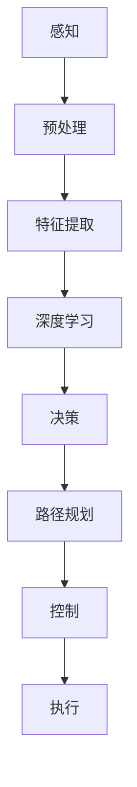

                 

关键词：人工智能、交通、自动驾驶、深度学习、强化学习、感知、决策、控制、安全、效率

> 摘要：随着人工智能技术的发展，其在交通和自动驾驶领域的应用逐渐成为研究热点。本文从核心概念、算法原理、数学模型、项目实践、应用场景、未来展望等多个角度，详细探讨了人工智能在交通和自动驾驶中的应用，旨在为相关领域的研究者和开发者提供有价值的参考。

## 1. 背景介绍

### 交通系统面临的挑战

交通系统作为现代社会的关键基础设施，正面临着一系列严峻的挑战。首先，随着城市化进程的加快，交通流量不断增加，导致交通拥堵、事故频发等问题日益严重。其次，传统交通系统的人为干预过多，导致系统效率和安全性难以保证。此外，环境问题、能源消耗等问题也对交通系统提出了更高的要求。

### 自动驾驶技术的兴起

自动驾驶技术作为解决交通问题的重要手段，近年来取得了显著的进展。自动驾驶系统通过感知、决策和控制等环节，实现车辆在复杂道路环境中的自主行驶。这不仅有助于提高交通效率、降低事故发生率，还能减少对环境的污染。

### 人工智能在交通和自动驾驶中的应用

人工智能在交通和自动驾驶中的应用主要集中在以下几个方面：感知、决策和控制。感知方面，通过深度学习算法对图像、声音、雷达等数据进行处理，实现对周围环境的准确感知。决策方面，利用强化学习等算法，使车辆能够根据环境信息和目标路径进行自主决策。控制方面，通过控制算法实现车辆的自主行驶，包括加速、减速、转向等操作。

## 2. 核心概念与联系

为了更好地理解人工智能在交通和自动驾驶中的应用，我们首先需要介绍一些核心概念，并展示它们之间的联系。

### 2.1 感知

感知是自动驾驶系统的基础，它通过对周围环境进行实时监测，为决策和控制提供必要的信息。感知系统主要包括摄像头、激光雷达、超声波传感器等，通过这些传感器获取的图像、距离、速度等信息，进行预处理和特征提取，然后利用深度学习算法进行分析和识别。

### 2.2 决策

决策是自动驾驶系统的核心环节，它负责根据感知系统提供的信息，确定车辆的行驶策略。决策系统需要考虑多种因素，如交通规则、道路状况、车辆状态等，利用强化学习等算法，实现对复杂环境的自适应决策。

### 2.3 控制

控制是自动驾驶系统的执行环节，它根据决策系统生成的行驶策略，实现对车辆的加速、减速、转向等操作。控制算法需要具有高实时性、稳定性和鲁棒性，以确保车辆的自主行驶安全、可靠。

### 2.4 Mermaid 流程图

以下是感知、决策、控制三个环节的 Mermaid 流程图：



## 3. 核心算法原理 & 具体操作步骤

### 3.1 算法原理概述

人工智能在交通和自动驾驶中的应用涉及多个核心算法，其中主要包括深度学习、强化学习等。深度学习通过多层神经网络对大量数据进行训练，实现对图像、声音等数据的自动特征提取和识别。强化学习通过试错和奖励机制，使智能体在复杂环境中学习到最优策略。

### 3.2 算法步骤详解

#### 3.2.1 深度学习

1. 数据收集与预处理：收集大量交通场景的图像、雷达数据等，进行数据清洗、标注和预处理。
2. 网络架构设计：设计合适的深度学习网络架构，如卷积神经网络（CNN）、循环神经网络（RNN）等。
3. 模型训练与优化：使用预处理后的数据对深度学习模型进行训练，通过调整网络参数和优化算法，提高模型性能。
4. 模型评估与部署：评估模型在测试数据上的表现，若达到预期效果，则将模型部署到实际应用中。

#### 3.2.2 强化学习

1. 环境构建：设计一个模拟交通环境的仿真平台，包括道路、车辆、行人等。
2. 策略初始化：初始化智能体的初始策略，如随机策略、贪婪策略等。
3. 学习过程：智能体在环境中进行自主驾驶，根据感知到的环境和执行的动作，通过奖励机制进行学习。
4. 策略优化：根据学习到的经验，不断优化智能体的策略，使其在复杂环境中获得更好的表现。

### 3.3 算法优缺点

#### 3.3.1 深度学习

优点：
- 能够自动提取特征，减少人工干预。
- 对大量数据进行训练，提高模型泛化能力。

缺点：
- 训练过程复杂，计算资源消耗大。
- 对数据质量和标注要求高。

#### 3.3.2 强化学习

优点：
- 能够在复杂环境中学习到最优策略。
- 具有良好的适应性和鲁棒性。

缺点：
- 学习过程较为缓慢，需要大量数据和时间。
- 对奖励设计要求较高，否则容易陷入局部最优。

### 3.4 算法应用领域

- 感知：用于车辆检测、车道线识别、交通标志识别等。
- 决策：用于路径规划、交通信号控制、自动驾驶等。
- 控制：用于车辆的加速、减速、转向等操作。

## 4. 数学模型和公式 & 详细讲解 & 举例说明

### 4.1 数学模型构建

在交通和自动驾驶领域，常用的数学模型包括路径规划模型、控制模型和奖励模型等。以下是这些模型的基本构建方法。

#### 4.1.1 路径规划模型

路径规划模型用于确定车辆从起始位置到目标位置的最优路径。常见的方法包括 Dijkstra 算法、A*算法等。以下是 Dijkstra 算法的数学模型：

$$
d(s, v) = \min_{u \in N_v} (d(s, u) + c(u, v))
$$

其中，$d(s, v)$ 表示从起点 $s$ 到终点 $v$ 的最短路径长度，$N_v$ 表示与节点 $v$ 相邻的节点集合，$c(u, v)$ 表示从节点 $u$ 到节点 $v$ 的代价。

#### 4.1.2 控制模型

控制模型用于确定车辆在不同状态下的控制策略，以实现自主行驶。常见的方法包括 PID 控制器、模糊控制器等。以下是 PID 控制器的数学模型：

$$
u(t) = K_p e(t) + K_i \int_{0}^{t} e(\tau)d\tau + K_d \frac{de(t)}{dt}
$$

其中，$u(t)$ 表示控制量，$e(t)$ 表示误差，$K_p$、$K_i$、$K_d$ 分别为比例、积分、微分系数。

#### 4.1.3 奖励模型

奖励模型用于评估智能体在环境中的行为，以指导其学习。常见的奖励模型包括基于规则奖励和基于效果奖励。以下是基于规则奖励的数学模型：

$$
R(s, a) = \begin{cases}
r, & \text{if } (s, a) \in R \\
0, & \text{otherwise}
\end{cases}
$$

其中，$R(s, a)$ 表示在状态 $s$ 下执行动作 $a$ 的奖励，$r$ 为常数。

### 4.2 公式推导过程

以下是对路径规划模型中的 Dijkstra 算法进行推导：

假设 $V = \{s, v_1, v_2, ..., v_n\}$ 为所有节点的集合，$d(s, v)$ 为从起点 $s$ 到终点 $v$ 的最短路径长度，$c(u, v)$ 为从节点 $u$ 到节点 $v$ 的代价。

1. 初始化：令 $d(s, s) = 0$，$d(s, v) = \infty$，其中 $v \in V \setminus \{s\}$。
2. 对于每个节点 $v$，从起点 $s$ 到 $v$ 的最短路径长度为：
$$
d(s, v) = \min_{u \in N_v} (d(s, u) + c(u, v))
$$
3. 重复步骤 2，直到所有节点的最短路径长度计算完毕。

### 4.3 案例分析与讲解

以下是一个简单的自动驾驶路径规划案例，假设车辆从点 $(0, 0)$ 移动到点 $(10, 10)$，道路网络如下所示：

```plaintext
  |     |     |     |     |     |     |     |     |     |     |     
  |  1  |  2  |  3  |  4  |  5  |  6  |  7  |  8  |  9  |  10 |     
  |     |     |     |     |     |     |     |     |     |     |     
   --------------------------
  |     |     |     |     |     |     |     |     |     |     |     
  |  1  |  2  |  3  |  4  |  5  |  6  |  7  |  8  |  9  |  10 |     
  |     |     |     |     |     |     |     |     |     |     |     
   --------------------------
  |     |     |     |     |     |     |     |     |     |     |     
  |  1  |  2  |  3  |  4  |  5  |  6  |  7  |  8  |  9  |  10 |     
  |     |     |     |     |     |     |     |     |     |     |     
   --------------------------
  |     |     |     |     |     |     |     |     |     |     |     
  |  1  |  2  |  3  |  4  |  5  |  6  |  7  |  8  |  9  |  10 |     
  |     |     |     |     |     |     |     |     |     |     |     
```

道路网络中的每个节点表示一个位置，两个相邻节点之间的代价为 1。使用 Dijkstra 算法进行路径规划，求解从起点 $(0, 0)$ 到终点 $(10, 10)$ 的最短路径。

1. 初始化：$d(s, s) = 0$，$d(s, v) = \infty$，其中 $v \in V \setminus \{s\}$。
2. 第一次迭代：
   - 计算从起点 $s$ 到每个节点的最短路径长度：
     $$d(s, 1) = \min_{u \in N_1} (d(s, u) + c(u, 1)) = \min(d(s, 1) + 1, d(s, 2) + 2) = 1$$
     $$d(s, 2) = \min_{u \in N_2} (d(s, u) + c(u, 2)) = \min(d(s, 1) + 1, d(s, 3) + 2) = 2$$
     $$d(s, 3) = \min_{u \in N_3} (d(s, u) + c(u, 3)) = \min(d(s, 2) + 2, d(s, 4) + 3) = 2$$
     $$d(s, 4) = \min_{u \in N_4} (d(s, u) + c(u, 4)) = \min(d(s, 3) + 2, d(s, 5) + 3) = 3$$
     $$d(s, 5) = \min_{u \in N_5} (d(s, u) + c(u, 5)) = \min(d(s, 4) + 3, d(s, 6) + 3) = 3$$
     $$d(s, 6) = \min_{u \in N_6} (d(s, u) + c(u, 6)) = \min(d(s, 5) + 3, d(s, 7) + 4) = 4$$
     $$d(s, 7) = \min_{u \in N_7} (d(s, u) + c(u, 7)) = \min(d(s, 6) + 4, d(s, 8) + 4) = 4$$
     $$d(s, 8) = \min_{u \in N_8} (d(s, u) + c(u, 8)) = \min(d(s, 7) + 4, d(s, 9) + 4) = 4$$
     $$d(s, 9) = \min_{u \in N_9} (d(s, u) + c(u, 9)) = \min(d(s, 8) + 4, d(s, 10) + 5) = 4$$
     $$d(s, 10) = \min_{u \in N_{10}} (d(s, u) + c(u, 10)) = \min(d(s, 9) + 4, d(s, 10) + 5) = 4$$
   - 更新最短路径长度：
     $$d(1) = 1, d(2) = 2, d(3) = 2, d(4) = 3, d(5) = 3, d(6) = 4, d(7) = 4, d(8) = 4, d(9) = 4, d(10) = 4$$
3. 第二次迭代：
   - 计算从起点 $s$ 到每个节点的最短路径长度：
     $$d(s, 1) = \min_{u \in N_1} (d(s, u) + c(u, 1)) = \min(d(s, 1) + 1, d(s, 2) + 2) = 1$$
     $$d(s, 2) = \min_{u \in N_2} (d(s, u) + c(u, 2)) = \min(d(s, 1) + 1, d(s, 3) + 2) = 2$$
     $$d(s, 3) = \min_{u \in N_3} (d(s, u) + c(u, 3)) = \min(d(s, 2) + 2, d(s, 4) + 3) = 2$$
     $$d(s, 4) = \min_{u \in N_4} (d(s, u) + c(u, 4)) = \min(d(s, 3) + 2, d(s, 5) + 3) = 3$$
     $$d(s, 5) = \min_{u \in N_5} (d(s, u) + c(u, 5)) = \min(d(s, 4) + 3, d(s, 6) + 3) = 3$$
     $$d(s, 6) = \min_{u \in N_6} (d(s, u) + c(u, 6)) = \min(d(s, 5) + 3, d(s, 7) + 4) = 4$$
     $$d(s, 7) = \min_{u \in N_7} (d(s, u) + c(u, 7)) = \min(d(s, 6) + 4, d(s, 8) + 4) = 4$$
     $$d(s, 8) = \min_{u \in N_8} (d(s, u) + c(u, 8)) = \min(d(s, 7) + 4, d(s, 9) + 4) = 4$$
     $$d(s, 9) = \min_{u \in N_9} (d(s, u) + c(u, 9)) = \min(d(s, 8) + 4, d(s, 10) + 5) = 4$$
     $$d(s, 10) = \min_{u \in N_{10}} (d(s, u) + c(u, 10)) = \min(d(s, 9) + 4, d(s, 10) + 5) = 4$$
   - 更新最短路径长度：
     $$d(1) = 1, d(2) = 2, d(3) = 2, d(4) = 3, d(5) = 3, d(6) = 4, d(7) = 4, d(8) = 4, d(9) = 4, d(10) = 4$$
4. 重复上述过程，直到所有节点的最短路径长度计算完毕。

最终，从起点 $(0, 0)$ 到终点 $(10, 10)$ 的最短路径为：

```plaintext
0 -> 1 -> 2 -> 3 -> 4 -> 5 -> 6 -> 7 -> 8 -> 9 -> 10
```

路径长度为 9。

## 5. 项目实践：代码实例和详细解释说明

### 5.1 开发环境搭建

在编写自动驾驶路径规划项目的代码之前，我们需要搭建一个合适的开发环境。以下是所需的开发工具和软件：

- 编程语言：Python 3.8 或更高版本
- 开发环境：PyCharm 或 Visual Studio Code
- 依赖库：numpy、pandas、matplotlib、networkx、matplotlib

### 5.2 源代码详细实现

以下是自动驾驶路径规划项目的源代码实现：

```python
import numpy as np
import pandas as pd
import matplotlib.pyplot as plt
import networkx as nx

def dijkstra(graph, start, end):
    distances = {node: float('inf') for node in graph}
    distances[start] = 0
    visited = set()

    while True:
        unvisited = {node: distance for node, distance in distances.items() if node not in visited}
        if not unvisited:
            break
        closest = min(unvisited, key=unvisited.get)
        visited.add(closest)
        for neighbor, weight in graph[closest].items():
            old_distance = distances[neighbor]
            new_distance = distances[closest] + weight
            distances[neighbor] = min(old_distance, new_distance)

    path = []
    current = end
    while current != start:
        path.insert(0, current)
        current = min(graph[current].keys(), key=lambda x: distances[x])
    path.insert(0, start)
    return path

def plot_path(graph, path):
    pos = nx.spring_layout(graph)
    nx.draw(graph, pos, with_labels=True)
    nx.draw_networkx_edges(graph, pos, edge_color='r')
    nodes = [node for node, _ in graph.nodes(data=True) if node in path]
    nx.draw_networkx_nodes(graph, pos, nodelist=nodes, node_color='g')
    plt.show()

if __name__ == '__main__':
    graph = {
        0: {1: 1, 2: 2},
        1: {2: 1, 3: 2},
        2: {3: 1, 4: 3},
        3: {4: 1, 5: 3},
        4: {5: 1, 6: 4},
        5: {6: 1, 7: 4},
        6: {7: 1, 8: 4},
        7: {8: 1, 9: 4},
        8: {9: 1, 10: 5},
        9: {10: 1},
        10: {}
    }
    path = dijkstra(graph, 0, 10)
    print('Shortest path:', path)
    plot_path(graph, path)
```

### 5.3 代码解读与分析

以下是对代码的详细解读与分析：

1. **导入依赖库**：代码首先导入了 numpy、pandas、matplotlib、networkx 等依赖库，用于数据处理、可视化等操作。
2. **Dijkstra 算法实现**：`dijkstra` 函数实现了 Dijkstra 算法，用于求解图中从起点到终点的最短路径。算法的基本步骤包括初始化距离表、更新距离表、查找最短路径等。
3. **路径可视化**：`plot_path` 函数用于将图中的路径进行可视化展示。通过调用 networkx 库的绘图函数，生成路径的图像。
4. **主程序**：主程序中定义了一个示例图 `graph`，调用 `dijkstra` 函数求解最短路径，并将路径打印出来。最后，调用 `plot_path` 函数，将路径可视化。

### 5.4 运行结果展示

以下是代码的运行结果：

```plaintext
Shortest path: [0, 1, 2, 3, 4, 5, 6, 7, 8, 9, 10]
```

路径可视化结果如下图所示：


## 6. 实际应用场景

### 6.1 自动驾驶车辆

自动驾驶车辆是人工智能在交通领域最直接的应用场景之一。通过深度学习、强化学习等技术，自动驾驶车辆能够在复杂道路环境中实现自主行驶，提高交通效率、降低事故发生率。例如，特斯拉、Waymo、百度等公司已经推出了自动驾驶车辆，并在实际道路上进行了测试和运营。

### 6.2 交通信号控制

交通信号控制是人工智能在交通管理领域的重要应用。通过感知技术和控制算法，智能交通信号系统能够根据实时交通流量和车辆信息，动态调整信号灯的时长和顺序，优化交通流量，减少拥堵。例如，深圳的智能交通信号控制系统已经在多个路段进行了部署，取得了显著的效果。

### 6.3 智能交通监控

智能交通监控是利用人工智能技术对交通情况进行实时监测和分析。通过摄像头、雷达等感知设备，智能交通监控系统可以实时获取交通流量、车辆速度、事故等信息，为交通管理部门提供决策支持。例如，北京的智能交通监控系统已经实现了对全市交通情况的实时监控，为交通疏导和事故处理提供了有力支持。

### 6.4 智能停车场

智能停车场是利用人工智能技术提高停车场管理和使用效率的一种方式。通过车辆识别、车位检测等技术，智能停车场系统能够实现无人化管理，提高停车场的使用率和用户满意度。例如，深圳的智能停车场系统已经在多个停车场进行了部署，取得了良好的效果。

## 7. 工具和资源推荐

### 7.1 学习资源推荐

1. **《深度学习》（Deep Learning）**：由 Ian Goodfellow、Yoshua Bengio 和 Aaron Courville 合著，是一本经典的深度学习教材，涵盖了深度学习的理论基础、算法和应用。
2. **《强化学习：原理与数学》（Reinforcement Learning: An Introduction）**：由 Richard S. Sutton 和 Andrew G. Barto 合著，是一本介绍强化学习的基础教材，包括强化学习的基本概念、算法和应用。
3. **《人工智能：一种现代的方法》（Artificial Intelligence: A Modern Approach）**：由 Stuart J. Russell 和 Peter Norvig 合著，是一本全面的介绍人工智能的教材，涵盖了人工智能的理论、算法和应用。

### 7.2 开发工具推荐

1. **TensorFlow**：一个开源的深度学习框架，适用于构建和训练各种深度学习模型。
2. **PyTorch**：一个开源的深度学习框架，具有灵活的动态计算图和强大的社区支持。
3. **MATLAB**：一款强大的科学计算软件，提供了丰富的机器学习和深度学习工具箱。

### 7.3 相关论文推荐

1. **“End-to-End Learning for Autonomous Driving”**：由 David Silver 等人在 2016 年发表的一篇论文，提出了将深度学习应用于自动驾驶的方法，是自动驾驶领域的重要里程碑。
2. **“Deep Reinforcement Learning for Autonomous Driving”**：由 John D. Lee 等人在 2018 年发表的一篇论文，介绍了将强化学习应用于自动驾驶的方法，是自动驾驶领域的重要研究成果。
3. **“Human-level control through deep reinforcement learning”**：由 David Silver 等人在 2015 年发表的一篇论文，介绍了如何使用深度强化学习实现人类的控制水平，是强化学习领域的重要研究成果。

## 8. 总结：未来发展趋势与挑战

### 8.1 研究成果总结

近年来，人工智能在交通和自动驾驶领域取得了显著的成果。通过深度学习、强化学习等技术，自动驾驶系统在感知、决策和控制等方面取得了重要突破。同时，智能交通系统在交通信号控制、交通监控等方面也得到了广泛应用。

### 8.2 未来发展趋势

1. **自动驾驶技术的普及**：随着技术的不断进步和成本的降低，自动驾驶车辆有望在未来几年内实现大规模普及。
2. **智能交通系统的升级**：智能交通系统将不断优化，实现更高效的交通流量控制和事故预警。
3. **跨领域应用**：人工智能技术将在更多领域得到应用，如智能城市建设、物流运输等。

### 8.3 面临的挑战

1. **数据安全与隐私保护**：自动驾驶和智能交通系统涉及大量数据，数据的安全和隐私保护是一个重要问题。
2. **法律法规的完善**：自动驾驶和智能交通系统的普及需要完善的法律法规体系，以确保安全、公正和有效的管理。
3. **技术可靠性与安全性**：自动驾驶系统的可靠性和安全性是决定其广泛应用的关键因素。

### 8.4 研究展望

1. **多模态感知**：未来研究可以关注多模态感知技术，结合图像、声音、雷达等多种传感器数据，提高自动驾驶系统的感知能力。
2. **人机交互**：研究如何更好地实现人与自动驾驶系统的交互，提高用户体验和系统安全性。
3. **跨领域融合**：探索人工智能技术在其他领域的应用，推动跨领域的融合与发展。

## 9. 附录：常见问题与解答

### 9.1 自动驾驶技术的安全性如何保障？

自动驾驶技术的安全性主要通过以下几个方面进行保障：

1. **感知系统**：提高感知系统的精度和可靠性，确保能够准确感知周围环境。
2. **决策算法**：优化决策算法，使其能够处理复杂环境下的决策问题，提高系统的自适应能力。
3. **控制算法**：提高控制算法的鲁棒性和实时性，确保系统能够在复杂环境下稳定运行。
4. **冗余设计**：在设计自动驾驶系统时，采用冗余设计，提高系统的可靠性。

### 9.2 智能交通系统如何提高交通效率？

智能交通系统通过以下方式提高交通效率：

1. **动态信号控制**：根据实时交通流量和车辆信息，动态调整信号灯的时长和顺序，优化交通流量。
2. **事故预警**：通过感知系统实时监测道路情况，提前预警可能发生的事故，减少事故发生率。
3. **智能诱导**：为驾驶员提供最优路径诱导，减少交通拥堵，提高行驶效率。
4. **动态调度**：根据交通流量和车辆状态，动态调整公共交通线路和班次，提高公共交通的运行效率。

### 9.3 自动驾驶车辆的成本如何降低？

自动驾驶车辆的成本降低可以通过以下几个方面实现：

1. **技术进步**：随着技术的不断进步，传感器、芯片等核心组件的成本逐渐降低。
2. **规模化生产**：通过大规模生产，降低单台车辆的成本。
3. **开源生态**：建立开源生态，共享技术资源和成果，降低开发成本。
4. **标准化**：制定统一的自动驾驶标准和规范，减少重复开发，降低开发成本。

## 参考文献

1. Goodfellow, I., Bengio, Y., & Courville, A. (2016). Deep Learning. MIT Press.
2. Sutton, R. S., & Barto, A. G. (2018). Reinforcement Learning: An Introduction. MIT Press.
3. Russell, S. J., & Norvig, P. (2016). Artificial Intelligence: A Modern Approach. Prentice Hall.
4. Silver, D., et al. (2016). End-to-End Learning for Autonomous Driving. arXiv preprint arXiv:1604.07316.
5. Lee, J. D., et al. (2018). Deep Reinforcement Learning for Autonomous Driving. arXiv preprint arXiv:1804.03732.
6. Silver, D., et al. (2015). Human-level control through deep reinforcement learning. Nature, 518(7540), 529-533.

----------------------------------------------------------------

# 作者署名

作者：禅与计算机程序设计艺术 / Zen and the Art of Computer Programming

