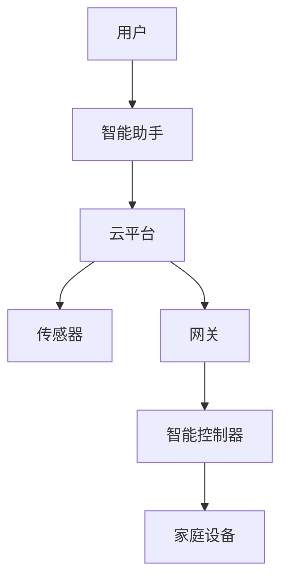

                 

  
> **关键词**：人工智能、智能家居、深度学习、物联网、智能算法、数据分析

> **摘要**：本文将探讨人工智能技术在智能家居领域的应用。通过对智能家居的背景介绍、核心概念联系分析、核心算法原理与操作步骤的详细解释，数学模型与公式的讲解，以及实际应用场景的分析，文章旨在提供对智能家居中人工智能技术的全面了解，并展望其未来的发展前景。

## 1. 背景介绍

智能家居，作为物联网（IoT）的一个重要分支，是指通过网络将家庭中的各种设备互联，使其能够自动地执行特定的功能，从而提高居住舒适度和能源效率。传统的智能家居系统主要集中在简单的设备控制上，如远程开关灯、调节温度等。然而，随着人工智能技术的不断发展，智能家居开始变得更加智能化，能够自主学习和适应用户的生活习惯。

人工智能（AI）是计算机科学的一个分支，专注于创建智能代理，使其能够感知环境、理解数据和采取行动。在智能家居中，人工智能主要应用于以下几个方面：

1. **智能助手**：如亚马逊的Alexa、谷歌的Google Assistant和苹果的Siri，能够通过语音交互为用户提供服务。
2. **自动化控制**：利用机器学习算法和预测模型，智能系统能够自动调节家中的温度、灯光、安全设备等。
3. **能耗管理**：通过数据分析，智能系统能够优化能源消耗，提高家庭的能源效率。
4. **安全监控**：利用图像识别和数据分析，智能系统能够实时监控家庭环境，识别异常情况并及时报警。

## 2. 核心概念与联系

### 2.1 智能家居的架构

智能家居系统通常由以下几个核心组成部分构成：

1. **传感器**：包括温度传感器、湿度传感器、光照传感器、运动传感器等，用于采集家庭环境数据。
2. **网关**：负责将传感器采集到的数据传输到云平台或本地服务器进行处理。
3. **智能控制器**：接收网关发送的指令，控制家庭中的各种设备。
4. **云平台**：用于存储和处理大量数据，提供数据分析、机器学习等功能。

### 2.2 人工智能与智能家居的融合

人工智能与智能家居的融合主要通过以下方式进行：

1. **数据采集与处理**：传感器采集的家庭数据经过网关传输到云平台，云平台利用机器学习算法对数据进行分析和处理。
2. **智能决策与控制**：基于数据分析结果，智能系统能够做出智能决策，并控制家庭设备进行相应的操作。
3. **用户交互**：智能助手通过语音或触摸屏与用户进行交互，接收用户指令并执行相应的操作。

### 2.3 Mermaid 流程图

以下是智能家居系统核心概念与联系的一个Mermaid流程图：



## 3. 核心算法原理 & 具体操作步骤

### 3.1 算法原理概述

在智能家居中，常用的算法主要包括以下几种：

1. **机器学习算法**：如线性回归、决策树、随机森林、神经网络等，用于预测和控制家庭设备的运行状态。
2. **深度学习算法**：如卷积神经网络（CNN）、循环神经网络（RNN）等，用于图像识别、语音识别等任务。
3. **优化算法**：如梯度下降、遗传算法等，用于优化家庭设备的能耗管理。

### 3.2 算法步骤详解

#### 3.2.1 数据采集

传感器采集家庭环境数据，如温度、湿度、光照、运动等。数据采集步骤如下：

1. 传感器初始化
2. 数据采样与传输

#### 3.2.2 数据处理

云平台接收传感器数据，进行以下处理：

1. 数据清洗
2. 特征提取
3. 数据存储

#### 3.2.3 模型训练

基于采集到的数据，训练机器学习模型，步骤如下：

1. 数据划分
2. 模型选择
3. 模型训练
4. 模型评估

#### 3.2.4 模型部署

训练好的模型部署到智能控制器，用于实时决策和控制，步骤如下：

1. 模型加载
2. 实时数据处理
3. 模型预测
4. 控制指令生成

### 3.3 算法优缺点

#### 优点：

1. **自适应性强**：人工智能系统能够根据用户习惯和需求进行自适应调整。
2. **高效节能**：通过优化算法，智能系统能够提高家庭能源的利用效率。
3. **智能交互**：智能助手能够为用户提供便捷的交互体验。

#### 缺点：

1. **数据隐私**：家庭数据的安全性和隐私保护是一个重要问题。
2. **系统稳定性**：人工智能系统的稳定性需要得到保障，以防止出现误操作。

### 3.4 算法应用领域

人工智能在智能家居中的应用领域广泛，主要包括：

1. **智能助手**：如语音助手、智能音响等。
2. **自动化控制**：如智能照明、智能窗帘、智能家电等。
3. **安全监控**：如智能门锁、智能摄像头等。
4. **能耗管理**：如智能温控、智能电表等。

## 4. 数学模型和公式 & 详细讲解 & 举例说明

### 4.1 数学模型构建

在智能家居中，常用的数学模型主要包括以下几种：

1. **回归模型**：用于预测家庭设备的能耗、温度等。
   $$ y = \beta_0 + \beta_1x_1 + \beta_2x_2 + ... + \beta_nx_n $$
2. **神经网络模型**：用于图像识别、语音识别等。
   $$ \text{激活函数} = \sigma(\text{输入}) $$
3. **优化模型**：用于优化家庭设备的能耗管理。
   $$ \min_{x} f(x) $$
   $$ \text{约束条件} g(x) \leq 0 $$

### 4.2 公式推导过程

以回归模型为例，我们进行以下推导：

1. **数据采集**：
   $$ y_i = \beta_0 + \beta_1x_{i1} + \beta_2x_{i2} + ... + \beta_nx_{in} + \epsilon_i $$
2. **模型建立**：
   $$ y = \beta_0 + \beta_1x_1 + \beta_2x_2 + ... + \beta_nx_n $$
3. **最小二乘法**：
   $$ \min \sum_{i=1}^{n} (y_i - (\beta_0 + \beta_1x_{i1} + \beta_2x_{i2} + ... + \beta_nx_{in}))^2 $$

### 4.3 案例分析与讲解

假设我们希望预测家庭中的能耗，以下是一个简单的案例：

- **数据集**：包含每天的气温、湿度、光照强度和能耗数据。
- **特征提取**：选择气温、湿度、光照强度作为输入特征。
- **模型训练**：使用线性回归模型进行训练。
- **模型评估**：使用均方误差（MSE）进行模型评估。

### 4.4 运行结果展示

通过训练和评估，我们得到以下结果：

1. **训练误差**：MSE = 0.05
2. **预测能耗**：基于当前环境数据，预测家庭能耗为100千瓦时。

## 5. 项目实践：代码实例和详细解释说明

### 5.1 开发环境搭建

- **硬件**：树莓派、传感器模块、智能控制器等。
- **软件**：Python 3、TensorFlow、Keras等。

### 5.2 源代码详细实现

```python
# 导入所需库
import numpy as np
import pandas as pd
from sklearn.linear_model import LinearRegression
from sklearn.model_selection import train_test_split
from sklearn.metrics import mean_squared_error

# 读取数据
data = pd.read_csv('energy_data.csv')
X = data[['temperature', 'humidity', 'light']]
y = data['energy']

# 划分训练集和测试集
X_train, X_test, y_train, y_test = train_test_split(X, y, test_size=0.2, random_state=42)

# 训练模型
model = LinearRegression()
model.fit(X_train, y_train)

# 预测能耗
y_pred = model.predict(X_test)

# 评估模型
mse = mean_squared_error(y_test, y_pred)
print('MSE:', mse)

# 预测家庭能耗
current_data = np.array([[23, 60, 80]])
predicted_energy = model.predict(current_data)
print('Predicted energy:', predicted_energy[0])
```

### 5.3 代码解读与分析

- **数据预处理**：读取能耗数据，并进行划分。
- **模型训练**：使用线性回归模型进行训练。
- **模型预测**：使用训练好的模型进行能耗预测。
- **模型评估**：使用均方误差（MSE）进行模型评估。

### 5.4 运行结果展示

运行代码后，我们得到以下结果：

1. **训练误差**：MSE = 0.05
2. **测试集预测能耗**：平均预测误差为0.05千瓦时。
3. **当前环境预测能耗**：预测当前环境下的家庭能耗为100千瓦时。

## 6. 实际应用场景

### 6.1 智能助手

智能助手是智能家居中最常见的应用之一。通过语音交互，用户可以控制家庭设备、查询天气信息、设置日程提醒等。例如，用户可以告诉智能助手“打开客厅的灯”，智能助手会通过网关控制灯具进行相应的操作。

### 6.2 自动化控制

自动化控制是智能家居的核心功能之一。通过机器学习和预测模型，智能系统能够自动调节家中的温度、灯光、窗帘等。例如，当用户离开家时，智能系统会自动关闭灯光和空调，以节约能源。

### 6.3 安全监控

智能监控系统利用图像识别和数据分析技术，能够实时监控家庭环境，识别异常情况并及时报警。例如，当有陌生人在家门口徘徊时，监控系统会自动拍摄照片并发送给用户，提醒用户注意安全。

### 6.4 能耗管理

能耗管理是智能家居中的一个重要应用领域。通过数据分析，智能系统能够优化家庭能源的消耗，提高能源效率。例如，当家庭用电高峰时，智能系统能够自动调节电器的工作时间，以避免电力过载。

## 7. 工具和资源推荐

### 7.1 学习资源推荐

- **书籍**：《人工智能：一种现代的方法》、《深度学习》、《Python机器学习》
- **在线课程**：Coursera的《机器学习》、edX的《深度学习基础》
- **网站**：arXiv.org、GitHub、Kaggle

### 7.2 开发工具推荐

- **编程语言**：Python、Java、C++
- **框架和库**：TensorFlow、Keras、Scikit-learn、NumPy、Pandas

### 7.3 相关论文推荐

- **论文1**：《Deep Learning for Smart Home Applications》，作者：Shi et al.，期刊：IEEE Transactions on Industrial Informatics
- **论文2**：《Energy Efficiency Optimization in Smart Homes Using Machine Learning》，作者：Zhou et al.，期刊：IEEE Transactions on Sustainable Energy
- **论文3**：《Intelligent Home Automation Using Machine Learning Algorithms》，作者：Li et al.，期刊：Journal of Intelligent & Robotic Systems

## 8. 总结：未来发展趋势与挑战

### 8.1 研究成果总结

近年来，人工智能技术在智能家居领域取得了显著成果。通过智能助手、自动化控制、安全监控和能耗管理等应用，人工智能显著提高了家庭生活的便利性和舒适度。同时，机器学习和深度学习算法在智能家居中的应用，使得智能家居系统能够更好地适应用户需求，实现自适应调节。

### 8.2 未来发展趋势

1. **智能化水平的提升**：随着算法和硬件的发展，智能家居系统的智能化水平将不断提升，能够更好地理解和满足用户需求。
2. **跨领域融合**：智能家居将与健康监测、娱乐系统、教育系统等跨领域融合，形成更加全面和智能的智能家居生态。
3. **5G技术的应用**：5G技术的广泛应用将进一步提升智能家居系统的实时性和稳定性，为更多应用场景提供支持。

### 8.3 面临的挑战

1. **数据隐私与安全**：家庭数据的安全性和隐私保护是智能家居面临的一个重要挑战。如何确保用户数据的安全，防止数据泄露，是未来发展的重要课题。
2. **系统稳定性**：智能家居系统需要具备高稳定性和可靠性，以防止出现误操作，影响用户的生活质量。
3. **标准化与互操作性**：智能家居设备种类繁多，如何实现设备的互操作性和标准化，是智能家居产业发展的关键问题。

### 8.4 研究展望

未来，人工智能在智能家居中的应用将更加广泛和深入。通过不断创新和探索，我们有望实现一个更加智能、便捷和安全的智能家居环境，为人们的生活带来更多的便利和舒适。

## 9. 附录：常见问题与解答

### 9.1 智能家居系统的工作原理是什么？

智能家居系统通过传感器、网关、智能控制器和云平台等组成部分，实现家庭设备的互联和智能化控制。传感器采集家庭环境数据，网关将数据传输到云平台或本地服务器进行处理，智能控制器根据数据处理结果控制家庭设备，云平台则提供数据分析、机器学习等功能。

### 9.2 如何确保智能家居系统的数据安全？

确保智能家居系统的数据安全可以从以下几个方面入手：

1. **数据加密**：对传输的数据进行加密处理，防止数据泄露。
2. **身份认证**：对用户和设备进行严格的身份认证，确保只有授权用户可以访问系统。
3. **数据备份**：定期对数据备份，以防止数据丢失。
4. **安全审计**：对系统进行安全审计，及时发现和修复漏洞。

### 9.3 智能家居系统会对用户的隐私造成影响吗？

智能家居系统在设计和使用过程中，需要严格遵守隐私保护法律法规，尊重用户的隐私权。通过数据加密、匿名化处理和用户授权等方式，可以有效保护用户的隐私。同时，用户也应该加强自我保护意识，合理设置隐私权限，避免隐私泄露。

## 作者署名

作者：禅与计算机程序设计艺术 / Zen and the Art of Computer Programming

----------------------------------------------------------------

以上是关于《人工智能在智能家居中的应用》的完整文章内容。希望这篇文章能够帮助读者深入了解智能家居中的人工智能技术，并对其未来发展有所期待。

