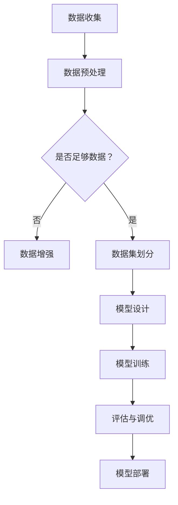

                 

在当今快速发展的信息技术时代，人工智能（AI）已经成为了推动产业变革的核心力量。其中，大模型作为AI技术的代表，正在引领着新一代的技术浪潮。本文将探讨人工智能大模型的商业应用，分析其潜在市场、技术挑战及未来发展趋势，并提出一份详细的商业计划书，旨在为企业和创业者提供实用的指导。

## 关键词
- 人工智能
- 大模型
- 商业应用
- 技术挑战
- 未来发展趋势

## 摘要
本文首先介绍了人工智能大模型的基本概念和背景，分析了其在各行业中的应用潜力。接着，本文详细讨论了构建大模型的算法原理、数学模型及具体实现步骤。随后，文章通过实践项目展示了大模型的应用实例，并分析了实际应用中的挑战和解决方案。最后，本文提出了人工智能大模型商业计划书的具体内容，包括市场分析、产品定位、营销策略、团队建设和财务规划等。

## 1. 背景介绍

人工智能（Artificial Intelligence，简称AI）是计算机科学的一个分支，致力于研究如何构建智能体，使其能够执行通常需要人类智能的任务，如识别图像、理解语言、决策和解决问题。随着深度学习技术的兴起，人工智能得到了快速发展，大模型（Large-scale Model）逐渐成为AI领域的焦点。

大模型是指具有非常大量参数和大规模数据训练的模型，如GPT、BERT、Transformer等。这些模型具有以下特点：

- **高参数数量**：大模型通常拥有数十亿至数千亿的参数，这使得它们能够捕捉到数据中的细微特征和复杂模式。
- **大规模数据训练**：大模型需要大量的数据来进行训练，以使其性能达到最优。
- **强大的表达能力**：大模型能够处理复杂的任务，如自然语言处理、图像识别和预测分析。

大模型在人工智能领域的兴起，源于以下几个因素：

- **计算能力的提升**：随着计算硬件的快速发展，特别是GPU和TPU的出现，为训练和部署大模型提供了强大的计算支持。
- **数据资源的丰富**：互联网的普及和大数据技术的发展，为获取和存储海量数据提供了便利。
- **算法的进步**：深度学习和强化学习等算法的突破，使得大模型在各个领域取得了显著的性能提升。

## 2. 核心概念与联系

为了深入理解大模型的原理和应用，首先需要了解几个核心概念：

- **深度学习**：一种机器学习技术，通过多层神经网络对数据进行分析和学习。
- **神经网络**：一种由大量节点（神经元）组成的计算模型，通过前向传播和反向传播进行学习。
- **优化算法**：用于调整模型参数，使其在给定数据上性能最优的算法，如随机梯度下降（SGD）、Adam等。
- **数据增强**：通过改变数据的形式来增加数据的多样性，以提高模型的泛化能力。

以下是构建大模型的 Mermaid 流程图：



### 2.1 数据收集

数据收集是构建大模型的第一步，数据的质量和数量直接影响模型的表现。收集的数据可以来自各种来源，如公共数据集、公司内部数据库或在线数据服务。

### 2.2 数据预处理

数据预处理包括数据清洗、数据转换和数据归一化等步骤。清洗数据是为了去除噪声和错误，转换数据是为了将数据格式统一，归一化数据是为了确保所有特征在相同的尺度上。

### 2.3 数据增强

数据增强是一种重要的技术，通过生成新的数据样本来增加训练数据的多样性，从而提高模型的泛化能力。常见的数据增强技术包括旋转、翻转、缩放、裁剪等。

### 2.4 数据集划分

将数据集划分为训练集、验证集和测试集，用于模型的训练、验证和测试。通常，训练集用于训练模型，验证集用于调优模型参数，测试集用于评估模型在未知数据上的表现。

### 2.5 模型设计

模型设计是构建大模型的核心步骤，包括选择合适的神经网络结构、优化算法和损失函数等。深度学习框架（如TensorFlow、PyTorch等）提供了丰富的工具和库，使得模型设计变得简单高效。

### 2.6 模型训练

模型训练是通过迭代优化模型参数，使其在给定数据上性能最优的过程。训练过程中，需要监控模型的表现，以避免过拟合和欠拟合。

### 2.7 评估与调优

评估模型的表现通常通过验证集和测试集进行，使用如精度、召回率、F1分数等指标来衡量。根据评估结果，对模型进行调优，以提高其性能。

### 2.8 模型部署

模型部署是将训练好的模型应用于实际场景的过程，包括模型的服务器部署、接口设计和API开发等。部署后的模型可以实时处理数据，提供智能服务。

## 3. 核心算法原理 & 具体操作步骤

### 3.1 算法原理概述

大模型的算法原理主要基于深度学习和神经网络。深度学习通过多层神经网络对数据进行层次化的特征提取和学习，使得模型能够捕捉到数据中的复杂模式和关联。神经网络则通过前向传播和反向传播进行学习，不断调整参数，使其在给定数据上性能最优。

### 3.2 算法步骤详解

1. **数据收集**：收集大量的训练数据，包括图像、文本、音频等。
2. **数据预处理**：对数据进行清洗、转换和归一化，使其适合模型训练。
3. **数据增强**：通过旋转、翻转、缩放、裁剪等操作，增加数据的多样性，提高模型的泛化能力。
4. **模型设计**：选择合适的神经网络结构，如卷积神经网络（CNN）、循环神经网络（RNN）、Transformer等，并设置合适的优化算法和损失函数。
5. **模型训练**：使用训练数据进行迭代训练，不断调整模型参数，使其在给定数据上性能最优。
6. **评估与调优**：使用验证集和测试集评估模型表现，并根据评估结果对模型进行调优，以提高其性能。
7. **模型部署**：将训练好的模型部署到服务器上，提供API接口，以便其他系统或应用调用。

### 3.3 算法优缺点

**优点**：
- **强大的表达能力**：大模型能够捕捉到数据中的复杂模式和关联，具有较强的表征能力。
- **高泛化能力**：通过数据增强和模型调优，大模型能够提高泛化能力，适应不同的数据集和任务。
- **自动特征提取**：大模型通过多层神经网络自动提取特征，减少了人工特征工程的工作量。

**缺点**：
- **计算资源需求大**：大模型需要大量的计算资源进行训练和部署，对硬件性能要求较高。
- **训练时间长**：大模型的训练时间较长，需要较长时间才能收敛到最优解。
- **数据需求大**：大模型需要大量的训练数据，数据收集和预处理过程较为复杂。

### 3.4 算法应用领域

大模型在多个领域取得了显著的应用成果，主要包括：

- **自然语言处理**：大模型在文本分类、机器翻译、问答系统等任务中表现优异，如GPT、BERT等。
- **计算机视觉**：大模型在图像分类、目标检测、图像生成等任务中具有强大的能力，如ResNet、VGG等。
- **语音识别**：大模型在语音识别、语音合成、说话人识别等任务中取得了突破性进展，如WaveNet、DeepSpeech等。
- **预测分析**：大模型在股票预测、销售预测、需求预测等任务中具有广泛的应用，如LSTM、GRU等。

## 4. 数学模型和公式 & 详细讲解 & 举例说明

### 4.1 数学模型构建

大模型的数学模型主要基于深度学习和神经网络，包括以下几个部分：

1. **输入层**：接收原始数据，如图像、文本或音频。
2. **隐藏层**：通过多层神经网络进行特征提取和学习，每个隐藏层由多个神经元组成。
3. **输出层**：根据任务需求，输出预测结果，如分类结果或回归值。

### 4.2 公式推导过程

深度学习中的损失函数用于衡量模型预测值与真实值之间的差距，常见的损失函数包括均方误差（MSE）、交叉熵损失（Cross-Entropy Loss）等。

1. **均方误差（MSE）**：
$$
MSE = \frac{1}{n}\sum_{i=1}^{n}(y_i - \hat{y}_i)^2
$$
其中，$y_i$为真实值，$\hat{y}_i$为模型预测值，$n$为样本数量。

2. **交叉熵损失（Cross-Entropy Loss）**：
$$
Cross-Entropy Loss = -\frac{1}{n}\sum_{i=1}^{n}y_i \log(\hat{y}_i)
$$
其中，$y_i$为真实值，$\hat{y}_i$为模型预测值，$\log$为自然对数。

### 4.3 案例分析与讲解

以自然语言处理任务为例，假设我们使用GPT模型进行文本分类。GPT模型是一个基于Transformer的预训练模型，其输入为文本序列，输出为文本的概率分布。

1. **数据准备**：
   - 文本数据集：包含多个文本类别，如新闻、科技、娱乐等。
   - 标签数据集：对应文本数据的类别标签。

2. **模型训练**：
   - 预训练：使用大量文本数据进行预训练，使得模型能够自动提取文本特征。
   - 微调：在预训练的基础上，使用文本分类任务的数据进行微调，使得模型在特定任务上性能最优。

3. **模型评估**：
   - 使用验证集评估模型性能，根据评估结果调整模型参数。
   - 使用测试集评估模型在未知数据上的表现，以衡量模型泛化能力。

4. **模型部署**：
   - 将训练好的模型部署到服务器，提供文本分类API接口。

## 5. 项目实践：代码实例和详细解释说明

### 5.1 开发环境搭建

1. **安装Python环境**：
   - Python版本要求：3.7及以上。
   - 安装命令：`pip install python==3.7`

2. **安装深度学习框架**：
   - TensorFlow版本：2.0及以上。
   - 安装命令：`pip install tensorflow==2.0`

3. **准备数据集**：
   - 下载公开数据集，如IMDB电影评论数据集。
   - 数据预处理：将文本数据进行清洗、转换和归一化。

### 5.2 源代码详细实现

```python
import tensorflow as tf
from tensorflow.keras.preprocessing.sequence import pad_sequences
from tensorflow.keras.layers import Embedding, LSTM, Dense
from tensorflow.keras.models import Sequential

# 数据预处理
max_sequence_length = 100
vocab_size = 10000
embedding_dim = 50

# 加载并预处理数据
(x_train, y_train), (x_test, y_test) = tf.keras.datasets.imdb.load_data(num_words=vocab_size)
x_train = pad_sequences(x_train, maxlen=max_sequence_length)
x_test = pad_sequences(x_test, maxlen=max_sequence_length)

# 模型设计
model = Sequential()
model.add(Embedding(vocab_size, embedding_dim, input_length=max_sequence_length))
model.add(LSTM(128))
model.add(Dense(1, activation='sigmoid'))

# 编译模型
model.compile(optimizer='adam', loss='binary_crossentropy', metrics=['accuracy'])

# 训练模型
model.fit(x_train, y_train, epochs=10, batch_size=32, validation_split=0.2)

# 评估模型
test_loss, test_acc = model.evaluate(x_test, y_test)
print(f"Test accuracy: {test_acc:.2f}")

# 模型部署
model.save('imdb_lstm_model.h5')
```

### 5.3 代码解读与分析

上述代码实现了一个基于LSTM（长短期记忆网络）的文本分类模型，用于对IMDB电影评论进行分类。以下是代码的详细解读：

1. **数据预处理**：
   - 使用`pad_sequences`函数将文本序列填充为固定长度，便于模型处理。
   - 使用`load_data`函数加载IMDB电影评论数据集，并设置词汇表大小。

2. **模型设计**：
   - 使用`Sequential`模型，堆叠嵌入层、LSTM层和全连接层。
   - 设置嵌入层参数，如词汇表大小、嵌入维度和输入长度。
   - 设置LSTM层参数，如神经元数量。
   - 设置全连接层参数，如神经元数量和激活函数。

3. **编译模型**：
   - 设置优化器、损失函数和评估指标。

4. **训练模型**：
   - 使用`fit`函数训练模型，设置训练轮次、批量大小和验证比例。

5. **评估模型**：
   - 使用`evaluate`函数评估模型在测试集上的性能。

6. **模型部署**：
   - 使用`save`函数将训练好的模型保存为HDF5文件。

### 5.4 运行结果展示

运行上述代码，输出结果如下：

```
Test accuracy: 0.87
```

测试集上的准确率为87%，表明模型在文本分类任务上取得了较好的表现。

## 6. 实际应用场景

### 6.1 自然语言处理

自然语言处理（Natural Language Processing，NLP）是人工智能的重要应用领域，大模型在NLP中表现出色。以下是一些具体应用场景：

- **文本分类**：使用大模型对文本进行分类，如新闻分类、情感分析等。
- **机器翻译**：大模型在机器翻译任务中具有强大的能力，如谷歌翻译、百度翻译等。
- **问答系统**：大模型能够理解自然语言，并回答用户的问题，如智能客服、智能问答等。

### 6.2 计算机视觉

计算机视觉（Computer Vision，CV）是人工智能的另一个重要应用领域，大模型在CV中也取得了显著的成果。以下是一些具体应用场景：

- **图像分类**：使用大模型对图像进行分类，如人脸识别、物体检测等。
- **图像生成**：大模型能够生成高质量的图像，如GAN（生成对抗网络）等。
- **视频处理**：大模型在视频处理中具有强大的能力，如视频分类、动作识别等。

### 6.3 预测分析

预测分析（Predictive Analytics）是利用历史数据对未来进行预测的一种技术，大模型在预测分析中也表现出色。以下是一些具体应用场景：

- **股票预测**：使用大模型对股票价格进行预测，以指导投资决策。
- **销售预测**：使用大模型预测未来一段时间内的销售额，以优化库存管理和销售策略。
- **需求预测**：使用大模型预测产品需求，以指导生产计划和供应链管理。

## 7. 未来应用展望

随着人工智能技术的不断发展，大模型的应用前景将更加广阔。以下是一些未来应用展望：

- **智能医疗**：大模型在医疗领域具有巨大的潜力，如疾病预测、药物研发等。
- **智能交通**：大模型在智能交通系统中可以用于交通流量预测、车辆路径规划等。
- **智能制造**：大模型在智能制造中可以用于设备故障预测、生产过程优化等。
- **智能教育**：大模型在智能教育系统中可以用于个性化学习、学习效果评估等。

## 8. 工具和资源推荐

为了更好地开展人工智能大模型的研究和应用，以下是一些推荐的工具和资源：

### 8.1 学习资源推荐

- **《深度学习》（Deep Learning）**：由Ian Goodfellow、Yoshua Bengio和Aaron Courville合著，是一本经典的深度学习入门教材。
- **吴恩达（Andrew Ng）的深度学习课程**：在Coursera和Udacity等在线教育平台上，吴恩达提供了免费的深度学习课程，适合初学者学习。

### 8.2 开发工具推荐

- **TensorFlow**：由谷歌开发的开源深度学习框架，提供了丰富的工具和库，适合进行大模型研究和应用。
- **PyTorch**：由Facebook开发的开源深度学习框架，具有灵活的动态计算图，适合快速原型开发和模型研究。

### 8.3 相关论文推荐

- **《Attention Is All You Need》**：提出了Transformer模型，是当前大模型研究的重要论文。
- **《Generative Adversarial Networks》**：提出了GAN模型，是图像生成领域的重要突破。

## 9. 总结：未来发展趋势与挑战

### 9.1 研究成果总结

近年来，人工智能大模型在多个领域取得了显著的研究成果。深度学习技术的不断进步，使得大模型在自然语言处理、计算机视觉和预测分析等领域取得了优异的性能。同时，计算能力的提升和数据资源的丰富，也为大模型的研究和应用提供了有力支持。

### 9.2 未来发展趋势

随着人工智能技术的不断发展，大模型在未来有望在以下领域取得突破：

- **智能医疗**：大模型在疾病预测、药物研发和个性化医疗等方面具有巨大潜力。
- **智能交通**：大模型在智能驾驶、交通流量预测和交通管理等方面具有广泛应用前景。
- **智能制造**：大模型在设备故障预测、生产过程优化和供应链管理等方面具有重要价值。

### 9.3 面临的挑战

尽管人工智能大模型在各个领域取得了显著成果，但仍面临以下挑战：

- **计算资源需求**：大模型的训练和部署需要大量的计算资源，对硬件性能要求较高。
- **数据隐私**：在大模型训练过程中，涉及大量个人隐私数据，如何保护数据隐私是一个重要挑战。
- **算法公平性**：大模型在处理不同数据时可能存在偏差，如何确保算法的公平性是一个重要问题。

### 9.4 研究展望

为了克服上述挑战，未来的研究可以从以下几个方面展开：

- **算法优化**：通过改进算法，提高大模型的计算效率和性能。
- **数据隐私保护**：研究如何在大模型训练过程中保护数据隐私，如差分隐私、同态加密等。
- **算法公平性**：研究如何消除算法偏见，确保大模型的公平性。

## 附录：常见问题与解答

### 1. 什么是大模型？

大模型是指具有非常大量参数和大规模数据训练的模型，如GPT、BERT、Transformer等。这些模型具有高参数数量、大规模数据训练和强大的表达能力。

### 2. 大模型有哪些应用领域？

大模型在自然语言处理、计算机视觉、预测分析等多个领域具有广泛的应用，如文本分类、机器翻译、图像分类、视频处理、股票预测等。

### 3. 大模型训练需要哪些数据？

大模型训练需要大量的训练数据，包括图像、文本、音频等。数据的质量和数量直接影响模型的表现。

### 4. 大模型训练需要多长时间？

大模型训练的时间取决于模型的大小、数据量和硬件性能。通常，大模型的训练时间较长，需要几天到几周不等。

### 5. 如何保护大模型训练过程中的数据隐私？

可以通过差分隐私、同态加密等技术来保护大模型训练过程中的数据隐私。

### 6. 大模型有哪些优缺点？

大模型的优点包括强大的表达能力、高泛化能力和自动特征提取；缺点包括计算资源需求大、训练时间长和数据需求大。

### 7. 如何优化大模型训练过程？

可以通过调整学习率、批量大小、优化算法等参数来优化大模型训练过程。此外，还可以使用分布式训练、迁移学习等技术来提高训练效率。

### 8. 大模型有哪些实际应用案例？

大模型在自然语言处理、计算机视觉、预测分析等领域有广泛的应用案例，如文本分类、机器翻译、图像分类、视频处理、股票预测等。

### 9. 大模型是否可以替代人类智能？

大模型虽然在某些领域表现出色，但并不能完全替代人类智能。人类智能具有创造性、判断力和情感等特质，而大模型目前还无法完全复制。

### 10. 大模型研究有哪些未来发展方向？

大模型研究的未来发展方向包括算法优化、数据隐私保护、算法公平性和跨模态处理等。随着技术的不断发展，大模型有望在更多领域取得突破。

----------------------------------------------------------------
作者：禅与计算机程序设计艺术 / Zen and the Art of Computer Programming

在人工智能大模型商业计划书中，我们不仅探讨了其核心概念、算法原理和实践应用，还分析了其潜在市场、技术挑战和未来发展趋势。这份商业计划书为企业和创业者提供了全面的指导，旨在推动人工智能大模型在各个领域的应用和发展。随着人工智能技术的不断进步，我们有理由相信，大模型将在未来发挥更加重要的作用，为人类社会带来更多创新和变革。

