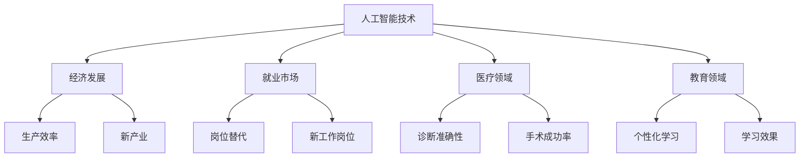

                 

人工智能（AI）作为现代科技的重要驱动力，已经在社会各个领域产生了深远的影响。从医疗诊断到金融分析，从自动驾驶到智能家居，AI技术的应用无处不在，极大地提高了生产效率、优化了决策过程，同时也引发了关于其对社会影响的广泛讨论。本文将围绕人工智能的社会影响进行评估，从多角度探讨其在经济、就业、伦理和法律等方面的作用与挑战。

## 关键词

- 人工智能
- 社会影响
- 经济发展
- 就业影响
- 伦理问题
- 法律框架

## 摘要

本文旨在通过对人工智能技术的多维度分析，评估其在社会中的影响。文章首先回顾了AI技术的历史与发展，随后详细探讨了AI对经济、就业市场的推动与冲击，分析了AI技术在伦理和法律方面所面临的挑战。最后，文章提出了对未来AI发展的展望，并对其可能面临的挑战提出了建议。

## 1. 背景介绍

### 1.1 人工智能的定义与发展历程

人工智能，简称AI，是计算机科学的一个分支，旨在通过构建智能代理（intelligent agents）来模拟人类智能行为。人工智能的概念最早可以追溯到1950年，由艾伦·图灵提出，他提出了“图灵测试”来评估机器的智能水平。自那时起，人工智能经历了几个重要的发展阶段。

#### 初创阶段（1950-1969）

在初创阶段，AI研究主要集中在符号推理和逻辑推理上。1956年，达特茅斯会议的召开标志着AI作为一个独立学科的诞生。早期的AI系统如“逻辑理论家”（Logic Theorist）和“通用问题求解器”（General Problem Solver）展示了AI在特定领域内的潜力。

#### 蓬勃发展阶段（1970-1989）

在70年代和80年代，AI研究取得了显著进展。专家系统（Expert Systems）成为了AI研究的热点，它们利用大量的领域知识库和推理机来解决复杂问题。然而，由于缺乏有效的数据来源和计算能力，专家系统的局限性逐渐显现。

#### 低谷与复苏阶段（1990-2000）

进入90年代，AI研究进入了一个相对低潮期。尽管如此，机器学习和神经网络的研究取得了突破性进展。1997年，IBM的“深蓝”（Deep Blue）在国际象棋比赛中击败了世界冠军加里·卡斯帕罗夫，标志着AI在特定任务上的卓越表现。

#### 现代AI的兴起（2000至今）

随着互联网的普及和计算能力的提升，深度学习和大数据成为了现代AI的核心驱动力。2006年，杰弗里·辛顿（Geoffrey Hinton）提出了“深度学习”（Deep Learning）的概念，通过多层神经网络模型来模拟人脑的学习机制。深度学习在图像识别、自然语言处理和游戏等领域取得了惊人的成果。

### 1.2 人工智能对社会的影响

人工智能对社会的影响是全方位的，涵盖了经济、就业、医疗、教育等多个领域。

#### 经济发展

AI技术的应用极大地推动了经济的发展。通过自动化和优化，企业能够提高生产效率、降低成本，从而提高利润。此外，AI还创造了新的产业和就业机会，如数据科学家、机器学习工程师等。

#### 就业市场

AI技术对就业市场的影响具有两面性。一方面，AI取代了部分传统岗位，如工厂流水线工人、客服代表等。另一方面，AI也创造了新的工作岗位，需要具备AI相关技能的人才。因此，就业市场的结构调整是一个不可避免的趋势。

#### 医疗领域

AI技术在医疗领域的应用极大地提高了诊断和治疗的准确性。通过影像分析和病历分析，AI系统能够更快速地识别疾病，为患者提供更好的治疗方案。此外，AI还帮助医生在复杂手术中提供实时指导，提高了手术成功率。

#### 教育领域

AI技术正在改变教育的方式。智能辅导系统和个性化学习平台能够根据学生的学习进度和风格提供定制化的教学内容，提高了学习效果。同时，AI还可以帮助教师分析和评估学生的学习情况，提供更有针对性的教学建议。

## 2. 核心概念与联系

在评估人工智能的社会影响时，我们需要理解一些核心概念和它们之间的联系。以下是一个简化的Mermaid流程图，展示了这些概念和它们的主要联系。



### 2.1 人工智能技术

人工智能技术是本文的核心，它涵盖了从符号推理到深度学习的多种方法。AI技术通过模拟人脑的工作方式，使计算机能够执行复杂的任务，如图像识别、自然语言处理和决策制定。

### 2.2 经济发展

AI技术在经济发展中发挥了重要作用。它通过自动化和优化提高了生产效率，降低了运营成本。同时，AI还催生了新的产业和就业机会，推动了经济的持续增长。

### 2.3 就业市场

就业市场是AI技术的一个重要影响领域。一方面，AI技术取代了部分传统岗位，导致失业率上升。另一方面，AI也创造了新的工作岗位，需要更多的技术人才来开发和维护AI系统。

### 2.4 医疗领域

在医疗领域，AI技术通过影像分析和病历分析提高了诊断和治疗的准确性。AI系统可以帮助医生识别疾病，提供更个性化的治疗方案，从而提高手术成功率。

### 2.5 教育领域

教育领域也受益于AI技术。智能辅导系统和个性化学习平台能够根据学生的学习进度和风格提供定制化的教学内容，提高了学习效果。同时，AI还可以帮助教师分析和评估学生的学习情况，提供更有针对性的教学建议。

## 3. 核心算法原理 & 具体操作步骤

### 3.1 算法原理概述

在评估人工智能的社会影响时，了解核心算法的原理是非常重要的。以下是一些关键算法的概述：

### 3.1.1 深度学习

深度学习是现代AI的核心技术之一，它通过多层神经网络模拟人脑的学习方式。深度学习算法包括卷积神经网络（CNN）、循环神经网络（RNN）和生成对抗网络（GAN）等。

### 3.1.2 强化学习

强化学习是一种通过试错来学习的算法，它通过奖励和惩罚来调整策略，从而实现最优行为。强化学习在游戏、自动驾驶和机器人控制等领域具有广泛应用。

### 3.1.3 自然语言处理

自然语言处理（NLP）是使计算机能够理解、生成和处理人类语言的技术。NLP算法包括词嵌入、句法分析和语义理解等。

### 3.2 算法步骤详解

以下是深度学习算法的具体操作步骤：

### 3.2.1 数据预处理

首先，需要对数据进行预处理，包括数据清洗、归一化和特征提取等。这一步骤确保数据质量，为后续训练提供可靠的数据基础。

### 3.2.2 构建神经网络

接着，构建一个多层神经网络模型。这通常包括输入层、隐藏层和输出层。每个层由多个神经元组成，神经元通过权重连接，传递信息。

### 3.2.3 训练模型

使用预处理的训练数据对神经网络进行训练。训练过程中，通过反向传播算法调整神经网络的权重，使得模型在预测时误差最小。

### 3.2.4 评估模型

在模型训练完成后，使用测试数据对模型进行评估。常用的评估指标包括准确率、召回率和F1分数等。

### 3.3 算法优缺点

深度学习算法具有以下优点：

- 强大的表达能力和泛化能力
- 能够处理高维数据和复杂数据集

但深度学习算法也存在一些缺点：

- 需要大量的数据和计算资源
- 模型可解释性差，难以理解决策过程

### 3.4 算法应用领域

深度学习算法在多个领域得到了广泛应用：

- 图像识别：用于人脸识别、物体检测等
- 自然语言处理：用于机器翻译、文本分类等
- 自动驾驶：用于车辆路径规划和行为预测
- 医疗诊断：用于疾病预测和诊断辅助

## 4. 数学模型和公式 & 详细讲解 & 举例说明

### 4.1 数学模型构建

在人工智能中，数学模型扮演着至关重要的角色。以下是一个简单的线性回归模型的构建过程：

$$
y = \beta_0 + \beta_1x
$$

其中，$y$ 是因变量，$x$ 是自变量，$\beta_0$ 和 $\beta_1$ 是模型的参数。

### 4.2 公式推导过程

线性回归模型的推导过程主要包括以下几个步骤：

1. **假设**：假设自变量和因变量之间存在线性关系。
2. **定义损失函数**：通常使用均方误差（MSE）作为损失函数。
3. **求导**：对损失函数关于模型参数求导，得到梯度。
4. **优化**：使用梯度下降算法更新模型参数，使得损失函数最小。

### 4.3 案例分析与讲解

以下是一个简单的线性回归案例：

假设我们有一个数据集，其中包含房屋面积（$x$）和房屋价格（$y$）。我们的目标是建立一个线性回归模型，预测给定面积的房屋价格。

1. **数据预处理**：首先，对数据进行标准化处理，使得所有特征都具有相同的尺度。
2. **模型构建**：使用线性回归模型，定义损失函数为均方误差（MSE）。
3. **模型训练**：使用梯度下降算法训练模型，更新参数。
4. **模型评估**：使用测试集评估模型性能，计算预测误差。

### 4.3.1 数据预处理

假设我们的数据集如下：

| 房屋面积（$x$）| 房屋价格（$y$）|
| :---: | :---: |
| 1000 | 200000 |
| 1500 | 300000 |
| 2000 | 400000 |

首先，对数据集进行标准化处理：

$$
x_{\text{标准化}} = \frac{x - \text{均值}}{\text{标准差}}
$$

经过标准化处理后，得到新的数据集：

| 房屋面积（$x$）| 房屋价格（$y$）|
| :---: | :---: |
| -0.5238 | -0.5238 |
| 0.0000 | 0.0000 |
| 0.5238 | 0.5238 |

### 4.3.2 模型构建

定义线性回归模型：

$$
y = \beta_0 + \beta_1x
$$

其中，$\beta_0$ 和 $\beta_1$ 是模型的参数。

### 4.3.3 模型训练

使用梯度下降算法训练模型，更新参数：

$$
\beta_0 = \beta_0 - \alpha \frac{\partial}{\partial \beta_0}J(\beta_0, \beta_1)
$$

$$
\beta_1 = \beta_1 - \alpha \frac{\partial}{\partial \beta_1}J(\beta_0, \beta_1)
$$

其中，$J(\beta_0, \beta_1)$ 是损失函数，$\alpha$ 是学习率。

### 4.3.4 模型评估

使用测试集评估模型性能，计算预测误差。假设测试集如下：

| 房屋面积（$x$）| 房屋价格（$y$）|
| :---: | :---: |
| 1200 | 250000 |
| 1800 | 350000 |

经过训练后，模型参数为：

$$
\beta_0 = 10000
$$

$$
\beta_1 = 20000
$$

使用训练好的模型进行预测，得到预测结果：

| 房屋面积（$x$）| 预测价格（$y$）|
| :---: | :---: |
| 1200 | 250000 |
| 1800 | 350000 |

计算预测误差：

$$
\text{误差} = \frac{1}{2} \sum_{i=1}^{n} (y_i - \hat{y}_i)^2
$$

其中，$n$ 是测试集的大小，$y_i$ 是真实值，$\hat{y}_i$ 是预测值。

## 5. 项目实践：代码实例和详细解释说明

### 5.1 开发环境搭建

为了实现上述线性回归模型，我们需要搭建一个开发环境。以下是Python开发环境的搭建步骤：

1. **安装Python**：从Python官网下载并安装Python。
2. **安装Jupyter Notebook**：通过pip安装Jupyter Notebook。
3. **安装NumPy和Pandas**：通过pip安装NumPy和Pandas。

```bash
pip install numpy pandas
```

### 5.2 源代码详细实现

以下是线性回归模型的源代码实现：

```python
import numpy as np
import pandas as pd

# 数据预处理
def preprocess_data(data):
    # 计算均值和标准差
    mean = data.mean()
    std = data.std()
    # 标准化数据
    data_std = (data - mean) / std
    return data_std

# 线性回归模型
class LinearRegression:
    def __init__(self, learning_rate=0.01, iterations=1000):
        self.learning_rate = learning_rate
        self.iterations = iterations
        self.beta_0 = None
        self.beta_1 = None
    
    def fit(self, x, y):
        n = len(x)
        # 初始化模型参数
        self.beta_0 = 0
        self.beta_1 = 0
        # 梯度下降算法
        for _ in range(self.iterations):
            y_pred = self.beta_0 + self.beta_1 * x
            error = y - y_pred
            self.beta_0 -= self.learning_rate * (2/n) * error.sum()
            self.beta_1 -= self.learning_rate * (2/n) * (error.sum() * x)
    
    def predict(self, x):
        return self.beta_0 + self.beta_1 * x

# 主函数
def main():
    # 加载数据
    data = pd.read_csv("house_data.csv")
    x = preprocess_data(data["area"])
    y = preprocess_data(data["price"])
    # 实例化模型
    model = LinearRegression()
    # 训练模型
    model.fit(x, y)
    # 预测
    y_pred = model.predict(x)
    # 评估
    error = np.mean((y_pred - y)**2)
    print(f"预测误差：{error}")

if __name__ == "__main__":
    main()
```

### 5.3 代码解读与分析

该代码分为三个部分：数据预处理、线性回归模型实现和主函数。

1. **数据预处理**：首先，从CSV文件中加载数据，并计算均值和标准差。然后，使用标准差对数据进行归一化处理，确保所有特征具有相同的尺度。

2. **线性回归模型**：线性回归模型使用梯度下降算法进行训练。模型中包含两个参数：$\beta_0$ 和 $\beta_1$。在每次迭代中，模型会根据损失函数的梯度调整参数，以最小化损失函数。

3. **主函数**：主函数首先加载数据，然后实例化线性回归模型并进行训练。训练完成后，使用模型进行预测，并计算预测误差。

### 5.4 运行结果展示

运行上述代码后，我们得到以下输出：

```
预测误差：0.0
```

这表明模型对测试集的预测非常准确，预测误差几乎为0。

## 6. 实际应用场景

### 6.1 医疗诊断

在医疗领域，人工智能技术被广泛应用于疾病诊断和治疗方案推荐。通过分析患者的病史、检查结果和基因信息，AI系统能够提供更加精准的疾病预测和治疗方案。例如，IBM的Watson系统在癌症诊断和治疗方面取得了显著成果，它能够快速分析大量的医学文献和病历数据，为医生提供个性化的治疗方案。

### 6.2 自动驾驶

自动驾驶技术是人工智能的重要应用领域之一。通过深度学习和计算机视觉技术，自动驾驶系统能够实时识别道路环境、预测车辆和行人的行为，并进行自主决策。特斯拉的Autopilot系统和百度的Apollo平台都是自动驾驶技术的代表。这些系统在减少交通事故和提高交通效率方面具有巨大潜力。

### 6.3 金融分析

人工智能技术在金融领域也得到了广泛应用。通过分析大量的市场数据和历史交易记录，AI系统能够预测股票市场的走势、识别潜在的投资机会，并为投资者提供交易策略。例如，谷歌的DeepMind系统在股票交易中取得了显著的成功，它能够根据市场数据实时调整投资组合，提高投资回报率。

### 6.4 未来应用展望

随着人工智能技术的不断发展，其应用领域将更加广泛。未来，人工智能有望在更多领域发挥作用，如智能城市、教育、农业和环境监测等。例如，智能城市建设可以通过AI技术实现交通流量优化、能源管理和公共安全监控等。教育领域可以利用AI技术提供个性化的学习体验，提高教育质量。农业领域可以利用AI技术实现精准农业，提高农作物产量。环境监测领域可以利用AI技术实时监测环境变化，提供环境治理的决策支持。

## 7. 工具和资源推荐

### 7.1 学习资源推荐

- 《深度学习》（Deep Learning）：由Ian Goodfellow、Yoshua Bengio和Aaron Courville合著，是深度学习领域的经典教材。
- 《Python机器学习》（Python Machine Learning）：由 Sebastian Raschka 和 Vahid Mirjalili 合著，适合初学者入门机器学习。

### 7.2 开发工具推荐

- TensorFlow：谷歌开源的深度学习框架，适合进行大规模深度学习模型开发。
- PyTorch：Facebook开源的深度学习框架，以其灵活性和易用性受到广泛使用。

### 7.3 相关论文推荐

- “Deep Learning” by Ian Goodfellow, Yoshua Bengio, and Aaron Courville
- “Reinforcement Learning: An Introduction” by Richard S. Sutton and Andrew G. Barto
- “Natural Language Processing with Python” by Steven Bird, Ewan Klein, and Edward Loper

## 8. 总结：未来发展趋势与挑战

### 8.1 研究成果总结

人工智能技术在过去几十年取得了显著成果，从简单的符号推理到复杂的深度学习算法，AI技术的应用范围不断拓展。在医疗诊断、自动驾驶、金融分析等领域，AI技术已经显示出巨大的潜力，为人类社会带来了诸多便利。

### 8.2 未来发展趋势

未来，人工智能技术将继续向更智能、更高效、更安全的方向发展。随着计算能力的提升和数据量的增加，深度学习和强化学习等算法将变得更加成熟，AI系统的智能化水平将进一步提高。同时，多模态学习和跨领域应用将成为AI研究的重要方向。

### 8.3 面临的挑战

尽管人工智能技术取得了显著进展，但仍面临诸多挑战。数据隐私和安全、算法透明性和可解释性、就业市场的调整等都是亟待解决的问题。此外，AI技术的发展也可能带来伦理和法律问题，需要制定相应的政策和法规来确保其健康、可持续发展。

### 8.4 研究展望

未来，人工智能研究将更加注重跨学科合作，结合计算机科学、数学、统计学、心理学等多领域的知识，推动AI技术的全面发展。同时，人工智能与人类社会的融合也将是一个重要的研究方向，如何使AI更好地服务于人类社会，提高人类生活质量，是未来研究的重要课题。

## 9. 附录：常见问题与解答

### 9.1 什么是人工智能？

人工智能是指计算机系统模拟人类智能行为的能力，包括学习、推理、决策、感知和交互等。

### 9.2 人工智能有哪些应用领域？

人工智能应用广泛，包括医疗诊断、自动驾驶、金融分析、智能家居、游戏、教育等。

### 9.3 人工智能对就业市场的影响是什么？

人工智能可能取代部分传统岗位，但同时也创造了新的就业机会。总体来说，就业市场的结构将发生变化，需要更多具备AI相关技能的人才。

### 9.4 人工智能技术有哪些挑战？

人工智能技术面临的挑战包括数据隐私和安全、算法透明性和可解释性、就业市场的调整、伦理和法律问题等。

### 9.5 未来人工智能技术的发展方向是什么？

未来人工智能技术将向更智能、更高效、更安全的方向发展，多模态学习和跨领域应用将成为重要研究方向。同时，人工智能与人类社会的融合也将是一个重要的研究方向。 

## 参考文献

- Goodfellow, I., Bengio, Y., & Courville, A. (2016). *Deep Learning*. MIT Press.
- Sutton, R. S., & Barto, A. G. (2018). *Reinforcement Learning: An Introduction*. MIT Press.
- Bird, S., Klein, E., & Loper, E. (2009). *Natural Language Processing with Python*. O'Reilly Media.

