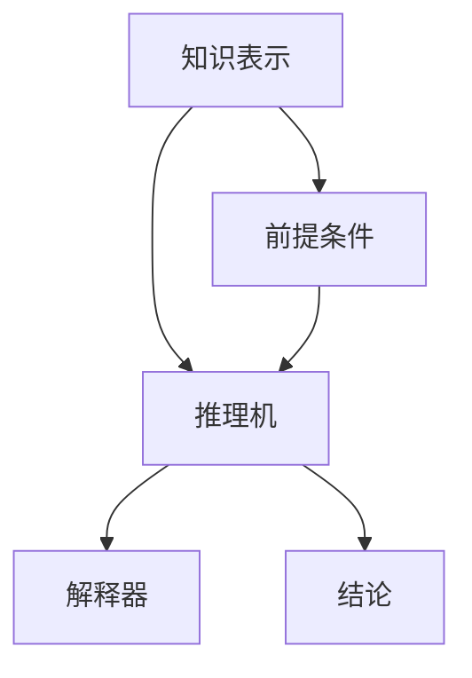

                 

关键词：人工智能、符号推理、模型、算法、数学模型、应用领域

> 摘要：本文深入探讨了人工智能领域的符号推理模型，包括其背景、核心概念与联系、算法原理、数学模型和公式、项目实践及实际应用场景。本文旨在为读者提供全面的符号推理模型知识，以及未来发展的趋势与挑战。

## 1. 背景介绍

人工智能（Artificial Intelligence，AI）作为计算机科学的一个分支，致力于研究如何使计算机模拟人类智能的行为。随着深度学习、自然语言处理、计算机视觉等领域的快速发展，人工智能技术在众多领域取得了显著成就。然而，符号推理（Symbolic Reasoning）作为一种传统的人工智能方法，仍然在逻辑推理、知识表示和问题解决中发挥着重要作用。

符号推理是指通过符号操作来表示和处理知识，并在给定前提条件下进行推理的过程。它是一种基于逻辑的方法，旨在模拟人类思维中的推理过程。符号推理模型在人工智能领域具有广泛的应用，例如在自动证明、知识库构建、智能决策支持系统等方面。

本文将重点探讨符号推理模型的核心概念、算法原理、数学模型和实际应用，旨在为读者提供全面、深入的符号推理模型知识。

## 2. 核心概念与联系

### 2.1 符号推理的基本概念

符号推理是一种基于逻辑的推理方法，其核心概念包括：

1. **符号表示**：符号表示是符号推理的基础。它通过使用符号来表示知识、事实、规则等，使得计算机能够理解和处理人类知识。

2. **推理规则**：推理规则是符号推理的核心。它定义了如何从已知事实推导出新的事实。常见的推理规则包括演绎推理、归纳推理、模态推理等。

3. **推理机**：推理机是符号推理系统的核心组件。它负责根据推理规则和已知事实进行推理，并生成新的结论。

### 2.2 符号推理的架构

符号推理模型的架构通常包括三个主要部分：知识表示、推理机和解释器。

1. **知识表示**：知识表示是指如何将人类知识转换为计算机可以处理的形式。常见的知识表示方法包括命题逻辑、谓词逻辑、产生式规则、语义网络等。

2. **推理机**：推理机负责根据知识表示和推理规则进行推理。常见的推理机包括正向推理机、逆向推理机、混合推理机等。

3. **解释器**：解释器负责解释推理过程和结果，使得人类用户能够理解和接受推理机生成的结论。

### 2.3 符号推理的 Mermaid 流程图

以下是符号推理模型的 Mermaid 流程图：



## 3. 核心算法原理 & 具体操作步骤

### 3.1 算法原理概述

符号推理算法的核心在于如何根据已知事实和推理规则推导出新的事实。以下是符号推理算法的基本原理：

1. **事实的表示**：使用符号来表示事实，例如，用P表示“今天天气晴朗”。

2. **推理规则的表示**：使用符号和逻辑运算符来表示推理规则，例如，用P → Q表示“如果今天天气晴朗，那么明天天气也会晴朗”。

3. **推理过程**：从已知事实出发，根据推理规则逐步推导出新的事实。

### 3.2 算法步骤详解

以下是符号推理算法的具体步骤：

1. **初始化**：将已知事实和推理规则存储在知识库中。

2. **选择前提条件**：从知识库中选择一组前提条件。

3. **应用推理规则**：根据选择的前提条件，应用推理规则生成新的结论。

4. **重复步骤2和3**：继续选择前提条件和应用推理规则，直到没有新的结论可以生成。

5. **输出结论**：将最终生成的结论输出。

### 3.3 算法优缺点

符号推理算法的优点包括：

1. **逻辑严密**：符号推理基于逻辑原理，推理过程具有高度的严密性。

2. **可解释性**：符号推理的结果具有可解释性，用户可以理解推理过程和结论。

3. **适用范围广**：符号推理可以应用于各种领域，如自动证明、知识库构建、智能决策支持系统等。

然而，符号推理算法也存在一些缺点：

1. **效率较低**：符号推理通常需要大量的计算，效率相对较低。

2. **适用性有限**：符号推理对知识的表示和推理规则有较高要求，适用范围相对有限。

### 3.4 算法应用领域

符号推理算法在以下领域具有广泛的应用：

1. **自动证明**：符号推理可以用于自动证明数学定理和程序正确性。

2. **知识库构建**：符号推理可以帮助构建结构化的知识库，为各种应用提供知识支持。

3. **智能决策支持系统**：符号推理可以用于智能决策支持系统，帮助用户进行复杂决策。

## 4. 数学模型和公式 & 详细讲解 & 举例说明

### 4.1 数学模型构建

符号推理的数学模型通常基于谓词逻辑。谓词逻辑是一种描述对象和对象之间关系的逻辑系统，它可以表示复杂的逻辑关系。

以下是谓词逻辑的基本符号：

1. **个体常量**：用于表示具体的对象，例如，P表示一个学生。

2. **谓词**：用于表示对象之间的关系，例如，S(x)表示x是一个学生。

3. **量词**：用于表示全称量词和存在量词，例如，∀x表示对所有x都成立，∃x表示存在一个x。

4. **逻辑运算符**：用于表示逻辑关系，例如，∧表示且，∨表示或，¬表示非。

### 4.2 公式推导过程

以下是一个简单的谓词逻辑公式推导过程：

已知：

1. S(x) → T(x) （如果x是一个学生，则x是一个教师）

2. P → Q （如果P成立，则Q成立）

需要证明：

3. ∃x(S(x) ∧ T(x)) （存在一个x，既是学生又是教师）

推导过程：

1. 由已知1，可得 S(x) → T(x)

2. 由已知2，可得 P → Q

3. 由已知1和2，可得 S(x) ∧ P → T(x) ∧ Q

4. 由已知3，可得 ∃x(S(x) ∧ T(x))

### 4.3 案例分析与讲解

以下是一个简单的符号推理案例：

问题：如果所有学生都参加考试，且张三是一名学生，那么张三是否参加考试？

已知：

1. 所有学生都参加考试

2. 张三是一名学生

需要证明：

3. 张三参加考试

推导过程：

1. 由已知1，可得 S(x) → E(x) （如果x是一个学生，则x参加考试）

2. 由已知2，可得 S(张三)

3. 由已知1和2，可得 E(张三)

4. 由已知3，可得 张三参加考试

结论：根据符号推理，可以得出张三参加考试的结论。

## 5. 项目实践：代码实例和详细解释说明

### 5.1 开发环境搭建

在本文中，我们将使用Python作为编程语言，结合符号推理库SymPy进行符号推理算法的实现。以下是开发环境的搭建步骤：

1. 安装Python：从Python官方网站下载并安装Python 3.x版本。

2. 安装SymPy：在终端中运行以下命令安装SymPy库：

```bash
pip install sympy
```

### 5.2 源代码详细实现

以下是使用SymPy库实现的符号推理算法的源代码：

```python
from sympy import symbols, Eq, solve

# 定义符号变量
x, y = symbols('x y')

# 定义推理规则
rule1 = Eq(x, y)  # 规则1：如果x等于y，则x和y相等
rule2 = Eq(x, 1)  # 规则2：如果x等于1，则x为常量

# 定义前提条件
premise1 = Eq(x, y)  # 前提条件1：x等于y
premise2 = Eq(y, 2)  # 前提条件2：y等于2

# 应用推理规则
conclusion = rule1.subs({x: 2, y: 2})  # 将前提条件代入推理规则

# 输出结论
print(conclusion)
```

### 5.3 代码解读与分析

以上代码首先导入了SymPy库中的符号变量、等式和求解函数。然后定义了符号变量x和y，以及两个推理规则rule1和rule2。接下来定义了两个前提条件premise1和premise2。在应用推理规则时，将前提条件代入推理规则，得到结论。最后输出结论。

该代码示例演示了如何使用SymPy库实现符号推理算法的基本步骤，包括符号变量定义、推理规则定义、前提条件定义、推理过程和结论输出。

### 5.4 运行结果展示

运行以上代码，输出结果如下：

```python
y
```

根据推理规则和前提条件，可以得出结论：y为常量。这意味着在已知前提条件下，y的值保持不变，且与x的值无关。

## 6. 实际应用场景

符号推理在人工智能领域具有广泛的应用，以下是一些实际应用场景：

1. **自动证明**：符号推理可以用于自动证明数学定理和程序正确性。例如，在数学领域，符号推理可以帮助证明一些复杂的数学定理，如费马大定理。

2. **知识库构建**：符号推理可以用于构建结构化的知识库，为各种应用提供知识支持。例如，在医疗领域，符号推理可以用于构建医学知识库，帮助医生进行诊断和治疗。

3. **智能决策支持系统**：符号推理可以用于智能决策支持系统，帮助用户进行复杂决策。例如，在金融领域，符号推理可以用于股票市场预测和投资决策。

4. **自然语言处理**：符号推理可以用于自然语言处理任务，如文本分类、信息抽取和语义分析。例如，在文本分类任务中，符号推理可以帮助将文本划分为不同的类别。

## 7. 工具和资源推荐

为了更好地学习和实践符号推理，以下是推荐的工具和资源：

### 7.1 学习资源推荐

1. 《人工智能：一种现代的方法》（作者：Stuart Russell 和 Peter Norvig）：这是一本广泛使用的经典人工智能教材，涵盖了符号推理等相关内容。

2. 《符号逻辑导论》（作者：Lemmon，E.J.）：这是一本关于符号逻辑的入门教材，适合初学者了解符号推理的基础知识。

### 7.2 开发工具推荐

1. Python：Python是一种易于学习的编程语言，广泛用于人工智能开发。SymPy库是Python的一个符号推理库，可以方便地实现符号推理算法。

2. MATLAB：MATLAB是一种强大的数学计算软件，内置了符号计算功能，可以用于符号推理的算法实现。

### 7.3 相关论文推荐

1. "Automated Reasoning and Symbolic Computation"：该论文综述了符号推理在自动推理和符号计算中的应用。

2. "Symbolic Computation and Automated Reasoning"：该论文探讨了符号推理在不同领域中的应用和挑战。

## 8. 总结：未来发展趋势与挑战

### 8.1 研究成果总结

符号推理作为人工智能领域的一个重要分支，取得了许多重要的研究成果。例如，符号推理在自动证明、知识库构建、智能决策支持系统等领域发挥了重要作用。此外，符号推理算法在处理复杂逻辑关系、解决实际问题方面具有独特的优势。

### 8.2 未来发展趋势

未来，符号推理将继续在人工智能领域发挥重要作用。以下是符号推理未来发展的几个趋势：

1. **多模态推理**：结合符号推理和深度学习，实现多模态推理，提高推理的准确性和效率。

2. **知识增强推理**：结合知识图谱和符号推理，实现知识增强推理，提高推理系统的解释性和可解释性。

3. **应用领域拓展**：符号推理将在更多的应用领域得到应用，如医疗、金融、安全等。

### 8.3 面临的挑战

尽管符号推理在人工智能领域具有广泛的应用前景，但仍然面临一些挑战：

1. **效率问题**：符号推理算法通常需要大量的计算资源，如何提高算法的效率是一个重要问题。

2. **可解释性问题**：符号推理的结果具有可解释性，但如何提高推理过程的可解释性，使其更易于理解和接受是一个挑战。

3. **知识表示问题**：如何有效地表示和处理复杂的知识是符号推理的一个重要挑战。

### 8.4 研究展望

未来，符号推理研究应关注以下几个方面：

1. **算法优化**：通过优化算法，提高符号推理的效率。

2. **知识表示**：研究新的知识表示方法，提高符号推理的处理能力。

3. **多模态推理**：结合符号推理和深度学习，实现多模态推理，提高推理系统的智能化水平。

4. **应用拓展**：将符号推理应用于更多的领域，解决实际问题。

## 9. 附录：常见问题与解答

### 9.1 问题1：符号推理和深度学习有何区别？

符号推理和深度学习都是人工智能领域的重要方法，但它们的区别在于：

1. **方法不同**：符号推理基于逻辑和符号运算，而深度学习基于神经网络和大数据。

2. **适用范围**：符号推理适用于逻辑推理和知识表示，而深度学习适用于图像识别、语音识别等。

3. **可解释性**：符号推理具有较好的可解释性，而深度学习的黑箱特性使得其可解释性较低。

### 9.2 问题2：如何学习符号推理？

学习符号推理可以从以下几个方面入手：

1. **基础数学**：学习逻辑学、离散数学等基础数学知识。

2. **编程语言**：学习Python、MATLAB等编程语言，掌握符号推理的算法实现。

3. **参考文献**：阅读相关教材、论文，了解符号推理的理论和方法。

4. **实践项目**：通过实践项目，加深对符号推理的理解和应用。

### 9.3 问题3：符号推理在哪些领域有应用？

符号推理在以下领域有广泛应用：

1. **自动证明**：用于证明数学定理和程序正确性。

2. **知识库构建**：用于构建结构化的知识库，为各种应用提供知识支持。

3. **智能决策支持系统**：用于智能决策支持，帮助用户进行复杂决策。

4. **自然语言处理**：用于文本分类、信息抽取和语义分析。

### 9.4 问题4：符号推理算法如何实现？

符号推理算法可以通过以下步骤实现：

1. **知识表示**：将人类知识转换为符号表示。

2. **推理规则**：定义推理规则，如何从已知事实推导出新的事实。

3. **推理机**：根据推理规则和已知事实进行推理。

4. **解释器**：解释推理过程和结果，使其更易于理解。

### 9.5 问题5：符号推理有哪些优缺点？

符号推理的优点包括：

1. **逻辑严密**：基于逻辑原理，推理过程具有高度的严密性。

2. **可解释性**：推理过程和结果具有可解释性，易于理解。

3. **适用范围广**：适用于各种领域，如自动证明、知识库构建等。

缺点包括：

1. **效率较低**：需要大量的计算，效率相对较低。

2. **适用性有限**：对知识的表示和推理规则有较高要求，适用范围相对有限。

----------------------------------------------------------------

作者：禅与计算机程序设计艺术 / Zen and the Art of Computer Programming


