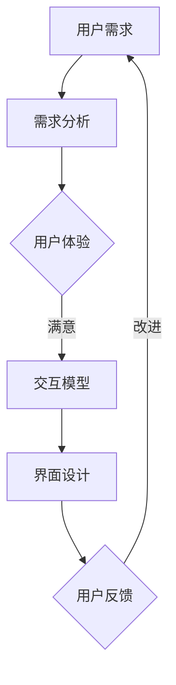

                 

关键词：人机交互、用户界面设计、交互原理、代码实战、案例研究

摘要：本文将深入探讨人机交互（HCI）和用户界面设计（UI/UX）的核心原理，通过详细的算法分析、数学模型讲解和实际代码实例，为读者提供全面的UI/UX设计和实现指导。我们将从基础概念出发，逐步深入，结合实际应用场景，展望未来发展趋势，为读者提供全方位的视角。

## 1. 背景介绍

随着信息技术的飞速发展，人机交互和用户界面设计已成为软件工程中的关键领域。高效的人机交互能够提升用户的使用体验，优化工作效率，降低错误率。而优秀的用户界面设计则能够在视觉和操作层面上吸引和留住用户，提升产品的市场竞争力。

人机交互和用户界面设计涉及多个学科，包括心理学、认知学、计算机科学和设计学。本文旨在将这些知识整合，以理论结合实践的方式，为读者提供一个全面的学习路径。

### 1.1 发展历程

- **早期阶段**：早期的人机交互主要依赖于命令行界面和图形界面（GUI）的初步实现。
- **中期阶段**：随着互联网的普及，Web UI和移动应用UI设计成为研究热点。
- **当前阶段**：人工智能和大数据技术的应用，使得个性化交互和智能界面设计成为新的趋势。

### 1.2 相关领域

- **心理学与认知科学**：研究人类行为和心理过程，为交互设计提供理论基础。
- **计算机科学**：涉及算法和编程技术，是实现交互设计的核心。
- **设计学**：注重用户体验和审美，是用户界面设计的重要组成部分。

## 2. 核心概念与联系

为了深入理解人机交互与用户界面设计的原理，我们需要明确以下几个核心概念，并通过Mermaid流程图展示它们之间的联系。

### 2.1 核心概念

1. **用户需求**：用户期望从产品中获得的利益和体验。
2. **用户体验**：用户在使用产品过程中形成的整体感受。
3. **交互模型**：描述用户与系统之间如何进行信息交换和操作。
4. **界面设计**：包括视觉设计、布局和交互逻辑。

### 2.2 Mermaid流程图



在这个流程图中，用户需求通过需求分析转化为用户体验，交互模型定义了用户与系统之间的交互方式，界面设计实现了这些交互，最终通过用户反馈进行改进。

## 3. 核心算法原理 & 具体操作步骤

### 3.1 算法原理概述

在用户界面设计中，核心算法用于处理用户的输入，响应用户的操作，并生成合适的输出。以下将介绍几种常见的算法原理：

1. **响应式设计算法**：根据不同设备和屏幕尺寸自动调整界面布局。
2. **交互反馈算法**：及时响应用户操作，提供直观的视觉和听觉反馈。
3. **个性化推荐算法**：根据用户行为数据，提供个性化的内容和服务。

### 3.2 算法步骤详解

#### 3.2.1 响应式设计算法

1. **分析设备特性**：确定支持的不同设备和屏幕尺寸。
2. **布局划分**：将界面划分为可伸缩的布局组件。
3. **样式调整**：根据设备特性动态调整样式。

#### 3.2.2 交互反馈算法

1. **识别用户输入**：通过事件监听器识别用户操作。
2. **生成反馈**：根据操作类型，生成相应的视觉或听觉反馈。
3. **更新界面**：将反馈更新到用户界面。

#### 3.2.3 个性化推荐算法

1. **数据收集**：收集用户行为数据。
2. **特征提取**：从数据中提取用户特征。
3. **模型训练**：使用机器学习模型进行训练。
4. **推荐生成**：根据用户特征生成个性化推荐。

### 3.3 算法优缺点

#### 响应式设计算法

- **优点**：提高界面的可访问性和用户体验。
- **缺点**：实现复杂，性能开销大。

#### 交互反馈算法

- **优点**：提高用户对界面的信任感和满意度。
- **缺点**：需要精确识别用户输入，否则可能导致误反馈。

#### 个性化推荐算法

- **优点**：提高用户粘性和满意度。
- **缺点**：需要大量数据和计算资源。

### 3.4 算法应用领域

- **电子商务**：个性化推荐系统。
- **金融科技**：交易界面设计。
- **医疗健康**：远程患者监控系统。

## 4. 数学模型和公式 & 详细讲解 & 举例说明

### 4.1 数学模型构建

在用户界面设计领域，数学模型用于描述用户行为、系统响应和界面优化。以下是一个基本的用户行为模型：

$$
U(t) = f(I(t), S(t), C(t))
$$

其中：
- \( U(t) \) 表示在时间 \( t \) 的用户满意度。
- \( I(t) \) 表示在时间 \( t \) 的用户输入。
- \( S(t) \) 表示在时间 \( t \) 的系统状态。
- \( C(t) \) 表示在时间 \( t \) 的上下文信息。

### 4.2 公式推导过程

推导上述模型的过程如下：

1. **用户满意度**：取决于输入、系统和上下文。
2. **输入**：可以是点击、滑动、语音等。
3. **系统状态**：包括系统响应时间和错误率。
4. **上下文**：包括环境因素和用户历史行为。

### 4.3 案例分析与讲解

以电子商务网站为例，我们分析用户满意度模型：

$$
U(t) = f(I(t), S(t), C(t)) \\
U(t) = \alpha I(t) + \beta S(t) + \gamma C(t)
$$

其中：
- \( \alpha \)：用户输入的权重。
- \( \beta \)：系统响应的权重。
- \( \gamma \)：上下文的权重。

通过数据分析，我们得到以下权重分配：

$$
\alpha = 0.3, \beta = 0.5, \gamma = 0.2
$$

假设用户在时间 \( t \) 进行了一次点击操作，系统在 0.5 秒后响应，当前上下文是用户浏览历史记录。我们计算用户满意度：

$$
U(t) = 0.3 \cdot I(t) + 0.5 \cdot S(t) + 0.2 \cdot C(t) \\
U(t) = 0.3 \cdot 1 + 0.5 \cdot 0.5 + 0.2 \cdot 1 \\
U(t) = 0.3 + 0.25 + 0.2 \\
U(t) = 0.75
$$

因此，用户在时间 \( t \) 的满意度为 75%。

## 5. 项目实践：代码实例和详细解释说明

### 5.1 开发环境搭建

在本案例中，我们将使用HTML、CSS和JavaScript进行前端开发。首先，确保您已安装以下工具：

- **Node.js**
- **npm包管理器**
- **Web开发环境（如Visual Studio Code）**

### 5.2 源代码详细实现

以下是一个简单的响应式用户界面设计的代码实例：

```html
<!DOCTYPE html>
<html lang="en">
<head>
  <meta charset="UTF-8">
  <meta name="viewport" content="width=device-width, initial-scale=1.0">
  <title>Responsive User Interface</title>
  <style>
    body {
      margin: 0;
      padding: 0;
      font-family: Arial, sans-serif;
    }

    .container {
      max-width: 1200px;
      margin: 0 auto;
      padding: 20px;
    }

    .header {
      background-color: #4CAF50;
      padding: 10px;
      color: white;
      text-align: center;
    }

    @media (max-width: 768px) {
      .container {
        padding: 10px;
      }
    }
  </style>
</head>
<body>
  <div class="container">
    <div class="header">
      <h1>Responsive Web Design</h1>
    </div>
    <p>This is a responsive web design example.</p>
  </div>

  <script>
    // JavaScript for interactive feedback
    document.querySelector('.container').addEventListener('click', function() {
      alert('Container clicked!');
    });
  </script>
</body>
</html>
```

### 5.3 代码解读与分析

#### HTML

HTML代码定义了页面的基本结构和内容。在 `<style>` 标签中，我们使用了媒体查询（`@media`），实现了响应式布局。

#### CSS

CSS样式定义了页面元素的视觉表现。通过媒体查询，我们实现了在不同屏幕尺寸下的布局调整。

#### JavaScript

JavaScript代码为用户界面添加了交互反馈。当用户点击 `.container` 元素时，会弹出一个警告框。

### 5.4 运行结果展示

通过浏览器打开上述HTML文件，您将看到一个基本的响应式用户界面。在不同尺寸的浏览器窗口中，界面会自动调整以适应屏幕大小。点击页面时，会弹出“Container clicked!”的警告框。

## 6. 实际应用场景

用户界面设计在多个领域都有广泛应用，以下是一些典型应用场景：

- **电子商务网站**：优化购物体验，提高用户留存率。
- **金融应用**：提供直观、安全的交易界面，提升用户体验。
- **医疗健康**：设计易于操作的远程监控界面，帮助患者管理健康。
- **教育领域**：设计互动性强的在线课程界面，提高学习效果。

### 6.1 未来应用展望

随着技术的不断发展，人机交互和用户界面设计将向更智能、更个性化的方向发展。以下是几个未来趋势：

- **人工智能与机器学习**：通过智能算法实现个性化交互和智能推荐。
- **虚拟现实与增强现实**：提供沉浸式的交互体验。
- **手势和语音交互**：提高操作效率和便捷性。

## 7. 工具和资源推荐

### 7.1 学习资源推荐

- **书籍**：《用户体验要素》、《交互设计精髓》
- **在线课程**：Coursera、Udacity、edX 上的 HCI 和 UI/UX 设计课程
- **网站**：UI Movement、UX Booth、A List Apart

### 7.2 开发工具推荐

- **设计工具**：Sketch、Adobe XD、Figma
- **前端开发框架**：React、Vue、Angular
- **版本控制工具**：Git、GitHub、GitLab

### 7.3 相关论文推荐

- **“The Design of Sites: Patterns, Principles, and Processes for Crafting a Customer-Centered Web”**：Pamela K. passed
- **“A Theoretical Basis for Using Color in Web Design”**：Chappell & North
- **“The System of Mobile Design”**：Munzner

## 8. 总结：未来发展趋势与挑战

### 8.1 研究成果总结

本文系统地介绍了人机交互与用户界面设计的基本原理和实际应用。通过算法分析、数学模型和实际代码实例，我们展示了如何设计高效、智能的用户界面。

### 8.2 未来发展趋势

- **智能化**：人工智能和大数据技术的应用，将推动交互设计向更智能、更个性化的方向发展。
- **虚拟化**：虚拟现实和增强现实技术的成熟，将为用户带来全新的交互体验。
- **人性化**：设计将更加注重用户的心理需求，提供更人性化的交互方式。

### 8.3 面临的挑战

- **隐私与安全**：随着交互数据的增加，保护用户隐私和安全成为一大挑战。
- **技术更新**：新技术的不断涌现，要求设计师和开发者持续学习和适应。

### 8.4 研究展望

未来，人机交互与用户界面设计将继续融合心理学、计算机科学和设计学的最新成果，为用户提供更加智能化、个性化、人性化的交互体验。同时，研究人员和从业者需要关注技术发展趋势，积极应对挑战，推动该领域的持续创新和发展。

## 9. 附录：常见问题与解答

### 9.1 问题1

**问题**：如何实现响应式设计？

**解答**：实现响应式设计的关键在于使用媒体查询（`@media`）来根据不同屏幕尺寸动态调整布局和样式。同时，使用可伸缩的布局组件（如Flexbox或CSS Grid）有助于实现响应式布局。

### 9.2 问题2

**问题**：如何进行用户研究？

**解答**：用户研究通常包括以下步骤：

1. **定义研究目标**：明确研究问题和目的。
2. **招募参与者**：选择具有代表性的用户群体。
3. **进行访谈或问卷调查**：收集用户需求和行为数据。
4. **数据分析**：分析用户数据，提取有价值的信息。
5. **报告和反馈**：撰写研究报告，向团队成员提供反馈。

作者：禅与计算机程序设计艺术 / Zen and the Art of Computer Programming
----------------------------------------------------------------
### 总结与展望

在本文中，我们系统地探讨了人机交互（HCI）与用户界面设计（UI/UX）的基本原理，并通过详细的算法分析、数学模型讲解和实际代码实例，为读者提供了全面的UI/UX设计和实现指导。从用户需求到用户体验，从交互模型到界面设计，我们逐步深入，结合实际应用场景，展望了未来发展趋势，并提出了面临的挑战。

人机交互与用户界面设计是信息技术领域中的重要分支，其发展不仅影响着软件产品的用户体验，也直接关系到产品的市场竞争力。随着人工智能、大数据、虚拟现实和增强现实等新技术的不断涌现，交互设计与用户体验设计将变得更加智能、个性化和沉浸式。

为了应对这些挑战，未来的研究和实践需要关注以下几个方向：

1. **智能化交互**：利用人工智能和大数据技术，实现更加智能化的用户交互和个性化推荐。
2. **虚拟现实与增强现实**：探索虚拟现实和增强现实技术的交互设计，提供全新的用户体验。
3. **隐私保护与安全**：在数据收集和使用过程中，注重用户隐私保护和数据安全。
4. **跨学科融合**：结合心理学、认知科学、计算机科学和设计学的最新成果，推动人机交互与用户界面设计的创新发展。

最后，希望本文能为大家提供有价值的见解和实用的技术知识，激发对UI/UX设计和人机交互领域的兴趣和思考。在未来的研究和实践中，让我们一起努力，为用户提供更加优质、智能、人性化的交互体验。

